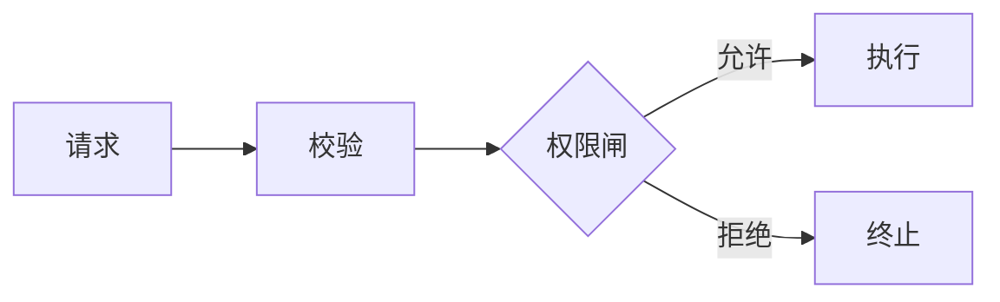

# 七组正反对照

这些例子展示表达模式，不提供任何项目的 current 事实。把占位符替换成真实符号、
仓库相对路径和验证证据后才能写入项目文档。

## 1. 先给结论和阅读路径

弱：

> 本章依次介绍 `cmd/`、`engine/`、`tools/` 和 `server/`。

强：

> 请求从 `<生产入口>` 进入，由 `<核心 owner>` 驱动执行；`<例外入口>` 因
> `<边界原因>` 不经过这条路径。只想定位主循环时，从
> `<StableSymbol>` 开始，并将它链接到仓库相对路径 `path/to/owner.go`。

改进点：先回答“系统如何工作”，目录只作为导航。

## 2. 标题承担导航

弱：`概述` → `详细设计` → `其他`

强：`请求从哪里进入` → `谁拥有执行循环` → `哪些入口故意绕过主循环`

例外：命令参考可以按命令名组织，字段参考可以按实体组织；查找效率高于问题式标题。

## 3. 场景解释因果，枚举支持查找

弱：

> 权限系统包含规则匹配、询问、拒绝记录和限流四个机制。

强：

> 当模型请求执行 `<危险操作>` 时，系统先匹配规则；没有规则才询问用户。
> 用户拒绝后，拒绝被记录；同一操作在限制窗口内再次出现时自动拒绝。
> 结果可通过 `<FocusedTest>` 验证。

若目标是查找四种状态及其 owner，四行映射表反而比故事更好。

## 4. 先建立直觉，再给术语

弱：

> `<EventEmitter>` 负责 sequence、reducer 和 fan-out。

强：

> 所有事件先经过同一个漏斗：编号、更新当前快照，再广播给订阅者。
> 代码中的 `<EventEmitter>` 是这个漏斗的 owner。

## 5. 表格只做精确映射

弱：六列表格，每格放一段背景、理由和风险。

强：

| 入口 | 执行 owner | 是否持久化 |
|---|---|---|
| `<entry-a>` | `<owner-a>` | 是 |
| `<entry-b>` | `<owner-b>` | 否 |

背景和取舍回到正文。确实需要六个比较维度时，保留六列并提供窄屏滚动。

## 6. 一图只答一问

弱：一张图同时画包层级、请求时序、错误恢复、未来计划和部署拓扑。

强：

> 图的问题：一次写操作在哪一步被拒绝？

图注边界：本图只表达权限分支，不表达事件投影、持久化或恢复。

## 7. 分开导航锚点、验证锚点和快照

弱：

> 核心逻辑位于 `owner.go` 的第 183 至 247 行，共有 42 个测试。

强：

> 导航：`<StableSymbol>`，链接到仓库相对路径 `path/to/owner.go`。
> 验证：`go test ./path/to/pkg -run '<FocusedTest>'`。

若计数确实改变决策，把它放进快照：

> 快照（YYYY-MM-DD，范围：`./path/to/pkg`）：`<count>` 个测试；
> 刷新命令：`<command>`。该数字不是长期合同。
