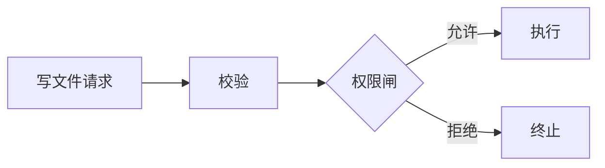

# 写作与绘图模式库

本文件展开“事实与所有权 → 读者任务与结构 → 表达与图示”三层模型。
需要设计章节、示例、图示或载体时读取；简短正反例见
[examples.md](examples.md)。

## 先画事实图，再写目录

为每个关键论断记录四项：

| 论断 | 状态 | 当前 owner | 验证 |
|---|---|---|---|
| `<行为>` | current / gap / plan / reference | `<StableSymbol>` | `<FocusedTest 或命令>` |

多入口系统分别回答：谁组装依赖、谁拥有循环、谁执行副作用、谁持久化、谁只投影。
不要先假设所有入口共享一个内核，再找材料填图。

导航与验证是两种不同需求：

- 导航锚点使用“稳定符号 + 仓库相对链接”，例如把
  `<StableSymbol>` 链接到 `path/to/owner.go`（写入真实文档前替换占位路径）。
- 验证锚点使用聚焦测试、Make target、命令、决策记录或原始数据。
- 行号、计数和基准结果放入带日期、范围和刷新方法的快照。

## 用任务合同约束范围

写作前补全：

```text
<读者> 读完后能 <完成的判断或动作>。
本页解释 <范围>，不解释 <非目标>。
当 <接口、owner 或合同变化> 时，本页需要更新。
```

如果同一页同时教新人、提供操作步骤、列出全部字段并解释设计哲学，先拆页。
教程、操作指南、参考和解释来自不同读者需求，不要求机械映射成固定目录。

## 技艺 1：先给结论，再给路径

导读或解释页的第一屏通常回答：

```text
<系统> 通过 <机制> 解决 <用户问题>。
生产主路径从 <入口> 进入，由 <核心 owner> 负责 <职责>。
<例外入口> 不经过该路径，因为 <边界原因>。
要完成 <常见任务>，从 <稳定符号、章节或操作> 开始。
```

- 段落首句承载结论，证据随后。
- 第一屏通常不放完整目录树、历史沿革、测试总数或待办清单。
- 教程可以先给学习目标；参考页可以先给查找入口，无需强行套三段结构。

## 技艺 2：让标题承担导航

| 空容器（弱） | 可导航标题（强） |
|---|---|
| 架构概述 | 一次请求从哪个入口进入内核 |
| 状态管理 | 四类运行时事实分别由谁拥有 |
| 工具系统 | 写文件前经过哪些安全闸 |
| 其他 | 哪些入口故意绕过主循环 |

- 同级标题保持语法并行。
- 遮住正文只读标题，应能看到主线和查找路径。
- 命令参考、字段字典和实体索引可按实体命名；不要为了“问题式”牺牲查找效率。

## 技艺 3：场景解释因果，枚举支持查找

解释机制的场景通常包含：

1. 用户意图和真实入口；
2. 正常路径中每个关键机制的一次出场；
3. 一个失败、拒绝、取消或恢复分支；
4. 可观察结果和验证锚点。

场景解释“为什么”和“发生什么”，不逐行复述代码。枚举并非反模式：
参考手册、检查清单、状态矩阵和 owner 映射就应该可扫描、可枚举。

## 技艺 4：先建立直觉，再亮术语

```text
所有事件先过同一个漏斗：编号 → 更新快照 → 广播。
代码里的 <EventEmitter> 是这个漏斗的 owner。
```

- 首次出现的术语需要一句解释、上下文铺垫或定义链接。
- 缩写首次出现展开全称，随后保持同一写法。
- 比喻只服务一个直觉；若会隐藏关键差异，紧接着说明边界。

## 技艺 5：表格做精确映射

- 默认三列以内、单元格使用短语，这是一种阅读预算，不是语法规则。
- owner、入口、状态、兼容性和取舍适合表格。
- 单元格开始承载论证时，把理由移回正文。
- 若四列以上都是必要比较维度，保留它们并提供窄屏滚动、固定首列或拆成相邻表格。

## 技艺 6：一图只答一问

按这个顺序：

1. 写下图要回答的问题；写不出则优先用文字或表格。
2. 只保留回答该问题需要的节点和边。
3. 用图题或图注明确范围，并声明未表达的内容。
4. 紧邻图给出文字等价说明。

流程图约七个节点、时序图约五个参与者、两条以上交叉线，都是“考虑拆图”的信号，
不是独立的通过/失败条件。图的复杂度最终由读者任务决定。

图型选择：

- 分支、状态变化 → 流程图；
- 多参与者且顺序重要 → 时序图；
- 静态边界与依赖 → 小型容器图；
- 精确映射或对比 → 表格；
- 单一结论或两步关系 → 通常不用图。

Mermaid 示例：



不只靠颜色编码；类别同时使用文字、形状或分组表达。复杂图必须有完整文字等价说明。

## 技艺 7：稳定主线与易腐快照

| 用途 | 首选锚点 | 备注 |
|---|---|---|
| 导航 | 稳定符号 + 仓库相对链接 | 符号可 grep，链接可点击 |
| 验证 | 测试、Make target、命令、原始证据 | 必须说明范围 |
| 快照 | 行号、数量、一次性基准 | 标日期、范围、刷新方法 |

核心章节可以写失效信号：“若 `<接口或 owner>` 被移除，本节需要重新核对。”

## 载体选择

默认 Markdown：可 diff、可检索、适合仓库内长期维护。

仅当并排对照、筛选、折叠长证据、打印或响应式呈现有实际收益时使用 HTML。
HTML 最低合同：

- 关闭 JavaScript 后核心内容仍完整；
- 有正确 `lang`、viewport、语义结构和单一 `h1`；
- 图使用 `<figure>` / `<figcaption>` 或等价语义；
- 窄屏不产生页面级横向滚动，宽表在局部容器滚动；
- 支持键盘、打印和 `prefers-reduced-motion`。

如果 HTML 只是给 Markdown 加卡片、阴影和动画，保留 Markdown。

## 压缩检查

逐段问：

1. 这段改变读者的判断或下一步吗？
2. 它是本页 owner 的事实，还是别处事实的副本？
3. 删除数字和行号后，结论是否仍成立？
4. 能否用具体动词替换抽象名词？
5. 能否收敛成结论句加一个证据链接？

“更短”不等于删除权限、取消、持久化、恢复或兼容性边界。

## 外部方法与本地采用边界

- [Diátaxis](https://diataxis.fr/)：四种文档形态对应不同用户需求；本 skill 采用
  “一页一个主形态”，不要求固定目录结构。
- [Google headings](https://developers.google.com/style/headings)：描述性标题与一致层级。
- [Google Technical Writing One summary](https://developers.google.com/tech-writing/one/summary)：
  段落围绕中心点、偏好主动语态和清晰句子。
- [GitHub quickstart content type](https://docs.github.com/en/contributing/style-guide-and-content-model/quickstart-content-type)：
  quickstart 以约五分钟完成、约 600 词为目标；“第一屏给路线”是本 skill 的本地写作策略，
  不是 GitHub 的原句。
- [C4 diagram checklist](https://c4model.com/diagrams/checklist)：采用图的标题、类型、
  范围、关键元素描述和图例；节点数量预算是本 skill 的启发式。
- [Mermaid accessibility](https://mermaid.js.org/config/accessibility.html)：使用可访问标题与描述。
- [W3C Images Tutorial](https://www.w3.org/WAI/tutorials/images/)：复杂图提供完整文字等价说明。
