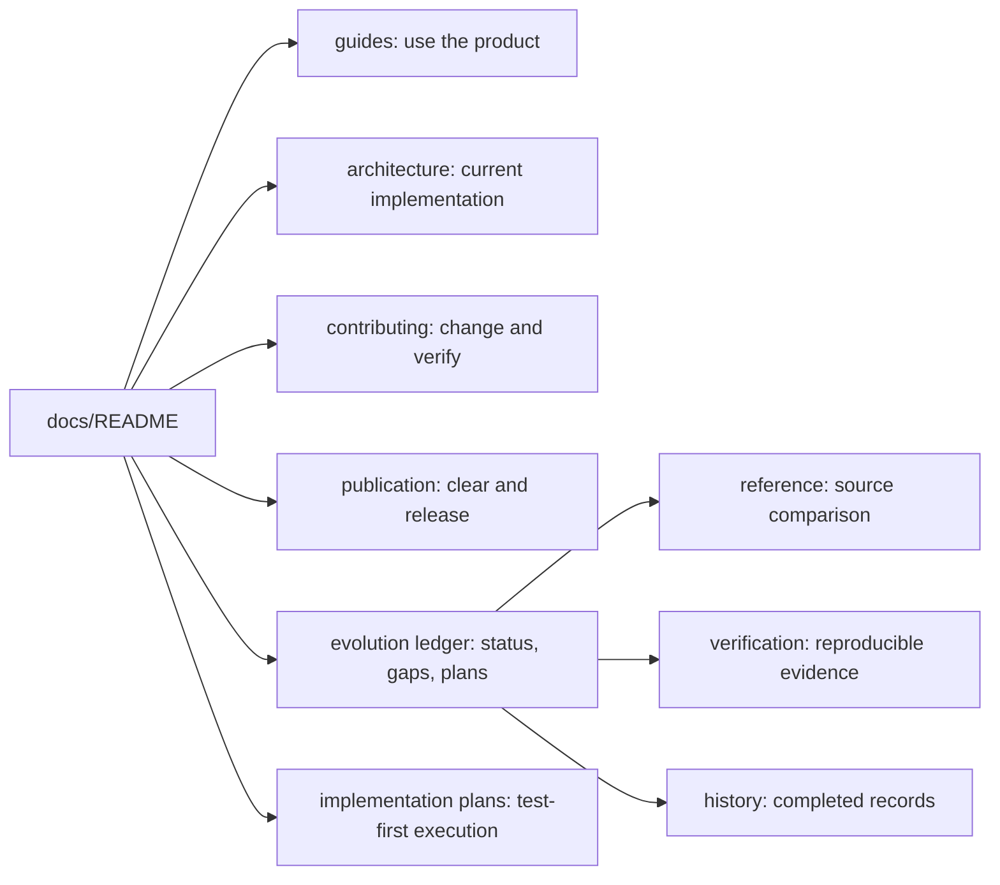

# YHC Documentation

**Status:** current
**Last verified:** 2026-07-17

> **Ownership:** documentation entrypoint and role-based reading routes

Use this page as the only documentation front door. The repository
[`README.md`](../README.md) remains the short product overview; detailed use,
implementation, evolution, research, verification, and history live here.
Product scope, reference roles, and adoption decisions are owned by
[`PROJECT_DIRECTION.md`](../PROJECT_DIRECTION.md).

## Choose a route

| You want to... | Start here | What it owns |
|---|---|---|
| Install, configure, and use the agent | [`guides/`](guides/README.md) | Task-oriented user and operator workflows |
| Understand or change current code | [`architecture/`](architecture/README.md) | Current runtime, module ownership, data flow, invariants, and code references |
| Contribute and verify a change | [`contributing/`](contributing/README.md) | Repository workflow, documentation policy, and validation gates |
| Audit or publish the public source tree | [`publication/`](publication/README.md) | Source clearance, provenance, privacy review, and clean-root release boundaries |
| Continue tracked product evolution | [`migration/`](migration/README.md) | Verified status, unresolved gaps, accepted plans, and the historical reference ledger |
| Execute an approved implementation plan | [`superpowers/`](superpowers/README.md) | Task-level test-first steps subordinate to the accepted migration contract |
| Inspect comparative reference evidence | [`migration/reference/`](migration/reference/README.md) | Time-scoped research, not current product truth or automatic scope |
| Reproduce TUI or evolution evidence | [`migration/verification/`](migration/verification/README.md) | Commands, fixtures, and measured budgets |
| Understand how completed work was delivered | [`migration/history/`](migration/history/README.md) | Historical plans, maps, and closeout records |

## Recommended reading paths

### New user

1. [`Getting started`](guides/getting-started.md)
2. [`Configuration and providers`](guides/configuration-and-providers.md)
3. [`Interaction modes and commands`](guides/interaction-modes-and-commands.md)
4. [`Permissions and safety`](guides/permissions-and-safety.md)

### Runtime contributor or coding agent

1. [`Current architecture`](architecture/README.md)
2. [`Production code map`](architecture/code-map.md)
3. The affected runtime, capability, platform, state, or TUI document
4. [`Contribution workflow`](contributing/README.md)
5. [`Verification`](contributing/verification.md)

### Product-evolution maintainer

1. [`Project direction`](../PROJECT_DIRECTION.md)
2. [`Evolution process`](migration/GUIDELINE.md)
3. [`Verified status`](migration/STATUS.md)
4. [`Unresolved gaps`](migration/REMAINING.md)
5. [`Accepted execution order`](migration/PLAN.md)
6. The affected current architecture document
7. Reference or history only when the decision needs that evidence

## Truth and precedence

Current source and tests outrank prose. Within the documentation tree:

1. `PROJECT_DIRECTION.md` owns product objective and reference-adoption rules.
2. `architecture/` owns current implementation behavior.
3. `migration/STATUS.md` owns verified evolution facts and volatile counts.
4. `migration/REMAINING.md` owns unresolved gaps.
5. `migration/PLAN.md` owns accepted execution order.
6. `reference/` and `history/` never override a current architecture owner.

The complete ownership, naming, lifecycle, and code-reference rules are in
[`documentation-policy.md`](contributing/documentation-policy.md).

## Maintenance rule

Every Markdown document must be reachable from this page through a directory
index. If a document has no reader route, either add it to the correct index,
move it to its real lifecycle owner, merge it, or delete it and rely on Git
history.
