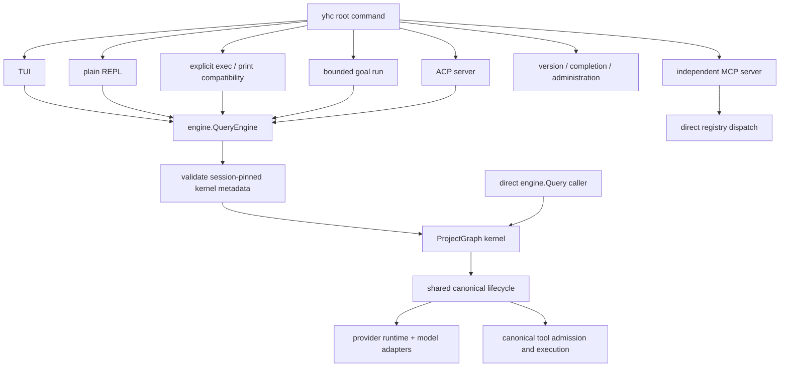

# Current Runtime Architecture

**Status:** current
**Last verified:** 2026-08-07

> **Ownership:** Runtime composition, entrypoints, and cross-subsystem boundaries

## Purpose

This document is the composition-root map for the runtime that ships today. It
describes ownership and cross-subsystem call paths. Detailed documents are
grouped by the kind of change being made, not by an artificial global number.

Production traversal has one owner: the project-owned Eino Compose Graph.
Every new `QueryEngine` session and direct `engine.Query` call enters that
Graph. Session metadata still pins `project_graph/v1` plus its durable stage
between turns and across resume. Historical `legacy/v1` and transcripts
without kernel metadata remain inspectable/exportable but fail closed before a
model request, tool side effect, session mutation, or transcript rewrite; they
are never silently reinterpreted through Graph. The Eino ADK evidence adapters
and the imperative `queryLoop` have both been retired, and there is no fallback
execution kernel.

## Read by task

| Goal | Start here |
|---|---|
| Follow one model/tool turn | [`runtime/`](runtime/README.md) |
| Change permissions, hooks, tools, commands, skills, plugins, or MCP | [`capabilities/`](capabilities/README.md) |
| Change config, provider routing, entrypoints, onboarding, notifications, or services | [`platform/`](platform/README.md) |
| Change sessions, transcripts, result offload, or memory files | [`state/`](state/README.md) |
| Change terminal UI, replay, composer, queue, or terminal lifecycle | [`tui/`](tui/README.md) |
| Change Goal state, continuation, or entrypoint exposure | [`runtime/query-engine.md`](runtime/query-engine.md) and [`platform/entrypoints-and-transports.md`](platform/entrypoints-and-transports.md) |
| Find the owner for a Go package | [`code-map.md`](code-map.md) |
| Use the product rather than modify it | [`guides/`](../guides/README.md) |

## Core vocabulary

| Term | Meaning |
|---|---|
| Session | Durable conversation identity, transcript, execution metadata, and optional resumed lineage. |
| Thread | One leader or child-Agent conversation projection inside a session. |
| Turn | One submitted input and its model/tool iterations until a terminal decision. |
| Task | Process-local work item tracked by the active task manager; not synonymous with a model turn or durable Agent transcript. |
| Agent | Child coding-agent execution with its own identity, lifecycle, transcript, and controls. |
| Command | Slash-command input resolved before ordinary model submission. |
| Transcript | Durable JSONL conversation authority; distinct from prompt-recall history and bounded runtime state. |
| Runtime snapshot | Bounded engine-owned read model derived from events for TUI/ACP consumers. |

## Composition roots

- The default command chooses TUI or plain REPL; explicit `exec` and root
  `--print` compatibility use the same headless owner. The dedicated
  `goal run` process resumes and bounds an existing Goal without slash
  dispatch. Conversation modes build a `QueryEngineConfig`, create one
  `QueryEngine`, and submit turns or exact Goal continuations to it.
- `version` and `completion` initialize no model runtime or `QueryEngine`.
  `sessions` creates a provider-free administration `QueryEngine` only to host
  the existing `SessionService`; it enters no model turn or ProjectGraph.
- `config show`, `doctor`, `mcp {list,get}`, and
  `plugins {list,validate,reload}` create a separate short-lived inspection
  host. It reuses the diagnostic, MCP inventory, and prompt-generation owners
  without constructing a provider runtime, connecting MCP, compiling the
  Graph, or starting long-lived services.
- ACP owns one `QueryEngine` per ACP session and translates engine events to
  protocol notifications.
- `serve mcp` is an independent tool server. It creates a registry and invokes
  tool executors directly; it does **not** enter `QueryEngine` or ProjectGraph.
  Its `MCP_PERMISSION_MODE` and `MCPToolHook` are therefore a separate policy
  surface, not substitutes for QueryEngine rules, hooks, repeated-call guards,
  recovery, transcripts, or runtime events.

## Runtime ownership

| Owner | Current responsibility |
|---|---|
| CLI / ACP composition roots | Resolve config and provider for conversation entrypoints, construct registries and managers, choose transport-specific prompts and permissions, or construct provider-free sessions/inspection administration hosts. |
| `QueryEngine` | Conversation/session state, subsystem lifetime, permission coordination, transcript/checkpoint ownership, durable kernel-version validation, runtime read model, and turn submission. |
| `Query` / ProjectGraph kernel | One shared compiled `compose.Graph` owns typed prepare/model/reconcile/tool/finalize traversal for direct calls and every supported Session. Its live runtime is invocation-local and its Compose state is plain reconstructable data. |
| Canonical round lifecycle | Preparation, model, after-model, tool, and after-tool functions own compact/recovery, model/tool, runtime-input safe points, reinjection, and terminal policy beneath the single Graph traversal. |
| `tools.Registry` | Complete dispatch inventory, including registered MCP tools. |
| Model-visible tool projection | Filtered, deterministic view of the registry, recomputed only at query/turn boundaries. |
| `engine/provider.Runtime` | Provider resolution plus eager main-route and lazy alternate-route creation. |
| `turnEventEmitter` | Event envelope, reducer application, and ordered publication to consumers. |

## Canonical ordering contracts

### Tool calls

The canonical admission boundary is `engine.executeToolCall`, for both streamed
and batch-completed tool calls:

1. Parse JSON, resolve the registry entry, coerce semantic scalar types, and run
   schema plus tool-specific validation.
2. Apply plan-mode filtering and the query-local repeated-identical-call guard.
3. Run pre-tool hooks; hook input updates become the permission input.
4. Apply QueryEngine permission policy. Hook `allow` cannot bypass an explicit
   deny rule.
5. Execute the tool, collect tool attachments, optionally offload a large
   result, and record file state.
6. Run post-tool or post-tool-failure hooks and build the final tool result.

Lower-level helpers in `engine/execution` do not own this policy.

### Runtime events

`turnEventEmitter` serializes event sources for a submitted turn. It decorates
the event and applies it to the engine-owned runtime state before sending it to
the public channel. Consumers therefore observe an event only after its state
transition has been attempted. Lossless event classes block on publication;
other classes retain context-cancelled best-effort delivery.

### Pre-model context

The current order is defined by `runCanonicalRoundPreparation`: async-hook messages; compact
boundary selection; tool-result budgeting; snip, microcompact, and collapse;
system-context append; optional auto/reactive compaction and reinjection;
content-replacement budgeting; user-context prepend; API normalization; model
call. Queue, attachment, memory-prefetch, and skill-prefetch results are added
after a tool round and enter the next iteration's prepared messages.

## Binary closure and disconnected packages

Package presence is not runtime reachability. The exact `cmd/yhc`
dependency closure, wiring label, owner, and outside-closure inventory belong
to [`code-map.md`](code-map.md). In particular, `engine/errors` is now reachable
through CLI abort classification, while similarly named library packages can
still remain disconnected. Do not infer production policy from a directory or
exported type alone; verify a composition-root call path.

## Code references

- [`runRoot`, `runTUI`, and `runPlainREPL`](../../cmd/yhc/cmd/root.go)
- [`runHeadless`](../../cmd/yhc/cmd/headless.go)
- [`runServeACP`](../../cmd/yhc/cmd/serve_acp.go)
- [`runServeMCP`](../../cmd/yhc/cmd/serve_mcp.go)
- [`QueryEngine`, `QueryEngineConfig`, and `NewQueryEngine`](../../engine/engine.go)
- [`queryKernelForTurn`](../../engine/query_kernel_selection.go)
- [`NewSessionAdministrationEngine`](../../engine/session_administration.go) and [`NewInspectionAdministrationEngine`](../../engine/inspection_administration.go)
- [`Query`](../../engine/query.go), [`queryKernel`](../../engine/query_kernel.go), and [`newProjectGraphQueryKernel`](../../engine/graph_query_kernel.go)
- [`runCanonicalRoundPreparation`](../../engine/round_lifecycle.go)
- [`executeToolCall`](../../engine/tool_execution.go)
- [`turnEventEmitter.Emit`](../../engine/runtime_events.go)
- [`server/mcp.Serve`](../../server/mcp/server.go)

## Canonical tracking

Migration sequencing belongs in [`migration/PLAN.md`](../migration/PLAN.md),
open gaps in [`migration/REMAINING.md`](../migration/REMAINING.md), and source
comparison in [`migration/reference/`](../migration/reference/README.md). This
document intentionally does not duplicate those trackers.
