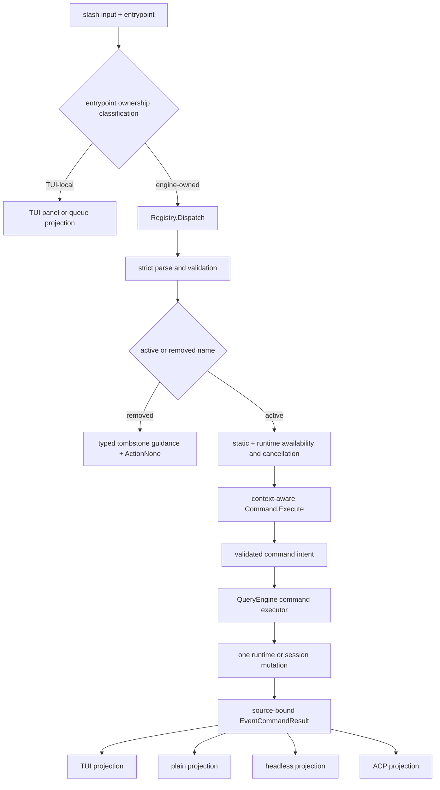

# Slash Commands

**Status:** current
**Last verified:** 2026-08-07

> **Ownership:** This file owns current slash-command registration, discovery,
> dispatch, typed action application, and entrypoint filtering. Executable
> process flags, stdin/stdout, exit codes, and administration subcommands belong
> in [`entrypoints-and-transports.md`](../platform/entrypoints-and-transports.md).
> Plugin discovery and contribution
> wiring belong in [`plugins.md`](plugins.md); future command-product changes
> belong in [`migration/PLAN.md`](../../migration/PLAN.md) and the accepted
> P21 is closed; its delivery evidence is retained in
> [`migration/history/runtime/p21-command-surface-simplification.md`](../../migration/history/runtime/p21-command-surface-simplification.md).

## Current Answer

Every `QueryEngine` owns one `commands.Registry`. Its canonical record now
declares identity, category, primary/secondary discovery tier, display order,
idle/active-turn phase scope, entrypoints, static and runtime-resolved
availability, dependency, side-effect, result shape, compatibility, argument
schema, execution owner, and a `context.Context`-aware handler. After an
entrypoint classifies local ownership, `Registry.Dispatch` is the only strict
parse, validation, live phase/capability revalidation, cancellation, and
execution boundary; the test-only `CommandDispatcher` has been removed.

The registry contains exactly 40 executable compiled core commands. A separate
catalog contains 27 canonical removed-command tombstones and reserves 33
canonical-or-alias keys without making any of them executable or discoverable.
The default embedded workflow pack contributes 2 additional TUI/plain prompt
commands, so the ordinary active snapshot contains 42 commands and its
maximum static discovery is 42 for TUI, 32 for plain, 18 for headless, 14
for ACP, and none for CLI administration or the dedicated headless Goal
entrypoint. Contextual discovery may narrow those sets. During an active TUI
turn only `/agent`, `/team`, `/keybindings`, and
`/queue` remain reachable; other entrypoints expose no active-turn slash
projection. `/effort` is omitted when the active resolved provider/model does
not support the exact request field, and `/copy` is omitted without an
interactive clipboard-capable TUI. One engine command executor now
applies each engine-owned runtime/session action exactly once after validating
its typed payload. It emits one losslessly delivered `EventCommandResult` that
TUI, plain, headless, and ACP project without repeating the mutation; bounded
runtime replay retains its typed identity and status fields. TUI selectors and
panels remain entrypoint-owned presentation. Standalone MCP exposes tools and
has no slash runtime.



## Registry Contracts

| Type | Current responsibility | Current limitation |
|---|---|---|
| `Command` | Canonical identity/help, source/version/trust attribution, category, primary/secondary tier, display order, phase scope, kind, entrypoint set, static availability plus an optional runtime resolver/reason, dependency, side-effect, result kind, compatibility, argument schema, execution owner, and context-aware handler. | CLI administration calls the same service/read-model owners directly; it does not register a second slash-command set. |
| `RemovedCommand` | Canonical removed name, aliases, reason, replacement guidance, and removal boundary without an executable handler, entrypoint, or discovery metadata. | It preserves deterministic migration guidance, not a hidden capability or future implementation promise. |
| `Registry` | Separate collision-safe active and removed catalogs, immutable ordered discovery snapshots, strict quote-aware parsing, contextual phase/capability availability, validation, cancellation, handler execution, and atomic prompt-command generation replacement. | It produces command intents or typed removal guidance; it does not own runtime/session mutation. |
| `CommandContext` | Dispatch context plus typed entrypoint/idle-or-active-turn environment, CWD, detached active workspace roots, session/model/messages, engine, normalized input, parsed args, and optional extra values. | Legacy inner executors still receive a joined argument string after canonical parsing. |
| `CommandResult` | Text/prompt output, action enum, structured intent payload, typed removed-command metadata, explicit alias compatibility warning, and validated required/optional string/bool accessors. | The payload bridge remains until later command subsets replace remaining legacy fields with dedicated intents. |
| `EventCommandResult` | Losslessly delivered command, action, status, output, error, and follow-up-prompt outcome. | Runtime replay retains bounded typed fields; this is not a durable transcript-schema migration. |

`Registry.Dispatch` trims the complete input, lowercases the parsed name,
rejects unterminated quotes and trailing escapes, preserves quote boundaries
in `CommandContext.Args`, populates the live engine context, checks entrypoint
plus the same typed phase and runtime-capability rules used by discovery,
invokes `ValidateArgs`, and only then calls the context-aware handler. Dispatch
rebuilds the effective entrypoint environment and re-evaluates the rules from
its current context; it does not authorize execution from an earlier discovery
snapshot. Cancellation is checked before handler execution and the same
context is stored in
`CommandContext.Context`. Permission rule mutations consume the parsed
arguments, so a rule such as `"Bash(rm -rf *)"` remains one value.

Registration normalizes canonical names and aliases before checking the live
snapshot. Active and removed names reject exact unqualified collisions in both
directions before any candidate is installed. Removed canonical names and old
aliases also reserve the unqualified dynamic namespace, while a qualified
configured plugin name such as `plugin:bug` remains independent.
`ResolveForContext`, `GetForContext`, and
`ListForContext` resolve runtime availability while `Get`, `GetFor`, `List`,
and `ListFor` retain active static inspection. `GetRemoved` and `ListRemoved`
inspect only tombstones. Every lookup returns cloned records so a caller cannot
mutate registry truth after lookup.

Bundled workflows and configured plugin prompt commands are generation-bound.
The loader validates the embedded pack plus every configured source and
command, aggregates diagnostics, qualifies plugin canonical names and aliases,
and returns one complete candidate with a functional digest.
`ReplacePromptCommandGeneration` performs the final core/name/alias collision
checks and swaps command map, order, revision, digest, sources, and diagnostics
under one registry lock. Their content executes as `ActionPrompt` model input.
A rejected candidate leaves the complete previous generation live. Core static
commands have precedence over the unqualified bundled pack; configured plugins
remain qualified as `<plugin>:<command>`. Detailed help renders each command's
source and trust class.

`/tasks`, `/agents`, `/skills`, `/mcp`, and `/hooks` consume one
`QueryEngine.RuntimeInspectionSnapshot` call. It aggregates detached read
models from the engine-owned Agent/task, skill, MCP, hook, and prompt-command owners;
it does not promise a cross-subsystem transaction. Each contributing owner
does promise an internally stable snapshot or generation. Mutation-shaped task
and MCP arguments are rejected before manager side effects.

## Entrypoint Projection

| Entrypoint | How it dispatches | Current observable boundary |
|---|---|---|
| TUI | Discovery, help, completion, palette, and dispatch use the TUI-filtered registry snapshot. `/search`, `/team`, `/queue`, `/keybindings`, `/terminal`, and capability-gated `/copy` are registered TUI-only commands whose panels, diagnostics, or side effects remain local. | Engine-owned commands enter `QueryEngine`; the TUI only projects the typed result and local presentation. |
| Plain REPL | Uses the plain-filtered registry snapshot. Engine-owned commands, including runtime-gated `/goal`, enter `QueryEngine`; entrypoint-owned presentation/workflow actions remain local. | TUI-only commands are excluded before handler execution; enabled saved-root Plain shares Goal command authority but not TUI panels. |
| Headless `exec` / compatibility `-p` | Passes input through a headless-configured `QueryEngine`; lifecycle, model, effort, plan, permissions, diagnostics, `/diff`, `/files`, and explicit `/add-dir` are in scope when contextual capability admits them. | One text/JSON renderer projects typed success and stable failure/cancellation status. Prompt workflows and TUI-only commands remain outside this projection. |
| Dedicated headless Goal | `yhc goal run` resumes an exact saved Session and calls only the engine's dedicated Goal continuation claim/submission boundary. It does not dispatch slash input. | Requires an explicit Session and positive continuation limit; emits one final text/JSON `goal_run` result and exits `0` only for durable Goal completion. |
| ACP | Passes prompt text through an ACP-configured session `QueryEngine`; clear, compact, model, effort, plan, permissions, diagnostics, `/diff`, `/files`, and explicit `/add-dir` are in scope when contextual capability admits them. | Slash `/sessions` and identity-changing slash `/new`, `/resume`, and `/fork` fail registry admission before mutation; explicit ACP protocol list/load/resume/fork remains protocol-owned. |
| CLI administration | `sessions {list,resume,rename,export,fork,delete,recover-workboard}` calls the existing `SessionService`; `config show`, `doctor`, `mcp {list,get}`, and `plugins {list,validate,reload}` call the existing diagnostic, inventory, candidate-validation, and atomic-generation owners. | The provider-free hosts open no TUI or model/Graph turn. Delete is exact owned-artifact cleanup. WorkBoard recovery requires exact Session/Board/revision identity plus explicit data-loss acknowledgement and is not exposed to slash, ACP, tools, hooks, or standalone MCP. MCP is configuration-only with `unprobed` health; plugin reload changes only its short-lived inspection process. |
| Standalone MCP | Does not use `QueryEngine` or the slash registry. | Tool server only; slash parity does not apply. |

`/goal` is an engine-owned, idle-only TUI/Plain command whose runtime
availability requires the saved-root Goal capability and excludes Plan.
Bare `/goal` reads the detached state; explicit objective, edit, pause, resume,
clear, and positive-budget forms carry typed intent into the same Goal
transition owner. `/goal OBJECTIVE` becomes active immediately and emits its
initial turn even without a budget; an explicit resume can also reactivate a
paused nil-budget Goal. Ordinary headless, dedicated headless Goal, ACP,
administration, child/review, ephemeral, disabled, and standalone MCP contexts
never discover or execute the slash command.
An explicitly enabled ACP Session may instead expose the negotiated private
Goal v1 extension. That protocol surface calls the same engine transition and
continuation owners but never enters slash discovery or dispatch; see
[`acp-adapter.md`](../platform/acp-adapter.md#protocol-and-sdk-boundary).

## Process Projection Boundary

Slash commands are only one input class projected by a conversation
entrypoint. Dedicated `goal run`, provider-free administration, standalone MCP,
and build/completion processes do not dispatch through this registry. Headless
and ACP may dispatch only the slash subset admitted by their contextual
snapshot; their flags, stdin/stdout schemas, protocol negotiation, and exit
codes are owned by
[`entrypoints-and-transports.md`](../platform/entrypoints-and-transports.md).

A slash command rejected before runtime-turn admission returns typed
caller-only feedback with an empty runtime envelope. It is intentionally not
reducer state or replay input because another turn may still own that
session/thread. Admitted engine-owned commands publish source-bound, sequenced
results after exactly one validated mutation.

## Removed Compatibility Catalog

| Removed command/boundary | Current behavior | Compatibility boundary |
|---|---|---|
| `/plugin`, `/bug` (`/feedback`), `/undo`, `/rewrite` (`/retry`), `/branch`, `/rewind` | Absent from active lookup/help/palette; direct dispatch returns the P21.0 tombstone and `ActionNone`. | Guidance routes plugin management to `/reload-plugins` or provider-free inspection, feedback to an owned external channel, undo/rewrite to corrected input or `/fork` before more work, branch to `/fork [name]`, and rewind to Git/workspace recovery. No dead handler remains. |
| `/color`, `/fast`, `/tag`, `/share`, `/release-notes` | Absent from active discovery; their old action and renderer branches are deleted. | Guidance points to `/theme`, explicit `/model`, `/sessions rename`, `/sessions export`, or `/version` plus authoritative release artifacts. |
| `/mode`, `/bypass`, `/yolo` | Reserved tombstones; the TUI cannot pre-apply them. | `/permissions mode ...` and the exact `/permissions bypass confirm` form are the canonical typed safety surface. |
| `/agent`, `/team`, `/queue`, `/search` | Supported only in the TUI-filtered snapshot. Other entrypoints reject them at the registry scope boundary before a local action can execute. | `/agents` and read-only `/tasks` remain the portable runtime vocabulary; search/thread pickers remain TUI projections. |
| `/login`, `/logout`, `/env`, `/output-style`, `/session` (`/remote`) | Former hidden records are now tombstones only. | Guidance keeps authentication/credential ownership outside the project, points diagnostics to `/doctor` or `/config`, output style to project config, and legacy session access to `/sessions`. |
| `/stats` (`/cost`), `/settings`, `/allowed-tools`, `/bashes` | Expired aliases no longer execute `/usage`, `/config`, `/permissions`, or `/tasks`. | Direct dispatch returns replacement guidance; stable `/reset`, `/exit`, `/ctx`, and `/teams` aliases remain warning-free. |
| `/summary`, `/onboarding`, `/pr-comments`, `/issue`, `/commit-push-pr` (`/cpr`) | Removed from the P21.2 default workflow pack and absent from active discovery. | Guidance keeps summaries as ordinary requests, reserves `/compact` for compaction, points onboarding to `/init`, and keeps issue/PR/push operations behind explicit requests or qualified configured-plugin workflows. |
| `/history`, `/rename`, `/export` | Removed from registration and direct dispatch at P16.7b. | Canonical interactive use is `/sessions`; provider-free process use is `yhc sessions ...`. |

## Layered And Phase-Aware Discovery

P21.1 gives help, command completion, and the palette one typed contextual
projection. Every reachable command carries one of eight ordered categories:
Session, Runtime, Safety, Workspace, Agents, Extensions, UI, or Workflow.
`/help` and the TUI help overlay retain primary and secondary capabilities,
group them by category, and order each group by `DisplayOrder` then canonical
name.

An empty-query TUI palette is intentionally bounded. It shows at most three
process-local Recent selections that remain reachable, followed by the
deduplicated primary order:

```text
new compact sessions model plan permissions
status diff files agents review commit
```

Typing searches every currently reachable primary and secondary command by
name, alias, and description. Configured prompt commands default to secondary;
dynamic palette rows retain source and trust attribution. Recent state belongs
only to one `CommandPalette`, is newest-first and deduplicated. Palette Enter
revalidates the contextual snapshot and creates App-owned process-local
provenance instead of recording eagerly. Engine-owned selections bind that
provenance to the exact live TUI `queryID`; single and batched result wrappers
commit once only after a matching successful typed result has passed the
existing TUI action projection. TUI-local selections use a separate monotonic
submission identity and commit only after strict dispatch and the existing
local action owner accepts and applies the action. The asynchronous clipboard
action additionally binds the exact clipboard request and waits for its typed
confirmed-success result.

Failed, unsupported, cancelled, missing, stale, superseded, mismatched, or
duplicate results clear or cannot match the pending provenance. Replay,
async-hook delivery, typed or queued manual same-text input, and non-palette
entrypoints cannot create or inherit it. Durable `CommandResultEvent`,
registry execution, cancellation policy, and non-TUI entrypoint schemas remain
unchanged. Delivery evidence is in the
[`G27 closeout`](../../migration/history/tui/g27-result-bound-command-recency.md);
the original reproduction and adoption boundary remain in the
[`recent-delivery remediation audit`](../../migration/reference/runtime/recent-delivery-remediation-audit.md#repair-contract-g27-result-bound-recent-commands).

The typed phase environment defaults to idle. During an active TUI turn only
`/agent`, `/team`, `/keybindings`, and `/queue` are discoverable. A command
seen while idle but dispatched after the phase changes is revalidated by
`Registry.Dispatch` and fails with `ActionNone` before its handler. This does
not broaden plain, headless, ACP, administration, or standalone MCP ownership.

The closed P21 program left the embedded pack with only
`/commit` and `/review`. The five removed canonical workflows and `/cpr` alias
return typed P21.2 guidance, while qualified configured-plugin commands remain
independent. Its cross-entrypoint delivery evidence is retained in
[`migration/history/runtime/p21-command-surface-simplification.md`](../../migration/history/runtime/p21-command-surface-simplification.md).

## Truthful Diagnostics

`/status`, `/context`, `/usage`, `/config`, and `/doctor` call one detached
`QueryEngine.DiagnosticsSnapshot`. The snapshot is renderer-neutral and every
field carries one of `known`, `unavailable`, `stale`, or `refreshing`, plus its
source and observation time. TUI, plain, headless, and ACP therefore project
the same output instead of rediscovering provider, transcript, or configuration
state.

- `/status` is a compact runtime/session/provider summary and links to the four
  detailed commands;
- `/context` counts active message roles and tool calls, reports the latest
  persisted provider input usage only when present, and marks per-request
  system/tool/prefetch contributors unavailable instead of estimating them;
- `/usage` aggregates persisted provider `ResponseMeta.Usage` across ordinary
  messages and cumulative lifecycle snapshots. Missing metadata and corrupt or
  legacy boundaries degrade coverage explicitly. `/stats` and `/cost` are
  expired tombstone names that guide to `/usage` without executing it; no price
  is rendered without an authoritative provider/model billing catalog;
- `/config` resolves the active provider route through the injected runtime,
  reports per-field winning sources and precedence, renders credential presence
  as a boolean, and reduces an endpoint to scheme plus host. `/settings` is an
  expired tombstone name that guides to `/config`; and
- `/doctor` emits a stable ordered check-ID set for engine, provider route and
  credential, transcript, bounded JSON settings files, tools, permission mode,
  and connectivity. Connectivity is explicitly skipped because the read-only
  command performs no provider request.

`yhc config show` and `yhc doctor` reuse the same snapshot and
text renderers without constructing `provider.Runtime`. Their JSON results
carry the same typed configuration or doctor payload inside the shared
administration envelope. Invalid effective configuration fails `config show`;
`doctor` still returns its ordered checks and reports the invalid settings
source as a failed check. The inspection host has no active Session transcript,
so that check is explicitly `skipped` rather than synthesized or reported as a
storage failure.

The TUI status line uses the same provider-reported usage principle and a known
model window. It no longer estimates context from character count, renders a
generic dollar price, or opens a price-derived warning. `/login` is reserved as
a non-discoverable tombstone until the project owns an authentication flow.

`/new` is a canonical durable-session command, not an alias for `/clear`.
It creates and commits a fresh empty identity before activation, while
`/clear` keeps the current identity and appends a reset boundary. `/reset`
remains the only temporary clear alias.

`/sessions` is the canonical session surface:

```text
/sessions [list [limit]]
/sessions search <query> [limit]
/sessions resume <session-id>
/sessions rename <session-id|current> <name>
/sessions export <session-id|current> [filename]
```

List/search, direct/startup resume, the provider-free sessions CLI, and the TUI
no-argument resume picker all use the engine-owned `SessionService`. Export
reads the durable active transcript and writes Markdown through a
temp-file/sync/rename boundary; the removed TUI renderer is no longer a second
content owner.

`/fork [name]` also uses `SessionService`. One operation identity selects one
deterministic child, whose copied active context, lineage, branch name, and
complete execution metadata commit through a synced no-clobber install before
activation. TUI picker fork mode calls the same service. ACP keeps slash fork
unavailable and projects the equivalent lifecycle only through its explicit
protocol operation, registering the child handle after durable restore.

## Execution And Safety Controls

`/model`, `/effort`, `/plan`, and `/permissions` converge on engine-owned
control methods instead of entrypoint-local mutation:

- model changes resolve the requested provider/model route before mutation;
  an invalid route leaves model and effort unchanged, while a successful
  incompatible switch clears process-local effort and checkpoints the
  effective model;
- effort accepts `default`, `low`, `medium`, `high`, and `max`, is discoverable
  only for a resolved Agentic Claude route whose model capability supports
  thinking, and controls the provider request field rather than the unrelated
  continuation `TokenBudget`;
- plan and permission mode transitions serialize with the active engine turn,
  mutate once, and rewrite command output from the effective engine state;
- permission rules use typed `list`, `add`, and `remove` operations, and bypass
  requires the exact `/permissions bypass confirm` command or an equivalent
  explicitly confirmed TUI action;
- direct TUI and ACP controls call the same engine methods and fail without
  mutation while another turn owns the transition. ACP advertises current
  model/effort options and permission mode, then emits protocol updates after a
  successful change.

Reasoning effort is intentionally process-local in this slice. It is not
restored from a transcript and is omitted on an incompatible fallback route.
The deprecated source-compatible `SetModel(string)` adapter remains for
embedded callers; it reuses `ChangeModel` and therefore fails closed when no
resolver is installed or another turn owns the boundary.

## Workspace And Terminal Capabilities

Workspace inspection, root mutation, prompt workflows, and terminal actions
have distinct owners:

| Command | Owner and entrypoints | Current contract |
|---|---|---|
| `/diff [stat|full|staged]` | Engine; TUI, plain, headless, ACP | Calls the injected, cancellable read-only Git runner. Non-Git, missing runner, command failure, timeout, and cancellation remain distinct outcomes. The default runner clears repository-redirect environment variables, disables optional locks, external diff, text conversion, and fsmonitor, and handles repositories without an initial commit. |
| `/files` | Engine; TUI, plain, headless, ACP | Reads only committed message tool-call arguments, resolves every path through the permission path resolver, deduplicates canonical paths, and omits paths outside the detached active-root snapshot. |
| `/add-dir PATH` | Engine action; TUI, plain, headless, ACP | Expands the exact home form, resolves symlinks to an existing canonical directory, rejects unsafe/non-directory paths, and updates the active root set once under the turn-control lock. Existing roots cover nested duplicates. The final command checkpoint persists the canonical additional root. |
| `/copy [N]` | TUI only | Contextual discovery and dispatch require the interactive terminal capability. The handler selects only a committed assistant message and returns a typed copy action; the TUI owns OSC 52/native clipboard projection. No temp file is written. |
| `/init [--force]` | Prompt workflow; TUI and plain | Produces a project-native `AGENTS.md` workflow. The handler performs no Git or filesystem inspection or mutation; the follow-up must use ordinary Agent tools and permissions. |
| `/memory` | Prompt workflow; TUI and plain | `status`/`browse` read the active instruction-memory inventory. `edit project`, `delete project`, and `migrate project` are the only mutation forms and return ordinary tool workflows; arbitrary paths and implicit editor launches are absent. |
| `/commit`, `/review` | Bundled prompt workflows; TUI and plain | Loaded from the versioned embedded workflow pack and executed as ordinary model prompts. Git, filesystem, or external-service effects still pass through normal tools and permissions; disabling the pack removes only these workflows. Removed defaults return typed guidance instead of executing a prompt. |

`/keybindings`, `/terminal`, `/search`, and `/copy` are absent from plain,
headless, and ACP discovery. `/terminal-setup` is absent from the registry rather
than retained as a successful-looking setup command.

## Current Invariants

- one `QueryEngine` registry is the canonical active name/alias lookup for
  compiled core commands and the active bundled/configured prompt-command
  generation, with a separate removed-name catalog;
- one freshly constructed Cobra tree owns process parsing; command-local flags
  cannot leak into protocol or administration entrypoints that do not consume
  them;
- one registry record and contextual capability result drives dispatch, help,
  completion, and the TUI palette for the active entrypoint;
- production dispatch preserves quoted argument boundaries, rejects malformed
  quoting, validates before command execution, and cannot lose cancellation at
  its handler boundary;
- canonical names and aliases are normalized and collision-safe; prompt-command
  generation replacement is atomic with revision/digest/source diagnostics,
  and failed bundled or configured candidate validation leaves the old snapshot live;
- every supported engine-owned command reaches one executor, validates its
  intent, and mutates canonical engine/session state at most once;
- the compiled core contract is exactly 40 supported active commands plus 27
  canonical tombstones reserving 33 removed names and aliases; the default
  2-command bundled pack produces 42 active commands; maximum
  TUI/plain/headless/ACP/administration discovery is 42/32/18/14/0,
  with `/effort` and `/copy` removed contextually for incompatible runtime or
  terminal capabilities;
- `/new` creates a different durable identity; `/clear` appends a reset boundary
  on the current identity; `/reset` remains the only clear alias;
- removed names return typed P21.0 or P21.2 guidance with `ActionNone`, remain
  absent from active discovery, and reserve unqualified dynamic names;
  TUI-local commands remain scoped to the TUI;
- fork/rename/export/permissions/reload handlers describe pure mutation
  intents, and all session discovery/lifecycle intents converge on
  `SessionService`;
- `/undo` and `/logout` have no executable handler or action; their tombstones
  cannot mutate messages, credentials, or project state;
- entrypoint ownership is rejected before an engine-owned handler executes, so
  unsupported entrypoints cannot trigger hidden side effects;
- provider/model and effort capability checks complete before mutation, and
  direct external controls fail closed while an admitted turn owns the engine;
- workspace paths are canonicalized against the same symlink-aware permission
  representation before projection or root mutation; invalid paths and runner
  terminal failures precede active-root or clipboard side effects;
- workspace prompt handlers do not start Git, launch an editor, or write files;
  `/init`, `/memory` mutation, and `/commit` delegate those operations through
  ordinary Agent tools and permissions;
- pre-admission rejection is caller-only and unsequenced; reducer-rejected
  events are never published, and only accepted events advance the canonical
  per-thread sequence;
- one source-bound `EventCommandResult` delivers succeeded, failed, or
  unsupported status; bounded runtime replay retains typed
  command/action/status/error/prompt fields;
- a command that activates another session still emits its result and terminal
  event against the submit-time source session/thread; the new identity applies
  only to later turns;
- ACP excludes identity-changing slash commands before handler execution until
  its external session-handle map has an atomic remap contract; explicit
  protocol fork creates and restores a durable child before registering its
  separate handle;
- TUI-only panels and terminal lifecycle actions cannot be made cross-entrypoint
  merely by registering their names;
- extension inspection reads engine-owned detached snapshots; `/tasks` and
  `/mcp` cannot mutate runtime owners through their slash handlers;
- CLI MCP inventory never starts a configured command or transport and labels
  configuration-only health as `unprobed`; candidate plugin validation returns
  the live generation observed under the same registry read lock without
  replacing it;
- all five diagnostic commands read one engine snapshot; token zero is factual
  only with known coverage, secrets and URL-sensitive components are omitted,
  and no generic money estimate is presented;
- standalone MCP intentionally remains outside the conversation command model;
- the dedicated headless Goal process has no slash discovery or dispatch,
  consumes only exact Goal cursors, and cannot widen ordinary headless; and
- headless stdout is rendered once as text or a schema-versioned JSON object;
  diagnostic payloads and default MCP logging cannot expose tool bodies or raw
  errors, and cancellation remains distinct from failure at exit `130`.

The historical P16 inventory is
[`migration/reference/runtime/command-surface-audit.md`](../../migration/reference/runtime/command-surface-audit.md).
The refreshed post-P16 comparison and selected simplification contract are in
[`migration/reference/runtime/command-surface-simplification-audit.md`](../../migration/reference/runtime/command-surface-simplification-audit.md).

## Code References

| Boundary | Code reference | Why it matters |
|---|---|---|
| canonical command metadata | [`Command`](../../../engine/commands/registry.go) | Defines identity, availability, entrypoint, execution owner, side-effect, result, compatibility, arguments, and execution. |
| registration and snapshots | [`Registry.Register`](../../../engine/commands/registry.go) | Normalizes records, rejects collisions, and installs cloned immutable truth. |
| contextual discovery | [`Registry.ListForContext`](../../../engine/commands/registry.go) | Supplies an entrypoint- and capability-aware snapshot to help, completion, and palette; dispatch applies the same resolver contract again against current state. |
| registry dispatch | [`Registry.Dispatch`](../../../engine/commands/registry.go) | Sole strict parse, validation, live availability revalidation, cancellation, and execution boundary after entrypoint ownership classification. |
| compatibility defaulting | [`applyCommandContractDefaults`](../../../engine/commands/registry.go) | Currently applies static availability/entrypoint defaults and implicitly marks otherwise-unclassified aliases deprecated. |
| quote-aware parser | [`ParseCommandInput`](../../../engine/commands/parse.go) | Exposes the compatibility parser while dispatch uses its strict error-returning form. |
| engine command executor | [`QueryEngine.executeCommand`](../../../engine/command_executor.go) | Rejects unsupported ownership before dispatch, validates intent payloads, applies one mutation, and returns one typed outcome. |
| execution controls | [`QueryEngine.ChangeModel`](../../../engine/execution_controls.go) | Resolves model/effort capabilities and serializes model, effort, and confirmed permission transitions before mutation. |
| workspace root control | [`QueryEngine.addWorkingDirectoryForCommandTurn`](../../../engine/execution_controls.go) | Canonicalizes, validates, deduplicates, and commits one session root under the engine turn owner. |
| workspace Git service | [`QueryEngine.WorkspaceDiff`](../../../engine/workspace_commands.go) | Owns the cancellable read-only Git runner and its explicit terminal states outside command handlers. |
| file-context projection | [`executeFiles`](../../../engine/commands/cmd_files.go) | Resolves transcript-observed paths against detached active roots and omits out-of-scope paths. |
| terminal copy intent | [`executeCopy`](../../../engine/commands/cmd_copy.go) | Selects committed assistant output after capability admission without performing clipboard or temp-file I/O. |
| project-native workflows | [`executeInit`](../../../engine/commands/cmd_init.go), [`executeMemory`](../../../engine/commands/cmd_memory.go) | Keeps initialization and scoped memory mutations behind ordinary Agent tools and permissions. |
| typed command event | [`CommandResultEvent`](../../../engine/events.go) | Carries the lossless cross-renderer status, output, error, action, and follow-up prompt. |
| source event identity | [`turnEventEmitter`](../../../engine/runtime_events.go) | Freezes submit-time session/thread identity across new, fork, or resume actions. |
| durable new-session activation | [`QueryEngine.startNewSessionForCommandTurn`](../../../engine/session_lifecycle.go) | Commits an empty transcript and then reuses the resume service to switch identity. |
| lifecycle transcript commit | [`Recorder.RecordLifecycleBoundary`](../../../engine/transcript/persist.go) | Makes clear/compact durable before live context mutation. |
| durable fork service | [`SessionService.CreateFork`](../../../engine/session_service.go) | Commits one idempotent child and owns activation compensation across slash, TUI, and ACP protocol adapters. |
| no-clobber child install | [`Recorder.BranchWithState`](../../../engine/transcript/persist.go) | Syncs complete child state before installing a target without replacement. |
| runtime replay | [`RuntimeEventRecord`](../../../engine/runtime_state.go) | Retains typed command-result fields instead of flattening status into display text. |
| TUI interception/projection | [`App.sendSlashCommand`](../../../internal/tui/app.go) | Owns local selectors/panels and delegates engine-owned mutations. |
| TUI palette ranking | [`sortPaletteItems`](../../../internal/tui/command_palette.go) | Currently sorts equal-score empty-query entries alphabetically after contextual discovery. |
| plain projection | [`runPlainEngineCommand`](../../../cmd/yhc/cmd/root.go) | Consumes the typed engine outcome without repeating its action. |
| CLI tree and local flag scope | [`newRootCommand`](../../../cmd/yhc/cmd/root.go), [`bindRuntimeFlags`](../../../cmd/yhc/cmd/root.go) | Constructs fresh entrypoint-local parsing without persistent flags. |
| headless projection | [`newExecCommand`](../../../cmd/yhc/cmd/headless.go), [`renderHeadlessResult`](../../../cmd/yhc/cmd/headless.go) | Resolves prompt/stdin and gives text or JSON stdout one renderer owner. |
| bounded headless Goal projection | [`newGoalRunCommand`](../../../cmd/yhc/cmd/headless_goal.go), [`driveHeadlessGoal`](../../../cmd/yhc/cmd/headless_goal.go) | Resumes one saved Goal, consumes only exact continuation cursors, and renders one final result without changing ordinary headless. |
| sessions CLI projection | [`newSessionsCommand`](../../../cmd/yhc/cmd/sessions.go), [`NewSessionAdministrationEngine`](../../../engine/session_administration.go) | Reuses the engine-owned session service without provider, TUI, model turn, or synthetic close checkpoint. |
| diagnostics and extension CLI projection | [`newConfigCommand`](../../../cmd/yhc/cmd/diagnostics_extensions.go), [`NewInspectionAdministrationEngine`](../../../engine/inspection_administration.go) | Reuses diagnostic, configured-MCP inventory, and plugin-generation owners without provider runtime, MCP connection, Graph compilation, or long-lived services. |
| process exit contract | [`ExitCode`](../../../cmd/yhc/cmd/cli_errors.go), [`main`](../../../cmd/yhc/main.go) | Separates success, runtime failure, usage, and cancellation after signal propagation. |
| shared build identity | [`buildinfo.Current`](../../../internal/buildinfo/buildinfo.go), [`executeVersion`](../../../engine/commands/cmd_version.go) | Keeps CLI and slash version facts under one renderer-neutral owner. |
| safe MCP diagnostics | [`DefaultMCPToolHook`](../../../server/mcp/server.go) | Logs metadata without argument, result, or raw error payloads. |
| ACP projection | [`Agent.streamEvent`](../../../server/acp/agent.go) | Projects command results plus model/effort configuration and permission-mode updates. |
| inspection read model | [`RuntimeInspectionSnapshot`](../../../engine/commands/inspection.go) | Gives portable inspection commands one engine-owned source and no package-global fallback. |
| diagnostic read model | [`QueryEngine.DiagnosticsSnapshot`](../../../engine/diagnostics.go) | Resolves one source/freshness/redaction snapshot for all diagnostic renderers. |
| diagnostic schema and renderer | [`diagnostics.Snapshot`](../../../engine/diagnostics/types.go), [`renderDiagnosticStatus`](../../../engine/commands/cmd_diagnostics.go) | Separates typed facts from text projection and preserves four-state semantics. |
| persisted usage ledger | [`transcript.UsageSummary`](../../../engine/transcript/usage.go) | Aggregates provider metadata and tracks missing coverage without estimates. |
| truthful TUI projection | [`QueryEngine.GetContextUsage`](../../../engine/engine.go), [`App.renderStatus`](../../../internal/tui/app.go) | Uses known provider usage/window facts and omits generic price estimates. |
| bundled workflow pack | [`workflows.json`](../../../engine/plugins/bundled/workflows.json), [`buildBundledWorkflowPack`](../../../engine/plugins/bundled_workflows.go) | Owns the two versioned default prompt workflows without a compiled name switch. |
| atomic prompt-command replacement | [`Registry.ReplacePromptCommandGeneration`](../../../engine/commands/registry.go) | Commits the complete bundled/configured prompt set and generation metadata together or retains the prior generation. |
| non-mutating generation validation | [`Registry.ValidatePromptCommandGeneration`](../../../engine/commands/registry.go) | Applies the same source/name/alias/live-registry collision checks and returns the retained live generation under one read lock. |
| removed-command catalog | [`RemovedCommand`](../../../engine/commands/registry.go), [`registerRemovedDefaults`](../../../engine/commands/registry.go) | Returns cloned typed guidance with `ActionNone`, reserves unqualified removed names, and keeps `/logout` credential ownership non-mutating. |
