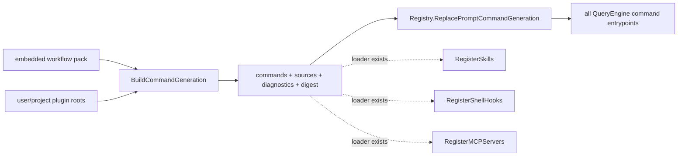

# Plugins

**Status:** current
**Wiring:** discovery and prompt-command contributions are active; other contribution types are disconnected
**Last verified:** 2026-08-07

> **Ownership:** This file owns plugin discovery, manifest capabilities, local
> plugin management, and the actual production wiring boundary. Skill behavior,
> command dispatch, hooks, and MCP runtime semantics remain in their subsystem
> owners.

## Discovery Model

`plugins.Loader` opens each configured root as one `os.Root` authority and
scans it one directory level deep. The configured path may itself be a
symlink; the opened target remains bound for that candidate. A child must be a
real enumerated directory, keep the same filesystem identity when opened, and
contain a regular `plugin.json`. Child-directory links are ignored, and a
replacement between enumeration and opening rejects the candidate.

Manifest and file-backed command bytes are read through the opened child root.
Each descriptor is checked as a regular file and read without reopening an
ambient path. A missing manifest name falls back to the directory name.
Candidate generation discovers the entire configured source set, combines it
with the versioned bundled workflow pack, aggregates invalid-source and
invalid-command diagnostics, and does not publish loader or registry state
unless every error is resolved.
Configured root order defines deterministic override precedence for duplicate
plugin names and records the override as a diagnostic.

Default roots come from the user config directory and the project
`.claude/plugins` directory. `QueryEngine` also ensures the project plugin root
is present even when it does not yet exist, then attempts plugin command reload
during construction.



## Actual Production Wiring

| Contribution | Loader support | Bootstrap/reload wiring |
|---|---|---|
| prompt commands | `Commands` / `RegisterCommands` | **Wired.** Engine startup and `/reload-plugins` validate configured commands together with the bundled workflow pack and atomically replace the engine-owned prompt-command generation. |
| skills | `RegisterSkills` | **Not wired.** Engine skill bootstrap loads user/project skill directories directly and never calls the plugin loader method. |
| shell hooks | `RegisterShellHooks` | **Not wired.** Engine startup loads `.claude/hooks.json` / `.eino-agent/hooks.json` directly and never merges plugin hooks. |
| MCP server declarations | `RegisterMCPServers` | **Not wired.** Engine MCP bootstrap does not call the plugin loader method. |

This distinction is observable: a plugin command can appear and reload in a
production session, while a skill, hook, or MCP declaration in the same
manifest does not enter that session through plugin bootstrap.

Plugin command names are qualified as `<plugin>:<command>`. File-backed prompt
paths use one portable local-path rule: slash and backslash relatives are
normalized, while absolute, drive-qualified, UNC, parent-escaping,
NUL-containing, and invalid paths are rejected before opening. Relative links
may resolve only beneath the bound plugin directory. Absolute, broken, and
escaping links fail closed, including an absolute link whose target is inside
the root. A regular hard-link entry inside the directory is accepted; the
authority owns reachable entries, not exclusive inode provenance.

Command bodies are materialized while the plugin root is open. Published
closures perform no later filesystem read, and the generation digest covers
the exact materialized bytes. Candidate command snapshots are sorted and
validated before
`Registry.ReplacePromptCommandGeneration` swaps them. Canonical plugin names
and aliases are qualified; configured contributions carry `configured` trust,
while the unqualified embedded pack carries `bundled` trust. Compiled core
commands have precedence. The registry's final collision check prevents
shadowing core or another dynamic name/alias. Missing manifests/content,
invalid commands or paths, authority or identity failures, malformed bundled
data, and collisions leave the previous complete generation and its
revision/digest/source metadata live. An invalid higher-precedence source
never downgrades to a lower-precedence duplicate.

The library-only `RegisterSkills` path reopens each plugin through its
configured parent root and requires the same directory identity captured by
`Loader.Load`. Explicit and conventional `skills/` content is traversed and
read through that child root, then merged into the target registry only after
the complete batch succeeds. This closes partial registration on authority
failure without making plugin skills production-active.

`/reload-plugins` reports the accepted revision, short digest, bundled-pack and
configured-plugin contribution counts, health, and diagnostics. `/mcp`,
`/skills`, and `/hooks`
may display the same plugin manifest counts, but those contribution types
remain disconnected from plugin bootstrap; generation metadata is inventory,
not a false activation claim.

The administration CLI projects the same candidate and registry boundaries:
`plugins list` reports candidate health plus the local live generation;
`plugins validate` builds the complete configured/bundled candidate and runs
the same final collision checks without mutation; and `plugins reload`
atomically replaces only the short-lived inspection host generation. Its
structured result declares `process_scope=inspection-host`; it does not reload
another running agent process or persist enable/disable state. Install,
uninstall, enable, disable, and marketplace commands remain absent.

## Local Management

`plugins.Manager` provides local-directory install, uninstall, and reconcile.
It copies a validated source into its managed install directory and records the
source path for reconcile. These APIs are library surfaces; no production CLI
entrypoint constructs `plugins.Manager`. P32 file authority does not turn this
helper into a complete installation, trust, signature, or update lifecycle.

Marketplace/update helpers exist in the package, but they are not part of the
engine plugin-command bootstrap described above.

## Code References

| Symbol | Evidence |
|---|---|
| manifest and loader | [`Plugin`](../../../engine/plugins/loader.go), [`Loader`](../../../engine/plugins/loader.go) |
| root/path authority | [`pluginFileAuthority`](../../../engine/plugins/file_authority.go), [`normalizePluginLocalPath`](../../../engine/plugins/file_authority.go) |
| roots and candidate generation | [`DefaultPluginDirs`](../../../engine/plugins/loader.go), [`Loader.BuildCommandGeneration`](../../../engine/plugins/loader.go) |
| skill contribution loader | [`Loader.RegisterSkills`](../../../engine/plugins/loader.go), [`collectPluginSkills`](../../../engine/plugins/file_authority.go) |
| authorized skill parsing | [`skills.ParseSkillData`](../../../engine/skills/skills.go), [`SkillRegistry.MergeSnapshot`](../../../engine/skills/skills.go) |
| hook contribution loader | [`Loader.RegisterShellHooks`](../../../engine/plugins/loader.go) |
| MCP contribution loader | [`Loader.RegisterMCPServers`](../../../engine/plugins/loader.go) |
| prompt-command materialization | [`Loader.loadPluginFromAuthority`](../../../engine/plugins/loader.go), [`buildPluginCommand`](../../../engine/plugins/loader.go) |
| engine command reload | [`QueryEngine.ReloadPromptCommands`](../../../engine/input_processor.go) |
| candidate-only validation | [`QueryEngine.ValidatePromptCommands`](../../../engine/input_processor.go), [`Registry.ValidatePromptCommandGeneration`](../../../engine/commands/registry.go) |
| inspection CLI host | [`NewInspectionAdministrationEngine`](../../../engine/inspection_administration.go), [`newPluginsCommand`](../../../cmd/yhc/cmd/diagnostics_extensions.go) |
| engine startup wiring | [`NewQueryEngine`](../../../engine/engine.go) |
| atomic command generation | [`Registry.ReplacePromptCommandGeneration`](../../../engine/commands/registry.go) |
| local manager | [`engine/plugins/manager.go`](../../../engine/plugins/manager.go), [`engine/plugins/manager.go`](../../../engine/plugins/manager.go) |

## Example

```json
{
  "name": "review",
  "commands": [
    {"name": "security", "filePath": "commands/security.md"}
  ],
  "skills": [
    {"name": "audit", "filePath": "skills/audit.md"}
  ]
}
```

In current production wiring, `/review:security` is installed. The `audit`
skill is root-authorized and parseable by `RegisterSkills`, but plugin
bootstrap does not call it. If `commands/security.md` links outside the plugin
directory, candidate validation fails and the previous complete command
generation stays live.
