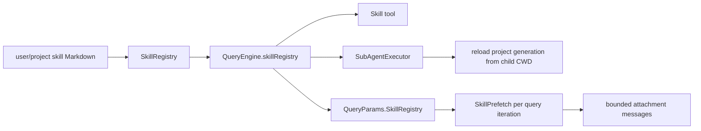

# Skills

**Status:** current
**Last verified:** 2026-09-05

> **Ownership:** This file owns skill parsing, registry precedence, engine
> binding, invocation, and query-time prefetch. Plugin discovery and whether
> plugin skills reach bootstrap belong in [`plugins.md`](plugins.md).

## Current Boundary

Skills are engine-bound runtime data. `NewQueryEngine` accepts an injected
`SkillRegistry` or loads defaults for its CWD, registers a Skill tool bound to
that registry, and injects it into tool execution contexts. A
worktree-isolated child clones non-project entries and reloads only the
project-sourced generation from the worktree before model entry. Its
model-visible Skill description and invocation context use that same isolated
generation, so dirty parent skill content omitted from committed HEAD cannot
leak into the child.

Default precedence, from low to high, is `~/.claude/skills`,
`~/.agents/skills`, `<project>/.claude/skills`, then `<project>/.agents/skills`.
Session resume reloads the registry for the restored CWD and rebinds command
discovery to it. A directory containing `SKILL.md` is one bundle: its support
Markdown files do not become separate skills. A missing bundle name defaults
to the directory name; flat Markdown files remain supported.

## Symbol Flow



| Operation | Behavior |
|---|---|
| parse | YAML frontmatter plus Markdown body; filename or bundle directory supplies a missing name |
| load | recursive flat Markdown and `SKILL.md` bundles; records retain source and malformed files become diagnostics |
| invoke | validates required/default arguments and substitutes `{{name}}` placeholders |
| direct tool use | execution resolves the per-engine registry from context before the package-level compatibility registry |
| worktree child | preserves user/runtime sources, replaces project-source skills from the worktree's `.claude/skills` and `.agents/skills`, and fails launch if that reload fails |
| prefetch | each query iteration matches the latest user message against skill name, tags, and description words; bounded matches become user-role meta attachments |

The package-level `tools.DefaultSkillRegistry` remains a compatibility fallback.
Production `QueryEngine` tool execution injects its own registry, so independent
engines do not need to share that global owner.

`/skills` reads a detached registry snapshot through
`QueryEngine.RuntimeInspectionSnapshot`. It reports source and health for live
skills and the count of rejected source files; it does not re-walk directories
or treat skipped malformed files as a healthy empty registry.

## Explicit skill commands

[`Registry.SetSkillRegistry`](../../../engine/commands/skill_commands.go) projects
one in-memory skill snapshot into the shared TUI/Plain command registry. Each
user-invocable skill has a canonical `/skill:<name>` command and an unqualified
`/<name>` alias when no core, plugin, removed command, or qualified skill already
owns that name. `skill:` is reserved for this projection; static and plugin
registrations in that namespace fail validation. Static commands retain
precedence for short aliases. Discovery and dispatch use
the same projection; handlers capture the skill bytes shown by that snapshot.
No filesystem I/O occurs during command completion.

`argument-hint` supplies display text; declared `args` supply a fallback hint,
positional binding, required checks, and defaults. Quoted arguments remain one
value. `{{name}}` uses the existing named substitution; `$ARGUMENTS` expands the
joined command arguments without shell evaluation. Free-form or extra arguments
are appended when the body has no `$ARGUMENTS` placeholder. The resulting prompt
includes the skill source path so relative support files can be resolved and
uses the existing prompt-workflow path under ordinary tools and permissions.

`user-invocable: false` hides direct skill commands. `disable-model-invocation:
true` removes the skill from the model's Skill description, rejects model-tool
invocation, and suppresses automatic prefetch; explicit user commands remain
available. Neither metadata flag grants tool permissions.

The TUI palette stages a selected skill command for editing; explicit Enter
submits it. ACP skill commands, file watching, and plugin skill bootstrap are
outside this change. Files are reloaded at engine construction or session
resume, while programmatic registry updates appear on the next discovery read.

## Code References

| Symbol | Evidence |
|---|---|
| registry and invocation | [`engine/skills/skills.go`](../../../engine/skills/skills.go), [`SkillRegistry.Get`](../../../engine/skills/skills.go) |
| default load precedence | [`LoadDefaultSkills`](../../../engine/skills/skills.go) |
| worktree project generation | [`SkillRegistry.ForProjectDirectory`](../../../engine/skills/skills.go), [`SubAgentExecutor.ExecuteAgent`](../../../engine/subagent.go) |
| engine binding | [`engine.QueryEngineConfig.SkillRegistry`](../../../engine/engine.go), [`NewQueryEngine`](../../../engine/engine.go), [query projection](../../../engine/engine.go) |
| query-time prefetch | [`NewSkillPrefetch`](../../../engine/round_lifecycle.go), [safe-point collection](../../../engine/round_lifecycle.go) |
| matching and attachment construction | [`engine/prefetch/skill.go`](../../../engine/prefetch/skill.go), [`engine/prefetch/skill.go`](../../../engine/prefetch/skill.go) |
| resume reload | [`engine/session_restore.go`](../../../engine/session_restore.go) |

## Example

```go
registry, err := skills.LoadDefaultSkills(projectDir)
if err != nil {
    return err
}
eng := engine.NewQueryEngine(engine.QueryEngineConfig{
    CWD: projectDir, SkillRegistry: registry,
})
```
