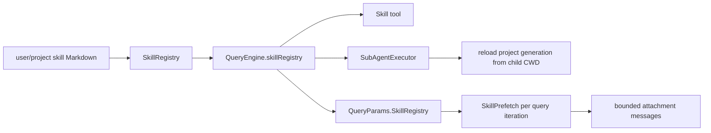

# Skills

**Status:** current
**Last verified:** 2026-08-07

> **Ownership:** This file owns skill parsing, registry precedence, engine
> binding, invocation, and query-time prefetch. Plugin discovery and whether
> plugin skills reach bootstrap belong in [`plugins.md`](plugins.md).

## Current Boundary

Skills are engine-bound runtime data. `NewQueryEngine` accepts an injected
`SkillRegistry` or loads defaults for its CWD, registers a Skill tool bound to
that registry, and injects it into tool execution contexts. A
worktree-isolated child clones non-project entries and reloads only the
project-sourced generation from the worktree before model entry. Its
model-visible Skill description and invocation context use that same isolated
generation, so dirty parent skill content omitted from committed HEAD cannot
leak into the child.

Default precedence is user then project: `~/.claude/skills` loads first and
`<project>/.claude/skills` overwrites duplicate names. Session resume reloads
the registry for the restored CWD.

## Symbol Flow



| Operation | Behavior |
|---|---|
| parse | YAML frontmatter plus Markdown body; filename supplies a missing name |
| load | recursive `.md` walk; valid skills retain user/project/runtime source and invalid files become bounded diagnostics |
| invoke | validates required/default arguments and substitutes `{{name}}` placeholders |
| direct tool use | execution resolves the per-engine registry from context before the package-level compatibility registry |
| worktree child | preserves user/runtime sources, replaces project-source skills from `<worktree>/.claude/skills`, and fails launch if that reload fails |
| prefetch | each query iteration matches the latest user message against skill name, tags, and description words; bounded matches become user-role meta attachments |

The package-level `tools.DefaultSkillRegistry` remains a compatibility fallback.
Production `QueryEngine` tool execution injects its own registry, so independent
engines do not need to share that global owner.

`/skills` reads a detached registry snapshot through
`QueryEngine.RuntimeInspectionSnapshot`. It reports source and health for live
skills and the count of rejected source files; it does not re-walk directories
or treat skipped malformed files as a healthy empty registry.

## Code References

| Symbol | Evidence |
|---|---|
| registry and invocation | [`engine/skills/skills.go`](../../../engine/skills/skills.go), [`SkillRegistry.Get`](../../../engine/skills/skills.go) |
| default load precedence | [`LoadDefaultSkills`](../../../engine/skills/skills.go) |
| worktree project generation | [`SkillRegistry.ForProjectDirectory`](../../../engine/skills/skills.go), [`SubAgentExecutor.ExecuteAgent`](../../../engine/subagent.go) |
| engine binding | [`engine.QueryEngineConfig.SkillRegistry`](../../../engine/engine.go), [`NewQueryEngine`](../../../engine/engine.go), [query projection](../../../engine/engine.go) |
| query-time prefetch | [`NewSkillPrefetch`](../../../engine/round_lifecycle.go), [safe-point collection](../../../engine/round_lifecycle.go) |
| matching and attachment construction | [`engine/prefetch/skill.go`](../../../engine/prefetch/skill.go), [`engine/prefetch/skill.go`](../../../engine/prefetch/skill.go) |
| resume reload | [`engine/session_restore.go`](../../../engine/session_restore.go) |

## Example

```go
registry, err := skills.LoadDefaultSkills(projectDir)
if err != nil {
    return err
}
eng := engine.NewQueryEngine(engine.QueryEngineConfig{
    CWD: projectDir, SkillRegistry: registry,
})
```
