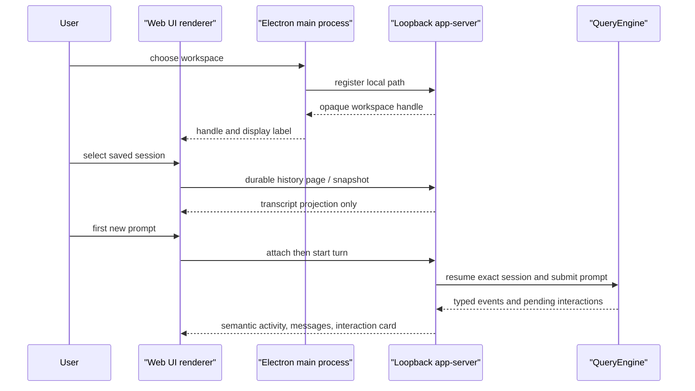

# Desktop Workbench Architecture

**Status:** current
**Last verified:** 2026-08-26

> **Ownership:** current Desktop composition, session activation ordering,
> renderer/server trust boundaries, and user-visible interaction projections.

## Decision and boundaries

The Desktop app is an Electron shell over the existing YHC runtime, not a
second agent implementation. [`runServeApp`](../../cmd/yhc/cmd/serve_app.go)
creates a loopback `server/appserver.Server`; the Electron main process starts
that command, owns the bearer bootstrap capability, and exposes a narrow IPC
operation set. The renderer gets typed JSON through preload IPC and cannot
directly open files, spawn the backend, or hold the loopback credential.

`server/appserver` owns live Desktop session admission and projection. It is
the only bridge from the transport to `QueryEngine`; `QueryEngine` continues to
own model turns, durable session semantics, permissions, and tool execution.

## Session ordering

The server distinguishes durable discovery from activation. Durable session
listing and transcript paging use the existing session/transcript owners
without constructing an engine. [`admitDurableSession`](../../server/appserver/durable_sessions.go)
and attach handling reserve activation only when the renderer starts the first
turn. [`runServeApp`](../../cmd/yhc/cmd/serve_app.go) then asks the factory to
resume the exact selected session before `startTurn` invokes the new prompt.

The ordering invariant is: opening a saved row has no provider request, model
resume, tool effect, or transcript mutation. A user send is the explicit
activation boundary. Pending recovered ProjectGraph interactions remain typed
server state and are reprojected instead of inventing a user message.

A discovered legacy-only row is a separate pre-activation state. Desktop may
show its history and retain a draft, but it cannot attach, lease, or write that
session. **Import and continue** requires an explicit stopped-producer
confirmation and sends no source path. A successful import leaves legacy bytes
unchanged, refreshes durable discovery, and grants first-send attach authority
only after the server returns one exact canonical resumable row. Cancelled or
failed import never constructs a live engine; a catalog-verification failure
keeps the explicit import retry available.

## Trust and privacy boundary

The host's native picker registers a workspace path once. The server stores a
short-lived capability and returns a handle plus display label; renderer
requests carry the handle rather than a filesystem path. The app-server accepts
only loopback authority, binds its bootstrap token to that authority, validates
same-origin browser requests, and limits live/reserving session capacity.

The Electron window uses context isolation, sandboxing, disabled Node
integration, and a trusted-sender IPC check. Provider setup stays in the host:
when safe storage is available it encrypts the stored profile; the renderer
clears the submitted API key and receives status rather than the credential.
These measures do not validate an arbitrary provider's credential, endpoint,
or tool schema.

On macOS the Host creates its hidden `BrowserWindow` before a configured
provider profile can touch Electron safe storage, so Keychain service identity
is established by the YHC application rather than a generic pre-window
identity. An absent profile does not synchronously call
`safeStorage.isEncryptionAvailable()` during bootstrap: that API may block the
main thread for Keychain input. The provider dialog is admitted from the
presence of the required safe-storage methods, while the first encryption and
every configured-profile decryption still fail closed on an operation error.
This keeps an empty-profile launch non-interactive; it does not turn unsigned
QA packaging into secure-storage, signing, or Keychain-prompt acceptance.

The backend bootstrap also projects one bounded build identity: a canonical
Desktop version (numeric prefix, no `v`, at most 64 ASCII characters), a
twelve-character lowercase commit or `unknown`, and the modified flag. The
Electron host accepts the bootstrap only when the backend version exactly
matches `app.getVersion()`. A timeout, malformed identity, or mismatch
marks the child as intentionally stopping before it is killed, so that
rejection cannot later be projected as an unexpected backend crash. The
renderer receives only this bounded build object through `app:get-info` and
shows it as plain text in the Desktop footer; the browser surface does not.

This identity check detects accidental shell/backend combinations. It is not
binary authentication, signature verification, or tamper resistance: an
arbitrary replacement binary can still claim the expected version and build
fields.

## Renderer projections

The renderer keeps a bounded session state and reconciles snapshots with SSE.
Messages are rendered with the locally vendored Marked parser into an explicit
allowlist of DOM nodes. Links are restricted to safe HTTP(S) destinations and
created with `noopener noreferrer`; raw HTML is not injected. This gives normal
Markdown formatting without treating assistant text as executable page markup.

[`interactionViewModel`](../../internal/webui/assets/view_models.mjs) projects
four actionable classes: permission, question, Plan approval, and repeated
tool call. Resolution uses a typed request tied to server-side identity. An
unknown or unprojectable interaction is non-actionable and tells the user to
reload, rather than guessing a broad permission response.

Permission cards consume the engine-owned decision constraint described by the
[permissions architecture](capabilities/permissions.md). A critical Bash
request therefore exposes only `allow_once`; AppServer also rejects forged
session/always resolutions before engine settlement rechecks the same bound.

Repeated-tool cards are bound to the exact guarded attempt and canonical tool
identity. Their controls can continue that call once or stop it; they do not
create cross-request or always-allow authority.

Terminal events settle only their own Turn ID. Once a turn is settled, late
assistant, stream, tool, input, cancellation, or interaction events from that
turn cannot clear or replace a newer active turn. Read-only semantic Activity
may still arrive for history, while the next snapshot remains the state
reconciliation owner.

An immediate user cancellation for the active turn retains the typed
`aborted_streaming` terminal reason but treats its causally owned `context
canceled` error as a successful control outcome. Both the terminal event and
final snapshot therefore clear that error, settle any partial assistant output,
and return the active composer to idle. An unowned cancellation or a stop
request rejected before it produces a terminal remains an error.

When a reconnect cursor falls behind the bounded event log,
[`recoverReplayGap`](../../internal/webui/assets/app.mjs#L2054) uses
[`synchronizeReplayGap`](../../internal/webui/assets/replay.mjs#L1) to apply
the server snapshot before refreshing durable transcript history. The snapshot
advances the event cursor and restores live interactions, Activity, and turn
state, then stream reconnection proceeds without waiting for the best-effort
transcript refresh. Transcript replacement is fenced to that snapshot cursor:
if a newly reconnected stream advances the cursor first, the renderer discards
the stale history response instead of replacing newer runtime messages. Only
the first consecutive replay gap bypasses reconnect backoff. A temporary,
failed, or stale transcript refresh therefore leaves the synchronized live
session and local draft usable with a visible retry notice; a snapshot failure
still fails recovery. The bounded snapshot complements rather than replaces
the durable transcript.

[`activityPresentation`](../../internal/webui/assets/activity.mjs) maps valid
server activity entries to stable lifecycle language such as turn started,
command running, or question waiting. It rejects invalid category/state pairs;
the Activity panel therefore remains an operator summary, while raw stream
debugging stays outside the normal UI.

### Unexpected backend exit containment

An unexpected backend exit changes Host availability; it is not a runtime
terminal event. Electron sends the bounded `app:backend-exit` notification only
for a normally bootstrapped child that was not intentionally stopped for quit
or provider replacement. The renderer ignores child diagnostics and dispatches
one fixed `BACKEND_UNAVAILABLE` transition with the local message **Backend
stopped unexpectedly. Restart YHC to reconnect.**

That transition stops renderer event streams and atomically retires every
process-owned capability. It clears active Turn IDs, pending interactions and
their form state, attention and resolution ownership, replay-in-progress state,
and outstanding review or execution-setting request generations. It preserves
the messages already projected, semantic Activity history, drafts, event
cursors, and durable/resumable descriptors. In particular, a partial assistant
projection is not marked completed, cancelled, or failed: only engine-owned
terminal data may make that claim.

The Host availability flag also rejects late events, snapshots, catalog pages,
session upserts, and asynchronous request results. Persisted descriptors and
drafts are loaded synchronously before the first bootstrap request, so a stale
backend payload cannot replace that local recovery data or regain an active
Turn or interaction capability. New workspace creation, provider configuration,
Open Web, catalog and transcript paging, review, execution settings, Send,
Cancel, and interaction controls all remain unavailable.

Recovery requires closing and reopening the complete YHC app. There is no
renderer restart IPC, automatic child restart, automatic turn continuation, or
permission replay. A new app process must bootstrap and validate a fresh
backend, rediscover durable sessions, and wait for a later explicit prompt to
attach saved work. In-process restart remains a separate Host-lifecycle design
problem because safe replacement requires start ownership, generation fencing,
and quit/provider-transition arbitration.

## Provider compatibility seam

The provider runtime, not Desktop, owns wire dialects. The Claude adapter keeps
the upstream Anthropic request format for Anthropic and arbitrary proxies. Only
the canonical DeepSeek Anthropic-compatible endpoint gets a narrow transport
projection that omits the unsupported `tools[*].type = "custom"` discriminator
while retaining the tool name, description, and input schema. It does not move
credentials to another endpoint or silently switch provider protocols.

## Entry points and verification boundary

`desktop/package.json` owns the Desktop version used by both Electron and the
backend staged by the supported Desktop Make targets. Electron accepts the
backend bootstrap only when that version and its bounded build identity are
well formed and match the shell. `make desktop-dev` stages the host backend
then starts Electron. `make desktop-check` runs the renderer/host tests and
Node syntax checks; `make desktop-package` builds a local unpacked Electron
artifact. Its
[`afterPack` verifier](../../desktop/scripts/verify_packaged_artifact.cjs)
requires the exact application archive entry set, a byte-identical WebUI tree,
the byte-identical staged platform backend, an executable Unix backend, and the
required license material. The Desktop CI job assembles the same unpacked
layout for Linux x64 after the Node audit, SBOM, and license checks. It then
starts that exact executable in an isolated Xvfb profile and uses a temporary
loopback DevTools connection to verify the packaged renderer, frozen preload
bridge, trusted `app:get-info` IPC, and the packaged backend process identity.
Closing the renderer must end Electron normally and retire that exact backend
PID. The same job launches a second isolated instance in explicit crash mode,
immediately rechecks the backend PID, Linux start time, and executable before
sending `SIGKILL`, and requires the renderer to remain ready. That pre-signal
check is a best-effort guard; it is not atomic Linux pidfd ownership. One
backend-exit notification must produce the fixed recovery guidance and disable
the checked new-session, composer, Cancel, Open Web, and provider controls.
Those observations and an empty `app:get-info` must remain stable for 11
seconds—longer than the Host's 10-second bootstrap budget—before Electron
closes normally. The renderer exposes only a `data-yhc-bootstrap` ready/error
state for these read-only completion oracles.

Both macOS native rows also launch the exact unsigned unpacked
`YHC.app/Contents/MacOS/YHC` executable for their architecture with an isolated
user-data directory. Each verifies the same packaged renderer, frozen preload
bridge, trusted `app:get-info` IPC, and bundled backend path, then closes the
last renderer window without quitting the primary app, proves that exact
renderer target has disappeared, and starts the same app again. The second
process must exit with status zero through Electron's single-instance path,
while the original app and backend identities remain unchanged. The primary
process must create one new renderer target with a different identity and
complete the same bootstrap contract before a browser-level graceful close
ends Electron and retires the original backend.

[`createWindowRestoreCoordinator`](../../desktop/lifecycle.cjs) is the shared
owner for both macOS `activate` and `second-instance` restoration. One attempt
covers the complete check, create, and renderer-load interval. A usable window
is restored and focused even when the backend is unavailable so it can retain
offline guidance; creating a replacement window requires an accepted backend.
Window creation, `ready-to-show`, load-failure cleanup, and the `closed`
callback are bound to the same `BrowserWindow` target so an older attempt cannot
show, destroy, or clear a newer owner. Initial startup remains a separate hidden
window → backend → renderer sequence and cannot be double-loaded by a concurrent
activation event.

Darwin ownership is observed with locale-pinned `ps` fields for PID, process
group, state, start time, and resolved command path. That observation is best
effort rather than an atomic kernel identity or signal guarantee. The window
restoration row does not perform backend crash injection, prove Finder/Dock
foreground focus, or validate signing, notarization, Keychain prompts, or a
physical display.

The macOS Intel row applies that same renderer-restoration contract to the
unsigned x64 app on its native runner. Keeping both macOS rows executable
catches architecture-specific launch or packaging drift that byte-level package
inspection cannot observe; neither row is distribution evidence.

The Windows Server 2025 x64 row launches the exact unpacked `YHC.exe` with an
isolated user profile and verifies the same renderer, frozen preload bridge,
trusted `app:get-info` IPC, bundled `resources\bin\yhc.exe` identity, and
browser-level graceful shutdown. A second isolated launch installs the same
backend-exit observer, rechecks the backend PID, UTC creation time, and
normalized executable path, then applies `taskkill /PID ... /F` to that backend
alone. It requires the same single notification, fixed Offline guidance,
disabled controls, empty `app:get-info`, and 11-second no-restart observation
before the Electron app closes normally.

Failure cleanup remains separate: it takes a fresh `Win32_Process` snapshot,
accepts only the observed app/backend executable tree, rechecks the root
identity, and then applies `taskkill /PID ... /T /F`; unknown or incomplete
lineage fails closed. Both crash injection and cleanup separate the last
identity observation from process termination, so they are best-effort
PID-reuse defenses rather than atomic process-handle or Job Object ownership.
Last-window restoration remains outside the Windows row.

Backend shutdown is a Host-owned, per-child single-flight lifecycle. The first
Electron `before-quit` event is prevented, and
[`createQuitRequestScheduler`](../../desktop/lifecycle.cjs#L50) defers the
single quit decision until that event handler has returned; this avoids a
reentrant `app.quit()` when the backend has already exited. The
[`createBackendStopCoordinator`](../../desktop/lifecycle.cjs#L239) stops event
streams, sends `SIGINT`, and waits 17 seconds before escalating once to
`SIGKILL`. That graceful window covers the app-server's 15-second bounded
session, engine, transcript, and HTTP cleanup with a two-second scheduling
margin. After actually sending `SIGKILL`, the Host starts a separate three-second
window for the child `exit` event. For a normally bootstrapped backend, provider
replacement and Electron quit proceed only after that exact exit is observed;
otherwise [`requestQuit`](../../desktop/main.cjs#L232) keeps the app open with
fixed retry guidance. Startup-failure cleanup is a separate lifecycle. This
ordering protects cleanup time but does not promise that an interrupted model
turn completes, that every provider responds during shutdown, or that a
force-killed process persisted work beyond its last durable write.

A separate native packaging matrix runs the same unpacked `afterPack` contract
on macOS 15 Intel, macOS 15 Apple Silicon, and Windows Server 2025 x64 runners.
Those jobs prove that each native electron-builder path can assemble the exact
ASAR, WebUI, backend, and license payload. All three rows add the automated
normal lifecycle and backend crash containment above; both macOS rows also add
last-window restoration. The matrix does not produce installer media, sign
code, or upload artifacts.

The Linux CI invocation uses `--no-sandbox` because it runs inside the hosted
test environment. That evidence therefore does not validate Chromium's OS
sandbox or another platform. Both macOS lifecycle rows and the Windows row keep
the normal sandbox but are still automation, not evidence of Finder, Dock, or
Start-menu launch, foreground focus, native picker or secure-storage
interaction, installer behavior, or physical UI behavior.
The Linux Xvfb job adds a separate active-turn crash oracle. A smoke-owned
loopback Responses provider first lets the exact packaged backend create one
completed canonical session under the isolated HOME and workspace. The
packaged Desktop then discovers that session through the normal catalog and
uses the existing first-send attach path for a second request whose response
emits one assistant delta but never completes. Before killing the backend, the
smoke requires the public app snapshot to report one non-empty AppServer active
turn plus exactly one sentinel assistant projection with its own non-empty
runtime turn ID and `completed: false`. After the Host reports the exit, the
smoke requires the partial text, submitted prompt, and session labels to remain
projected; fixed Offline guidance, retired interactions and capabilities, zero
session `terminal`/`turn.finished` events, exactly two fixture requests, and the
11-second no-restart window must all hold. This exercises the packaged IPC/SSE ordering
race without exposing a workspace-picker bypass or renderer-only state seam.

The native macOS and Windows crash rows still use the idle crash oracle; the
active-turn fixture is currently Linux Xvfb automation, not cross-platform or
physical UI evidence. CI neither uploads nor promotes the unsigned output.
These artifacts remain ignored QA output. This architecture document does not
claim signature, notarization, distribution readiness, remote CI success, or
compatibility with an arbitrary endpoint that implements a different
provider/tool dialect.

## Code references

- [`startDesktopHost`](../../desktop/lifecycle.cjs#L50) owns the prepare-window,
  start-backend, verify-bootstrap, then load-renderer startup order.
- [`providerSetupStorageAvailable`](../../desktop/provider_setup.cjs#L310)
  admits macOS setup without a synchronous Keychain availability probe; the
  adjacent read/write functions retain operation-level failure handling.
- [`startBackend` and `notifyBackendExit`](../../desktop/main.cjs) own child
  bootstrap identity and the unexpected-exit notification boundary.
- [`reducer` and `BACKEND_UNAVAILABLE`](../../internal/webui/assets/state.mjs)
  own the atomic renderer containment and late-result fence.
- [`handleBackendExit` and `bootstrapApp`](../../internal/webui/assets/app.mjs)
  register the crash listener before asynchronous bootstrap and apply global
  control admission.
- [`unpacked_lifecycle_smoke.cjs`](../../desktop/scripts/unpacked_lifecycle_smoke.cjs)
  owns the isolated loopback fixture, canonical preseed, public snapshot
  oracle, identity-checked crash, and no-restart automation boundary.
- [`createBackendStopCoordinator`](../../desktop/lifecycle.cjs) owns intentional
  provider-replacement and quit shutdown; it does not provide crash restart.

Related owners: [entrypoints and transports](platform/entrypoints-and-transports.md),
[sessions](state/sessions.md), [model providers](platform/model-providers.md),
and the [Desktop workbench guide](../guides/desktop-workbench.md).
