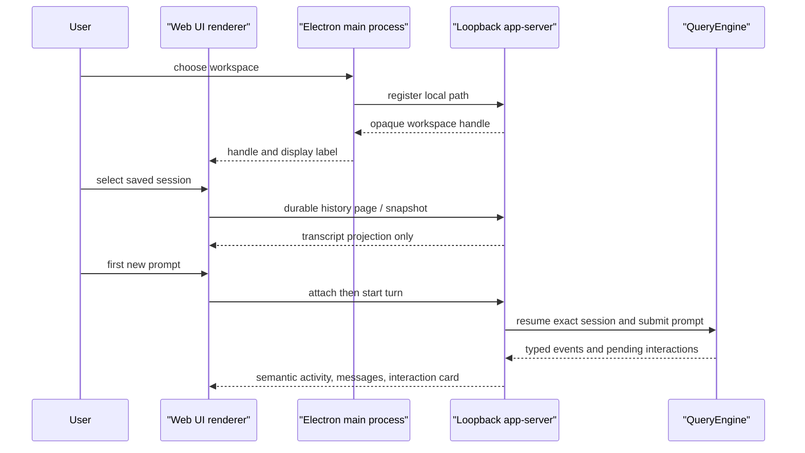

# Desktop Workbench Architecture

**Status:** current
**Last verified:** 2026-08-19

> **Ownership:** current Desktop composition, session activation ordering,
> renderer/server trust boundaries, and user-visible interaction projections.

## Decision and boundaries

The Desktop app is an Electron shell over the existing YHC runtime, not a
second agent implementation. [`runServeApp`](../../cmd/yhc/cmd/serve_app.go)
creates a loopback `server/appserver.Server`; the Electron main process starts
that command, owns the bearer bootstrap capability, and exposes a narrow IPC
operation set. The renderer gets typed JSON through preload IPC and cannot
directly open files, spawn the backend, or hold the loopback credential.

`server/appserver` owns live Desktop session admission and projection. It is
the only bridge from the transport to `QueryEngine`; `QueryEngine` continues to
own model turns, durable session semantics, permissions, and tool execution.

## Session ordering

The server distinguishes durable discovery from activation. Durable session
listing and transcript paging use the existing session/transcript owners
without constructing an engine. [`admitDurableSession`](../../server/appserver/durable_sessions.go)
and attach handling reserve activation only when the renderer starts the first
turn. [`runServeApp`](../../cmd/yhc/cmd/serve_app.go) then asks the factory to
resume the exact selected session before `startTurn` invokes the new prompt.

The ordering invariant is: opening a saved row has no provider request, model
resume, tool effect, or transcript mutation. A user send is the explicit
activation boundary. Pending recovered ProjectGraph interactions remain typed
server state and are reprojected instead of inventing a user message.

A discovered legacy-only row is a separate pre-activation state. Desktop may
show its history and retain a draft, but it cannot attach, lease, or write that
session. **Import and continue** requires an explicit stopped-producer
confirmation and sends no source path. A successful import leaves legacy bytes
unchanged, refreshes durable discovery, and grants first-send attach authority
only after the server returns one exact canonical resumable row. Cancelled or
failed import never constructs a live engine; a catalog-verification failure
keeps the explicit import retry available.

## Trust and privacy boundary

The host's native picker registers a workspace path once. The server stores a
short-lived capability and returns a handle plus display label; renderer
requests carry the handle rather than a filesystem path. The app-server accepts
only loopback authority, binds its bootstrap token to that authority, validates
same-origin browser requests, and limits live/reserving session capacity.

The Electron window uses context isolation, sandboxing, disabled Node
integration, and a trusted-sender IPC check. Provider setup stays in the host:
when safe storage is available it encrypts the stored profile; the renderer
clears the submitted API key and receives status rather than the credential.
These measures do not validate an arbitrary provider's credential, endpoint,
or tool schema.

## Renderer projections

The renderer keeps a bounded session state and reconciles snapshots with SSE.
Messages are rendered with the locally vendored Marked parser into an explicit
allowlist of DOM nodes. Links are restricted to safe HTTP(S) destinations and
created with `noopener noreferrer`; raw HTML is not injected. This gives normal
Markdown formatting without treating assistant text as executable page markup.

[`interactionViewModel`](../../internal/webui/assets/view_models.mjs) projects
four actionable classes: permission, question, Plan approval, and repeated
tool call. Resolution uses a typed request tied to server-side identity. An
unknown or unprojectable interaction is non-actionable and tells the user to
reload, rather than guessing a broad permission response.

Permission cards consume the engine-owned decision constraint described by the
[permissions architecture](capabilities/permissions.md). A critical Bash
request therefore exposes only `allow_once`; AppServer also rejects forged
session/always resolutions before engine settlement rechecks the same bound.

Repeated-tool cards are bound to the exact guarded attempt and canonical tool
identity. Their controls can continue that call once or stop it; they do not
create cross-request or always-allow authority.

Terminal events settle only their own Turn ID. Once a turn is settled, late
assistant, stream, tool, input, cancellation, or interaction events from that
turn cannot clear or replace a newer active turn. Read-only semantic Activity
may still arrive for history, while the next snapshot remains the state
reconciliation owner.

[`activityPresentation`](../../internal/webui/assets/activity.mjs) maps valid
server activity entries to stable lifecycle language such as turn started,
command running, or question waiting. It rejects invalid category/state pairs;
the Activity panel therefore remains an operator summary, while raw stream
debugging stays outside the normal UI.

## Provider compatibility seam

The provider runtime, not Desktop, owns wire dialects. The Claude adapter keeps
the upstream Anthropic request format for Anthropic and arbitrary proxies. Only
the canonical DeepSeek Anthropic-compatible endpoint gets a narrow transport
projection that omits the unsupported `tools[*].type = "custom"` discriminator
while retaining the tool name, description, and input schema. It does not move
credentials to another endpoint or silently switch provider protocols.

## Entry points and verification boundary

`make desktop-dev` stages the host backend then starts Electron. `make
desktop-check` runs the renderer/host tests and Node syntax checks; `make
desktop-package` builds a local Electron artifact. The artifact is ignored
local QA output. This architecture document does not claim signature,
notarization, distribution readiness, remote CI success, or compatibility with
an arbitrary endpoint that implements a different provider/tool dialect.

Related owners: [entrypoints and transports](platform/entrypoints-and-transports.md),
[sessions](state/sessions.md), [model providers](platform/model-providers.md),
and the [Desktop workbench guide](../guides/desktop-workbench.md).
