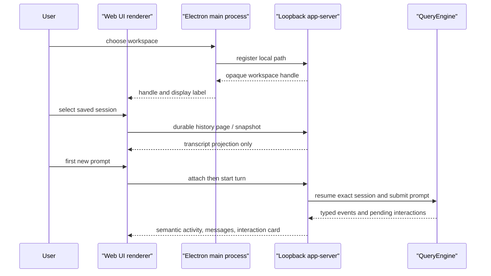

# Desktop Workbench Architecture

**Status:** current
**Last verified:** 2026-08-20

> **Ownership:** current Desktop composition, session activation ordering,
> renderer/server trust boundaries, and user-visible interaction projections.

## Decision and boundaries

The Desktop app is an Electron shell over the existing YHC runtime, not a
second agent implementation. [`runServeApp`](../../cmd/yhc/cmd/serve_app.go)
creates a loopback `server/appserver.Server`; the Electron main process starts
that command, owns the bearer bootstrap capability, and exposes a narrow IPC
operation set. The renderer gets typed JSON through preload IPC and cannot
directly open files, spawn the backend, or hold the loopback credential.

`server/appserver` owns live Desktop session admission and projection. It is
the only bridge from the transport to `QueryEngine`; `QueryEngine` continues to
own model turns, durable session semantics, permissions, and tool execution.

## Session ordering

The server distinguishes durable discovery from activation. Durable session
listing and transcript paging use the existing session/transcript owners
without constructing an engine. [`admitDurableSession`](../../server/appserver/durable_sessions.go)
and attach handling reserve activation only when the renderer starts the first
turn. [`runServeApp`](../../cmd/yhc/cmd/serve_app.go) then asks the factory to
resume the exact selected session before `startTurn` invokes the new prompt.

The ordering invariant is: opening a saved row has no provider request, model
resume, tool effect, or transcript mutation. A user send is the explicit
activation boundary. Pending recovered ProjectGraph interactions remain typed
server state and are reprojected instead of inventing a user message.

A discovered legacy-only row is a separate pre-activation state. Desktop may
show its history and retain a draft, but it cannot attach, lease, or write that
session. **Import and continue** requires an explicit stopped-producer
confirmation and sends no source path. A successful import leaves legacy bytes
unchanged, refreshes durable discovery, and grants first-send attach authority
only after the server returns one exact canonical resumable row. Cancelled or
failed import never constructs a live engine; a catalog-verification failure
keeps the explicit import retry available.

## Trust and privacy boundary

The host's native picker registers a workspace path once. The server stores a
short-lived capability and returns a handle plus display label; renderer
requests carry the handle rather than a filesystem path. The app-server accepts
only loopback authority, binds its bootstrap token to that authority, validates
same-origin browser requests, and limits live/reserving session capacity.

The Electron window uses context isolation, sandboxing, disabled Node
integration, and a trusted-sender IPC check. Provider setup stays in the host:
when safe storage is available it encrypts the stored profile; the renderer
clears the submitted API key and receives status rather than the credential.
These measures do not validate an arbitrary provider's credential, endpoint,
or tool schema.

The backend bootstrap also projects one bounded build identity: a canonical
Desktop version (numeric prefix, no `v`, at most 64 ASCII characters), a
twelve-character lowercase commit or `unknown`, and the modified flag. The
Electron host accepts the bootstrap only when the backend version exactly
matches `app.getVersion()`. A timeout, malformed identity, or mismatch
marks the child as intentionally stopping before it is killed, so that
rejection cannot later be projected as an unexpected backend crash. The
renderer receives only this bounded build object through `app:get-info` and
shows it as plain text in the Desktop footer; the browser surface does not.

This identity check detects accidental shell/backend combinations. It is not
binary authentication, signature verification, or tamper resistance: an
arbitrary replacement binary can still claim the expected version and build
fields.

## Renderer projections

The renderer keeps a bounded session state and reconciles snapshots with SSE.
Messages are rendered with the locally vendored Marked parser into an explicit
allowlist of DOM nodes. Links are restricted to safe HTTP(S) destinations and
created with `noopener noreferrer`; raw HTML is not injected. This gives normal
Markdown formatting without treating assistant text as executable page markup.

[`interactionViewModel`](../../internal/webui/assets/view_models.mjs) projects
four actionable classes: permission, question, Plan approval, and repeated
tool call. Resolution uses a typed request tied to server-side identity. An
unknown or unprojectable interaction is non-actionable and tells the user to
reload, rather than guessing a broad permission response.

Permission cards consume the engine-owned decision constraint described by the
[permissions architecture](capabilities/permissions.md). A critical Bash
request therefore exposes only `allow_once`; AppServer also rejects forged
session/always resolutions before engine settlement rechecks the same bound.

Repeated-tool cards are bound to the exact guarded attempt and canonical tool
identity. Their controls can continue that call once or stop it; they do not
create cross-request or always-allow authority.

Terminal events settle only their own Turn ID. Once a turn is settled, late
assistant, stream, tool, input, cancellation, or interaction events from that
turn cannot clear or replace a newer active turn. Read-only semantic Activity
may still arrive for history, while the next snapshot remains the state
reconciliation owner.

An immediate user cancellation for the active turn retains the typed
`aborted_streaming` terminal reason but treats its causally owned `context
canceled` error as a successful control outcome. Both the terminal event and
final snapshot therefore clear that error, settle any partial assistant output,
and return the active composer to idle. An unowned cancellation or a stop
request rejected before it produces a terminal remains an error.

When a reconnect cursor falls behind the bounded event log,
[`recoverReplayGap`](../../internal/webui/assets/app.mjs#L2054) uses
[`synchronizeReplayGap`](../../internal/webui/assets/replay.mjs#L1) to apply
the server snapshot before refreshing durable transcript history. The snapshot
advances the event cursor and restores live interactions, Activity, and turn
state, then stream reconnection proceeds without waiting for the best-effort
transcript refresh. Transcript replacement is fenced to that snapshot cursor:
if a newly reconnected stream advances the cursor first, the renderer discards
the stale history response instead of replacing newer runtime messages. Only
the first consecutive replay gap bypasses reconnect backoff. A temporary,
failed, or stale transcript refresh therefore leaves the synchronized live
session and local draft usable with a visible retry notice; a snapshot failure
still fails recovery. The bounded snapshot complements rather than replaces
the durable transcript.

[`activityPresentation`](../../internal/webui/assets/activity.mjs) maps valid
server activity entries to stable lifecycle language such as turn started,
command running, or question waiting. It rejects invalid category/state pairs;
the Activity panel therefore remains an operator summary, while raw stream
debugging stays outside the normal UI.

## Provider compatibility seam

The provider runtime, not Desktop, owns wire dialects. The Claude adapter keeps
the upstream Anthropic request format for Anthropic and arbitrary proxies. Only
the canonical DeepSeek Anthropic-compatible endpoint gets a narrow transport
projection that omits the unsupported `tools[*].type = "custom"` discriminator
while retaining the tool name, description, and input schema. It does not move
credentials to another endpoint or silently switch provider protocols.

## Entry points and verification boundary

`desktop/package.json` owns the Desktop version used by both Electron and the
backend staged by the supported Desktop Make targets. Electron accepts the
backend bootstrap only when that version and its bounded build identity are
well formed and match the shell. `make desktop-dev` stages the host backend
then starts Electron. `make desktop-check` runs the renderer/host tests and
Node syntax checks; `make desktop-package` builds a local unpacked Electron
artifact. Its
[`afterPack` verifier](../../desktop/scripts/verify_packaged_artifact.cjs)
requires the exact application archive entry set, a byte-identical WebUI tree,
the byte-identical staged platform backend, an executable Unix backend, and the
required license material. The Desktop CI job assembles the same unpacked
layout for Linux x64 after the Node audit, SBOM, and license checks. It then
starts that exact executable in an isolated Xvfb profile and uses a temporary
loopback DevTools connection to verify the packaged renderer, frozen preload
bridge, trusted `app:get-info` IPC, and the packaged backend process identity.
Closing the renderer must end Electron normally and retire that exact backend
PID. The renderer exposes only a `data-yhc-bootstrap` ready/error state for
this read-only completion oracle.

Backend shutdown is a Host-owned, per-child single-flight lifecycle. The
[`createBackendStopCoordinator`](../../desktop/lifecycle.cjs#L104) stops event
streams, sends `SIGINT`, and waits 17 seconds before escalating once to
`SIGKILL`. That graceful window covers the app-server's 15-second bounded
session, engine, transcript, and HTTP cleanup with a two-second scheduling
margin. After actually sending `SIGKILL`, the Host starts a separate three-second
window for the child `exit` event. For a normally bootstrapped backend, provider
replacement and Electron quit proceed only after that exact exit is observed;
otherwise [`requestQuit`](../../desktop/main.cjs#L227) keeps the app open with
fixed retry guidance. Startup-failure cleanup is a separate lifecycle. This
ordering protects cleanup time but does not promise that an interrupted model
turn completes, that every provider responds during shutdown, or that a
force-killed process persisted work beyond its last durable write.

A separate native packaging matrix runs the same unpacked `afterPack` contract
on macOS 15 Intel, macOS 15 Apple Silicon, and Windows Server 2025 x64 runners.
Those jobs prove that each native electron-builder path can assemble the exact
ASAR, WebUI, backend, and license payload; they do not launch the macOS or
Windows app, produce installer media, sign code, or upload artifacts.

The Linux CI invocation uses `--no-sandbox` because it runs inside the hosted
test environment. That evidence therefore does not validate Chromium's OS
sandbox, a physical display, native user interaction, or another platform. CI
neither uploads nor promotes the unsigned output. These artifacts remain
ignored QA output. This architecture document does not claim signature,
notarization, distribution readiness, remote CI success, or compatibility with
an arbitrary endpoint that implements a different provider/tool dialect.

Related owners: [entrypoints and transports](platform/entrypoints-and-transports.md),
[sessions](state/sessions.md), [model providers](platform/model-providers.md),
and the [Desktop workbench guide](../guides/desktop-workbench.md).
