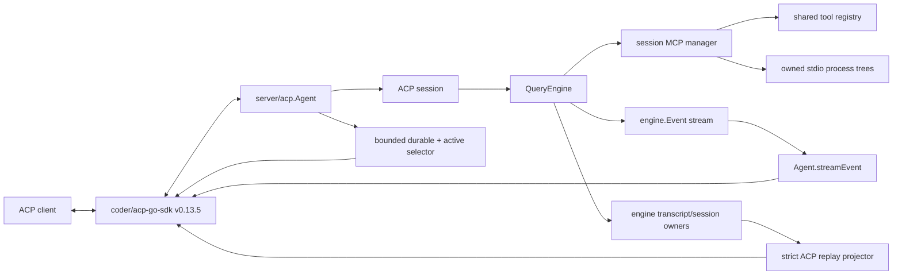

# ACP (Agent Client Protocol) Adapter

**Status:** current
**Last verified:** 2026-08-07

> **Ownership:** current production wiring and observable behavior of the ACP
> stdio adapter. Target behavior and execution order belong in
> [`migration/plans/p23-acp-adapter-hardening.md`](../../migration/plans/p23-acp-adapter-hardening.md);
> comparative evidence belongs in the
> [ACP adapter audit](../../migration/reference/runtime/acp-adapter-conformance-audit.md).
> Live image and embedded-resource ingress is complete under
> [`P30.5a`](../../migration/history/runtime/p30-5a-acp-rich-ingress.md).
> Exact prompt-record-backed rich user load/replay is complete under
> [`P30.5b`](../../migration/history/runtime/p30-5b-acp-rich-load-replay.md).
> [`P30.6`](../../migration/history/runtime/p30-6-multimodal-program-closeout.md)
> closes the program-wide writer/reader inventory without changing the ACP
> wire or load lifecycle.
> Byte-validated provider-rich public assistant text replay is complete under
> [`P36.1`](../../migration/history/runtime/p36-1-acp-rich-assistant-replay.md).
> [`P48`](../../migration/plans/p48-acp-boundary-remediation.md) is complete:
> observed-root deletion, exact Plan tool identity, string-valued live/replay
> `rawOutput`, OS-aware MCP environment identity, and rejection of the unsafe
> private Session-migration surface closed G42-G46.

## Production Boundary

`yhc serve acp` constructs the Coder ACP Go SDK's
`AgentSideConnection` over stdin/stdout and binds it to one
`server/acp.Agent`. The agent owns a map of ACP sessions. Each active ACP
session owns a normal `QueryEngine`; ACP does not have a second query loop,
tool registry, permission authority, or transcript store.



The adapter currently uses ACP protocol v1. Its reusable runtime behavior
comes from `QueryEngine`; `server/acp` is responsible only for protocol
negotiation, session-to-engine binding, prompt-content ingestion, client
requests, and event projection.

## Protocol and SDK Boundary

Protocol version, SDK package version, and adapter release version are separate
dimensions. A newer SDK package does not negotiate a newer wire protocol.

| Layer | Current status | Consequence |
|---|---|---|
| ACP v1 | Latest stable protocol and the only production wire target | `Initialize` returns protocol version 1; all declared behavior must satisfy the v1 schema |
| ACP v2 | Draft and not implemented | It is a breaking lifecycle change, not a dependency bump; v1 and v2 would need per-connection negotiation and separate conformance fixtures |
| Go SDK | Community `github.com/coder/acp-go-sdk v0.13.5` through a minimal local source replacement | Its generated v1 types and JSON-RPC dispatcher own the current wire path, including generic `$/cancel_request` handling; the local delta restores `_meta` and standard `annotations` in `ContentBlock.MarshalJSON` |
| Official TypeScript SDK | Stable entrypoint v1.3.0; v2 under an explicit experimental import | It is current schema and lifecycle evidence, not a reason to rewrite this Go adapter |

The current handler does not branch on a v2 surface. A v2-capable client may
request version 2, but this v1-only agent answers with version 1; the client
then decides whether to continue. No code may infer negotiated wire behavior
from an npm, Cargo, or Go module version.

The pinned SDK boundary is characterized through its real client/server
connections. Unknown methods return `-32601`; malformed parameters return
`-32602`; project-owned unsupported input returns `-32006`; an ordinary
handler error is wrapped as `-32603`; and request-context cancellation returns
`-32800` at the generic SDK boundary. The typed Prompt wrapper additionally
sends `session/cancel` after its local request context ends. A typed prompt
response waits for its previously queued notifications to finish. These are
current SDK behaviors, not an adapter-defined replacement dispatcher.

The upstream v0.13.5 generated `ContentBlock.MarshalJSON` drops `_meta` and
standard `annotations` for Text, Image, Audio, ResourceLink, and Resource
variants even though their structs admit those fields. The root module
therefore replaces that exact version with `third_party/acp-go-sdk`; its only
production delta copies the two fields into each generated union object.
P30.5a still strips incoming reserved metadata before engine admission, so the
fix does not make `_meta` durable or replay-visible. It preserves valid
standard annotations and prevents generic SDK serialization from silently
changing content.

The private `eino-agent.goal` capability is negotiated independently inside
`clientCapabilities._meta`. A client must offer a bounded version list
containing version 1 plus notification support. The first successful
Initialize freezes that connection result; missing, malformed, unsupported, or
late offers advertise nothing and every Goal extension returns MethodNotFound.
New, Load, and Resume copy the negotiated bit into their QueryEngine together
with the enabled-by-default Goal configuration. Negotiation remains an
independent requirement: configuration default-on does not grant Goal authority
to an unnegotiated ACP client.

## Current Observable Behavior

| Surface | Current behavior | Boundary or defect |
|---|---|---|
| Prompt input | Text-only input keeps the existing `PromptInput.Render` plus `SubmitMessage` command-compatible path. Any ResourceLink, image, or embedded resource becomes one literal ordered engine-owned `UntrustedPromptInput`; ResourceLink is a bounded no-fetch descriptor, ordinary and embedded-blob images use strict selected-route admission, and embedded text/blob keep distinct durable kinds. | Image and embedded-context capabilities are advertised; audio and unknown blocks fail explicitly. Reserved `_meta` and image source URI are excluded. Exact prompt-record-backed user history replays through load; unbound provider-rich user content and unsupported provider-rich assistant shapes fail before the first update. |
| Assistant stream | The engine yield boundary assigns one UUID to each logical assistant message before persistence and emits exact non-empty canonical deltas. ACP projects only those deltas as `agent_message_chunk` updates carrying the pinned SDK's optional unstable `messageId`. | Delta/final reconciliation emits final-only content once, suppresses an equal final, emits only a strict-prefix suffix, and fails closed on any other mismatch without logging content. `YHC_DISABLE_ACP_ASSISTANT_MESSAGE_IDS=1` omits only the optional field and preserves exact chunk bytes. |
| Tool start | The engine emits one canonical start from the committed `schema.ToolCall`; a prompt-scoped session ledger sends one pending ACP `tool_call` with the stable call ID, semantic kind, and title. | Input is deliberately absent until the final dispatch input settles. A permission path synchronously delivers or de-duplicates the same start before requesting a decision. |
| Tool input and progress | The engine emits one redacted complete effective-input object immediately before dispatch and complete replacement-safe progress snapshots from the tool-scoped callback. ACP sends late `rawInput`, deterministic file locations when present, and in-progress replacement content. | Provider argument fragments are not projection input. Progress producers must publish complete snapshots, not increments. |
| Tool result | The normalized `execution.ToolResult` emits one completed or failed terminal fact with redacted actual output. The ledger sends exactly one terminal status, replacement content, and string-valued `rawOutput`; a call cancelled before execution and never shown to the client settles locally only. Replay passes the same durable result text without inferring a JSON type. | ACP v1 has no cancelled tool status, so cancellation is represented as failed while the prompt retains its protocol stop reason. After a delivery error the prompt fails or cancels and the ledger settles locally without claiming client-visible completion. JSON-looking output has no implicit schema; empty output remains an empty string rather than `nil`. |
| Model fallback | A safe later `started` model-attempt event produces one private `_session/status` update containing only the normalized profile and switch count. | It is not assistant content or portable ACP core behavior. Failed output, prompt data, credentials, and provider responses never enter the notice. |
| Commands | Engine dispatch and ACP discovery share `engine/commands.Registry`, live `CommandContext`, visibility filtering, and order. Session setup sends one complete `available_commands_update`; later config, mode, and settled-prompt boundaries send a replacement only when the complete projected-row digest changes. | ACP maps registry-owned rows without filtering or inventing text. Failed notification delivery leaves the last delivered digest unchanged for retry. `YHC_DISABLE_ACP_COMMAND_UPDATES=1` disables only notifications; dispatch remains authoritative. |
| Permission | Uses ACP permission requests and enqueues the typed engine decision only after the referenced tool start is client-visible. One `ExitPlanMode` keeps the engine `ToolUseID` across start, initial Plan choice, every Back retry or bypass confirmation, and its single terminal update. | QueryEngine remains the authorization owner; ACP owns ordering and delivery, not policy. Plan request/revision identity and the shared interaction deadline remain separate. A blank Plan tool identity fails before Plan snapshot I/O or any client permission request. |
| Negotiated Goal | After version-1 negotiation and Goal capability enablement (default-on unless `goal.enabled: false`), `_eino/goal/get` reads detached truth, `_eino/goal/control` maps strict typed user intent to the QueryEngine transition service, and explicit `_eino/goal/continue` alone claims one exact durable cursor. `_eino/goal/updated` follows durable control or turn settlement. | Every request binds Session and bounded request identity; mutations bind Goal revision, and continuation also binds objective revision plus ordinal. Slash discovery, server-originated prompts, generic claims, model-created Goals, and unnegotiated clients remain unchanged. |
| Cancellation | Ordinary Prompt cancels only its captured context. An active Goal continuation first records the engine-owned durable Goal stop while Session ownership is held, then cancels the same context; request cancellation, delivery failure, and Session close converge on that boundary and join the event drain. | A late cancellation cannot stop the next turn. Missing final usage may still fail closed as `usage_limited`; cancellation never authorizes replay. |
| Session setup | New/load/resume/list/close are wired to engine-owned session behavior. A validated non-empty stdio MCP set is prepared transactionally before session visibility or replay delivery, published through one manager/registry generation, and owned by that engine. Load rejects an active target, replays durable portable history through a non-persisting staging engine, and registers only after replay, restored state, commands, and prepared MCP adoption succeed. | Only stdio is supported. HTTP, SSE, ACP transport, malformed descriptors, collisions, and exceeded bounds fail before session mutation. Descriptors and setup fingerprints remain process-local. ACP admission, fingerprinting, and process overlay share OS-aware environment-key identity: Windows folds names to uppercase; non-Windows keeps exact spelling. Original admitted keys and values remain unchanged. |
| Rejected private Session migration | `_session/export` and `_session/import` are not recognized extension methods. They return the SDK's ordinary MethodNotFound response with a nil result. | Dispatch performs no engine construction, Session registration, filesystem mutation, or compatibility alias. The retained `engine/session` export is a separate sanitized presentation API, not a restorable ACP migration surface. |
| Additional directories | The capability is not advertised, and non-empty new/resume/load input fails before engine or session mutation. | No additional workspace or permission root is activated. |
| Session list | One `engine/session.QuerySessions` page merges durable candidates with an immutable active-session overlay, de-duplicates stable transcript identity, applies the shared page and scan bounds, and returns an opaque `nextCursor`. | The ACP cursor binds the canonical CWD query plus durable and active generations. Malformed, cross-query, or stale input fails with invalid parameters instead of restarting a page. |
| Load | `loadSession` is advertised. Before the first update, Session validates/materializes the complete immutable snapshot and exact prompt-record bindings; ACP derives privacy-safe stable message/tool IDs, maps neutral logical rich user parts and byte-validated public assistant text parts, parses canonical tool input, and builds every replay update. It then sends user/assistant/tool history, config, mode, and commands in that order; only afterward does it commit staging, register the session, start hooks, and return. | Missing/corrupt/unknown prompt data, user/provider-shape drift, unsupported or malformed assistant media/output, present non-UUID logical IDs, corrupt/ambiguous tool history, missing sessions, active conflicts, and required delivery failures fail explicitly. Private reasoning/signature and provider metadata never enter ACP. Resume remains a no-replay restore. |
| Delete | Advertised, rejects an active session, resolves one process-local canonical project root observed by successful new/load/resume/fork/list, and delegates the inactive target to `engine/session.DeleteSession`. Close retains the observation; success or idempotent absence forgets only the exact root used. | The same Session ID observed at two roots becomes a typed conflict and mutates neither. An unobserved ID retains canonical default-CWD fallback because ACP v1 delete carries no CWD. There is no durable/global lookup or cold cross-project scan. |
| Canonical lifecycle envelope | `QueryEvent` carries version-1 canonical assistant deltas and tool start/input/progress/terminal facts. `Agent.streamEvent` routes assistant deltas directly and tool facts through the session ledger; legacy assistant/tool/result/progress events are not parallel ACP producers. | Assistant `messageId` is a pinned optional SDK extension, not portable ACP v1 baseline or ACP v2 behavior. |
| Client filesystem/terminal | The agent does not call client filesystem or terminal methods. | This is a legal v1 optional boundary because no client-dependent execution path is claimed. |

Private `_session/status` remains unadvertised and carries bounded
non-conversation diagnostics, including a safe model-fallback notice; it never
synthesizes an assistant chunk. The former `_session/export` and
`_session/import` names are ordinary unknown methods. The separate
`eino-agent.goal` private capability is advertised only after compatible
negotiation. Neither private surface is a portable ACP core feature or a
replacement for standard session updates.

## Session Deletion Boundary

`engine/session.DeleteSession` is the only filesystem deletion owner. It keeps
the existing opaque single-filename-component Session ID contract rather than
requiring UUIDs, resolves the configured transcript root, and preflights this
exact set:

- `<session>.jsonl`;
- `<session>.jsonl.tmp`;
- `<session>.jsonl.runtime-inputs.json`; and
- `<session>.jsonl.project-graph-checkpoint.json`.

The transcript and every present sidecar must be a regular file under the
resolved root. A final-component symlink, directory, malformed ID, escaping
path, or other non-owned target rejects the request before any file is
removed. Files outside that exact set are not touched.

That containment begins only after the caller selects a root. ACP keeps one
synchronized process-local locator over successful new, resume, load, fork,
and returned list observations. It canonicalizes aliases with the existing ACP
directory rule, retains observations across close, and supplies the exact root
to the unchanged engine deletion owner. A successful or idempotent-absent
delete forgets only the non-ambiguous entry it used.

Two different canonical roots observed for one Session ID make that identity
ambiguous for the process lifetime. Delete returns a typed Session conflict
containing only the ID and performs no filesystem mutation. An unknown ID
falls back to the canonical process-default CWD for compatibility. The locator
is not a durable catalog: a fresh process must first observe a cross-project
Session through load, resume, list, new, or fork, and a list/delete race may
conservatively retain historical observation rather than guess a root.

ACP serializes new, resume, load, fork, close, and delete lifecycle
transitions. Delete also holds the active-session registry lock through the
shared service call. An active target therefore remains registered and open,
while an in-flight in-process restore or child registration cannot appear
between the active check and deletion. The client must close an active session
before deleting it.

After a valid preflight, the established session-service failure semantics
remain: the transcript is removed first, `.tmp` removal is best-effort, and a
runtime-input or ProjectGraph-sidecar removal error is returned without
multi-file rollback. The containment contract addresses untrusted Session IDs
and resolved targets; it does not claim to isolate the store from a separate
same-authority local process racing filesystem replacement.

## Assistant Identity and Byte Ownership

`queryWithKernel` owns one concurrency-safe assistant projection emitter before
the QueryEngine transcript callback and every entrypoint adapter. The first
assistant event after a stream-request boundary receives one UUID in internal
`message_id` metadata. Tool-interleaved assistant chunks reuse that UUID until
the next stream request. Conversation-history merging retains only that
metadata, transcript persistence carries it passively, and provider-request
normalization strips it before any model call.

The emitter treats assistant content as ordered bytes. It does not collapse,
insert, trim, or otherwise normalize whitespace. A final-only message is
projected once; an equal accumulated final is suppressed; a final that strictly
extends delivered bytes contributes only its suffix. A mismatch cancels the
query and reports only the bounded message ID, byte lengths, SHA-256 digests,
and event ordinal. It never includes assistant content in the diagnostic.

`TranscriptEntryID` remains the physical durable record identity and is not
used as the live logical ID. ACP allocates no ID and consumes only canonical
assistant deltas. The SDK wire golden proves exact `"a\n\n"` plus `" b"` bytes
under one UUID and proves that omitting the optional unstable `messageId` field
does not alter content. This establishes the engine-to-Go-SDK boundary; it does
not establish provider-to-engine provenance or real-client rendering.

## Tool-Call Identity and Raw Data

ACP tool presentation has two distinct data classes:

- rendered presentation: title, kind, status, content, locations, and diff;
- diagnostic facts: `rawInput` and `rawOutput`.

The adapter no longer reads transient model tool fragments. One engine builder
creates transport-neutral facts at four production boundaries:

1. `executeToolCall` emits `tool_start` from the committed call before
   repeated-tool or ordinary permission interaction;
2. the final post-hook, post-permission, policy-revalidated `currentInput`
   emits `tool_input` immediately before `ToolExecutor`;
3. the tool-scoped progress callback emits a complete `tool_progress`
   snapshot; and
4. the normalized `execution.ToolResult` emits `tool_terminal` after synthetic
   cancellation and context-modifier settlement.

The builder recursively copies and redacts credential-key values, Config-style
credential values, high-confidence token forms, credential assignments,
Bearer values, and private-key blocks before attaching raw data to
`QueryEvent`. It does not mutate execution input, and ACP does not perform a
second redaction pass. `RuntimeEventEnvelope` remains the session, turn,
sequence, causation, and lineage owner.

Each ACP session resets one mutex-protected ledger at prompt start. The mutex
covers SDK notification writes, so a synchronous permission request cannot
overtake its start. Start de-duplication is keyed by invocation ID and tolerates
the requested alias versus canonical permission name; input is delivered once,
progress replaces content, and the first terminal fact settles the call.
Delivery failure records local settlement and cancels the owning prompt while
the event stream drains without additional transport writes. The old assistant
tool-call, legacy progress, and legacy tool-result inference paths are deleted.

Permission correlation uses one engine invocation identity for ordinary tool
calls and Plan interaction. The Plan adapter converts the non-empty engine
`ToolUseID` once and reuses it for the initial choice, every Back retry, and
bypass confirmation; the lifecycle ledger uses the same value for its
de-duplicated start and exactly one terminal update. Plan RequestID, revision,
reviewed digest, target, engine settlement, and one absolute interaction
deadline remain independent. A blank Plan tool identity fails before reading
the Plan snapshot or contacting the client; non-Plan fallback behavior is
unchanged.

Terminal `rawOutput` is exact redacted text on both live and replay paths. The
live lifecycle decodes the canonical engine JSON string, while replay uses the
already validated durable `message.Content` without content-shape inference.
This preserves dynamic type and bytes without changing rendered content,
status, ordering, transcript storage, or canonical `rawInput` decoding.

## Command Ownership

`engine/commands.Registry` is the command-definition, visibility, ordering,
snapshot, and dispatch owner. ACP projects a complete snapshot from:

```text
QueryEngine.GetCommandRegistry()
  -> ListForContext(ctx, EntrypointACP, commandContext)
  -> ACP available_commands_update
```

The immutable SDK-neutral snapshot contains each canonical name, registered
description, and optional unstructured argument hint in registry discovery
order. The hint is the canonical usage suffix or an ordered `ArgDef` fallback.
Its identity is the SHA-256 of the canonical JSON rows, including the
distinction between omitted input and present input. ACP maps those exact rows
to SDK types and maintains no second command catalog.

New, resume, load, and fork force one initial full snapshot before returning.
Successful model/effort configuration, mode changes, and prompt settlement
recompute the full projection and publish only a changed digest. Prompt
settlement covers engine success, failure, and cancellation while the
transport remains writable, including successful or rejected prompt-command
generation changes. `PromptCommandGeneration` is only a recomputation trigger;
it is not the visible snapshot identity.

The session mutex covers recomputation, comparison, delivery, and digest
commit. Initial new/resume/fork delivery failure unregisters and closes the
newly installed session; new-session artifacts and failed fork children use
their existing owned deletion/rollback paths. Load is different: replay,
config, mode, and command delivery happen before staging commit or
registration, so any failure aborts the staging owner without checkpointing or
rewriting the durable transcript. A failure after config, mode, or prompt
commit reports the delivery error, retains committed state, leaves the digest
uncommitted, and retries a complete snapshot at the next boundary.

## Durable Load and Bounded Listing

Load has one ACP-specific projector but no second transcript or runtime owner.
`LoadSessionReplaySnapshot` supplies the lifecycle-selected active context and
physical identity. A modern message without a logical UUID derives UUIDv5 from
session ID, persisted entry version/ID, and message index. A legacy message
uses session ID, physical record ordinal, and message index after validating
the snapshot revision. Transcript path, timestamp, revision digest, content,
and payload hashes never enter the wire identity. A legacy anonymous tool ID
is `<message-uuid>/tool/<index>` rather than the internal revision-scoped
pairing key.

The adapter builds the complete ordered replay before transport delivery.
Ordinary user and assistant text bytes are unchanged. For an exact
prompt-record-backed user message, the Session snapshot provides a cloned
transport-neutral Text/ResourceLink/Image/embedded-text/embedded-blob union.
The record selects the logical kind; the materialized provider message is
accepted only when its complete shape matches and then supplies canonical
base64 bytes. ACP maps embedded text/blob to one Resource block each, gives all
parts of one prompt the same message ID, preserves accepted standard
annotations, and exposes no source image URI, ref, path, ID, digest, `_meta`,
or provider envelope.

Tool starts carry stable IDs, canonical raw input, kind, and locations, while
paired results carry exact rendered content and completed/failed truth. Replay
passes durable result text directly as string-valued `rawOutput`, while live
terminal delivery unwraps the canonical JSON string to the same text type.
Objects, arrays, numbers, booleans, `null`, quoted-string-looking content, and
empty text remain exact strings rather than an inferred result schema. Missing,
corrupt, unknown, or unbound prompt data, provider-shape drift, malformed
identity, trailing tool-input JSON, duplicate or orphaned calls, and unknown
outcomes still send no replay update.

For a provider-rich assistant message, the Session snapshot derives one
public-only presentation only when every output part is text or reasoning,
each typed payload is structurally closed, and concatenated text bytes equal
`Message.Content`. ACP emits every text part, including empty parts, in exact
order under one logical assistant ID. Reasoning-only messages emit no text
fallback. Reasoning text/signature, output-part `Extra`, message provider
metadata, and runtime streaming metadata never enter that presentation or the
wire. Image, audio, video, unknown, nil, mixed, or mismatched output rejects
the complete load before delivery. The separate staging QueryEngine still
restores the original durable message for continuation.

The load transition is serialized with new, resume, fork, close, and
delete:

1. reject an active target and read one strict immutable snapshot;
2. restore one unregistered, hook-free staging engine;
3. deliver replay, config, mode, and one complete command snapshot;
4. commit staging, register the session, start hooks, and return without a
   fallible step between those in-memory transitions.

A transport failure may leave a disconnected client with a partial local
view, but the server aborts staging and retains no session, prompt, permission
wait, or hook. `ResumeSession` keeps its established no-replay behavior.

Listing captures active rows while holding the ACP registry lock, then passes
that immutable overlay to `engine/session.QuerySessions`. The selector owns
scope filtering, durable/active de-duplication, deterministic ordering, page
and scan bounds, and opaque cursor encoding. The cursor binds the query and
both candidate generations, so a changed durable store or active overlay
invalidates continuation instead of duplicating or skipping rows.

## Transactional Stdio MCP Setup

ACP validates the complete client-supplied MCP set before launch. A request
admits at most 16 stdio servers, 128 arguments and 128 environment entries per
server, and 1 MiB of aggregate descriptor bytes. Server names must be unique
before and after MCP normalization; commands must be absolute; environment
names use the portable identifier grammar. Invalid unions, optional
transports, NUL bytes, bounds, project-source collisions, discovered tool
collisions, and registry-generation races return bounded typed failures that
contain only the input name, reason code, and descriptor index.

One `engine/mcp` helper owns environment-key identity across admission, the
process-local setup fingerprint, and child-process overlay. Windows maps names
to uppercase identity, so a descriptor containing `Path` and `PATH` fails
before manager or process construction; non-Windows preserves byte-exact case.
Fingerprints encode canonical names with exact values, while the admitted
configuration retains each original key spelling and value. Neither raw
descriptors nor environment values are persisted or rendered.

`tools.PrepareSessionMCPManager` combines project configuration with the
validated client set, starts at most four client processes concurrently,
performs initialize and `tools/list`, and publishes every discovered tool
through one compare-and-replace registry generation. No shell interprets the
command or arguments. The child receives the resolved session CWD and the
inherited environment with a deterministic client overlay. The earlier of the
request deadline and 60 seconds bounds setup.

New owns the prepared manager before registration. Load and inactive Resume
attach it to the non-persisting restore staging owner; commit adopts that exact
manager and abort closes it without transcript or checkpoint mutation. Active
Resume preserves an empty setup, reuses an exact connected generation, or
transactionally reconnects missing members of the exact process-local
fingerprint. A different non-empty setup returns a conflict. Raw descriptors,
commands, arguments, environment values, and fingerprints are not persisted.

Each registered MCP row has an opaque process-local owner. Unexpected
connection close removes only that server's rows. `tools/list_changed`
discovers a complete replacement against one frozen global registry
generation; discovery, collision, or compare failure removes that server's
full old generation rather than retaining stale model-visible tools. Existing
execution leases preserve already-dispatched calls. MCP tools remain dynamic
network actions under the ordinary QueryEngine permission policy.

`engine/mcp` owns process-tree containment. Darwin and Linux use a dedicated
process group. Windows starts suspended, assigns the process to a kill-on-close
Job Object, and only then resumes it. Session close, setup abort, cancellation,
and connection failure close stdin and apply bounded terminate/kill cleanup to
the whole tree. Unsupported platforms reject setup before launch.

## Capability Truth

Initialization capabilities describe behavior the client can rely on; they
are not an aspirational roadmap.

- `loadSession` is true because durable replay and staging cleanup now pass the
  production SDK wire and failure matrix.
- `agentInfo` reports the stable `eino-agent` name, `Eino Agent` title, and
  process build version.
- Text, baseline `ResourceLink`, safe-raster image, and embedded-resource live
  prompt support are real and ordered. Image and embedded-context capabilities
  are advertised; audio remains unadvertised and fails explicitly.
- `additionalDirectories` is unadvertised and non-empty input fails explicitly.
- Valid bounded stdio MCP setup is supported on new, load, and resume. Optional
  transports remain explicitly unsupported.
- Session listing returns bounded pages and accepts only a matching,
  generation-current opaque cursor.
- Thought, plan, prompt-message acknowledgement, and unstable fork surfaces
  are optional and do not form part of the verified portable baseline.

Failing explicitly is safer than silently dropping client input. A capability
should be advertised only after its production path and conformance fixture
pass.

## Verification Boundary

`go test ./server/acp` currently passes and covers core session, permission,
mode, configuration, cancellation, contained active/inactive/missing deletion,
agent identity/capability truth, ordered ResourceLink ingestion, fail-closed
rich/setup/cursor inputs, version-1/2 negotiation fallback, current dispatcher
errors and request cancellation, notification ordering, every JSON split
boundary, interleaved text/tool updates, start-before-permission, rejection,
failed settlement, complete raw input/output, replacement progress, delivery
failure, exact assistant/message-ID and tool projector bytes, command snapshot
boundaries and failure settlement, alias de-duplication, and same-call-ID
session isolation. Engine tests additionally cover assistant UUID persistence,
delta/final reconciliation, metadata stripping, concurrent event serialization,
command-row digest/hints, the envelope union, builder
validation/redaction/copying, production insertion points, normalized
cancellation terminals, canonical traces, deterministic bounded ResourceLink
rendering, malformed IDs, resolved-root and symlink behavior, the complete
owned sidecar set, zero-mutation preflight rejection, and unrelated-file
preservation. The ACP suite additionally proves multi-turn durable replay,
exact replay bytes and UUIDv5 wire goldens, completed/failed tool settlement,
full validation before first delivery, setup-delivery abort, response ordering,
active-load conflict, unchanged Resume behavior, durable/active page
de-duplication, page bounds, stale cursor rejection, load/close lifecycle
linearization, cross-CWD close/delete, cold list reconstruction, same-ID
multi-root conflict without mutation, locator alias/forget/ambiguity state,
and focused race execution. P23.5 additionally covers descriptor validation,
exact process input, multi-server rollback, registry collisions and compare
failure, new/load/resume setup ordering, active exact reconnect and mismatch, dynamic
tool replacement, unexpected close, descendant cleanup, cancellation, and
privacy-safe durable/error output. The official TypeScript SDK v1 subprocess
harness negotiates v1 and exercises new, close, load, resume, discovery,
invocation, reconnect, failure, and process cleanup. A real Zed 1.12.1 smoke
proved project-descriptor forwarding, exact CWD/argv/environment, model-visible
discovery and invocation, unexpected-exit removal, and process-tree cleanup.
P24.5c additionally covers immutable compatible/absent/malformed negotiation,
fresh and restore engine binding, strict version-1 schemas, typed optimistic
conflicts, detached budget/usage projection, one-transition controls,
exact-cursor continuation, duplicate no-repeat behavior, Session cancellation,
delivery-unknown settlement, and focused engine/ACP race execution. P30.5a
adds current Go SDK and official TypeScript SDK v1 fixtures for exact ordered
Text/ResourceLink/image/embedded ingress, capability truth, selected-model
switches, bounded block-indexed failures, annotations and `_meta` exclusion,
restart/no-replay resume, strict durable records, and rich lifecycle readers.
P30.5b adds exact version-1/version-2 prompt-record binding, logical rich user
block and message/tool ordering, annotations and metadata containment,
missing/corrupt/unknown/unbound pre-update failure, delivery-failure staging
abort, byte-unchanged durability, and zero-history resume fixtures. The
official TypeScript SDK v1.3.0 harness proves mixed rich load before response,
and a real Zed 1.13.1 restart proves `session/load` image/text rendering under
one logical message ID. P36.1 adds strict provider-rich assistant
text/reasoning validation, exact text-part replay including empty parts,
private-field exclusion, reasoning-only and malformed-shape coverage, and
restored model-context proof. The official SDK v1.3.0 harness generates the
durable provider shape through a real Agentic Responses adapter, and a real
Zed 1.13.1 complete restart proves `initialize -> session/load`, restored
public text, no reasoning/signature visibility, no Resume substitution, and a
successful post-load continuation.
It does not currently prove:

- ACP replay for assistant media or arbitrary provider-specific output shapes;
- ACP v2 assistant replay semantics; or
- Windows Job Object runtime behavior on a real Windows host.

`StreamBuffer` and `ToolApprovalManager` in `server/acp/streaming.go` are not
production owners. Tests of those helpers do not establish behavior of
`Agent.streamEvent` or the active permission path.

## Code References

| Responsibility | Current source |
|---|---|
| stdio composition root | [`newServeACPCommand`](../../../cmd/yhc/cmd/serve_acp.go) |
| protocol capabilities and serialized session lifecycle | [`Agent`](../../../server/acp/agent.go) |
| negotiated Goal schema, controls, continuation, and notification | [`handleGoalExtension`](../../../server/acp/goal_extension.go) |
| engine-owned typed Goal transition adapter | [`QueryEngine.ApplyGoalControl`](../../../engine/goal_control.go) |
| active event projection | [`Agent.streamEvent`](../../../server/acp/agent.go) |
| Plan permission identity and shared deadline | [`Agent.requestACPPlanApproval`](../../../server/acp/agent.go) |
| bounded private status projection | [`Agent.streamStatusEvent`](../../../server/acp/agent.go) and [`modelFallbackNotice`](../../../server/acp/agent.go) |
| logical assistant identity and exact-byte reconciliation | [`assistantProjectionEmitter`](../../../engine/assistant_projection.go) |
| canonical lifecycle envelope and redacting builder | [`CanonicalProjectionEvent`](../../../engine/projection_lifecycle.go) |
| canonical execution insertion points | [`executeToolCall`](../../../engine/tool_execution.go) and [`runCanonicalToolRound`](../../../engine/tool_round.go) |
| session-local tool delivery ledger | [`acpToolLifecycleLedger`](../../../server/acp/tool_lifecycle.go) |
| transport-neutral typed prompt admission and provider projection | [`UntrustedPromptInput`](../../../engine/prompt_input_admission.go) |
| strict versioned prompt-record union and exact logical replay projection | [`promptrecord.Record`](../../../engine/internal/promptrecord/record.go), [`Record.ReplayParts`](../../../engine/internal/promptrecord/replay.go) |
| ACP prompt/setup admission | [`Agent.Prompt`](../../../server/acp/agent.go) |
| stdio MCP descriptor admission and OS-aware fingerprint | [`validateACPSessionMCPSetup`](../../../server/acp/mcp_setup.go) and [`mcp.CanonicalEnvironmentKey`](../../../engine/mcp/environment.go) |
| transactional MCP preparation, refresh, reconnect, and cleanup | [`PrepareSessionMCPManager`](../../../tools/mcp_session_setup.go) |
| atomic dynamic registry generations | [`Registry.ReplaceOwnedTools`](../../../tools/registry.go) |
| owned stdio process tree | [`stdioProcessTransport`](../../../engine/mcp/stdio_transport.go) |
| inactive streaming/approval helpers | [`streaming.go`](../../../server/acp/streaming.go) |
| model stream merge and engine events | [`stream_processor.go`](../../../engine/execution/stream_processor.go) |
| canonical command snapshot | [`Registry.DiscoverySnapshotForContext`](../../../engine/commands/registry.go) |
| session-local command delivery settlement | [`publishCommandSnapshot`](../../../server/acp/command_discovery.go) |
| strict durable replay and privacy-safe wire projection | [`LoadSessionReplaySnapshot`](../../../engine/session/replay_snapshot.go), [`SessionReplayAssistantPresentation`](../../../engine/session/replay_snapshot.go), [`buildACPReplayProjection`](../../../server/acp/replay.go) |
| staged load ordering and capability truth | [`Agent.LoadSession`](../../../server/acp/agent.go) |
| rejected private Session migration boundary | [`Agent.HandleExtensionMethod`](../../../server/acp/streaming.go), [`TestExtensionHandlerRemovedSessionMigrationMethodsReturnMethodNotFound`](../../../server/acp/agent_protocol_test.go) |
| bounded durable-plus-active listing | [`QuerySessions`](../../../engine/session/query.go), [`Agent.ListSessions`](../../../server/acp/agent.go) |
| ACP delete root selection and contained engine deletion | [`Agent.UnstableDeleteSession`](../../../server/acp/agent.go), [`DeleteSession`](../../../engine/session/delete.go) |
| pinned SDK and canonical wire characterization | [`agent_sdk_characterization_test.go`](../../../server/acp/agent_sdk_characterization_test.go) |
| pinned SDK annotation/meta serialization delta | [`third_party/acp-go-sdk/types_gen.go`](../../../third_party/acp-go-sdk/types_gen.go) |
| official TypeScript SDK v1 interoperability harness | [`verify-p23-5-acp-sdk.sh`](../../../scripts/verify-p23-5-acp-sdk.sh) |
