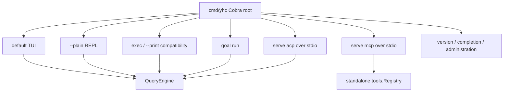

# Entrypoints and Transports

**Status:** current
**Wiring:** supported composition roots are active; some transport libraries remain inactive
**Last verified:** 2026-08-07

> **Ownership:** This file owns executable entrypoints, process-level protocol
> surfaces, and whether transport packages are production-wired. MCP client and
> MCP server architecture are separate concerns owned by
> [`mcp.md`](../capabilities/mcp.md) and the migration architecture docs.

## Production Entrypoints



| Entry | Transport | Runtime ownership |
|---|---|---|
| `yhc` | terminal UI | Creates one `QueryEngine`; Bubble Tea projects engine events and snapshots. |
| `yhc --plain` | line-oriented stdin/stdout | Creates one `QueryEngine`; the REPL dispatches engine-owned slash commands and submits prompts. |
| `yhc exec [prompt]` | prompt argument and/or stdin; text or one versioned JSON object on stdout | Creates one `QueryEngine`; consumes its event channel until terminal completion. |
| `yhc -p [prompt]` | compatibility route to the same headless owner | Preserves existing scripts while `exec` is the canonical non-interactive entrypoint. |
| `yhc goal run --resume <id>` | bounded continuation driver; text or one versioned JSON object on stdout | Resumes one exact saved root Goal and invokes only the dedicated continuation claim/submission boundary; it does not dispatch slash input or create/edit Goal state. |
| `yhc resume <id>` / `--resume` | same surface as selected mode | Resumes the configured session before accepting new input. |
| `yhc serve acp` | ACP SDK over stdio | `server/acp.Agent` owns multiple ACP sessions, each backed by a `QueryEngine`. |
| `yhc serve mcp` | MCP SDK over stdio | Exposes registered tools directly; it is not a conversation `QueryEngine` transport. |
| `yhc version` / `completion` | text or JSON build identity / shell script | Initializes neither a model runtime nor a conversation engine. |
| `yhc sessions {list,resume,rename,export,fork,delete,recover-workboard}` | text or one versioned JSON administration result | Creates a provider-free administration `QueryEngine` only to reuse its engine-owned `SessionService`; it performs no model call and opens no TUI. Delete owns contained artifact cleanup; destructive WorkBoard recovery requires exact identity, revision, and acknowledgement. |
| `yhc config show` / `doctor` | text or one versioned JSON diagnostic result | Creates a provider-free inspection host and calls the existing source-derived diagnostic snapshot; provider routing is resolved as data without constructing a provider runtime or probing connectivity. |
| `yhc mcp {list,get}` | configured-server text or versioned JSON | Loads only configured server names/enabled state into an unconnected inventory; health is `unprobed` and connection material is omitted. |
| `yhc plugins {list,validate,reload}` | candidate/live-generation text or versioned JSON | Reuses the bundled/configured generation loader and registry checks; validate does not mutate, and reload is atomic only inside the short-lived inspection host. |

TUI, plain, headless, ACP, and child-Agent conversation entrypoints all use
`NewQueryEngine` and therefore enter the same compiled ProjectGraph. New root
Sessions pin `project_graph/v1/full`; supported resumed and child Sessions keep
their durable ProjectGraph stage. Retired Legacy, unpinned, invalid-stage, and
unknown-version transcripts remain inspectable but fail continuation before
model/tool work or transcript rewrite. The standalone MCP server bypasses
`QueryEngine` and exposes tools directly, so it does not create a conversation
Graph.

Goal is currently narrower than ProjectGraph reachability. Supported production
composition roots default it on for saved-root TUI and Plain, with no default
token budget; `goal.enabled: false` disables it. They expose typed `/goal`
controls, dynamic root-Goal-turn tools, progress, and the dedicated continuation
consumer. ACP exposes Goal only after private version-1 negotiation and only
through its extension methods; it does not make `/goal` a protocol command. A
direct low-level engine with nil `GoalCapability`, ordinary headless,
unnegotiated or disabled ACP, child/review, ephemeral/administration, disabled
TUI/Plain, and standalone MCP expose no Goal command, model tool, or claim
capability. The separate `goal run` process continues an already-created Goal
and still requires a positive `--max-continuations` bound.

`exec` owns a deterministic process contract. With no positional prompt, or
with the explicit `-` sentinel, it reads stdin. When both a prompt and piped
stdin are present, stdin is appended inside an explicit `<stdin>` block rather
than discarded. `--output-format text` writes only assistant/command output to
stdout; diagnostics go to stderr. `--output-format json` writes exactly one
schema-versioned result object containing status and exit code. Process exits
are `0` for completion, `1` for runtime failure, `2` for usage/validation, and
`130` for cancellation.

`sessions` applies the same text/JSON and exit taxonomy to durable session
administration. List supports bounded current-workspace search and cursor
pagination; resume restores and reports the exact durable session then exits;
rename and export use the same durable service as interactive `/sessions`; and
fork commits the child before activation validation and compensates only its
own child on failure. Administration construction skips provider resolution,
MCP connection, plugins, shell hooks, and long-lived settings services, and
does not compile ProjectGraph merely to list sessions. Resume/fork activation
validates the selected durable kernel and preserves its canonical target
checkpoint while skipping project runtime reload; close adds neither a second
target checkpoint nor a synthetic source transcript. Archive/delete remain
absent. Root `resume SESSION_ID` remains the TUI path, while `exec --resume`
continues a model turn.

Diagnostic and extension administration uses the same envelope and exit
taxonomy without inheriting runtime flags. `config show` fails closed when the
effective settings cannot load, while `doctor` reports settings failures in
its ordered check set. MCP inspection never launches or connects a configured
server. Plugin validation returns the retained live generation on rejection;
reload declares its process-local scope. MCP add/remove and plugin
install/uninstall/enable/disable/marketplace are not registered.

Runtime flags are local to the command that consumes them: root interactive
mode, `exec`, `resume`, and `serve acp`. They must follow the selected
subcommand. `serve mcp`, `version`, and `completion` reject model, permission,
and tool-selection flags instead of accepting no-op configuration. The default
MCP tool hook logs only tool name, byte counts, outcome, and duration; it never
logs argument bodies, result bodies, or raw tool errors.

Runtime semantics for Graph interrupts belong to
[`query-engine.md`](../runtime/query-engine.md) and
[`permissions.md`](../capabilities/permissions.md). At the transport boundary,
an unresolved permission, question, or Plan approval
returns a durable `waiting_input` boundary rather than retaining a transport
callback as runtime truth. The TUI can answer the reprojected owner-scoped
request and schedule its typed decision immediately. ACP drives the same
interrupt inside a Prompt: it requests protocol permission, enqueues the
targeted decision, and continues that Graph turn. On ACP Resume/Load, a pending
durable request is resolved and resumed before a new user prompt is accepted.
The plain REPL now does the same: its event driver renders the exact request,
enqueues the typed response, claims the one decision item, and continues the
same turn; after resume it settles a pending request before accepting new
input. Headless has no interaction provider and reports `waiting_input`
fail-closed. The standalone MCP server does not register Plan-transition
tools. No transport synthesizes a model-visible approval turn or a generic
permission grant.

ACP does not project transient provider argument fragments. The canonical
lifecycle emits one tool start for each committed invocation, then emits one
redacted complete effective input after permission settlement and immediately
before dispatch. A prompt-scoped ACP ledger de-duplicates the start and
projects that later input, replacement-safe progress, and one terminal result.
Current ordering and delivery limits are owned by
[`acp-adapter.md`](acp-adapter.md).

Provider fallback visibility is transport-specific but derives from the same
typed model-attempt event. TUI shows one warning for the later safe `started`
attempt; Plain and Headless write it only to stderr; ACP sends the private
`_session/status` extension; library callers receive typed events without a
forced writer. The notice never enters assistant history, transcripts, or
structured headless output. Detailed admission and disposal semantics belong
to [`model-providers.md`](model-providers.md#bounded-overload-failover).

## Inactive Libraries

`engine/transport` and `engine/remote` compile and have focused tests, but no
production entrypoint imports them.

| Package | Implemented surface | Wiring status |
|---|---|---|
| `engine/transport` | JSON `StructuredIO` and a `QueryEvent` output adapter | Disconnected from CLI, ACP, and MCP bootstrap. |
| `engine/remote` | stdio/TCP newline-delimited JSON transports and `SessionServer` | Disconnected; the type named `WebSocketTransport` uses `net.Conn` TCP framing, not a WebSocket protocol. |

These libraries must not be described as the transport used by IDEs or the
current SDK path. ACP stdio is the production IDE-facing protocol entrypoint.

## Code References

| Symbol | Evidence |
|---|---|
| root command tree and mode selection | [`newRootCommand`](../../../cmd/yhc/cmd/root.go), [`runRoot`](../../../cmd/yhc/cmd/root.go) |
| TUI and plain engine construction | [`runTUI`](../../../cmd/yhc/cmd/root.go), [`runPlainREPL`](../../../cmd/yhc/cmd/root.go), [`drivePlainQueryEvents`](../../../cmd/yhc/cmd/root.go) |
| headless input, result, and renderer ownership | [`newExecCommand`](../../../cmd/yhc/cmd/headless.go), [`resolveHeadlessPrompt`](../../../cmd/yhc/cmd/headless.go), [`renderHeadlessResult`](../../../cmd/yhc/cmd/headless.go) |
| dedicated Goal continuation process | [`newGoalCommand`, `newGoalRunCommand`, and `driveHeadlessGoal`](../../../cmd/yhc/cmd/headless_goal.go) |
| sessions administration tree and renderer | [`newSessionsCommand`](../../../cmd/yhc/cmd/sessions.go), [`renderSessionAdministration`](../../../cmd/yhc/cmd/sessions.go) |
| provider-free session-service host | [`NewSessionAdministrationEngine`](../../../engine/session_administration.go) |
| provider-free diagnostic/extension host | [`NewInspectionAdministrationEngine`](../../../engine/inspection_administration.go), [`newConfigCommand`](../../../cmd/yhc/cmd/diagnostics_extensions.go) |
| process exit taxonomy and signal context | [`ExitCode`](../../../cmd/yhc/cmd/cli_errors.go), [`main`](../../../cmd/yhc/main.go) |
| build identity | [`buildinfo.Current`](../../../internal/buildinfo/buildinfo.go), [`newVersionCommand`](../../../cmd/yhc/cmd/version.go) |
| ACP stdio bootstrap | [`newServeACPCommand`](../../../cmd/yhc/cmd/serve_acp.go), [`server/acp.Agent.createEngine`](../../../server/acp/agent.go) |
| ACP per-session engine identity | [`server/acp.Agent.createEngine`](../../../server/acp/agent.go) |
| ACP event, Plan resolution, and canonical tool lifecycle projection | [`server/acp.Agent.resolveProjectGraphPermission`](../../../server/acp/agent.go), [`server/acp.Agent.streamEvent`](../../../server/acp/agent.go), [`acpToolLifecycleLedger`](../../../server/acp/tool_lifecycle.go) |
| negotiated ACP Goal extension | [`server/acp.Agent.handleGoalExtension`](../../../server/acp/goal_extension.go) |
| MCP stdio bootstrap and safe default hook | [`newServeMCPCommand`](../../../cmd/yhc/cmd/serve_mcp.go), [`DefaultMCPToolHook`](../../../server/mcp/server.go) |
| disconnected structured I/O | [`engine/transport/structured_io.go`](../../../engine/transport/structured_io.go) |
| disconnected remote transport | [`engine/remote/transport.go`](../../../engine/remote/transport.go), [`engine/remote/transport.go`](../../../engine/remote/transport.go) |

## Example

```bash
# Canonical non-interactive execution with one JSON result:
yhc exec --output-format json "summarize this repository"

# Continue an existing Goal with an explicit process bound:
yhc goal run --resume SESSION_ID --max-continuations 8

# Conversation runtime exposed to an IDE:
yhc serve acp

# Tool server exposed to an MCP client; no conversation loop is created:
yhc serve mcp

# Provider-free durable session inspection:
yhc sessions list --output-format json --limit 20
yhc sessions resume SESSION_ID

# Provider-free diagnostics and extension inspection:
yhc config show --output-format json
yhc doctor
yhc mcp list
yhc plugins validate --output-format json
```
