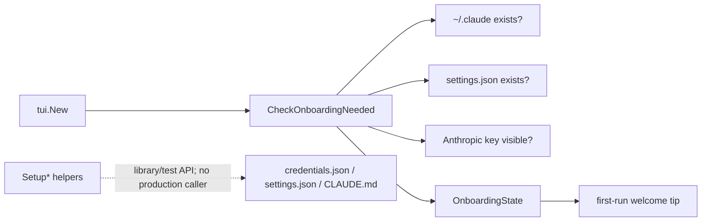

# Onboarding

**Status:** current
**Wiring:** partially wired; this document distinguishes active onboarding from helper-only APIs
**Last verified:** 2026-08-07

> **Ownership:** This file owns first-run detection and the onboarding helper
> API. Provider credential resolution belongs in [`model-providers.md`](model-providers.md);
> TUI startup presentation belongs in
> [`architecture/tui/README.md`](../tui/README.md).

## Production Boundary

The released TUI calls `CheckOnboardingNeeded` while constructing the welcome
screen. It uses only `IsFirstRun` to pin first-run guidance. There is no
production wizard that calls the setup helpers.



`CheckOnboardingNeeded` reports three independent signals:

- whether the user configuration directory is absent;
- whether the user settings file exists;
- whether `ANTHROPIC_API_KEY` or the onboarding credentials file contains
  `anthropic_api_key`.

This detector is Anthropic-specific. It is not the provider-neutral readiness
check used by `provider.Runtime`, so a configured OpenAI, Gemini, DeepSeek,
Qwen, or Ark session may still appear incomplete to onboarding state.

## Helper API

| Helper | Current behavior | Production wiring |
|---|---|---|
| `SetupConfigDirectory` | Requests mode `0700` when creating the user config directory; it does not chmod an existing directory. | Not called by an entrypoint. |
| `SetupAPIKey` | Accepts only an `sk-ant-`-prefixed key and requests mode `0600` when creating `credentials.json`; it does not repair an existing file's mode. | Not called by an entrypoint. |
| `SetupDefaultModel` | Loads user config, changes `Model`, and saves it. | Not called by an entrypoint. |
| `SetupPermissionMode` | Persists one of `default`, `permissive`, or `strict`. | Not called by an entrypoint; runtime permission-mode semantics are owned elsewhere. |
| `CreateClaudeMdTemplate` | Creates a project `CLAUDE.md` without overwriting an existing file. | Not called by an entrypoint. |

Do not describe these helpers as an interactive setup flow. They are callable
library functions with focused tests.

## Code References

| Boundary | Code reference | Why it matters |
|---|---|---|
| first-run detector | [`CheckOnboardingNeeded`](../../../engine/onboarding/onboarding.go) | Produces the state consumed by startup presentation. |
| welcome integration | [`tui.New`](../../../internal/tui/app.go) | The only production onboarding caller. |
| step metadata | [`GetOnboardingSteps`](../../../engine/onboarding/onboarding.go) | Describes a potential wizard, but is not production-wired. |
| credential helper | [`SetupAPIKey`](../../../engine/onboarding/onboarding.go) and [`GetAPIKey`](../../../engine/onboarding/onboarding.go) | Shows the Anthropic-specific file shape and lookup. |
| project template | [`CreateClaudeMdTemplate`](../../../engine/onboarding/onboarding.go) | Owns non-overwriting template creation. |

## Example

```go
state := onboarding.CheckOnboardingNeeded()
if state.IsFirstRun {
    // Pin first-run guidance. Do not assume every NeedsSetup entry has an
    // interactive production handler.
}
```
