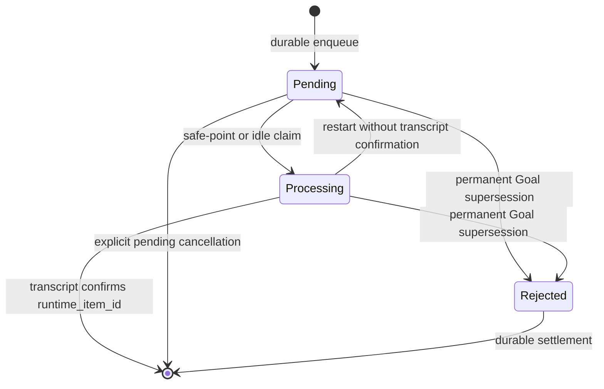

# Runtime Input Coordinator

**Status:** current
**Last verified:** 2026-08-07

> **Ownership:** one session-scoped `engine.RuntimeInputCoordinator` owns live
> input around ProjectGraph invocations; the transcript owns
> successful model-visible delivery.

## Current Coordinator Contract

The query runtime no longer uses `engine/queue.Manager`. User input, steering,
Agent messages, terminal Agent notifications, asynchronous hook rewakes,
explicit stop controls, and the P24.3 Goal continuation payload share
one versioned `RuntimeItem` union and one durable ledger next to the session
transcript.

The coordinator is outside Eino Compose local state. A Graph invocation receives
only the current plain revision, while the live coordinator remains in the
project invocation context. This keeps channel, mutex, callback, registry, and
transport ownership out of Graph checkpoints.

The unrelated generic `engine/queue.QueueManager` and `TurnQueue` helpers are not
part of this query-runtime contract.

Ordered rich input is now part of this durable contract.
`QueryEngine.EnqueuePromptInput` admits text, image, resource-link, embedded
text, and embedded-blob parts in caller order, stores media in the
session-private `MediaStore`, and persists only opaque media references in a
versioned `promptrecord.Record`. `QueuedPromptSnapshot` is a detached,
non-dispatchable projection for editing and display. Restart, edit, claim, and
execution reconstruct the exact ordered prompt from that durable record and
fail closed on missing, corrupt, or mismatched media. The older simple-text
runtime-item form remains readable; rich input has no inline-byte or
process-local fallback.

## Scheduling And Safe Points

- `PriorityNow`, `PriorityNext`, then `PriorityLater` defines scheduling order.
  FIFO is preserved within a priority.
- `is_meta` controls presentation only; it never overrides explicit priority.
- Session, Thread, and Agent scope must match exactly. Main and child runtimes
  cannot consume each other's input.
- A queued user turn is injected after a completed tool round or claimed as a
  fresh idle turn. Steering, Agent traffic, and async rewakes may enter at the
  next legal pre-model boundary.
- `PriorityLater` is eligible after `Sleep` and at a fresh inbound invocation
  boundary. It is not represented as in-flight preemption.
- `RuntimeItemGoalContinuation` is the exception: generic idle and safe-point
  selectors skip it regardless of priority. Its enqueue and recovery never
  publish the generic transport signal. P24.4 adds a second coalesced
  notification and QueryEngine-gated claim/submission path only for an enabled
  saved-root TUI.
- Every claimed item emits `command_lifecycle:started`, then one user-role
  attachment. `completed` follows the kernel terminal decision. This describes
  current transport-eligible items. The Goal claimant uses the same lifecycle,
  transcript receipt, accounting, and settlement owner after its final
  P24.3 admission succeeds.
- New input resets the repeated-identical-tool streak because it changes the
  strategy context.

```mermaid
flowchart LR
    accTitle: Runtime input delivery
    accDescr: Producers persist a scoped item before a Graph safe point injects it, the transcript confirms delivery, and the ledger item settles.
    Producer["TUI / async hook / Agent outbox"] --> Persist["Durable RuntimeItem enqueue"]
    Persist --> Coordinator["Session input coordinator"]
    Coordinator -->|"Graph prepare or after-tool safe point"| Started["started event"]
    Started --> Attachment["model-visible attachment"]
    Attachment --> Transcript["transcript checkpoint"]
    Transcript --> Settle["settle ledger item"]
    Settle --> Completed["completed event"]
```

## Durability And Replay

Coordinator mutation uses an atomic `0600` temp-file, file sync, rename, and
directory sync sequence. File state is committed before the corresponding
in-memory state becomes observable.

One item moves through:

On restart:

- transcript-confirmed IDs are removed from the ledger and deduplicated;
- unconfirmed `processing` items return to `pending`;
- durably rejected Goal items are discarded and never recovered to pending;
- stale stop controls are discarded;
- image parts pass the shared strict engine admission both at enqueue and
  recovery: at most 20 PNG/JPEG/WebP/single-frame GIF images, 5 MiB each,
  10 MiB total, and 25,000,000 pixels each; strict base64, declared/detected
  MIME equality, an exact terminal boundary, and complete decode are required;
- image rejection happens before ledger mutation, and corrupt persisted image
  content fails closed instead of re-entering the pending queue;
- `UserImage.Name` and `UserImage.Path` are cleared before a new runtime item
  is persisted or projected from recovered state; the TUI retains its separate
  process-local preview for labels and editing;
- unsupported or corrupt ledger versions fail closed;
- an unavailable parent under which no ledger can exist starts empty only to
  preserve the existing transcript-repair path; enqueue/claim mutations still
  require the durable write and never fall back to memory;
- a delivered external outbox ID can be acknowledged without being injected
  again.

Agent terminal notifications and SendMessage payloads use two-phase transfer:
peek the source outbox, durably enqueue the complete batch, then acknowledge the
same stable IDs. Async exit-code-2 rewakes follow the same rule and cannot fall
through the ordinary hook-message drain.

## Stop And Transport Behavior

`RuntimeStopGraceful` waits for a canonical round boundary.
`RuntimeStopImmediate` also invokes the active abort controller. Neither mode
claims that a non-cancellable model or blocking tool was preempted.

The TUI subscribes to the coordinator and may start a fresh turn while idle.
ACP and plain transports do not fabricate hidden prompts; pending runtime input
is absorbed at their next legal inbound request boundary. `Ctrl+C` and ACP
Cancel request immediate stop only while the same turn controller remains
active. Terminal settlement and controller identity close the cancellation
race, so an idle or late Cancel cannot stop the next prompt.

Goal continuations remain outside generic transport behavior. They do not wake
`SubscribeRuntimeItems` and cannot be returned by `ClaimNextRuntimeItem` or
Graph safe-point collection. A separate Goal notification surfaces an already
pending or newly enqueued exact item to one enabled idle TUI. The TUI gives
ordinary pending input and permission resumption precedence, claims through
`ClaimNextGoalContinuation`, and submits through `SubmitGoalContinuation`.
Final admission rechecks the exact Goal cursor plus Plan, permission,
accounting, cancellation, and newer user-input state. Permanent
supersession checkpoints the Goal rejection before the coordinator records
`rejected` and settles the item; a checkpoint-write failure remains retryable
and may return the same item to pending.

## Code References

- [`RuntimeItem` and coordinator](../../../engine/input_coordinator.go)
- [`EnqueuePromptInput` and `QueuedPromptSnapshot`](../../../engine/queued_input.go)
- [Versioned ordered prompt record](../../../engine/internal/promptrecord/record.go)
- [Session-private media store](../../../engine/internal/mediastore/store.go)
- [Goal continuation identity and admission](../../../engine/goal_continuation.go)
- [`validateUserImages`](../../../engine/user_image_admission.go)
- [External outbox transfer](../../../engine/input_sources.go)
- [ProjectGraph safe-point projection](../../../engine/round_lifecycle.go)
- [Graph invocation revision](../../../engine/graph_query_kernel.go)
- [Transcript settlement](../../../engine/engine.go)
- [TUI idle subscription](../../../internal/tui/queued_input.go)

## Evidence

- [Coordinator priority, recovery, replay, and persistence tests](../../../engine/input_coordinator_test.go)
- [Queued rich-input admission, edit, and recovery tests](../../../engine/queued_input_test.go)
- [Canonical safe-boundary tests](../../../engine/query_queue_drain_test.go)
- [Canonical ProjectGraph fixture](../../../engine/testdata/canonical_trace/queue_safe_boundary.golden.json)
- [Agent outbox acknowledgment tests](../../../tools/agent_runner_test.go)
- [TUI idle and restart-preview tests](../../../internal/tui/queued_input_test.go)
- [ACP next-inbound rewake test](../../../server/acp/agent_test.go)
- [P24.3 continuation, rejection, receipt, and recovery tests](../../../engine/goal_continuation_test.go)
- [P24.4 Goal wake, admission, and TUI tests](../../../engine/goal_workflow_test.go)
- [P24.4 TUI consumer and PTY tests](../../../internal/tui/goal_workflow_test.go)
