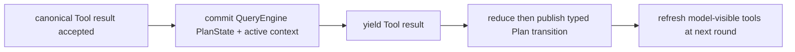

# Model and Tool Execution

**Status:** current
**Last verified:** 2026-08-07

> **Ownership:** `runCanonicalModelRound` for the project model-facing boundary;
> `runCanonicalToolRound` for the shared committed-call boundary;
> `engine.executeToolCall` for tool admission; `engine/execution` for provider,
> stream, retry, and concurrency mechanics

## Why classification and execution are separate

The production execution boundary is split intentionally. The model round
classifies a complete provider stream without any tool side effect; the Graph
tool round alone dispatches the committed calls. `engine/execution` wraps model
streaming, accumulation, retry, fallback signals, side queries, and generic
concurrent helpers. It does not own QueryEngine policy. Completed tool calls
converge at `engine.executeToolCall`.

## Canonical tool order

```mermaid
flowchart LR
    accTitle: Canonical tool admission and execution order
    accDescr: A committed tool call passes reserved-name admission, validation, Plan and repeated-call guards, hooks, permission, execution, persistence, and post-processing before its result is published.
    Input["tool call JSON"] --> Retired["reserved-name admission"]
    Retired --> Validate["parse / coerce / validate"]
    Validate --> Guards["plan + repeated-call guards"]
    Guards --> Pre["pre-tool hooks"]
    Pre --> Permission["permission policy"]
    Permission --> Execute["execute tool"]
    Execute --> Persist["attachments / offload / file snapshot"]
    Persist --> Post["post-tool hook"]
    Post --> Result["tool result message"]
```

Detailed behavior:

1. Reject permanently unavailable built-in names before parsing, registry
   lookup, hooks, permissions, or execution.
2. Parse arguments; find the registry entry; coerce semantic booleans/numbers;
   run schema and tool-specific validation.
3. Enforce the central Plan capability decision, including exact plan-file
   identity, then the query-local repeated-call ticket in model order.
4. Run pre-tool hooks. Updated input becomes the permission and execution input;
   stop/deny exits before ordinary permission prompting. Plan admission is
   re-evaluated before permission when a hook returns.
5. Run QueryEngine permissions. Hook allow still passes explicit deny rules.
   Any permission-updated input is re-evaluated by the same Plan decision before
   serialization and execution.
6. Execute through the configured executor with tool-use, permission-mode,
   exact Plan-file identity, MCP, attachment, and cancellation context.
7. On success, optionally offload a large result, record file state, normalize
   empty output, and run post-tool hooks. On failure, run post-tool-failure hooks
   and return an error tool result.

## Model path

`runCanonicalModelRound` is the single production ProjectGraph model boundary.
It applies the stateful content-replacement budget,
prepends user context, normalizes API messages, freezes the current
model-visible tool projection, system prompt, provider options, and
process-local reasoning intent. Before route construction, the attempt
coordinator estimates the complete immutable prompt footprint: normalized
messages, system prompt, and the detached JSON form of every tool schema,
including serializable `ToolInfo.Extra`. This estimate is only context
admission; it is neither billing nor output-token reservation.

`CallModelWithRetry` owns same-route retry. Only a typed overload may return to
the project attempt coordinator and select a constructable admitted alternate.
The exact reasoning intent remains frozen; an alternate that cannot lower that
effort is skipped before dispatch instead of receiving a cleared or guessed
value. Once an alternate is constructable, the old attempt emits `discarded`,
an exact tombstone follows only for offered retractable TUI output, and the
next attempt emits `started` before provider dispatch. The switched attempt
does not also emit terminal `failed`. Full route, budget, visibility, and
privacy rules are owned by
[`model-providers.md`](../platform/model-providers.md#bounded-overload-failover).

`CallModel` prepends the system message, binds the projected tools, maps Eino
model options, and calls `BaseChatModel.Stream`. `ProcessStream` and the stream
accumulator merge partial text and cumulative tool-call argument snapshots.
These helpers remain mechanics; the shared project runner owns their ordering,
event projection, and terminal mapping.

Structured assistant output remains provider metadata rather than display text.
Stream finalization and the Agentic replay bridge delegate indexed output-part
concatenation to Eino's public `schema.ConcatMessages` contract, which preserves
part type, `StreamingMeta.Index`, `Extra`, and reasoning signatures. Canonical
`Content` and `ReasoningContent` bytes are not trimmed or whitespace-normalized;
if structural concatenation fails, replay retains the original parts instead of
inventing a second merge rule.

## Streamed-turn commit boundary

`ProcessStream` forwards partial tool calls to `StreamingToolExecutor`, but the
executor keeps the complete set in a pending state while the stream is open.
After EOF, one provider-neutral classifier evaluates the accumulated finish
reason, withheld API-error presence and reason, clean-EOF observation, stream
error, and context error before the set can cross the execution boundary:

| Terminal outcome | Tool behavior |
|---|---|
| `stop`, `stop_sequence`, `end_turn`, `tool_calls`, `tool_use` | Commit once, then use the existing stable scheduler and result order. |
| empty reason with clean EOF | Commit through the provider-neutral compatibility path. |
| terminal or withheld `length`, `max_tokens`, `max_output_tokens` | Reject every call in model order with an error result; execute none. |
| context cancellation before commit | Reject pending calls as interrupted; execute none. |
| stream error, any non-truncation or untyped withheld error, or unknown non-empty reason | Reject pending calls, preserve the existing recovery/model-error path, and execute none. |

`ProcessStream` returns `ToolCallsCommitted` in addition to the accumulated
messages. `runCanonicalModelRound` constructs exactly one stream collector with
`DeferExecution: true`: it tracks cumulative calls and terminal classification,
emits the same model-ordered rejection results for truncated/cancelled turns,
but has no execution, permission, hook, progress, scheduling, or interrupt
callback. Only the Graph tool node can execute the committed set. Rejected
calls still traverse the
after-tool safe point so their assistant/error history, runtime-input claim, and next
model request retain the frozen canonical trace. Provider/stream errors remain a live
canonical Terminal; they never enter Compose local state.

The project-owned `agenticChatModel` bridge preserves metadata-only terminal
chunks and maps Eino Agentic response extensions from Claude, OpenAI, Gemini,
Ark, DeepSeek, and Qwen into the raw finish reason consumed by this classifier.
Provider identity and routing do not enter `ProcessStream`. After a successful
commit, the existing validation, repeated-call, hook, permission, concurrency,
sibling-cancellation, and result-order contracts remain canonical.

## Project Graph canonical tool round

The ProjectGraph tool node does not create another tool-policy owner. The
model-committed calls are JSON-cloned into plain Graph state, then
`runCanonicalToolRound` validates their ID, name, arguments digest,
concurrency classification, and order through the P13.3 strict schedule.
`ExecuteCommittedToolCalls` commits that already classified set once through
the existing `StreamingToolExecutor`; every admitted call still reaches
`executeToolCall`.

The live registry is consulted at tool-node execution time, so a schema
registration completed by the model boundary is visible without storing the
registry in Graph state. Stable adjacent-safe batches, serial barriers,
bounded concurrency, Bash sibling cancellation, repeated-call tickets,
permission coordination, hooks, attachments, offload, file state, progress,
and context transitions keep their current owners. Results remain rich
`toolExecutionOutcome` values keyed by stable call ID until
`decideAfterToolRound` validates the complete model-ordered round and selects
continue, successful return, or non-durable interrupt.

Cancellation after commit is observed while waiting. Calls that have not
started are rejected without crossing the side-effect boundary; running
`cancel` tools receive synthetic interruption results, while running `block`
tools settle naturally according to registry metadata. Only cloned Tool
messages, terminal reason, and tagged branch values enter or leave Graph local
state. Eino v0.9.12's error-only after-tool hook is neither modified nor used
for control flow.

## Plan transition commit boundary

Enter/Exit tools remain ordinary canonical tool calls until their result has
passed admission, execution, hook processing, cancellation, and scheduler
settlement. Their `toolExecutionOutcome` carries a deferred context modifier.
The `StreamingToolExecutor` inside the ProjectGraph tool round consumes that
modifier at the accepted-result boundary.

The ordering is:

The QueryEngine transition method validates active-turn ownership, current
phase, target mode, request identity, and external safe-boundary access. A
transition error rewrites the matching Tool result as an error and publishes no
Plan event. For `cancel`-behavior tools, cancellation already observable under
the scheduler lock wins even if a non-cooperative executor then returns
success; its modifier is discarded. `block`-behavior tools may still settle
naturally. Canonical interrupt selection always classifies Plan transitions as
`cancel`, independent of an omitted registry interrupt hint. The runtime event
is lossless and replayable; it is a projection, not another transition owner.

For Exit, the coordinator first records AwaitingApproval, validates an exact
typed request/revision decision, and returns the phase to Active. The decision
travels to canonical tool execution outside model-owned input. Only the
successful accepted Tool result can choose `default`, `acceptEdits`, or
`bypassPermissions` in the commit sequence above. Cancellation synchronously
settles the live interaction before a cancel-behavior tool receives its
synthetic interrupted result.

This project-owned boundary runs beneath the single production ProjectGraph.
Eino Compose owns Graph execution mechanics, but it does not own Plan
phase, approval identity, permission semantics, event order, or persistence.
The versioned session checkpoint stores only the durable Plan value fields.
Cold AwaitingApproval normalizes to Active; a same-process request remains
Awaiting only when reducer and coordinator identities both match. The restored
exact file identity is carried through `ToolUseContext` into Write/Edit,
Enter/Exit, compaction, and ProjectGraph. No callback, approval
decision, or grant crosses the durable boundary.

## Invariants and edge cases

- Invalid JSON, unknown tools, and validation failures never run hooks,
  permissions, or the executor.
- A Plan-disallowed tool is rejected after validation but before the repeated
  guard, hooks, permission presentation, or executor. Model-visible filtering
  uses the same decision but is never treated as authorization.
- An initially valid Plan Write/Edit cannot be redirected by a pre-tool hook or
  permission callback. The exact-path and symlink checks run again after each
  supported input-rewrite boundary.
- The repeated-call guard is ordered before pre-hooks and permission prompts; a
  blocked third identical call has no side effects.
- Permission or pre-hook input changes must be re-encoded before execution.
- File snapshots happen only after successful execution. Post-failure hooks are
  a distinct branch.
- Concurrent execution may overlap safe tools, but result/admission ordering
  must remain deterministic where the query contract requires it.
- No tool admission, hook, permission prompt, or side effect begins before the
  streamed assistant turn commits. Rejection results retain model call order.
- The ProjectGraph model node owns only a deferred classification executor.
  It can emit rejection results but cannot run a committed tool. Only the
  complete committed call set can cross into the canonical Graph tool node.
- A Graph cancellation never starts a queued tool. Running `cancel` tools may
  be projected as interrupted even if a non-cooperative goroutine returns
  later; running `block` tools remain part of terminal settlement.
- Tool registries, callbacks, contexts, mutexes, cancellation owners, rich
  outcomes, and functions never enter Compose local state.
- A failing model boundary never enters Compose local state or a successful
  finalize branch; its typed terminal stays on the node execution stack.
- The generic `engine/execution.ExecuteToolBatch` pipeline is not an alternate
  authority for cross-round policy.
- `QueryEngine.PlanState` is the only Plan phase owner. Tool contexts, runtime
  snapshots, and entrypoint presentation cannot independently mutate phase.
- A Plan transition event follows its corresponding Tool result; the next
  model call observes the committed surface only through the between-round
  refresh.
- Reasoning effort is admitted by the resolved provider/model capability and is
  independent from continuation `TokenBudget`. One in-flight failover request
  preserves its frozen effort; an incompatible alternate is skipped before
  dispatch rather than receiving an omitted or guessed field.

## Code references

- [`executeToolCall`](../../../engine/tool_execution.go)
- [Central Plan tool policy](../../../engine/plan_tool_policy.go)
- [Validation and Plan guard](../../../engine/tool_execution.go)
- [Repeated-call guard](../../../engine/tool_execution.go)
- [Pre-hook and permission seam](../../../engine/tool_execution.go)
- [Execution, offload, file state, and post-hook](../../../engine/tool_execution.go)
- [`runCanonicalModelRound`](../../../engine/model_round.go)
- [`newModelAttemptCoordinator`](../../../engine/model_failover.go)
- [`modelFailoverRequirements`](../../../engine/model_failover.go)
- [`ProcessStream`](../../../engine/execution/stream_processor.go)
- [`ConcatAssistantOutputParts`](../../../engine/messages/normalize.go)
- [`messagesToAgentic`](../../../engine/provider/provider.go)
- [Model and effort controls](../../../engine/execution_controls.go)
- [`bindProjectGraphCanonicalModelRound`](../../../engine/graph.go)
- [`runCanonicalToolRound`](../../../engine/tool_round.go)
- [`bindProjectGraphCanonicalToolRound`](../../../engine/graph.go)
- [`CallModel`](../../../engine/execution/call.go)
- [`CallModelWithRetry`](../../../engine/execution/retry.go)
- [`ProcessStream`](../../../engine/execution/stream_processor.go)
- [`StreamingToolExecutorConfig.DeferExecution`](../../../engine/execution/streaming.go)
- [Stream terminal classifier](../../../engine/execution/finish_reason.go)
- [`StreamingToolExecutor`](../../../engine/execution/streaming.go)
- [`ExecuteCommittedToolCalls`](../../../engine/execution/streaming.go)
- [P26 model/tool owner source gate](../../../engine/model_round_owner_test.go)
- [`PlanState` and serialized transitions](../../../engine/plan_state.go)
- [Agentic finish-reason bridge](../../../engine/provider/provider.go)
- [`newToolSchedule`](../../../engine/tool_schedule.go)
- [`validateToolSchedule`](../../../engine/tool_schedule.go)
- [`decideAfterToolRound`](../../../engine/tool_schedule.go)

## Related tracking

Provider routing is in [`model-providers.md`](../platform/model-providers.md), tool assembly in
[`tool-registry.md`](../capabilities/tool-registry.md), and recovery in
[`recovery.md`](recovery.md).
