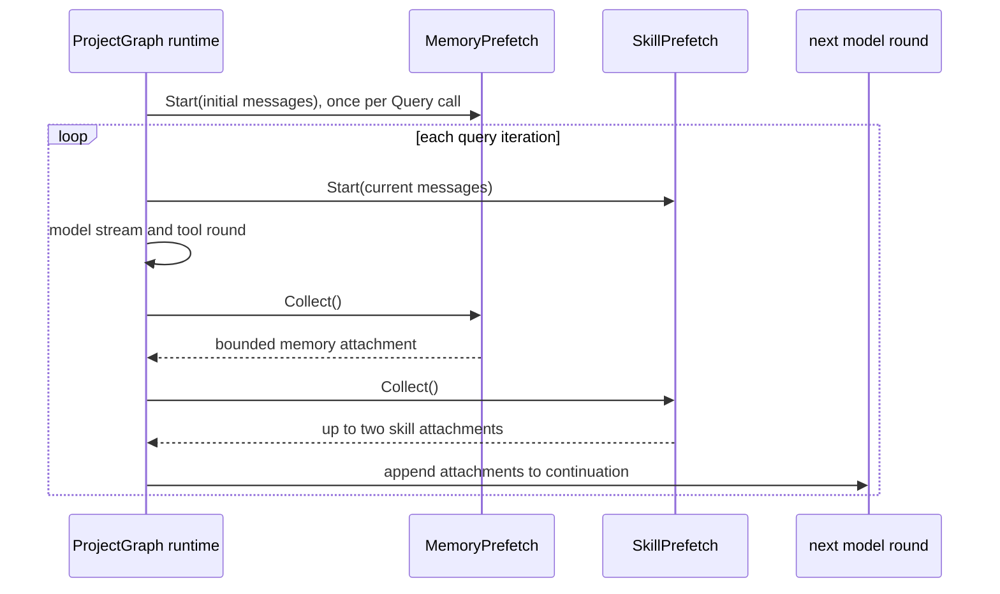

# Query Prefetch

**Status:** current
**Wiring:** query enrichers are active; the standalone runner is outside production wiring
**Last verified:** 2026-08-07

> **Ownership:** This file owns asynchronous memory/skill enrichment used by
> canonical ProjectGraph round preparation and the separate generic prefetch library. Prompt construction
> order belongs in [`context-assembly.md`](context-assembly.md); memory and skill stores
> belong in [`memory-directory.md`](../state/memory-directory.md) and
> [`skills.md`](../capabilities/skills.md).

## Active Query Path

The canonical ProjectGraph lifecycle uses two small best-effort prefetchers, not
`PrefetchRunner`.

### Memory prefetch

`MemoryPrefetch.Start` launches one goroutine before the main loop. It loads
the compact memory store, ranks entries against the latest user query, formats
them under an approximate character budget, and returns a system attachment.
`Collect` waits for that goroutine.

The result is non-consuming: later Graph iterations can collect the same memory
attachment again. The canonical lifecycle, not the prefetcher, owns whether that
attachment is appended to another continuation.

### Skill prefetch

A new `SkillPrefetch` is created for every loop iteration. It scans the latest
user message against skill names, tags, and description words, invokes at most
two matches, truncates each result, and returns user-role meta attachments.

This path is explicitly best-effort. `Start` schedules work in a goroutine,
while `Collect` closes the same `sync.Once`; if collection wins the race, the
iteration receives no skill attachment. Explicit `Skill` tool invocation
remains the deterministic path.

## Standalone Prefetch Library

`PrefetchRunner` and `PrefetchCache` implement a separate library surface:
TTL/priority caching plus Git status, `CLAUDE.md`/`AGENTS.md`/settings reads,
and skill-directory listings. No production composition root constructs a
`PrefetchRunner`; it is exercised by package tests only.

| Surface | Wiring |
|---|---|
| `MemoryPrefetch` | Active in `newCanonicalQueryRuntime` and canonical round preparation. |
| `SkillPrefetch` | Active, best-effort, per iteration. |
| `PrefetchRunner` | Outside the production call path. |
| `PrefetchCache` | Used by `PrefetchRunner`; not the cache behind active memory/skill prefetch. |

## Code References

| Boundary | Code reference | Why it matters |
|---|---|---|
| query construction | [`newCanonicalQueryRuntime`](../../../engine/query_runtime.go) and [`runCanonicalRoundPreparation`](../../../engine/round_lifecycle.go) | Starts memory once and skill discovery per iteration. |
| attachment collection | [canonical prefetch drain](../../../engine/round_lifecycle.go) | Adds results after a tool round for the next continuation. |
| memory ranking and budget | [`MemoryPrefetch.Start`](../../../engine/prefetch/memory.go) | Implements the blocking collect contract and result shape. |
| skill matching | [`SkillPrefetch.Start`](../../../engine/prefetch/skill.go) and [`findMatchingSkills`](../../../engine/prefetch/skill.go) | Shows the best-effort race and match limit. |
| library runner | [`PrefetchRunner.RunPrefetch`](../../../engine/prefetch/runner.go) | Implements the disconnected generic runner. |
| cache eviction | [`PrefetchCache.Set`](../../../engine/prefetch/cache.go) | Defines TTL/priority library behavior. |

## Example

A user prompt containing a skill name can receive the skill body as a
`skill_prefetch` attachment after a tool round. Code that requires the skill
to run must still call the `Skill` tool; prefetch is an optimization, not a
guarantee.
