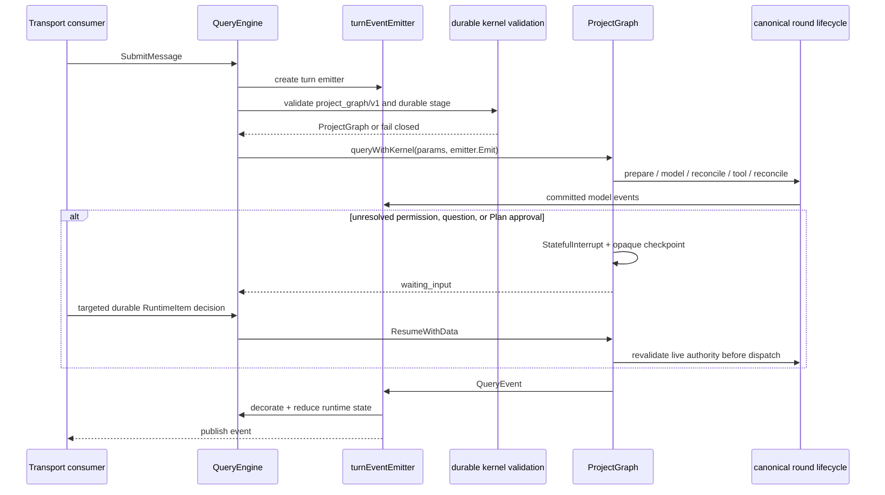
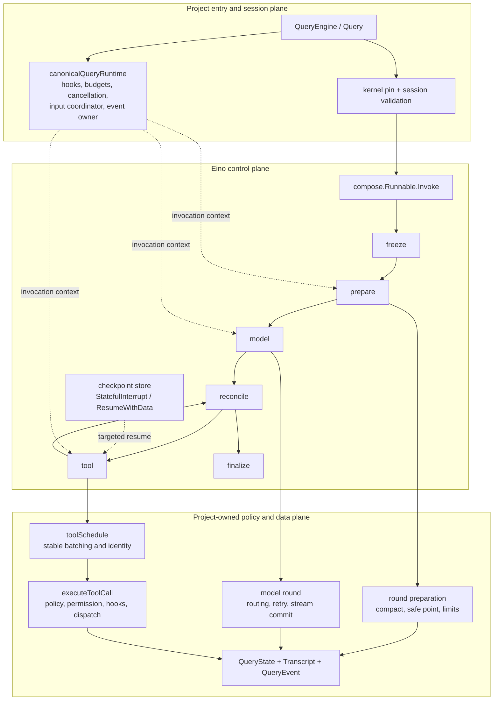

# Query Engine

**Status:** current
**Last verified:** 2026-08-07

> **Ownership:** `engine.QueryEngine` for session lifetime and durable kernel
> validation, Plan/Goal lifecycle serialization, and Session checkpoints; the
> canonical lifecycle functions for round policy; and
> `projectGraphQueryKernel` plus its protected checkpoint sidecar for the
> single production traversal, durable HITL, and child execution

## Which boundary owns a conversation

`QueryEngine` is the production conversation boundary. It owns long-lived
session state and subsystem instances; each `SubmitMessage` creates a turn event
stream and invokes ProjectGraph. Every new root Session pins
`project_graph/v1` with the unrestricted `full` stage, while resume validates
the durable version rather than reinterpreting history. Historical
`legacy/v1` and unpinned transcripts remain discoverable, inspectable, and
exportable, but continuation fails before model/tool execution or transcript
mutation. Child execution adds two internal ProjectGraph stages:
synchronous `RunAgent` pins
`foreground_child`, while a new asynchronous `RunAgentBackground` Session pins
`background_child`. Neither stage is root-selectable. Async continuation
honors a supported ProjectGraph pin; a retired or unpinned child fails
admission, while a foreground child resumed through `SendMessage` remains on
its foreground Graph pin. There is no
`QueryEngineConfig`, CLI, or public kernel
selector. Direct `Query` calls use the same ProjectGraph owner. TUI, plain, headless,
ACP, and child Agents use the `QueryEngine` boundary. See
[`architecture/runtime/README.md`](README.md) for the runtime index and
[`architecture/README.md`](../README.md) for entrypoints.

## Durable Goal State And Projection

P24.1 added one internal `QueryEngine` Goal transition owner. It serializes
create, edit, pause, resume, budget, and clear with the existing Plan boundary
in the fixed order `planMu -> goalMu -> QueryEngine.mu`. A transition builds a
detached candidate, writes and flushes the complete Session checkpoint, and
only then publishes the new live Goal. A failed checkpoint leaves the previous
live revision unchanged.

One saved root thread may own at most one unfinished Goal. Ephemeral engines,
child/review Agents, and administration-only hosts cannot mutate it; a Session
fork clears the source Goal. An active Goal blocks entry into Plan, while
active or awaiting-approval Plan state blocks Goal creation and resume. Neither
mode silently pauses, resumes, exits, or approves the other.

P24.2a added an engine-only read boundary without making Goal executable.
`GoalSnapshot` returns a defensive lifecycle snapshot, while
`EventGoalLifecycle` and `RuntimeStateStore` provide one ordered bounded
projection. Every Goal-bound event carries the exact Goal/objective revision,
root Session/thread/Agent, logical Goal turn, and child Agent generation where
applicable. The reducer rejects stale revisions, conflicting lineage,
incomplete blocker/completion evidence, and a `turn_finished` record that does
not bind the immediately following terminal sequence.

One logical Goal turn may cross several ProjectGraph query turns while waiting
for permission. The waiting terminal remains the final publication for that
query turn but retains the Goal turn and its excluded wait interval; the
targeted permission decision rebinds the same Goal identity without counting
as steering. A successful or failed final terminal checkpoints
`RootActiveTimeMillis`, emits `turn_finished` immediately before terminal, and
then releases process-local ownership. Foreground child waits and human
permission waits do not accrue root time. A terminal checkpoint failure emits
`persistence_error`, advances no Goal terminal cursor, and releases only the
process-local turn.

Completion and blocker updates bind the exact Goal ID, objective revision, and
distinct Goal turn. P24.4 exposes those two evidence transitions through
root-only `update_goal`; QueryEngine remains the final validator. Completion
commits only at the matching completed terminal after provider accounting,
required waits, foreground child work, and earlier queued user steering are
clear and the complete checkpoint succeeds. The same normalized blocker key
must appear in three distinct Goal turns; duplicates are no-ops, while key
change, user steering, objective change, and resume reset the streak.

Child launch freezes the root Goal identity for one exact Agent generation.
The child Session persists only an inert versioned binding and can emit
attributed runtime events. P24.2b gives a live exact generation only a narrow
in-memory provider-usage reporter bound to that immutable launch/resume
identity; it still cannot mutate Goal state or budget. Generation restart
updates both bindings before executor entry, and revocation prevents a stale
generation from charging later calls. Forks clear both root state and child
binding.

P24.2b adds one root-scoped provider admission and aggregation service. Root
and bound-child attempts share a capacity-one gate. Before the provider
stream, the engine checkpoints one pending admission containing exact
Goal/objective, root and executing Session/thread/Agent generation, logical
Goal turn/round, logical request ID, model attempt ID and index, model profile,
retry index, and provider-call identity. Settlement matches that complete v2
identity exactly. The provider call ID is also the Claude request correlation
ID. A final cumulative provider usage snapshot is
normalized once, appended and fsynced in the Goal transcript ledger, then
applied to `TokensUsed`, `UsageLedgerRevision`, coverage, and any
`budget_limited` transition before the pending admission is cleared.

A proven pre-dispatch failure may release the admission. Once dispatch may
have occurred, missing or invalid usage, corrupt/conflicting recovery
evidence, or uncertain ledger durability makes the Goal `usage_limited` and
blocks every later root or child admission. Recovery applies an exact flushed
record once or fails closed on an unresolved pending admission. The main
round, retry/fallback seam, compaction, permission classifier/explainer, tool
summary, and WebFetch AI helper use the same capability. The advisory
permission reviewer and long-session background models do not run under an
unfinished Goal; a provider boundary also prevents a pre-Goal queued
background call from crossing Goal activation.

P24.3 added a versioned continuation lifecycle. An eligible `completed`
terminal has an active Goal, a token budget that is either absent or has
remaining capacity, settled provider accounting, no pending
completion intent, and no human or child wait. Terminal aftercare writes one
immutable continuation cursor in the complete Goal checkpoint, then
idempotently enqueues the matching deterministic
`RuntimeItemGoalContinuation` at `PriorityLater`. The cursor binds the exact
Goal, objective and state revisions, root scope, predecessor turn and
terminal, budget and usage ledger, continuation ordinal, runtime revision, and
checkpoint/next-turn identity. A checkpoint failure creates neither cursor nor
item; an item-write failure leaves the one cursor recoverable without
advancing another ordinal.

Generic idle and safe-point claims still skip the item, its enqueue/recovery
publishes no generic transport signal, and public `SubmitRuntimeItem` cannot
turn it into a prompt. P24.4 adds a separate coalesced Goal notification plus
gated `QueryEngine` claim/submission methods. P24.5a extends the same
capability from saved-root TUI to saved-root Plain without changing the
generic selectors. P24.5b adds the only headless consumer through its distinct
bounded `headless-goal` composition identity. P24.5c adds an ACP consumer only
when the connection negotiates private Goal version 1 and the Goal capability
is enabled. Production composition roots default that capability to enabled
with no default token budget; `goal.enabled: false` is the configuration kill
switch. Ordinary headless, unnegotiated or disabled ACP,
children, review Agents, ephemeral/administration engines, disabled
interactive entrypoints, and standalone MCP neither claim nor wake for it.

Before that internal seam becomes a turn, QueryEngine revalidates the cursor,
current Goal and objective, exact terminal/accounting/runtime identity,
budget eligibility (an absent budget is unlimited), Plan and permission
exclusion, cancellation, and pending
user input. Pause, edit, clear, budget change, cancellation, or explicit user
input checkpoints a permanent rejection before the coordinator item is
rejected and settled. A transcript receipt settles an admitted item before any
provider call; the Goal cursor then records `delivered`. Recovery uses the
cursor, queue ledger, rejection, and transcript receipt together: an exact
pending or admitting cursor recreates at most the same item, while delivered,
rejected, stale, conflicting, corrupt, or unsupported evidence cannot
redeliver.

Goal persistence is now version 4, with a version-2 continuation cursor and
version-2 pending usage admission. Versions 1–3 remain compatible and
fail-closed: a legacy active Goal with no budget is not newly activated, and a
legacy budgeted continuation retains its identity. A legacy v1 in-flight usage
admission is preserved verbatim and cannot be settled as a v2 admission.
Unknown, malformed, or semantically corrupt state stays inert and can only be
preserved or cleared.

P24.4 adds the saved-root TUI capability without changing the persisted
schema; P24.5a projects the same engine authority into Plain. P24.5b adds a
separate bounded `goal run` process for an existing saved Goal. `/goal` actions
remain TUI/Plain-only and enter the existing command executor and transition
service; bare `/goal` is read-only. `get_goal` and `update_goal` are
dynamically projected only during an active root Goal turn and never grant
create, edit, pause, resume, clear, or budget authority to the model.

P24.5c exports `ApplyGoalControl` as a typed optimistic adapter over that same
transition service. ACP supplies exact expected Goal identity and revision;
the adapter serializes with TUI/Plain controls and returns only detached state.
An exact `_eino/goal/continue` request uses the existing dedicated
claim/submission APIs and canonical ACP event/permission driver. It drains the
producer before reading durable truth and never calls `SubmitMessage`.
Request IDs and notification event IDs are transport correlation only; Goal
revision plus durable continuation receipt/rejection remain replay authority.

The TUI consumes the dedicated wake only while idle and renders reducer-owned
status. Plain instead owns one process-lifetime `plainInputBroker`: it is the
only `ReadString` caller, and both idle input plus permission/Plan interaction
consume its typed line/EOF results. The Plain idle driver drains completed
input, then checks exact ProjectGraph permission ownership, then rechecks
input immediately before the dedicated Goal claim. It prints a bounded
`[Goal continuation]` attribution and lifecycle progress through one writer;
the internal continuation prompt is never presented as user input. EOF,
`/exit`, or context cancellation calls the existing engine stop owner, which
durably pauses an active Goal and retires an unadmitted cursor before exit.
Supported production composition roots enable the feature by default and leave
the numeric budget absent. A direct low-level `QueryEngine` embedding that
leaves `GoalCapability` nil remains disabled.

The dedicated `headless-goal` entrypoint resumes one exact saved Session,
inspects durable Goal state, and consumes only
`ClaimNextGoalContinuation`/`SubmitGoalContinuation`. It drains a whole
canonical turn, then re-reads `GoalSnapshot`; a completed query turn is never
treated as Goal completion. A required positive continuation bound limits
process work, while the existing Goal token budget and provider ledger remain
the execution authority. The process emits one versioned text or JSON result
and exits `0` only for durable `complete`. Ordinary `exec` and `-p` remain
one-shot and cannot claim Goal work.

## Runtime flow

`NewQueryEngine` supplies defaults, assigns session/thread identity, owns or
borrows managers, loads permission and hook configuration, and wires sub-agent
execution. `Close` is the lifecycle boundary for watchers, async hooks,
background services, MCP connections, and owned agent runners.

`queryWithKernel` initializes the query-local repeated-call guard and
dependencies, calls ProjectGraph, then emits completed command-lifecycle events
after the terminal decision. Public `Query` and `QueryEngine` both resolve the
shared compiled `projectGraphQueryKernel`. The deleted imperative traversal has
no compatibility executor.
`runCanonicalRoundPreparation`,
`runCanonicalModelRound`, `runCanonicalAfterModelRound`,
`runCanonicalToolRound`, and `runCanonicalAfterToolRound` own compact/context
preparation, provider execution and commit classification, recovery/stop
decisions, canonical tool execution, runtime-input safe points, attachment/prefetch
reinjection, and next-turn state. `canonicalQueryRuntime` constructs the live
per-invocation hooks, coordinator access, budgets, cancellation, recovery, and event
owners used by Graph traversal.

The canonical model node also owns one process-local model-attempt coordinator.
It freezes complete-request admission and reasoning intent, classifies
same-route retry versus overload-only profile switching, and emits bounded
attempt events. A successful switch disposes the old attempt as `discarded`,
optionally retracts only its exact TUI projection, then starts the admitted
alternate. These events are reduced runtime facts, not Compose state, Session
metadata, transcript history, or another traversal owner. See the
[`provider failover contract`](../platform/model-providers.md#bounded-overload-failover).

## Eino integration depth and ownership

Current query execution is **Eino-based at the orchestration control plane**, not
an Eino ADK agent with project behavior attached as middleware. The distinction
is intentional: Eino supplies graph traversal, typed branching, local state,
checkpoint, interrupt/resume, model, schema, and stream primitives; the project
continues to own every externally observable coding-agent policy.

| Eino SDK/framework primitive | Project integration | What Eino owns here | What remains project-owned |
|---|---|---|---|
| `compose.NewGraph`, Lambda nodes, edges, and typed branches | `buildProjectGraphKernel` compiles `freeze → prepare → model → reconcile → tool/finalize`. | Traversal mechanics, branch dispatch, node triggering, and run-step protection. | Branch meanings, terminal taxonomy, round limits, compact/recovery, safe points, and cleanup. |
| `compose.Runnable.Invoke` and invocation options | `projectGraphQueryKernel.run` creates one `canonicalQueryRuntime`, attaches checkpoint identity, invokes the Graph, and translates the result to `Terminal`. | One Graph invocation and framework error/interrupt transport. | Session/kernel admission, cancellation classification, event emission, and fail-closed behavior. |
| `compose.WithGenLocalState` and `compose.ProcessState` | `projectGraphKernelState` carries cloned input, calls, messages, decisions, counters, and trace values. | Per-invocation typed local-state lifecycle. | Live hooks, registries, coordinators, contexts, permission owners, and rich tool outcomes; these remain in `canonicalQueryRuntime` or the node stack and are never checkpoint payloads. |
| Checkpoint store, `compose.StatefulInterrupt`, `compose.ExtractInterruptInfo`, and `compose.ResumeWithData` | `graph_hitl.go` adds an atomic protected `0600` envelope containing the opaque Compose checkpoint and a versioned interrupt request; `projectGraphQueryKernel.run` accepts only a targeted `RuntimePermissionDecision`. | Opaque Graph position plus interrupt and resume protocol. | Envelope/scope validation, sanitized Session and event projections, invocation and policy digest revalidation, permission authority, and the decision-to-event projection. |
| `components/model.BaseChatModel`, `schema.Message`, and `schema.StreamReader` | The canonical model round calls the provider through `BaseChatModel`; `ProcessStream` classifies the complete stream before tool execution. | Provider-neutral model and streaming types. | Provider routing/fallback, request options, complete-stream commit barrier, error mapping, transcript, and runtime events. |
| Eino-ext `model.AgenticModel` provider adapters | `agenticChatModel` converts classic `schema.Message` to/from `schema.AgenticMessage` while the wider runtime remains on the classic message contract. Ordered user text/image/audio/video/file parts become typed Agentic blocks; invalid or unsupported parts fail before the inner provider call. | Provider-specific Agentic API integration and content-block response types. | Conversion fidelity, redacted typed admission failures, tool-call accumulation, message history compatibility, provider selection, and observable output contracts. |

The production Graph does not use `adk.ChatModelAgent`, `adk.Runner`,
`adk.TurnLoop`, or `compose.ToolsNode`. This describes the current production
owner, not a permanent framework boundary. The stable extension points can host
complete-stream commit, per-call stable batching, permission/hook ordering,
runtime-input safe points, recovery and event projection through project
adapters. The reviewed target and equivalence requirements are documented in
[`p12-p21-eino-lossless-replacement-design.md`](../../migration/reference/runtime/p12-p21-eino-lossless-replacement-design.md).

## Mapping from the retired Query Loop

P13 changed the traversal owner without rewriting the hard-won lifecycle
semantics. The table maps the previous imperative/experimental owners to the
current production path. “Moved” means the old responsibility now runs under a
Graph node; it does not mean Eino owns the policy.

| Retired or earlier logic | Previous responsibility | Current production owner | Change in observable behavior |
|---|---|---|---|
| Imperative `queryLoop` outer loop | Ordered each prepare/model/tool iteration and selected terminal exit. | `buildProjectGraphKernel` topology plus `reconcileProjectGraphQueryRound`; the five canonical lifecycle functions supply decisions. | Traversal is typed and checkpoint-capable; terminal and event semantics are preserved by project code. |
| Pre-model block inside the loop | Runtime-input drain, compact/context preparation, hooks, limits, and provider request setup. | `runCanonicalRoundPreparation`, called by the Graph prepare node. | One production path; safe-point ordering remains project-owned. |
| Direct model call and stream handling | Retry/fallback, stream accumulation, assistant commit, and tool-call detection. | `runCanonicalModelRound` plus `ProcessStream`, called by the Graph model node. | A complete stream is classified before any committed call reaches the tool node. |
| Retired immediate streamed-tool execution branch | Could execute a committed tool while processing the model round. | P26 deleted the unreachable branch, its selectable flag, and its fallback/abort state. `runCanonicalModelRound` now has one classification-only deferred collector; `runCanonicalToolRound` is the sole committed-call execution owner. | Model and tool phases remain separated, with no request, event, transcript, permission, hook, terminal, or side-effect change. |
| Post-model `continue`/`return`/recovery logic | Interpreted stream result, stop controls, recovery, token budget, and next action. | `runCanonicalAfterModelRound`, then `reconcileProjectGraphQueryRound`. | Decisions are explicit typed Graph branches instead of loop control statements. |
| Ad hoc tool-call iteration | Chose order/parallelism and dispatched tool calls. | `newToolSchedule`, `runCanonicalToolRound`, `StreamingToolExecutor`, and canonical `executeToolCall`. | Stable safe batches, serial barriers, model-order/result identity, and one committed execution owner are validated. |
| Post-tool continuation logic | Merged tool messages/context and decided whether to ask the model again. | `runCanonicalAfterToolRound` and the typed complete-round decision. | All committed outcomes are reconciled before continue, successful return, or interrupt. |
| Callback-only live permission pause | Waited in-process for a permission result. | Eino `StatefulInterrupt` plus the project sidecar, targeted `RuntimeItem`, and live-policy revalidation. | Supported root sessions can resume a precise tool boundary after restart; persisted intent never becomes permission authority. |
| `queue.Manager` live-input path | Buffered process-local follow-up input around loop iterations. | Durable `RuntimeInputCoordinator`, reached at canonical safe points. | Input is versioned, session-scoped, persisted before injection, and settled only after transcript commit. |
| `legacyQueryKernel` and ADK proof adapters | Kept alternate traversal or shadow compatibility paths. | Deleted; `productionQueryKernel` resolves one process-shared `projectGraphQueryKernel`. | Unsupported or unpinned durable kernels fail closed; no same-turn fallback or shadow model/tool execution remains. |

The historical decision and cutover evidence is retained in
[`query-engine-eino-convergence-audit.md`](../../migration/reference/runtime/query-engine-eino-convergence-audit.md)
and [`p13-project-graph-kernel.md`](../../migration/plans/p13-project-graph-kernel.md).
A dated implementation assessment and its unaccepted framework-adoption
recommendations are retained in
[`query-loop-eino-implementation-review.md`](../../migration/reference/runtime/query-loop-eino-implementation-review.md);
that reference snapshot does not override current source or the accepted plan.

## Project Graph kernel boundary

The project-owned Compose Graph is the only production traversal. Earlier ADK
capability proofs and the Legacy imperative loop have been retired:

| Boundary | Current behavior | Production status |
|---|---|---|
| Kernel validation | New root Sessions pin `project_graph/v1` with `full`; direct `Query` uses the same owner. Existing supported Graph metadata wins across resume. `legacy/v1`, missing versions, invalid stages, and unknown versions fail closed without model/tool execution, session mutation, or transcript rewrite. | Active through all `QueryEngine` entrypoints. There is no environment, CLI, public, `QueryEngineConfig`, or test-only stage selector. The historical durable JSON key is parsed into the neutral ProjectGraph stage type for transcript compatibility. |
| Typed project Graph | One process-shared compiled internal `compose.Runnable` owns `freeze → prepare → model → reconcile → tool/reconcile → finalize`. Prepare and reconcile return typed branch decisions; finalization cancels the live round and flushes its transcript. | Active for direct `Query`, all supported root Sessions, child Sessions, and deterministic fixtures. |
| Shared live runtime | `canonicalQueryRuntime` is constructed once per invocation and stays in the invocation context. The durable session-scoped `RuntimeInputCoordinator` is reached only through that context; Compose local state stores its plain revision, never the live owner. Compose local state otherwise contains only cloned input, calls, messages, branch tags, counters, and trace values. | Concurrent Runnable invocations do not share hooks, budgets, cancellation, recovery, or mutable state; the coordinator serializes one session's durable input ledger. |
| Canonical lifecycle | Five functions own preparation, model, after-model, tool, and after-tool policy. Compact/recovery, stop controls, runtime-input safe points, context reinjection, max-turn decisions, and terminal cleanup therefore have one execution path. | Active beneath the single ProjectGraph traversal; `queryLoop` and `legacyQueryKernel` are deleted. |
| Canonical model round | `runCanonicalModelRound` owns immutable request preparation, complete-footprint route admission, reasoning intent, retry/fallback attempt coordination, `ProcessStream`, and model-error mapping. Its only `StreamingToolExecutor` is structurally deferred: it classifies and commits or rejects the complete stream, then is discarded without a dispatch callback. | One model-facing owner; attempt events are process-local projection, not Graph or transcript state. No shadow request, kernel replay, selectable immediate mode, permission/hook callback, or tool execution exists in this boundary. |
| Canonical Graph tool round | `runCanonicalToolRound` validates the committed set through the invocation-local `toolSchedule`, commits it once through the existing `StreamingToolExecutor`, dispatches canonical `executeToolCall`, retains rich outcomes by call ID, and feeds `decideAfterToolRound`. Registry interrupt metadata controls running cancel/block settlement; queued calls never start after cancellation. | Active for every supported Session and direct call. Compose state contains cloned calls/messages and tagged decisions, never registries, callbacks, contexts, functions, or rich live outcomes. |
| Tool projection | The complete registry is projected at session selection and refreshed between rounds. New `full` Sessions accept the complete model-visible surface, including MCP. Older persisted Graph stages retain their historical `no_tools`, `read_only`, or `local_tools` restrictions and are revalidated before each provider call. | Dynamic drift outside an older pinned stage fails before the next model request and never switches kernels. |
| Complete-round decision | A typed validator consumes every model-ordered canonical outcome and selects continue, successful return, or interrupt. | Active in the ProjectGraph tool node. Eino v0.9.12's error-only after-tool hook is not modified or used for control flow. |
| Durable Graph HITL | The compiled Runnable uses the public Eino checkpoint store, `StatefulInterrupt`, root interrupt extraction, and targeted `ResumeWithData`. Exact arguments and opaque Compose bytes live only in an atomic `0600` sidecar; Session metadata and runtime events contain sanitized stable identity. | Active for ordinary permission, `AskUserQuestion`, and exact-revision Plan approval in ProjectGraph sessions. TUI, plain, and ACP answer a live or same-process pending request through one durable decision `RuntimeItem`; headless remains fail closed when interaction is required. |
| Child Graph kernel | `RunAgent` and `RunAgentBackground` carry mutually exclusive process-local markers into `SubAgentExecutor`. New child admission reserves the transcript without replacement and commits the initial message seed, exact lineage/worktree CWD, generation-1 admission, `project_graph/v1` pin, internal foreground/background stage, and `session-start` before constructing the child `QueryEngine`. Session metadata, not Agent option JSON, restores the kernel. `AgentRunner` still owns launch, later generations, transcript checkpoints, worktree cleanup, cancellation, join accounting, and terminal state. | Active for new foreground and background child Sessions. Root selection cannot choose either stage. Async continuation preserves a supported ProjectGraph stage; historical Legacy and unpinned children fail admission without execution or rewrite. Resume attaches live only when durable and runner identity/scope/generation match exactly; otherwise it installs an inert replay-only projection. |
| Durable child replay | Resume scans only the newest bounded regular-file set in the runner-owned child transcript store, follows exact parent Session/thread/Agent lineage from the selected root, and reconciles the result with Agent JSON. Completed, failed, and aborted generations project idempotently; cold running generations normalize to aborted. A committed child Session with missing Agent JSON becomes `project_graph_orphan` and is never continuation-registered. | Restore does not call executor, model, tool, queue, permission, or child control. Incomplete/corrupt JSON, unsupported generation, conflicting lineage, every duplicate-identity candidate, symlinks, and non-regular evidence fail closed with warnings. Presentation and terminal-delivery cursors remain later slices. |
| Child attention | Internal child Graph tool rounds deliberately omit Graph durable-HITL execution context. Their structured prompts continue synchronously through the project `PermissionCoordinator`; the independently supervised background executor remains live while it waits. | No hidden child checkpoint or new TUI surface is created. Ordinary ProjectGraph Sessions retain durable HITL unchanged. |
| Resume authority | Before scheduler dispatch, the tool round reconstructs live owners and re-evaluates current selection, schema, Plan containment, rules, grants, mode, scope, hooks, and execution prerequisites. Every required decision in a committed multi-tool round is collected before any tool starts. | Changed invocation/policy/schema, corrupt or unsupported state, missing ownership, and Session/sidecar identity mismatch fail closed. A decision is intent, never durable permission authority. |

The selected Graph does not call `ChatModelAgent`, `Runner`, or `ToolsNode`.
The live stable-batch schedule and typed after-tool decision now use
project-owned names and contain no ADK construction, middleware, retry,
normalizer, resume, or checkpoint fallback.

`runCanonicalModelRound` contains no tool-dispatch, permission, hook, progress,
scheduling, or interrupt callback. Its one stream collector uses the model
cancellation context with `DeferExecution: true`; `ProcessStream` finishes the
provider-neutral terminal classification before the collector is discarded.
Only a committed call set is cloned into Graph state and admitted by
`runCanonicalToolRound`.

`TestP26CanonicalModelRoundHasOnlyDeferredCollector` freezes that local
boundary. `TestP26ProjectGraphRemainsOnlyModelDerivedToolDispatchOwner` scans
all production files in the engine package, admits only the two ProjectGraph
model/tool adapters, and proves that committed dispatch remains in
`runCanonicalToolRound`. P26 delivery and rollback evidence is retained in
[`P26 Canonical Model-Round Owner Cleanup`](../../migration/history/runtime/p26-canonical-model-round-owner-cleanup.md).

## Invariants and edge cases

- One `QueryEngine` represents one conversation; submitted turns share its
  history, approvals, runtime read model, transcript ownership, and pinned query
  kernel.
- Goal activation/restore serializes the non-Goal background-provider boundary
  before `planMu -> goalMu -> QueryEngine.mu`. Other Goal mutations retain the
  existing Plan/Goal/engine order. The
  detached candidate is flushed in the complete Session checkpoint before the
  live Goal changes, so a checkpoint failure cannot publish an uncommitted
  revision.
- An active Goal and an active or awaiting-approval Plan are mutually
  exclusive. Only an enabled saved-root TUI or Plain runtime gets `/goal`.
  TUI, Plain, the explicit `headless-goal` entrypoint, and a saved-root ACP
  session with private Goal v1 negotiated may receive dynamic Goal tools during
  an exact root Goal turn and consume the dedicated continuation. ACP exposes
  extension methods, not the slash command. Generic runtime-item paths,
  ordinary headless, unnegotiated or disabled ACP, and other unsupported
  entrypoints retain their prior exclusion.
- Kernel selection occurs only for a new session or at an explicit resume
  boundary. A fresh root pins `full`; resume validates the durable version and
  stage without reinterpreting it through current defaults.
- A new child requires a non-empty Agent identity and fails before the model
  otherwise. Foreground and background stages are internal durable metadata,
  not environment rollout values or durable Agent-option fields.
- `SubAgentExecutor` admission creates the initial child message seed and
  commits complete parent lineage, including parent tool causation, before the
  executor/model entrypoint. Concurrent creation of the same child Session
  fails without replacing the winner. Later `AgentRunner` optimistic and
  terminal snapshots append lifecycle checkpoints so QueryEngine Session
  metadata and the child kernel pin are not overwritten.
- A message-only child transcript cannot prove Agent, parent lineage, or CWD
  ownership and therefore fails new background admission without transcript or
  model mutation.
- A process loss after the Session admission but before the separate
  AgentRunner JSON commit can leave a non-executed pinned Session. Restart
  discovers that exact reachable regular-file admission and projects one
  aborted `project_graph_orphan` without registering continuation, mutating
  the transcript, selecting another kernel, or replaying model/tool work. P18.2
  durable worktree evidence remains projection-only until explicit cleanup.
- Live child attachment requires the current runner snapshot and durable Agent
  JSON to agree on Agent/Session/thread identity, full parent lineage,
  worktree/CWD scope, transcript, and positive generation. A mismatch uses the
  durable replay-only projection and emits a deterministic warning.
- Foreground parent-turn cancellation translates the framework's wrapped
  context error back to the existing project `aborted_streaming` or
  `aborted_tools` terminal. Background launch removes only parent-turn
  cancellation; targeted abort and an owning runner's Close still cancel it.
  A join deadline ends only that wait attempt: the executor's eventual return
  owns the generation's single terminal and join release.
- Existing sessions without kernel metadata, retired Legacy versions, unknown
  versions, and invalid persisted Graph stages fail before model execution,
  session mutation, or transcript rewrite.
- If a ProjectGraph session's model-visible tool surface leaves its pinned
  cohort, the turn fails before a model request. If the Graph itself fails,
  the same turn is never replayed through another kernel.
- `MaxTurns == 0` is unlimited; a negative value is rejected by composition
  roots and panics at the low-level `Query` contract.
- Transport consumers must drain the event channel. Lossless runtime events may
  block until accepted.
- Runtime events are reduced before publication; inspect `RuntimeStateError` for
  an internal reducer rejection.
- The ProjectGraph model node defers every committed tool to its tool node.
  Rejected truncated calls still traverse the after-tool safe point with their
  exact error results but never execute. The tool node reuses project
  admission/execution and typed decision contracts for every supported Session
  and public `Query`.
- Graph local state freezes calls and messages as plain cloned data. Registry,
  hook, permission, executor, cancellation, and rich-outcome owners remain on
  the invocation context/node stack and cannot leak across concurrent Runnable
  invocations.
- The versioned `RuntimeInputCoordinator` is the only live-input owner. It
  persists typed items before injection, orders explicit priority then FIFO,
  records only a plain revision in Graph state, and settles delivery only after
  transcript persistence. Corrupt ledger content, version, or owner scope
  blocks model execution. If no ledger can exist because its transcript parent
  is temporarily unavailable, the empty coordinator may preserve the existing
  transcript-repair turn, but every runtime-input mutation fails without
  changing memory; there is no process-local fallback queue.
- Public image admission uses one strict bounded decoder for direct submission,
  durable enqueue, and recovery. It accepts only PNG, JPEG, WebP, and
  single-frame GIF within the 20-image, 5 MiB-per-image, 10 MiB aggregate, and
  25,000,000-pixel ceilings. Canonical base64, detected/declared MIME equality,
  exact terminal structure, bounded configuration, and complete decode are
  mandatory.
- Direct image submission copies the caller snapshot and rejects
  synchronously before hooks, events, transcript/history mutation, and model
  dispatch except for its single terminal event. Durable runtime input applies
  the same predicate before enqueue and during recovery, so an invalid image
  never enters the ledger or a retry loop.
- Image `Name`/`Path` provenance is cleared before durable queue storage and is
  absent from model-visible parts, transcripts, providers, and formatted
  errors.
- Model-visible snapshots are immutable relative to later registry or caller
  mutation; the complete registry remains the dispatch authority.
- `toolSchedule` is invocation-local and validates the stable-batch shape,
  round digest, call/name/argument identity, and model order before execution
  or a typed decision. It is not a durable checkpoint.
- The transcript and Session checkpoint remain canonical conversation and
  execution-context truth. The Graph sidecar owns only opaque mid-turn
  traversal plus the current sanitized interrupt identity; it never replaces
  Session, Plan, permission rules/grants, or runtime reducers.
- A Graph decision is a versioned targeted `RuntimeItem`. Resume does not append
  a user/model-visible decision message or repeat the provider request.
  Completion deletes the Graph sidecar only after transcript and Session
  checkpoints commit.
- `PermissionPromptFn` selects the structured engine-owned interaction path.
  When it is absent, `CanUseToolFn` remains the legacy live external decision
  owner, is called exactly once by the actual tool boundary, and is neither
  converted to a Graph interrupt nor bypassed by persisted intent.
- Unsupported checkpoint versions, corrupt/trailing JSON, scope or metadata
  mismatch, missing interrupt ownership, and untargeted decisions fail closed.
  A crash after a later Graph-node checkpoint but before terminal cleanup can
  leave an ownerless sidecar; restart refuses it rather than claiming
  transactional exactly-once behavior across an external tool crash window.
- A tool endpoint error or panic is an abort, not a settled result. A canonical
  tool error represented inside a normal result remains eligible for the typed
  complete-round decision.
- A checkpointed approval result is not authority. Any future resume must
  reconstruct the invocation and re-evaluate current project policy.

## Code references

- [`QueryEngine` and `QueryEngineConfig`](../../../engine/engine.go)
- [`NewQueryEngine`](../../../engine/engine.go)
- [`goalService`](../../../engine/goal_state.go)
- [`GoalSnapshot` and Goal turn ownership](../../../engine/goal_runtime.go)
- [`goalExecutionIdentity` persistence boundary](../../../engine/goal_binding.go)
- [`persistedGoalState`](../../../engine/goal_persistence.go)
- [`goalContinuationCursor` and Goal admission](../../../engine/goal_continuation.go)
- [`persistSessionCheckpointMessagesLocked`](../../../engine/session_checkpoint.go)
- [`newForegroundChildQueryEngine`](../../../engine/engine.go)
- [`SubmitMessage`](../../../engine/engine.go)
- [`Query`](../../../engine/query.go)
- [`queryKernel` and `productionQueryKernel`](../../../engine/query_kernel.go)
- [`queryKernelForTurn`](../../../engine/query_kernel_selection.go)
- [`initialSessionQueryKernelSelection`](../../../engine/query_kernel_selection.go)
- [`initialForegroundChildSessionQueryKernelSelection`](../../../engine/query_kernel_selection.go)
- [`persistedSessionQueryKernelSelection`](../../../engine/query_kernel_selection.go)
- [`canonicalQueryRuntime`](../../../engine/query_runtime.go)
- [`buildProjectGraphKernel`](../../../engine/graph.go)
- [`runCanonicalRoundPreparation`](../../../engine/round_lifecycle.go)
- [`runCanonicalModelRound`](../../../engine/model_round.go)
- [`newModelAttemptCoordinator`](../../../engine/model_failover.go)
- [`runCanonicalAfterModelRound`](../../../engine/round_lifecycle.go)
- [`bindProjectGraphCanonicalModelRound`](../../../engine/graph.go)
- [`runCanonicalToolRound`](../../../engine/tool_round.go)
- [`runCanonicalAfterToolRound`](../../../engine/round_lifecycle.go)
- [`bindProjectGraphCanonicalToolRound`](../../../engine/graph.go)
- [`newProjectGraphQueryKernel`](../../../engine/graph_query_kernel.go)
- [`projectGraphCheckpointStore`](../../../engine/graph_hitl.go)
- [`resolveProjectGraphHITLPermission`](../../../engine/graph_hitl.go)
- [`PendingProjectGraphPermissionRequest`](../../../engine/graph_hitl.go)
- [`reconcileProjectGraphQueryRound`](../../../engine/graph_query_kernel.go)
- [`finalizeProjectGraphQuery`](../../../engine/graph_query_kernel.go)
- [`ProcessStream`](../../../engine/execution/stream_processor.go)
- [`messagesToAgentic`](../../../engine/provider/provider.go)
- [`agenticToMessage`](../../../engine/provider/provider.go)
- [`validateUserImages`](../../../engine/user_image_admission.go)
- [`QueryEngine.SubmitMessageWithImages`](../../../engine/engine.go)
- [`RuntimeInputCoordinator.validateItem`](../../../engine/input_coordinator.go)
- [`RuntimeInputCoordinator.enqueueDormantGoalContinuation`](../../../engine/input_coordinator.go)
- [`plainInputBroker`](../../../cmd/yhc/cmd/plain_input.go)
- [`drivePlainREPL`](../../../cmd/yhc/cmd/plain_repl.go)
- [`driveHeadlessGoal`](../../../cmd/yhc/cmd/headless_goal.go)
- [`newToolSchedule`](../../../engine/tool_schedule.go)
- [`validateToolSchedule`](../../../engine/tool_schedule.go)
- [`decideAfterToolRound`](../../../engine/tool_schedule.go)
- [`turnEventEmitter.Emit`](../../../engine/runtime_events.go)
- [`QueryEngine.Close`](../../../engine/engine.go)

## Related tracking

Use [`migration/PLAN.md`](../../migration/PLAN.md) for accepted architecture changes and
[`migration/REMAINING.md`](../../migration/REMAINING.md) for unresolved gaps.
