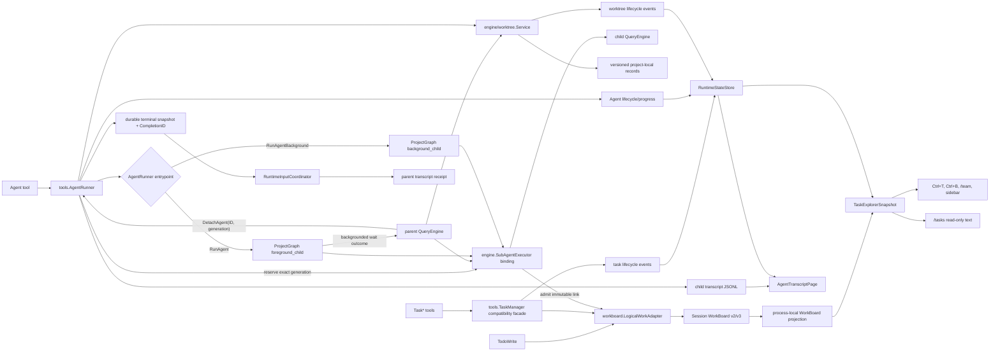

# Task and Agent Runtime

**Status:** current
**Compatibility:** includes the legacy `engine/tasks` surface where it still affects behavior
**Last verified:** 2026-08-09

> **Ownership:** This file owns the task-record and local Agent runtime truth
> split. TUI projection and reducer ownership belong in
> [`architecture/tui/contracts/runtime-events.md`](../tui/contracts/runtime-events.md); Agent transcript
> durability belongs in [`transcripts.md`](../state/transcripts.md).

## Authoritative Runtime Owners

| Concern | Current owner | Notes |
|---|---|---|
| durable logical work and execution relations | root-QueryEngine-lineage `workboard.LogicalWorkAdapter` plus `workboard.Store` | One Session-bound WorkBoard v2 record becomes sole authority after marker-last cutover. Its first explicit execution link raises the record and marker floor to `workboard/v3`; the same adapter serializes Task/Todo mutation, immutable link admission, and terminal settlement guards. |
| model-visible task records | explicitly bound `tools.TaskManager` compatibility facade | QueryEngine binds one root-lineage facade to WorkBoard; standalone MCP binds one fresh ephemeral facade per server. Existing TaskCreate/Get/List/Update/Stop/Output schemas, results, statuses, dependencies, metadata, output, IDs, and lifecycle events remain unchanged. Unbound calls fail closed. |
| model-visible Todo checklist | explicitly bound `tools.TodoAuthority` | QueryEngine binds the logical-work adapter and exact `(SessionID, AgentID)` partition; standalone MCP binds one fresh ephemeral authority. `TodoWrite` keeps full-replacement and all-complete compatibility, and unbound calls fail closed. |
| optional WorkBoard comparison shadow | root-QueryEngine-lineage `workboard.Shadow` | P31.1a's trusted switch is off by default. When enabled, successful Task/Todo mutations write a bounded removable sidecar for comparison only. It never restores, becomes authoritative, emits runtime/TUI state, or changes model-visible results. |
| local/background Agent execution | root-QueryEngine-lineage `tools.AgentRunner` | One explicitly injected runner owns launch, foreground-wait detach, concurrency, progress, messaging, pause/resume/abort, retained state, eviction, and persisted Agent restore. There is no package default. |
| durable Agent worktree lifecycle | `engine/worktree.Service` | `SubAgentExecutor` binds its parent engine's service and effective CWD into `AgentRunner`; the runner has no second production worktree map. |
| restart worktree recovery | `engine/worktree.Service` plus durable Agent metadata | Startup/resume discovery is filesystem metadata-only. Explicit continuation or cleanup must reconstruct the exact owner and pass a fresh Git identity/status admission. |
| legacy worktree helper | `tools.WorktreeManager` | Exported helper and focused compatibility tests remain, but no production `AgentRunner` constructs or calls it. It is outside product closure. |
| child query execution | `engine.SubAgentExecutor` | Installed into the runner by `NewQueryEngine`; builds child `QueryEngine` instances with a worktree-scoped execution/permission/skill context and stable external transcript/memory owners. New foreground and background Sessions receive distinct internal ProjectGraph pins before executor entry; identity-bearing historical selections remain unchanged on continuation. |
| bounded child transcript inspection | `QueryEngine.AgentTranscriptPage` plus `transcript.LoadMessagePage` | Read-only, generation-bound pages merge exact persisted identity with live runtime provenance. The selector never restores execution or dispatches model, tool, queue, callback, or permission work. |
| exact current execution output and lineage | `QueryEngine.AgentExecutionDetail` plus `RuntimeStateStore.AgentThreadSnapshot` | The request binds Agent, generation, Session, and thread. Lineage is metadata-only. Output reads only the bounded terminal-current file and revalidates exact identity and path after I/O; live continuation cannot expose a reused prior-generation file, and historical mismatch never falls forward. |
| canonical logical-work/execution read model | `workboard.ProjectionReducer`, `RuntimeStateStore`, and `QueryEngine.TaskExplorerSnapshot` | The process-local selector joins a validated full WorkBoard snapshot with ordered immutable `(AgentID, Generation)` observations. It is bounded, read-only, and cold-restorable without a durable event log or dispatch. |
| current TUI task presentation | `internal/tui.TaskExplorerPanel` plus Ctrl+B, `/team`, activity, and sidebar adapters over `QueryEngine.TaskExplorerSnapshot` | Ctrl+T renders engine-ordered WorkItems followed by exact execution generations with textual kind, exact composite selection, composable local filters/search, explicit focus, resolved hints, render-derived mouse containment, defensive cached `overview`/`activity`, and execution-only lazy exact `transcript`/`output`/`lineage`. Ctrl+B and `/team` retain their execution-oriented views. The TUI owns only bounded correlated presentation caches, never WorkBoard, Agent, transcript, output, or control truth. |
| Task Explorer controls | `QueryEngine.ApplyTaskExplorerAction`, `ResolveTaskExplorerNavigationTarget`, plus board, execution, message, and request identities | The engine declares inspect/switch/send/cancel-input/pause/resume/cancel/continue per execution row and validates the submitted identity. Starting send, continue, or cancel confirmation freezes one immutable presentation intent through settlement. Switch declaration and application share one exact current execution-generation resolver and return a typed Session/thread/Agent/generation/mode target. Replay, unresolved, stale, and pre-dispatch rows cannot acquire live mutation. |

`engine/tasks` contains typed `ShellTask`, `DreamTask`, `AgentTask`, callback
hooks, and another `TaskManager`. It is not the production task/Agent truth and
is no longer imported by the slash command package. `/tasks` formats the same
bounded `TaskExplorerSnapshot` as the TUI and labels
`durability=durable-session-workboard` plus `control=read-only-command`.
`/agents` remains a separate engine inspection command. Stopping logical tasks
remains with the bound TaskStop tool owner.

Independent top-level QueryEngines own distinct managers, WorkBoard adapters,
and AgentRunners. Child engines share all three pointers from their root
lineage and never create a second Session authority file. Construction never
imports package Todo or Task state; a new child partition appears only through
a real revisioned Todo mutation.

The mutation-capable `LogicalWorkAdapter` first asks the read-only Store to
inspect the exact Session artifacts. Only a successful legacy result may
prepare the transcript root: a missing directory is created privately and an
existing real directory is identity-pinned before its mode is tightened to
`0700`. The secured identity is then bound to the Store and revalidated by the
first cutover and artifact root-open path, so a same-path replacement cannot
receive WorkBoard files. Invalid committed or prepared authority fails before
repair, while `Store.Inspect` itself never creates or chmods filesystem state.
The strict artifact checks remain active before every WorkBoard read or write.

The engine that drains a lifecycle mutation reduces it once into the
lineage-shared `RuntimeStateStore`; root TUI selection reads that canonical
store rather than requiring the root to drain and duplicate the same event.
No TUI panel receives a TaskManager or AgentRunner mutation provider.

Task and Todo remain separate compatibility shapes over one authority.
Task records use typed compatibility fields alongside canonical WorkItems.
Todo stores `content`, `status`, and `activeForm` under the exact
`(SessionID, AgentID)` partition; an all-complete replacement clears only the
legacy active view while retaining durable evidence. Resume and fork restore
the WorkBoard. P31.2 now bootstraps a process-local full-snapshot reducer from
an already validated authoritative record and joins its WorkItems with ordered
execution generations in one bounded `TaskExplorerSnapshot`. Production
Agent launch may carry an explicit WorkItem reference. `AgentRunner` reserves
the exact generation, the engine commits an immutable WorkExecutionLink under
the WorkBoard lock, and only then may launch metadata, child admission,
runner installation, and executor dispatch proceed. Unlinked launches retain
their existing behavior. Ctrl+T presents one WorkItem-first mixed list over
the selector; Ctrl+B and `/team` retain their execution-oriented projections;
activity and wide-sidebar summaries use the same snapshot. `/team` preserves
its all-sub-agent read-only semantics
because the runtime has no separate TeamID relation. `/tasks` formats that
same canonical view without mutation controls. Task Explorer mutation reaches
only the engine's exact-generation dispatcher; no TUI path mutates
`TaskManager` or `AgentRunner` directly.

The engine mutation boundary is exact. P47.1 freezes pending send, continue,
and cancel presentation intent across refresh through result correlation, so
later row or selection changes cannot retarget submission. P47.3 makes switch
availability and application consume the same resolver over the exact
`(AgentID, Generation)` execution and one matching current catalog row. The
typed result retains SessionID, ThreadID, AgentID, generation, and attachment
mode; unavailable or stale facts return typed failures before runtime work.

P47.4 adds a panel-local mixed-row projection without moving engine ownership:
WorkItems retain their snapshot order, exact execution generations retain
theirs, and Ctrl+T joins the two groups in that order with textual kind.
Selection restoration accepts only exact WorkItem or execution composite keys;
it never uses title, owner, ThreadID, or position as identity. P47.5 keeps the
same cached projection and adds exact filter predicates, search conjunction,
explicit focus, one binding/hint descriptor, truthful disabled-action text,
and stale-invalidated mouse geometry consumed before chat. P47.6 deep-copies
the cached panel projection and splits pure WorkItem/execution detail into
textual `overview` and `activity` tabs. Exact link association uses the full
available composite key; boardless duplicate-ID attention/diagnostics fail
closed. Tab, scroll, wheel, resize, and render stay local and I/O-free.

P47.7 extends only exact execution rows with lazy transcript, output, and
lineage tabs. Transcript retains the generation-bound cursor reader. Output
and lineage use `AgentExecutionDetail`, which rejects historical rebinding,
skips nonterminal output files reused by continuation, and revalidates exact
identity after bounded terminal-output I/O. Bubble Tea request generations bind
selection, Session, thread, tab, and cursor; selection, filter, tab, refresh,
replacement, duplicate, out-of-order, or closed-panel results fail closed.
Rendering consumes only reducer-owned cached results and never invokes a
reader. None of these seams changes snapshot or action truth. P47.1-P47.7
closed G38-G41; the completed
[`P47 contract`](../../migration/plans/p47-task-explorer-remediation.md) and
[`P47.7 closeout`](../../migration/history/tui/p47-7-lazy-execution-detail.md)
retain the delivery boundary.

P31.1a's optional version-1 shadow remains comparison-only. P31.1b adds
separate exact v2 authority, marker, and immutable-backup artifacts; it never
promotes or restores the shadow. Before marker visibility the adapter owns one
read-only legacy snapshot and cuts over before the first accepted mutation.
After marker visibility, every durable Session requires the v2 reader. No
QueryEngine-bound, direct, or standalone Task/Todo/Agent path may fall back to
package globals. Direct embeddings must construct and bind explicit owners;
each standalone MCP `Serve` receives a fresh ephemeral Todo authority and
TaskManager and exposes only the Task/Todo compatibility allowlist.



## Lifecycle Notes

- Task updates append output and deduplicate dependency edges.
- Agent foreground execution waits for completion or an explicit detach;
  background execution returns an ID immediately and continues under
  `AgentRunner`. The launch entrypoint remains a process-local
  `AgentExecOptions` marker and does not expand durable Agent metadata.
- A new child requires its runtime-assigned Agent identity and pins
  `project_graph/v1` with `foreground_child` or `background_child`. The process
  root selection cannot choose either stage. A background continuation follows
  supported ProjectGraph Session metadata and preserves a foreground pin.
  Historical Legacy, unpinned, and message-only transcripts fail admission
  unchanged.
- Child permissions remain synchronous coordinator-owned requests. The Graph
  does not persist a hidden child HITL checkpoint because current TUI/ACP
  controls resolve project-coordinator attention rather than an independently
  addressable child-engine checkpoint.
- `SubAgentExecutor` admission no-clobber reserves the initial child transcript
  and commits its Graph pin, complete parent lineage/tool causation, worktree
  CWD, message seed, and `session-start` before executor/model entry.
  `AgentRunner` appends lifecycle checkpoints for later snapshots, so
  QueryEngine Session metadata remains authoritative across reconstruction.
- A crash after this admission but before the separate AgentRunner JSON commit
  has no model/tool side effect and cannot recover through another kernel. Resume
  follows exact reachable child lineage in the runner-owned regular-file
  transcript store and projects one inert aborted `project_graph_orphan`. It
  does not register continuation, call child control, rewrite the transcript,
  or mutate P18.2 inspect-only worktree evidence.
- `Agent(isolation="worktree")` rejects an explicit `cwd`, defaults to a clean
  source, and accepts `worktree_source="ignore_dirty"` only to start from
  committed HEAD with a durable omitted-file report.
- Ready worktree identity is committed before model entry. Clean terminal state
  removes once; dirty, ahead, cancelled, unknown, or cleanup-failed state
  retains the record/path and returns a bounded changed-file/patch handoff.
- Child filesystem tools and Bash obtain CWD from the engine tool context.
  Each QueryEngine owns its persistent shell manager and closes it before
  worktree terminal cleanup; no process-wide `os.Chdir` participates.
- Child QueryEngine construction derives an immutable exact-authority
  execution-policy snapshot from the parent before hooks or Bash can launch.
  Root lineage, opaque child identity, and parent digest are part of the child
  identity. The current disabled ambient-host adapter cannot narrow authority;
  any requested policy-axis change is rejected rather than called contained.
- Parent-turn cancellation reaches foreground execution while its parent wait
  lease is active. `QueryEngine.DetachAgent` revokes that exact lease by Agent
  ID, generation, and owning parent Session; after the structured
  `backgrounded` result, later parent-turn cancellation no longer reaches the
  same child execution. An originally background child has no foreground wait
  and cannot be detached again.
- Detach does not restart, clone, or reconfigure the child. Session, thread,
  Agent, parent lineage, executor context, ProjectGraph invocation, generation,
  permissions, worktree, transcript, and eventual terminal owner remain
  unchanged. Completion, parent cancellation, detach, explicit abort, and
  runner shutdown serialize against the same generation. Terminal, stale,
  already detached, originally background, and unowned requests fail closed.
- Targeted abort reaches only the addressed generation. Closing an engine
  cancels and bounded-joins only the runner it owns; closing an engine with an
  injected runner leaves that outer lifecycle owner intact. A join timeout
  never fabricates terminal state: eventual executor return owns the single
  terminal and join release.
- The `backgrounded` process-lifecycle event reuses the child's active Graph
  turn and immutable lineage. `RuntimeStateStore` allocates its sequence in the
  same admission boundary as live Graph events, so the transition cannot seize
  a new turn or race a stream event into a duplicate sequence. It is
  process-local projection only and remains distinct from the later durable
  terminal completion identity.
- Agent messaging and resume route through the runner so retained and evicted
  Agents share one identity/lifecycle owner.
- Process restart reads Agent JSON before choosing attachment mode. Only the
  same running Agent/Session/thread/lineage/worktree/CWD/transcript generation
  in the callback-owning runner attaches live. Completed, failed, aborted, and
  interrupted generations otherwise restore idempotently as replay-only
  runtime projections without dispatch.
- `RuntimeStateStore` also retains bounded immutable execution observations by
  `(AgentID, Generation)`. Ordered live events receive a process-local
  observation ordinal; durable restore rows retain an ordinal-free
  `replay_only` phase. The primary explorer keeps 128 generations, evicts
  terminal before live rows, and reports evicted and currently hidden-live
  counts without rejecting the 129th admitted live Agent.
- A `WorkExecutionLink` names the exact BoardID, WorkItem ID and item revision,
  Agent ID, generation, admission actor, parent lineage, tool cause, and UTC
  admission time. Missing and stale targets remain visible facts; parent
  lineage, labels, task text, time, and transcripts never infer or repair a
  relation. Continuation appends generation N+1 and never rewrites N.
- When one mutation moves WorkItems to terminal, the guard selects only
  immutable links whose BoardID is current and whose WorkItem ID belongs to
  that exact terminalized set. It snapshots the selected generations while
  holding the WorkBoard authority lock; live or unresolved executions block
  only their linked target, while other-item and unlinked executions do not.
  Batch Todo replacement validates the union of every terminalized target's
  links. `AgentRunner` answers only
  reserved/live/cancellation-pending/terminal-durable/superseded/unresolved
  settlement and performs no WorkBoard callback. Cancellation acceptance is
  not terminal settlement. Expected revisions, marker-last commit, and the v3
  authority schema are unchanged.
- Active Session deletion first closes one shared admission gate, then takes
  the WorkBoard lifecycle lock and proves both linked settlement and
  parent-Session runner settlement before removing the transcript and owned
  artifacts. Rejected deletion reopens admission; successful deletion leaves
  it closed. Fork strips links, and linked v3 authority rejects destructive
  backup recovery.
- Worktree-isolated continuation restores only Agent IDs named by the selected
  source session. The current direct parent session, complete durable owner,
  record ID, repository common directory, path, branch, status, and branch HEAD
  are revalidated before execution. A fork clears Agent IDs and worktree
  metadata and cannot reuse the source owner.
- Agent message and terminal-notification outboxes are non-destructive reads.
  The query engine acknowledges a complete source batch only after the durable
  runtime-input coordinator accepts it. Messages retain stable command UUIDs.
  A terminal notification is eligible only after the child record durably
  stores its versioned snapshot; its deterministic completion ID binds Agent
  identity, execution generation, and terminal sequence.
- Terminal transport is at least once. The exact parent Session/thread/Agent
  scope reconstructs retained and evicted durable terminals, then commits the
  versioned receipt in the same transcript message that becomes model-visible
  before settling the coordinator ledger. Restart consults the append-only
  parent audit for current candidate identities, so a bounded diagnostic
  projection or compact boundary cannot make an acknowledged child completion
  visible twice. Unknown receipt versions suppress only the identity they name
  while the child terminal remains available for diagnostics. Delivery occurs
  at an existing safe boundary and never wakes an idle model turn.
- `AgentDetailSnapshot` remains the eager compatibility projection for
  explicit non-transcript detail. `AgentExecutionDetail` is the narrower
  Task Explorer output/lineage boundary: it requires exact current Agent,
  generation, Session, and thread identity, performs no lineage file I/O,
  reads only terminal output, and revalidates identity/path after that bounded
  read. `AgentTranscriptPage` is the lazy transcript boundary consumed by
  thread switching, Ctrl+T, Ctrl+B Agent detail, and Teams:
  its process-local opaque cursor binds Agent, Session, thread, generation,
  transcript path, frozen file identity, and prefix. It rejects stale or
  rebound cursors and merges only an exact durable entry identity. TUI-local
  request generations reject late pages, per-thread presentation state owns
  the cache/scroll anchor, and replay/evicted mutation controls are inert.
- `TaskOutput` and `TaskStop` first resolve current task records, then Agent
  runner state where applicable.
- Closing an engine shuts down only a runner and shell manager it created and
  owns.

## Worktree Lifecycle Boundary

The project-local service is the only production Agent worktree mutation
owner. `SubAgentExecutor.AgentWorktreeLifecycle` and
`AgentWorktreeSourceDir` freeze that service plus the parent QueryEngine's
effective CWD for one launch. `AgentRunner` reserves identity/concurrency,
releases its registry mutex, creates through the service, and binds the Ready
record to durable child metadata before executor entry.

The service:

- persists Creating, Ready, Retained, Removing, Removed, Failed, and
  CleanupFailed records under the stable project root;
- derives path and branch from opaque worktree identity, validates Git common
  directory, containment, absent ref/path, base, branch, and target HEAD before
  Ready, and never changes process CWD;
- executes explicit-directory Git commands with context cancellation and a
  bounded operation timeout;
- rejects dirty source before Git mutation unless explicit ignore mode records
  the omitted changed paths;
- performs non-force cleanup only after fresh clean/ownership checks, treats
  ignored files as retained work, and restores the owned branch/path if a
  commit races native Git removal; and
- commits the durable record revision before emitting a lossless structured
  event. `RuntimeStateStore` folds that event into
  `RuntimeSnapshot.Worktrees`; replay has no Git or dispatch side effect.

The durable record is cleanup authority. Agent metadata and foreground,
background-notification, and TaskOutput projections carry a bounded handoff,
but cannot authorize Git or cleanup. Startup and session resume enumerate only
regular, versioned records under the project record root, classify
Creating/Removing as recovery-pending, and install Ready/Retained/
CleanupFailed metadata through `RestoreWorktreeSnapshots` without synthetic
events or Git. Missing paths and static ownership mismatches remain
unavailable diagnostics.

Continuation and cleanup are explicit operations. Continuation requires the
selected source session's direct parent identity plus the complete durable
owner and a fresh read-only Git admission. Cleanup resolves the owner from
durable Agent metadata, never caller-supplied fields, and repeats clean and
identity checks at the removal boundary. Interrupted Removing records first
become CleanupFailed diagnostics; duplicate recovery and cleanup are
idempotent by record ID. Automatic age-based orphan pruning remains deferred
because no accepted age/retention policy exists.

The completed P14 contract and exclusions are retained in
[`p14-async-child-interaction.md`](../../migration/plans/p14-async-child-interaction.md);
new product gaps, if accepted, belong in
[`migration/REMAINING.md`](../../migration/REMAINING.md).

## Code References

| Symbol | Evidence |
|---|---|
| authoritative logical-work adapter | [`workboard.LogicalWorkAdapter`](../../../engine/internal/workboard/adapter.go), [`workboard.Store`](../../../engine/internal/workboard/store.go) |
| process-local WorkBoard projection and publish reservation | [`workboard.ProjectionReducer`](../../../engine/internal/workboard/projection.go), [`workboard.LogicalWorkAdapter.ProjectionSnapshot`](../../../engine/internal/workboard/adapter.go) |
| strict WorkBoard artifacts and codec | [`workboard.ArtifactStore`](../../../engine/internal/workboard/secure_store.go), [`workboard.AuthorityRecord`](../../../engine/internal/workboard/authority.go), [`workboard.EncodeAuthorityRecord`](../../../engine/internal/workboard/authority_codec.go) |
| Task compatibility facade and context | [`tools.TaskManager`](../../../tools/task_store.go), [`tools.WithLogicalWorkAuthority`](../../../tools/logical_work.go), [`QueryEngine.toolExecutor`](../../../engine/engine.go) |
| Todo compatibility partition | [`TodoWriteTool`](../../../tools/todo_write.go), [`tools.TodoScope`](../../../tools/logical_work.go) |
| optional WorkBoard shadow and codec | [`workboard.Shadow`](../../../engine/internal/workboard/shadow.go), [`workboard.Record`](../../../engine/internal/workboard/types.go), [`workboard.Encode`](../../../engine/internal/workboard/codec.go) |
| post-mutation observer context | [`tools.WithWorkBoardShadowObserver`](../../../tools/workboard_shadow.go), [`QueryEngine.toolExecutor`](../../../engine/engine.go) |
| Agent tool dispatch | [`AgentTool`](../../../tools/agent.go), [`executeAgentTool`](../../../tools/agent.go) |
| Agent runner | [`AgentRunner`](../../../tools/agent_runner.go), [`prepareAgentWorktree`](../../../tools/agent_runner.go), [`recoverAgentWorktreeContinuation`](../../../tools/agent_runner.go), [`finalizeAgentWorktreeLocked`](../../../tools/agent_runner.go) |
| two-phase Agent message delivery | [`tools.AgentRunner.PendingAgentMessages`](../../../tools/agent_runner.go), [`QueryEngine.SyncRuntimeItems`](../../../engine/input_sources.go) |
| durable child completion snapshot and exact-parent reconstruction | [`AgentCompletionRecord`](../../../tools/agent_runner.go), [`AgentRunner.PendingAgentNotificationsForParent`](../../../tools/agent_runner.go) |
| completion transport and parent settlement | [`QueryEngine.collectAgentNotifications`](../../../engine/input_sources.go), [`RuntimeInputCoordinator.ResolveDelivered`](../../../engine/input_coordinator.go), [`runtimeItemMetadata`](../../../engine/input_coordinator.go) |
| bounded Agent detail and exact current execution detail | [`QueryEngine.AgentDetailSnapshot`](../../../engine/agent_detail.go), [`QueryEngine.AgentExecutionDetail`](../../../engine/agent_detail.go) |
| bounded durable Agent transcript selection | [`QueryEngine.AgentTranscriptPage`](../../../engine/agent_transcript.go), [`transcript.LoadMessagePage`](../../../engine/transcript/message_page.go) |
| engine construction and executor binding | [`NewQueryEngine`](../../../engine/engine.go), [`newForegroundChildQueryEngine`](../../../engine/engine.go), [`SubAgentExecutor.ExecuteAgent`](../../../engine/subagent.go) |
| child kernel admission | [`SubAgentExecutor.RecordAgentExecutionAdmission`](../../../engine/subagent.go), [`queryKernelStageBackgroundChild`](../../../engine/query_kernel_selection.go) |
| foreground/background entrypoint marker | [`tools.RunAgent`](../../../tools/agent_runner.go), [`tools.RunAgentBackground`](../../../tools/agent_runner.go), [`AgentExecOptions.IsForegroundExecution`](../../../tools/agent_runner.go), [`AgentExecOptions.IsBackgroundExecution`](../../../tools/agent_runner.go) |
| foreground wait detach | [`tools.AgentRunner.DetachAgent`](../../../tools/agent_runner.go), [`QueryEngine.DetachAgent`](../../../engine/agent_control.go), [`SubAgentExecutor.RecordAgentLifecycle`](../../../engine/subagent.go) |
| append-only Agent transcript snapshots | [`persistAgentTranscriptState`](../../../tools/agent_runner.go) |
| engine-owned worktree lifecycle construction | [`NewQueryEngine`](../../../engine/engine.go), [`QueryEngine.WorktreeLifecycleService`](../../../engine/worktree_lifecycle.go) |
| durable worktree state and owner | [`worktree.Record`](../../../engine/worktree/types.go), [`worktree.Service.Create`](../../../engine/worktree/service.go), [`worktree.Service.Remove`](../../../engine/worktree/service.go) |
| restart discovery and explicit recovery | [`worktree.Store.List`](../../../engine/worktree/store.go), [`worktree.Service.Discover`](../../../engine/worktree/service.go), [`worktree.Service.RecoverForContinuation`](../../../engine/worktree/service.go), [`QueryEngine.RetryAgentWorktreeCleanup`](../../../engine/worktree_lifecycle.go) |
| context-aware Git and raced-commit restoration | [`worktree.Git`](../../../engine/worktree/git.go), [`worktree.Service.finishRemoval`](../../../engine/worktree/service.go), [`worktree.Service.restoreRetainedPath`](../../../engine/worktree/service.go) |
| engine-scoped filesystem and shell execution | [`tools.WithExecutionCWD`](../../../tools/runtime_cwd.go), [`ShellManager.ExecuteAt`](../../../tools/bash_shell.go), [`QueryEngine.toolExecutor`](../../../engine/engine.go) |
| reducer-owned worktree projection and restart rehydration | [`WorktreeLifecycleEvent`](../../../engine/events.go), [`RuntimeStateStore.reduceWorktreeLocked`](../../../engine/runtime_state.go), [`RuntimeStateStore.RestoreWorktreeSnapshots`](../../../engine/runtime_state.go) |
| canonical explorer selector | [`QueryEngine.TaskExplorerSnapshot`](../../../engine/task_explorer.go), [`RuntimeStateStore.TaskExplorerSnapshot`](../../../engine/runtime_state.go) |
| current explorer action dispatcher, TUI request projection, and queued-input cancellation | [`QueryEngine.ApplyTaskExplorerAction`](../../../engine/task_explorer.go), [`TaskExplorerPanel.submitAction`](../../../internal/tui/task_explorer_panel.go), [`tools.AgentRunner.CancelAgentMessageGeneration`](../../../tools/agent_runner.go) |
| engine inspection aggregation | [`QueryEngine.RuntimeInspectionSnapshot`](../../../engine/input_processor.go), [`RuntimeInspectionSnapshot`](../../../engine/commands/inspection.go) |
| canonical read-only `/tasks` output | [`engine/commands/cmd_tasks.go`](../../../engine/commands/cmd_tasks.go), [`TaskExplorerInspectionSnapshot`](../../../engine/commands/inspection.go) |
| standalone ephemeral owner and allowlist | [`server/mcp/server.go`](../../../server/mcp/server.go), [`tools.EphemeralTodoAuthority`](../../../tools/logical_work.go) |
| legacy/disconnected manager | [`engine/tasks/tasks.go`](../../../engine/tasks/tasks.go) |
| legacy worktree compatibility helper | [`tools.WorktreeManager`](../../../tools/worktree_manager.go) |

## Example

```json
{"description":"inspect session restore","prompt":"trace the resume flow","run_in_background":true}
```

The `Agent` tool sends this request to the engine-bound `AgentRunner`; it does
not create an `engine/tasks.AgentTask`.
