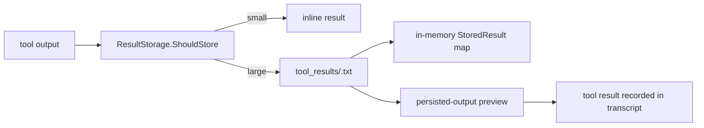

# Large Tool-Result Storage

**Status:** current
**Persistence:** the lookup index is process-local
**Last verified:** 2026-08-07

> **Ownership:** This file owns large tool-result offload and retrieval. JSONL
> conversation authority belongs in [`transcripts.md`](transcripts.md);
> file-state snapshots used by resume are a separate transcript feature.

## Current Flow

`QueryEngine` creates one `storage.ResultStorage` rooted at
`<transcript-dir>/<session-id>/tool_results`. Tool execution calls
`maybeOffloadToolResult`; results above the storage threshold are written to a
UUID-named text file and replaced in the model-visible tool result by a bounded
preview containing the concrete file path.



## Persistence Boundary

The content files survive process exit, but the `results` map is initialized
empty by `NewResultStorage`. `Retrieve`, `GetPreview`, `Cleanup`, and `Stats`
resolve only entries present in that in-memory map.

On session resume, the engine constructs a new `ResultStorage` for the resumed
session directory. It does **not** scan `tool_results`, persist a metadata index,
or reconstruct stored-result IDs. The transcript preview still contains the
saved path, so a model or user may read the file through ordinary filesystem
tools, but `ResultStorage.Retrieve(id)` cannot retrieve an old ID after process
resume unless it was re-indexed in the current process (which production code
does not do).

## APIs

| API | Behavior |
|---|---|
| `ShouldStore` | compares result length with the configured character threshold |
| `Store` | creates the directory, writes the full result, builds a preview, and indexes metadata in memory |
| `Retrieve` | looks up the ID in memory, then reads the indexed file path |
| `Cleanup` | removes indexed files older than the requested age |
| `Stats` | summarizes only indexed entries |
| `ToolResultHandler` | alternate token-estimate wrapper; canonical tool execution calls `maybeOffloadToolResult` directly |

If file persistence fails, `maybeOffloadToolResult` returns the original result;
it does not silently replace it with an incomplete preview.

## Code References

| Symbol | Evidence |
|---|---|
| storage state and constructor | [`engine/storage/persistence.go`](../../../engine/storage/persistence.go), [`engine/storage/persistence.go`](../../../engine/storage/persistence.go) |
| store and retrieve | [`engine/storage/persistence.go`](../../../engine/storage/persistence.go), [`engine/storage/persistence.go`](../../../engine/storage/persistence.go) |
| production offload call | [`engine/tool_execution.go`](../../../engine/tool_execution.go), [`engine/tool_execution.go`](../../../engine/tool_execution.go) |
| engine-owned instance | [`engine/engine.go`](../../../engine/engine.go) |
| fresh store on resume | [`engine/engine.go`](../../../engine/engine.go) |
| alternate handler | [`engine/storage/integration.go`](../../../engine/storage/integration.go) |

## Example

```text
<persisted-output>
Output too large (84KB). Full output saved to: .../tool_results/<id>.txt
Preview (first 2KB):
...
</persisted-output>
```

The path is durable text in the transcript; the `<id>` lookup entry is not
reconstructed across process resume.
