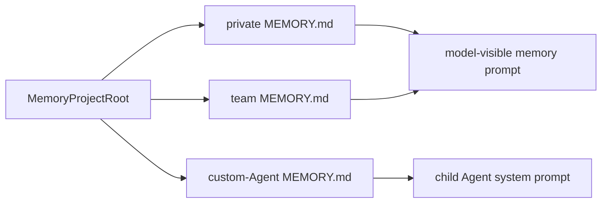

# Memory Directories

**Status:** current
**Last verified:** 2026-08-07

> **Ownership:** This file owns persistent private, team, and custom-Agent
> memory directories, indexes, prompt policy, snapshot seeding, and shared-write
> safety. Session-derived compaction memory and effective config/auth resolution
> are separate owners.

## Runtime Boundary

Persistent file memory is independent from transcript and compaction memory:

| Owner | Data |
|---|---|
| `engine/memdir` | project/user/team/Agent Markdown memory and indexes |
| `engine/compact.MemoryStore` | ranked session-derived entries used by prefetch and long-session services |
| transcript JSONL | durable conversation messages and session metadata |

`QueryEngine` owns the stable `MemoryProjectRoot` used for model-visible prompt
assembly. Child engines inherit that root, including worktree-isolated Agents.
This is deliberate: durable memory must not be written into an ephemeral
worktree that clean completion removes. Filesystem tools, project rules, and
project skills use the child worktree CWD independently. Session resume updates
the stable memory root to the restored session CWD.

## Path and Scope Model

| Scope | Root |
|---|---|
| private | `GetAutoMemPathForProject(root)` |
| team | canonical absolute `YHC_TEAM_MEMORY_DIR` |
| Agent user | `GetMemoryBaseDir()/agent-memory/<agent>` |
| Agent project | `<root>/.eino-agent/agent-memory/<agent>` |
| Agent local | `<root>/.eino-agent/agent-memory-local/<agent>`; with `YHC_REMOTE_MEMORY_DIR`, `<remote>/projects/<sanitized-root>/agent-memory-local/<agent>` |

Auto memory is disabled by the explicit disable flag or simple/bare mode.
Library callers opt in through `QueryEngineConfig.EnablePersistentMemory`; that
keeps embedded runtimes from acquiring an implicit home-directory write owner.

## Prompt Assembly

`BuildUnifiedMemoryPrompt` creates enabled roots, emits the private/team write
policy, reads each `MEMORY.md` independently, and injects private before team.
Team content is wrapped in a marked shared-content element. Custom Agent memory
uses `BuildAgentMemoryPrompt` with one independently bounded index.



## Topic Discovery and Snapshots

`ScanMemoryFiles` recursively discovers Markdown topic files, excludes every
`MEMORY.md`, reads bounded frontmatter, sorts newest first, and caps results.
`ScanMemoryDirectories` preserves private/team scope instead of merging their
independent directories into one authority.

For custom Agents, snapshot sources live under
`<root>/.claude/agent-memory-snapshots/<agent>`. User-scope Agent memory checks
strict timestamp metadata. Empty memory can initialize from direct snapshot
files; an older/missing sync marker yields an explicit keep-or-replace decision.
Keep advances only the marker. Replace removes only top-level local Markdown,
preserves other content, installs direct snapshot files, then advances the
marker after success.

## Shared-Write Safety

Team-memory Write/Edit paths must pass both logical and filesystem-resolved
containment, including symlink chains and non-existent tails. The proposed full
content is scanned for bounded high-confidence credential formats before
persistence. Generic words such as `token` are not treated as credentials.

## Code References

| Symbol | Evidence |
|---|---|
| enablement and private roots | [`engine/memdir/paths.go`](../../../engine/memdir/paths.go), [`engine/memdir/paths.go`](../../../engine/memdir/paths.go) |
| unified and Agent prompts | [`engine/memdir/prompt.go`](../../../engine/memdir/prompt.go), [`engine/memdir/prompt.go`](../../../engine/memdir/prompt.go) |
| team containment and secret guard | [`engine/memdir/team.go`](../../../engine/memdir/team.go), [`engine/memdir/team.go`](../../../engine/memdir/team.go), [`engine/memdir/team.go`](../../../engine/memdir/team.go) |
| topic scan | [`engine/memdir/scan.go`](../../../engine/memdir/scan.go) |
| snapshot decision and mutation | [`engine/memdir/agent_snapshot.go`](../../../engine/memdir/agent_snapshot.go), [`engine/memdir/agent_snapshot.go`](../../../engine/memdir/agent_snapshot.go), [`engine/memdir/agent_snapshot.go`](../../../engine/memdir/agent_snapshot.go) |
| Write/Edit guards | [`tools/write.go`](../../../tools/write.go), [`tools/edit.go`](../../../tools/edit.go) |
| child stable-memory/worktree split | [`SubAgentExecutor.ExecuteAgent`](../../../engine/subagent.go) |

## Example

```markdown
---
name: session-resume-boundary
description: Durable resume ownership
type: project
---

Transcript JSONL is the conversation authority; the live reducer is bounded.
```
