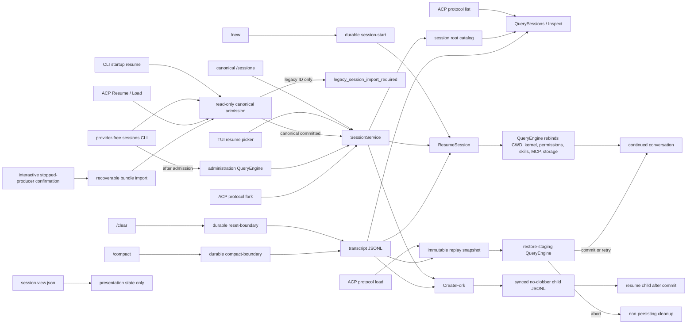

# Sessions

**Status:** current
**Last verified:** 2026-08-10

> **Ownership:** This file owns session discovery, inspection, resume, branch,
> export, immutable replay selection, restore staging, metadata including the
> versioned root-thread Goal record and inert descendant Goal binding,
> presentation-sidecar, contained deletion, WorkBoard recovery, and archive
> exclusion boundaries. JSONL record
> semantics belong in [`transcripts.md`](transcripts.md); live reducer state
> belongs in [`architecture/tui/contracts/runtime-events.md`](../tui/contracts/runtime-events.md).

## Current Boundary

`engine/session` is an orchestration and catalog layer over transcript files.
A conversation Session is discoverable because its JSONL transcript exists,
not because an in-memory `QueryEngine` or runtime snapshot still exists. A
marked Session may additionally own a forward-only WorkBoard reader floor;
partial deletion can therefore leave validated cleanup-pending artifacts after
the transcript is gone.

Session discovery and lifecycle mutation are owned by the engine's
`SessionService`, not by a renderer.
New default writes and the writable root catalog live under `.yhc`. The
archived `.eino-agent` catalog is a read-only discovery source only when no
exact catalog override is selected. A legacy row cannot enter a writable
resume path until its recoverable transcript/WorkBoard bundle, project marker,
user journal, and canonical catalog entry all commit and re-admit as one
canonical source.
`/new` durably creates a fresh empty identity and then activates it through the
same restore boundary used by direct `/resume`. `/clear` and `/compact` retain
the current identity and commit append-only transcript boundaries before
changing live context. Session resume loads the active transcript projection
and metadata, rebinds execution context, and optionally reconstructs persisted
child Agent projections. It does **not** replay historical `QueryEvent`
envelopes through `RuntimeStateStore.Replay`.

Portable replay validation is a separate read boundary.
`SessionService.ReplaySnapshot` returns one exact-revision
`SessionReplaySnapshot`: every final-active-context item retains its physical
`MessageEntryIdentity`, caller-visible messages are deep clones, and corrupt,
duplicate, orphaned, ambiguous, unknown-outcome, or unsettled tool history
fails as one value. It does not activate an engine or open an append writer.



## Symbol Flow

| Flow | Current behavior |
|---|---|
| Engine creation | `NewQueryEngine` registers the current `(CWD, TranscriptDir)` in the user-level session-root catalog when `SessionCatalogPath` is configured. |
| Resume admission | `AdmitSessionResume` derives the canonical `<CWD>/.yhc/transcripts` root itself, resolves one exact row without catalog refresh, and rejects any source whose resolved CWD/root is not that canonical pair. Legacy rows return a typed requirement carrying only the stable Session ID in public projections. If import evidence exists, admission read-only verifies a `catalog_committed` user journal, matching project marker and file manifest, and the exact canonical catalog row. Partial, missing, ambiguous, or tampered evidence returns `session_import_unsafe` without constructing an engine or writing recovery state. |
| Legacy import | Only the TUI picker confirmation, Desktop's explicit **Import and continue** action, `yhc resume ID --confirm-legacy-stopped`, or `yhc migrate-state apply --owner session --session ID --confirm-legacy-stopped` may start an import. Desktop sends only the discovered Session ID and stopped-producer attestation to `POST /v1/durable-sessions/{session_id}/import`; it never selects a physical source path. The transaction snapshots the immutable legacy bundle twice, commits canonical files/marker/catalog under its journal, leaves legacy bytes unchanged, and then reruns canonical admission. Desktop refreshes the catalog and grants attach authority only to the newly admitted canonical row. Explicit catalog overrides disable the legacy union and cannot be bypassed by the migration command. |
| Administration host | `NewSessionAdministrationEngine` creates the minimum `QueryEngine` ownership required by `SessionService` without provider resolution, MCP connection, plugin generation, shell hooks, long-lived settings services, or list-time Graph compilation. Resume/fork activation validates the selected durable kernel and preserves its canonical target checkpoint while skipping project runtime reload. Close adds no second target checkpoint and cannot create a synthetic source transcript. |
| Service facade | `SessionService` owns bounded query, direct/selected-source resume, fork create/activate/compensation, metadata rename, persisted-transcript export, contained deletion, and exact acknowledged WorkBoard backup recovery. Its engine pointer reads the current configuration after new/resume rebind rather than caching a stale store. |
| Picker/listing | `SessionService.Query` registers the current root, then `QuerySessions` scans JSONL files with bounded head/tail metadata reads, cursor pagination, scope, filter, and sort. It never resolves private blobs: bounded inspection reports durable media as `none`, `refs`, `record_corrupt`, or `unknown`, and uses a stable placeholder instead of presenting a valid rich Session as empty. |
| ACP listing | `Agent.ListSessions` captures one immutable active-session overlay under the ACP registry lock, then calls `QuerySessions` with CWD scope and strict generation binding. The shared selector merges durable and active candidates, de-duplicates stable transcript paths, applies one page/scan bound, and rejects malformed, cross-query, durable-stale, or active-stale cursors. Only rows actually returned become process-local ACP root observations. |
| New | `/new` writes complete session metadata followed by a file-and-parent-directory-synced `session-start` marker. Only then does the engine activate the new session through the resume service. A known pre-commit persistence failure leaves source identity and context unchanged; a filesystem sync error is reported as indeterminate and replay decides whether its bytes survived. |
| Clear | `/clear` fsyncs a `reset-boundary`, then clears live messages, replacement state, and file-state cache. The source JSONL and identity remain intact. |
| Compact | `/compact` builds the summary, fsyncs one `compact-boundary` containing active messages/replacements/file state, then swaps live messages. |
| Resume | CLI startup/plain/headless/Goal, provider-free `sessions resume`, ACP Resume, and ACP Load admit an inactive source before provider/model, recorder, WorkBoard, approvals, hooks, MCP, or `QueryEngine` construction. `session.ResumeSession` then locates the admitted canonical source, calls the context-aware complete transcript reader, validates the active message projection, rebuilds metadata, applies `MaxMessages`, and returns messages. Before activation, the engine preflights the WorkBoard marker: marker absence keeps a validated legacy seed; a supported marker requires exact mode-0600 marker, v2 record, and immutable backup. Corrupt, unknown, quarantined, unsafe, or Session-mismatched artifacts fail before model/tool dispatch or transcript rewrite. Ref-backed user prompts resolve only through the source Session MediaStore and fail without partial state when the record or blob is invalid. A committed empty `session-start` or reset boundary is resumable. |
| Immutable replay | `SessionService.ReplaySnapshot` reads the exact selected source through `LoadSessionReplaySnapshot`. It applies the same lifecycle-boundary selection as resume while retaining `MessageEntryIdentity`, revision-scoped legacy fallback, persisted logical assistant identity, validated tool pairing/outcome, and clone-on-read isolation. Cancellation or any ambiguous durable fact returns no partial snapshot. |
| Rename | `SessionService.Rename` appends one `customTitle` metadata record and syncs before success. Missing non-active transcripts fail without creating a file; post-write sync uncertainty remains an explicit error. |
| Export | `SessionService.Export` renders the durable active transcript through `engine/session.ExportSession` and writes Markdown with temp-file, sync, and rename. Ref-backed prompts are read through the ref-only active projection: Markdown emits stable typed placeholders and JSON emits ordered sanitized text/image/ResourceLink/embedded descriptors without resolving blobs or exposing private IDs, paths, digests, client URIs, embedded text, or bytes. The result is presentation, not a restorable archive. Text-only and legacy-inline export still omit pre-clear audit history, do not mutate the transcript, and do not use the former TUI-local renderer. |
| Engine adoption | `QueryEngine.resumeSessionWithOptionsForTurn` checks cancellation before the activation commit, validates the pinned query-kernel version and prepared WorkBoard owner, then swaps identity/messages/recorder and the same TaskManager-bound logical-work adapter, resets session-local caches and usage state, restores execution context and selected durable metadata, creates a fresh `ResultStorage`, reloads project-bound dependencies, and restores known Agent projections. A supported root Goal is restored from its nested record and installed directly into the bounded runtime read model without synthesizing an event. Version-4 recovery preserves legacy v1–v3 semantics fail-closed: an unbudgeted legacy active record does not become active merely because current defaults are enabled, while a legacy budgeted continuation retains its identity. A child Session may restore only an inert exact-generation Goal binding. P31.1a's optional comparison observer is cleared before identity rebinding and is never restored or recreated by resume, fork, or new-session activation. |
| Restore staging | `NewRestoreStagingQueryEngine` selects staging before restore. A successful staged restore changes only its private in-memory owner: target checkpoint, session-catalog registration, runtime-input recovery persistence, settings/MCP/worktree/long-service activation, Agent-memory initialization, and model/command execution remain deferred. `AbortRestoreStaging` is idempotent only before a prepared commit starts. `CommitRestoreStaging` commits runtime-input recovery and any required Goal normalization before activation. These are separate monotonic durable owners: a failed prepared commit enters retry-only `committing`, never claims a write-free abort, and may be retried in-process or closed without another write so the next process can reconcile it. Ordinary and administration engines retain their existing resume/close behavior. |
| ACP load | `Agent.LoadSession` serializes against every other ACP session lifecycle transition, rejects an active target, and admits the canonical bundle before model/runtime construction. Legacy refusal uses ACP code `-32003`, message `legacy_session_import_required`, and data containing only `sessionId`. Load then validates the complete immutable replay, restores one unregistered staging engine, and delivers replay/config/mode/commands before commit. It registers and starts hooks only after commit, with no intervening fallible step. A failure before commit closes a write-free staged owner; a commit failure closes an unregistered retry-recoverable owner without another persistence write or surviving session/hook. ACP Resume remains no-replay. |
| ACP delete targeting | Successful new, load, resume, fork, and returned list rows remember one canonical process-local root per Session ID. Close retains it. Inactive delete rejects multi-root ambiguity, otherwise delegates the observed or default-fallback transcript directory to `engine/session.DeleteSession`, then forgets only the exact successful/idempotent observation. The locator performs no filesystem mutation and is not a durable catalog. |
| Query-kernel pin | New sessions store `project_graph/v1`, durable stage `full`, and an optional incompatibility reason in diagnostic metadata. Existing ProjectGraph stages remain pinned. Legacy, unpinned, invalid, and unsupported versions are readable but fail closed before model execution, resume mutation, or transcript rewrite. |
| Fork | `SessionService.CreateFork` snapshots the current execution context or reads the exact selected source. A legacy source publishes no WorkBoard files. For a marked source, the lifecycle gate first clones the complete board into the child Session with a fresh BoardID and child-specific immutable backup, commits its marker, and only then publishes the child transcript. `BranchSession` binds one regular source object, exact revision, and active-message prefix. For ref-backed prompts it preflights every selected ref, copies ordinary bytes into a same-parent private staging sidecar with newly minted child IDs, installs the synced sidecar, and publishes the no-clobber child transcript. The source remains unchanged; the child shares no inode or manifest authority and survives source deletion. Plan state is rebound to the child-owned plan-file identity; an in-flight approval normalizes to Active without callback authority. Goal state and descendant Goal binding are cleared because the fork is a distinct root thread and cannot inherit the source objective or attribution. An exact operation retry reuses the same committed child; a mismatch fails closed. |
| Manual media collection | `QueryEngine.CollectSessionMedia` runs only on the exact active saved owner. Under an exclusive media-lifecycle gate it snapshots every physical transcript ref plus all coordinator states, revalidates transcript object/revision and coordinator revision, publishes a retained manifest, then removes only unreferenced blobs. There is no automatic, offline, cross-Session, or multi-process collector. |
| Delete | The administrative `DeleteSession` boundary preflights the transcript, exact WorkBoard marker/record/backup, optional shadow, and complete expected MediaStore tree without following links. Unknown entries, links, unsafe modes, identity mismatch, or root replacement reject before mutation. It removes the transcript first, then marker, authority, backup, shadow, and private media. A later failure returns a typed cleanup-pending result; an exact retry may finish validated owned artifacts after the transcript is absent. Deleting the active owner closes and detaches its recorder so `Close` cannot recreate the transcript. |
| Presentation restore | `SaveSessionViewState` / `LoadSessionViewState` persist bounded drafts, cursor, scroll, follow, active thread, and detail-tab state only. Runtime queues and interactive requests are excluded. |

## Persistence Split

| Durable artifact | Authority | Not authoritative for |
|---|---|---|
| `<session-id>.jsonl` | Append-only message audit, lifecycle-selected active context, transcript metadata including the session-pinned query-kernel version, optional versioned root Goal snapshot, or inert descendant Goal binding, replacement records, and file snapshots | Current process liveness, Goal continuation eligibility, child mutation authority, or permission authority |
| `<session-id>.jsonl.media/` | Session-private immutable safe-raster blobs plus an opaque-ID manifest for ordinary-image and embedded-blob transcript/queue refs; the exact active QueryEngine is the only manual collection owner | Conversation order, public media identity, portable export/import, or cross-Session deduplication |
| `session-roots.json` | Discoverable project/transcript roots | Conversation content |
| `~/.yhc/session-imports/v1/<repository>/<session>.json` plus `<project>/.yhc/transcripts/.imports/v1/<session>.json` | Recoverable import phase, exact file manifest, canonical root/catalog identity, and project-side bundle commit | Permission to mutate legacy state, proof that an archived producer is stopped, or conversation semantics |
| `<session-id>.view.json` | Safe TUI presentation state | Queues, permissions, tool payloads, reducer history |
| `<session-id>.jsonl.runtime-inputs.json` | Durable pending/processing/rejected runtime input, including Goal continuation delivery state, and recovery revision | Conversation bytes, Goal lifecycle authority, or transcript entry identity |
| `<session-id>.workboard-v2.json` | Sole Task/Todo logical-work authority after marker commit; owns exact Session ID, BoardID, revision, WorkItems, and typed compatibility projections | Agent execution, reducer/TUI replay, transcript content, or permission authority |
| `<session-id>.workboard-authority-v1.json` | Forward-only reader-floor commit for an exact Session and minimum `workboard/v2` reader | Mutable board identity or revision |
| `<session-id>.workboard-legacy-backup-v1.json` | Immutable exact cutover baseline used only by acknowledged local recovery | A current legacy writer or ordinary rollback target |
| `<session-id>.workboard-shadow-v1.json` | Optional off-by-default P31.1a compatibility comparison and bounded diagnostics | Restored Task/Todo state, logical-work authority, Session compatibility floor, runtime/TUI/model projection, fork/export/compaction input |
| Agent metadata/transcripts under the runner output directory | Restorable local Agent transcript projections | A live child process after restart |

New rich state reaches these Session owners only after typed prompt admission.
The sealed transcript/runtime writers publish refs; generic runtime-input
enqueue cannot create inline-image records. Existing inline-image queue JSON
remains a strict restart input and is never automatically migrated. This split
keeps branch, export, collection, and delete behavior independent of caller
wrappers.

The runtime store may be seeded from persisted Agent snapshots during resume,
but that reconstruction is a new bounded live read model. It is not proof that
the original runtime event sequence was replayed.
Restore staging reconstructs a stale runtime-input ledger in memory but defers
its recovery write until commit. A pre-commit abort leaves transcript and
ledger bytes unchanged. Once a prepared commit begins, multiple monotonic
owners may advance separately; failure is retry-or-next-process recovery, not
a falsely atomic abort.

## Durable Goal Metadata And Descendant Binding

`goal_state` in `SessionMetadataFull` is currently version 4. Its optional
continuation cursor/runtime payload is version 2, and its pending provider
usage admission is version 2. Versions 1–3 migrate on read without granting
new authority: an active legacy nil-budget Goal remains inert, and a legacy
budgeted continuation preserves its existing identity. A v1 in-flight usage
admission is retained verbatim and fails closed rather than matching a v2
attempt. The record is presentation-free and contains
only stable identity, objective, status, revision, bounded reason/blocker
evidence, budget/accounting cursors, optional pending provider admission,
optional continuation identity/disposition, and timestamps. It contains no
model, callback, registry, permission, process, transport, or execution
authority.

Only a saved root thread may own the record. Ephemeral engines and child/review
Agents cannot create or mutate it, and a fork starts without it. Unknown
versions, semantically corrupt records, and malformed-but-valid nested Goal
JSON leave the enclosing Session readable but make the Goal unavailable; the
original nested value is retained until explicit clear. Older readers ignore
the additive field.

P24.2a adds a separate versioned `goal_binding` only for descendant Sessions.
It records the exact root Goal/objective revision, root Session/thread/Agent,
logical Goal turn, and the child metadata's exact Agent generation. The binding
is checkpointed before child executor entry and replaced only by a newer
generation admission. Unsupported, malformed, root-owned, stale-generation,
or conflicting bindings are ignored or rejected without granting mutation
authority. A child fork clears the binding.

The root Goal snapshot is restored directly into `RuntimeStateStore` as a
bounded read model; Session resume still does not replay historical Goal
events. Current v4 state validates its exact cursor against Goal, terminal,
budget (or an intentionally absent budget), usage, root scope, and continuation
identity. Recovery then reconciles the same deterministic item against the
runtime-input ledger and transcript receipt without a transport wake. Legacy
active nil-budget state is not activated by the new default. Paused, blocked,
limited, complete, unsupported, and corrupt states are inert.

P24.2b reconciles the versioned pending admission against append-only
`goal-provider-usage` records before another provider attempt. The exact
record advances the aggregate once; a missing, corrupt, conflicting, future,
or unrelated record leaves the Goal `usage_limited`. Session `UsageSummary`
remains a separate diagnostic and is never borrowed to repair Goal coverage.
Older binaries reject the version-4 nested Goal record instead of ignoring its
accounting or continuation disposition. An unknown runtime-item kind likewise
fails coordinator recovery rather than becoming generic steering.

The engine exposes the detached Goal read API, ordered runtime projection,
usage coverage, pending-admission diagnostics, and the continuation item.
Generic claims and safe points cannot consume that item, and its
enqueue/recovery sends no generic transport signal. P24.4 adds a saved-root
TUI capability, typed `/goal` actions, dynamic
root-turn Goal tools, one separate Goal notification/claim/submission path,
and reducer-owned progress rendering without changing the Session schema.
P24.5a gives Plain the same interactive capability. P24.5b adds a distinct
bounded process that resumes the same Session metadata and runtime-input
ledger, then consumes only the exact dedicated Goal cursor. It adds no Session
or queue schema. P24.5c gives a saved-root ACP Session the same engine
capability only after private Goal v1 negotiation while the Goal capability is
enabled (the supported composition default); ACP adds protocol methods and
notifications, not another durable owner.

## Entrypoint Boundary

TUI, plain, and headless slash execution can use `/new`, `/clear`, `/compact`,
canonical `/sessions`, direct `/resume [session-id]`, and `/fork [name]`
through the engine executor. `/sessions` owns list/search/resume/rename/export.
The old hidden `/history`, `/rename`, and `/export` shortcuts were removed at
the P16.7b boundary. The no-argument TUI `/resume` opens a picker whose query,
selected-source resume, and fork mode call the same service.

Provider-free CLI administration uses
`sessions {list,resume,rename,export,fork,delete,recover-workboard}`. It resolves
the same durable source and service methods without opening the TUI or making a
model call. CLI fork preserves the same commit-before-activation and
operation-owned compensation contract. Recovery requires exact Session ID,
BoardID, positive revision, and `--acknowledge-data-loss`; it creates a fresh
BoardID from the immutable backup and retains the marker. Archive remains
absent.

ACP slash execution admits `/clear`, `/compact`, `/model`, `/effort`, `/plan`,
and `/permissions` when their contextual capability is available, but rejects
`/sessions` plus identity-changing `/new`, `/resume`, and `/fork` at registry
admission: ACP owns an external map keyed by the original session identity and
has no atomic slash-command remap contract. ACP protocol List/Load/Resume/Fork
operations remain supported through their explicit protocol adapter. Protocol
Fork leaves the source handle unchanged, restores the durable child into a new
engine, and registers the child handle only after that restore succeeds. ACP
New/Resume/Load responses also advertise current model/effort options and
permission modes; successful control changes emit protocol configuration or
mode updates rather than creating a second state owner.

Saved-root TUI and Plain advertise `/goal` by default in supported production
composition roots, unless `goal.enabled: false`. Those interactive entrypoints
and the distinct `headless-goal` process may consume a Goal continuation. A
saved-root ACP Session may do so only after private Goal v1 negotiation and an
explicit continue request. Goal tools remain confined to the exact admitted
root Goal turn; Headless Goal and ACP expose no slash command. Ordinary
headless, unnegotiated or disabled ACP, child/review, ephemeral,
administration, disabled TUI/Plain, and standalone MCP contexts expose no Goal
command, model tool, or claim capability. The feature ships with no numeric
default budget.

ACP Load now consumes the strict snapshot and staging primitives. It advertises
load only after validating the complete portable replay, sends replay followed
by restored config, mode, and commands, then commits, registers, starts hooks,
and returns. Missing sessions and active conflicts are typed; rich or ambiguous
history and delivery failure leave no active owner. ACP List uses the bounded
durable-plus-active selector and opaque generation-bound cursors. Bounded
stdio MCP session setup is supported transactionally on New, Load, and Resume;
optional HTTP, SSE, and ACP transports remain explicitly unsupported.

ACP has no private Session-migration surface. The former `_session/export` and
`_session/import` names are not recognized and return the SDK's ordinary
MethodNotFound response without constructing an engine, registering a Session,
or mutating the project tree. This rejected wire surface is separate from the
retained `engine/session` export, which remains a sanitized presentation and
not a restorable archive.

Ordinary transcript failure does not silently advance the message cursor. A
later safe point repairs it with a complete active-state checkpoint; if the
final repair still fails, the turn closes with `persistence_error` and the next
turn must repair before its state can be treated as durable.

Archive and delete are not supported lifecycle commands. Administrative
deletion remains available through the contained Session API and ACP
capability; ACP selects an observed process-local project root or the default
fallback before the shared contained delete, and it is not a slash command.
`/branch`, `/undo`,
`/redo`, `/rewrite`, and `/rewind` remain unavailable; durable fork does not
provide their reversible-history semantics.

## Code References

| Symbol | Evidence |
|---|---|
| `ResumeSession` | [`engine/session/resume.go`](../../../engine/session/resume.go) |
| durable `/new` creation | [`QueryEngine.startNewSessionForCommandTurn`](../../../engine/session_lifecycle.go) |
| lifecycle command application | [`QueryEngine.applyCommandAction`](../../../engine/command_executor.go) |
| append-only lifecycle record | [`Recorder.RecordLifecycleBoundary`](../../../engine/transcript/persist.go) |
| query-kernel metadata | [`engine/session/branch.go`](../../../engine/session/branch.go); Go uses `QueryKernelStage`, while the historical `query_kernel_canary_stage` JSON key remains stable for transcript compatibility |
| query-kernel restore validation | [`resumedSessionQueryKernelSelection`](../../../engine/query_kernel_selection.go) |
| `ListSessions` and `SessionInfo` | [`engine/session/listing.go`](../../../engine/session/listing.go), [`engine/session/listing.go`](../../../engine/session/listing.go) |
| bounded durable-plus-active query | [`QuerySessions`](../../../engine/session/query.go) |
| `RegisterSessionRoot` | [`engine/session/catalog.go`](../../../engine/session/catalog.go) |
| `SessionService` | [`engine/session_service.go`](../../../engine/session_service.go) |
| immutable replay snapshot | [`LoadSessionReplaySnapshot`](../../../engine/session/replay_snapshot.go), [`SessionService.ReplaySnapshot`](../../../engine/session_service.go) |
| restore-staging lifecycle | [`NewRestoreStagingQueryEngine`](../../../engine/engine.go), [`CommitRestoreStaging`](../../../engine/restore_staging.go), [`AbortRestoreStaging`](../../../engine/restore_staging.go) |
| durable Goal metadata and tolerant nested decoding | [`PersistedGoalState`](../../../engine/session/branch.go), [`restorePersistedGoalState`](../../../engine/goal_persistence.go) |
| durable Goal continuation cursor and reconciliation | [`PersistedGoalContinuation`](../../../engine/session/branch.go), [`QueryEngine.reconcileRestoredGoalContinuation`](../../../engine/goal_continuation.go) |
| exact pending provider admission and recovery | [`PersistedGoalUsageAdmission`](../../../engine/session/branch.go), [`reconcileGoalUsageState`](../../../engine/goal_usage.go) |
| descendant Goal attribution metadata | [`PersistedGoalBinding`](../../../engine/session/branch.go), [`restoreGoalBinding`](../../../engine/goal_binding.go) |
| Goal checkpoint sampling | [`QueryEngine.persistSessionCheckpointMessagesLocked`](../../../engine/session_checkpoint.go) |
| bounded saved-Goal process | [`driveHeadlessGoal`](../../../cmd/yhc/cmd/headless_goal.go) |
| negotiated ACP Goal surface | [`Agent.handleGoalExtension`](../../../server/acp/goal_extension.go) |
| ACP staged load and active overlay | [`Agent.LoadSession`](../../../server/acp/agent.go), [`Agent.ListSessions`](../../../server/acp/agent.go) |
| ACP observed-root delete targeting | [`acpSessionRootLocator`](../../../server/acp/session_roots.go), [`Agent.UnstableDeleteSession`](../../../server/acp/agent.go) |
| deferred runtime-input recovery | [`NewRuntimeInputCoordinator`](../../../engine/input_coordinator.go), [`RuntimeInputCoordinator.commitDeferredRecovery`](../../../engine/input_coordinator.go) |
| provider-free administration host | [`engine/session_administration.go`](../../../engine/session_administration.go) |
| sessions CLI projection | [`cmd/yhc/cmd/sessions.go`](../../../cmd/yhc/cmd/sessions.go) |
| WorkBoard authority, marker, backup, and recovery | [`workboard.Store`](../../../engine/internal/workboard/store.go), [`workboard.LogicalWorkAdapter`](../../../engine/internal/workboard/adapter.go), [`SessionService.RecoverWorkBoard`](../../../engine/session_service.go) |
| no-clobber text/rich fork persistence | [`BranchSession`](../../../engine/session/branch.go), [`mediastore.Store.CopyTo`](../../../engine/internal/mediastore/store.go) |
| ref-only sanitized export | [`ExportSession`](../../../engine/session/export.go), [`Recorder.LoadRefProjection`](../../../engine/transcript/persist.go) |
| active-owner manual media collection | [`QueryEngine.CollectSessionMedia`](../../../engine/media_lifecycle.go), [`mediastore.Store.Collect`](../../../engine/internal/mediastore/store.go) |
| contained transcript, WorkBoard, shadow, and MediaStore deletion | [`DeleteSession`](../../../engine/session/delete.go), [`workboard.ArtifactPaths`](../../../engine/internal/workboard/secure_store.go) |
| canonical `/sessions` parser | [`engine/commands/cmd_sessions.go`](../../../engine/commands/cmd_sessions.go) |
| `ResumeSessionInfo` / `ForkSessionInfo` | [`engine/session_actions.go`](../../../engine/session_actions.go) |
| ACP protocol fork | [`Agent.UnstableForkSession`](../../../server/acp/streaming.go) |
| rejected ACP private migration methods | [`Agent.HandleExtensionMethod`](../../../server/acp/streaming.go), [`TestExtensionHandlerRemovedSessionMigrationMethodsReturnMethodNotFound`](../../../server/acp/agent_protocol_test.go) |
| execution-context rebind and Agent projection restore | [`QueryEngine.resumeSessionWithOptionsForTurn`](../../../engine/engine.go), [`resolveResumedExecutionContext`](../../../engine/session_restore.go), [`reloadResumedExecutionContext`](../../../engine/session_restore.go), [`restoreSessionAgents`](../../../engine/session_restore.go) |
| presentation sidecar schema | [`engine/session/view_state.go`](../../../engine/session/view_state.go) |

## Example

```go
resumed, err := session.ResumeSession(ctx, session.ResumeOptions{
    SessionID:        id,
    SessionDir:       transcriptDir,
    ProjectDir:       cwd,
    ValidateMessages: true,
})
if err != nil {
    return err
}
// resumed.Messages came from JSONL. No historical QueryEvent replay occurred.
```
