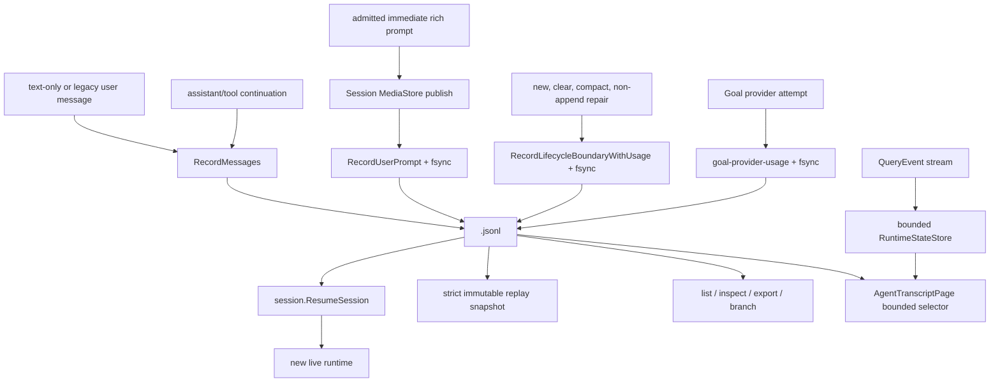

# Transcripts

**Status:** current
**Authority:** durable conversation history
**Last verified:** 2026-08-09

> **Ownership:** This file owns transcript JSONL format, append/rewrite/load,
> corruption recovery, and conversation durability. Session orchestration belongs
> in [`sessions.md`](sessions.md); the bounded live reducer/read model belongs
> in [`architecture/tui/contracts/runtime-events.md`](../tui/contracts/runtime-events.md).

## Authority Boundary

The transcript JSONL is an append-only durable audit for production turns and
the authority for the current replayable conversation state. Ordinary messages,
content replacements, file-state snapshots, and metadata append as individual
records. Version-tolerant lifecycle records select a new active state without
deleting earlier lines:

- `session-start` commits a durable empty session;
- `reset-boundary` makes the active model context empty while retaining prior
  turns in the audit;
- `compact-boundary` installs one compacted message/replacement/file snapshot;
- `state-checkpoint` is reserved for non-append repairs such as max-turn
  normalization and compatibility fixtures.

`LoadFull` replays records in file order. A lifecycle record replaces only the
active message/replacement/file projection; subsequent ordinary records append
to that projection. A version-1 `user-prompt` record keeps an immediate
text/image turn ordered without inline bytes. Version 2 extends the strict
union with ResourceLink, embedded text, embedded safe-raster blob, and bounded
standard annotations while preserving one logical durable part per protocol
block. Its owning Session MediaStore must resolve every ordinary-image or
embedded-blob ref before that user message enters the active projection.
Metadata remains last-wins across the complete audit.
The recorder also retains process-local exact bindings from each materialized
message object to its owning prompt record. P30.3 consumes those bindings to
prove historical turn identity. `LoadFullContext` also returns the exact final
active prompt-record/message-index bindings after strict ref materialization.
P30.5b consumes only those bindings to recover cloned neutral logical replay
parts; neither path guesses from content, provider shape, or message position.
Every newly written physical record also carries an additive
`entry_id {version,id}`. `LoadFull.Entries` preserves physical source order and
returns that stable identity together with an exact-byte transcript revision.
Legacy records remain byte-for-byte untouched: readers derive an explicit
source/ordinal/timestamp/kind/payload fallback identity that is valid only for
the revision in which it was observed. If the opened file cannot be read to
completion, the revision stays empty and legacy cursor validation fails closed.
Versioned Agent completion receipts are embedded in the exact parent
model-facing message. Lifecycle boundaries may remove that message from active
context, but they do not remove its receipt from the append-only audit.

`LoadSessionReplaySnapshot` is the strict portable-history selector over this
same `LoadFull.Entries` plus revision. It keeps the exact
`MessageEntryIdentity` for the lifecycle-selected active context, deep-clones
each returned message, validates logical assistant and tool identity/outcome,
and attaches cloned neutral prompt parts only when an exact final active
prompt-record binding selects that user message. The record selects Text,
ResourceLink, Image, embedded text, or embedded blob; the materialized
provider message only supplies already-validated canonical media bytes after
its complete shape matches the record. The snapshot rejects the whole load
when `LoadFull` reports corruption, the prompt binding drifts, or history
cannot be paired without ambiguity. Unlike ordinary corruption-tolerant
resume, it never returns a recovered partial history.

`RuntimeStateStore` is a bounded in-memory read model derived from live events
and selected persisted Agent snapshots. It may drop old messages, events,
threads, tasks, or Agents by configured limits. It does not replace transcript
authority, and ordinary session resume does not replay the historical runtime
event stream.



## Record Kinds

| Kind | Payload |
|---|---|
| user/assistant/tool/system | one `schema.Message` |
| `user-prompt` | strict versioned ordered typed union plus stable turn identity; v1 remains text/image-ref, while v2 adds ResourceLink, embedded text/blob, and standard annotations; media is ref-only and no record contains bytes, base64, digest, path, image source URI, or caller provenance |
| `content-replacement` | bounded replacement decisions used to rebuild replacement state |
| `metadata` | key/value execution and session metadata |
| `file-history-snapshot` | append-only cumulative file-state map |
| `session-start` | empty active-state commit marker plus a known-zero cumulative provider-usage snapshot for newly owned sessions |
| `reset-boundary` | empty active state plus cumulative provider usage; prior JSONL remains audit history |
| `compact-boundary` | complete compacted active message/replacement/file state plus cumulative provider usage, including the compaction model call when present |
| `state-checkpoint` | complete active state and cumulative provider usage for a non-append repair |
| `goal-provider-usage` | versioned exact Goal/objective/root/executing-generation/turn/round/provider-call identity plus normalized final provider usage |
| message `agent_completion_receipt` extra | versioned child completion identity, exact parent lineage, terminal sequence/status, and delivery time; stored atomically with the model-facing attachment |

The file-state map records only whether a path was read, edited, or written.
It contains no file bytes, digest, mode, or rollback authority. An ordinary
append checkpoint flushes a successfully appended incremental snapshot, while
lifecycle boundaries carry a complete snapshot. The incremental writer reports
an append failure to the exact QueryEngine turn after the recorder call
returns. That turn keeps a concurrency-safe repair requirement until one
complete `state-checkpoint` commits current messages, replacements, file state,
and cumulative usage. Ordinary message append or `Flush` cannot clear the
requirement, and a failed full repair produces the existing terminal
persistence error. Neither form implements workspace rewind.

The file is JSONL, but each line is a `recordEntry` envelope rather than a raw
`schema.Message`. The optional `entry_id` envelope field is versioned separately
from payload-specific versions. Existing readers ignore it without losing the
record payload.

## Write and Recovery Semantics

- `RecordMessages` appends role-derived message envelopes. Production
  checkpoints append and sync only messages not already durable, so transcript
  growth is proportional to actual history rather than repeated full-state
  snapshots. A failed incremental write does not advance the durable cursor;
  the next safe checkpoint writes one complete `state-checkpoint` repair.
- File-tool snapshot errors do not change a successful Read, Edit, or Write
  result and never retry the side effect. All committed calls in a concurrent
  tool round settle before model-ordered result checkpointing, so one or many
  snapshot failures coalesce into one complete repair. The QueryEngine copies
  its recorder/writer under its state lock, releases that lock before I/O, and
  remains the only append-versus-full-checkpoint decision owner.
- `RecordUserPrompt` appends one already-published ref-backed prompt record.
  The immediate rich path first publishes every blob and the synced private
  manifest, then appends and syncs this record before any user event or provider
  call. It never appends the materialized Eino user message as a second record.
  A failed MediaStore or transcript boundary produces no provider entry and no
  visible dangling ref.
- `RecordLifecycleBoundaryWithUsage` appends one complete active-state
  transition and cumulative provider-usage snapshot, then
  syncs the file and, on first creation, its parent directory before returning.
  Its successful return is the command commit point; `/clear` and `/compact`
  mutate live state only afterward. P30.3 uses the same commit rule for a
  historical-media projection: no active-state change, recovery event, or
  provider retry may precede the successful fsync.
- A file or directory sync error after bytes were written is reported as
  `DurabilityUncertainError`, not as a clean pre-commit failure. The engine
  surfaces a `persistence_error` terminal and requires a complete repair
  checkpoint before advancing the durable cursor. Replay is authoritative if
  the process restarts inside this storage-failure window; no local JSONL
  protocol can prove whether a failed filesystem sync survived power loss.
- An append encode/write error closes the descriptor and marks the trailing
  line uncertain. Before the next append, the recorder truncates only the
  suffix after the last complete JSONL newline; a full repair checkpoint then
  selects the complete active state.
- `Replace`, `ReplaceWithReplacements`, and `AtomicReplace` remain compatibility
  rewrite APIs for explicit callers and fixtures. The production
  `QueryEngine` checkpoint path no longer uses them; callers choosing those APIs
  intentionally replace the JSONL authority and can discard prior audit lines.
  A retained message keeps its persisted ID and timestamp when identity can be
  proven from the current record/payload. Newly synthesized replacement and
  compact records, legacy records promoted by a rewrite, and branch copies get
  fresh IDs.
- Persisted entry identity remains usable across a rewrite. A legacy identity
  is cursor-safe only while its exact transcript revision matches;
  `ValidateEntryCursorRevision` returns `ErrTranscriptRevisionChanged` after an
  append or rewrite changes that revision. Display text is never an identity
  input by itself.
- An invalid or duplicate persisted ID never makes a second record disappear.
  The record remains readable, receives a revision-scoped fallback identity,
  and contributes a corruption diagnostic.
- `Flush` calls `Sync`; `Close` syncs then closes the descriptor.
- `LoadFull` skips malformed legacy lines, returns valid records, and reports
  bounded corruption details instead of failing the whole transcript. A
  malformed lifecycle line does not partially change the active projection.
  A malformed or unknown rich prompt record, or a ref whose private bytes do
  not pass exact digest/MIME/size/dimension validation, instead rejects the
  whole load with a bounded redacted category: partial rich history would
  change the user's prompt.
- `LoadSessionReplaySnapshot` deliberately tightens that read policy: any
  corruption, empty revision, duplicate durable/logical/tool identity,
  orphaned or unsettled tool result, ambiguous legacy pairing, unknown role or
  outcome, prompt-record/message drift, unbound rich provider content, or
  cancellation yields no snapshot. Missing/corrupt prompt media and unknown
  prompt versions or kinds already fail inside `LoadFullContext` before the
  selector exists. The selector opens only the read descriptor used by
  `LoadFull`; clone-on-read covers messages, logical prompt parts, annotations,
  and optional fields so caller mutation cannot reach another item, later
  access, engine state, or transcript bytes.
- `LoadMessagePage` is the bounded child-inspection reader. It scans modern
  text and ref-backed prompt records backward from a frozen file prefix with a
  2 MiB default and 8 MiB
  maximum record budget, returns at most 128 source-ordered message rows, and
  stops at the newest lifecycle boundary. A ref-backed row retains the typed
  prompt record and runtime-item identity for trusted consumers, while Agent
  inspection projects only ordered text and bounded typed descriptors. Paging
  never resolves a blob. Malformed rich records, atomic replacement,
  truncation, symlinks, oversized records, and conflicting persisted
  identities fail closed. Continuation accepts later appends but excludes them
  from the frozen snapshot. Modern paging deliberately does not hash the full
  prefix, so an unsupported same-inode, same-size external overwrite is
  outside this contract. Legacy pages perform a memory-bounded forward prefix
  scan when exact revision and valid-record ordinal are required.
- `QueryEngine.AgentTranscriptPage` wraps that boundary in a process-local
  opaque cursor bound to Agent, Session, thread, generation, transcript path,
  file identity, and frozen prefix. A live row collapses with durable evidence
  only when it carries the exact persisted entry identity attached after a
  successful transcript checkpoint. Replay-only and evicted modes use durable
  authority. The selector never restores callbacks, approvals, queued input,
  tool work, or model execution.
- `LoadFull.AgentCompletionReceipts` retains only the newest bounded unique
  receipt projection for diagnostics. It is not the deduplication authority.
  Runtime recovery asks `RuntimeItemDeliveryCoverage` about only the current
  coordinator/candidate IDs; that method scans the complete append-only audit,
  also recognizes historical runtime-item and command UUIDs, and fails closed
  on malformed audit input rather than risk reinjection. Unknown receipt
  versions still cover the completion ID they name.
- `engine/session.BranchSession` branches a selected active-message prefix
  containing text, legacy-inline, or ref-backed prompts. It preflights every
  selected source ref, copies ordinary bytes into a private same-parent staging
  sidecar with newly minted child IDs, durably installs that sidecar, then
  publishes the no-clobber child transcript as the visibility point. Exact
  retries bind the source revision, prefix, child identity, and ref mapping.
  The low-level transcript-only `Recorder.Branch` API still rejects rich refs
  because it does not own a MediaStore.

## WorkBoard Sidecars And Private Roots

QueryEngine's Task and Todo compatibility surfaces persist WorkBoard authority
beside transcripts. Adapter construction performs a read-only inspection
first. When inspection successfully identifies legacy authority, the
mutation-capable adapter creates a missing transcript root or identity-pins an
existing real directory and tightens it to `0700` before becoming usable. The
adapter binds that secured directory identity into its Store; first cutover
and artifact root-open revalidate it. Symlinks, non-directories, replacement
between inspection and preparation, replacement before first cutover, and
invalid committed or prepared authority fail before any WorkBoard artifact
write. Low-level `Store.Inspect` remains non-mutating; artifact operations
independently retain their exact `0700` directory and `0600` file checks.

## Session-Private Media

One saved transcript may own exactly
`<session-id>.jsonl.media/{manifest.json,blobs/sha256/<prefix>/<digest>}`.
The manifest maps an opaque random media ID to detected MIME, byte length,
dimensions, kind, and a private digest. Public prompt records carry only the
opaque ID and the non-secret validation metadata; provider preparation never
learns the blob path or digest.

The store anchors all traversal beneath an opened root, rejects links and
non-regular components, uses `0700` directories and `0600` files, and
revalidates root/subroot identity across publication and read boundaries.
Blob publication is create-exclusive staging, file sync, no-clobber install or
exact existing verification, directory sync, then synced atomic manifest
replacement. Ref materialization reuses the same strict complete-raster
predicate as initial admission. Lifecycle checkpoints and explicit transcript
rewrites preserve ref identity and overlay the materialized message only while
loading, so they cannot duplicate media inline.

Delete owns the inverse containment contract: it preflights the complete
expected tree without following links, rejects unknown entries or replacement
races before mutation, removes the transcript first, then ordinary sidecars,
then the media tree. The optional P31.1a
`<session-id>.workboard-shadow-v1.json` is one exact regular-file sidecar:
delete validates its identity/path object, never follows a link, and reports
whether it was removed. The file is comparison evidence only; transcript load,
resume, branch, compaction, and export never read or copy it. An interrupted
delete can therefore leave only unreachable private bytes or a
non-authoritative comparison file.

Saved rich runtime-input records reuse the same MediaStore and versioned prompt
record. The engine stores and syncs media before committing a ref-only queue
item, resolves and re-admits every ref before marking the exact item processing,
then appends and syncs the same-ref transcript prompt before settlement. The
queue item ID remains the claim/settlement identity, while the prompt turn ID is
the exact user-event and transcript identity. A separate bounded
`runtime_item_id` on the prompt record lets restart recovery remove a processing
item already covered by the append-only transcript and return only uncovered
work to pending. New runtime writers cannot persist inline image bytes; valid
legacy-inline records remain readable.

P30.6 makes that final split structural rather than conventional. Public
legacy rich queue input delegates through `UntrustedPromptInput`; the direct
`[]UserImage` prompt-record writer is gone; and generic coordinator enqueue
rejects new inline images before persistence. JSON load, strict validation,
restart materialization, and presentation still read existing inline records.
No automatic rewrite or durable schema migration occurs.

Manual collection is owned only by the active saved `QueryEngine`. Rich writers
hold a shared media-lifecycle lease from store publication through durable
transcript or queue commit; collection holds the exclusive lease. It retains
every ref in the complete physical transcript audit and every durable
coordinator state, revalidates both revisions immediately before mutation,
publishes the pruned manifest first, and removes only blobs no retained
manifest entry reaches. No startup, timer, offline, cross-Session, or automatic
GC path exists.

Ref-only paging, listing, and sanitized Markdown/JSON export do not resolve
blobs or expose private IDs. Ref-backed branching copies independent private
bytes before child transcript visibility. ACP private migration rejects a
Session whose transcript or queue depends on private refs instead of claiming
portability.

## Provider Usage Ledger

`LoadFull.Usage` aggregates only provider-reported `ResponseMeta.Usage` from
ordinary assistant responses. A lifecycle record carries a cumulative
version-1 `UsageSummary`; replay replaces the accumulator with that snapshot before
adding later ordinary responses, so compacted messages cannot double-count
older model calls. New LLM compaction boundary markers retain the compaction
call's usage and declare that usage was expected. That compaction usage remains
part of cumulative accounting but is not treated as the active post-compact
context: the current-input field stays unavailable until the next main-loop
provider response reports its own prompt usage.

Coverage is explicit. `ResponsesWithoutMetadata` records model responses that
lack provider metadata, including an otherwise empty assistant response, while
synthetic API-error messages are excluded. `LegacyBoundariesWithoutUsage` marks an old
lifecycle snapshot that contains usage-relevant assistant content but no
cumulative usage. An unsupported future snapshot version discards its
uninterpretable numbers and carries that version forward as a coverage gap. A
fully empty ledger may therefore report a known zero, but
partial/corrupt/legacy histories become stale or unavailable in diagnostics.
No character-based token estimate or price is stored in this ledger.

This cumulative Session ledger is distinct from P24.2b's append-only Goal
provider ledger. `RecordGoalUsage` validates one positive-version record,
appends it with a stable transcript entry identity, and syncs the file and
parent before returning. The record contains exact Goal/objective, root and
executing Session/thread/Agent generation, Goal turn, logical round, provider
call, prompt/cached/completion/reasoning/total, and billable token fields.
Billable tokens are `max(provider total, prompt + completion) - explicit
cached prompt tokens`; missing or invalid usage is never estimated as zero.

The root Goal checkpoint owns the usage cursor and aggregate. It durably writes
a pending admission before provider entry, appends the exact usage record
after the final cumulative stream snapshot, then checkpoints the new aggregate
and clears only that matching admission. Duplicate identical physical records
count once by ledger revision; conflicting duplicates, unauthorized future
revisions, corrupt records, and a pending admission without an exact record
fail closed. A sync error after the Goal record may be visible is
durability-uncertain: the current process blocks later admissions and restart
replay decides whether the exact record survived.

P24.3 reuses ordinary message persistence as the delivery receipt for one
internal Goal continuation. The Goal checkpoint first owns the immutable
continuation cursor; the adjacent runtime-input ledger owns pending,
processing, rejected, and settled delivery state. After the private admission
revalidates that exact cursor, the engine records one system-generated
user-role message carrying `runtime_item_id` and typed Goal metadata. That
transcript commit settles the coordinator item before any provider call, then
the Goal checkpoint advances the cursor to `delivered`. A crash between those
two writes is safe: `RuntimeItemDeliveryCoverage` finds the transcript receipt,
recovery pauses the Goal, settles any remaining item, and never redelivers.
Permanent user/control supersession takes the opposite path: the Goal cursor
is checkpointed as `rejected` before the coordinator item is durably rejected
and settled.

The engine appends submitted user/hook messages before model execution and
appends assistant/tool/attachment messages at safe checkpoints. Content
replacement decisions and file snapshots stay additive. Automatic or manual
compaction emits exactly one `compact-boundary`; clear emits one
`reset-boundary`. Restart reconstructs the same active messages and auxiliary
state while the pre-boundary JSONL remains available for inspection and future
session-surface work.

Local/background Agent transcripts are written by `tools.AgentRunner` under its
output directory. They are separate JSONL authorities for those Agent
conversations and can seed replay-only child projections when no live Agent
remains. The runner durably writes resume history plus the first child turn
before executor entry; the child QueryEngine consumes that pre-stored boundary
once rather than appending a duplicate prompt, then owns normal incremental
checkpoints. Worktree-isolated transcripts therefore remain outside the
ephemeral worktree and survive clean removal.

Agent metadata beside that transcript owns terminal completion publication.
The runner first persists terminal status, generation, monotonically advancing
terminal sequence, deterministic completion ID, and exact notification payload.
Only then may the parent coordinator collect it. Parent transcript receipt is a
separate authority: missing receipt permits at-least-once redelivery at the next
safe parent boundary; present or unknown-version receipt blocks reinjection for
that completion identity. A stale disk-only `running` child still normalizes to
inert aborted replay and does not synthesize a completion.

## Code References

| Symbol | Evidence |
|---|---|
| recorder envelope and lifecycle schema | [`recordEntry`](../../../engine/transcript/persist.go), [`LifecycleBoundary`](../../../engine/transcript/persist.go) |
| ordered rich prompt schema and materialization | [`promptrecord.Record`](../../../engine/internal/promptrecord/record.go), [`Recorder.RecordUserPrompt`](../../../engine/transcript/persist.go) |
| ref-only active projection | [`Recorder.LoadRefProjection`](../../../engine/transcript/persist.go) |
| Session-private media publication and resolution | [`mediastore.Store`](../../../engine/internal/mediastore/store.go) |
| independent media copy and reachability collection | [`mediastore.Store.CopyTo`](../../../engine/internal/mediastore/store.go), [`mediastore.Store.Collect`](../../../engine/internal/mediastore/store.go) |
| durable and legacy record identity | [`EntryIdentity`](../../../engine/transcript/entry_identity.go), [`ValidateEntryCursorRevision`](../../../engine/transcript/entry_identity.go) |
| bounded message paging | [`LoadMessagePage`](../../../engine/transcript/message_page.go), [`MessageEntryIdentity`](../../../engine/transcript/message_page.go) |
| exact live/durable provenance | [`Recorder.LatestMessageEntryIdentity`](../../../engine/transcript/entry_identity.go), [`QueryEngine.AgentTranscriptPage`](../../../engine/agent_transcript.go) |
| corruption-tolerant active replay | [`Recorder.LoadFull`](../../../engine/transcript/persist.go) |
| strict immutable portable replay | [`LoadSessionReplaySnapshot`](../../../engine/session/replay_snapshot.go) |
| fsynced lifecycle and cumulative usage commit | [`Recorder.RecordLifecycleBoundaryWithUsage`](../../../engine/transcript/persist.go) |
| provider usage aggregation and coverage | [`UsageSummary`](../../../engine/transcript/usage.go) |
| exact Goal provider usage commit | [`Recorder.RecordGoalUsage`](../../../engine/transcript/goal_usage.go) |
| Goal continuation receipt and delivered disposition | [`QueryEngine.recordTranscriptMessages`](../../../engine/engine.go), [`goalService.markContinuationDelivered`](../../../engine/goal_continuation.go) |
| uncertain durability and parent-directory sync | [`DurabilityUncertainError`](../../../engine/transcript/persist.go), [`Recorder.Flush`](../../../engine/transcript/persist.go) |
| incremental message append | [`Recorder.RecordMessages`](../../../engine/transcript/persist.go) |
| compatibility rewrite | [`Recorder.ReplaceWithReplacements`](../../../engine/transcript/persist.go) |
| engine incremental/boundary checkpoint owner | [`QueryEngine.submitMessage`](../../../engine/engine.go), [`QueryEngine.recordTranscriptBoundary`](../../../engine/engine.go) |
| file snapshot append and restore | [`maybeRecordFileState`](../../../engine/tool_execution.go), [`QueryEngine.resumeSessionWithOptionsForTurn`](../../../engine/engine.go) |
| runtime store is bounded | [`engine/runtime_state.go`](../../../engine/runtime_state.go), [`engine/runtime_state.go`](../../../engine/runtime_state.go) |
| session loads active replay | [`ResumeSession`](../../../engine/session/resume.go) |
| ref-backed Session branch and sanitized export | [`BranchSession`](../../../engine/session/branch.go), [`ExportSession`](../../../engine/session/export.go) |
| active-owner manual media collection | [`QueryEngine.CollectSessionMedia`](../../../engine/media_lifecycle.go) |
| Agent launch/terminal persistence and restore | [`RunningAgent.persistDurableState`](../../../tools/agent_runner.go), [`AgentRunner.LoadPersistedAgentSnapshot`](../../../tools/agent_runner.go) |
| versioned parent completion receipt | [`AgentCompletionReceipt`](../../../engine/transcript/completion_receipt.go), [`Recorder.RuntimeItemDeliveryCoverage`](../../../engine/transcript/completion_receipt.go) |
| parent receipt construction and coordinator recovery | [`runtimeItemMetadata`](../../../engine/input_coordinator.go), [`NewRuntimeInputCoordinator`](../../../engine/input_coordinator.go) |
| pre-stored child first turn | [`SubAgentExecutor.ExecuteAgent`](../../../engine/subagent.go), [`QueryEngine.submitMessage`](../../../engine/engine.go) |

The completed immediate and queued ref-backed media-record boundaries and
accepted lifecycle expansion are owned by
[`P30 Cross-Entrypoint Multimodal Input`](../../migration/plans/p30-cross-entrypoint-multimodal-input.md).
The original legal-writer/oversized-reader mismatch and complete persistence
owner map remain reproduced in
[`P30.0 multimodal characterization`](../../migration/verification/p30-0-multimodal-characterization.md);
valid legacy transcript and runtime-input records may still contain inline image
bytes, but new saved rich writers are ref-only.
P30.6 completion evidence and the owner source gate are retained in
[`P30.6 multimodal program closeout`](../../migration/history/runtime/p30-6-multimodal-program-closeout.md).
P30.1b validates legacy image bytes before transcript mutation and omits caller
`Name`/`Path` provenance from multipart `Extra`; it does not introduce media
refs or change the record envelope.

## Example

```jsonl
{"timestamp":"2026-07-15T02:00:00Z","entry_id":{"version":1,"id":"7d31..."},"kind":"user","message":{"role":"user","content":"inspect resume"}}
{"timestamp":"2026-07-15T02:00:01Z","entry_id":{"version":1,"id":"12bf..."},"kind":"reset-boundary"}
{"timestamp":"2026-07-15T02:00:02Z","entry_id":{"version":1,"id":"e94a..."},"kind":"user","message":{"role":"user","content":"start from here"}}
```

Loading these lines returns only `start from here` as active model context; the
earlier prompt remains in the JSONL audit. Transcript replay does not recreate
the exact historical live `QueryEvent` sequence.
