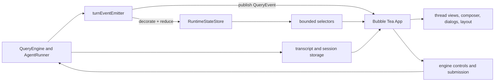
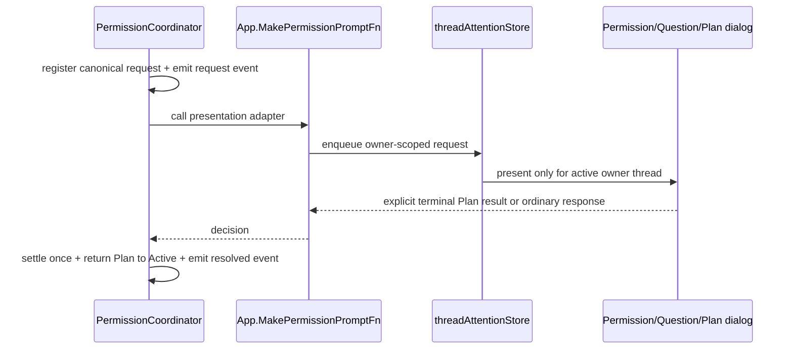
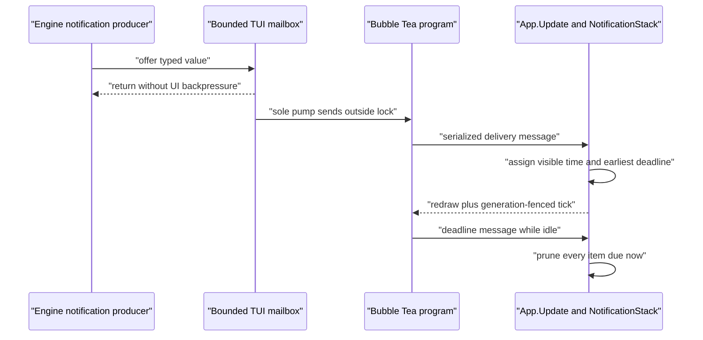

# TUI Architecture

**Status:** current

**Last verified:** 2026-08-07

**Ownership:** this document owns TUI component boundaries and data flow;
behavioral details belong to the linked contracts.

## Design Rule

The engine owns bounded runtime truth. The Bubble Tea
[`App`](../../../internal/tui/app.go) owns presentation and interaction
state. A rendered row, dialog, cached view, or queued preview must never become
the only record of a runtime fact.

## Contract Index

| Contract | Question it answers |
|---|---|
| [`architecture/tui/contracts/runtime-events.md`](contracts/runtime-events.md) | How runtime facts are identified, reduced, replayed, and delivered |
| [`architecture/tui/contracts/composer.md`](contracts/composer.md) | How text, images, mentions, paste, and submission snapshots compose |
| [`architecture/tui/contracts/editing.md`](contracts/editing.md) | How undo, search, external editing, and thread-local drafts behave |
| [`architecture/tui/contracts/busy-queue.md`](contracts/busy-queue.md) | What happens when input arrives while a leader or child is busy |
| [`architecture/tui/contracts/sessions.md`](contracts/sessions.md) | What resume, fork, replay, sidecar restore, and warnings may reconstruct |
| [`architecture/tui/contracts/responsive-layout.md`](contracts/responsive-layout.md) | How compact, standard, wide, modal, and scroll geometry are selected |
| [`architecture/tui/contracts/terminal-lifecycle.md`](contracts/terminal-lifecycle.md) | Which terminal capabilities, focus, suspend, quit, and cleanup paths are guaranteed |
| [`architecture/tui/contracts/accessibility.md`](contracts/accessibility.md) | Which no-color, reduced-motion, raw-history, Unicode, and discoverability guarantees apply |

The ordering in the diagram is literal: [`turnEventEmitter.Emit`](../../../engine/runtime_events.go)
decorates and applies an event before it publishes that event to the consumer.
The reducer path is therefore available even when non-lossless delivery stops
after cancellation.

## State Ownership

| State | Canonical owner | TUI role |
|---|---|---|
| Thread, turn, message tail, tool, Agent execution, worktree, Goal, terminal, unresolved interaction | [`RuntimeStateStore`](../../../engine/runtime_state.go) | Read defensive snapshots and selectors |
| Logical WorkItems, Todo compatibility, and execution relations | root-QueryEngine-lineage WorkBoard | Read only through `TaskExplorerSnapshot`; never infer or mutate locally |
| Query execution, cancellation, permission settlement, Goal transitions/admission, durable leader pending input | `QueryEngine`, `RuntimeInputCoordinator`, and their collaborators | Invoke typed controls and render results |
| Agent execution, steering, and child pending messages | `tools.AgentRunner` | Invoke only engine-declared exact-generation controls |
| Conversation history and execution checkpoint | transcript and session packages | Inspect, resume, fork, and show warnings |
| Active thread, chat projection, draft, cursor, scroll, selection, modal stack | [`App`](../../../internal/tui/app.go) and `threadViewStore` | Own bounded presentation state |
| Transient in-process notifications | [`App.Update`](../../../internal/tui/app.go) and `NotificationStack` | Accept typed delivery, assign visible time, expire by deadline, and render the newest active value |
| Terminal capability snapshot, focus observation, reacquisition, and final writes | `terminalcap.Capabilities`, `FocusState`, `restoreTerminalCapabilitiesCmd`, and `TerminalOutput` | Select supported behavior, restore App-owned modes after handoff, and serialize bounded application output |
| Active theme and component styles | [`App`](../../../internal/tui/app.go) | Resolve startup theme once, apply validated explicit choices, and propagate one `Styles` value to current/future presentation consumers |

[`threadViewState`](../../../internal/tui/thread_view_state.go) explicitly
stores presentation state. Chat items can be rebuilt from runtime selectors or
durable transcripts; queue previews are local edit affordances, not durable
pending-input truth.

## Theme Ownership

Startup resolution is `EINO_THEME` → config → terminal capability. Canonical
IDs and the one-release `dark`/`light` aliases retain their existing behavior.
The explicit startup-only compatibility allowlist maps `dark-daltonized` to
Polar Night and `light-daltonized` to Daybreak, preserving requested polarity
without claiming parity with either reference palette. No prefix or substring
inference is used.

An unsupported value is recorded as a typed source-specific startup issue. An
invalid environment value falls through to config; an invalid config value
falls through to the existing terminal-capability default. `App.Init` delivers
the bounded, escaped issues once, and `App.Update` projects them through the
existing warning-notification lifecycle. Control bytes are quoted rather than
written to the terminal. Runtime `/theme` remains a distinct explicit path: it
does not consult startup sources or accept startup-only compatibility names.
After validation, `App.propagateStyles` updates every component that captured
`Styles`, every active/inactive thread chat and search view, and the style
source used by future thread views. `ChatView` requires construct-time style
injection; it never selects a theme independently.

`polar-night` and `daybreak` are the canonical truecolor IDs. The string inputs
`dark` and `light` remain aliases for one release and canonicalize on startup
and explicit paths; `dark-ansi`, `light-ansi`, `snowy`, and `aubergine` retain
their IDs. The ANSI palettes contain only ANSI-16 values.

`App` owns one immutable
[`RenderEnvironment`](../../../internal/tui/render_environment.go) snapshot.
Each live theme application replaces that value and advances only its theme
generation; each real terminal-size change advances only its geometry
generation. Per-item and viewport render-cache entries, including frozen
finished messages and stale streaming entries while scrolled away, are
reusable only for the exact environment identity and width. Theme changes
therefore preserve semantic history and scroll state while forcing the next
render to use the new styles.

The same environment is also projected into every G11.E1-E4 migrated
interactive component. Plan, permission, MCP approval/settings, resume,
question, Agent wizard, background/detail, Team monitor/peek, CommandPalette,
ModelPicker, AgentThreadPicker, Help, search, and rewrite-selection surfaces
render their final rows through the App-selected profile. Centered components
publish only transient presentation geometry from the exact frame returned to
App; Ctrl+T uses the existing full-screen layout rectangle directly. Hints,
active-thread labels, and chat/expanded selection use the same profile for
display-cell/source conversion.

Text selection stores item/line plus terminal-cell columns and binds them to
the exact content generation, render environment, render width, and endpoint
item cache identities that gave those coordinates meaning. Copy conversion
uses renderer-published semantic spans, resolves cell boundaries to complete
graphemes under the selected profile, and never splits a wide, combining,
Indic, variation-selector, ZWJ, or flag cluster. Search byte ranges and
Bubbles editor/cursor geometry remain semantic/library owners rather than
alternate final-frame width policies.

### Final-frame chat selection projection

[`ChatView.Render`](../../../internal/tui/chat.go) publishes one immutable,
viewport-bounded row projection beside the exact returned frame. Every final
row is classified as empty, sticky, padding, transcript, inter-item gap, or
jump-pill overlay; only transcript rows carry item/line identity. The frame and
projection share environment, width, height, frame generation, and content
generation identity, so a dirty, missing, resized, reflowed, or otherwise
incompatible projection fails closed instead of reconstructing an offset.

Forward hit testing, inverse highlight lookup, drag clamping, edge-scroll
bounds, jump-pill ownership, Agent-detail link resolution, and extraction all
consume that published projection. A drag that starts on transcript content
clamps across chrome to the nearest visible transcript row, while chrome
cannot start a selection. Pill presses precede selection routing; a non-empty
selection suppresses a same-release Agent action, but an ordinary no-selection
click still opens Agent detail.

Each selectable built-in produces its normal visible rows and zero-cell
semantic annotations in one renderer invocation. `ChatView` strips and parses
those annotations before installing the cache entry, then publishes immutable
cell-to-semantic-byte spans and soft/hard boundary kinds beside the unchanged
visible rows. Soft wraps contribute no byte; semantic hard and inter-item
boundaries contribute exactly one newline; represented spaces and tabs,
including logical-line trailing whitespace, survive. Gutters, bullets,
identity glyphs, indentation, table borders and padding, layout fill, and
terminal controls remain presentation-only. A malformed or incomplete row
fails closed as non-selectable without regenerating `Raw` or transcript text.

Double click selects a Unicode word or one punctuation grapheme, triple click
selects one semantic logical line without its terminator, and forward/reverse
drags normalize to the same half-open range. Scroll-only frames may retain
item-local endpoints under the same content identity. Width, environment,
profile, item replacement/mutation, expansion, collapse, truncation, or reset
clears stale selection before highlight, extraction, copy, or release-action
fallthrough.

Edge drag applies one immediate row of scroll, then uses a generation-fenced
50 ms Bubble Tea tick for one row per tick. Release, clear, stale identity,
modal/state ownership change, or a viewport that cannot move stops the owner;
delayed ticks from an older generation are inert.

P27.3 adds one TUI-local typed clipboard owner. The composition root injects
the exact `TerminalOutput` already used by Bubble Tea, so renderer frames and
the complete OSC 52 packet share one synchronously acknowledged serializer;
there is no raw `os.Stdout` fallback or second terminal writer. `App` admits
at most one request, binds its monotonic ID to one of the four callers, and
accepts only the matching typed result. Selected text stays in the Bubble Tea
command closure and never enters QueryEngine, transcript, runtime reducer, or
durable state.

Input validation rejects empty, invalid UTF-8, and source payloads above
262,144 bytes before transport. Direct, tmux, and screen OSC 52 bytes are
exact; native routing is snapshotted once for macOS, Wayland/X11, Windows,
SSH, and unavailable environments, uses fixed argv/stdin without a shell,
and has one two-second deadline. A `TerminalOutput` admission fence
linearizes native start against output failure and close; a later terminal
failure cancels the in-flight helper and retains the existing kill, drain,
restore, and close lifecycle.

Only native exit zero produces ordinary “copied” feedback. OSC-only delivery
states that a terminal request was written without acknowledgement; busy,
oversized, unavailable, timeout, cancellation, partial output, closed output,
and failure paths never claim success. Mouse and expand-view copy retain the
visible selection, while keyboard copy clears only after validation and
admission.

The theme schema owns `AuroraSky`, `Selection`, `EnoBody`, and `EnoOutline` in
`Styles`. Every supported palette now supplies project-owned values, including
ANSI-16-safe fallbacks. The welcome mascot consumes `EnoBody` and `EnoOutline`
as foreground-only tones; its eyes and nose deliberately use an empty style,
so the terminal owns both sides of their contrast. Polar Night and Daybreak
accent/inactive foregrounds are checked
against the documented `bg0` design swatches at ≥4.5:1. This is a palette
design gate, not a claim about the user's terminal foreground/background,
which the TUI does not paint.

### Semantic color boundary

[`theme.go`](../../../internal/tui/theme.go) is the only production TUI source
allowed to declare a literal hex color or construct a `lipgloss.Color` from a
string literal. [`styles.go`](../../../internal/tui/styles.go) defines the
semantic `Styles` shape, while `defaultStyles` is only a compatibility alias
for `StylesForTheme(ThemePolarNight)`; it does not carry a second palette.
A recursive source test enforces this boundary across `internal/tui`,
including nested production packages.

Renderers receive immutable styles from their owning `App` or component.
Errors select brand/info, warning, or error tokens by severity; shell, Plan,
and bypass badges select warning, sky, and error respectively; running tools
use brand teal. Amber is therefore warning-only. Dialog controls, picker
metadata, search/selection surfaces, permission risk badges, and Markdown
syntax highlighting reuse the same semantic tokens instead of constructing
independent colors. `ScrollThumb` and `ScrollTrack` derive from inactive and
subtle-border palette values, so ANSI themes do not leak truecolor.

Plan feedback cursor colors are stored in the pre-reversal form expected by
Bubbles, so the final focused cell receives the semantic brand background.
`App` also passes its terminal color capability into `PlanDialog`. In
`ColorNone`, a width-reserved render-only textarea clone inserts one literal
caret before final-frame ANSI stripping; the authoritative draft, rune cursor,
undo stack, focus, viewport, and runtime state remain unchanged. Final-cell
terminal emulation and real color/no-color PTY capture own this visible
contract.

This boundary changes presentation only. It does not move runtime state,
interaction, permission, transcript, replay, clock, or cache ownership.

### Composer mode border

[`App.renderEditor`](../../../internal/tui/app.go) selects the rounded composer
border foreground from the current presentation projection on every render:

| Visible mode | Semantic foreground |
|---|---|
| Default | `AssistantPrefix` brand teal |
| Plan | `AuroraSky` |
| Shell input | `Warning` amber |
| Bypass permissions | `Error` red |

Shell input takes precedence over the permission mode, matching the existing
header badge when both facts are present. Permission mode still comes from
`App.permissionMode`, so an attached engine remains authoritative; the border
does not copy or cache that state. A mode change is therefore visible on the
next Bubble Tea frame without a new event, clock, or widget-local owner.

The renderer changes only `EditorBorder`'s semantic foreground before applying
the existing width and padding. Compact, standard, and wide editor geometry is
unchanged, and the full App layout benchmark retains its previous allocation
count. Polar Night, Daybreak, and dark-ANSI exact border SGR output is pinned
by the composer-border golden.

### User-message panel

[`UserMessage.Render`](../../../internal/tui/chat.go) renders every visible row
with the project-owned `▎` edge through `UserPrefix`. Polar Night, Daybreak,
Snowy, and Aubergine place the full row on the theme-owned
`UserMessageBlock`/`userBg` surface; ANSI themes deliberately keep the same
brand edge without painting a background.

The bar and text are rendered as separate runs that both inherit
`UserMessageBlock`. This explicitly restores the background after the bar's
foreground reset, so the text cannot punch a terminal-default hole through
the panel. The scrolled sticky-prompt projection uses the same bar and surface
while retaining its existing one-row budget and truncation behavior.

The existing `width-4` content budget remains the wrapping owner, and every
row still occupies the established rendered width. `RenderRaw` returns the
original content without decorative glyphs or ANSI. Finished-item cache keys,
theme-generation invalidation, selection, follow/offset transitions, and
non-user message renderers are unchanged. Exact Polar Night, Daybreak, and
dark-ANSI runs plus compact/standard/wide normalized layouts are pinned by the
user-panel and product-state goldens.

### Welcome wordmark

[`renderWelcomeWordmark`](../../../internal/tui/welcome.go) renders the static
`YHC` identity from the current App-owned `Styles` snapshot. When the
App's immutable terminal capability advertises truecolor, it interpolates each
title cell from `Header` brand teal through `AuroraSky` to `DialogTitle`'s
permission violet. A live `/theme` change therefore affects the next welcome
render without a package-global theme, cached title, environment re-read, or
second palette owner.

ANSI, reduced-color, and no-color capabilities do not enter interpolation.
They reuse the flat semantic `Header`; the final no-color frame is stripped by
the existing App output boundary. The title's established Header padding and
visible width are preserved in compact-text, condensed-mascot, full-bordered,
and wide full-bordered layouts. Reduced motion does not suppress the gradient
because the wordmark is static and schedules no animation.

Exact Polar Night and Daybreak SGR runs, flat ANSI/reduced-color behavior,
no-color output, runtime restyling, and all four welcome layouts are pinned by
the welcome-wordmark and responsive-welcome tests. The normalized welcome
golden remains unchanged, and the full App layout benchmark continues to cover
this path.

### Markdown theme boundary

[`Styles`](../../../internal/tui/styles.go) also carries the private
canonical theme identity and an independent `Element` surface. Finalized
assistant output, compatibility streaming output, and the Plan dialog receive
the App-owned `RenderEnvironment`; Markdown never reads environment/config
state and does not own a mutable process-global theme.

[`getRendererWithEnvironment`](../../../internal/tui/markdown.go) acquires one
atomic renderer-and-mutex entry from the `RenderEnvironment` pool. `App` owns a
private capacity-32 strict-LRU pool and preserves its pointer across theme and
geometry projection; zero-value compatibility streams retain independent
private pools. No process-global renderer or lock index remains.

The exact key retains wrap width, color profile, immutable semantic palette,
theme generation, geometry generation, selected display-cell profile, and
selection mode. Pool lookup and insertion are serialized, while rendering
holds only the entry mutex. Eviction removes index ownership without resetting
an in-flight entry, so an old holder finishes and a later lookup may safely
construct a distinct entry. Construction failures are not cached and retain
the safe literal fallback. `StreamingMarkdown` binds stable-prefix and full
output to the same identity plus source, width, and completeness, preserving
the canonical finalized-source lifecycle. P41.2 completion evidence is
[`p41-2-bounded-markdown-renderer-pool.md`](../../migration/history/tui/p41-2-bounded-markdown-renderer-pool.md).

H1 uses brand teal, H2 sky, H3 permission violet, H4-H5 inactive, and H6
subtle. Inline code uses sky on `Element`; quote content is inactive behind a
brand `▎`; horizontal rules use the subtle-border token. Truecolor Chroma
syntax maps keywords, functions, strings, diagnostics, and related token
classes onto the same semantic palette rather than a separate literal color
table. ANSI themes construct the renderer with the ANSI-16 profile and disable
the custom Chroma path because that formatter emits terminal256 escapes
independently of the renderer profile. No interaction, layout, clock, table,
or streaming-boundary owner changes at this boundary.

### Markdown table display-cell boundary

[`DisplayCellProfile`](../../../internal/tui/display_cell.go) is the
immutable display-cell service selected once for an App. Its deterministic
default pins Unicode 17 / UAX #29 / `displaywidth v0.11`,
ambiguous-width-narrow, Unicode emoji presentation, four-cell tab stops,
7-bit ANSI/OSC handling, and the project-specific Indic/lone-RI/bare-label
rules. Every policy field contributes to a versioned SHA-256 identity.
[`App.New`](../../../internal/tui/app.go) copies a valid constructor-
injected profile or the default, exposes no mutation path, and reports the
identity and policy through `/terminal` without inferring terminal/font fit.

G11.D1 projects the App-selected profile through active, inactive, restored,
future, and durable-reset thread views, `HistoryRenderContext`, finalized and
compatibility-streaming assistant messages, and the Plan dialog. The custom
table renderer receives that selected value for min/ideal sizing, word/hard
wrap, padding, overflow, borders, and narrow fallback. Renderer, stable/full
fragment, frozen-item, and viewport caches require the exact profile and
theme/geometry generations; frozen items no longer use a `±2` width tolerance.
The short-lived `widthProfile` and `defaultWidthProfile` compatibility names
are deleted. Profile-only constructors remain test seams, while production
Markdown receives the exact App environment. No Glamour post-render table
repair remains.

G11.D2 extends that same value through every non-pill final composition
boundary: generic and Assistant chat rows, sticky prompts, vertical bands,
main/sidebar fitting, wide-sidebar content, status-hook output, and the App
finalizer. Each rectangle passes its owning start column for tab expansion.
The finalizer balances SGR/OSC state per physical row, clips to the selected
terminal width, and can report the profile plus the first overflowing row to
development/tests without mutating `App` or adding visible chrome. The
wide-sidebar separator now remains at the allocated profile-cell X even beside
semantic tables whose clusters disagree with `x/ansi`.

G11.D3 extends the selected profile through the jump-to-bottom pill. One
package-private `ChatView` geometry result caches the styled run, final
chat-relative row, inclusive start/exclusive end cells, action, rectangle, and
exact render-environment identity. Centering expands tabs from the selected
start cell. `ChatView.Render` places that published run, while
`App.pillClickHits` invokes the same result's hit test after modal, expanded,
and sidebar routing has retained precedence. Theme, resize, and profile changes
recompute presentation without changing follow or unseen-message semantics.

G11.E1 extends the same environment through the six production modal
components: Plan, permission, MCP approval/settings, resume, and question.
[`modal_geometry.go`](../../../internal/tui/modal_geometry.go) owns bounded
profile-cell row projection, EGC-safe ellipsis/path truncation, per-row
SGR/OSC balance, top/bottom placement, and origin-aware centering of the final
outer box including border and padding. Plan review, action, and feedback
pointer rectangles are published from the same projected rows that render;
the other modals remain keyboard-only and the App modal non-leakage boundary
is unchanged. The disconnected compatibility `PermissionPrompt` is not an App
modal and remains outside this boundary.

The profile never mutates canonical Markdown or normalizes Unicode. It never
splits an extended grapheme or supported control sequence. SGR and OSC 8 state
is closed before each physical-line border and replayed on the continuation,
so styling and links cannot leak across cells or rows. The profile also owns
the project-specific Indic-conjunct, lone-regional-indicator, and bare-label
terminal geometry pinned by the independent G9 oracle. G11.F1 deleted the
separately named `terminalLayoutSafetyWidth` heuristic and its historical
assertions after every production owner had migrated.

The profile also owns rectangle-origin-aware cluster iteration, measurement,
tab expansion, ANSI-aware truncation/wrapping, alignment/padding, and per-line
control balancing. Typed semantic runs are concatenated before EGC
segmentation; the run containing a cluster's first visible scalar owns its
style and link metadata. The measured cluster keeps source bytes separate from
its terminal projection, so tab expansion and later ANSI emission cannot split
the cluster. These operations now own Markdown/table, final-frame, pill,
modal, Agent/task, content, picker, hint/search, and selection
render/interaction geometry. G11.F1 has deleted the compatibility owners and
installed one type-aware Go AST gate across the supported Linux amd64, Darwin
amd64/arm64, and Windows amd64 production builds. Direct Lip Gloss,
`x/ansi`, Glamour ANSI, Uniseg, and rune-count selectors—including chained
methods, method values, and method expressions—are rejected unless the
classification records a semantic/editor/library owner and an explicit
removal condition.

P41.1 later removed the final fixed-size exception. The compatibility helpers
keep their body-width contract, but
[`contentProjectFixedBox`](../../../internal/tui/content_fixed_box.go) now
returns rendered rows with local inner and outer `layoutRect` values. It keeps
tabs semantic until the aligned inner origin is known, wraps and truncates at
whole grapheme boundaries, fits natural or fixed height, emits padding and
border cells under the selected profile, then applies a Lip Gloss style with
all geometry-changing fields removed. A single impossible cluster is omitted
whole instead of widening the box.

Normal and annotated user messages consume the same fixed projection. Chat
selection metadata is built from those exact rendered rows, and modal
placement measures the same returned rows through `DisplayCellProfile`; no
interaction publisher asks Lip Gloss for a second rectangle. Source and
fixture gates keep Width, Height, MaxWidth, MaxHeight, margins, inline mode,
and transforms outside this boundary. The Unicode/control matrix covers
origin-sensitive tabs, Indic conjuncts, variation selectors, ZWJ emoji,
regional indicators, combining-only input, narrow/wide ambiguous policy,
one-sided/full borders, every alignment, SGR/OSC8 balancing, unsafe controls,
selection extraction, pointer bounds, modal placement, and PTY lifecycle.
G25 is closed; completion evidence is
[`p41-1-fixed-size-geometry-owner.md`](../../migration/history/tui/p41-1-fixed-size-geometry-owner.md).

G11.F2 closes the frame-integrity program without changing production
behavior. The 32/40/48/72/80/120/150/180 PTY union covers semantic tables;
one real alternate-screen Bubble Tea session traverses every normal-layout
width while streaming and verifies sticky headers, status, live Agent rows,
shared pill rendering/hit testing, primary SGR mouse clicks, theme/no-color
reprojection, repaint, and ordered terminal restoration. PTY capture proves
emitted bytes and lifecycle, not glyph pixels or font fallback. `/terminal`
therefore continues to report `Terminal/font: not inferred`; a separately
labelled cursor-position diagnostic can make a claim only for an explicitly
named terminal/version/font/fallback combination. Structural counters prove a
steady 10K frozen-history frame neither re-segments completed items nor
renders the full transcript, and portable p95 budgets cover that path plus 100
live sidebar rows. Reproduction and measured baselines live in
[`g11-f2-terminal-program-closeout.md`](../../migration/verification/g11-f2-terminal-program-closeout.md).

[`extractTableIslands`](../../../internal/tui/table_render.go) parses each
prepared fragment once with Goldmark GFM and derives source ranges,
alignments, normalized rows, semantic inline runs, and final-top-level
completeness from its AST. Every table is replaced by a collision-free short
fenced-text sentinel before Glamour renders surrounding Markdown. The
sentinel's exact rendered line projects only the blockquote/list continuation
prefix; [`spliceTableIslands`](../../../internal/tui/table_render.go) removes
the fixed two-cell code margin and prefixes each physical semantic-table line
without repeating list markers. A missing or duplicate sentinel fails closed
to sanitized literal source.

Completed top-level, stable-prefix, blockquote, list, and nested
blockquote-list tables therefore share the custom semantic renderer.
Only tables descended from the active final top-level streaming block are
spliced as literal/deferred source rows. Those rows replace literal C0/C1 and
invalid UTF-8, expand tabs, hard-wrap through the selected `WidthProfile`, and
cannot execute ANSI/OSC from model text. A following sibling proves the block
stable; `Finalize` proves the terminal block complete. Either transition
reflows the canonical source through the semantic owner.

The custom renderer introduces SGR/OSC only from trusted metadata. Decoded or
literal terminal controls are replaced before rendering; OSC 8 destinations
must be valid UTF-8 and contain no terminal control or terminator bytes. The
narrow same-byte parse view for code-span pipes never mutates canonical source
or its byte offsets. `renderMarkdownFragment` now sends Glamour output directly
to semantic-island splicing, so grammar, streaming, nested-container, cache,
and final table geometry each have one owner.

## Identity Glyph Ownership

[`styles.go`](../../../internal/tui/styles.go) owns the two project identity
glyph constants: outline `✧` for system voice and filled `✦` for agent voice.
[`chat.go`](../../../internal/tui/chat.go) applies the outline star through
`SystemMessage` and the filled star through `AssistantPrefix` for finalized
assistant output. [`streaming.go`](../../../internal/tui/streaming.go) uses the
same filled-star semantic for its compatibility streaming renderer, while
[`app.go`](../../../internal/tui/app.go) uses it for the status model identity.
The mapping is project-owned; user-message and tool-state semantics remain
separate contracts. Spinner motion reuses the filled identity glyph but keeps
its own renderer contract below.

Status composition measures, truncates, and pads both sides with the exact
App-selected profile, including externally supplied status-hook ANSI/OSC text.
Crowded output retains the existing left-side fallback while the complete
frame closes controls and enforces the terminal rectangle. Renderer tests
preserve the exact mapping, semantic ANSI brand style, continuation
indentation, and bounded status width; normalized chat/status goldens preserve
the visible text contract.

## Spinner Motion Ownership

[`spinner.go`](../../../internal/tui/spinner.go) owns one project-native
eight-tick breathing sequence. The existing 120ms activity tick is the only
clock, so tick eight repeats tick zero after 960ms and no second timer or
runtime state owner exists. The glyph is always the centralized filled
identity star `✦`; the animation changes only its semantic foreground.

Truecolor themes interpolate from `Subtle` to the peak style selected by the
caller. The main spinner uses `AssistantPrefix`; stalled and inline running
task/tool icons preserve their existing semantic peak styles. ANSI themes
choose between those same two palette colors instead of synthesizing a
truecolor escape. Reduced motion renders the peak style statically while the
existing functional polling chain remains active and the animation counter
stays frozen.

[`App.renderSpinner`](../../../internal/tui/app.go) retains ownership of verb,
classifier/advisory-reviewer/hook override, effort, elapsed time, provider token
usage, waiting text, and ordering. Classifier status takes precedence over the
process-local advisory reviewer status, which takes precedence over hook
status. The reviewer label is presentation only: it creates no dialog,
settlement, replay, or permission authority. Its normal-motion verb keeps the established positional
three-cell glimmer and computes one 2.4-second sine phase for thinking,
responding, and tool-use modes. The highlight interpolates from
`AssistantPrefix` through `AuroraSky` to the permission-violet foreground;
the base verb remains the brand foreground. ANSI themes collapse both sides
to their flat cyan `SpinnerShimmer` semantic without a truecolor escape.
Reduced motion bypasses segmentation and renders the full verb through
`AssistantPrefix`.

After the existing 30-second quiet threshold, the first half of the waiting
ramp uses `AuroraSky` and the second half uses `SpinnerStalled`. The icon still
passes that caller-owned peak through the P19.2.1 pulse, so the color change
does not create a second glyph or clock owner. Text, effort/elapsed/token
suffixes, the three-second thinking delay, layout, and runtime state remain
unchanged.

## Mascot Ownership

[`mascot.go`](../../../internal/tui/mascot.go) owns Eno's seven fixed 15×6
poses, tone-to-glyph mapping, click/idle frame sequences, and click-over-idle
ownership rule.
[`welcome.go`](../../../internal/tui/welcome.go) owns responsive placement,
the fixed six-row viewport, hit testing, and the reduced-motion interaction
gate. It also owns the single injected 3–5 second idle-delay chain and its
generation token. The too-small and compact-text tiers intentionally hide the
mascot; condensed and full-bordered tiers preserve it without changing editor
or status availability.

Face glyphs have no palette token, foreground, or background fill. Each
colored body/outline run is reset before a face glyph, leaving the glyph in the
terminal-default style on dark, light, and otherwise unknown backgrounds.
Idle scheduling exists only while a mascot-bearing welcome tier is visible and
motion is allowed. A resize, click, or transition to chat invalidates the
pending generation because Bubble Tea ticks cannot be cancelled. A click may
replace an idle sequence and reuse its pending frame tick; idle never replaces
a click. Hidden, chat, and reduced-motion states neither accept stale idle
messages nor rearm the chain.

## Runtime Projections

The TUI does not consume one giant snapshot on every frame. The engine exposes
bounded projections for distinct consumers:

- [`TaskExplorerSnapshot`](../../../engine/task_explorer.go) for WorkItems,
  exact execution generations, task panels, activity, and the wide sidebar;
- [`ThreadCatalogSnapshot`](../../../engine/thread_catalog.go) for thread
  navigation and attach mode;
- [`AgentDetailSnapshot`](../../../engine/agent_detail.go) for explicit
  non-transcript detail such as output and lineage compatibility;
- [`AgentExecutionDetail`](../../../engine/agent_detail.go) for exact-current,
  terminal-output and lineage reads in Ctrl+T;
- [`AgentTranscriptPage`](../../../engine/agent_transcript.go) for bounded,
  generation-bound transcript pages in thread switching, Ctrl+T, Ctrl+B, and
  the `/team` read-only peek;
- [`ThreadAttentionSnapshots`](../../../engine/thread_attention.go) for
  unresolved owner-scoped interactions;
- [`AgentParentTraceSnapshots`](../../../engine/agent_trace.go) for the
  bounded child trace shown in a parent Agent tool row.

### Model-attempt projection

P29.4 attempt events are engine-owned runtime facts. `RuntimeStateStore`
retains bounded request, attempt, profile, phase, failure, admission, retry,
switch, provider-call, and output-disposition fields. They are process-local
diagnostics, not Session recovery authority.

The App attaches streamed assistant, thinking, and uncommitted tool
presentation to the exact attempt ID. TUI is the only retractable entrypoint:
after the engine confirms a constructable alternate, one tombstone removes
only the discarded attempt's ChatView items, tool index, active tree, progress
entry, and streaming/thinking state. Pointer and attempt-owner checks prevent a
reused tool-call ID from deleting another attempt. Plain/headless, ACP, and
default library projection cannot switch after visible assistant output.
The later safe `started` event produces one bounded warning; the App does not
derive it from failed output and does not write it to chat or durable state.

### Current task-facing surfaces

Task and Agent rows share one selector, while each surface retains an explicit
presentation or compatibility boundary:

| Surface | Projection | Current interaction |
|---|---|---|
| Ctrl+T Task Explorer | defensively cached `TaskExplorerSnapshot`, exact detail readers, plus `ApplyTaskExplorerAction` | Responsive mixed list with textual WorkItem/execution kind, exact composite selection, composable local filters/search, explicit controls/list/detail focus, resolved disabled-action hints, render-derived mouse containment, WorkItem `overview`/`activity`, execution `overview`/`activity`/lazy `transcript`/`output`/`lineage`, independent detail scroll, refresh, engine-declared controls, and one typed exact-generation switch target |
| Ctrl+B Background Tasks | ordered WorkItem and exact execution rows from `TaskExplorerSnapshot` | Retained execution inspection and the same exact-generation detail, transcript, message, cancellation, pause/resume, and abort dispatcher; WorkItems are read-only |
| `/team` | ordered exact execution rows from `TaskExplorerSnapshot` plus bounded transcript readers | All-sub-agent read-only monitor, peek, and exact thread switch; parent lineage is not a TeamID |
| activity tree and wide sidebar | bounded `TaskExplorerSnapshot` summary | Selector-ordered live activity, done/total, attention, hidden counts, and compact status |
| `/tasks` | bounded `TaskExplorerSnapshot` formatted by the command layer | Labelled durable, read-only WorkItems, exact generations, links, hidden counts, and unavailability diagnostics |
| Task/Todo tool history | persisted tool-call input/result | Per-call summary or expanded raw content; not current board state |

Ctrl+T projects one deterministic list from the cached selector snapshot:
engine-ordered WorkItems first, then engine-ordered exact execution
generations. Every mixed row starts with textual `WorkItem` or `Execution`
kind. Selection is one mutually exclusive `(BoardID, WorkItemID)` or
`(AgentID, Generation)` key; refresh and reorder restore only that exact key,
missing rows fall back by the clamped prior cursor, empty snapshots clear local
selection/detail state, and resize changes only viewport offset. No title,
owner, thread, or list position becomes identity, and the TUI does not infer a
cross-kind execution relation.

Filtering is a panel-local projection over the cached rows: `active` consumes
only exact WorkItem `in_progress` or live execution phases, `attention`
consumes only row attention facts, and `terminal` consumes only exact terminal
statuses/phases. Search is an AND condition over that filter. One private
descriptor resolves canonical keys and their textual hints; action
availability still comes only from each exact execution's engine declaration.
Controls, list, and detail publish explicit focus. Render-derived hit regions
are invalidated whenever their frame becomes stale, and App consumes Task
Explorer mouse input before chat; pointer input never submits an action.

`Refresh` takes a defensive panel-local copy of the snapshot, including nested
row/link slices and hidden-count maps. The selected WorkItem or exact execution
then projects two pure cached views: `overview` carries identity, lifecycle,
ownership, and structural facts; `activity` carries only cached execution,
tool/count, link, attention, and diagnostic facts supported by that row kind.
Left/Right or `h`/`l` switches tabs only while detail owns focus. Vertical,
page, bound, and wheel input moves an independent detail offset, never the list
selection or offset. WorkItem links require exact `(BoardID, WorkItemID)` and
execution facts require exact `(AgentID, Generation)`. Because snapshot
attention and diagnostics lack `BoardID`, duplicate cross-board WorkItem IDs
make those facts unassignable and the panel omits them. Render and cached-tab
input remain provider-, action-, transcript-, filesystem-, and Git-I/O free.

Exact execution detail adds lazy `transcript`, `output`, and `lineage` tabs.
Entering a deep tab, explicit refresh, or transcript older-page request starts
at most one Bubble Tea command. Each request/result binds the exact selection,
Session, thread, generation, request generation, tab, and opaque cursor.
Selection movement, filter replacement, tab change, refresh supersession,
generation replacement, duplicate/out-of-order completion, and panel close
invalidate the result; the renderer observes only accepted cached state.

Transcript keeps the existing bounded generation-bound pager. Output and
lineage share `QueryEngine.AgentExecutionDetail`; lineage reads metadata only.
Because AgentRunner continuation reuses its terminal output path, a live
nonterminal generation renders no prior result. A current terminal generation
uses the bounded output tail and must still match the requested Agent,
generation, Session, thread, and output path after I/O. A retained historical
row whose Agent ID now names another generation is explicitly unavailable
rather than rebound. These readers do not query AgentRunner messages or create
a second transcript/output store.

Starting send, continue, or cancel confirmation freezes one immutable
presentation intent: request ID, exact BoardID/revision, correlation-only
runtime revision, exact AgentID/generation, MessageID, action, and textual
target label. Payload remains separate. Refresh may replace rows and move
selection, but submission still sends that frozen identity for engine
reauthorization; result correlation cannot clear a newer pending intent.
Queued-input cancellation additionally carries the exact returned `MessageID`.
Switch declaration and application call the same engine resolver and return
one typed Session/thread/Agent/generation/mode target.
Ctrl+T copies and revalidates that complete target against fresh snapshot and
catalog facts before changing the view; stale, duplicate, mismatched,
replay-only, evicted, unresolved, and pre-dispatch targets fail visibly without
a transcript command. A legacy Session whose WorkBoard is not authoritative
retains exact-generation read-only transcript/navigation rows but receives no
mutation controls.

Thread switching first captures the current presentation state, activates the
target mode, restores its view state, then starts at most one asynchronous
bounded transcript page for the exact Agent/thread/generation. Ctrl+T binds its
complete exact target to that pager: initial, older, and forced-refresh requests
revalidate before dispatch and again before application, so a superseded
generation cannot be rebound by a reused ThreadID. Generic picker, Ctrl+B, and
`/team` navigation retain their existing ID-oriented lookup. The TUI applies a
page only while the same thread, generation, request generation, and cursor
remain current; older pages prepend by stable transcript-entry identity without
collapsing equal display text. See
[`switchThreadView`](../../../internal/tui/thread_view_state.go) and
[`activateThreadEntry`](../../../internal/tui/thread_navigation.go).
Replay-only and evicted-transcript activation and paging dispatch no model or
tool work, and their send/pause/resume/abort controls fail closed. Leaving a
thread with an active permission, question, repeated-tool, or
Plan dialog suspends only that presentation: the modal drops its sender before
the coordinator closes the detached UI response channel. An empty waiter exits,
while a valid response already submitted remains deliverable exactly once. If
no response was submitted, the canonical request remains unresolved and
unsuppressed; returning to the exact owner re-presents it. Structured
Plan/question data is frozen with the submitted request, and a late settlement
cannot touch the next owner's same-kind modal. Thread navigation therefore
cannot implicitly grant, deny, resume, abort, or otherwise mutate child runtime
truth.

[`TeamsPanel`](../../../internal/tui/teams.go) is the compact multi-Agent
monitor exposed by `/team`. Its rows come only from `TaskExplorerSnapshot`;
exact thread, status, attention, attach mode, and display mode travel with that
execution row. Foreground, background, foreground-detached
`backgrounded`, waiting-input, paused, and terminal meaning is textual. The
execution mode is derived from the current `AgentRunner` generation at selector
time; it is not a new durable field or mutation owner. `Tab` opens a
bounded read-only transcript peek and `Enter` calls the same
`activateThreadByIDWithCmd` navigation action used by the thread picker. The
monitor has no send, permission/question settlement, steering, detach, or
abort providers, and remains available while the leader request is running.

## Permission and Attention Path

The active TUI path is:

The coordinator owns identity and exactly-once settlement
([`PermissionCoordinator.request`](../../../engine/permission_interaction.go)).
The App adapter only presents and converts the result
([`MakePermissionPromptFn`](../../../internal/tui/app.go)).
[`threadAttentionStore`](../../../internal/tui/thread_attention.go)
routes the request to `PermissionDialog`, `QuestionDialog`, or `PlanDialog`
([`presentNextThreadAttention`](../../../internal/tui/thread_attention.go)).
[`suspendThreadAttentionPresentation`](../../../internal/tui/thread_attention.go)
separates modal lifetime from coordinator lifetime during thread switching.
For Plan, the dialog renders the engine-provided exact plan identity and maps
the exact previous mode, accept-edits, bypass, cancellation, and feedback to
one explicit terminal request/revision decision. The generic permission
response is only a completion signal; missing Plan-specific intent fails
closed, and retained feedback cannot turn Esc or force-close into Revise. The
dialog never creates session or persistent permission grants.

`PlanDialog` separately owns only presentation: explicit Review, Actions,
Feedback, and BypassConfirmation focus; one bounded rendered-line viewport;
and review/action hitboxes. A bypass action changes only focus. Explicit Yes
is the sole `Confirmed=true` path; No/Esc returns to Actions without losing
selection, review offset, feedback draft, cursor, or undo. A request starts in
Review. In Review focus, PageUp/PageDown page the Plan, wheel events scroll only
within the review rectangle, and primary clicks focus or select without
submitting. BypassConfirmation instead admits only its own Up/Down/Tab
selection, Enter, visible No/Yes hitboxes, and Esc; review, action, feedback,
editor, page, wheel, motion, release, and unrelated pointer input are ignored.
Keyboard and mouse routing enter that confirmation branch before every generic
Plan path. The frame publishes only its outer rectangle and the current
rendered No/Yes hitboxes; review, action, and feedback geometry is cleared,
including before-first-render and resized stale-frame cases. Standard and
compact frames use the same two controls. The previous-mode action is first
and duplicate accept-edits/bypass targets are omitted. Resize and theme
propagation preserve focus, selection, and offset and clamp only to new
rendered bounds. G24 delivery evidence is in
[`g24-plan-confirmation-input-isolation.md`](../../migration/history/tui/g24-plan-confirmation-input-isolation.md).

Feedback focus owns an independent multiline textarea built from the same
bounded construction, cursor snapshot/restore, and undo helpers as the main
composer. It consumes the App's configured submit/newline/undo bindings,
renders those effective hints, keeps paste and cursor messages inside the
modal, and uses semantic input surface/border/text/placeholder/cursor styles.
Empty feedback does not settle; Esc preserves draft/cursor/undo; typed Revise
returns to the engine without becoming a generic permission denial.

Composer and Plan external editing share one `x/editor`-option resolver with
`VISUAL` over `EDITOR` precedence. Plan launches bind the active thread,
request, revision, exact path, and monotonic generation to a full presentation
snapshot. Completion validates the active thread-attention owner before disk
reload; stale results are ignored, failures keep approval open, and successful
results restore the reviewed digest, focus, selection, feedback, cursor, undo,
and viewport. Plan, composer, and suspend/resume use one ordered full-repaint,
focus, mouse, and blink reacquisition helper. A repeated fake-Vim PTY round
trip proves resize, alternate-screen, keyboard, page, and mouse behavior.

ProjectGraph uses the same dialogs but a different durable owner boundary.
When `PermissionRequestEvent.Source == "project_graph"`, the App may receive a
cold-reprojected request with no callback channel. The dialog response is
converted to `PermissionInteractionResult`, passed to the engine's exact active
interrupt, and persisted as a priority-now permission-decision `RuntimeItem`.
The normal queued-input scheduler then resumes the Graph. The App never stores
opaque Graph state, exact hidden arguments, or permission authority; stale
requests are rejected by the engine.

`PermissionQueue` still exists in `chat_integration.go`, but it is not the
active structured permission path wired by
[`runTUI`](../../../cmd/yhc/cmd/root.go). Coordinator-originated
events update runtime state but are not allowed to enqueue a duplicate dialog
([`handleEngineEvent`](../../../internal/tui/app.go)).

## Composer and Pending Input

Each thread has its own presentation draft, structured elements, and undo
state. Image elements contain identity, label, MIME, and rune range only; one
App-owned draft-media table retains captured bytes while they remain reachable
from a thread draft or undo projection. Async image results bind request,
leader-thread, draft-revision, and insertion-anchor identity. Submission makes
one validated ordered text/image snapshot and starts one engine admission; the
draft clears only after the matching idle or busy acceptance returns.

Busy leader input goes to the engine-owned durable
`RuntimeInputCoordinator`. Rich input uses Session-private media refs and an
ordered prompt record. Queue preview, chat, history, rewrite, search, and
selection receive sanitized descriptors only. `/queue edit` is the sole TUI
path that atomically materializes an exact pending ref record and removes it
durably before restoring a detached rich draft. Child text input first enters
the Agent outbox and is acknowledged only after the coordinator durably
accepts the complete batch; child images remain unsupported. Runtime replay
does not dispatch pending input. An idle TUI may claim it as a fresh turn,
while ACP and plain callers wait for the next legal inbound boundary.

When the saved-root Goal capability is enabled, the App also waits on the
coordinator's separate Goal-only signal. Ordinary user/runtime input is
scheduled first; only an otherwise idle TUI may claim and submit the exact Goal
continuation through QueryEngine. The status line reads the reducer's Goal
snapshot and owns no completion or eligibility decision.

See [`architecture/tui/contracts/composer.md`](contracts/composer.md),
[`architecture/tui/contracts/editing.md`](contracts/editing.md), and
[`architecture/tui/contracts/busy-queue.md`](contracts/busy-queue.md).

## Rendering and Layout

`App.View` composes explicit rectangles, applies the active modal last, and
passes every return through [`finalizeView`](../../../internal/tui/app.go).
Completed chat items may be cached by semantic identity; active items remain
mutable. Frozen-item and viewport caches additionally require exact width and
the App-owned render-environment identity, so a resize, theme change, or
different injected display-cell profile cannot reuse stale measured lines.

`ChatView` is the sole scroll-follow and unseen owner. One value records
following state, a monotonic live append epoch, the first departure baseline,
and baseline validity. Live top-level history appends advance once; mutation,
grouping, finalize, render/cache work, truncation, reset, and transcript/
session/Agent hydration do not. Every nonempty away projection publishes one
semantic `Jump to bottom`/new-message model consumed by both rendering and App
hit testing. Same-process thread switching preserves the `ChatView` object;
durable and Agent projection replacement preserve away intent with an invalid
baseline and a count-free jump action. One cached profile-cell projection now
owns the styled run, centered final row, and inclusive/exclusive hit bounds for
both rendering and App primary-click routing.

Tool history dispatch is centralized in
[`toolHistoryRendererFor`](../../../internal/tui/tool_history_renderer.go).
The focused inventory test classifies every `RegisterDefaults` entry into a
dedicated renderer or the audited generic set
([`TestToolHistoryRendererInventoryClassifiesEveryDefaultTool`](../../../internal/tui/tool_history_generic_test.go)).
This is a default-registry rendering inventory, not a claim that every default
tool is model-visible on every turn. Visibility is separately filtered by
registry state and tool selection ([`GetToolsForPreset`](../../../tools/presets.go)).

Every rich tool-history renderer also routes its known category label through
[`toolNameStyled`](../../../internal/tui/tools.go). The shared category map
uses semantic foregrounds—brand for shell/MCP, success for file operations,
sky for search/Task/web, and permission violet for Agent/Plan—on the
palette-owned `Element` background. To-Do retains its green category alias;
unknown dynamic tools retain the plain `ToolName` style. This boundary changes
only SGR styling: label text, display width, history dispatch, interaction,
transcript, and replay behavior remain unchanged.

## Notification Lifecycle

Interactive-TUI notifications cross one bounded presentation ingress. The
composition root first creates the Bubble Tea
[`Program`](../../../cmd/yhc/cmd/root.go), then
[registers and starts](../../../cmd/yhc/cmd/root.go)
`tuiNotifyAdapter`. Concurrent engine callbacks copy a typed value into its
latest-three pending mailbox and return without waiting for `Program.Send`,
`App.Update`, rendering, or expiry. One pump removes values in FIFO order and
calls `Program.Send` outside the mailbox lock; an item already removed may
remain in flight while overflow drops the oldest pending value.

[`NotificationDeliveryMsg`](../../../internal/tui/notifications.go) carries
message and severity only. `App.Update` assigns creation time on acceptance;
[`NotificationStack`](../../../internal/tui/notifications.go) owns the
five-second default TTL, newest-three visible eviction, earliest deadline, and
pure defensive reads. A valid expiry message prunes every item due at the
App-owned current time. Earlier replacement deadlines advance a generation;
stale ticks are inert. If eviction moves the real earliest deadline later, the
already scheduled earlier wake remains authoritative and reconciles after it
fires.

The most recent active notification remains in the status line, with `(+N)`
for additional active items. Severity styling, focus behavior, and reduced
motion are unchanged: focus gates only separate external desktop handlers, and
reduced motion never disables in-process delivery or settlement. `View`,
`activeToast`, `Active`, `Count`, and render methods do not read time or mutate
the stack.

This ingress is TUI-specific. Plain, headless, ACP, standalone MCP, log, and
desktop notification handlers keep their existing owners. After
[`tea.Program.Run`](../../../cmd/yhc/cmd/root.go) terminates,
[`runTUIProgram`](../../../cmd/yhc/cmd/root.go) closes the adapter,
drops pending values, and joins the pump before closing `TerminalOutput`; later
offers are no-ops.

## Sessions and Terminal Boundary

Session resume restores durable messages and execution context, then permits a
later legal transport boundary to start a new turn. It does not replay tool
calls or stale interaction callbacks. Pending runtime input is recovered from
its own ledger and remains undispatched until claimed. Presentation sidecars
restore a safe subset only. See
[`architecture/tui/contracts/sessions.md`](contracts/sessions.md).

Terminal guarantees are limited to paths evidenced by the implementation:
Bubble Tea normal quit/EOF and suspend/resume behavior, plus the deferred panic
cleanup fallback. The TUI currently starts per-request cancellation contexts
inside the App; this architecture does not claim propagation of the CLI root
context through every App-started request. See
[`architecture/tui/contracts/terminal-lifecycle.md`](contracts/terminal-lifecycle.md).

## Architectural Invariants

1. Runtime facts are reduced before publication and are not reconstructed from
   widgets.
2. Presentation state may be cached or evicted without changing engine truth.
3. Unresolved interaction identity remains owner-thread scoped.
4. Replay and session inspection never dispatch model or tool work.
5. Pending runtime input is immutable after enqueue, durable until transcript
   settlement, and has exactly one coordinator owner; local preview state is
   never delivery truth.
6. Compact layout may omit detail, but commands remain reachable and durable
   transcript evidence remains inspectable.
7. Every default registry entry is classified into a dedicated renderer or the
   audited generic fallback; dynamic tools always retain a generic path.
8. Thread switching may suspend and later rebuild owner-scoped presentation,
   but cannot resolve or suppress the underlying runtime request.
