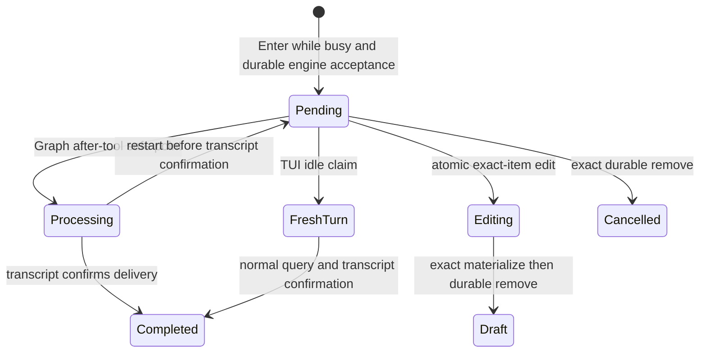

# Busy Submission And Runtime Input Contract

**Status:** current

**Last verified:** 2026-08-07

**Ownership:** the Session `RuntimeInputCoordinator` owns pending leader input;
`tools.AgentRunner` owns child source outboxes until durable transfer; the TUI
owns sanitized presentation only.

## Decision

Enter while the leader is running submits one literal ordered prompt to
`QueryEngine.EnqueuePromptInput`. The engine performs selected-route admission,
publishes any image bytes into the Session-private MediaStore, and commits one
bounded ref-only `RuntimeItemUserPrompt` before returning acceptance. It does
not cancel or replace the active turn. `Ctrl+C` is the explicit immediate-stop
gesture.

Pending input survives process restart through the engine ledger. TUI
presentation sidecars exclude queue payloads; construction and resume rebuild
safe previews from engine-owned descriptors.

## Runtime Ownership

[`QueuedPromptDraft`](../../../../engine/queued_input.go) is the transient edit
handoff only. [`QueuedPromptSnapshot`](../../../../engine/queued_input.go)
contains ID, display text, ordered sanitized text/image descriptors, time, and
state. It never resolves or exposes image refs, bytes, paths, URIs, digests, or
caller metadata.

`QueryEngine.EnqueuePromptInput` enforces selected-route admission and the
32-pending-user-input bound. Rich items use one ref-backed durable prompt
record; text-only callers retain legacy compatibility. The coordinator orders
explicit priority then FIFO. Cancellation, claim, and edit serialize under the
same durable owner.

The source-compatible `QueryEngine.EnqueueUserInput` wrapper follows the same
split: text-only input keeps the legacy path, while image-bearing input becomes
one text-then-images `UntrustedPromptInput` and delegates to
`EnqueuePromptInput`. Generic `EnqueueBounded` and `EnqueueBatch` reject newly
supplied inline `RuntimeUserPrompt.Images`; only restart decoding may read that
legacy JSON shape. The sealed durable writer clears inline prompt/image fields
before the coordinator commits a prompt-record-backed item.

The TUI's [`threadQueuedInput`](../../../../internal/tui/thread_view_state.go)
contains only the safe engine descriptor required for rendering and command
selection. It is never queue truth and cannot restore media independently.

## Leader Flow

1. `beginComposerAdmission` captures one ordered draft and starts one typed
   acceptance request.
2. The engine validates and durably enqueues before returning the queue ID.
3. Only the matching acceptance result clears the draft and appends the safe
   preview.
4. A completed tool round may claim eligible user input and emit its lifecycle
   plus attachment.
5. If the old turn terminates first, the coordinator signal schedules
   `startNextQueuedInput`; the TUI atomically claims the next priority/FIFO item
   and submits it through `QueryEngine.SubmitRuntimeItem`.
6. A matching `command_lifecycle:started` removes exactly one preview and
   promotes its sanitized display to a user row.
7. Restart or resume calls `QueuedPromptInputs` and rebuilds previews without
   materializing media.

## Queue Commands

The active leader view renders up to three recent pending rows plus an earlier
count. `/queue list`, `/queue edit <id|last>`, and
`/queue remove <id|last|all>` operate only on pending user items.

Rich edit requires an empty composer, no pending media load, and no pending
submission admission. `QueryEngine.EditQueuedPrompt` performs one
all-or-nothing transaction under the coordinator/media lifecycle gate:

1. identify the exact pending item;
2. materialize and revalidate its ref record;
3. persist exact durable removal; and
4. return detached ordered text/image bytes to the caller.

If materialization or persistence fails, the queue is unchanged and no draft
is restored. If claim, cancellation, or another edit wins, edit fails without
partial mutation. After success, the App constructs one exact ordered draft,
takes ownership of detached bytes, and zeros the handoff copies.

`/queue list` and ordinary preview never call this materializing path.

## Child And Background Flow

Agent-thread text input first enters the addressed Agent's pending-message
outbox with a stable command UUID. At a child safe point, QueryEngine peeks the
batch, persists typed `RuntimeItemAgentMessage` records, then acknowledges only
those IDs. Agent-thread images remain rejected and retained in the draft.

Terminal Agent generations use
`agent-notification:<agent-id>:<generation>` as their delivery ID. Repeated
polling is non-destructive until the coordinator accepts and acknowledges the
notification.

## Cancellation And Replay

Cancelling the active turn does not cancel pending user input. The TUI drains
the current event stream through terminal/closure before claiming another
item. Immediate stop is persisted before the local query context is cancelled.

Runtime-state replay and view-sidecar restore never dispatch work or restore
rich payload. Transcript delivery IDs settle ledger items; transcript history
is evidence against replay, not an outstanding queue.

ACP and plain transports do not synthesize a hidden request when background
input arrives. They merge pending runtime items into the next inbound query.

## Evidence

- ordered rich queue, restart, atomic edit, claim race, execution, and
  transcript settlement:
  [`p30_4_queued_prompt_test.go`](../../../../engine/p30_4_queued_prompt_test.go)
- queue admission and coordinator bounds:
  [`queued_input_test.go`](../../../../engine/queued_input_test.go)
- TUI acceptance, preview, edit, wake, and hydration:
  [`internal/tui/queued_input_test.go`](../../../../internal/tui/queued_input_test.go)
  and
  [`internal/tui/p30_4_composer_test.go`](../../../../internal/tui/p30_4_composer_test.go)
- Agent two-phase acknowledgement:
  [`tools/agent_runner_test.go`](../../../../tools/agent_runner_test.go)
- ACP next-inbound async wake:
  [`server/acp/agent_test.go`](../../../../server/acp/agent_test.go)
