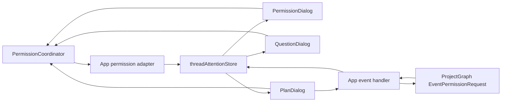

# Runtime Event and Snapshot Contract

**Status:** current

**Last verified:** 2026-08-07

**Ownership:** `engine.QueryEngine` owns event identity and publication;
[`RuntimeStateStore`](../../../../engine/runtime_state.go) owns bounded
runtime truth; `internal/tui.App` owns presentation state.

## Boundary

`QueryEngine.SubmitMessage` creates one
[`turnEventEmitter`](../../../../engine/runtime_events.go) per turn. Query,
hook, command, permission, Agent-progress, and terminal events pass through this
serialized boundary.

An active root Goal binds the emitter after turn admission. Turn start,
permission/foreground-child wait boundaries, and turn finish use
`EventGoalLifecycle`; ordinary events on the same root or descendant carry the
same immutable Goal identity. External Goal transitions apply through the same
decorator/reducer without granting a transport mutation authority. TUI consumes
the reducer-owned snapshot; Plain renders bounded lifecycle lines from the
same lossless events. A negotiated ACP Goal session captures the last lifecycle
event for its private update notification, while the dedicated headless Goal
driver drains the turn and then reads durable Goal truth. Ordinary headless and
standalone MCP do not consume Goal projection.

Goal finalization reserves two contiguous sequences. The durable Goal
checkpoint records the second sequence, `turn_finished` is reduced and
published first, and terminal is reduced and published last. A ProjectGraph
`waiting_input` terminal is different: it remains the last event for that query
turn but retains the logical Goal turn so the targeted permission decision can
resume it with the same Goal identity.

An explicit foreground-Agent detach is an out-of-band process transition rather
than a new child turn. `AgentRunner` first wins the exact foreground wait lease,
then `SubAgentExecutor.RecordAgentLifecycle` asks
`RuntimeStateStore.applyNextAgentLifecycle` to assign the next sequence under
the store's shared admission mutex. When a child turn is active, the
`backgrounded` event reuses that `TurnID`; it advances the bounded projection
without seizing, clearing, or completing the Graph turn. The event retains the
same Session, thread, Agent, parent lineage, causation, and generation.

Engine-owned worktree transitions are out-of-band: the lifecycle service first
commits a durable record revision, then
[`reduceWorktreeLifecycleTransition`](../../../../engine/worktree_lifecycle.go)
assigns the owner Agent/session/thread envelope and applies the same canonical
sequence/reducer boundary. Agent launch now consumes that same service: Ready
is reduced before child model entry, and terminal Removed, Retained, or
CleanupFailed state follows the durable record revision. Foreground,
background-notification, and TaskOutput views carry a bounded Agent handoff;
neither TUI nor ACP becomes a mutation owner.

Restart rehydration deliberately does not synthesize one of these events.
`worktree.Service.Discover` reads bounded regular versioned record files and
`RuntimeStateStore.RestoreWorktreeSnapshots` installs their latest durable
projection directly. It creates no thread, advances no event sequence, and
performs no Git, Agent, model, or tool operation. A later explicit recovery
operation may commit a real state transition through the normal event path.

For each emitted event:

1. [`decorateRuntimeEvent`](../../../../engine/runtime_events.go) assigns
   stable identity, sequence, timestamp, and causation;
2. decoration applies the event to `RuntimeStateStore` and commits the
   per-thread sequence only when the reducer accepts it;
3. [`emitOneLocked`](../../../../engine/runtime_events.go) publishes only
   an accepted decorated event to the consumer channel.

Reducer-before-publish is intentional. A presentation consumer cannot become
the source of runtime truth, a rejected event cannot leak a duplicate sequence,
and a non-lossless send stopped by context cancellation does not erase the
already accepted reducer state.

## Identity and Ordering

[`RuntimeEventEnvelope`](../../../../engine/events.go) carries:

| Field | Contract |
|---|---|
| `SessionID` | Durable session identity; required |
| `ThreadID` | Runtime conversation identity; required |
| `TurnID` | One submitted turn; required |
| `AgentID` | Empty for leader, stable for a child Agent |
| `ParentSessionID`, `ParentThreadID`, `ParentAgentID`, `ParentToolUseID` | Immutable lineage where applicable |
| `Sequence` | Strictly contiguous and increasing per thread |
| `Timestamp` | Non-zero UTC occurrence time |
| `CausationID` | Immediate tool, task, command, or parent-tool cause |
| `AgentGeneration` | Exact positive child execution generation; zero for root |
| `GoalID`, `GoalObjectiveRevision` | Exact Goal/objective revision attribution |
| `GoalRootSessionID`, `GoalRootThreadID`, `GoalRootAgentID` | Immutable root owner; the root Agent ID is empty |
| `GoalTurnID` | Logical Goal turn; it may span several permission-resume query turns |

Display names and descriptions are labels, never routing identifiers. The
leader may default `ThreadID` to `SessionID`; child storage may default its
session identity to the Agent identity. The fields remain distinct contracts.

## Event Families and Delivery

[`QueryEvent.Family`](../../../../engine/events.go) groups the concrete
event vocabulary for reducer and projection policy. The concrete
`QueryEventType` remains authoritative.

[`IsLosslessRuntimeEvent`](../../../../engine/events.go) marks Agent and
worktree lifecycle, command results, Plan transitions, permission
request/resolution, Goal lifecycle, and terminal events lossless at the turn
emitter.
[`IsCoalescibleRuntimeEvent`](../../../../engine/events.go)
marks stream, tool progress, task progress, hook status, and classifier status
as eligible for a future projection adapter.

`EventPermissionReview` is an interactive-family advisory lifecycle event, but
it is neither lossless nor coalescible. Each accepted checking, completed, or
unavailable event is decorated, reduced, and then projected like every other
turn event. Its payload contains only bounded opaque/canonical identity labels,
safe route labels, decision/reason, latency, and timestamp; reviewer input,
action arguments, nonce, digest, and rationale never enter the event.

`EventModelAttempt` is a process-local model-family lifecycle event. Its
payload contains bounded logical-request/round and attempt identity,
role/profile/provider/API-model/route labels, retry/switch/provider-call
counts, phase, failure class, admission code, and output disposition. Account,
endpoint, credential, raw provider response, prompt, failed output, and health
state are excluded. It grants no route, retry, usage, or recovery authority.

Attempt-owned assistant, stream, and uncommitted tool events carry the same
attempt identity. After a switch-eligible overload and constructable alternate
are confirmed, the engine emits `discarded`, then an exact tombstone only for
retractable output, then the next `started` event before dispatch. A switched
attempt does not also emit terminal `failed`. The reducer removes only the
tombstoned attempt's matching live/message projection; ChatView separately
clears the exact assistant, thinking, tool index, active tool, and progress
owners. The TUI projects one warning only from a safe later `started` event;
that presentation is not runtime authority or chat history. Attempt events and
tombstones are not persisted or reconstructed after restart.

No coalescing is implemented today. While the turn context is active, every
emission is reduced and then published. The store bounds memory by eviction,
not by merging newer progress into older events. After context cancellation,
non-lossless channel delivery is best effort, but reducer application still
precedes that delivery attempt.

## Reducer Contract

[`RuntimeStateStore.Apply`](../../../../engine/runtime_state.go) validates
and folds one event atomically. It rejects malformed identity, sequence gaps or
reordering, immutable-lineage changes, a new turn while the previous turn is
active, and unmatched interaction resolution.

Thread states are:

```text
running <-> waiting_input
running <-> paused
running|waiting_input|paused -> completed|failed|aborted
terminal -> running only for a new contiguous TurnID
```

A same-turn async hook response does not reopen a terminal thread. A matching
permission resolution may settle terminal-with-attention state. A duplicate
same-turn terminal is tolerated for the existing structured-output path.
Out-of-band worktree lifecycle events may precede child launch or interleave
with the parent turn; they advance their owner thread sequence and projection
without seizing or clearing an active user turn. Decoration reconciles its
local sequence cache with the shared store because the child QueryEngine may
advance the same thread between parent-owned service transitions.
The process-local Agent `backgrounded` transition follows the same sequence
admission but must reuse an active child `TurnID`. It leaves thread and Agent
status running, preserves the active turn and terminal fields, and is not a
launch boundary. It records that the parent wait was released; it is not a
durable completion receipt.

A later child terminal notification is a parent attachment, not a second child
turn. Its metadata carries the durable completion ID and terminal sequence.
`RuntimeStateStore` stores that delivered identity on the Agent projection; a
duplicate attachment with the same identity consumes the admitted parent event
sequence/revision but does not append a second model-facing parent message or
mutate the Agent projection twice. Parent transcript persistence, not the TUI
or reducer, remains delivery authority.

The reducer owns:

- thread identity, status, active turn, revision, timestamps, terminal, and
  cumulative active execution time;
- the detached root Goal snapshot and exact Goal-bound Agent generation
  attribution;
- bounded event/message/tool projections and one live assistant tail;
- bounded process-local model-attempt facts and exact attempt tombstones;
- bounded Agent and local-task projections;
- bounded immutable Agent execution generations keyed by
  `(AgentID, Generation)`, including observation ordinal, replay-only state,
  eviction count, and current hidden-live identity;
- bounded worktree lifecycle projections keyed by durable record identity;
- unresolved interactions keyed by stable request identity;
- dropped counters for bounded eviction.

## Bounds and Durability

Default bounds are defined beside
[`RuntimeStoreLimits`](../../../../engine/runtime_state.go):

| Data | Default bound |
|---|---:|
| Threads | 128 |
| Events per thread | 256 |
| Messages per thread | 128 |
| Tools per thread | 64 |
| Unresolved interactions per thread | 32 |
| Agents | 128 |
| Explorer execution generations | 128 primary rows |
| Local tasks | 128 |
| Worktrees | 128 |

Message, reasoning, tool, interaction, and tool-call projections are also
explicitly truncated. Snapshots defensively copy mutable slices, maps, nested
input, tool calls, and terminal records.

When thread capacity is full, the oldest attention-free terminal thread may be
evicted. Active threads and terminal threads with unresolved attention are not
evicted. If no eligible thread exists, the new thread is rejected. Unresolved
interactions are never silently dropped.

The store is a bounded read model, not durable conversation or cleanup storage.
Full messages and compaction history belong to transcripts; large tool results
belong to result storage; Agent metadata and transcript paths belong to the
Agent runner's durable files. Worktree owner/path/branch/base/state authority
belongs to versioned project-local `engine/worktree` records; the runtime
projection cannot authorize Git or cleanup.

### Canonical Task Explorer input

`RuntimeStateStore.TaskExplorerSnapshot` reads every retained immutable
execution generation under one read lock. Ordered live observations,
including an exact live attachment,
carry a process-local ordinal. Cold durable Agent restore installs
ordinal-free replay-only rows and dispatches nothing.
If the 129th simultaneous live generation arrives, reduction still succeeds:
the selector deterministically retains 128 rows and separately reports the
hidden live identity and cumulative generation eviction.

`QueryEngine.TaskExplorerSnapshot` joins that runtime value with the
`LogicalWorkAdapter`'s defensive full WorkBoard projection. The WorkBoard
revision remains the sole durable logical-work authority. Cold construction,
resume, fork activation, and restore staging bootstrap only from a validated
authoritative record and do not emit an event, call a model or tool, enqueue
input, request permission, run Git, or start an Agent.

The primary snapshot independently bounds WorkItems, execution generations,
links, and attention to 128 rows, caps inline text at 512 runes, and exposes
100-row terminal archive pages. WorkExecutionLinks are exact BoardID,
WorkItem ID, Agent ID, and generation tuples; missing or stale targets remain
explicit rather than inferred. `QueryEngine` declares exact inspect, switch,
send, cancel-input, pause, resume, cancel, and continue capabilities from the
current board and execution facts. A legacy Session without authoritative
WorkBoard state gets only exact-generation read-only transcript/navigation
rows.

Permission-review event records are diagnostic projection only. The pending
request, nonce, exact action/policy binding, and returned result live in the
current QueryEngine process and are cancelled and joined at close. They are not
checkpointed or reconstructed by `RuntimeStateStore.Replay`; a cold engine
starts with fresh request identity and no reviewer settlement authority.

Goal lifecycle events are likewise projection only. Durable root Goal state
and descendant binding live in Session metadata; replay, restore, snapshot
reads, and TUI rendering cannot mutate Goal state or enqueue work. Session
restore installs the latest durable Goal snapshot directly and synthesizes no
event or sequence. P24.2b adds `usage_recorded`,
`usage_admission_released`, `usage_limited`, and `budget_limited` phases plus
detached coverage and pending-admission fields. Those diagnostics contain
durable identity only and grant no provider, budget, or mutation capability.

### Active-time projection

Each thread accumulates time only while its canonical status is `running`.
`waiting_input`, `paused`, and terminal intervals freeze the counter; a later
turn continues the thread total instead of resetting it. Event timestamps
close completed intervals, while a narrow `ThreadTimingSnapshot` extends only
the current running interval to the presentation clock.

The TUI status and spinner consume the same selector. Human approval time,
paused Agent time, idle UI time, resize, and rendering therefore cannot inflate
the displayed active duration.

Goal root active time is a separate durable counter. The Goal owner checkpoints
the running interval whenever root execution enters or leaves a permission or
foreground-child wait and at final terminal. Nested waits compose as a set:
time resumes only after the last excluded reason clears. Descendant concurrency
never adds child time to the root counter. Paused, blocked, limited, terminal,
and cold-restored intervals are excluded. No UI displays this value in P24.2b.

## Replay

[`RuntimeStateStore.Replay`](../../../../engine/runtime_state.go) calls the
same `Apply` path over an ordered event slice. Replaying the same events into a
fresh store reconstructs the same bounded snapshot. It does not call a model,
dispatch a tool, submit queued input, or invoke an interaction callback.

The WorkBoard side is full-snapshot bootstrap rather than event replay.
Identical validated board state plus identical ordered execution and explicit
fixture-link inputs produces a deeply equal `TaskExplorerSnapshot`. A
BoardID mismatch, revision regression, same-revision content mismatch, sequence
gap, or immutable execution-lineage conflict leaves the prior process-local
projection unchanged.

Goal replay additionally requires monotonic Goal/objective revisions, exact
root and logical-turn identity, normalized blocker/completion evidence, and a
`turn_finished` snapshot whose `LastTerminalSequence` is the immediately
following sequence. Stale, duplicate, out-of-order, unknown-phase, or
conflicting-generation events fail without projection mutation.

Resolved requests remain diagnostic event records but are absent from pending
interaction selectors. This prevents replay or thread switching from reopening
an already settled prompt.

Agent thread replay is also projection-only. `replay_only` and
`evicted_transcript` entries are materialized through
[`AgentDetailSnapshot`](../../../../engine/agent_detail.go) and
[`activateThreadEntry`](../../../../internal/tui/thread_navigation.go).
Opening or switching to those views never dispatches work.

If the view being left owns an active permission, question, repeated-tool, or
Plan dialog, [`suspendThreadAttentionPresentation`](../../../../internal/tui/thread_attention.go)
hides the modal, detaches its sender, and closes the empty Bubble Tea response
channel. A response already buffered by the dialog remains deliverable exactly
once; navigation cannot withdraw it. Otherwise the request stays in
`threadAttentionStore`, remains absent from the suppressed set, and is
presented again only when its exact owner becomes active. Submitted
Plan/question data and stack ownership remain bound to that request, so a late
settlement cannot read or remove the next owner's same-kind dialog. No implicit
decision reaches `PermissionCoordinator` or a ProjectGraph interrupt.

Worktree lifecycle replay is likewise projection-only. It validates record
revision and state edges and reconstructs `RuntimeSnapshot.Worktrees`; it never
resolves a repository, spawns Git, creates/removes a path, or dispatches an
Agent. Restart discovery is also projection-only, but differs from event replay:
it installs the latest durable record plus an inspect-only, recovery-pending,
terminal, or unavailable disposition without inventing the missing historical
event sequence.

Session resume is a different operation: it restores durable history and
execution context, then allows an explicit future submission to create a new
turn. It never executes historical tool calls. See
[`sessions.md`](sessions.md).

## Selectors

Consumers use bounded selectors instead of cloning the full runtime store:

| Consumer need | Selector |
|---|---|
| WorkItem and exact Agent execution rows | [`QueryEngine.TaskExplorerSnapshot`](../../../../engine/task_explorer.go) |
| Thread navigation | [`QueryEngine.ThreadCatalogSnapshot`](../../../../engine/thread_catalog.go) |
| Selected Agent transcript | [`QueryEngine.AgentTranscriptPage`](../../../../engine/agent_transcript.go) |
| Explicit non-transcript Agent detail | [`QueryEngine.AgentDetailSnapshot`](../../../../engine/agent_detail.go) |
| Unresolved owner attention | [`QueryEngine.ThreadAttentionSnapshots`](../../../../engine/thread_attention.go) |
| Parent Agent tool trace | [`QueryEngine.AgentParentTraceSnapshots`](../../../../engine/agent_trace.go) |
| Detached root Goal inspection | [`QueryEngine.GoalSnapshot`](../../../../engine/goal_runtime.go) |

`TaskExplorerSnapshot` is the only production task/execution list selector.
It joins the WorkBoard projection with exact retained runtime generations and
their process-local display mode, progress, transcript, attention, and
attachment facts. Foreground, originally background, and
detached-foreground `backgrounded` remain inspection metadata only: no new
durable state, event, checkpoint, or lifecycle transition is introduced.
Engine-backed TUI projections do not read package-global Agent/task state or
an AppState compatibility task map.

The thread catalog carries no ordinary message or event payloads. Its attach
modes are:

- `live_attach`: live retained runtime and controls;
- `replay_only`: retained terminal inspection without live control;
- `evicted_transcript`: durable Agent transcript exists after runtime-thread
  eviction.

The TUI stores only presentation-local page state. Each asynchronous page is
tagged with Agent, thread, execution generation, request generation, and opaque
cursor. Application re-resolves the current selector before accepting the
result; thread switches or generation rollover discard the old reply. Physical
records are keyed by `TranscriptEntryID` (falling back only to the selector's
message ID), never display text. Only `live_attach` routes mutation controls.

## Attention and Permissions

`RuntimeStateStore` keeps unresolved interactions in the owning thread.
[`ThreadAttentionSnapshots`](../../../../engine/thread_attention.go) returns
defensive, sequence-ordered rows across retained threads. Inactive requests may
contribute a status notification, but only the active owner thread presents a
dialog.

The canonical permission route is:



[`PermissionCoordinator`](../../../../engine/permission_interaction.go)
owns canonical identity, request/resolved events, grant commit, cancellation,
and exactly-once settlement. [`MakePermissionPromptFn`](../../../../internal/tui/app.go)
is a presentation adapter. [`presentNextThreadAttention`](../../../../internal/tui/thread_attention.go)
selects the dialog by interaction kind.

Ordinary root ProjectGraph interaction takes the second branch:
`handleEngineEvent` inserts the request into the same owner-thread attention
store, and the submitted dialog response calls
`ResolvePermissionInteraction`. The engine, not the dialog, emits the targeted
decision `RuntimeItem` and resumes the Graph. Plan Approve/Cancel therefore
shares presentation with the coordinator path without sharing authorization
ownership; both outcomes create zero generic grants.

Foreground child ProjectGraph execution introduces no new presentation path.
Because the synchronous parent tool call retains the reachable adapter, child
permission and question requests still enter the same `PermissionCoordinator`
route with exact child Session/Thread/Agent identity and parent tool causation.
The internal child Graph does not create durable HITL attention that only a
hidden child `QueryEngine` could resolve. Ordinary ProjectGraph Sessions keep
the existing durable HITL/TUI and ACP continuation path.

P14.0 adds no TUI detach key, dialog, or permission action. A detach
requested through the engine control API changes canonical runtime projection
only; the existing Agent/thread selectors may observe the same running child
without becoming lifecycle mutation owners. Interactive controls remain
outside the read-only monitor.

P14.1 likewise adds no TUI wake, dialog, monitor, or control. The existing
runtime event and transcript attachment paths receive one completion
projection at the next legal parent boundary; duplicate transport/replay is
collapsed by the durable identity before presentation.

P14.3 reuses `/team` as one read-only monitor and bounded peek. `Tab` requests
the existing `AgentTranscriptPage`; stale Agent/thread/generation/request
results are discarded. `Enter` delegates to existing thread navigation.
Mutation-like keys in the monitor and peek have no providers to call, so they
cannot settle permission or questions, send/resume input, change execution
mode, pause, or abort a child.

The legacy `PermissionQueue` type is not the active structured TUI route.
Coordinator-originated request events are reduced but skipped for dialog
presentation to avoid duplicating the adapter-owned prompt.

The advisory permission reviewer creates no interaction row or dialog. The TUI
holds only a local checking label and bounded completed/unavailable toast.
Cancellation or a terminal event clears that label. QueryEngine remains the
only shadow lifecycle owner, and neither the TUI nor replay can settle a review
or convert it into permission authority.

## Rendering Inventory Boundary

Renderer completeness is measured against the default registry inventory, not
the per-turn model-visible tool list. The focused inventory test classifies
every `RegisterDefaults` entry into a dedicated renderer or the audited generic
set
([`tool_history_generic_test.go`](../../../../internal/tui/tool_history_generic_test.go)).
Unknown, plugin, and dynamic tool names retain the generic fallback. Actual
model visibility is filtered separately by tool selection, hidden state,
disabled state, permissions, and runtime assembly.

## Required Invariants

1. Decoration and reducer application happen before event publication.
2. Accepted sequence and lineage are monotonic and immutable per thread.
3. High-frequency events are not currently coalesced; changing that requires a
   new loss/accounting contract.
4. Runtime snapshots are bounded defensive projections, not durable storage.
5. Replay and inspection never dispatch model, tool, queue, or callback work.
6. Interaction presentation and settlement remain owner-thread scoped.
7. TUI presentation caches may be rebuilt without changing runtime truth.
8. A worktree event follows its durable record commit; its bounded projection
   is never cleanup authority and replay never performs Git.
9. Foreground child Graph migration changes traversal only; coordinator
   attention, reducer lineage, and one terminal generation remain unchanged.
10. Thread switching suspends presentation only; it never resolves, suppresses,
    or recreates canonical runtime attention.
11. A `backgrounded` lifecycle event reuses the active Graph turn and exact
    generation; it never represents launch, completion, or a second execution.
12. Child completion transport may repeat, but one completion identity mutates
    the parent message and Agent projection at most once; presentation state is
    never the receipt authority.
13. A ProjectGraph Plan dialog emits typed intent only; exact engine settlement
    owns the request-bound Exit capability and generic grant count remains
    unchanged.
14. Permission-review events are bounded advisory projection only. Pending
    review state remains process-local, replay creates no reviewer authority,
    and presentation exposes no approval control.
15. Goal lifecycle projection never grants mutation or continuation authority;
    every attributed child event binds one exact Agent generation.
16. A logical Goal turn survives only `waiting_input`; final Goal aftercare is
    checkpointed before contiguous `turn_finished` and terminal events, with
    terminal published last.
17. Permission and foreground-child waits, paused/blocked/limited state, and
    terminal time never accrue durable root Goal active time.
18. A successful overload switch emits `discarded`, an exact tombstone only
    for offered retractable output, and the next `started` event before its
    dispatch; presentation notices never become assistant or durable state.

## Evidence

- reducer and replay: [`TestRuntimeStateStoreDeterministicReplayAndDefensiveSnapshot`](../../../../engine/runtime_state_test.go)
- emitter identity and ordering: [`TestQueryEngineEmitsStableRuntimeIdentityAcrossTurns`](../../../../engine/runtime_events_test.go)
- Goal ordering, replay, waits, persistence failure, guards, and exact child
  generation:
  [`engine/goal_runtime_test.go`](../../../../engine/goal_runtime_test.go)
- thread catalog: [`TestThreadCatalogClassifiesLiveReplayQuestionAndEvictedModes`](../../../../engine/thread_catalog_test.go)
- attention filtering: [`TestThreadAttentionSnapshotsAreUnresolvedOnlyAndRetainTerminalOwner`](../../../../engine/thread_attention_test.go)
- permission path: [`TestCoordinatorPermissionEventDoesNotDuplicateAdapterDialog`](../../../../internal/tui/permission_lifecycle_test.go)
- permission-review emitter ordering:
  [`TestPermissionReviewProductionEmitterPreservesRuntimeOrdering`](../../../../engine/permission_review_test.go)
- bounded permission-review presentation:
  [`internal/tui/permission_review_test.go`](../../../../internal/tui/permission_review_test.go)
- model failover discard, replay, exact retraction, bounded notice, and
  cross-entrypoint projection:
  [`engine/query_fallback_test.go`](../../../../engine/query_fallback_test.go),
  [`engine/p29_4_runtime_state_test.go`](../../../../engine/p29_4_runtime_state_test.go),
  and [`internal/tui/p29_4_failover_test.go`](../../../../internal/tui/p29_4_failover_test.go)
- replay-only navigation: [`internal/tui/thread_view_state_test.go`](../../../../internal/tui/thread_view_state_test.go)
- ProjectGraph live/restart/replay/orphan/evicted TUI projection:
  [`TestP139dProjectGraphRestartProjectsReplayAndEvictedViewsWithoutDispatch`](../../../../internal/tui/project_graph_child_projection_test.go)
- projection-only attention suspension:
  [`TestThreadViewSwitchSuspendsPlanPresentationWithoutResolvingRuntime`](../../../../internal/tui/thread_view_state_test.go)
- late-response owner isolation and frozen Plan data:
  [`TestThreadAttentionLateOwnerResponsePreservesNewOwnerDialog`](../../../../internal/tui/thread_attention_test.go)
- ProjectGraph attention switch/re-presentation and one targeted settlement:
  [`TestP138ColdProjectGraphAttentionEnqueuesTargetedResume`](../../../../internal/tui/thread_attention_test.go)
- ProjectGraph Plan approve/cancel through the production TUI event path:
  [`TestTUIProjectGraphPlanDecisionUsesProductionEventPath`](../../../../internal/tui/thread_attention_test.go)
- worktree lifecycle commit/reducer/replay: [`engine/worktree_lifecycle_test.go`](../../../../engine/worktree_lifecycle_test.go)
- foreground detach lineage and reducer projection:
  [`TestP140DetachPreservesForegroundProjectGraphExecution`](../../../../engine/foreground_detach_graph_test.go),
  [`TestRuntimeStateStoreBackgroundedLifecyclePreservesActiveTurn`](../../../../engine/foreground_detach_graph_test.go)
- durable completion restart and reducer collapse:
  [`TestAgentCompletionRedeliversAfterRestartThenReceiptSuppressesReplay`](../../../../engine/completion_delivery_test.go),
  [`TestRuntimeStateCollapsesDuplicateAgentCompletionProjection`](../../../../engine/completion_delivery_test.go)
