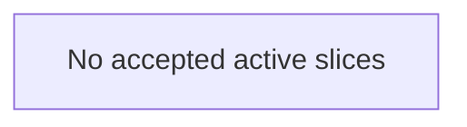

# Product Evolution Plan

**Created:** 2026-06-15
**Last updated:** 2026-08-26
**Status:** active-plan
**Current stage:** no executable slice; P44 remains deferred.

> **Ownership:** accepted future work, dependency-safe execution order, and
> the next executable slice. [`queue.yaml`](queue.yaml) is the machine-readable
> queue owner; this page is its checked human projection plus intake and
> closeout rules. Current facts belong in [`STATUS.md`](STATUS.md), reproduced
> gaps in [`REMAINING.md`](REMAINING.md), detailed contracts in
> [`plans/`](plans/README.md), and completed delivery in
> [`history/`](history/README.md).

## Current Decision

P49 completed the approved budget-optional Goal repair, closed G21 and G47,
and removed the superseded deferred P45 numeric-default proposal. Saved-root
Goal is now default-enabled without an inferred token cap, while durable
provider-attempt identity remains exact across restart.

P47.1-P47.3 closed G38-G40 by freezing pending send/continue/cancel identity,
scoping terminal settlement to exact target WorkItems, and binding switch
declaration plus activation to one exact execution-generation target. P47.4
then made Ctrl+T a textually distinguished mixed WorkItem/execution list with
stable exact selection, and P47.5 added composable filter/search, explicit
focus, resolved hints, and mouse containment without changing runtime truth.
P47.6 added defensive cached WorkItem/execution `overview` and `activity` tabs.
P47.7 completed the program with lazy exact transcript/output/lineage tabs,
generation-bound async correlation, bounded terminal output, and fail-closed
historical detail. P47 is complete and G38-G41 are closed.

P50 completed three approved permission-runtime repairs. P50.1 now fences the
ProjectGraph post-check/pre-rebuild policy-revision window and closes G48.
P50.2 now limits reviewer latency to retained attempt-terminal pairs and closes
G49 without changing permission authority. P50.3 now isolates reviewer-audit
storage behind a bounded non-blocking single-writer dispatcher and closes G50.
Reviewer enforcement remains deferred under P44. P51.1 now enforces the
accepted P42.1 process-class binding contract: model-issued Guest Bash uses a
real Darwin Seatbelt `workspace-write` adapter, while shell hooks and configured
stdio MCP remain explicitly ambient. Unsupported or failed Guest enforcement
is unavailable and fails before spawn rather than retrying ambient. P51.2 Core
now binds ordinary Auto Bash admission to the exact complete Guest proof,
requires a fresh live `AllowOnce` for narrow critical literal `rm`/`rmdir`,
persists the constraint through ProjectGraph and supported Core clients, and
revalidates the exact identity before dispatch and ShellManager submission.
AppServer, Desktop, and Web UI projection remains outside that delivery. P51.3
now completes the next narrow G28 subset: prompt-approved Linux Guest Bash uses
a fixed bubblewrap adapter with a restricted filesystem view, isolated
user/PID/IPC/network namespaces, dropped capabilities, a socket-denial seccomp
filter, root revalidation, and the existing descendant, wall-time, and output
owners. It deliberately does not let Default or Auto consume Linux proof.

P48 records five approved ACP boundary repairs for Session-root deletion, Plan
tool identity, replay output type, Windows MCP environment identity, and unsafe
private Session migration. P48.1 now correlates successful process-local
Session-root observations with inactive deletion and closed G42. P48.2 now
preserves one Plan tool identity across ACP permission rounds and closed G43.
P48.3 now preserves exact string-valued tool `rawOutput` across live and replay
paths and closed G44. P48.4 now shares one OS-aware MCP environment identity
across ACP admission, setup fingerprints, and process launch and closed G45.
P48.5 removed the unsafe private migration dispatcher surface, preserved the
public Session and sanitized export owners, and closed G46. P48 is complete.

G14 remains reproduced under P44 `defer`. The historical P24.6 evidence still
explains why no numeric Goal default was justified, while P49 closed the user
problem through optional-budget semantics instead. G2 has no accepted
successor. G28 remains open after P51.3 because environment credentials, shell
hooks, configured stdio MCP, hard memory/file-descriptor/process-count limits,
and absent Linux control-plane path creation fencing remain outside the
enforced subset. G48-G50 are closed. No G28 successor is admitted.

## Execution Topology

Three relationships are intentionally separate:

1. **Hard dependency** means one active slice must finish before another can
   execute. These edges must form a directed acyclic graph.
2. **Promotion gate** is evidence required before a slice can become `Ready`.
   A pending gate is not a dependency on whichever slice is currently ready.
3. **Priority** orders independently promotable work by current risk. It is not
   an implementation or causal edge.

<!-- migration-queue:begin -->
> Generated from [`queue.yaml`](queue.yaml). Run `go run ./scripts/migration_queue render` after changing queue data; `make docs-check` rejects drift.

**Snapshot:** 2026-08-26; 0 `Ready`, 0 `Queued`, 0 `Blocked`, 1 deferred decisions.



There is no accepted incomplete slice. Open gaps remain in `REMAINING.md` until intake accepts a successor; they do not become queue rows automatically.

### Deferred decisions

Deferred entries are reproduced gaps without an executable queue row.

| Decision | Gap | Re-entry gate | Reason |
|---|---|---|---|
| P44 | [G14](REMAINING.md#verified-current-implementation-gaps) | [evidence gate](verification/p22-enforcement-promotion-readiness.md) | Reviewer enforcement has no representative non-zero promotion evidence. |
<!-- migration-queue:end -->

## How Queue State Changes

- `Ready`: every hard dependency and promotion gate is satisfied; the row is
  executable under its detailed contract.
- `Queued`: the outcome is accepted, but promotion evidence or root selection
  is incomplete.
- `Blocked`: an accepted row cannot progress because of a named external
  condition. A blocked row must identify that condition.
- `defer`: a reproduced gap has an explicit no-successor decision and re-entry
  gate. Deferred decisions have no priority or active queue row.
- No row: a gap is reproduced but no implementation outcome has been accepted,
  or a prior characterization/identity slice completed without closing it.

Zero active slices is a valid terminal state. Change
[`queue.yaml`](queue.yaml), then run:

```bash
go run ./scripts/migration_queue render
make docs-check
```

The checker rejects duplicate IDs and priorities, unknown dependencies,
cycles, non-topological priority order, stale generated Markdown, invalid
states, missing contract files, and more than one `Ready` slice.

## Selection Policy

1. Continue the current `Ready` slice until it reaches a deterministic terminal
   outcome; do not silently switch because another item looks easier.
2. Promote a queued slice only from current source/tests and the named evidence
   gate. Reference similarity or a P-number is not promotion evidence.
3. If several slices are independently promotable, rank safety and privacy,
   recovery and durability, user value, regression surface, and rollback cost
   before implementation convenience.
4. Keep one observable contract and one rollback boundary per implementation
   PR. Freeze/promote documentation normally ships with that implementation;
   use a separate decision PR only when another consumer needs the frozen
   contract first.
5. Reproduce a new gap in `REMAINING.md` before intake. Do not add speculative
   options directly to the queue.

## Eino Replacement Gate

An Eino, Eino ADK, or reference primitive enters the queue only when it removes
a named duplicate owner or closes a reproduced observable gap while preserving
required ordering, permission, cancellation, persistence, recovery, provider,
and entrypoint behavior. Framework availability alone is not a product gap.

Every accepted reference-derived decision uses `preserve`, `adapt`, `combine`,
`project-native`, `reject`, or `defer` and records compatibility consequences.
The detailed contract owns that evidence; this queue owns only execution state.

## Slice Workflow

For the selected row:

1. read its detailed contract, current architecture owner, gap evidence, and
   focused tests;
2. freeze the user-visible outcome, non-goals, invariants, entrypoints,
   migration impact, and rollback boundary;
3. implement the smallest coherent behavior change with focused negative and
   compatibility evidence;
4. run the risk pack selected by
   [`testing-strategy.md`](../contributing/testing-strategy.md), then the final
   repository gates;
5. update only fact owners whose state changed; and
6. remove the completed row from `queue.yaml`, add one history record, and
   explicitly promote the next row or leave the queue empty.

## Atomicity and Rollback Rules

- Source, tests, generated queue data, and tracker updates for one observable
  slice ship together.
- Persisted-format changes require versioning, restart compatibility, failed
  write behavior, and rollback or forward-recovery evidence.
- Permission, cancellation, process, Session, transcript, and recovery ordering
  cannot be split across PRs when the intermediate state would be unsafe.
- A failed promotion or implementation retains the gap and records the exact
  blocker; it does not rewrite `Queued` as `Complete`.

Completed implementation narratives remain available through
[`history/`](history/README.md), retained detailed contracts, and Git history;
they no longer occupy the active execution owner.
