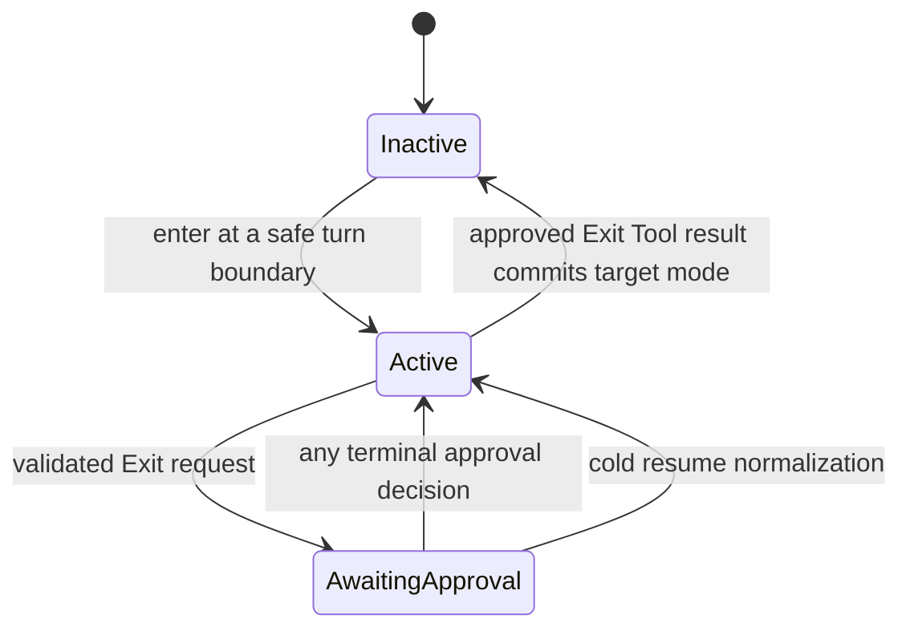

# P17 Plan Mode Runtime Contract

**Status:** historical
**Completed:** 2026-07-18

> **Ownership:** completed contracts, dependencies, acceptance gates, and
> rollback boundaries for the P17 Plan Mode admission, state, approval,
> persistence, and cross-entrypoint program

Root [`migration/PLAN.md`](../../PLAN.md) owns execution order and slice state.
Current tool and session behavior belongs in
[`architecture/capabilities/tool-registry.md`](../../../architecture/capabilities/tool-registry.md),
[`architecture/runtime/model-and-tool-execution.md`](../../../architecture/runtime/model-and-tool-execution.md),
and [`architecture/tui/contracts/sessions.md`](../../../architecture/tui/contracts/sessions.md).
Comparative evidence is frozen in
[`migration/reference/runtime/plan-mode-lifecycle-audit.md`](../../reference/runtime/plan-mode-lifecycle-audit.md).

## Decision

P17 is a `combine` decision inside the Plan Mode subsystem. It combines:

- Codex's session/thread-owned mode and replay boundary;
- Grok Build's explicit phase machine and cold-resume normalization;
- OpenCode's permission-backed plan-file exception; and
- Claude Code Ripe's explicit exit approval, feedback, and prior-mode context.

Eino-Agent keeps a project-owned `QueryEngine` state and existing
`PermissionCoordinator`. It does not copy Codex thread handoff, Grok's actor,
OpenCode's agent architecture, or Claude's plan-mode model-visible openness.
`combine` here does not combine Plan Mode with P18 worktrees. The programs have
separate owners, states, persistence, events, and rollback boundaries.

## User Outcome

When a session enters Plan Mode, the model sees and can execute only the
capabilities needed to inspect the repository, clarify requirements, maintain
the exact session plan file, and request approval. Reject, cancellation, cold
resume, or another entrypoint cannot silently turn planning into
implementation. Approval names the permission mode that implementation will
use.

## Verified Outcome

Verified current behavior:

- one `QueryEngine`-owned `PlanState` serializes tool and external transitions;
- active turns receive a Plan snapshot from that state, and successful
  Enter/Exit execution updates both the active context and future turns only
  after the canonical tool result is accepted;
- typed transition events carry session, thread, turn, request, phase, source,
  and revision identity through the runtime reducer; replay reconstructs the
  Plan projection without dispatch;
- external TUI, command, and ACP changes use the same transition path and fail
  without mutation while a turn owns the boundary;
- an additive versioned checkpoint restores phase, exact plan-file identity,
  return-mode context, approval request reference, and revision without
  persisting callback or grant authority;
- cold AwaitingApproval normalizes to Active with a new revision and explicit
  warning, while a same-process request survives only when the reducer and
  original coordinator callback both match the exact identity and the final
  restored project keeps that coordinator;
- one central Plan policy filters the model-visible pool and defends runtime
  execution before hooks, permissions, and side effects;
- Active mode exposes explicit exploration/clarification tools, exact-plan-file
  Write/Edit, and Exit while failing closed on Bash, Agent/background, ordinary
  mutators, unknown dynamic tools, and Enter;
- the exact absolute session/Agent plan file is the only Active filesystem
  mutation target; prefix, traversal, relative, cross-identity, target-symlink,
  and parent-symlink aliases fail closed;
- Exit is rejected outside Active before ordinary permission presentation;
- semantic `allowedPrompts` are displayed only as non-authoritative requested
  implementation capabilities;
- the TUI routes Exit through the canonical permission interaction;
- the session plan file is scoped by session and optional Agent identity, and
  the same exact capability reaches Write/Edit, Enter/Exit, compaction,
  Legacy, and the fixture Graph; and
- ACP Resume and Load call the same engine restore path used by CLI/plain/TUI
  entrypoints and project the restored phase without dispatch.

P17 has no remaining accepted slice. P13.5c3 now consumes this completed
contract while closing the fixture Graph inner kernel; production selection
remains Legacy until P13.6.

## Scope And Non-Goals

P17 owns Plan Mode admission, phase transitions, approval, persistence, replay,
and entrypoint consistency.

P17 does not:

- create or enter a Git worktree;
- change Agent worktree isolation;
- treat `TodoWrite` or a checklist update as a mode transition;
- persist callback channels or replay a historical approval decision;
- automatically turn semantic natural-language prompts into permission rules;
- introduce a general sandbox or shell command classifier; or
- change the project Graph production selector before its named P13 gate.

## Frozen State Contract



`QueryEngine` owns the state:

```text
PlanState {
  Phase: Inactive | Active | AwaitingApproval
  PlanFileIdentity
  ReturnMode
  ApprovalRequestID
  Revision
}
```

`ReturnMode` is context, not authority. Bypass, auto, or accept-edits behavior
is never restored merely because it preceded Plan Mode. Exit approval must name
the target mode explicitly.

## Frozen Program Invariants

1. One `QueryEngine` owns one Plan state. Tool contexts, session metadata,
   runtime events, ACP, and TUI are snapshots or projections.
2. The complete registry remains dispatch inventory. A separate
   mode-aware projection defines model visibility at the existing safe refresh
   boundary.
3. Model-visible admission and execution defense use one central Plan tool
   policy. Unknown, dynamic, and MCP side effects fail closed.
4. The only filesystem mutation allowed while Active is Write/Edit of the
   exact current `PlanFileIdentity`. Directory-prefix, sibling-session,
   traversal, and symlink aliases are rejected.
5. Enter is available only while Inactive. Exit is available only while
   Active. AwaitingApproval admits no second Exit request.
6. Reject and cancellation return to Active with feedback; neither changes the
   implementation permission mode.
7. A cold resume never revives a callback or treats a stored approval as a
   grant. Persisted AwaitingApproval normalizes to Active and requires a new
   explicit Exit request.
8. TUI, plain, headless/SDK, ACP, leader, and child execution use the same
   engine transition API. Unsupported presentation fails before mutation.
9. Semantic `allowedPrompts` remain non-authoritative. P17 removes false grant
   language; typed permission-grant design requires a separate accepted
   contract.
10. P17 and P18 share no state machine, event family, persistence record, or
    lifecycle owner.

## Dependency Graph


Each node is one independently reviewable PR. P17.H0 completed the production
safety preemption. P13.5c2 then exposed the shared canonical tool-round
boundary, and P17.0 made both Legacy and the fixture Graph consume one engine
transition contract. P13.5c3 waits for P17.2 so the completed fixture kernel
freezes structured approval and cold-resume behavior rather than an
intermediate state.

## P17.H0 Fail-Closed Admission And Plan-File Scope

**Completed:** 2026-07-18

### Contract

- add one central Plan tool-policy decision used by both model-visible assembly
  and `executeToolCall`;
- keep read-only exploration and clarification capabilities visible; hide Bash,
  Agent/background, ordinary mutators, and unknown-effect tools by default;
- expose Enter only while Inactive and Exit only while Active;
- project Write/Edit in Active mode with the exact plan-file restriction and
  retain runtime enforcement as defense in depth;
- canonicalize against the exact session/Agent plan path and reject traversal,
  prefix siblings, alternate-session files, and symlinks;
- reject Exit outside Active before ordinary permission presentation; and
- remove output that claims semantic `allowedPrompts` became grants.

### Acceptance Gate

- default and Active model-visible snapshots are deterministic across leader,
  child, plain, headless, and ACP engine construction;
- every hidden tool is also rejected if an old transcript or malicious caller
  submits it directly;
- exact plan Write/Edit succeeds, while `plans-evil`, `..`, relative aliases,
  another session file, target symlink, and symlinked parent fail;
- denied Exit creates no permission request and no mode transition;
- registry completeness and non-Plan tool selection behavior remain unchanged;
- focused tool-pool, plan-guard, permission, ACP, and race tests pass.

### Rollback

Revert the Plan-specific projection and exact guard together. Do not keep a
mode-aware model projection backed by the old prefix execution rule, or the
reverse. Rolling back reopens the accepted safety gap and therefore blocks
P13.5c2 promotion.

## P17.0 Engine-Owned Plan State

**Completed:** 2026-07-18

### Contract

- introduce a `QueryEngine`-owned `PlanState` and serialized transition method;
- derive query-local Plan snapshots from that state instead of treating
  `ToolUseContext.PlanMode` as authority;
- apply a successful tool transition only after the canonical tool result
  commits;
- publish one structured state transition through the existing reducer-before-
  publication boundary with session, thread, turn, request, phase, and revision
  identity;
- refresh model-visible tools only after the transition commits at the existing
  safe round boundary; and
- make external mode changes either enter the same transition path or fail at
  an unsafe in-flight boundary.

### Acceptance Gate

- Enter, repeated Enter, Exit, failed execution, cancellation, and concurrent
  external mode changes have one deterministic winner;
- active and future turns observe the same phase and permission mode;
- a failed or denied tool produces no state event or tool-surface refresh;
- reducer replay reconstructs phase projection without dispatch;
- canonical Legacy and fixture tool-round tests remain exact aside from the
  intentionally added typed transition evidence.

### Completion Evidence

- repeated Enter calls prove one serialized winner, one execution, and one
  transition after the matching Tool result;
- a real next-round model binding replaces Enter with Exit only after commit;
- failed, denied, cooperative cancellation, non-cooperative success after an
  observed cancellation, and losing external transitions leave phase,
  revision, mode, and event sequence unchanged;
- the fixture Graph canonical tool round consumes the same engine transition
  and reducer path as Legacy;
- replay rebuilds the Plan projection without dispatch, and resume rebuilds an
  Active snapshot plus exact resumed plan identity from the existing persisted
  mode; and
- focused/race, canonical trace, repository Makefile, lint-new, manifest,
  documentation, diff, and independent runtime-depth review gates pass.

### Rollback

The state type and transition event are additive until P17.1. Rollback restores
the prior direct permission-mode path and removes the new event/reducer fields
as one unit; no durable Plan-state schema exists yet.

## P17.1 Structured Exit Approval

**Completed:** 2026-07-18

### Contract

- replace the presentation-only allow response with a structured decision:
  approve/reject, target permission mode, feedback, request identity, and Plan
  revision;
- require explicit confirmation for bypass or auto-accept behavior;
- reject stale decisions whose request or Plan revision no longer matches;
- keep the canonical `PermissionCoordinator` responsible for live settlement
  and exactly-once terminal claims;
- return reject/cancel feedback to the model while retaining Active phase; and
- treat semantic `allowedPrompts` as deprecated display metadata only, without
  permission effect or “granted” wording.

### Acceptance Gate

- the TUI's manual, accept-edits, and bypass choices produce distinct engine
  target modes;
- reject, feedback, escape, timeout, engine Close, and owner-thread switch
  settle once and keep the session Active;
- duplicate, stale-revision, wrong-owner, and post-terminal responses are inert;
- plain/headless without an interaction provider fail closed and remain Active;
- approval changes mode only after the matching terminal decision commits.

### Completion Evidence

- `PlanApprovalRequest` carries the coordinator request ID, Plan revision,
  exact plan-file identity, and return-mode context; adapters return a separate
  typed decision rather than modifying model-owned tool input;
- Active transitions to AwaitingApproval before presentation, every terminal
  claim transitions back to Active and clears the request, and only the
  successful canonical Exit Tool result later commits Inactive plus the
  selected `default`, `acceptEdits`, or `bypassPermissions` mode;
- Exit bypasses generic rule, hook, yolo, persisted-grant, and positive
  coalescing paths. Permission-expanding targets require an explicit confirmed
  choice, while a generic allow or missing structured provider fails closed;
- TUI, plain, and ACP expose distinct manual, accept-edits, bypass, and reject
  options. The TUI renders the engine-provided exact plan identity and rejects
  an active Plan request when its owner thread is left;
- rejection, feedback, escape, timeout, context cancellation, engine Close,
  wrong owner, duplicate response, and cancellation racing a noncooperative
  tool leave Plan Active and execute no Exit side effect;
- the Legacy loop and fixture Graph use the same coordinator, scheduler,
  canonical tool execution, result-before-transition ordering, typed runtime
  events, and target-mode commit; and
- focused engine, execution, tools, TUI, plain, ACP, Graph, and race suites plus
  repository Makefile, lint-new, documentation, diff, and independent
  runtime/TUI review gates pass.

### Rollback

Remove the structured Plan decision and its presentation mapping together.
Existing generic permission decisions remain readable; no semantic prompt is
converted into a durable permission rule.

### Adoption Decision And Subsequent Slice

This slice is `combine`: Eino Compose continues to own generic fixture Graph
scheduling, while the project owns Plan identity, approval semantics,
cancellation settlement, entrypoint mapping, and canonical Tool-result commit.
Production remains Legacy. No Eino source, fork, dependency, Graph selector,
or durable Session schema changed in P17.1. P17.2 subsequently closed cold
normalization, durable replay, and restart convergence.

## P17.2 Persistence, Replay, And Entrypoint Convergence

**Completed:** 2026-07-18

### Contract

- persist a versioned Plan state containing phase, exact plan-file identity,
  return-mode context, request reference, and revision, but never callback
  channels or an approval grant;
- restore Active directly and normalize AwaitingApproval to Active on a cold
  process, with an explicit recovery warning;
- preserve a still-live same-process callback only through the existing
  actionable-request identity check and an unchanged project coordinator;
- rebuild the Plan reminder and mode-aware model-visible projection after
  resume and compaction without dispatch;
- route ACP mode changes through the engine transition contract and reject
  unsafe in-flight mutation;
- expose phase and approval outcome consistently through TUI, plain,
  headless/SDK, and ACP projections; and
- add canonical Plan traces before P13.5c3 closes the fixture kernel.

### Acceptance Gate

- cold resume from Active remains Active; cold resume from AwaitingApproval
  becomes Active and cannot reuse the old approval;
- same-process, same-project owner reconnect may reproject the one live request
  without creating a duplicate callback; a project change cancels it and
  cold-normalizes the persisted state;
- resume, reducer replay, session inspection, and TUI switching dispatch no
  model or tool;
- compaction preserves the current Plan reminder and exact file identity;
- all supported entrypoints agree on phase, visible tools, approval outcome,
  cancellation, and terminal mode;
- focused replay, session, runtime reducer, TUI, ACP, PTY, and race tests pass.

### Completion Evidence

- `SessionMetadataFull.plan_state` is additive and independently versioned.
  Checkpoints sample Plan phase and permission mode under the established
  `planMu -> mu` lock order; callback channels, decisions, and grants are
  excluded.
- Resume validates version, phase, revision, return mode, and a non-symlink
  exact Plan identity. Active restores directly. Cold AwaitingApproval clears
  the request, increments revision, returns to Active, and records a warning.
  Unsupported or corrupt records preserve Plan containment when the legacy
  permission mode was Plan.
- Persisted request IDs first intersect the reducer and then the original
  process-local coordinator owner for the final restored project.
  AwaitingApproval survives only when project coordinator, request, session,
  thread, revision, plan file, and return mode all match; a project change
  cancels the old callback, cold-normalizes the record, and creates no duplicate.
- Resume installs a bounded runtime Plan snapshot without a synthetic event,
  model call, or tool call. TUI reconciliation retains the typed approval
  identity only for the still-live request.
- The exact restored plan path is carried through canonical tool execution.
  Write/Edit admission, Enter/Exit tool output, compaction reinjection, Legacy,
  and the fixture Graph therefore consume one capability even when `HOME`
  changes.
- ACP Resume and Load now restore transcript, execution context, Plan state,
  and warnings through `QueryEngine.ResumeSession`; mode mutation continues to
  use the serialized engine transition and rejects an active-turn race.
- Focused cold/live replay, corrupt-version, Graph, compaction, tool-context,
  TUI, ACP, and race suites plus repository gates pass.

### Rollback

The durable record is versioned and additive. Older binaries ignore it and
continue reading permission mode. Rollback never interprets a persisted
approval reference as authority; unsupported versions restore the safest
supported Plan phase with a warning.

### Adoption Decision And Next Gate

This slice is `combine`: public Eino Compose continues to supply fixture Graph
mechanics, while the project owns Plan persistence, approval authority,
recovery, exact file capability, and entrypoint projection. Production remains
Legacy. No Eino source, fork, dependency, or production Graph selector changed.
P13.5c3 is now unblocked.

## Verification

Each slice runs focused tests for its boundary. Final P17 closeout additionally
runs:

```text
go test -race ./engine ./tools ./internal/tui ./server/acp -run Plan
make fmt
make lint
make test
make build
go run ./scripts/migration_manifest.go check
make docs-check
git diff --check
```

## Source Owners

| Boundary | Source |
|---|---|
| model-visible projection | [`QueryEngine.modelVisibleTools`](../../../../engine/engine.go#L1377) |
| central Plan capability decision | [`evaluatePlanToolPolicy`](../../../../engine/plan_tool_policy.go#L47) |
| canonical tool admission and transition | [`executeToolCall`](../../../../engine/tool_execution.go#L30) |
| exact plan-file guard | [`isExactPlanFileMutation`](../../../../engine/plan_tool_policy.go#L171) |
| Enter/Exit tools and plan store helpers | [`tools/plan_mode.go`](../../../../tools/plan_mode.go#L64) |
| versioned Plan checkpoint | [`persistSessionCheckpointMessages`](../../../../engine/session_checkpoint.go#L26) |
| Plan validation and cold normalization | [`restorePersistedPlanState`](../../../../engine/plan_persistence.go#L15) |
| session identity/mode restore | [`QueryEngine.resumeSessionWithOptionsForTurn`](../../../../engine/engine.go#L4103) |
| exact tool Plan capability | [`WithPlanFileIdentity`](../../../../tools/plan_mode.go#L51) |
| ACP external mode change | [`Agent.SetSessionMode`](../../../../server/acp/agent.go#L900) |
| TUI approval projection | [`NewPlanDialog`](../../../../internal/tui/plan_dialog.go#L111) |
| runtime event/reducer truth | [`RuntimeStateStore.Apply`](../../../../engine/runtime_state.go) |
