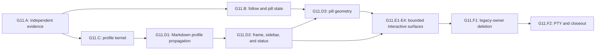

# G11 TUI Frame Integrity

**Status:** historical
**Last verified:** 2026-07-26

> **Ownership:** accepted G11 user outcome, contract boundaries, dependency
> order, promotion gates, and whole-program closeout criteria

## Outcome

G11 makes one selected display-cell contract authoritative from semantic
content through final terminal composition and mouse geometry, while keeping
the Jump-to-bottom action visible whenever the chat is outside follow mode.
That contract guarantees one deterministic project grid. Matching a particular
terminal/font grid additionally requires separately collected diagnostic
evidence. G11.A accepted no font-specific production profile, and internal
agreement alone is not claimed as universal font calibration.

The user-visible failures are:

- rich table content was reported as literal Markdown on a stale pre-G9 run;
- presentation-sensitive glyphs can shift table borders and the wide sidebar
  separator; and
- `ScrollToTop` and equivalent state restoration can hide the jump pill.

Current `master` already owns partial bold/code table semantics. G11 protects
that behavior and fixes the remaining whole-frame and follow-state gaps. It
does not reopen G9's completed parser/streaming migration.

## Contract Map

G11 has one product outcome but two presentation-state owners. They remain
separate detailed contracts so one implementation slice never moves follow
truth into terminal geometry or vice versa.

| Contract | State owner | Slices | Detailed design |
|---|---|---|---|
| independent evidence and promotion | no production state | G11.A | this index |
| scroll follow and pill | `ChatView` | G11.B | [`scroll-follow-pill.md`](scroll-follow-pill.md) |
| display-cell geometry | App-selected immutable profile | G11.C-G11.F2 | [`display-cell-geometry.md`](display-cell-geometry.md) |

The source comparison and `combine` decision are owned by the
[`global geometry audit`](../../reference/tui/global-display-cell-follow-geometry-audit.md).
[`migration/PLAN.md`](../../PLAN.md) is the only owner of which slice is
currently `Ready`.

## Scope

Supported production scope:

- TUI finalized and streaming assistant Markdown;
- main, sidebar, status, activity, hint, editor, and overlay frame composition;
- sub-Agent/task wide-sidebar presentation;
- chat scroll, search/item jump, thread/Agent view restoration, and mouse hit
  testing; and
- supported themes, no-color, reduced-motion, compact/standard/wide layouts,
  resize, and Unix PTY execution.

G11 may change wrapping, padding, truncation, emoji presentation measurement,
pill text placement, and the exact number displayed for unseen messages where
the current state is inconsistent.

## Non-Goals

- Replacing Goldmark, Glamour, Bubble Tea, Lip Gloss, or Bubbles.
- Rewriting editor grapheme deletion or cursor semantics.
- Measuring font pixels or probing a terminal by drawing hidden calibration
  text.
- Guessing a profile from rendered frames or silently mutating user/model text
  to force one terminal's presentation.
- Mutating canonical Markdown, transcript, or user/model content.
- Moving presentation-only follow state into engine reducers or durable replay.
- Replacing every text helper before the final-frame and interaction owners are
  correct.
- Changing Agent/task runtime state, permissions, Graph topology, providers,
  or Eino/Eino-ext dependencies.

## Adoption

G11 uses `combine`:

- `preserve` current Goldmark semantic table runs and responsive rectangle
  allocation;
- `adapt` Claude Code Ripe's scroll-position-owned pill visibility and parsed
  rich table cells;
- `adapt` Codex's rich table spans;
- `adapt` Crush's shared measurement/drawing/cache width-method identity;
- `project-native` for the App-selected `DisplayCellProfile` and its Go API;
  and
- `reject` raw Markdown reparsing, post-hoc border repair, width-owner
  proliferation, and framework-level replacement.

## Frozen Program Invariants

1. Canonical Markdown and transcript bytes never change for presentation.
2. Goldmark remains the only table grammar and inline-semantic owner.
3. One immutable profile identity governs every migrated width, wrap,
   truncate, pad, border, cache, and hitbox operation.
4. The selected profile guarantees one project-owned cell grid. A claim about
   a particular terminal/font's physical grid requires separately named
   diagnostic evidence; no production font-specific variant is accepted, and
   PTY byte transport alone is insufficient.
5. Profile or terminal-width changes invalidate geometry-dependent caches
   before an exact-cache hit.
6. Extended grapheme clusters are formed from visible semantic text before
   ANSI/OSC emission. Styling cannot insert controls inside a cluster, and
   every physical line closes control state.
7. Every completed table preserves partial bold/code semantics and excludes
   literal markers from its visible projection.
8. `follow=false` and nonempty chat always exposes one jump action. Unseen
   baseline controls only the count/label.
9. Pill rendering and hit testing consume one presentation model and one width
   profile.
10. Final frames remain valid UTF-8, within the selected terminal rectangles,
    and keep the sidebar separator at one selected-profile X column.
11. Overlay and full-screen ownership continue to preempt background hitboxes.
12. Compact omission cannot remove the only route back to live follow.
13. No engine event, persistent schema, permission, or replay behavior changes.

## Dependency Graph

G11.A closed its test-only evidence gate after P20.R3 closed G10. G11.B and
G11.C are independent consumers of that evidence. G11.B then closed the direct
supported-entrypoint recovery failure without changing geometry ownership.
G11.C then closed the reusable profile kernel without migrating final geometry.
G11.D1 then projected that profile through every production Markdown/history
owner and bound exact environment identity to their geometry caches without
changing non-Markdown composition. G11.D2 then migrated non-pill final
composition and exact frame bounds to the same profile. G11.D3 then made the
semantic jump pill publish one cached profile-owned render/hitbox geometry.
G11.E1 then migrated the six production modal components to one profile-owned
geometry boundary. G11.E2 then migrated the Agent wizard, background/detail,
Team monitor/peek, and full-screen Task Panel without changing their semantic
owners. G11.E3 then migrated tool/diff/error/expanded/raw/welcome/notification
content projections while preserving semantic render and lifecycle owners.
G11.E4 then migrated pickers, hints, search bars, residual interaction rows,
and cell-to-source selection without changing semantic owners. G11.F1 then
deleted the compatibility geometry owners and installed the universal
classified source gate. G11.F2 then closed the PTY, performance, terminal
claim, and document-ownership boundary; G11 has left the live queue.

## G11.D1-F2 Completed Result

G11.C delivered the reusable kernel and construction seam for every later
geometry slice. G11.D1 then made one App-owned immutable
`RenderEnvironment` the production Markdown projection boundary:

1. styles/theme generation, selected profile, and an independent geometry
   generation travel as one value without aliasing theme and resize identity;
2. active, inactive, restored, future, and durable-reset thread views, history
   rendering, finalized/compatibility-streaming assistant Markdown, and the
   Plan dialog receive that same value;
3. renderer, stable-prefix, full-output, frozen-item, and viewport caches
   require exact environment identity and width before reuse; and
4. only a real terminal-size change advances geometry generation, while a
   theme change advances theme generation.

The selected profile now owns production Markdown/table sizing, wrapping,
padding, borders, and narrow fallback. Compatibility default/profile-only
constructors remain isolated seams, not production selection owners. Canonical
Markdown, runtime events, durable state, permissions, replay, rectangle
allocation, and non-Markdown final composition did not change in G11.D1.

G11.D2 then made the same profile authoritative for generic/Assistant chat
clipping, sticky prompts, band and column fitting, wide-sidebar truncation,
status-hook alignment, and complete final-frame clipping. Owning rectangle X
coordinates now govern tab expansion, final physical rows close SGR/OSC state,
the first pre-clip overflow is available to development/tests with full profile
policy, and the table/sidebar characterization now asserts exact separator X.
It changed no rectangle allocation, canonical text, runtime state, durable
state, permission, or replay owner.

G11.D3 now converts the existing semantic pill model, chat rectangle, and
exact render environment into one cached styled run, final row, inclusive
start/exclusive end cells, and action. Centering expands tabs from the selected
start cell. `ChatView.Render` places the published run, and
`App.pillClickHits` invokes the same result's hit test after overlay/sidebar/
expanded routing. It changes no follow, runtime, durable, permission, or replay
owner.

G11.E1 now projects the exact App render environment into Plan, permission,
MCP approval/settings, resume, and question dialogs. One modal geometry helper
owns profile-cell truncation, tab origin, control balancing, full-width/bottom
placement, and centering of the final outer box including border/padding.
Plan publishes review, action, and feedback hit rectangles from the same
profile-projected rows that reach the frame; other dialogs remain
keyboard-only. Existing vertical clipping, dialog-width clamps, selection,
focus, settlement, and stack routing remain unchanged.

G11.E2 now projects that same environment into the Agent create/edit wizard,
Ctrl+B background/detail, and `/team` monitor/peek. Each centered component
publishes one transient profile-owned outer rectangle from the exact overlay
returned to App. Ctrl+T retains the existing full-screen `layout.overlayRect`
and applies a top-origin profile projection without adding another geometry
owner. Panel-specific Agent detail/transcript wrapping migrated; generic
transcript/tool history remains unchanged. Existing selection, task ordering,
scroll windows, Bubbles editing, Agent controls, read-only Team behavior,
thread switching, keyboard-only routing, and runtime/durable state remain
unchanged.

G11.E3 now projects tool history, structured diff, inline ErrorMessage,
expanded/raw conversation rows, welcome, and notifications through the exact
App-selected profile. Production history adapters retain the complete
environment; welcome rendering and mascot hit bounds share one projected
result; notification rendering preserves a single active-item prune and its
lifecycle semantics. Canonical content, semantic rich/expanded/raw/transcript
dispatch, parsers, raw stripping, caches, selection, search, keyboard routing,
runtime, durable state, permission, and replay remain unchanged.

G11.E4 now projects completion, queued/history, and mention hints; chat and
expanded search bars; CommandPalette, ModelPicker, AgentThreadPicker, and Help
overlays; bypass confirmation; rewrite selection rows; active-thread labels;
and chat/expanded cell-to-source selection through the same exact environment.
The already-migrated Resume picker and nonexistent standalone Theme picker are
explicit no-op inventory results. Candidate/filter/sort/selection/scroll/
keyboard behavior, Bubbles editor ownership, runtime, durable state,
permission, and replay remain unchanged.

G11.F1 deleted the zero-caller owners together with the short-lived table-only
profile aliases and test adapters. Compatibility streaming, legacy
user/thinking history, Agent transcript, Markdown margin/wrap, the
window-too-small view, and the disconnected permission prompt now select
`DisplayCellProfile` operations instead of direct width methods. One
type-aware Go AST gate scans every TUI Go file selected by the supported
Linux amd64, Darwin amd64/arm64, and Windows amd64 production builds and
rejects unclassified Lip Gloss, `x/ansi`, Glamour ANSI, Uniseg, and rune-count
geometry selectors, including method values and chained receivers. Fixed-width
Lip Gloss composition is centralized behind one profile-projected adapter;
the remaining semantic/editor/library selections carry exact owners and
removal conditions. G11.F2 is now complete.

## G11.A — Independent Evidence And Current-Semantics Lock

**Status:** complete; removed from the live queue

**Type:** test and documentation only; no production behavior

### Problem

Existing focused tests prove semantic runs and individual table geometry but
do not reproduce the exact reported mixed-cell content through complete
streaming lifecycle, nor do they independently expose the whole-frame width
owner split and the `ScrollToTop` pill dead zone.

### Allowed scope

- new focused tests under `internal/tui/`;
- G11 plan/reference/verification synchronization; and
- no production `.go` modification.

### Required fixtures

1. Exact table rows with `` `eino-agent` `` and `**Codebase**`.
2. A mixed cell containing plain, bold, inline-code, and plain suffix runs.
3. Streaming-incomplete, stable-prefix promotion, Finalize, and resize.
4. Width-owner cases including `🖥`, `⚙`, `🏷`, `✦`, CJK, Indic, VS15/VS16,
   bare and repeated warning symbols, ZWJ, flags, combining sequences, ANSI,
   and OSC 8.
5. A wide App frame containing a semantic table and live sidebar rows.
6. `ScrollUp`, `ScrollToTop`, item/search jump, and restored view-state
   transitions with zero and nonzero unseen counts.
7. Extended grapheme clusters whose code points cross emphasis, code, link, or
   adjacent semantic-run boundaries.
8. Projection collapse, truncation, reset, empty/non-scrollable content, and
   durable restored-away state.

### Acceptance

- current semantic tables retain structured partial runs through promotion and
  Finalize, with no visible Markdown markers;
- an independent oracle reports the exact current method/profile divergence
  and affected frame rows from explicit expected cluster/cell fixtures, without
  using production width helpers, Lip Gloss, or `x/ansi` as truth;
- a characterization proves the reachable
  `follow=false, scrollAwayCount=0` pill dead zone;
- a characterization proves whether controls inserted between semantic runs
  can split a visible extended grapheme cluster;
- diagnostics name the source cluster, selected method/profile, expected and
  actual cell columns, layout mode, width, and row;
- evidence distinguishes deterministic profile geometry from real
  terminal/font behavior; PTY output is not accepted as a font-width oracle;
- the tests encode current mismatch as characterization, not as the desired
  permanent contract; G11.B-G11.D3 explicitly replace those assertions; and
- focused tests plus documentation, manifest, and diff gates pass.

### Frozen evidence result

The G11.A characterization selected these inputs without changing production:

- one deterministic default profile owns the future project grid; no
  terminal/font-specific variant, terminal-name guess, or hidden probe is
  accepted;
- the semantic run containing an EGC's first visible scalar owns the whole
  cluster's future style/link projection;
- exact profile identity, width, rectangle start column, completeness where
  relevant, and geometry generation form the cache boundary;
- live top-level history appends advance the future unseen epoch once, while
  mutation, grouping, truncation, reset, and projection hydration do not; and
- restored-away state has an invalid unseen baseline but must retain a
  count-free jump action.

The current mismatch matrix and reproduction commands are owned by
[`g11-a-frame-integrity-characterization.md`](../../verification/g11-a-frame-integrity-characterization.md).
G11.B and G11.C were therefore independently eligible after the evidence
gates passed; the root plan selected only one Ready slice at each promotion.
All G11 slices are now complete.

### Historical Promotion

- G11.B is eligible because the follow-state fixture distinguishes visibility
  from unseen count across scrolling, navigation, append, collapse,
  truncation, reset, empty/non-scrollable, in-memory restore, and durable
  restore transitions.
- G11.C is eligible because profile selection, terminal/font limits,
  semantic-run/cluster ordering, and cache identity are explicit.
- `PLAN.md` selected G11.B first; after that independent state-owner slice
  closed, it promoted G11.C without creating a G11.B → G11.C dependency.

### Rollback

Revert only the evidence tests and G11.A tracker transition. No production or
stored state exists.

## Ordered Implementation Ledger

| Slice | Owner | Observable boundary | Current state |
|---|---|---|---|
| G11.A | evidence only | Reproduce and classify semantic, geometry, and pill failures | Complete |
| G11.B | `ChatView` | Pill exists whenever scrolled away; count remains truthful | Complete |
| G11.C | display-cell kernel | One immutable global profile and independent property oracle | Complete |
| G11.D1 | Markdown/App projection | App selects the profile; Markdown and table caches consume its identity | Complete |
| G11.D2 | final frame composition | Main/sidebar/status composition uses the profile and keeps separators invariant | Complete |
| G11.D3 | pill geometry | G11.B semantics render and hit-test from one profile-owned geometry result | Complete |
| G11.E1 | modal dialogs | Plan/permission/MCP approval/settings/resume/question borders and hitboxes use the profile | Complete |
| G11.E2 | Agent/task dialogs | Agent/team/detail selection, borders, and hitboxes use the profile | Complete |
| G11.E3 | content projections | Tool history, diff, error, expanded/raw, welcome, and notification frames use the profile | Complete |
| G11.E4 | pickers and residual interactions | Hints/search, command/model/Agent pickers, Help/bypass/rewrite rows, labels, and cell/source selection use the profile; Resume and Theme inventory no-ops recorded | Complete |
| G11.F1 | owner deletion | Compatibility width owners are removed and a source gate prevents recurrence | Complete |
| G11.F2 | lifecycle closeout | PTY, resize, performance, docs, status, gap, and history evidence close G11 | Complete |

## Whole-Program Acceptance

G11 closes only when:

- exact mixed table content renders partial bold/code across streaming and
  finalized states;
- horizontal table borders and the sidebar separator occupy invariant
  selected-profile columns;
- ANSI/OSC is emitted only after semantic text is segmented into complete
  extended grapheme clusters;
- the active profile and its Unicode, ambiguous-width, emoji-presentation, and
  tab policy are inspectable, and any physical-terminal claim names its
  separately collected diagnostic evidence;
- every non-follow chat state displays a clickable jump pill;
- render and hitbox geometry are derived once;
- 40/80/120/150/180-column matrices cover compact, standard, and wide modes;
- no-color, reduced-motion, theme change, resize, thread/Agent switch, and
  alternate-screen PTY paths remain bounded;
- direct production width calls outside explicitly exempt editor/library
  adapters are removed or classified;
- all required repository gates pass; and
- current architecture, `STATUS.md`, `REMAINING.md`, and one history record
  replace this active plan.

## Program Rollback

Each slice reverts independently to its preceding single owner:

- G11.B returns to the existing `ChatView` fields without leaving a duplicate
  pill model.
- G11.C reverts the unused kernel before any production call-site migration.
- G11.D1-D3 each revert their projection boundary and cache identity together;
  they must not leave one surface with mixed cache/profile generations.
- G11.E1-E4 revert one bounded surface group at a time.
- G11.F1 is the deletion boundary; rollback uses the last coherent global
  profile commit, never deleted heuristics or raw-table reparsing.
- G11.F2 changes evidence and current-document ownership only.

No slice changes durable data, so rollback requires no migration or replay
compatibility reader.

## Document Ownership At Closeout

| Fact | Owner while active | Owner after completion |
|---|---|---|
| live slice order | [`PLAN.md`](../../PLAN.md) | removed from live queue |
| reproduced unresolved behavior | [`REMAINING.md`](../../REMAINING.md) | removed when all acceptance closes |
| detailed target and gates | this directory | historical closeout link |
| comparative decision | [`global-display-cell-follow-geometry-audit.md`](../../reference/tui/global-display-cell-follow-geometry-audit.md) | retained reference snapshot |
| current layout/follow behavior | [`responsive-layout.md`](../../../architecture/tui/contracts/responsive-layout.md) | updated after each behavior-changing slice |
| current Unicode/accessibility behavior | [`accessibility.md`](../../../architecture/tui/contracts/accessibility.md) | updated after profile integration |
| completed delivery | none while active | one record under [`history/tui/`](../../history/tui/README.md) |
