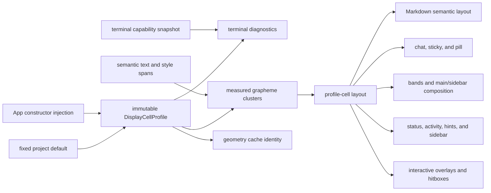

# G11 Global Display-Cell Geometry

**Status:** historical
**Last verified:** 2026-07-26

> **Ownership:** G11.C-G11.F2 display-cell profile, call-site migration,
> presentation policy, cache identity, whole-frame acceptance, and rollback

## Problem

G9 made Markdown-table internals coherent but intentionally left non-table
terminal variability and final frame composition outside its scope. Current
table layout, chat/status guards, main/sidebar composition, sidebar
truncation, editor estimation, and pill geometry can therefore select
different segmentation or width rules.

A row can be internally aligned under one method and still push the sidebar
separator when the terminal draws a cluster with another width. A local
overflow guard can prevent clipping but cannot place all borders at one
physical column.

## Owner

The TUI `App` selects one immutable `DisplayCellProfile` for the terminal
session and passes it to every migrated presentation owner. Engine runtime
state does not select, persist, or replay this profile.

The target value contains, directly or through immutable options:

```text
profile identity and Unicode data generation
extended-grapheme segmentation method
East Asian ambiguous-width policy
emoji-presentation policy
tab and terminal-control policy
ANSI/OSC-aware width, wrap, truncate, pad, and balance operations
```

Every cache that stores geometry produced by the profile includes its identity.
Production does not switch profiles by sampling frames or guessing font pixels.

### Logical and physical contracts

The profile has two deliberately separate claims:

1. **Project-grid integrity:** every migrated measurement, drawing, clipping,
   cache, and hitbox operation agrees with the selected profile.
2. **Terminal/font fit:** the selected profile agrees with a named terminal and
   font only when separately collected diagnostic evidence establishes that
   match.

The deterministic default preserves the G9 compatibility policy. G11.A
determined that a finite explicit selection contract is not required for
terminals that render ambiguous or text-default emoji glyphs differently.
G11.C adds an App-owned startup construction seam and reports the active
profile through terminal diagnostics. The terminal capability snapshot is
diagnostic input only: production does not silently switch a running App,
infer font behavior from terminal names, or calibrate by drawing hidden
content.

G11.A selected one deterministic default rather than a terminal/font-specific
variant. The production requirement is internal grid integrity, which a finite
terminal-name list cannot establish because font fallback remains outside the
process. G11.C therefore provides immutable App constructor injection and
reports the selected identity, but adds no user-facing width-profile selector,
terminal-name guess, or hidden probe. A future explicit variant requires new
property-backed evidence and its own accepted slice.

## Default Presentation Policy

G11.C freezes one deterministic default with these semantics:

| Input class | Target rule |
|---|---|
| ASCII printable | one cell |
| combining/ZWJ cluster | segment before measurement; never split |
| East Asian W/F | two cells |
| East Asian ambiguous without another rule | narrow |
| Unicode emoji-presentation / accepted emoji cluster | two cells |
| Unicode text-default emoji without VS16 | text/East-Asian rule under the default; an accepted selected variant may widen only a versioned Unicode property set |
| VS15 text presentation | text/East-Asian rule |
| VS16 emoji presentation | two cells |
| lone regional indicator | one cell |
| paired flag | two cells |
| project-authored ambiguous chrome | source selects an explicit presentation sequence or a documented profile rule; no per-string runtime exception |
| private-use glyph | selected-profile fallback; never inferred from a terminal or font name |
| user/model source | measured without byte mutation |
| ANSI SGR / OSC 8 | zero cells; state balanced per physical line |
| tab | expanded from the owning rectangle's start column under one pinned tab-stop policy; never emitted as cursor motion |
| C0/C1/bidi cursor-affecting controls | sanitized by the owning semantic boundary before layout |

The final rule set must be backed by current dependency APIs and G11.A
evidence. If the dependency cannot express it without string-specific cases,
G11.C remains blocked rather than adding another rune-range heuristic.
The Unicode, UAX #29, East Asian width, and emoji-property data versions and
all policy fields mechanically determine the profile identity; the ID is not a
hand-maintained label.

## Target Semantic-To-Terminal Pipeline

```text
Goldmark AST
-> semantic text plus style/link spans
-> extended grapheme clusters over the contiguous visible text
-> measured clusters with source bytes, resolved style, and cell width
-> wrap/truncate/pad/alignment/borders
-> ANSI SGR and OSC 8 emission at cluster boundaries
```

Semantic-run boundaries are not grapheme boundaries. G11.A characterized
clusters that cross adjacent emphasis, code, or link runs and selected one
deterministic style/link resolution before G11.C became eligible. The selected rule
must keep combining marks, variation selectors, and ZWJ extensions with their
base cluster and forbid SGR or OSC open/close sequences inside that cluster.
This presentation resolution does not normalize or mutate canonical Markdown,
transcript, or user/model bytes.

G11.A selected the run containing the cluster's first visible scalar as the
owner of the whole cluster's style and link. Later run boundaries cannot open
or close SGR/OSC inside that cluster. This deterministic tie-breaker preserves
the earliest semantic owner without pretending that a terminal can style only
a combining mark or one member of a ZWJ sequence.

The corresponding cache evidence is explicit. Renderer pools, streaming
stable/full fragments, per-history-item renders, restored thread views, and
future pill geometry consume the exact immutable profile identity. Geometry
also keys exact width, owning rectangle start column, completeness where
relevant, and geometry generation. G11.D1 now binds production Markdown
renderer/stable/full identities plus `ChatView` frozen-item and viewport caches
to the exact App-owned render environment and width; the old `±2` frozen-width
tolerance is removed. G11.D2 now projects that profile through chat clipping,
sticky output, bands, columns, the wide sidebar, status-hook alignment, and the
complete final-frame bound. G11.D3 now projects the same profile through one
cached pill rendered-run/final-row/inclusive-exclusive-bounds result consumed
by both rendering and primary-click routing. G11.E1 now projects the same
environment through Plan, permission, MCP approval/settings, resume, and
question modal frames. G11.E2 now projects it through the Agent wizard,
background/detail, Team monitor/peek, and full-screen Task Panel. G11.E3 now
projects it through tool/diff/error/expanded/raw/welcome/notification content
rows. G11.E4 now projects it through hints, search bars, command/model/Agent
pickers, Help/bypass/rewrite rows, active-thread labels, and chat/expanded
cell-to-source selection. Compatibility-owner deletion is the next boundary.
The reproducible
matrix lives in
[`g11-a-frame-integrity-characterization.md`](../../verification/g11-a-frame-integrity-characterization.md).

## Target Flow



## Exempt Boundaries

An external widget may retain its internal library width method only when all
of the following are documented:

1. the widget draws entirely inside an App-owned rectangle;
2. the App-selected profile clips the final projection;
3. no App mouse/hitbox geometry is reconstructed from the widget's internal
   columns; and
4. the difference cannot shift a shared border or adjacent column.

Editor cursor/deletion semantics are initially exempt. Final editor-frame
composition is not.

## G11.C — Profile Kernel

**Status:** complete; removed from the live queue

**Behavior:** generalize the current table-only profile into an App-injectable
display-cell service without migrating production frame call sites.

Tasks:

1. Rename or wrap the current value without changing canonical table behavior.
2. Freeze default segmentation, presentation, ambiguous-width, tab, and control
   policy from G11.A evidence.
3. Freeze the startup profile-selection and terminal diagnostic contract from
   G11.A evidence: constructor-injected fixed default, reported immutable
   identity, no terminal/font variant, terminal-name guessing, or hidden probe.
4. Add cluster iteration and column-aware `measure`, ANSI-aware truncate, wrap,
   pad/alignment, and control-state balance operations needed by later surfaces.
   Tab handling must receive the owning rectangle's start column or consume
   already-expanded semantic text.
5. Add a typed measured-cluster representation using the style/link resolution
   selected by G11.A, so spans cannot emit ANSI/OSC inside an extended grapheme
   cluster.
6. Derive an explicit immutable identity from every Unicode data generation and
   policy field; it must be suitable for every geometry cache.
7. Provide constructor injection for App/TUI tests. The selected profile
   remains immutable for the lifetime of one App.
8. Keep a short-lived compatibility adapter for existing table call sites.

Acceptance:

- independent Unicode/profile oracle agrees for ASCII, CJK, NFC/NFD, Indic,
  VS15/VS16, emoji/ZWJ/modifier, flag/keycap, ANSI, OSC 8, invalid controls, and
  tabs;
- clusters that cross semantic style/link runs remain intact and contain no
  internal ANSI/OSC bytes;
- column-aware tab fixtures agree at multiple rectangle origins;
- property/fuzz tests prove progress, cluster preservation, balanced controls,
  and width bounds;
- changing any profile policy field changes its derived identity, while
  identical values produce identical identities;
- the deterministic default reports its active identity and policy through
  terminal diagnostics;
- current semantic table goldens remain stable except explicitly accepted
  presentation fixtures; and
- no final frame call site changes in this slice.

Rollback removes the unused kernel and its tests together. No compatibility
adapter remains unless the old table owner is fully restored.

## G11.D1 — App And Markdown Profile Projection

**Status:** complete; removed from the live queue

**Behavior:** select the profile once in `App`, project it into
`StreamingMarkdown`, and bind every Markdown/table geometry cache to the
selected identity without changing non-Markdown final composition.

The projection uses an immutable `RenderEnvironment` value, or an equivalent
typed value with the same ownership, containing styles/theme generation,
selected display-cell profile, and a distinct geometry generation. Theme and
geometry identities must not alias one another.

Required call sites:

- `StreamingMarkdown` renderer/full/stable cache identity;
- table sizing, wrap, pad, borders, and narrow fallback;
- App construction and ChatView/Markdown initialization paths;
- current, inactive, restored, and future `threadViewStore` views; and
- `HistoryRenderContext` and frozen ChatView item caches that retain measured
  lines.

Tasks:

1. Add immutable profile ownership to App construction and keep theme/resize
   propagation separate from the session-start selection.
2. Pass the same render environment into active, inactive, restored, and future
   thread views, ChatView history rendering, and Markdown caches.
3. Replace the table-only profile constructor with the App-selected value.
4. Prove profile identity participates in stable/full/renderer cache keys
   before exact-cache hits.
5. Add a geometry generation or exact profile identity to ChatView frozen and
   viewport caches. Geometry-sensitive entries may not reuse the current
   plus/minus-two-column width tolerance; any narrower exception must prove
   width-independent output explicitly.

Acceptance:

- theme/width changes invalidate their affected caches, and constructing an App
  with another profile cannot reuse geometry from the previous identity;
- active, inactive, restored, and future thread views receive the same profile;
- G9 semantic, streaming, resize, and geometry tests remain stable;
- exact reported mixed bold/code tables retain styled partial runs; and
- no non-Markdown final-frame behavior changes.

Rollback removes App projection, Markdown cache identity, and the table adapter
together. A partial rollback that leaves mixed Markdown cache/profile
generations is forbidden.

## G11.D2 — Final Frame, Sidebar, And Status

**Status:** Complete

**Behavior:** make the profile authoritative for the frame boundaries that can
move the reported table border or sidebar separator.

Required call sites:

- `ChatView` finished/streamed-line clipping and sticky prompt;
- `renderLayoutBands`, `fitLayoutColumnLine`, and `joinLayoutColumns`;
- wide-sidebar truncation and separator;
- status alignment and truncation; and
- App final-frame bounds assertion.

Tasks:

1. Replace critical `x/ansi`, `lipgloss.Width`, and
   `terminalLayoutSafetyWidth` selections with profile operations.
2. Add a development/test frame diagnostic naming the profile and first
   overflowing row; do not add persistent user chrome.
3. Flip the G11.A table/sidebar characterization to exact profile-cell
   equality.
4. Retain current rectangle allocation and textual content.

Acceptance:

- every table border and wide-sidebar separator has invariant profile-cell X;
- each final row is within terminal width at 40/80/120/150/180 columns;
- no-color and OSC output stay balanced;
- terminal diagnostics name the selected profile and its Unicode, ambiguous,
  emoji-presentation, and tab policies;
- theme/width changes invalidate affected chat/frame caches; and
- no migrated final-frame call site selects a second width method.

Rollback reverts final-frame, sidebar, status, and diagnostic plumbing
together to the coherent G11.D1 Markdown owner.

## G11.D3 — Shared Pill Geometry

**Status:** Complete

**Behavior:** convert the G11.B semantic pill model into one profile-owned
render/hitbox result.

Tasks:

1. Compute styled label, row, and inclusive/exclusive cell bounds once from the
   chat rectangle and selected profile.
2. Make `ChatView.Render` consume its rendered run.
3. Make `App.pillClickHits` consume the same published bounds.
4. Delete duplicated label, style-width, and centering reconstruction.
5. Flip G11.A glyph and zero-count hitbox characterizations to the target
   assertions.

Acceptance:

- render and hitbox agree for zero/one/many labels at all accepted widths;
- every glyph fixture produces the same displayed and clickable columns;
- overlay/sidebar/full-screen routing still preempts the background action;
  and
- resize recomputes geometry without mutating follow/unseen semantics.

Delivered result:

- `ChatView` caches one semantic-model, rectangle, and exact-environment-bound
  geometry containing the styled run, final row, inclusive start/exclusive end
  cells, and action;
- centering and truncation use the selected profile, including tab expansion
  from the chosen start cell and balanced supported controls;
- `ChatView.Render` places the published row/run and `App.pillClickHits`
  invokes the same result's hit test; and
- theme/profile/resize recomputation changes no follow, append-epoch, baseline,
  runtime, persistence, permission, or replay state.

Focused/race tests cover zero/one/many labels at 40/80/120/150/180 columns,
ASCII/CJK/combining/Indic/variation-selector/ZWJ/flag/tab/ANSI/OSC fixtures,
exact hit boundaries, sticky headers, cache identity, routing precedence, and
source ownership.

Rollback returns to G11.B's shared semantic model and temporary width adapter;
it must not reintroduce the old visibility sentinel.

## G11.E1-E4 — Interactive Surface Migration

**Behavior:** remove remaining direct geometry selection from interactive
surfaces whose borders, selection, or hitboxes can affect the final grid.

**Promotion:** G11.E1-G11.F2 are complete; G11 has left the live queue.

Each group is a separate promotion, PR, and rollback boundary:

1. **G11.E1 modal dialogs:** Plan, permission, MCP approval/settings, resume,
   and question borders, selection rows, and hitboxes. The disconnected
   compatibility `PermissionPrompt` is not a production App modal and remains
   outside this slice.
2. **G11.E2 Agent/task dialogs:** Agent, team, detail/peek, and task-panel
   borders, selection rows, and hitboxes.
3. **G11.E3 content projections:** tool history, diff, error, expanded/raw,
   welcome, and notification frames.
4. **G11.E4 pickers and residual interactions:** completion/queued/history
   hints, search bars, command/model/Agent pickers, Help/bypass/rewrite rows,
   active-thread labels, and helpers that convert display cells to source
   spans. Resume was already migrated and no standalone Theme picker exists.

Each group must:

- name its rectangle and App/profile input;
- retain semantic text and keyboard behavior;
- use the same profile for render and mouse coordinates;
- add 40/80/120/180 golden or focused geometry evidence; and
- remain independently revertible.

Library-internal editor measurement may stay exempt under the documented
conditions above. G11.E1-E4 do not rewrite Bubbles.

### G11.E1 Composition Rules

G11.E1 preserves the existing rectangle and vertical-budget behavior while
replacing horizontal measurement:

1. For centered Resume and MCP surfaces, the profile measures the final
   rendered box, including its border and padding, then centers that complete
   outer rectangle. The existing 48..90, 44..72, and 30..60 dialog-width
   allocations remain inputs rather than being reinterpreted as outer widths.
2. Full-width Plan and Question surfaces remain top-origin projections.
   Permission remains bottom-aligned when it fits. If any modal is taller than
   the overlay rectangle, it keeps the first `height` rows and drops the tail,
   matching the current safety behavior; no slice may silently switch to
   bottom-priority clipping.
3. Bubbles remains the Plan feedback editor's row-wrap, cursor, and editing
   owner. G11.E1 projects each exact rendered editor row through the selected
   profile once; those projected rows both enter the final frame and determine
   the published `X=3` feedback rectangle consumed by `HandleMouse`.
4. Selection order, row count, compact thresholds, dialog-width clamps, border
   and padding styles, and all keyboard/focus/settlement behavior remain
   unchanged. Only profile-owned horizontal truncation, padding, centering,
   origin-aware tabs, and final control balance may change.

Delivered result:

- `App` projects the exact immutable `RenderEnvironment` into all six
  production components at construction, real resize, and theme changes;
- `modal_geometry.go` owns bounded line projection, EGC-safe ellipsis/path
  truncation, control balancing, top/bottom placement, final-outer-box
  centering, and published outer rectangles;
- centered Resume/MCP surfaces measure their final rendered border and padding
  at each candidate origin, while Plan/Question remain top-origin and
  permission remains bottom-aligned when it fits;
- vertical overflow keeps the first rows, and the Plan feedback rectangle is
  derived from the exact once-projected editor rows consumed by rendering; and
- an AST source gate rejects direct Lip Gloss, `x/ansi`, legacy helper, and
  visible-byte-slice geometry selection in the migrated paths.

### G11.E2 Composition Rules

G11.E2 owns four production presentation surfaces:

1. the Agent create/edit wizard;
2. the Ctrl+B background-task list and Agent detail;
3. the `/team` monitor and read-only peek; and
4. the full-screen Ctrl+T Task Panel.

The searchable Agent thread picker was reserved for G11.E4. Agent trace,
generic transcript-history, and tool-history projection were reserved for
G11.E3 content surfaces. Panel-specific Agent detail/transcript lines could
migrate in E2, but their generic history counterparts could not change through
that helper seam.

The three centered components receive the exact App `RenderEnvironment` at
construction, real resize, and theme change. Each owns one transient
`modalFrameGeometry`: `Overlay` clears it before every render and replaces it
from the same final centered projection returned to App. It is not persisted,
cached, copied into App, or consumed by runtime state. The Task Panel instead
retains the existing `layout.overlayRect` as its only rectangle and consumes
the App profile directly.

Existing 40..64 Agent-wizard, 18..80 background/detail, and 28..112 team
dialog allocations remain inputs. Existing row budgets, Team compact threshold,
Task Panel ordering and scroll window, Bubbles input/cursor behavior, detail
tabs, transcript generation/paging, Agent controls, read-only Team restriction,
thread switching, focus, keyboard routing, and dialog-stack behavior remain
unchanged. All four surfaces remain keyboard-only; G11.E2 adds no mouse
action or hitbox reconstruction.

Every final row uses the selected profile for EGC-safe truncation/wrapping,
origin-aware tabs, and control balance. Centered overflow keeps the first
viewport-height rows. The Task Panel remains a top-origin full-screen
projection. A source gate must reject direct `x/ansi`, legacy centered
placement, rune/byte visible-text slicing, and other second geometry owners in
the migrated call paths while retaining the documented Bubbles-internal editor
exemption.

Delivered result:

- `App` projects the exact immutable environment into the Agent wizard,
  background/detail, and Team monitor/peek components at construction, real
  resize, and theme change without mutating their semantic state;
- those three components clear and replace one transient
  `modalFrameGeometry` from the exact centered projection returned to App,
  while Ctrl+T retains `layout.overlayRect` as its only rectangle;
- Agent detail and transcript panel paths use profile-owned wrapping and
  truncation, while generic transcript/tool history remains unchanged for
  G11.E3;
- Ctrl+T preserves task ordering, row budget, scroll window, and status row
  while the App-selected profile owns its top-origin final frame; and
- the 40/80/120/180 Unicode/control matrix, environment/semantic test,
  keyboard-only mouse isolation, transient-geometry lifecycle, focused race
  suite, and AST owner gate pass.

### G11.E3 Composition Rules

G11.E3 owns the production content rows that reach ChatView, the full-screen
expanded/raw conversation view, the welcome frame, and the status toast:

1. generic, Agent-trace, Bash, Read/Search, Edit/Write diff, MCP,
   Plan/Task/Todo, and Web tool-history families;
2. inline ErrorMessage rich, expanded, raw, and transcript projections;
3. the expanded/raw viewport content and its final status row;
4. compact, condensed-mascot, and full-bordered welcome tiers; and
5. the active notification stack's multi-line compatibility projection and
   production single-line status projection.

`HistoryRenderContext.Environment` remains the authoritative tool/error input
and existing ChatView cache identity remains unchanged. Renderer-local header,
preview, wrap, diff-line, and final-row helpers derive the exact selected
profile from that context instead of choosing `x/ansi`, Lip Gloss, rune, or
byte geometry again. The legacy `ChatItem.Render(width, styles)` seam may
normalize a default environment for compatibility, but every production
HistoryItem path consumes the App-projected environment. Raw and transcript
mode dispatch, ANSI stripping, structured parsers, diff hunk construction,
line budgets, tool status, selection prefixes, versions, and finished state
remain unchanged.

The expanded/raw view projects each rendered row and its status row through
the App profile after search highlighting without changing scrolling, search,
selection, or the existing 120-column conversation render cap. Welcome retains
its tier thresholds, row budgets, text, animation/tip lifecycle, and click
action. Its final rows and mascot bounds are derived from the same
profile-projected lines so rendering and hit testing cannot disagree.
Notification rendering retains `Active()` pruning, TTL, eviction, severity,
newest-item selection, and legacy fallback behavior; only EGC-safe truncation,
tab origin, and control balance change.

The `/errors` panel has no proven production App route and remains outside
this slice. Completion/queued/history/mention hints, search bars,
command/model/Agent pickers, Help/bypass/rewrite rows, labels, and residual
cell/source conversion were reserved for G11.E4. Global legacy-helper deletion
and the universal production source gate were delivered by G11.F1. G11.E3 changes no
runtime, persistence, permission, replay, keyboard-routing, or durable state
owner.

Acceptance requires focused 40/80/120/180 evidence for ASCII, CJK, combining,
Indic, VS15/VS16, ZWJ, paired flag, lone regional indicator, tab, ANSI, and
OSC fixtures across rich/expanded/raw, diff, error, welcome, and notification
rows. Exact environment/profile identity must survive theme and resize cache
invalidation; raw output must remain control-free and semantically identical;
welcome hit bounds, notification lifecycle, selection, search, and keyboard
behavior must remain unchanged. A Go-aware source gate rejects second visible-
width owners and visible byte/rune slicing only in the migrated production
paths, retaining explicit semantic-parser and compatibility exemptions.

Delivered result:

- `content_geometry.go` owns profile-selected final-line projection,
  ellipsizing, wrapping, and bounded row projection for the migrated content
  paths;
- production tool and ErrorMessage history adapters preserve the exact
  `HistoryRenderContext.Environment`; every tool family and structured diff
  derives final geometry from that profile without changing parsers, semantic
  render modes, line budgets, status, or raw stripping;
- the full-screen expanded/raw view projects highlighted content and its
  status row through the App profile while retaining its existing 120-column
  semantic render cap, scrolling, selection, and search behavior;
- welcome final rows and mascot bounds consume the same profile-owned
  projection, while notifications retain one `Active()` prune and existing
  TTL, eviction, severity, newest-item, suffix, and fallback behavior; and
- the focused width/Unicode/control matrix, exact-environment cache
  invalidation, raw-control, lifecycle, hit-bound, race, and Go-aware source
  ownership evidence pass.

Rollback reverts the context/profile helper propagation, direct App
projections, focused evidence, and E3 source allowlist together. It returns to
the G11.D2 final-frame safety owner without partially mixing profile-aware
history families or notification/welcome geometry.

### G11.E4 Composition Rules

G11.E4 owns the remaining production picker and string/cell interaction
boundaries:

1. command, file, and composer-mention completion rows inside the App hint
   rectangle;
2. chat and expanded-view search bars;
3. CommandPalette, ModelPicker, and AgentThreadPicker final dialog rows;
4. Help and bypass-confirmation final dialog rows;
5. rewrite-mode hint and selected-message rows;
6. queued-input, reverse-history-search, and active-thread-label rows; and
7. chat and expanded-view text-selection conversion between terminal cell
   columns and source spans.

The exact App `RenderEnvironment` reaches every component at construction,
real resize, and theme change. The three modal pickers retain their current
width clamps, vertical budgets, scrolling, filtering, sorting, selection,
keyboard routing, and dialog-stack precedence while using the existing
profile-owned centered projection. Hint and search rows retain their current
candidate, selection, history-suppression, queued-preview, and search-match
semantics; only final-line alignment, truncation, tab origin, and control
balance migrate.

Selection receives terminal cell columns and must convert them through the
same profile that rendered the owning ChatView or expanded frame. Word/line
selection, drag ordering, copy-on-select, ANSI stripping, whitespace trimming,
item-relative persistence, and clipboard behavior remain unchanged. Extended
graphemes may not be split, and exact boundaries before, inside, and after
wide or zero-width clusters resolve deterministically to source-span edges.

Bubbles remains the Agent-thread search input and main composer editor/cursor
owner; G11.E4 projects their exact rendered rows without replacing their
editing models. The pickers remain keyboard-only and gain no mouse selection
behavior. The already profile-owned Resume/session picker remains in G11.E1.
There is no standalone production ThemePicker; `/theme` command handling is a
no-op inventory result and remains unchanged. Pill, welcome mascot, Plan
hitboxes, and Agent trace links remain owned by their completed slices.
The final production callers of `overlayCentered` and `truncateDisplay` are
removed; their definitions stay explicitly zero-caller until the separate
G11.F1 deletion PR. G11.F1 has since deleted those helpers and installed the
universal production source gate; PTY/program closeout remains G11.F2.

Acceptance requires focused 40/80/120/180 evidence across all included
surfaces with ASCII, CJK, combining, Indic, VS15/VS16, ZWJ, paired flag, lone
regional indicator, tab, ANSI, and OSC fixtures. Exact environment identity
must survive theme and resize projection. Selection evidence covers exact
cell boundaries and extracted source for chat and expanded views. Picker
pointer isolation, semantic candidate/selection preservation, Bubbles
ownership, and a Go-aware source gate scoped to migrated functions are
required.

Rollback reverts picker/search environment propagation, hint/search/modal
projection, selection cell/source conversion, focused evidence, and the E4
source allowlist together. It returns to the G11.E3 content boundary without
restoring a second profile inside an individual surface.

G11.E4 is complete. Its closeout evidence is
[`g11-e4-picker-interaction-geometry.md`](../../history/tui/g11-e4-picker-interaction-geometry.md).

## G11.F1 — Owner Deletion And Source Gate

**Status:** complete; removed from the live queue

**Behavior:** delete compatibility geometry owners after the last production
caller migrates and prevent new unclassified owners.

Tasks:

1. Remove `terminalLayoutSafetyWidth` and table-only naming/adapters once no
   production caller remains.
2. Add a source gate for unclassified direct production width-method
   selection. Prefer Go-aware/AST classification over a brittle text match;
   explicit library adapters use an allowlist with owner and removal-condition
   comments.
3. Prove source inventory, build, focused tests, and race coverage are clean.

Rollback restores the last compatibility adapter only with its exact owner
comment and source-gate allowlist entry. It may not restore a broad heuristic
as a second production owner.

Delivered result:

- `terminalLayoutSafetyWidth`, `overlayCentered`, and `truncateDisplay` are
  deleted after their last production callers migrated;
- the short-lived `widthProfile`, `defaultWidthProfile`, cache/control naming,
  and test-only table adapters are removed in favor of
  `DisplayCellProfile` and exact profile-bearing render calls;
- compatibility streaming/history, Agent transcript, Markdown wrap/margin,
  window-too-small, and permission rows no longer select direct width methods;
  and
- fixed-width Lip Gloss composition is centralized behind one adapter that
  projects origin-sensitive tabs with the selected profile before styling;
  and
- `display_cell_g11f1_test.go` scans every TUI Go file selected by the
  supported Linux amd64, Darwin amd64/arm64, and Windows amd64 production
  builds with type-aware Go AST information, rejects deleted declarations and
  unclassified direct selectors—including method values and expressions—and
  requires each semantic/editor/library exemption to name its owner and
  removal condition.

Closeout evidence is in
[`g11-f1-geometry-owner-deletion.md`](../../history/tui/g11-f1-geometry-owner-deletion.md).

## G11.F2 — PTY And Program Closeout

**Status:** complete; removed from the live queue

**Behavior:** prove the complete terminal lifecycle and transfer facts from
the active plan to current architecture/history.

Tasks:

1. Run PTY fixtures at 32/40/48/72/80/120/150/180 columns with semantic tables,
   sidebar Agent rows, status, sticky header, and pill interaction.
2. Cover resize during streaming, theme/no-color changes, alternate-screen
   repaint, mouse click, and terminal restoration.
3. Run a separately labelled explicit terminal/font matrix or opt-in
   cursor-position diagnostic for every physical-grid claim. PTY fixtures prove
   byte output and lifecycle, not font rendering.
4. Record a pre-change benchmark baseline and an accepted numeric regression
   threshold for a long history and many live sidebar rows before production
   integration closes. Steady frames may not re-segment frozen history or make
   a full-history render per frame.
5. Synchronize current architecture, status, gap closure, and one history
   record.

G11 closes only after no deleted owner is referenced and every required
repository gate passes.

Delivered result:

- the 32/40/48/72/80/120/150/180 PTY union covers semantic tables, while one
  real alternate-screen session traverses every normal-layout width with live
  Agent/status rows, sticky headers, shared pill geometry, primary SGR mouse
  clicks, streaming resize, theme/no-color reprojection, repaint, and ordered
  terminal restoration;
- PTY evidence remains byte/lifecycle evidence, `/terminal` retains
  `Terminal/font: not inferred`, and the separately labelled physical-grid
  cursor diagnostic requires explicit terminal/version/font/fallback metadata
  before it can make a claim about that one observed combination;
- one 10K frozen-history counter test proves steady frames neither re-segment
  cached items nor render the full transcript, while portable p95 budgets and
  diagnostic benchmarks cover that path plus 100 live sidebar rows; and
- current architecture, status, gap inventory, performance verification, and
  [`g11-f2-terminal-program-closeout.md`](../../history/tui/g11-f2-terminal-program-closeout.md)
  now own the completed facts.

## Verification Matrix

| Dimension | Required cases | Pass rule |
|---|---|---|
| content | partial bold/code, plain suffix, links, cross-run EGC, ANSI, OSC | visible semantics preserved; controls emitted only at cluster boundaries and balanced |
| Unicode | CJK, combining, NFC/NFD, Indic, VS15/VS16, ZWJ/modifier, flags, keycaps | cluster intact; profile cells deterministic |
| profile | deterministic default, constructor injection, and multiple tab origins | identity/policy inspectable; project grid exact |
| frame | compact, standard, wide/sidebar | all rows bounded; separators share X |
| widths | 32, 40, 48, 72, 80, 120, 150, 180 | no overflow; fallback retains fields |
| lifecycle | stream, promotion, Finalize, resize, theme change, App construction with another profile | canonical reflow and cache invalidation |
| interaction | wheel/page/top/item/search/thread jump and pill click | action visible away; hitbox exact |
| accessibility | no-color, reduced motion, raw/expanded | textual meaning and geometry retained |
| terminal | PTY lifecycle plus separately labelled terminal/font fit evidence | repaint correct; modes restored; physical claims do not rely on PTY alone |
| performance | long history, streaming tail, live sidebar fan-out | recorded numeric budget passes; no frozen-history re-segmentation or full-history frame regression |

## Source Inventory

| Boundary | Current source | Target |
|---|---|---|
| table profile | [`display_cell.go`](../../../../internal/tui/display_cell.go) | global immutable profile kernel |
| Markdown cache | [`StreamingMarkdown`](../../../../internal/tui/markdown.go) | profile identity in every geometry cache |
| semantic table | [`table_render.go`](../../../../internal/tui/table_render.go) | preserved Goldmark runs; global profile input |
| final bands/columns | [`layout.go`](../../../../internal/tui/layout.go) | profile-owned truncate and pad |
| chat/pill | [`chat.go`](../../../../internal/tui/chat.go) | profile-owned clipping and published geometry |
| App hitbox/status | [`app.go`](../../../../internal/tui/app.go) | consume shared geometry/profile |
| wide sidebar | [`responsive_sidebar.go`](../../../../internal/tui/responsive_sidebar.go) | profile-owned truncation and separator |
| current contracts | [`responsive-layout.md`](../../../architecture/tui/contracts/responsive-layout.md) and [`accessibility.md`](../../../architecture/tui/contracts/accessibility.md) | updated after behavior changes |

## Rollback Summary

- G11.C: remove the unused kernel.
- G11.D1-D3: revert one projection boundary and its cache/geometry identity
  atomically.
- G11.E1-E4: revert one interactive surface group without restoring a global
  second owner.
- G11.F1: rollback to the last coherent profile commit, not the deleted safety
  heuristic or post-render repair.
- G11.F2: revert only closeout evidence if a lifecycle gate is disproved; do
  not revive deleted owners.

There is no data migration, compatibility reader, or restart repair.
