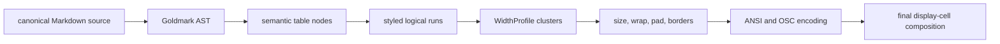

# G9 Markdown Display-Cell Geometry

**Status:** historical
**Last verified:** 2026-07-25

> **Ownership:** accepted G9 user outcome, immutable display-cell and semantic
> table target, ordered slices G9.A-G9.E, promotion gates, and rollback

## Problem

Markdown tables can place inner or outer borders in different terminal
columns when cells contain presentation-sensitive grapheme clusters. The same
canonical source can also switch between the custom table renderer and
Glamour's table renderer as streaming boundaries become stable or the message
finalizes. Escaped pipes and pipes inside code spans are reparsed as column
separators after Goldmark has already established their Markdown meaning.

This is user-visible geometry and content loss, not a request to replace the
whole Markdown stack. G9 closes the gap only when table parsing, measurement,
wrapping, padding, border placement, cache identity, and final drawing consume
one project-owned contract.

## Decision

Use the `combine` decision established by the
[`display-cell audit`](../reference/tui/markdown-table-display-cell-audit.md):

- preserve proportional column allocation, the bounded key/value fallback,
  Revontuli semantic styling, and the four-cell safety margin;
- adapt Claude Code Ripe's parsed table tokens and single width owner;
- adapt Codex's structured styled cells and semantic record fallback;
- adapt Crush's rule that the active width method participates in cache
  identity and final drawing; and
- own an immutable, versioned Go `WidthProfile` in Eino-Agent.

The default profile is deterministic and ambiguous-width-narrow. It specifies
the segmentation and width-data versions it consumes. A future terminal
override is valid only if it changes the same profile identity used by every
table stage and cache; G9 does not infer font pixels or mutate source text.

## Scope

Affected production surfaces are finalized assistant Markdown, the mutable
streaming assistant tail, compatibility streaming output, and Plan-dialog
Markdown. All already call `StreamingMarkdown.Render`; G9 changes the table
path behind that owner.

G9 may change table wrapping, proportional column widths, incomplete-table
presentation, and the exact fallback threshold where current geometry is
internally inconsistent. It must preserve:

- canonical Markdown source bytes and raw history;
- non-table Markdown theme semantics and syntax highlighting;
- terminal color/no-color and accessibility contracts;
- stable-prefix bounded rendering and final source reflow;
- compact/standard/wide App layout budgets; and
- engine, transcript, permission, replay, and runtime-state ownership.

## Non-Goals

- A general editor cursor/deletion rewrite.
- Font or pixel measurement.
- Automatic locale, SSH, tmux, or terminal-emulator probing.
- Normalizing NFC/NFD or injecting variation selectors into source.
- Replacing Glamour for every non-table Markdown block.
- Treating one reference implementation as the product specification.

## Frozen Invariants

1. One Goldmark semantic table owner defines headers, alignments, rows, and
   inline cell content.
2. One immutable `WidthProfile` defines grapheme segmentation, display cells,
   ambiguous-width policy, control policy, and cache generation.
3. Source bytes remain unchanged; wrapping and truncation never split an ANSI
   control sequence, OSC 8 link, or extended grapheme cluster.
4. For a horizontal table, every row has the planned outer width and every
   vertical border uses the same display-cell column.
5. Incomplete streaming tables use one explicit literal/deferred behavior.
   They never select a second table renderer.
6. Finalization, resize, theme change, color-profile change, or width-profile
   change reflows from canonical source with the complete cache identity.
7. Narrow fallback preserves every header/value field and semantic style.
8. Geometry failure is observable in tests with profile, row, cluster, and
   expected/actual columns; production never trims content or borders to hide
   it.

## Target Pipeline



## Ordered Slices

### G9.A — Independent Failing Evidence — Complete

**Behavior:** add no production path. Pin one independent test-only width
profile and reproduce current geometry, grammar, and lifecycle ownership gaps
with deterministic diagnostics.

Acceptance:

- the matrix covers ASCII, CJK, NFC/NFD, Hangul syllable/Jamo, Indic,
  VS15/VS16, modifier/ZWJ, flags/lone regional indicators, keycaps, ANSI, and
  OSC 8;
- border diagnostics identify the profile, row/case, source cluster, and
  expected/actual columns;
- escaped and code-span pipes prove the raw split creates the wrong cell count;
- every valid UTF-8 append boundary, finalization, resize, empty/uneven rows,
  styled cells, and narrow fallback has deterministic evidence;
- the characterization explicitly records current mismatches instead of
  hiding them behind the production heuristic; and
- `internal/tui` focused tests and repository gates pass without a production
  code change.

G9.A merged in PR #106. The promotion check confirmed the mixed-width
functions still owned production before G9.B began.

### G9.B — Immutable Display-Cell Service — Complete

Introduce the production `WidthProfile`, pin one segmentation/width-data
stack, and route table min/ideal sizing, wrapping, truncation, padding,
overflow, and border geometry through it. The G9.A geometry characterization
must flip from reproducing mismatch to asserting equality without expanding
emoji rune ranges.

Promotion:

- no table layout helper directly selects another width/segmentation method;
- property/fuzz tests preserve clusters and control state and keep lines within
  target cells;
- profile identity is immutable and cacheable; and
- the then-pending G9.C grammar fixtures still characterize the parser split
  without being accidentally "fixed" by string escaping.

Current implementation evidence:

- [`display_cell.go`](../../../internal/tui/display_cell.go) owns the immutable
  default profile and cluster-safe width/wrap/truncate operations;
- [`renderTable`](../../../internal/tui/table_render.go) selects the profile
  once and passes it through every custom layout helper;
- Glamour post-render alignment measures and truncates with the same profile,
  while non-table `emojiAwareWidth` behavior remains unchanged;
- the independent 15-case geometry oracle asserted exact border equality; at
  the G9.B promotion boundary, escaped/code-span rows still asserted the raw
  split of three; and
- deterministic property, race, direct-render, and fuzz validation covers
  grapheme preservation, progress, line bounds, and per-physical-line SGR/OSC
  8 close/replay.

G9.B merged in PR #107. Its promotion check found no table layout helper that
selects a second width or segmentation implementation.

### G9.C — Goldmark Semantic Tables — Complete

For top-level complete tables on the custom-render path, build headers,
alignments, rows, and styled inline runs directly from the Goldmark AST.
Delete raw `strings.Split(line, "|")` table grammar ownership. Escaped and
code-span pipes become content, empty/uneven rows normalize to the parser-owned
column count, and rich inline nodes retain semantic styling and links. Nested
container rendering remains Goldmark/Glamour until G9.D.

Pinned Goldmark v1.7.13 already owns escaped-pipe boundaries but still treats
an unescaped pipe inside a code span as a table delimiter. The accepted
project adapter may mask only such a pipe in a same-byte-length parse view
before Goldmark runs. Inline nodes continue to read the unchanged canonical
source through identical offsets; unmatched code spans retain Goldmark's
ordinary behavior. This is a narrow parser-input adapter, not a second
table-row or cell-boundary parser.

Promotion:

- one production parser owns table cells;
- the full grammar matrix passes from parser events through encoded output;
- proportional allocation and key/value fallback consume structured cells;
  and
- the raw extraction/splice path no longer reparses cell boundaries.

Current implementation evidence:

- the top-level complete-table custom path parses one full prepared source and
  derives table ranges, alignments, normalized rows, and inline runs from
  Goldmark GFM AST nodes;
- the same-byte-length parse view masks only unescaped pipes inside
  syntactically closed, equal-length code spans, including multibyte source,
  while escaped openings and unmatched spans retain ordinary Goldmark
  behavior;
- structured cells preserve emphasis, code, strike, image, inline-link,
  autolink, and plain/raw-HTML text projections through proportional and
  narrow fallback layouts;
- decoded and literal C0/C1 controls are replaced at the semantic-run boundary,
  invalid/control-bearing destinations cannot open OSC 8, and every physical
  output line closes SGR/OSC state; and
- placeholder selection is collision-free across multiple top-level tables.
  Nested blockquote/list tables deliberately remain inside their
  Goldmark/Glamour container path until G9.D converges renderer ownership
  without discarding container semantics.

### G9.D — Streaming And Final Convergence — Complete

Route every complete table through the semantic renderer and define incomplete
tables as literal/deferred until the parser can prove completeness. Cache
identity gains width-profile ID/generation and block completeness beside
source, terminal width, theme, and color profile.

Promotion:

- every append-boundary fixture converges to the canonical finalized render;
- stable-prefix promotion never changes table ownership;
- resize/theme/profile changes reflow from canonical source; and
- streaming performance remains bounded by stable content plus the mutable
  tail.

Current implementation evidence:

- `StreamingMarkdown` labels each fragment as streaming-incomplete,
  stable-complete, or finalized-complete. Stable promotion and Finalize now
  share `renderMarkdownFragment`; only tables descended from the live final
  top-level block are deferred;
- a collision-free short alphanumeric sentinel is rendered as a fenced text
  block, located exactly once in raw and ANSI-stripped Glamour output, and
  replaced in source order. The stripped two-cell code margin yields the
  projected blockquote/list continuation prefix without repeating bullets or
  ordered markers;
- complete top-level, blockquote, list, and blockquote-list tables all use the
  Goldmark semantic table and G9.B profile. Incomplete equivalents preserve
  sanitized literal rows, hard-wrap without splitting graphemes, and emit no
  source C0/C1 control sequence;
- renderer, full-output, and stable-prefix cache identities include canonical
  source, width, semantic theme, explicit color profile, width-profile ID, and
  completeness. A package test seam changes profile generations without
  creating a production selector; and
- focused golden, all-theme widths 10/18/48, append-boundary, nested-container,
  sentinel-cardinality, terminal-control, profile-invalidation, full TUI race,
  and stable-prefix benchmark evidence pass. The temporary post-render repair
  remains characterized for G9.E rather than being hidden or removed here.

G9.D intentionally changes one visible streaming behavior: a table at the end
of the live final block stays as source-like literal rows even after its
delimiter is syntactically valid. A following sibling promotion or explicit
Finalize converts it to the semantic layout. This avoids a second renderer
owner and row-by-row layout churn.

### G9.E — Heuristic Deletion And Terminal Evidence — Complete

G9.E removes `fixTableAlignment`, `trimTableRow`, and `padTableRow`, and
`renderMarkdownFragment` now passes Glamour output directly to semantic-island
splicing. Table tests measure borders and rows only with
`defaultWidthProfile`; no production or test table path calls the old
emoji-range heuristic.

The non-table chat/status overflow guard keeps its conservative compatibility
behavior under the explicit `terminalLayoutSafetyWidth` name in
`display_cell.go`, with `isTerminalLayoutSafetyWideRune` as its private range
policy. This boundary may reserve one spare column on terminals that render a
bare symbol narrowly, but it cannot influence table allocation, padding,
wrapping, or assertions.

The 32/48/72-column PTY fixture renders CJK, Indic, ZWJ emoji, a bare label,
and a flag through the finalized semantic path. It proves equal
`WidthProfile` row/border geometry, bounded physical lines, closed SGR/OSC
state, and absence of literal table source. Focused tests repeat that capture
and the non-table variability contract. G9 has left `REMAINING.md`; delivery
evidence is in
[`g9-e-table-repair-deletion.md`](../history/tui/g9-e-table-repair-deletion.md).

## Verification

Every slice runs its focused `internal/tui` tests. Production slices add
applicable race, golden, benchmark, fuzz/property, and PTY evidence. Before
merge, every slice runs:

```text
make fmt
make lint
make test
make build
make lint-new
make docs-check
git diff --check
```

The migration manifest check remains required when Claude reference mappings
change.

## Rollback

- G9.A rolls back only its test oracle and plan/tracker evidence.
- G9.B rolls back the width service and its call sites together; it must not
  leave parallel width owners.
- G9.C rolls back semantic extraction and structured rendering together.
- G9.D rolls back streaming/cache routing without restoring post-hoc grammar
  parsing as a second owner.
- G9.E is the deletion boundary. After it lands, rollback uses the last
  structured semantic renderer commit, not the deleted repair heuristic.

## Source Owners

| Boundary | Current owner |
|---|---|
| streaming lifecycle and cache | [`StreamingMarkdown`](../../../internal/tui/markdown.go) |
| current custom table layout | [`renderTable`](../../../internal/tui/table_render.go) |
| current mixed padding | [`padAlignedCell`](../../../internal/tui/table_render.go) |
| current semantic table extraction and nested-container projection | [`extractTableIslands`](../../../internal/tui/table_render.go) and [`spliceTableIslands`](../../../internal/tui/table_render.go) |
| streaming completeness and cache identity | [`StreamingMarkdown.renderWithProfile`](../../../internal/tui/markdown.go) and [`renderMarkdownFragment`](../../../internal/tui/markdown.go) |
| G9.A evidence oracle | [`display_cell_g9_test.go`](../../../internal/tui/display_cell_g9_test.go) |
| comparative decision | [`markdown-table-display-cell-audit.md`](../reference/tui/markdown-table-display-cell-audit.md) |
