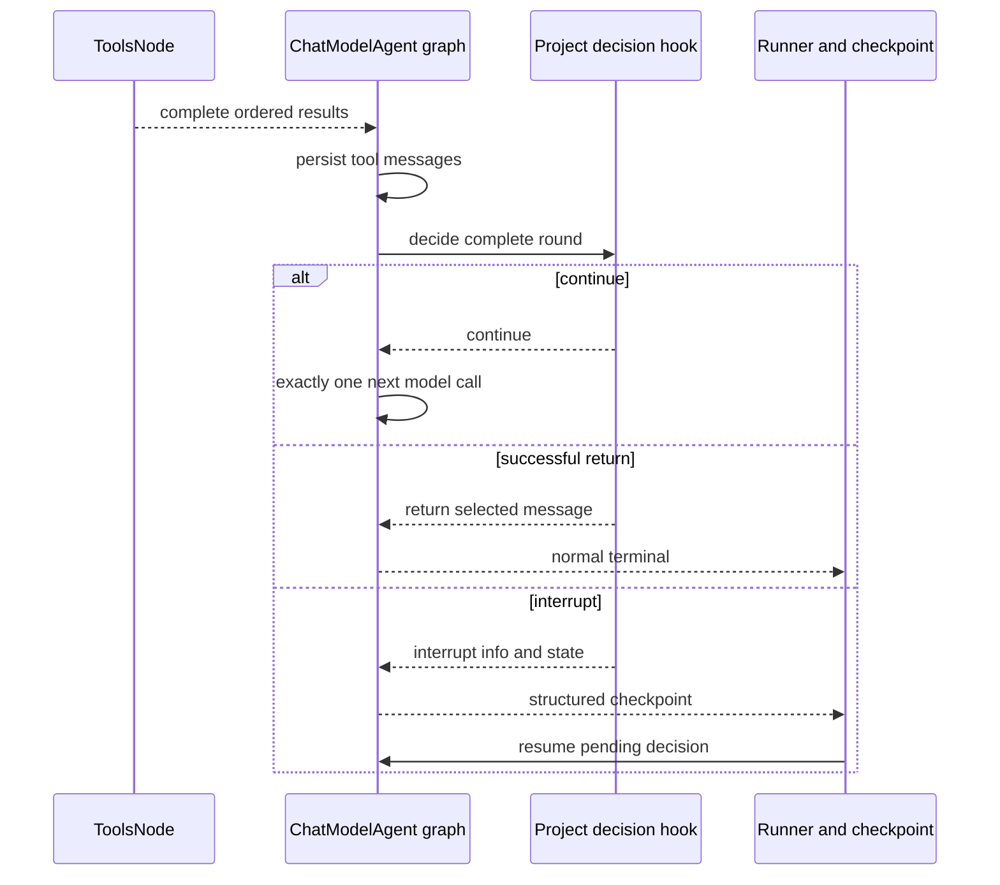
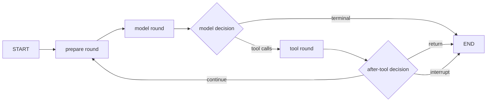

# P13 Project Graph Kernel Plan

**Status:** historical
**Completed:** 2026-07-21
**Last verified:** 2026-07-23

> **Ownership:** completed P13 contracts, invariants, promotion gates, rollback
> conditions, dependencies, per-slice closeout, and final old-owner deletion
> evidence for the project-owned Eino Compose Graph kernel. Current execution
> order belongs in
> [`migration/PLAN.md`](../PLAN.md); gap inventory belongs in
> [`migration/REMAINING.md`](../REMAINING.md); verified current facts belong in
> [`migration/STATUS.md`](../STATUS.md); source-backed comparison and evidence belong in
> [`migration/reference/runtime/query-engine-eino-convergence-audit.md`](../reference/runtime/query-engine-eino-convergence-audit.md).

This is a frozen historical contract. Present-tense checklist language below
records the acceptance boundary used during delivery; it is not ready work.

P13 now adopts a `project-native` inner kernel built with public Eino
`compose.Graph` primitives. The Graph owns explicit ReAct control flow; the
project continues to own provider policy, canonical model and tool rounds,
compact/recovery, outward events, transcript, session, live input, and TUI
contracts. Eino `ChatModelAgent`, `Runner`, and `TurnLoop` are no longer required
production owners.

This was not a line-by-line translation of the retired imperative `queryLoop`. Nodes
represent typed side-effect boundaries, branches represent committed control
decisions, and run-local Graph state carries only plain reconstructable data.
ProjectGraph is now the only execution authority. Retired Legacy and unpinned
transcripts keep diagnostic identity but cannot continue.

P13.5a remains completed evidence for exactly-once tool-result reconstruction.
The isolated P13.5b Eino upstream candidate also remains useful feasibility
evidence, but the project-native decision supersedes it as a promotion gate.
P13.5c0 replaced the disconnected `BuildQueryGraph` experiment with an
executable, fixture-only typed Graph kernel, and P13.5c1 bound the canonical
model-round boundary without changing production selection. P13.5c2 then bound
the canonical tool round and typed after-tool decisions after P17.H0 repaired
Plan admission and exact plan-file policy. P13.5c3 closed the complete fixture
inner lifecycle against the durable Plan and entrypoint traces; P13.6a then
installed the default-off new-session canary without creating a public selector
or fallback owner. P13.6b retired the now-unused ADK evidence adapters and
renamed the live schedule/decision owner. P16.5d converged the command owners,
and P13.7 replaced their shared live-input boundary with one durable typed
coordinator. P13.8 then added durable public-Eino Graph interrupt/resume with
live authority revalidation. P18.2 worktree ownership/recovery and P13.9a-d
foreground/background child ProjectGraph admission, durable generation replay,
and projection-only TUI compatibility are complete. P13.10a completed cutover
and full Legacy owner deletion; P13.10b retired the rollout adapter vocabulary,
closed the final proof matrix, and completed P13.

## Links

- Execution order and next ready slice: [`migration/PLAN.md`](../PLAN.md)
- Gap inventory: [`migration/REMAINING.md`](../REMAINING.md)
- Verified current facts: [`migration/STATUS.md`](../STATUS.md)
- Source-backed evidence and audit: [`migration/reference/runtime/query-engine-eino-convergence-audit.md`](../reference/runtime/query-engine-eino-convergence-audit.md)
- Pi turn/session/TUI evidence: [`migration/reference/tui/pi.md`](../reference/tui/pi.md)
- Grok Build session/subagent/terminal evidence: [`migration/reference/tui/grok-build.md`](../reference/tui/grok-build.md)
- Current architecture owners:
  - [`architecture/runtime/query-engine.md`](../../architecture/runtime/query-engine.md)
  - [`architecture/runtime/compaction.md`](../../architecture/runtime/compaction.md)
  - [`architecture/runtime/recovery.md`](../../architecture/runtime/recovery.md)
  - [`architecture/runtime/input-queue.md`](../../architecture/runtime/input-queue.md)
  - [`architecture/platform/model-providers.md`](../../architecture/platform/model-providers.md)
  - [`architecture/runtime/tasks-and-agents.md`](../../architecture/runtime/tasks-and-agents.md)
  - [`architecture/state/transcripts.md`](../../architecture/state/transcripts.md)
  - [`architecture/capabilities/tool-registry.md`](../../architecture/capabilities/tool-registry.md)
  - [`architecture/runtime/model-and-tool-execution.md`](../../architecture/runtime/model-and-tool-execution.md)
  - [`architecture/tui/contracts/runtime-events.md`](../../architecture/tui/contracts/runtime-events.md)
  - [`architecture/tui/contracts/busy-queue.md`](../../architecture/tui/contracts/busy-queue.md)
  - [`architecture/tui/contracts/sessions.md`](../../architecture/tui/contracts/sessions.md)

## Frozen Program Invariants

The following constraints survive every P13 slice:

- **One supported kernel per session.** New and supported resumed Sessions pin
  ProjectGraph once; no mid-session switch or simultaneous live execution is
  allowed. Retired identities have no executor.
- **No duplicate model request or side-effecting tool call.** No shadow path may
  replay a real model request or rerun a side-effecting tool.
- **A streamed model turn commits before tools execute.** Tool calls remain
  non-executable until the terminal finish reason is known. A truncated or
  otherwise rejected assistant turn produces model-ordered error results and
  no tool side effect, even when a partial call is syntactically valid.
- **Model-visible pool distinct from registry.** The complete registry remains
  available for dispatch, metadata, aliases, hooks, permission, ToolSearch, and
  MCP resolution; the model-visible snapshot is filtered and ordered separately.
- **Exact tool admission/hook/permission/result ordering.** The canonical order
  remains:

  ```text
  parse -> schema coercion -> schema/custom validation -> plan guard
  -> pre-tool hooks and input rewrite -> deny/permission/classifier/prompt
  -> execute -> attachments/offload/file state -> post-tool hooks
  -> plan/context transition
  ```

- **Dynamic stable per-input batches, model order, sibling cancellation.**
  Concurrency safety remains a function of the canonical tool and normalized
  input; safe calls form stable adjacent parallel batches; unsafe calls remain
  serial barriers; results re-enter history in model order; Bash sibling failure,
  cancellation-chain release, and cancel/block interrupt behavior remain
  unchanged.
- **Project-owned compact/recovery policy and outward events/transcript/session/TUI.**
  Compact preparation, recovery classification, `QueryEvent` identity/order,
  transcript, user-visible Session, and TUI projection remain project truths.
  Eino Compose checkpoint bytes may exist only as a versioned opaque mid-turn
  payload inside Session.
- **One project input coordinator from P13.7.** A versioned session-scoped
  `RuntimeInputCoordinator` is the sole live-input owner around ProjectGraph
  runs. The former `QueryParams.QueueManager`
  (`*queue.Manager`) path is deleted rather than mirrored. Graph local state
  receives only plain revision data; the unrelated `queue.QueueManager` type is
  outside this cutover.
- **Checkpoint approval re-evaluates current policy.** Resume must reconstruct
  the exact invocation and re-run current deny rules, effective grants, scope,
  tool schema, and hook prerequisites. Stored approval is evidence of intent, not
  a grant.
- **Background Agents retain separate supervised runtimes and durable identity.**
  Each asynchronous background child receives a supervised project Graph runtime
  with stable project identity, transcript, steering, and replay. No Graph node
  becomes the durable child lifecycle owner.
- **P13.10 removes legacy owners.** Completion requires measurable deletion of at
  least one full runtime owner, not merely adapter coverage.

## Contract Index

The root [`PLAN.md`](../PLAN.md) is the only source for slice state, accepted
execution order, and the next ready item. This index maps each ID to the detailed
contract and its non-negotiable dependency or promotion gate.

| Slice | Detailed contract | Dependency or promotion gate |
|---:|---|---|
| P13.H0 | Fail-closed streamed-tool commit barrier | No tool starts before a non-truncated assistant turn commits. |
| P13.0 | Canonical behavioral compatibility suite | P13.H0 is reflected in stable categorized traces with no further production change. |
| P13.1 | Stable Eino v0.9.12 baseline | P13.0 traces remain exact across the dependency-only diff. |
| P13.2 | ADK compatibility layer | No second product truth, live request, side effect, or public compatibility commitment. |
| P13.3 | Scheduler and continuation proofs | Cancellation-safe, deadlock-free, checkpoint-safe controls preserve current outcomes. |
| P13.4 | Model attempts and recovery mechanics | Exact request count, provider route, successful history, retry events, and recovery policy. |
| P13.5a | Executed-result resume bridge | Original complete input, strict persisted results, exactly-once unsettled execution, and model-order merge. |
| P13.5b | Structured after-tool upstream candidate | Superseded as a production gate; retain the verified prototype as comparative evidence only. |
| P13.5c0 | Typed Compose Graph skeleton | One compiled `Runnable` executes typed continue, return, interrupt, failure, and concurrency fixtures without production wiring. |
| P13.5c1 | Canonical model-round node | Existing preparation, request-count, streaming commit, retry/failover, recovery, event, and terminal behavior remains exact. |
| P13.5c2 | Canonical tool-round node | P17.H0 first closes Plan admission and exact-file safety; exact admission, permission, hooks, attachments, continuation, context, cancellation, and model order remain project-owned. |
| P13.5c3 | Complete project Graph inner kernel | P17.2 first freezes Plan persistence/entrypoint traces; canonical traces then prove the Graph is the sole inner-loop owner in fixtures and no stale compatibility owner is required. |
| P13.6a | Production ProjectGraph canary | No mid-session switch, duplicate model request, or side-effecting tool execution. |
| P13.6b | ADK compatibility retirement | Remove every adapter not used by ProjectGraph and extract the live project schedule/decision from ADK-named evidence. |
| P13.7 | Project input-coordinator cutover | Priority, scope, FIFO, steering, stop, persistence, and replay fixtures pass. |
| P13.8 | Durable HITL interrupt and resume | Exact invocation and current policy are re-evaluated; stale state fails closed. |
| P13.9a | Foreground child Graph kernel | P18.2 has closed Agent worktree ownership/recovery; existing child identity, lineage, worktree handoff, attention, and terminal behavior remain exact. |
| P13.9b | Background child supervision | Current cancellation, owned/shared Close, steering, and bounded join-attempt semantics remain exact. |
| P13.9c | Durable child terminal replay | Each generation restores once as live or replay-only without dispatch. |
| P13.9d | Current child TUI parity | Existing detail, transcript, lineage, attention, and switching remain projection-only. |
| P13.10 | Cutover, deletion, and hardening | P13.9a-d are closed, at least one full owner is removed, and rollback remains transcript-safe. |

## P13.H0 Fail-Closed Streamed-Tool Commit

### Problem

`ProcessStream` currently forwards each observed tool call to
`StreamingToolExecutor.AddTool`, and a syntactically ready call may start before
the stream's final `ResponseMeta.FinishReason` is known. The current source has
no explicit rejection path for a final truncation/length outcome. P13.0 must not
freeze this as accepted compatibility behavior.

Pi supplies the adopted safety rule: if an assistant response is truncated,
none of its tool calls execute. The project adapts that rule to its existing
stream/event/tool-result contracts rather than copying Pi's loop.

### Allowed scope

- `engine/execution/streaming.go` and `stream_processor.go`;
- one project-owned finish-reason normalizer under `engine/execution/`;
- the narrow project-owned `agenticChatModel` bridge needed to preserve Eino
  terminal metadata for the shared classifier;
- the narrow query integration needed to classify the committed finish reason;
- focused fake-stream and side-effect-counter tests;
- one bounded commit/reject state in `StreamingToolExecutor`.

### Excluded scope

- Eino upgrades or ADK adapters;
- upstream provider client, request, or provider-route changes;
- tool scheduler, permission, hook, provider-route, or registry rewrites;
- changes to mixed safe/serial batch order after a successful commit;
- new flags, durable schema, TUI state, or reference-wide compatibility work.

### Frozen contract

1. During streaming, calls may be accumulated and validated but cannot cross
   the side-effect boundary.
2. A recognized truncation/length terminal outcome rejects the complete call
   set and emits one model-ordered error result per call.
3. A successful non-truncated terminal outcome commits the set once; existing
   stable batch and model-result order then apply unchanged.
4. Cancellation before commit emits no tool side effect. Cancellation after
   commit follows the existing per-tool interrupt behavior.
5. A project-owned normalizer and terminal classifier under `engine/execution`
   own the complete decision. `ProcessStream` passes the raw finish reason,
   withheld API-error presence and reason, clean EOF observation, stream error,
   and context error to that boundary; the normalizer maps the accepted raw
   aliases to canonical outcomes and the classifier returns commit,
   reject-truncated, cancel, or model-error.
   `ProcessStream` does not need provider identity. The project-owned
   Agentic-to-legacy bridge preserves raw terminal metadata without changing
   provider clients or routes. The shared execution boundary owns this
   compatibility table:

   | Normalized stream outcome | Tool disposition |
   |---|---|
   | terminal or withheld `length`, `max_tokens`, or another explicitly mapped truncation alias | Reject every call; execute none |
   | context cancellation or stream error before clean terminal completion | Reject/cancel every uncommitted call; execute none |
   | known successful terminal such as `stop`, `end_turn`, or `tool_calls` | Commit the call set once |
   | empty finish reason with clean EOF | Commit only after complete call validation; retain the existing provider-neutral compatibility path |
   | unknown non-empty provider finish reason | Fail closed as a model/normalization error and execute none |

   Adding an alias requires a focused central-normalizer and classifier-table
   test plus a provider fixture when an existing adapter emits that alias. It
   cannot be accepted by passing provider identity into `ProcessStream`,
   branching in an entrypoint, or treating all unknown values as success. CLI,
   TUI, plain, headless, ACP, side-query, and child callers use the same
   classifier wherever they enable tool execution.

### Acceptance evidence

- a fake stream emits a syntactically valid mutation call followed by a
  truncation finish reason, and the side-effect counter remains zero;
- multiple truncated calls produce ordered error results and no execution;
- a tool call followed by a withheld `max_output_tokens` API error rejects
  before the existing max-output recovery retry and never dispatches;
- a normal committed call executes exactly once;
- canonical outcomes and every supported alias are classified by focused table
  tests, including global clean-EOF compatibility and unknown non-empty
  rejection;
- Claude, OpenAI, Gemini, Ark, DeepSeek, and Qwen terminal metadata bridge
  fixtures include a metadata-only truncation chunk;
- cancellation before and after commit exercise the two distinct paths;
- existing mixed safe/serial batching, Bash sibling cancellation, permission,
  hook, and streaming event tests remain exact;
- the change has no storage migration and can be reverted without reinterpreting
  an existing transcript.

### Rollback

Revert the commit barrier and focused tests as one behavior change. No feature
flag, dual executor, or compatibility adapter survives the slice. P13.0 remains
blocked until an equivalent fail-closed rule is restored.

## P13.0 Canonical Behavioral Compatibility Suite

### Problem

Existing focused tests prove individual query, stream, tool, recovery, and
entrypoint behaviors, but there is no single canonical trace that compares the
full observable surface before and after replacing an implementation mechanism.
Without it, a green unit suite can still miss an extra model call, changed tool
projection, reordered attachment, lost usage field, or a second terminal event.

### Allowed scope

- test-only helpers under `engine/` or `engine/execution/`;
- deterministic fake model streams and fake tools;
- golden fixtures under the owning package's `testdata/` directory;
- reuse of existing `QueryDeps.CallModel`, registry, hook, queue, permission,
  compact, and recovery injection seams;
- normalization of generated IDs, timestamps, temporary paths, and redacted
  credential-like fields inside the test recorder.

### Excluded scope

- production query-loop refactors or new exported runtime APIs;
- changes to `go.mod` or `go.sum`;
- Eino middleware, ChatModelAgent, Runner, or TurnLoop wiring;
- real provider calls or side-effecting tools;
- new user-facing flags, environment variables, checkpoint formats, or session
  fields;
- updating `STATUS.md` as though an Eino capability had already migrated.

### Canonical trace records

| Record | Required fields |
|---|---|
| Model request | ordinal, canonical model, system prompt digest, normalized messages, tool name/schema/order, tool choice, max tokens, thinking/task-budget options |
| Stream | chunk ordinal, content/reasoning delta, ToolCall index/ID/name/arguments, usage, finish reason, withheld error classification |
| Tool | call ordinal, ID, canonical name, normalized input, admission outcome, start/finish order, result/attachment kinds, continuation/context flags |
| Event | sequence, runtime identity, type, causation, normalized payload summary |
| State boundary | boundary name, message digest/list, transition, recovery counters, compact state, queue consumption |
| Terminal | reason, turn/max-turn values, error class, final message digest |

Do not store raw credentials, unrestricted environment values, or full offloaded
file content in a golden. Preserve semantically relevant ordering; do not sort
events, tools, or messages merely to make a flaky test pass.

### Required fixtures

1. final assistant response without tools;
2. streamed ToolCall arguments in both delta and cumulative forms, including
   final usage and finish reason;
3. adjacent safe tools around a serial barrier, proving start order, parallel
   grouping, model-ordered results, and exactly-once execution;
4. permission and pre/post-hook decisions, including input rewrite and stopped
   continuation;
5. rate-limit retry and consecutive-overload fallback, proving request count,
   warning order, and successful-only assistant history;
6. prompt-too-long collapse drain followed by reactive compact/terminal paths;
7. production `queue.Manager` `PriorityNow`/`PriorityNext`/`PriorityLater`,
   main/child scope, queued main-thread input, child SendMessage injection, and
   task-notification drain at the next safe round boundary; queued steering is
   distinguished from abort/preemption and never interrupts an already running
   tool batch;
8. cancellation with cancel/block tool behavior, exactly one terminal result
   for every visible tool call, and one query terminal projection; and
9. the P13.H0 truncated-call fixture, proving no tool side effect and an
   intentionally categorized difference from the pre-P13.H0 implementation.

### Acceptance evidence

- the canonical trace schema and normalizer have focused tests;
- identical fixtures are stable under repeated execution;
- semantic differences in tool order, event order, request count, message state,
  or terminal reason produce categorized diffs;
- the harness is test-only and changes no production request, event, storage,
  permission, recovery, or scheduling behavior;
- focused query/execution tests still pass;
- `make fmt`, `make lint`, `make test`, `make build`, manifest validation,
  local-link validation, and `git diff --check` pass at closeout.

### Rollback

P13.0 is test-only. Rollback removes its helper and fixtures without any data
migration or runtime compatibility path; P13.1 remains blocked until an
equivalent compatibility suite is accepted.

## P13.1 Stable Eino v0.9.12 Baseline

Change only `go.mod`, `go.sum`, compatibility fixes required by v0.9.12, and
tests. Inventory v0.9.1-v0.9.12 changes affecting ADK events, message mutation,
retry/failover, ToolsNode, TurnLoop, and checkpoint serialization. Run every
P13.0 trace before and after the dependency change. Treat any difference as a
compatibility decision, not snapshot churn; do not combine the upgrade with
middleware or production ownership transfer.

**Dependency-only rule:** no production boundary, public API, or behavior change
beyond what v0.9.12 requires for compilation and existing test passage.

## P13.2 ADK Compatibility Layer

Add internal boundaries without activating live ADK execution:

1. a `QueryKernel` interface implemented by Legacy and ADK kernels;
2. kernel selection exposed only to deterministic fixture/read-only shadow
   construction; production sessions remain Legacy until P13.6a;
3. an `ADKEventBridge` that maps attempt and Agent events to existing
   `QueryEvent` identity and causation;
4. immutable model-visible tool snapshots and Eino tool adapters that delegate to
   canonical project execution;
5. project handlers for provider options, compact/recovery classification, tool
   policy, and event projection;
6. a versioned checkpoint envelope owned by project Session; and
7. checkpoint-safe `RuntimeItem` variants for prompts, queued commands, steering,
   approval results, and task notifications.

**Adapter boundary:** the layer must not expose a permanent public dual-runtime
API. ADK is fixture or read-only shadow only, and no path may duplicate a model
request, permission prompt, shell/file/network operation, task spawn, hook, or
persistent write.

## P13.3 Blocking Architecture Proofs

**Completed:** 2026-07-17

### Dynamic stable tool scheduling

The accepted path is a project-owned run-scoped
`compose.ToolCallMiddlewares` adapter over Eino v0.9.12 `ToolsNode` with
`ExecuteSequentially: false`:

1. freeze the complete model-ordered calls after model completion;
2. fail closed on nil calls, empty or duplicate call IDs, empty tool names, or
   a concurrency classifier panic;
3. group only adjacent safe calls; every unsafe call starts its own serial
   barrier;
4. verify middleware `CallID`, name, and raw-argument digest against that frozen
   plan before admission;
5. release one batch gate at a time, settle successful calls, and open the next
   gate only after every member of the current batch settles; and
6. abort once on cancellation, endpoint error, missing/substituted identity, or
   panic so every waiter observes the same failure and no later endpoint runs.

The schedule checkpoint is strict plain data: version, round digest, ordered call
metadata, batch membership, and model-ordered settled IDs. Mutexes, channels,
goroutines, and live contexts are never persisted. Restore validates the
stable-batch shape, settled-ID model order, and completed-batch prefix; the
first incomplete safe batch may contain any already settled subset because its
siblings execute concurrently. Restore rebuilds fresh gates, retains settled
membership, and opens only that first incomplete batch. The P13.3 fixture
caller dispatches only remaining calls; the schedule checkpoint does not store
completed output bodies and cannot independently make a new full-message
`ToolsNode.Invoke` skip settled calls. P13.5a now binds those IDs to a separate
strict string-result checkpoint through a single-use public-`ToolsNode`
adapter; no Eino fork, private interrupt state, or global
all-serial/all-parallel fallback is used.

### Structured after-tool continuation

The project now owns a typed complete-round decision with three values:
`continue`, successful `return`, and `interrupt`. It rejects missing,
duplicated, reordered, nil-result, or result-plus-interrupt outcomes before
selecting a decision. Interrupt wins when any ordered outcome carries an
interrupt; otherwise the first `PreventContinuation` produces the existing
`TerminalHookStopped` return; otherwise the loop continues.

Eino v0.9.12 cannot yet consume that decision cleanly:

- `WithAfterToolCallsHook` returns only `error`;
- `ReturnDirectly` is a static pre-execution tool-name rule, not a
  result-dependent complete-round decision; and
- permanent sentinel errors would misclassify successful return/interrupt as
  failure and corrupt event/checkpoint semantics.

Under the former ADK-ownership plan, P13.5b therefore had a named promotion
gate: contribute or adopt a structured after-tool/runner decision seam that
runs after the complete ordered batch and reserves `error` for actual failure.
That gate is now closed as **superseded**, not satisfied by an upstream API; no
upstream action remains in the P13 execution path. The local typed decision
remains the project contract and test oracle, and P13.5c2 wires it to an
ordinary project Graph branch instead of a live ADK runner.

### Closure evidence

- real Eino `ToolsNode` execution proves
  `safe + safe -> serial -> safe + safe`, concurrent sibling overlap, and
  model-ordered output;
- strict encode/decode and coordinator restore prove partial-safe-batch
  settlement when the fixture caller dispatches only remaining calls;
- cancellation and panic fixtures prove later batch waiters unblock without
  executing;
- identity substitution, duplicate admission, malformed checkpoints, and
  classifier panic fail closed;
- typed continue/return/interrupt and invalid complete-round outcomes have
  focused tests;
- focused race tests and all 11 P13.0 canonical traces pass; and
- production selection remains fixed to Legacy with no live request, tool side
  effect, or persistent checkpoint.

The completed P13.3 fixture decision was `adapt`: reuse Eino's tool node,
middleware, and ordered result collection while preserving the project's
dynamic schedule, checkpoint, and continuation contracts. P13.4 and P13.5a are
complete evidence. The later product decision marks P13.5b superseded as a
gate. P13.5c0 completed the project-native Graph skeleton and P13.5c1 completed
the canonical model round. Root `PLAN.md` now owns the P17.H0 safety dependency
before P13.5c2.

## P13.4-P13.10 Concise Contracts

### P13.4 Model attempts and recovery mechanics

**Completed:** 2026-07-17

Every fixture provider is wrapped before ChatModelAgent consumes it. The wrapper
binds its canonical route, uses an explicit delta/cumulative argument mode,
normalizes cumulative ToolCall snapshots to deltas per stream, and replaces raw
provider errors with classified secret-safe errors while retaining the cause
only in process memory. Cumulative streams require a canonical stable call ID
and fail closed on a non-prefix snapshot; provider mode is never guessed.

The project attempt controller maps the existing retry policy into Eino
`ModelRetryConfig` and `ModelFailoverConfig`: project `RetryDelay`, bounded or
elapsed-capped 429 retry, three consecutive 529 failures before one lazy
cross-route failover, persisted PTL/media input rewrites, and one 64K max-output
option escalation. Eino owns the retry/failover execution skeleton; the project
retains route validity, recovery eligibility, terminal classification, warning
and tombstone projection, and the plain checkpoint state.

Deterministic real-Runner fixtures prove five-request
`429 -> 529 -> partial 529 -> 529 -> fallback success` routing, no rejected
assistant history in the fallback input, exact route options, cancellation
before a second request, persistent elapsed-cap termination, one compact
boundary and persisted rewrite per PTL/media category, one max-output option
escalation, same-route rejection, stream-state reset, and no raw credential in
visible events. Production `queryLoop`, `QueryEngineConfig`, and kernel
selection remain unchanged.

### P13.5a Executed-result resume bridge

**Completed:** 2026-07-17

**Adoption decision:** `adapt`. Use the public Eino `ToolsNode` invocation and
P13.3 middleware scheduler, but keep persisted result identity, validation, and
merge order in one project-owned adapter. Do not depend on Eino's unexported
`toolsInterruptAndRerunState`.

#### Problem and outcome

P13.3 can restore settled call identity, but a fresh `ToolsNode.Invoke` with the
original assistant message would execute every call again. Eino exposes
`ToolsInterruptAndRerunExtra`, including executed result bodies, only as
interrupt metadata; the state that makes `ToolsNode` consume those results is
private. The user outcome is process- and runner-independent exactly-once tool
resume: the bridge accepts the original complete message, reuses every verified
settled result, executes only the unresolved calls, and returns a complete
model-ordered result list.

#### Allowed scope

- one internal bridge and strict plain-data result checkpoint under `engine/`;
- narrow additions to the P13.3 schedule/coordinator needed to expose verified
  call metadata without weakening its invariants;
- a real Eino `ToolsNode` fixture using the existing scheduler middleware;
- focused encode/decode, mutation, cancellation, and race tests; and
- P13 tracker, reference, and completion documentation.

Do not change `engine/query.go`, `productionQueryKernel`, `QueryEngineConfig`,
Session durability, entrypoints, `go.mod`, or any Eino source. Production
remains Legacy.

#### Frozen bridge contract

1. The bridge receives an original assistant message containing the complete
   ordered ToolCall set, the validated P13.3 schedule, and a versioned
   plain-data result checkpoint.
2. It verifies role, call count, ordinal, call ID, canonical tool name, raw
   argument digest, schedule round ID, and settled membership before invoking
   any tool. Nil, duplicate, extra, missing, reordered, or substituted data
   fails closed.
3. Persisted results contain only `version`, `round_id`, and ordered entries of
   `ordinal`, `call_id`, `tool_name`, and exact string `content`. The bridge
   constructs fresh `schema.Tool` messages after validation; it does not
   serialize `schema.Message`, `Extra`, attachments, context modifiers, or the
   rich canonical outcome. Entry call IDs exactly equal `schedule.Settled`, in
   model order; mismatched names, arbitrary roles, live objects, functions,
   channels, contexts, and opaque pointers are rejected.
4. The bridge clones and filters the assistant message to unresolved calls,
   restores a fresh coordinator, and invokes one real `ToolsNode` for that
   filtered set. The original message and checkpoint are never mutated.
5. A settled call never reaches an Eino tool endpoint. Each unresolved call
   reaches its endpoint at most once, subject to the P13.3 stable safe/serial
   batch gates.
6. Fresh `ToolsNode` outputs must contain exactly the unresolved call IDs once,
   with canonical tool names and no nil results. The bridge merges persisted
   and fresh results against the original complete call order.
7. When every call is settled, the bridge returns the verified persisted
   results without constructing an execution path. With no settled calls, it
   behaves as one ordinary full `ToolsNode` invocation.
8. Any validation, endpoint, cancellation, panic, or result-shape error returns
   no successful complete round. It never silently drops a call, invents a
   result, or marks a failed call settled.
9. The bridge uses no reflection, `unsafe`, deprecated `adk.State`, dummy
   `ReturnDirectly` entry, unexported Eino interrupt state, Eino fork, or
   sentinel control error.
10. A bridge instance is single-use. Its first invocation consumes it before
    endpoint dispatch; a repeated or concurrent invocation fails closed. A
    later recovery constructs a new bridge from a newly validated durable
    checkpoint rather than reusing live state that may have produced a partial
    side effect.

#### Acceptance evidence

- a bridge backed by a real `ToolsNode` receives the original complete message,
  starts with a partially settled first safe batch, executes only unresolved
  calls, and returns every persisted/fresh result in original model order;
- endpoint counters prove zero settled-call execution and exactly one
  unresolved-call execution;
- all-settled and none-settled fixtures exercise both edges;
- strict JSON round trips preserve result bytes and reject unknown fields,
  wrong versions, wrong round IDs, mismatched names, missing/extra/duplicate or
  reordered results, and result entries not present in `schedule.Settled`;
- input/result mutation after construction cannot alter the frozen run;
- repeated and concurrent invocation consumes the bridge once without a second
  endpoint dispatch;
- cancellation, endpoint failure, and endpoint panic unblock later batches and
  never produce a complete merged result;
- focused race repetition plus all P13.0 canonical traces pass; and
- production selection remains Legacy with no live request, side effect, or
  Session checkpoint.

Completion evidence is in
[`migration/history/runtime/post-parity.md`](../history/runtime/post-parity.md#p135a-executed-result-resume-bridge).

#### Rollback

Remove the bridge, result checkpoint, and focused tests as one fixture-only
change. P13.3 schedule checkpoints remain valid because P13.5a does not change
their wire format. P13.5b becomes blocked again if no equivalent exactly-once
resume proof remains.

### P13.5b Structured after-tool runner decision

**State:** superseded as a production gate; prototype evidence retained.

P13.3 already owns the ordered project decision:
`continue | successful return | interrupt`. P13.5b proves that a real Eino
Runner can consume it synchronously after the complete tool batch and before a
second model request.

The former ADK-ownership plan required a stable public Eino API or project
adapter preserving these semantics:

1. `continue` appends the complete ordered tool results and performs exactly one
   next model request;
2. successful `return` performs no next model request, emits no error event,
   creates no cancellation checkpoint, and preserves the selected project
   terminal reason and result messages;
3. `interrupt` emits one structured interrupt payload and checkpoint, performs
   no next model request, and resumes the exact pending decision without
   repeating a settled side effect;
4. real failures remain errors and cannot be confused with either control
   outcome; and
5. the decision and required payload survive checkpoint serialization.

The following mechanisms are rejected because they make a passing fixture hide
the wrong runtime meaning:

- returning a sentinel error from `WithAfterToolCallsHook`;
- mutating deprecated/private `adk.State` fields;
- adding a dummy or all-tools `ReturnDirectly` map merely to construct a branch;
- translating `CancelError` into apparent success outside the Runner;
- racing an outer event consumer against the next model request; or
- carrying a permanent Eino fork or copied ReAct graph.

The isolated upstream candidate proves those semantics are feasible inside
Eino ADK. The accepted project-native Graph no longer depends on that public
seam: the historical `decideADKAfterTool` proof became the normal typed Graph
branch now owned as `decideAfterToolRound`. No upstream push, merge, release,
or dependency change was required to start P13.5c0.

#### Latest-main alternatives audit

The 2026-07-17 main snapshot `a737972f2048` changes checkpoint-aware
child-cancellation scopes. It does not change the after-tool hook or the
pre-execution `ReturnDirectly` branch. None of the adjacent public mechanisms
is a semantically exact adapter:

| Mechanism | Why it does not close P13.5b |
|---|---|
| `SendToolGenAction` with `Exit` | The action decorates a tool event; ChatModelAgent does not branch on it. A flow wrapper observes it only after the inner iterator drains, while an early-stopping wrapper cannot prove the inner graph did not continue. |
| `CancelAfterToolCalls` | Runner emits `CancelError`, may absorb a business interrupt, and creates cancellation rather than successful terminal semantics. |
| synthetic model wrapper | Avoids a provider call only by inventing another model-node result, changing event, transcript, retry, cache, and checkpoint meaning. |
| structured interrupt from the error-only hook | May represent the interrupt branch, but provides no successful-return branch and still requires explicit resume idempotency. |
| copied Eino internal Compose/ReAct graph | Couples the project to internal ADK topology and creates an owner it cannot evolve safely. |

#### Isolated upstream candidate evidence

An isolated clean Eino source tree based on main `a737972f2048` now contains a
minimal candidate seam with these properties:

- public typed classic and Agentic decision hooks receive the complete tool
  results plus explicit interrupt/resume context;
- `continue` flows through existing cancellation and static
  `ReturnDirectly` policy, while result-selected `return` and structured
  `interrupt` branch before `CancelAfterToolCalls`;
- an internal registered checkpoint wrapper stores exact tool results and the
  caller's interrupt state, so targeted, non-target, and implicit resume never
  re-run the tool or the legacy `WithAfterToolCallsHook`;
- resume without the decision option fails closed because run options are not
  checkpointed;
- hook failure and invalid decisions remain errors; caller-defined interrupt
  state follows Eino's existing `schema.RegisterName` requirement; and
- per-run copies of ReAct and model-wrapper config remove a shared-config race
  reproduced by concurrent use of one Agent.

Classic fixtures cover continue/return, targeted and implicit
interrupt/resume, non-target re-interrupt, failure/validation,
return-versus-cancel ordering, Continue-to-Cancel checkpointing,
custom-state round trip, and concurrent sessions. Agentic fixtures cover
return, targeted interrupt/resume, and Continue-to-Cancel. Focused and
full-repository `-race`, full tests, `go vet ./...`, diff checks, and an
independent recovery/concurrency review pass.

This evidence changed the former gate from “unknown technical seam” to
“external availability plus project adoption.” The later project-native
decision removes that dependency. It does not modify this repository, `go.mod`,
the pinned v0.9.12 runtime, or production Legacy ownership; carrying the
isolated patch as a permanent fork remains rejected.

The candidate contract used different possible names, but it had to:

1. receive the complete ordered tool result batch after state persistence;
2. return a tagged `continue | return | interrupt` decision plus the selected
   return message or interrupt info/state;
3. branch before the cancellation safe point and next model node;
4. checkpoint the decision and resume without re-running settled effects;
5. terminate return as success with no synthetic model event or cancellation
   checkpoint; and
6. reserve `error` for actual failure.



#### Decision consequence

- retain the isolated patch and conformance matrix as reference evidence;
- do not push or vendor the candidate as part of P13;
- do not use sentinel errors, private ADK state, synthetic model turns, or
  cancellation translation in the project Graph; and
- close the external availability gate without claiming that Eino ADK acquired
  the project decision contract.

### P13.5c0 Typed Compose Graph skeleton

**Completed:** 2026-07-17

Completion evidence is retained in
[`migration/history/runtime/post-parity.md`](../history/runtime/post-parity.md#p135c0-typed-compose-graph-skeleton).

Replace the disconnected `BuildQueryGraph` experiment with one fixture-only
project kernel that returns the compiled
`compose.Runnable[GraphKernelInput, GraphKernelResult]`. The exact type names
remain internal, but the dataflow is fixed:



The skeleton uses typed complete-round values and an ordinary
`compose.NewGraphBranch`; it does not branch on a partial model stream.
Streaming remains inside the later model-round node so current outward events
can be emitted before that node returns one committed decision value.
P13.5c0 represents interrupt as a non-durable typed `GraphKernelResult`; it does
not call `compose.StatefulInterrupt` or claim checkpoint/resume coverage.
Durable interrupt and resume remain exclusively owned by P13.8.

The first slice must:

1. compile and return the `Runnable` instead of compiling and discarding it;
2. create fresh `WithGenLocalState` state per invocation and never store
   contexts, functions, registries, hooks, or other live objects in it;
3. treat `WithMaxRunSteps` only as an infinite-loop safety ceiling while
   project turn accounting remains the user-visible limit;
4. freeze input and result ownership so callers cannot mutate an in-flight run;
5. prove no-tool terminal, tool-continue, tool-return, typed interrupt, node
   failure, context cancellation, and exact node-call counts, including that
   return and interrupt never reach the continue/model node;
6. run concurrent invocations through the same compiled Runnable under `-race`
   and prove state isolation; and
7. leave `productionQueryKernel` fixed to Legacy with zero model or tool side
   effects outside fixtures.

Allowed implementation scope is `engine/graph.go`, focused Graph tests, and at
most one internal Graph-kernel file if separating topology from typed state
materially improves ownership. No CLI, ACP, TUI, Session, transcript, provider,
permission, or production selector changes belong in this slice.

#### Compatibility consequence

P13.5c0 deliberately removes the exported `BuildQueryGraph` and
`QueryGraphConfig` experiment. Neither symbol has a repository caller, supported
entrypoint, or user-documentation contract, and the old signature returns an
raw Graph rather than the compiled Runnable and cannot express the accepted
typed result boundary.
Retaining a deprecated wrapper would preserve the disconnected owner and its
partial-stream branch. Any external experimental importer must move to the
supported `Query`/`QueryEngine` surface; the project does not publish a
replacement Graph-builder API before the canary and cutover contracts define
one.

Rollback removes the typed kernel and restores the no-caller experiment. Since
production remains Legacy, rollback has no transcript or checkpoint migration.

### P13.5c1 Canonical model-round node

**Completed:** 2026-07-17

One project-owned `runCanonicalModelRound` boundary is shared by production
Legacy `queryLoop` and the fixture-only typed Compose Graph. It owns the
model-facing portion of the round: content-replacement preparation,
model-visible tool projection, exact provider options, project retry/fallback,
cumulative-stream normalization, finish-reason commit classification, event
projection, and model-error terminal mapping.

`ProcessStream` now returns an explicit committed-call-set fact. The Graph
adapter forces tool execution to remain deferred and branches to the tool node
only when the complete stream both contains calls and committed successfully.
P13.5c3 later added a deferred classifier so truncated calls retain their exact
rejection results and after-tool safe point without reaching a Graph tool side
effect. Live models, callbacks, contexts, executors, and streams remain on the
invocation stack; Graph local state receives only the existing plain decision
and terminal value.

This slice deliberately keeps two distinct later owners visible:

- P13.4's Eino Runner retry/failover controller, recovery rewrites, attempt
  identity, and tombstones remain deterministic fixture evidence. Promoting it
  here would change the canonical outward retry trace and create a second live
  attempt policy owner.
- P13.5c3 subsequently moved post-sampling stop policy and the outer
  prompt-too-long/media/max-output compact transition into shared lifecycle
  boundaries after P13.5c2 supplied the canonical tool result envelope.

Canonical no-tool, tool-call, truncated, fallback, recovery, cancellation, and
new max-turn traces remain byte-for-byte exact with exact provider request
counts. Production selection remains Legacy and no Eino source or dependency
was changed.

Completion evidence is retained in
[`migration/history/runtime/post-parity.md`](../history/runtime/post-parity.md#p135c1-canonical-model-round-node).

### P13.5c2 Canonical tool-round node and decision branches

**Completed:** 2026-07-18

The typed Graph tool node now consumes only the complete committed call set
frozen by the canonical model node. It validates stable call ID, name,
arguments digest, and concurrency classification against the P13.3 strict
schedule, then reuses the project `StreamingToolExecutor` stable scheduler and
the canonical `executeToolCall` pipeline. Validation, plan guard, repeated-call
admission, permission, hooks, offload, attachments, file-state, context
transition, progress, and cancellation therefore retain their existing owner.

Rich project outcomes remain keyed by stable call ID until
`decideAfterToolRound` validates the complete model-ordered round and selects
continue, successful return, or non-durable interrupt. Only cloned Tool
messages and tagged decision data enter Compose local state; registries,
callbacks, contexts, cancellation owners, mutexes, and functions remain on the
node stack.

Focused and race fixtures prove live registry/schema refresh, exactly-once
admission and execution, stable adjacent-safe batches and serial barriers,
model-ordered events/results, Bash sibling cancellation, repeated-tool
protection before permission and execution, canonical exact-scope permission
coalescing, pre/permission/execution/post hook ordering, context transition,
AbortController cancel/block settlement with separate wait/execution contexts,
invocation cancellation, and concurrent Runnable state isolation. Queued calls
never start after cancellation; running cancel tools receive cancellation and
running block tools settle naturally. A cross-boundary fixture also proves the
Graph tool node consumes P17.H0 unchanged: active Plan mode denies Bash before
permission/execution and admits only the exact session plan Write.
`compose.ToolsNode`, the P13.3
coordinator middleware, and the P13.5a resume bridge remain compatibility
fixtures: routing the live rich outcome through their string-only endpoint
would create a second scheduler and discard project control data.

Production selection remains Legacy. This slice changes no Eino source,
dependency, public API, entrypoint, transcript, checkpoint, or durable
interrupt behavior. Completion evidence is retained in
[`migration/history/runtime/post-parity.md`](../history/runtime/post-parity.md#p135c2-canonical-tool-round-node).

### P13.5c3 Complete project Graph inner kernel

**State:** completed 2026-07-18; production selector unchanged.

The typed Graph now owns `prepare → model → reconcile → tool/reconcile →
finalize`. Shared canonical functions retain the hidden imperative preparation,
compact/recovery transition, stop policy, queue safe point, context
reinjection, max-turn, terminal cleanup, and transcript-flush behavior instead
of expanding it into decorative one-line nodes.

All 12 canonical traces, including the real `QueryEngine` entrypoint fixture,
pass unchanged through the unexported deterministic Graph selector. A
concurrent shared-Runnable race fixture proves invocation-local live owners,
and focused tests prove exact finalization, truncation rejection without tool
execution, terminal cancellation cleanup, and a 40-tool-round unlimited
session beyond the former 128-step Graph bound. The default Eino run-step
ceiling is now `math.MaxInt`; project max-turn, bounded-recovery, cancellation,
and terminal policies remain the effective limits. Completion evidence is
retained in
[`migration/history/runtime/post-parity.md`](../history/runtime/post-parity.md#p135c3-complete-project-graph-inner-kernel).

The selected Graph does not use `ChatModelAgent`, `Runner`, `ToolsNode`, ADK
retry/failover, the executed-result resume bridge, or opaque ADK checkpoints.
The compatibility retirement ledger completed by P13.6b was:

| Former file or owner | Selected-Graph dependency | P13.6b outcome |
|---|---|---|
| `adk_compat.go` and `adk_compat_test.go` | None; construction/event/tool adapters were P13.2 evidence only. | Deleted. |
| `adk_attempt.go`, `adk_attempt_model.go`, and `adk_attempt_test.go` | None; ProjectGraph uses `runCanonicalModelRound` and `RecoveryManager`. | Deleted. |
| `adk_stream_normalizer.go` and its test | None; production model adapters plus `ProcessStream` own normalization. | Deleted. |
| `adk_tool_resume.go`, `adk_tool_resume_test.go`, `adk_checkpoint.go`, and their codec tests | None; Session transcript/Plan checkpoints remain project authority and durable Graph HITL belongs to P13.8. | Deleted. |
| `queryKernelADK` and `selectFixtureQueryKernel` | None after the evidence files above were removed. | Deleted. |
| `adk_scheduler.go` | Partial: the stable schedule, schedule identity, rich outcomes, and typed decision were live dependencies of `runCanonicalToolRound`; ADK middleware/checkpoint coordination was not. | Live pieces moved to project-owned `tool_schedule.go`; ADK-only code and fixtures were deleted. |

At the P13.6a boundary, production selection became session-pinned; direct
`Query`, pre-rollout sessions, and default-off or ineligible new sessions
remained Legacy until P13.10.

### P13.6a Production ProjectGraph canary

**Completed:** 2026-07-18

The completed internal process rollout used `off`, `no_tools`, `read_only`,
and `local_tools` stages to select exactly one kernel for a new Session. Its
default was off; there was no public, CLI, or `QueryEngineConfig` selector. The
model-visible tool surface was revalidated at every ProjectGraph model-round
boundary, including after the between-round refresh. Leaving the pinned cohort
failed before the next model request and never switched the session to Legacy.
MCP and MCP bridge tools remained outside the local-tools cohort.

Session metadata recorded a versioned `legacy/v1` or `project_graph/v1` pin,
selection stage, and optional incompatibility diagnostic. Existing transcripts
without those fields remained Legacy. Resume restored the stored version
regardless of the rollout, while unknown versions or invalid Graph metadata
failed before session mutation or transcript rewrite.

Focused no-tool, read-only, local mutator, ACP, and real child-Agent fixtures
prove exact model/tool counts and identity persistence. A forced Graph failure
proves no Legacy replay, and dynamic registry mutation proves pre-model
fail-closed behavior both before a turn and between tool/model rounds. The
shared `math.MaxInt` Compose ceiling remains non-constraining; project max-turn,
bounded recovery, cancellation, and terminal policy remain authoritative.

Rollback sets the internal stage to off for later new sessions. It does not
switch an active session. A stored ProjectGraph session must continue with a
compatible binary or be explicitly continued as a new Legacy Session from its
durable transcript.

Completion evidence is in
[`migration/history/runtime/post-parity.md`](../history/runtime/post-parity.md#p136a-projectgraph-new-session-canary).

### P13.6b ADK compatibility retirement

**Completed:** 2026-07-18

The completed new-session canary proved that ProjectGraph needs no ADK
fallback. P13.6b therefore executed the P13.5c3 retirement ledger as one
deletion slice.

### Resolution

- Deleted the P13.2-P13.5a ADK construction, attempt/retry, stream-normalizer,
  `ToolsNode` coordinator, result-resume, checkpoint, and codec owners plus
  their fixture tests.
- Extracted the still-live stable-batch plan, call/name/argument identity,
  schedule digest, rich outcome, and typed continue/return/interrupt decision
  into `tool_schedule.go` under project-owned names.
- Removed the fixture `queryKernelADK` kind and selector without adding a
  replacement selector or fallback path.
- Kept Eino v0.9.12 and public `compose.Graph` unchanged.

### Evidence

- The query kernel has zero Go imports of `github.com/cloudwego/eino/adk`, no
  `adk_*` engine files, and no surviving ADK-prefixed Go owner.
- Focused P13.5/P13.6, canonical, and ProjectGraph tests remain exact; the new
  schedule/decision contract also passes under the race detector.
- The complete `engine/...` and ACP test trees pass after deletion.
- All four repository Makefile gates, documentation checks, and migration
  manifest validation pass after the final code and contract change.

### Adoption Decision And Next Gate

This slice is `project-native`: Eino Compose remains the generic Graph
mechanism, while stable scheduling, complete-round decisions, recovery,
persistence, and rollback remain project contracts. P16.5d converged the
current command owners, enabling the completed P13.7 input-coordinator cutover.

### P13.7 Project input-coordinator cutover

**Completed:** 2026-07-20
**Decision:** `project-native`

Define checkpoint-safe `RuntimeItem` variants and one project input policy for
`PriorityNow`, `PriorityNext`, `PriorityLater`, main/child scope, FIFO,
SendMessage, task notification, and idle rewake. Map immediate steering to safe
round-boundary injection, Ctrl+C to explicit graceful/immediate stop, and
preserve one terminal projection. Steering is not described as preemption
unless the selected control actually cancels an in-flight model or tool and
emits the corresponding terminal/control events.

At cutover, the typed project coordinator becomes the single live buffer around
Graph runs. The `queue.Manager` command path plus its `QueryParams`,
`QueryEngineConfig`, CLI, ACP, and subagent wiring are removed in the same slice
or its immediate deletion PR. Dual writes are forbidden. Eino `TurnLoop` may be
reused only if a later fixture proves it can wrap the project Graph without
reintroducing `ChatModelAgent`/Runner ownership; it is not a required target.
Persistence and replay tests must prove no lost, duplicated, or reordered input
across terminal settlement, cancellation, process restart, and child traffic.

#### Resolution

- added checkpoint-safe user-prompt, steering, Agent-message,
  Agent-notification, async-rewake, and graceful/immediate-stop variants;
- established explicit priority then FIFO scheduling with exact
  Session/Thread/Agent scope; presentation metadata never changes order;
- kept the live coordinator in the invocation boundary and passed only a plain
  revision into the public Eino Compose Graph;
- committed ledger mutation before memory visibility and used transcript
  `runtime_item_id` records as the delivery acknowledgment and replay dedupe
  boundary;
- restored unconfirmed processing items to pending, dropped transcript-delivered
  items and stale stop controls, and failed closed on corrupt versions;
- transferred SendMessage, terminal Agent generations, and async exit-code-2
  rewakes by peek, durable batch enqueue, then stable-ID acknowledgment;
- made the TUI subscribe and idle-wake while ACP/plain wait for the next inbound
  request; and
- deleted `queue.Manager`, its persistence/tests, and all QueryParams,
  QueryEngineConfig, CLI, ACP, and subagent wiring without a dual-write adapter.

#### Evidence

- coordinator priority/FIFO, atomic bound, crash recovery, transcript dedupe,
  stale-stop, cancellation/claim, multimodal codec, and corrupt-version tests;
- canonical Legacy and ProjectGraph safe-boundary traces including tool-result
  ordering, Later/Sleep, main/child scope, and repeated-tool reset;
- durable QueryEngine idle-submit/restart proof and TUI idle/hydration tests;
- Agent notification and SendMessage two-phase acknowledgment tests;
- ACP immediate-stop ordering and next-inbound async-rewake tests; and
- full repository gates, documentation validation, race coverage, and
  independent runtime/TUI review.

### P13.8 Durable HITL interrupt and resume

**Completed:** 2026-07-20
**Decision:** `project-native`

An unresolved permission or question becomes an Eino Compose
`StatefulInterrupt` with a sanitized payload containing stable request
identity, invocation digest, and policy revision. The
event bridge emits the existing owner-scoped request. A user decision is a
`RuntimeItem` that resumes the targeted Graph interrupt through project
checkpoint parameters.

Resume must reconstruct the exact invocation and re-run current deny rules,
effective grants, scope, tool schema, and hook prerequisites. Unsupported
checkpoint versions, changed invocations, missing tool definitions, or changed
policy fail closed and re-prompt or expire; they never auto-approve. Terminal
cleanup removes stale checkpoint payloads.

#### Resolution

- the shared compiled `compose.Graph` now uses Eino's public checkpoint,
  `StatefulInterrupt`, `ExtractInterruptInfo`, and targeted `ResumeWithData`
  APIs; no Eino/Eino-ext source, private state, or copied ReAct graph is used;
- one versioned atomic `0600` sidecar stores the opaque Compose checkpoint and
  exact invocation state. Session metadata retains only the sanitized stable
  request, interrupt, invocation, policy, scope, and interaction identities;
- one typed, bounded, priority-now `RuntimeItem` persists the user decision.
  Submit resumes the exact interrupt without creating a user/model message or
  repeating the provider request;
- before scheduler dispatch, every committed call is revalidated against the
  live tool selection, schema, Plan containment, rules, grants, permission
  mode, scope, and current hook/execution prerequisites. A policy or schema
  drift expires the prior intent and no tool starts until all required
  decisions for the round have been collected;
- ordinary permission, `AskUserQuestion`, and exact-revision Plan approval use
  the same Graph boundary. TUI and ACP convert their existing structured
  responses into the durable decision and can continue a cold-restored
  interrupt;
- resume reconstructs live runtime owners from Session/transcript truth while
  Compose local state remains plain exported data. Unsupported versions,
  corrupt JSON, scope/metadata mismatch, missing checkpoint ownership, and
  untargeted decisions fail closed; and
- completed or otherwise terminal turns delete the Graph sidecar only after
  transcript and Session checkpoints commit. Session deletion removes both
  the runtime-input and Graph sidecars.

#### Evidence and rollback

Focused tests prove same-process and cold-process resume, exactly one provider
request before interruption, exactly one tool side effect after approval,
multi-tool all-decisions-before-dispatch ordering, question input replacement,
Plan transition commit, policy and schema drift expiry, protected/corrupt/
unsupported/cross-scope checkpoints, Session deletion, TUI cold decision
enqueue, and an ACP request-resume cycle. Legacy Plan/runtime behavior remains
covered by the full engine, TUI, and ACP suites.

Rollback disables the internal ProjectGraph canary for later new sessions.
Already pinned ProjectGraph sessions with an active interrupt require a
compatible binary or an explicit transcript-based continuation; they are
never silently replayed through Legacy. A process crash after a later Graph
node checkpoint but before terminal cleanup leaves an ownerless sidecar that
fails closed rather than claiming universal transactional exactly-once
delivery across an external tool crash window.

### P13.9a Foreground child kernel

**Completed:** 2026-07-20
**Decision:** `project-native`

Only synchronous foreground child execution moved behind the project Graph
kernel in P13.9a. `RunAgent` carried a process-local foreground marker into
`SubAgentExecutor`, which constructed one child `QueryEngine` pinned to
`project_graph/v1` and the internal durable `foreground_child` stage. The
process rollout could not select that stage, and `RunAgentBackground` retained
its ordinary selection path until P13.9b.

`AgentRunner` remains the identity, generation, lifecycle, worktree,
cancellation, and terminal owner. After it assigns identity and worktree scope,
`SubAgentExecutor` performs one no-clobber pre-executor admission: it commits
the first child message seed, exact Session/Thread/Agent identity, complete
parent lineage including tool-use causation, worktree CWD,
`project_graph/v1/foreground_child`, and an fsynced `session-start` boundary.
Later optimistic/terminal AgentRunner snapshots append lifecycle checkpoints
so QueryEngine Session metadata and the kernel pin survive reconstruction.
Internal Graph node events retain the same identity and one terminal
generation.

Foreground child attention continues to settle through the owning project
permission coordinator. The Graph tool node omits durable-HITL execution
context for this cohort because the synchronous parent tool call retains the
reachable adapter while the child engine is not independently addressable.
Ordinary ProjectGraph Sessions keep durable HITL unchanged.

This slice does not launch a background child, change `run_in_background`
defaults, detach a running foreground child, alter durable Agent metadata, or
add TUI surfaces.

Focused and race tests prove exactly two model calls and one mutating tool
effect for a tool round, coordinator-owned permission with exact child/parent
identity, one terminal generation, restart kernel pin, background
non-promotion, missing-Agent fail-closed selection, parent cancellation
translation, and the existing durable worktree cleanup/handoff contract.
The test matrix also proves an existing pin rejects parent-lineage drift before
executor/model entry and same-path admission uses no-clobber reservation.
ACP cancellation additionally retains event-stream ownership through producer
close after the first client-delivery error; subsequent Graph permission
attention is settled locally as cancelled, so `Agent.Close` cannot race the
turn's final transcript or runtime-input commit.

The existing cross-file crash window between child Session admission and the
separate AgentRunner JSON commit is deliberately not promoted into a new
transaction in this slice. At that point no model or tool has run, the Session
is already pinned and cannot fall back to Legacy, and the P18.2 worktree record
remains restart-discoverable as inspect-only. Durable Agent generation replay
and orphan lifecycle convergence remain the accepted P13.9c boundary.

### P13.9b Background child supervision

**Completed:** 2026-07-21

Each newly admitted asynchronous child now receives one supervised project
Graph runtime while `AgentRunner` remains the project lifecycle owner. The
completed cancellation matrix is:

| Trigger | Foreground child | Background child |
|---|---|---|
| Parent turn cancellation | Cancels through inherited context | Survives the parent turn |
| Explicit TaskStop/Abort | Cancels the addressed child | Cancels the addressed child |
| Close of an engine-owned runner | Cancel and bounded join attempt | Cancel and bounded join attempt |
| Close with a shared/injected runner | Runner remains owned by its outer scope | Runner remains owned by its outer scope |

One generation emits one terminal lifecycle and releases its join accounting.
The Close fixture includes an executor that ignores cancellation through the
shutdown deadline: timeout ends the join attempt but is not reported as a
successful join or a child terminal. The executor's eventual return remains
responsible for final generation cleanup.

At the P13.9b boundary, `RunAgentBackground` carried a process-local background
marker into the same
no-clobber pre-executor admission used by foreground children. A new Session
committed `project_graph/v1/background_child`, exact child/parent/tool lineage,
worktree CWD, the initial message seed, and `session-start` before model entry.
Retained and evicted asynchronous resume re-established only the process-local
background intent; durable Session metadata remained kernel authority.
Existing identity-bearing Legacy children therefore remained Legacy, and an
existing foreground pin remained foreground when later resumed asynchronously.
A message-only transcript could not prove Agent/lineage/CWD ownership and failed
admission unchanged. P13.9c subsequently added explicit orphan convergence.

Internal child Graph stages did not create hidden durable-HITL checkpoints.
Permission and question attention continued through the existing reachable
project `PermissionCoordinator`. The process rollout could not select
`background_child`, and no root, direct `Query`, default-off, or pre-rollout
Session changed owner at that boundary.

Focused evidence covers a real mutating background Graph round with one
coordinator permission and one terminal, persisted restart selection,
foreground/Legacy continuation compatibility, parent-turn survival, targeted
abort, pause/resume, engine-owned cancellation/join, shared-runner survival,
and a cancellation-ignoring executor that settles only after its eventual
return. Race repetition preserves one generation and one terminal owner.

This slice preserves the existing foreground default and does not introduce an
automatic or user-triggered foreground-to-background transition; that new UX
is owned by P14.0. Durable completed/failed/aborted replay and orphan admission
convergence remain P13.9c.

### P13.9c Durable child terminal replay

Completed 2026-07-21. Existing Agent JSON and child transcripts remain the
durable terminal owners. Session restore now explicitly compares Agent,
Session, thread, lineage, execution scope, callback-owning runner, and
generation before choosing `live_attach`; every mismatch fails closed to the
durable replay projection. Completed, failed, and aborted generations retain
their exact status and generation, while a cold persisted `running` generation
keeps the existing interrupted-to-aborted compatibility contract.

Recovery also scans only the newest bounded regular-file set in the
runner-owned child transcript store for reachable `project_graph/v1`
foreground/background lineage. A child Session
committed before Agent JSON is discoverable even when the parent checkpoint
did not yet list its Agent ID. That crash window becomes one
`aborted + project_graph_orphan` runtime projection, is never registered for
continuation, and leaves the transcript unchanged. Corrupt or incomplete Agent
JSON, cross-parent lineage, every candidate in a duplicate-identity set,
unsupported generation, symlink, and non-regular transcript evidence are
ignored with deterministic warnings rather than reinterpreted or dispatched.
Pre-P13.9c child admissions without the additive generation field infer
generation 1 only in the missing-Agent-JSON inert orphan path; complete Agent
JSON always requires a positive generation.

Restore is idempotent by complete identity, generation, normalized status, and
thread: repeated resume does not replace the same terminal projection. Focused
tests prove the completed/failed/aborted matrix, cold running compatibility,
same-runner live attach, generation mismatch rejection, nested lineage scan
boundary, Session-only orphan convergence, legacy admission inference,
incomplete-Agent-JSON rejection, duplicate-set rejection, inert controls,
unchanged bytes, regular-file containment, and zero executor dispatch.

This slice did not change Bubble Tea presentation, add a completion-delivery
cursor, auto-clean worktrees, or modify Eino/Eino-ext. P13.9d subsequently
closed current child projection parity; durable delivery remains P14.1.

### P13.9d Current child TUI parity

**Completed:** 2026-07-21

The existing bounded selectors now have direct compatibility evidence for
foreground, background, restart, replay-only, Session-only orphan, and
evicted-transcript ProjectGraph children. `ThreadCatalogSnapshot`,
`AgentDetailSnapshot`, `ThreadAttentionSnapshots`, and parent traces remain the
only runtime inputs to the existing picker, detail, lineage, transcript,
output, attention, and attach-mode views.

Switching captures the old draft, scroll, selection, search, detail tab, and
chat projection before activation. If the old owner has an active permission,
question, repeated-tool, or Plan dialog, switching detaches and hides that
presentation. An empty response waiter closes without a decision, while a
response already submitted remains deliverable exactly once. The switch itself
neither removes nor suppresses the canonical request nor sends an implicit
response; returning to the exact owner re-presents the same unresolved request.
Plan/question response data is frozen at submission, and a late response from
the old owner cannot remove or read the new owner's same-kind modal.
Navigation and replay do not change reducer revision, Agent
generation/status/lineage, transcript state, or executor call count.

Focused fixtures cover a cold foreground restart, a retained live background
generation, replay-only terminal detail/output/lineage, runtime-ring eviction
to durable transcript, inert `project_graph_orphan`, and capture-before-switch
presentation restoration. ProjectGraph attention fixtures additionally cover
owner switch, owner-only re-presentation, zero dispatch, stable reducer
revision, and one targeted settlement. Repeated race runs cover live background
attachment and the response-before-switch handoff; background completion
remains engine-owned P13.9b/P13.9c evidence.

This slice changed no selector durability or Eino/Eino-ext dependency. It did
not add a dashboard, peek panel, durable completion cursor, transcript format,
cross-thread permission shortcut, detach transition, or child lifecycle
control. P13.10 cutover, deletion, and hardening are complete.

### P13.10 Cutover, deletion, and hardening

P13.10a is complete. Direct `Query` and every new root Session now use
ProjectGraph; the unrestricted durable root stage is `full`. The legacy ReAct
`queryLoop`, `legacyQueryKernel`, environment canary flag, production Legacy
selector, and Legacy comparison fixtures are deleted. `legacy/v1`, unpinned,
invalid, and unknown durable Sessions retain diagnostic identity but no
executor: continuation and background-child admission fail before model/tool
execution, live Session mutation, or transcript rewrite. Existing supported
ProjectGraph stages remain pinned across resume. Shared retry/fallback remains
inside `runCanonicalModelRound` because it is already the single canonical
ProjectGraph owner, not superseded Legacy code.

P13.10b is complete:

1. active code now uses neutral ProjectGraph stage names, the test-only stage
   construction override is deleted, and only the historical durable JSON key
   remains for transcript compatibility;
2. TUI, plain, headless, ACP, direct `Query`, foreground child, background
   child, resume, `/new`, and fork evidence all traverse one Graph owner;
3. canonical golden, race, PTY, performance, checkpoint-version, and
   transcript-repair suites pass without a production Legacy selector;
4. the pre-cutover `b12ef28` rollback drill rejects the new `full` stage before
   execution and preserves the source transcript byte-for-byte; and
5. current architecture, status, plan, and gap owners no longer describe an
   active rollout or dual execution owner.

The ADK evidence adapters and `queue.Manager` input owner were already removed
by P13.6b and P13.7. The historical JSON field name is a storage compatibility
key, not a runtime selector or remaining execution adapter.

P13 was completed only after establishing one runtime owner per capability and
measurably deleting legacy production code, tests, flags, rollout plumbing,
and current-document dual-owner claims.

## Per-Slice Closeout

For every promoted slice:

1. re-read current project, Claude reference, and pinned Eino source;
2. freeze one observable contract and one rollback boundary;
3. use P13.0 traces plus focused/reference-derived tests;
4. run `make fmt`, `make lint`, `make test`, and `make build`;
5. run migration manifest, local-link, and diff validation;
6. update affected architecture owners only when verified runtime ownership changes;
7. advance `PLAN.md`, resolve only closed entries in `REMAINING.md`, and update
   `STATUS.md` only for newly verified facts; and
8. move completion narrative into history rather than leaving a closed checklist
   in this active plan.

## Rejected Controls

The following remain rejected for P13:

- replacing `queryLoop` with ChatModelAgent in one change;
- copying Eino's internal ChatModelAgent/ReAct Graph into this repository;
- translating every imperative statement into a decorative Eino Graph node
  instead of preserving typed side-effect boundaries;
- all-sequential or all-parallel tools as a temporary production bridge;
- two production loops, live queues, retry executors, event protocols, or
  checkpoint stores after their migration slice;
- error values as the permanent after-tool continue/return/interrupt API;
- Graph local state as transcript, Session, permission, registry, or provider
  policy truth;
- shared mutable Graph configuration across concurrent runs;
- loading `.agents/skills` as product runtime skills;
- adopting v0.10 alpha before the stable line supports it;
- accepting golden snapshot updates without explaining each semantic difference.
