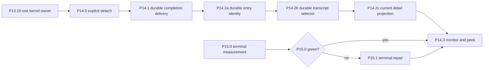

# P14 Async Child Interaction Plan

**Status:** historical
**Completed:** 2026-07-22
**Last verified:** 2026-07-23

> **Ownership:** completed contracts, dependencies, acceptance gates, and
> rollback boundaries for the P14 foreground-detach, child-completion,
> durable-transcript, and multi-Agent TUI program

Root [`migration/PLAN.md`](../PLAN.md) owns execution order and slice state.
Current runtime and TUI facts belong in
[`architecture/runtime/tasks-and-agents.md`](../../architecture/runtime/tasks-and-agents.md)
and [`architecture/tui/README.md`](../../architecture/tui/README.md). Comparative
evidence remains in [`migration/reference/tui/grok-build.md`](../reference/tui/grok-build.md)
and [`migration/reference/tui/pi.md`](../reference/tui/pi.md).

This is a frozen historical contract. Present-tense checklist language below
records the acceptance boundary used during delivery; it is not ready work.

## Decision

P14 is a `combine` decision. It combines Grok Build's explicit child-session
lineage, foreground/background distinction, idempotent completion, lazy replay,
and inspectable child views with Eino-Agent's existing `AgentRunner`,
`RuntimeStateStore`, transcripts, permission coordinator, selectors, and Bubble
Tea projection.

P14 does not copy Grok's Tokio actor, default-background policy, goal harness,
auto-wake loop, or Pager renderer. It starts only after P13.10 leaves one kernel
owner, because implementing new child behavior before the cutover would require
maintaining it in both Legacy and ADK paths.

## Current Baseline And Gap

Verified current behavior:

- foreground `RunAgent` waits in the parent tool call until completion or an
  exact engine-owned detach releases that wait;
- background launch is selected only at creation and runs independently of the
  parent-turn context;
- detach returns a structured `backgrounded` result while the same
  ProjectGraph execution, identity, generation, and terminal owner continue;
- `TaskStop`/`AbortAgent` cancels an addressed child;
- an engine-owned runner is cancelled and given a bounded join attempt on
  Close, while an injected runner remains owned by its outer scope;
- child identity, lineage, transcript path, terminal state, runtime replay, TUI
  thread catalog, detail view, and replay-only restore already exist; and
- terminal completion now persists before publication and reaches the exact
  parent through an at-least-once coordinator transport plus a durable,
  versioned parent transcript receipt.

The accepted P14 product gaps are now closed:

1. P14.2a-c added durable identity, bounded cursor-based selection, and
   generation-safe asynchronous child transcript projection; and
2. P14.3 added a compact read-only monitor and bounded peek without creating a
   second runtime owner.

## Frozen Program Invariants

1. `AgentRunner` remains lifecycle mutation authority; `RuntimeStateStore` and
   the TUI remain projections.
2. `SessionID`, `ThreadID`, `AgentID`, parent lineage, tool-use causation, and
   generation never change when a foreground wait detaches.
3. Detach releases only the parent wait. It does not restart, clone, cancel, or
   broaden permissions for the child.
4. Parent-turn cancellation cancels a still-foreground child. A detached or
   originally background child survives that turn but remains subject to
   explicit abort and its owning runner's Close.
5. Transport may be at least once; durable terminal state and every projection
   must be idempotent by stable identity.
6. Transcript load, replay, monitor, peek, and thread switching never dispatch
   a model, tool, queue item, permission callback, or child control.
7. Foreground remains the default when `run_in_background` is absent. No timeout
   silently converts a child to background in P14.
8. Owner-thread permission and question settlement is unchanged. A read-only
   peek cannot answer another thread's interaction.

## Dependency Graph

Each node is one PR. No slice may absorb the next node merely because its
source files are nearby.

## P14.0 Explicit Foreground Detach

**Completed:** 2026-07-21
**Decision:** `combine`

### User outcome

A user can release a long-running foreground child from the parent turn without
losing the child, duplicating its work, or waiting for completion. The parent
receives the same child ID and can inspect, message, or abort it later.

### Contract

- add one engine-owned detach control addressed by stable Agent ID and
  generation;
- transition the parent wait to a structured `backgrounded` outcome;
- emit one process-lifecycle `backgrounded` transition with unchanged lineage;
- keep the existing child executor and context alive under the runner's
  background supervision;
- make concurrent detach, completion, parent cancellation, and explicit abort
  settle through one winner without goroutine or join-accounting leaks;
- reject detach for an already terminal, already background, stale-generation,
  or unowned child.

### Allowed scope

- `tools/agent_runner.go`, `tools/agent.go`, and `tools/agent_lifecycle.go`;
- narrow engine Agent-control wiring;
- focused concurrency, cancellation, and race tests.

### Excluded scope

- TUI controls or monitor UI;
- automatic timeout-based detach;
- durable parent-wait/detach outcome schema;
- completion delivery persistence;
- changes to child tool/permission capability or the default launch mode;
- changes to transcripts other than existing lifecycle persistence.

### Acceptance gate

- foreground completion before detach returns the normal result once;
- detach before completion returns `backgrounded` once and the same child later
  reaches its real terminal state;
- parent cancellation before detach cancels the child;
- parent cancellation after detach does not cancel it;
- explicit abort still cancels the child;
- owned-runner Close requests cancellation and attempts to join until its
  deadline; timeout is observable in the focused runner test and is never
  described as a completed join or child terminal;
- detach/complete/abort races pass `-race` with no duplicate terminal or wait
  leak.

### Rollback

Remove the detach control and process-lifecycle transition as one additive
behavior. Existing foreground/background launch and durable Agent files remain
readable. P14.0 does not persist or recover the released parent wait; child
terminal durability remains owned by the existing Agent record and P14.1.

### Closeout

- `AgentRunner` now owns one generation-scoped foreground wait lease.
  `QueryEngine.DetachAgent` addresses it by stable Agent ID, generation, and
  parent Session; invalid, stale, terminal, originally background, already
  detached, and unowned requests fail closed.
- Foreground execution runs exactly once in a runner-owned goroutine. Parent
  cancellation is forwarded only while the wait lease remains active; detach
  revokes the lease without replacing the executor context or ProjectGraph
  invocation. Explicit abort and owned-runner shutdown still cancel and join
  the same generation.
- The parent receives one typed `backgrounded` outcome carrying Agent,
  Session, thread, and generation identity. Normal completion carries the same
  identity with a `completed` outcome.
- `SubAgentExecutor.RecordAgentLifecycle` emits one process-local
  `backgrounded` event. `RuntimeStateStore` admits that event in the same
  serialized sequence boundary as live Graph events and reuses the active
  `TurnID`, so the projection remains running without seizing or completing
  the child turn.
- Focused tests cover completion-first, detach-first, parent cancellation on
  both sides of detach, abort, shutdown, wrong owner, stale generation,
  originally background execution, concurrent double detach, and
  detach/completion races. Recorder reentry, failure, and blocked-recorder
  abort/shutdown fixtures prove lifecycle publication runs outside runner
  locks without leaking the claimed wait. A real ProjectGraph fixture proves
  two model calls, one tool call, one generation, and no restart after parent
  cancellation.
- P14.0 changes no Eino or Eino-ext source or dependency. Public Eino Compose
  continues to own Graph traversal; the project-owned runner and runtime store
  own the product-specific wait lease, lifecycle identity, cancellation, and
  projection contract.

## P14.1 Durable Idempotent Completion Delivery

**Completed:** 2026-07-21
**Decision:** `project-native`

### User outcome

A completed, failed, or aborted background child becomes visible to the parent
exactly once as a projection, even when event transport reconnects or the
process/session resumes.

"Exactly once" applies to projection, not transport. Recovery may redeliver the
same durable completion; consumers must collapse it by stable completion ID.

### Contract

- define a versioned `AgentCompletionReceipt` owned by the parent session with
  `CompletionID`, child `AgentID`, generation, terminal status/sequence,
  parent session/thread/tool-use identity, and delivered timestamp;
- derive `CompletionID` deterministically from child identity, generation, and
  terminal sequence rather than display text or delivery attempt;
- persist the child terminal record before publishing a completion notice;
- append the bounded receipt through the parent transcript/checkpoint owner;
  query-local maps may remain caches but cannot be the only dedup guard;
- reconstruct undelivered terminal completions on session resume without
  treating interrupted disk-only children as live;
- make reducer, model-facing notification injection, and TUI status projection
  idempotent by completion identity;
- deliver at the next existing safe parent boundary; do not add auto-wake.

### Allowed scope

- Agent durable metadata and parent transcript/checkpoint receipt records;
- engine completion selection and runtime reducer identity;
- focused restart, reconnect, duplicate-delivery, and truncation-bound tests.

### Excluded scope

- transcript UI or monitor rendering;
- waking an idle model turn automatically;
- a general durable event bus or JSONL-to-database migration;
- changing terminal status names or child cancellation semantics.

### Acceptance gate

- terminal persistence precedes notification publication;
- duplicate transport and replay produce one parent/model/TUI terminal
  projection;
- a crash between terminal persistence and receipt persistence redelivers once
  after resume and then records the receipt;
- unknown receipt versions fail closed for model reinjection while preserving
  diagnostic visibility of the child terminal record;
- bounded receipt projection eviction or an empty compact boundary cannot
  re-inject a completion whose receipt remains in the append-only parent audit;
- stale running metadata restores as interrupted/aborted replay, never as a
  false completion or live control.

### Rollback

The receipt format is additive and versioned. Rollback ignores unknown receipt
records while continuing to read existing Agent terminal metadata; it never
reinterprets a completed child as running.

### Closeout

- `AgentRunner` now commits a versioned terminal completion snapshot in the
  child Agent record before making it eligible for notification. The
  deterministic `CompletionID` binds Agent identity, execution generation, and
  terminal sequence; a resumed generation advances that sequence rather than
  reusing a prior completion.
- `PendingAgentNotificationsForParent` reconstructs retained and evicted
  durable terminals only for the exact parent Session/thread/Agent scope.
  Interrupted disk-only `running` records still normalize to inert aborted
  replay and never become a completion or live control.
- `RuntimeInputCoordinator` remains an at-least-once transport. It persists the
  notification before source acknowledgement, while the parent transcript
  atomically stores the versioned receipt with the model-facing attachment
  before coordinator settlement.
- `LoadFull` exposes only the newest bounded unique receipt projection for
  diagnostics. Correctness does not depend on that cap: recovery scans the
  append-only audit for the small set of current ledger/candidate identities,
  including historical runtime-item and legacy command UUID coverage. Unknown
  receipt versions block the identity from reinjection while leaving the child
  terminal diagnostic readable.
- `RuntimeStateStore` records delivered completion identity and collapses a
  duplicate notification attachment without appending a second parent message
  or mutating the Agent projection twice.
- Focused restart tests cover terminal-before-enqueue, enqueue-before-source
  acknowledgement, transcript-before-settlement, supported and unknown receipt
  versions, legacy Agent metadata, resumed generations, concurrent collection,
  and receipt eviction followed by compact and restart. Repeated race coverage
  passes across runner, transcript, and engine boundaries.
- P14.1 changes no Eino or Eino-ext source, dependency, Graph topology, kernel
  selection, child cancellation, or TUI control. Public Eino Compose continues
  to own traversal; Eino-Agent owns child durability, exact parent identity,
  transcript settlement, and projection semantics.

## P14.2a Versioned Durable Transcript Entry Identity

**Completed:** 2026-07-22
**Decision:** `project-native`

### User outcome

New transcript records have a stable, versioned identity that selectors can use
for pagination and live/durable deduplication. Existing transcripts remain
readable with an explicit legacy fallback boundary.

### Contract

- add an optional versioned entry ID to durable transcript records;
- generate the ID once when a record is first appended and preserve it when a
  replacement/compaction rewrite retains that logical record;
- assign a new ID to newly synthesized replacement or compaction records;
- keep readers backward compatible with records that lack the field;
- define a legacy key from source identity, logical ordinal, timestamp, kind,
  and payload digest only within one transcript revision;
- bind legacy cursors to a transcript revision fingerprint. If replacement or
  rewrite changes the revision, reject the cursor and restart pagination rather
  than claiming cross-rewrite identity;
- never use display text alone as an identity or deduplication key.

### Allowed scope

- transcript persistence/read/replace records and versioned codecs;
- migration-free compatibility tests for old and new JSONL records;
- focused rewrite, compaction, duplicate-content, and cursor-identity tests.

### Excluded scope

- Agent detail selectors or TUI consumers;
- eager backfill or in-place rewrite of existing transcript files;
- session database migration;
- child lifecycle, completion delivery, or runtime event changes.

### Acceptance gate

- new append/read round trips preserve entry ID;
- surviving records keep IDs across supported replace/compaction rewrites;
- two identical messages retain distinct IDs;
- legacy files remain readable and receive revision-scoped keys;
- a legacy cursor is rejected after its transcript revision changes;
- older readers ignore the additive field without losing message content.

### Rollback

Older readers ignore the additive entry field. Rollback stops writing it but
does not rewrite existing files; P14.2b remains blocked until an equivalent
identity contract is available.

### Closeout

- every physical append path writes one additive
  `entry_id {version,id}` envelope using the v1 random 128-bit codec; identical
  messages remain distinct records;
- `LoadFull` now returns the valid physical record sequence and an exact-byte
  SHA-256 transcript revision without changing active-context replay,
  corruption tolerance, receipt recovery, or usage aggregation;
- old JSONL remains byte-identical on read. Its fallback identity binds source,
  valid-record ordinal, timestamp, kind, and full payload digest to the current
  revision; stale legacy cursor validation fails with
  `ErrTranscriptRevisionChanged`;
- compatibility rewrite APIs retain ID and timestamp only for a proven existing
  message record. Synthesized replacement/compact records, rewritten legacy
  records, and branch copies receive fresh identities; and
- focused ordinary/race tests cover every writer, duplicate content and
  repeated pointers, replace/atomic-replace preservation, synthesized compact
  records, legacy revision invalidation, future identity versions, old-reader
  compatibility, and branch source separation. P14.2a changes no child
  selector, TUI, lifecycle, Graph, Eino, or Eino-ext owner.

## P14.2b Bounded Durable Child Transcript Selector

**Completed:** 2026-07-22
**Decision:** `combine`

### User outcome

The engine can page bounded durable evidence for an unloaded, replay-only, or
evicted child without loading every child at startup or duplicating records
already represented by live runtime state.

### Contract

- extend the engine-owned Agent detail selector with bounded transcript pages
  or an opaque cursor for durable-only children;
- merge live and durable records by stable transcript entry identity, never by
  display text;
- mark replay provenance and attach mode explicitly;
- reject stale async pages after the selected child or generation changes;
- never restore pending callbacks, approvals, queued input, or tool execution
  from transcript records.

### Allowed scope

- engine Agent-detail/transcript selectors;
- transcript reader APIs and bounded tests;
- focused engine/transcript selector tests.

### Excluded scope

- any Bubble Tea or presentation-state change;
- new dashboard/peek layout;
- transcript storage-format changes beyond consuming P14.2a identity;
- runtime Agent mutation or lifecycle changes;
- cross-thread interaction settlement.

### Acceptance gate

- first open of a durable child reads only the bounded requested page;
- duplicate live/durable records render once and in source order;
- cursor reuse against another child/generation is rejected;
- selector paging dispatches no model, tool, queue item, or callback.

### Rollback

Remove the paged selector and fall back to the existing bounded in-memory Agent
detail source. No durable record or presentation sidecar requires migration.

### Closeout

- added `transcript.LoadMessagePage`, which pages the frozen active transcript
  context backward with bounded record I/O and returns each page in physical
  source order;
- added `QueryEngine.AgentTranscriptPage`, whose process-local opaque cursor
  binds Agent, Session, thread, generation, path, file identity, prefix, and
  continuation boundary;
- propagated exact transcript entry provenance only after successful durable
  checkpoints, so live/durable collapse never uses display text;
- kept replay-only and evicted projections durable-only and restored no model,
  tool, queue, callback, approval, control, or Session state; and
- covered modern/legacy paging, lifecycle boundaries, duplicate text and IDs,
  append/rewrite/truncate/symlink rejection, stale cursor binding, live merge,
  replay/eviction, and zero-runner dispatch with focused ordinary and race
  tests.

Public Eino Compose remains the Graph traversal owner; project-owned transcript
identity, paging, runtime provenance, and child lifecycle are combined at a
read-only selector boundary. No Eino/Eino-ext source, dependency, Graph
topology, TUI, or storage schema changed. P14.2c is now unblocked.

## P14.2c Existing Child Detail Projection

### User outcome

The current Agent detail and thread-switch views consume P14.2b pages lazily,
reject stale async results, and preserve presentation state without adding a
new monitor or runtime owner.

### Contract

- request pages only for the currently selected child and generation;
- tag every async result with selection generation and discard stale replies;
- merge pages through stable transcript entry identity supplied by P14.2a and
  page/cursor semantics supplied by P14.2b;
- preserve each thread's draft, cursor, scroll, and selected detail tab when
  switching away and back;
- keep replay-only and evicted-transcript controls inert;
- opening, paging, leaving, and returning dispatch no model or tool work.

### Allowed scope

- existing Agent detail, thread navigation, and presentation-state files;
- TUI tests for stale-result rejection, view restore, replay-only controls, and
  bounded pagination.

### Excluded scope

- engine selector or transcript schema changes;
- monitor/peek layout;
- runtime lifecycle, completion, permission, or terminal writer changes.

### Acceptance gate

- first open requests only one bounded page;
- duplicate live/durable rows render once and in selector order;
- rapid child switches cannot apply one child's page to another child;
- replay-only and evicted-transcript views expose no live controls;
- leaving and returning preserves safe per-thread view state;
- focused responsive and no-color tests pass without a new full-screen route.

### Rollback

Remove only the P14.2b consumer path and return existing detail views to the
prior bounded in-memory provider. The engine selector can remain unused and be
removed independently if no other consumer exists.

### Closeout

- wired `QueryEngine.AgentTranscriptPage` into thread switching, Ctrl+B Agent
  detail, and Teams detail through one reusable TUI-local asynchronous pager;
- bound every request and result to Agent, thread, execution generation,
  presentation request generation, and opaque cursor, then re-resolved the
  current selector before application so rapid switches and generation rollover
  discard old results;
- projected one semantic history item per stable `TranscriptEntryID`, falling
  back only to selector message ID, so equal content remains physically
  distinct while exact live/durable identity renders once in selector order;
- retained page/cache state inside each thread presentation view, preserved the
  existing draft, editor cursor, scroll anchor, search, and selected detail tab,
  and requested older pages only when the current view reaches its loaded top;
- made replay-only and evicted-transcript composer, message, pause/resume, and
  abort controls fail closed across all three existing surfaces; and
- covered bounded first-open, continuation order, duplicate display text,
  rapid switch and generation staleness, state restoration, responsive panels,
  no-color output, and read-only control behavior with focused ordinary and
  race tests.

The adoption decision remains `combine`: public Eino Compose continues to own
ProjectGraph traversal, P14.2b owns read-only durable selection, and the TUI
owns only asynchronous presentation state. No Eino/Eino-ext source or
dependency, engine selector/schema, Graph topology, child lifecycle,
permission, or terminal writer changed. This unblocked the P14.3 closeout
recorded below.

## P14.3 Multi-Agent Monitor And Read-Only Peek

### User outcome

The TUI exposes a compact, responsive monitor for scanning child status,
foreground/background mode, current activity, attention, elapsed time, and
terminal outcome. A read-only peek shows bounded recent response/transcript
content before the user explicitly switches to the child thread.

### Contract

- rows come only from canonical `TaskAgentSnapshot`/thread selectors;
- the selected preview comes only from `AgentDetailSnapshot` and the P14.2a-c
  durable transcript path;
- foreground, backgrounded, waiting-input, paused, completed, failed, and
  aborted states have distinct text and no color-only meaning;
- Enter or an explicit command switches through the existing thread-navigation
  action; closing peek restores previous focus and draft;
- compact view may omit preview detail but keeps switching and inspection
  commands reachable;
- no preview action settles permission, answers a question, sends input,
  changes mode, or aborts a child.

### Allowed scope

- one TUI monitor/peek component and existing navigation actions;
- responsive/no-color/reduced-motion tests and PTY scenarios;
- selector call sites, without new runtime mutation state.

### Excluded scope

- a second dashboard runtime store;
- inline permission/Ask actions;
- new terminal writer, renderer framework, alternate screen mode, or image
  protocol;
- auto-wake, goal mode, or nested child orchestration controls.

### Acceptance gate

- multiple active and terminal children remain scannable at compact, standard,
  and wide widths;
- preview loading cannot resize/shift fixed controls incoherently;
- switching to and from a child preserves the previous thread view state;
- stale preview data cannot be sent to another child;
- the terminal gate is green: either P15.0 passed directly, or every reproduced
  P15.0 failure was closed by P15.1 and the same fixture reran green;
- PTY workflows cover open, move, peek, switch, return, resize, completion, and
  terminal restoration.

### Rollback

Remove the monitor/peek route and retain the existing thread picker and Agent
detail views. Runtime state, transcript selectors, and durable completion
records remain valid.

### Closeout

- `/team` is now one read-only monitor whose rows join the canonical
  `TaskAgentSnapshot` and payload-free `ThreadCatalogSnapshot`. It shows
  foreground, originally background, detached `backgrounded`, waiting-input,
  paused, completed, failed, and aborted meaning as text alongside bounded
  activity, attention, elapsed time, and terminal outcome.
- The execution display mode is derived from the exact live `AgentRunner`
  generation when the selector is read. No new runtime event, reducer,
  checkpoint, durable schema, or TUI mutation state was added.
- `Tab` opens one fixed-geometry read-only peek over `AgentDetailSnapshot` plus
  the P14.2 `AgentTranscriptPage` path. Agent/thread/generation/request identity
  rejects stale asynchronous pages, and compact mode retains visible peek and
  switch actions.
- `Enter` delegates to `activateThreadByIDWithCmd`; closing the peek or switching
  away and back preserves the prior thread draft, cursor, focus, and view state.
  The monitor owns no send, permission/question settlement, detach,
  pause/resume, mode-change, or abort provider.
- `/team` is available while the leader request is running. Ordinary,
  no-color/reduced-motion, responsive, stale-page, completion-refresh, and Unix
  PTY tests cover open, move, peek, switch, return, resize, terminal completion,
  and terminal restoration.
- The adoption decision remains `combine`. Public Eino Compose continues to own
  ProjectGraph traversal; Eino-Agent owns runtime selectors and TUI
  presentation. No Eino/Eino-ext source or dependency, Graph topology, child
  execution, permission, persistence, or terminal writer changed.

## Deferred And Rejected Extensions

- `defer`: automatic timeout-based foreground-to-background conversion;
- `defer`: auto-wake or synthetic model turns on child completion;
- `defer`: answering owner-thread permission or Ask interactions from peek;
- `defer`: independent child permission escalation beyond the parent policy;
- `reject`: making background launch the default;
- `reject`: replacing `AgentRunner` with a Grok-style actor or UI-owned child
  coordinator;
- `reject`: loading every child transcript eagerly to simplify rendering.

## Per-Slice Closeout

Every P14 slice must run focused race/restart/replay tests plus `make fmt`,
`make lint`, `make test`, and `make build`; then run `make docs-check`, manifest
validation, and `git diff --check`. Update current architecture only after the
corresponding production owner changes, and move closed narrative to history.
