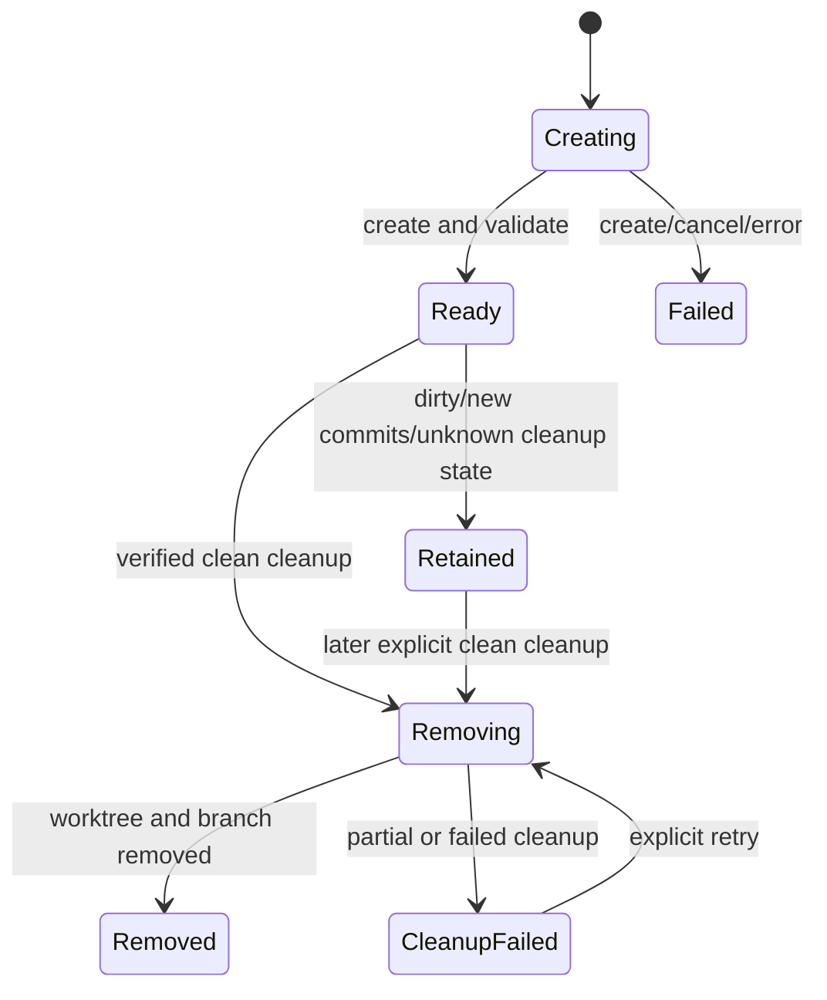

# P18 Worktree Isolation Lifecycle

**Status:** historical
**Completed:** 2026-07-20
**Last verified:** 2026-07-23

> **Ownership:** completed contracts, dependencies, acceptance gates, and
> rollback boundaries for the P18 Agent worktree containment,
> lifecycle service, handoff, cleanup, and recovery program

Root [`migration/PLAN.md`](../PLAN.md) owns execution order and slice state.
Current Agent ownership belongs in
[`architecture/runtime/tasks-and-agents.md`](../../architecture/runtime/tasks-and-agents.md)
and session restore behavior belongs in
[`architecture/tui/contracts/sessions.md`](../../architecture/tui/contracts/sessions.md).
Comparative evidence is frozen in
[`migration/reference/runtime/worktree-lifecycle-audit.md`](../reference/runtime/worktree-lifecycle-audit.md).

This is a frozen historical contract. Present-tense checklist language below
records the acceptance boundary used during delivery; it is not ready work.

## Decision

P18 is a `combine` decision inside the worktree-isolation subsystem. It combines:

- Claude Code Ripe's owner binding, dirty/unknown fail-closed removal, and
  resume/fork ownership rules;
- Grok Build's context cancellation, dirty reporting, and orphan recovery; and
- OpenCode's explicit service and Creating/Ready/Failed lifecycle.

Eino-Agent preserves the useful existing outcome promised by
`Agent(isolation="worktree")` and adapts it behind one project-owned service.
P18 does not combine worktree state with P17 Plan Mode. It also does not accept
the current top-level Enter/ExitWorktree behavior as a target: those unsafe
tools are contained first, and session-level worktree switching remains
`defer` pending a separate user-outcome and project-identity decision.

## User Outcome

An Agent can run in an isolated Git worktree without changing the process
working directory or another session's filesystem context. Creation,
cancellation, retained changes, cleanup failure, and crash recovery remain
observable and recoverable. The parent receives an explicit handoff for changed
work rather than an automatic merge or silent deletion.

## Current Baseline And Gap

P18.H0-P18.2 are complete. Process-global Enter/ExitWorktree names are
unavailable, and `AgentRunner` now consumes the QueryEngine-owned durable
service instead of a process-local manager. Source admission, Ready launch
binding, explicit execution CWD, clean removal, and retained dirty handoff are
production behavior.

P18.2 is complete: restart/session restore discovers bounded versioned records
as projection-only recovery metadata; forks cannot inherit source Agent
authority; interrupted Creating/Removing records are classified at explicit
recovery; and continuation/cleanup retry revalidate exact durable ownership and
fresh Git state.

## Scope And Non-Goals

P18 owns the existing Agent worktree-isolation promise, Git lifecycle service,
owner binding, handoff, cleanup, and recovery.

P18 does not:

- enter or exit Plan Mode;
- share a mode, event, checkpoint, or approval state with P17;
- change the process working directory;
- automatically copy a dirty source workspace;
- automatically commit, merge, cherry-pick, apply, or delete changed work;
- add Git/JJ/overlay/btrfs backends;
- introduce a general worktree pool; or
- re-enable top-level session Enter/ExitWorktree without a later accepted
  contract.

## Frozen State Contract



The service owns a durable record:

```text
WorktreeRecord {
  ID
  OwnerKind: Agent
  OwnerID
  RepositoryIdentity
  RepoRoot
  Path
  Branch
  BaseCommit
  State
  SourceDirtyReport
  ResultDirtyReport
  CreatedAt
  LastErrorCategory
}
```

Display names are not ownership identities. The record does not grant arbitrary
filesystem access; normal tool and permission policies still apply to the
effective child CWD.

## Frozen Program Invariants

1. No production worktree operation calls `os.Chdir`. Every Git command and
   child QueryEngine receives an explicit directory.
2. One service record has one stable owner. Another Agent, resumed fork, manual
   worktree, or display-name collision cannot remove it.
3. `isolation="worktree"` and explicit `cwd` are mutually exclusive at the
   Agent tool boundary. Isolation derives its source from the parent engine's
   effective CWD.
4. Branch and path include stable worktree/owner identity and pass strict slug,
   containment, repository, and existing-ref validation.
5. Creation is not Ready until Git state, path identity, base commit, and child
   CWD are validated. A create response alone is not execution admission.
6. Source dirty state is reported. The default is fail closed; an explicit
   ignore mode may use committed HEAD but must disclose omitted changes.
   Automatic dirty copying remains outside P18.
7. Clean removal is conditional on a fresh final status check owned by the
   removal operation. Dirty, new commits, unknown state, cancellation, or a
   partial failure retains the record and path.
8. Changed work is retained with base commit, branch, changed-file summary, and
   bounded diff/patch handoff. No automatic integration occurs.
9. Crash recovery acts only on records and paths whose project ownership can be
   proven. Unowned or ambiguous worktrees are never removed.
10. Runtime events carry owner/session/thread/Agent identity. TUI and ACP are
    projections and never become cleanup owners.
11. P17 Plan Mode and P18 worktrees remain independently enterable,
    cancellable, persistable, and recoverable.

## Dependency Graph


P18.H0 is a production safety preemption and can land independently of P17 and
P13. P18.0-P18.2 proceeded while the fixture-only P13 kernel evolved where
their source scopes did not overlap. P18.2 has closed the prerequisite, so
P13.9a may migrate child execution without two worktree owners or
process-local recovery.

## P18.H0 Contain Process-Global Worktree Tools

**State:** completed 2026-07-20.

### Contract

- remove EnterWorktree and ExitWorktree from production default registration
  and every model-visible surface;
- reject direct calls from old transcripts or external callers before their
  implementation can execute;
- leave `Agent(isolation="worktree")` available;
- classify the old constructors as outside product closure until removed or
  replaced; and
- update renderer inventory and compatibility tests without creating a new
  session-switch tool.

### Acceptance Gate

- TUI, plain, headless/SDK, ACP, standalone MCP, leader, and child default
  registries cannot invoke the process-global tools;
- no test or production path mutates process cwd through worktree handling;
- Agent worktree-isolation tests remain unchanged and green;
- an old model call receives an explicit unavailable result and no Git/process
  side effect;
- focused registry, renderer, entrypoint, Agent, and race tests pass.

### Delivered Boundary

- `RegisterDefaults` no longer registers EnterWorktree or ExitWorktree, so the
  shared CLI, TUI, headless/SDK, ACP create/resume, standalone MCP, leader, and
  child default-registry chain cannot expose either name;
- `Registry.Register` reserves both names as primary names and aliases and
  refuses the entire custom registration, preventing a caller from restoring
  their model-visible or dispatch surface;
- the final model-visible projection also removes either reserved schema when
  an SDK supplies `Tools` without a registry;
- canonical tool admission and the QueryEngine executor return a stable
  unavailable result for either historical name before JSON parsing, hooks,
  permissions, repeated-call admission, or an executor;
- the exported constructors remain source-compatible unavailable stubs, but
  contain no Git command, package-global lifecycle state, or `os.Chdir`; and
- `Agent(isolation="worktree")` remains registered and continues through the
  independent explicit-child-CWD `WorktreeManager` path.

### Promotion Evidence

- registry and compatibility-stub tests cover default absence, reserved
  primary/alias re-registration refusal, explicit failure, unchanged process
  CWD, and retained Agent registration;
- registry-free SDK projection tests prove caller-supplied reserved schemas do
  not reach the model;
- engine tests replay both historical names with malformed arguments and prove
  unavailable settlement before the configured executor;
- the TUI renderer inventory is synchronized to 39 default tools, while
  focused Agent worktree create/cleanup/dirty-retention behavior remains green;
  and
- focused tools/engine/TUI/ACP/MCP tests and the corresponding race suite pass.

### Rollback

Rollback would restore a known cross-session process mutation and therefore is
not an acceptable long-term compatibility path. If a compatibility emergency
requires the names, retain unavailable stubs rather than the current
implementation.

## P18.0 Context-Aware Worktree Lifecycle Service

**State:** completed 2026-07-20.

### Contract

- replace the in-memory manager contract with an engine-owned service whose Git
  operations accept `context.Context`, explicit directory, and bounded timeout;
- allocate stable worktree identity independent of display name;
- validate repository common-directory identity, path containment, branch/ref
  ownership, and base commit before Ready;
- persist versioned records atomically through Creating, Ready, Retained,
  Removing, Removed, Failed, and CleanupFailed;
- publish structured lifecycle transitions through the existing reducer-first
  runtime boundary; and
- retain an operation record until terminal cleanup succeeds or an explicit
  retained handoff transfers responsibility.

### Acceptance Gate

- same-name concurrent Agents receive distinct identity or a deterministic
  collision error before Git mutation;
- cancellation and timeout leave a categorized recoverable record and no false
  Ready event;
- an existing unrelated branch/path is never reused;
- cleanup failure retains retryable owner/path/base metadata;
- service operations do not hold the registry/runner mutex across Git process
  execution;
- focused service, cancellation, process, concurrency, and race tests pass.

### Delivered Boundary

- every `QueryEngine` constructs an `engine/worktree.Service` rooted under the
  stable project `.eino-agent/worktrees/v1` directory; the service is
  inspectable through the engine, but `AgentRunner` continues to use the old
  manager until P18.1;
- opaque stable IDs, not display names, derive the managed path and branch.
  Project/target Git roots, canonical common directory, path containment,
  absent target/ref, branch, HEAD, and base commit are validated before Ready;
- same-directory synced JSON replacement persists every versioned record
  revision. Creating records survive cancellation, timeout, Git failure, and
  validation failure as categorized Failed records; cleanup failure retains
  owner, path, branch, repository identity, and base;
- Git execution uses explicit directories and `context.Context` under a
  bounded service operation deadline. Record-scoped leases do not serialize
  unrelated worktrees and no `AgentRunner` or registry mutex participates;
- Ready, Retained, Removing, Removed, Failed, and CleanupFailed transitions
  reduce into `RuntimeSnapshot.Worktrees` only after the durable record commit.
  Replay updates the read model without Git, model, tool, or Agent dispatch;
- cleanup uses two fresh clean/identity checks and non-force removal. Ignored,
  untracked, dirty, or ahead work is retained. If a commit races between the
  final check and native Git removal, the service restores the owned branch at
  the recorded path and records CleanupFailed/dirty rather than deleting the
  handoff; and
- the record schema already reserves bounded source/result dirty reports, but
  P18.1 owns their production population and Agent result presentation.

### Promotion Evidence

- service tests cover distinct concurrent identity, path/ref collision before
  Git mutation, caller cancellation, service timeout, unrelated-operation
  concurrency, dirty retention, cleanup retry, atomic store/version rejection,
  and retained recovery metadata;
- real Git process tests cover create/remove and reproduce a commit inside the
  final-check/remove window, proving the original path and ahead commit are
  restored;
- runtime tests prove engine construction, owner/session/thread lineage,
  lossless ordered projection, invalid revision rejection without partial
  mutation, and deterministic side-effect-free replay;
- focused engine/worktree race tests, Windows and Linux cross-compilation,
  independent persistence/concurrency review, repository Makefile gates,
  documentation/manifest validation, and diff hygiene pass.

### Rollback

The record format is additive and versioned. Rollback may read records as
diagnostic retained work but must not route them through the old global tools
or silently delete their paths.

## P18.1 Agent Binding And Explicit Handoff

**State:** completed 2026-07-20.

### Contract

- make `AgentRunner` consume the lifecycle service rather than own a second map;
- reject simultaneous `isolation="worktree"` and explicit `cwd`;
- derive source repository/CWD from the parent QueryEngine execution context;
- capture source dirty status before creation and default to rejecting dirty
  source state with an actionable result;
- allow an explicit ignore mode to start from committed HEAD while recording
  omitted changes; automatic copy remains deferred;
- bind Ready path/base/branch to child launch metadata before model execution;
- on child terminal, remove only a verified-clean worktree; and
- retain changed work with base commit, branch, changed-file summary, and
  bounded diff/patch handoff in Agent result and durable metadata.

### Acceptance Gate

- child filesystem/shell tools, project skills/rules, permission root, and
  nested executor binding use the worktree CWD without changing the
  parent/process cwd; durable memory and transcript remain outside the
  ephemeral worktree under their stable owners;
- dirty source default, explicit ignore, dirty child, new commits, executor
  failure, abort, and clean completion have deterministic outcomes;
- clean completion removes once; changed/unknown state removes nothing;
- foreground and background Agent results expose the same retained-work handoff;
- no automatic merge, apply, commit, or branch deletion occurs for retained
  work;
- focused Agent, session, permission-root, nested-Agent, and race tests pass.

### Delivered Boundary

- `AgentRunner` accepts only a narrow `AgentWorktreeLifecycle` plus
  `AgentWorktreeBinding`; `SubAgentExecutor` supplies its parent
  QueryEngine's service and effective CWD. The old `WorktreeManager` remains an
  exported compatibility helper but has no production runner caller.
- Agent admission rejects unsupported isolation/source values and rejects
  `isolation="worktree"` plus explicit `cwd` before identity reservation,
  durable record creation, Git, or model execution.
- The default source policy requires clean tracked, untracked, and ignored
  state. Explicit `worktree_source="ignore_dirty"` starts from committed HEAD
  and stores a bounded omitted-file report; it never copies source changes.
- Ready record ID/path/branch/base and lineage are written to runtime and
  durable Agent metadata before the executor starts. Foreground and background
  launches share this ordering and lifecycle owner.
- The canonical tool executor carries the child engine CWD. Read, Write, Edit,
  Glob, Grep, LSP, Brief attachments, NotebookEdit, and foreground/background
  Bash resolve relative/default paths from it. QueryEngine owns the persistent
  shell manager and closes it before terminal worktree cleanup; no `os.Chdir`
  or package-global shell owns an Agent worktree.
- A worktree child reloads project-source skills from committed child CWD,
  preserves non-project skill sources, loads permission rules from the child,
  and uses the worktree as its permission project root. Durable memory keeps
  the stable parent project root, while the child transcript is stored under
  AgentRunner output so clean worktree deletion loses neither authority.
- AgentRunner stores resume history plus the first child prompt before executor
  entry. The child QueryEngine consumes that pre-stored first turn once, then
  continues normal transcript checkpoints without duplicate user messages.
- Terminal cleanup calls the service once. Only a freshly verified clean
  record reaches Removed. Dirty, ignored, untracked, ahead, cancelled, unknown,
  or cleanup-failed state retains path/branch/base plus bounded changed files
  and patch disclosure; no merge, apply, commit, force removal, or automatic
  branch integration occurs.
- Worktree-isolated Agent continuation, restart discovery, fork authority,
  interrupted-state classification, cleanup retry, and orphan pruning failed
  closed or remained absent through P18.1; P18.2 subsequently closed every
  accepted item except optional automatic orphan pruning. Model-visible
  recursive Agent remains independently disallowed by the existing child tool
  policy.

### Promotion Evidence

- real Git integration proves dirty-source rejection before model execution,
  explicit ignore from committed HEAD, durable source disclosure, child
  launch through the engine service, clean removal, stable parent/process CWD,
  and retained Agent metadata;
- focused service tests prove source policy, ignored/untracked/ahead reporting,
  rename-safe bounded file summaries, patch truncation, and no Git mutation on
  rejected source;
- AgentRunner tests cover clean, changed, executor-error, ambiguous input,
  background binding, and mutex-free lifecycle execution; tool tests cover
  every relative/default filesystem surface and scoped persistent shells;
- runtime tests prove shared parent/service/child event sequences remain
  contiguous and launch transcript metadata is durable before the first model
  response; and
- focused tools, engine, skills, worktree, and race tests pass before the
  repository closeout gates.

### Rollback

The Agent tool may temporarily reject worktree isolation rather than fall back
to the process-global tools. Retained paths and records remain inspectable;
rollback never interprets an incomplete cleanup as Removed.

## P18.2 Restart Recovery And Cleanup Ownership

**State:** completed 2026-07-20.

### Contract

- discover only versioned project-owned records at startup/session resume;
- restore Ready/Retained/CleanupFailed records as durable metadata without
  dispatching an Agent, model, tool, or Git mutation;
- classify Creating/Removing records interrupted by process death and require a
  fresh status/identity check before retry;
- strip cleanup authority when a session is forked or ownership identity
  changes;
- mark missing paths or mismatched repository identity unavailable while
  preserving diagnostics;
- permit explicit cleanup retry only for the matching owner and only after a
  fresh clean-state check; and
- optionally prune old clean owned orphans only after deterministic ownership,
  age, and clean-state gates pass.

### Acceptance Gate

- process restart restores retained handoff metadata without launching work;
- a fork can inspect but cannot delete the source session/Agent worktree;
- missing path, manual branch change, repository mismatch, dirty state, unknown
  status, and cleanup interruption all fail closed;
- duplicate recovery or cleanup requests are idempotent by worktree identity;
- runtime replay and TUI inspection dispatch no model, tool, Agent, or Git
  operation;
- focused restart, replay, fork, cleanup, PTY/process, and race tests pass.

### Rollback

Unknown records remain diagnostic data. Rollback disables automated cleanup and
leaves worktrees retained; it never falls back to pathname heuristics or force
removal.

### Delivered Boundary

- `Store.List` enumerates only bounded regular `*.json` records under the
  versioned project store. Unknown versions, malformed data, symlinks, and
  filename/record identity mismatches become bounded diagnostics.
- `Service.Discover` performs no Git command. It restores Ready, Retained, and
  CleanupFailed as inspect-only metadata, marks Creating/Removing
  recovery-pending, and marks missing/static project or managed-path mismatch
  unavailable.
- `RuntimeStateStore.RestoreWorktreeSnapshots` rehydrates the latest durable
  projection without a synthetic lifecycle event, thread, sequence, Agent,
  model, tool, or Git operation. Duplicate restore is idempotent by record
  revision.
- Worktree-isolated Agent continuation reconstructs the complete owner from the
  selected source session's durable Agent metadata. It revalidates direct
  parent session, repository common directory, path, branch, status, and branch
  HEAD before executor entry. Interrupted Creating may become Ready only after
  that check; interrupted Removing becomes CleanupFailed diagnostic metadata.
- `QueryEngine.RetryAgentWorktreeCleanup` accepts an Agent ID rather than raw
  owner fields, resolves the immutable owner from durable Agent state, and
  delegates to `Service.RetryCleanup`. Removal repeats clean and identity checks
  at the commit boundary; dirty, missing, mismatched, unknown, and raced states
  remain fail closed.
- Fork metadata clears Agent IDs and worktree path/branch. A fork may inspect
  the shared project read model but cannot continue or clean the source Agent's
  record.

Automatic age-based orphan pruning was optional and is deliberately deferred:
there is no accepted retention age, user-visible policy, or caller authority
for unattended deletion. This does not weaken explicit owner-checked recovery
or cleanup.

### Promotion Evidence

- focused store/service tests cover malformed, unknown-version, symlink,
  missing-path, owner mismatch, branch/common-directory mismatch, unknown
  status, dirty retention, interrupted cleanup, clean cleanup, and duplicate
  concurrent retry;
- AgentRunner tests cover same-process and fresh-runner continuation, exact
  worktree CWD, durable evicted registration, and fork-session rejection;
- engine/runtime tests prove startup rehydration creates no thread/event
  sequence and duplicate projection is stable; and
- focused race plus repository Makefile/documentation gates close the slice.

## Deferred Session-Level Enter/Exit

Reintroducing EnterWorktree/ExitWorktree for the leader session is not accepted
by P18. It requires a separate decision covering:

- whether worktree changes project identity or only effective execution CWD;
- transcript, memory, skills, MCP, permission-root, and additional-dir reload;
- keep/remove/discard confirmation and dirty handoff;
- resume/fork ownership; and
- CLI, TUI, headless, ACP, and standalone MCP availability.

Until that contract is accepted, the names remain unavailable.

## Verification

Each slice runs focused tests for its boundary. Final P18 closeout additionally
runs:

```text
go test -race ./engine ./tools ./internal/tui ./server/acp -run Worktree
make fmt
make lint
make test
make build
go run ./scripts/migration_manifest.go check
make docs-check
git diff --check
```

## Source Owners

| Boundary | Source |
|---|---|
| unavailable top-level compatibility stubs | [`tools/worktree.go`](../../../tools/worktree.go#L9) |
| reserved-name registration and admission | [`UnavailableBuiltinToolReason`](../../../tools/registry.go#L77), [`executeToolCall`](../../../engine/tool_execution.go#L32) |
| durable lifecycle create/cleanup | [`worktree.Service.Create`](../../../engine/worktree/service.go#L99), [`worktree.Service.Remove`](../../../engine/worktree/service.go#L304) |
| Agent isolation binding | [`prepareAgentWorktree`](../../../tools/agent_runner.go#L456) |
| Agent terminal cleanup | [`finalizeAgentWorktreeLocked`](../../../tools/agent_runner.go#L1218) |
| Agent tool input and handoff | [`AgentTool`](../../../tools/agent.go#L79), [`formatAgentWorktreeDetails`](../../../tools/agent.go) |
| engine-scoped tool CWD and shell | [`WithExecutionCWD`](../../../tools/runtime_cwd.go#L16), [`QueryEngine.toolExecutor`](../../../engine/engine.go#L1462), [`ShellManager.ExecuteAt`](../../../tools/bash_shell.go#L283) |
| child worktree skill and permission binding | [`SubAgentExecutor.ExecuteAgent`](../../../engine/subagent.go#L524), [`SkillRegistry.ForProjectDirectory`](../../../engine/skills/skills.go#L193) |
| legacy helper outside product closure | [`WorktreeManager`](../../../tools/worktree_manager.go) |
| session checkpoint worktree metadata | [`persistSessionCheckpointMessages`](../../../engine/session_checkpoint.go#L26) |
| session worktree restore | [`resolveResumedExecutionContext`](../../../engine/session_restore.go#L78) |
| runtime Agent projection | [`RuntimeStateStore.Apply`](../../../engine/runtime_state.go#L350) |
