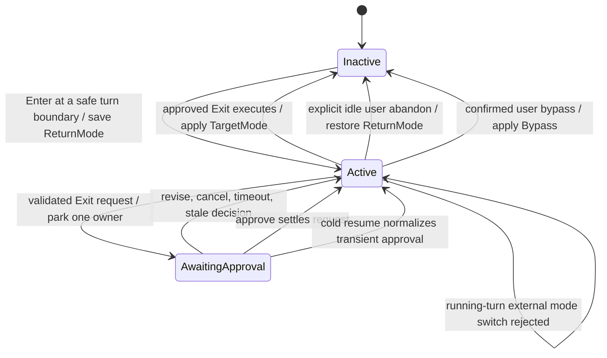
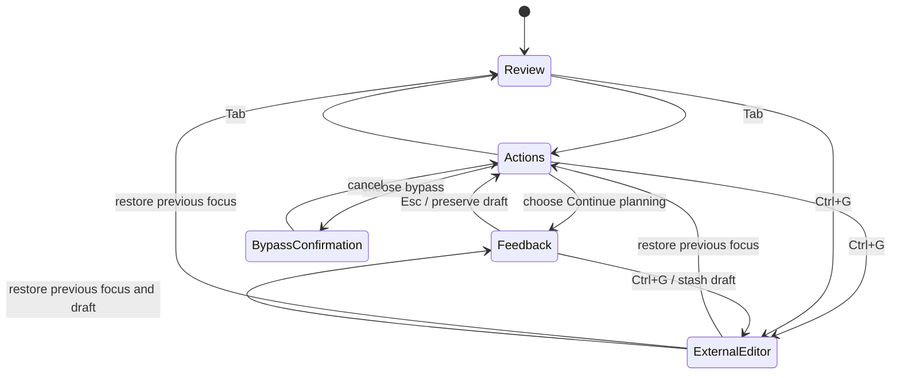

# P20 Plan Mode Interaction And Permission Coherence

**Status:** historical
**Created:** 2026-07-24
**Last updated:** 2026-07-28

> **Ownership:** accepted repair contract, historical delivery baseline,
> adoption decisions, acceptance evidence, and rollback boundaries for
> Plan-file authorization, Plan approval interaction, further-planning
> editing, external-editor restoration, and supported-entrypoint convergence

Root [`migration/PLAN.md`](../PLAN.md) owns execution order and slice state.
Comparative evidence is frozen in
[`migration/reference/runtime/plan-mode-interaction-permission-audit.md`](../reference/runtime/plan-mode-interaction-permission-audit.md).
Current permission ownership belongs in
[`architecture/capabilities/permissions.md`](../../architecture/capabilities/permissions.md);
TUI editing and terminal behavior belong in
[`architecture/tui/contracts/editing.md`](../../architecture/tui/contracts/editing.md)
and
[`architecture/tui/contracts/terminal-lifecycle.md`](../../architecture/tui/contracts/terminal-lifecycle.md).

P20.H0-P20.4 delivered the historical baseline described below. A
post-closeout current-source review on master `cb36859` disproved the complete
interaction and presentation claims. P20.R1 repaired the typed terminal
intent and two-step bypass boundary across TUI, plain, and ACP. P20.R2 repaired
the color and no-color feedback-cursor projection without moving feedback or
runtime state. P20.R3 made the TUI confirmation state visible, reran the full
corrected cross-entrypoint/recovery/race/PTY matrix, and closed G10. Root
`migration/PLAN.md` now promotes G11.A.

## User Outcome

Plan Mode is predictable:

- the model can write only the exact engine-owned Plan file without asking for
  an ordinary filesystem permission;
- entering Plan Mode preserves the prior implementation permission mode;
- exiting presents the reviewed Plan, clearly explains each target mode, and
  changes mode only after a typed user decision;
- “continue planning” has the same essential editing behavior and theme
  quality as the normal composer; and
- returning from Vim or another external editor restores the same approval,
  selection, draft, Plan viewport, keyboard behavior, mouse tracking, focus
  reporting, and full-screen render.

## Reopened Result

The P17 engine lifecycle, exact Plan-file capability, reviewed-byte identity,
bounded review viewport, shared feedback editor, and external-editor terminal
reacquisition remain verified baselines. The original P20.4 closeout did not
prove that adapters obtained the required second bypass confirmation, and its
tests encoded single-action approval on TUI and ACP. P20.2 tests likewise
proved editor geometry and semantic token propagation without asserting the
final caret cell. P20.R1 repaired the authorization findings, P20.R2 repaired
the final visible caret, and P20.R3 found that the TUI confirmation state was
still not rendered. The final repair now exposes risk text plus explicit
No/Yes choices, and the corrected closeout record owns the consolidated proof.

## Decision

P20 is `combine`:

- `preserve` P17 QueryEngine state, exact Plan file identity, runtime
  revalidation, Exit approval ownership, persistence, and recovery;
- `adapt` Claude's explicit-deny-before-internal-capability-before-ask
  precedence;
- `adapt` Grok's shared gate/bypass predicate, typed approval outcomes,
  explicit focus model, and prompt-widget reuse;
- `adapt` Codex's explicit mode transition and running-turn rejection;
- `adapt` Claude/Pi terminal handoff and full repaint; and
- use `project-native` reviewed-document identity, semantic input tokens,
  viewport restoration, and supported-entrypoint projection.

P20 does not make Plan Mode and worktree isolation one feature.

## Current Reproduction And Evidence

| ID | Classification | Current source evidence | Consequence |
|---|---|---|---|
| P20-F8 | resolved by P20.R1 | [`PlanApprovalTargetModes`](../../../engine/permission_interaction.go#L140) de-duplicates every adapter target; [`readPlainPlanApproval`](../../../cmd/yhc/cmd/root.go#L784), [`PlanDialog`](../../../internal/tui/plan_dialog.go#L126), and [`requestACPPlanApproval`](../../../server/acp/agent.go#L1706) require a distinct second action for every bypass target. | TUI/plain/ACP now enter `bypassPermissions` only after explicit confirmation; previous bypass mode follows the same path. |
| P20-F9 | resolved by P20.R1 | [`PlanDialog.PlanResult`](../../../internal/tui/plan_dialog.go#L264) carries the explicit terminal outcome; [`permissionInteractionResult`](../../../internal/tui/app.go#L668) fails closed when that result is absent. | Retained feedback and a generic allow/deny signal cannot turn Esc or force-close into Approve or Revise. |
| P20-F10 | resolved by P20.R2 | [`stylesFromPalette`](../../../internal/tui/theme.go#L407) supplies the semantic cursor in Bubbles pre-reversal form; [`feedbackEditorView`](../../../internal/tui/plan_dialog.go#L908) projects a bounded textual caret only when App-selected terminal capabilities require no color. | Color and no-color frames expose one focused caret at empty/start/middle/end positions without changing the authoritative editor state. |
| P20-A1 | resolved by P40.1, outside G10 | [`ResolveThemeForCapabilities`](../../../internal/tui/theme.go#L321) now preserves allowlisted startup-name polarity and projects invalid values through a typed App warning before fallback. | `light-daltonized` maps to Daybreak at startup; runtime `/theme` remains independently strict. P40.1 closed G12 without changing Plan feedback ownership. |
| P20-A2 | expected behavior, not a correctness gap | [`externalEditorCommand`](../../../internal/tui/external_editor.go#L19) preserves `VISUAL` over `EDITOR`, then delegates to `x/editor`; Unix defaults to nano. | The footer does not explain whether the editor came from `VISUAL`, `EDITOR`, or the platform default. This is optional discoverability work, not a reason to reopen P20.3. |

Focused engine/TUI/plain/ACP tests, affected race suites, and an independent
permission review close P20-F8/P20-F9. Final-cell terminal emulation,
normalized goldens, a real PTY capture, layout/Unicode state checks, affected
race tests, and an independent accessibility/theme review close P20-F10.
P20.R3 additionally proves the confirmation frame is visible and requires a
distinct choice after external-editor terminal reacquisition. The original
reproduction and cross-reference decision are recorded in the
[`Plan Mode interaction audit`](../reference/runtime/plan-mode-interaction-permission-audit.md).

## Scope And Non-Goals

P20 owns:

- `engine` Plan admission and permission precedence;
- typed Plan approval request/decision fields and settlement;
- TUI Plan review, action, feedback, dangerous-mode confirmation, viewport,
  and external-editor presentation;
- the shared TUI external-editor command and terminal-restoration helper;
- TUI, plain/headless, and ACP Plan approval contract tests; and
- current architecture, status, gap, history, and reference synchronization
  when each behavior becomes real.

P20 does not:

- replace the P17 phase machine;
- allow Bash, Agent, generic edits, or arbitrary Markdown during Plan Mode;
- let a persisted permission grant approve `ExitPlanMode`;
- create, switch, merge, or clean a worktree;
- add line-specific Plan comments;
- add a fresh-thread implementation handoff;
- migrate Bubble Tea/Bubbles major versions;
- combine visual-identity work from P19 with Plan behavior;
- add compatibility aliases or palettes for external theme names; or
- replace the accepted `VISUAL` → `EDITOR` → platform-default editor
  resolution.

## Frozen Ownership And State Contract

### Engine State



`PlanState.Revision` remains the lifecycle revision. Presentation focus,
scroll, and editor activity never become durable engine phases.

The idle user-abandon transition is not `ExitPlanMode` approval and never
starts implementation. It is an explicit user-owned TUI/ACP mode-control
request at a safe boundary, restores `ReturnMode`, records an abandon reason,
and cannot carry a new target mode or synthetic implementation instruction.
The same request is rejected while a model turn or approval is active.
Model-initiated `ExitPlanMode` always follows `AwaitingApproval`.

The interactive Shift+Tab path has one narrower user-confirmed exception:
while Plan is idle, choosing bypass in the dedicated risk dialog emits a
typed `user_confirmed` transition to `Bypass`. Cancel keeps Plan active. This
source can target only bypass, cannot be synthesized by a model tool result,
and is rejected while a turn or approval is active. Generic TUI/ACP mode
controls retain the idle-abandon behavior above and cannot use a requested
target mode to bypass typed confirmation.

### TUI Presentation State



The dialog owns one explicit focus enum, one Plan viewport, one reusable
feedback editor model, one selected action, and one external-editor snapshot.
No key is interpreted through an implicit combination of booleans.

## Frozen Permission Contract

### Evaluation Order

| Order | Boundary | Required behavior |
|---:|---|---|
| 1 | Tool registration and selection | An excluded or unknown Write/Edit does not become available merely because Plan Mode is active. Plan Mode never injects a tool excluded by the user's selection; an attempted unavailable write fails with an actionable result. |
| 2 | Plan admission | Tool name, phase, session/Agent owner, absolute clean exact path, and symlink-free identity must match. All other mutations fail closed before prompting. |
| 3 | Hard deny | Pre-tool hook deny and explicit permission-rule deny remain authoritative. They return a denial without an interactive prompt. |
| 4 | Exact Plan capability | Admitted Write/Edit returns allow immediately. It creates no grant, rule, approval-cache entry, classifier request, or denial-tracking event. |
| 5 | Ordinary permission evaluation | Rule allow/ask, mode defaults, cwd reads, session approvals, and classifiers apply only when the operation is not the exact Plan capability. |
| 6 | Runtime revalidation | After any hook/input rewrite and immediately before execution, the same exact Plan predicate is evaluated again. |

`evaluatePlanToolPolicy` must return a typed admission class, not only
`Allowed`. The permission bypass consumes that class so gate and bypass cannot
drift into two path predicates.

### Permission Rule Matrix

| Operation while Plan is active | Explicit deny | Explicit ask | Explicit allow / bypass |
|---|---|---|---|
| exact Plan Write/Edit | deny | allow without prompt | allow, still exact-scoped |
| other Write/Edit | deny | Plan containment deny | Plan containment deny |
| allowed read/search/question | deny | prompt according to ordinary policy | allow according to ordinary policy |
| disallowed mutation/Bash/Agent | Plan containment deny | Plan containment deny | Plan containment deny |
| `ExitPlanMode` | typed Plan approval only | typed Plan approval only | typed Plan approval only |

Hook allow cannot expand Plan containment. Hook deny remains final. A
generic `PermissionAllow`, “Always allow”, session grant, or current bypass
mode can never settle an Exit request.

## Frozen Approval Contract

### Decision Vocabulary

Replace boolean interpretation at adapter boundaries with one typed outcome:

```text
PlanApprovalOutcome =
  Approve { TargetMode, Confirmed, ReviewedPlanDigest }
  Revise  { Feedback }
  Cancel
```

- `Approve` is the only outcome that may execute Exit.
- `Revise` returns feedback to the model, keeps Plan active, does not count as
  a generic permission denial, and does not change `ReturnMode`.
- `Cancel` settles the waiter and returns to active Plan without feedback,
  grants, or denial tracking.
- timeout, session restore, stale owner, and adapter loss normalize to
  `Cancel`, not approve.

Existing exported fields may remain for one compatibility window, but the
engine normalizes them into this enum before settlement and emits only one
canonical event outcome.

### Reviewed Plan Identity

An approve decision applies to bytes the adapter actually rendered:

1. the request carries the exact path and initial content digest;
2. the adapter computes `ReviewedPlanDigest` from the latest rendered/reloaded
   bytes, including a successful external edit;
3. settlement re-reads the exact path and requires the current digest to equal
   the reviewed digest; and
4. a mismatch fails closed to Active with a stale-review message and requires
   a new Exit review.

Both fields use `sha256:<lowercase hex>` over the exact file bytes. They do not
hash rendered Markdown, normalized newlines, paths, or metadata.

Revise and Cancel do not require a digest. The digest is request/decision
integrity metadata, not a second durable Plan phase.

### Target Permission Mode

The first action is “Implement with previous permissions” and maps exactly to
`PlanApprovalRequest.ReturnMode`. Additional unique actions may offer:

- Default — ask before sensitive actions;
- AcceptEdits — automatically allow its documented edit subset; and
- BypassPermissions — disable ordinary permission prompts.

The dialog does not show duplicate modes. Bypass always enters
`BypassConfirmation` and requires a second explicit confirmation. Selecting
one mode changes only the session's post-Plan permission mode; it does not
persist an allow rule or grant a tool family.

## Frozen TUI Interaction Contract

| Focus | Up/Down | Page/Wheel | Enter | Esc | Tab |
|---|---|---|---|---|---|
| Actions | previous/next action | scroll Plan viewport | activate action | typed Cancel to active Plan | Review |
| Review | scroll one rendered line | scroll Plan viewport | no implicit approval | typed Cancel to active Plan | Actions |
| Feedback | move editor cursor/line | editor-owned | submit per shared composer key contract | Actions, preserving draft | shared editor behavior |
| BypassConfirmation | change Yes/No | ignored | confirm/cancel | Actions | ignored |
| ExternalEditor | TUI input suspended | TUI input suspended | editor-owned | editor-owned | editor-owned |

Additional rules:

- the Plan viewport and sticky action/footer regions have independent bounded
  geometry at compact, standard, wide, and tall layouts;
- a wheel event scrolls only when its coordinates hit the Plan viewport;
- feedback uses the existing textarea key contract for Unicode, multiline,
  cursor movement, word movement, paste, undo, and newline/submit routing;
- semantic styles cover input surface, idle/focused border, text, placeholder,
  cursor, selected action, warning, and disabled copy in every supported
  theme/ANSI tier;
- changing theme while the dialog is open restyles all regions without losing
  focus, draft, selection, or viewport; and
- reduced-motion affects blink/animation only, never input visibility.

## Frozen External-Editor Contract

1. Use the existing `github.com/charmbracelet/x/editor` resolver so
   `VISUAL` precedes `EDITOR`, arguments and GUI wait modes are handled
   consistently, and Plan/composer behavior cannot drift.
2. Snapshot request ID, Plan lifecycle revision, exact path, active thread,
   previous focus, selected action, feedback draft/cursor, reviewed digest,
   viewport offset, and terminal capability intent before `tea.ExecProcess`.
3. On callback, reject a stale request/thread/path result before mutating the
   dialog.
4. Re-read the exact file, reset only content-dependent Markdown cache, and
   preserve then clamp the previous viewport instead of resetting to top.
5. Return to the previous focus and keep the approval waiter live on success,
   editor failure, or cancellation. Show a bounded error notification without
   discarding the review.
6. Reassert alternate-screen repaint, focus reporting, bracketed-paste
   expectations, and `tea.EnableMouseCellMotion` when the terminal capability
   snapshot enabled mouse. Refresh dimensions and repaint once.
7. Apply the same terminal-restoration helper to composer external editing,
   because both paths use Bubble Tea `ExecProcess`.

## Program Invariants

1. QueryEngine is the sole Plan phase and approval owner.
2. Plan-file authorization is one exact capability and one predicate across
   projection, permission bypass, and pre-execution validation.
3. Plan containment outranks ordinary permission modes; hard deny outranks the
   scoped capability; the capability outranks ordinary ask.
4. Entering Plan records the complete previous non-Plan mode. Revise, cancel,
   editor failure, timeout, and recovery do not overwrite it.
5. Approve changes mode only after request, lifecycle revision, owner, exact
   file, reviewed digest, target mode, and required confirmation validate.
6. UI focus, viewport, draft, and terminal state are projections and cannot
   settle an approval on their own.
7. A stale external-editor callback cannot alter another thread, approval, or
   Plan file.
8. TUI, plain/headless, and ACP consume the same typed approval semantics.
9. No P20 slice changes worktree state or automatically starts implementation
   in another session.

## Historical Baseline And Active Repair Slices

```mermaid
flowchart LR
    H0["P20.H0 exact Plan capability precedence"] --> S0["P20.0 typed approval and reviewed bytes"]
    S0 --> S1["P20.1 explicit review/action viewport state"]
    S1 --> S2["P20.2 shared feedback editor and styles"]
    S2 --> S3["P20.3 external-editor terminal round trip"]
    S3 --> S4["P20.4 entrypoint and closeout proof"]
    S4 --> R1["P20.R1 typed intent and two-step bypass"]
    R1 --> R2["P20.R2 visible cursor contract"]
    R2 --> R3["P20.R3 cross-entrypoint closeout"]
```



P20.H0-P20.4 remain completed delivery baselines and are not re-executed.
P20.R1-P20.R3 are complete; this ledger is historical.

### P20.H0 Exact Plan Capability Does Not Prompt — Complete

**Observable contract:** an exact admitted Plan Write/Edit bypasses an ordinary
`ask`; explicit deny, tool exclusion, hook deny, wrong path, lexical/path
alias, traversal, and symlink cases still fail closed without a prompt.
Registered tool-name aliases canonicalize to the same Write/Edit predicate;
alternate spellings of the Plan path do not.

Implementation boundary:

- add a typed Plan admission/capability class returned by
  `evaluatePlanToolPolicy`;
- in `wrapCanUseTool`, evaluate explicit deny, then the exact capability, then
  ordinary allow/ask and modes;
- preserve pre-tool hook denial and post-rewrite runtime revalidation; and
- prevent Plan capability decisions from entering generic grants, classifier,
  coalescing, or denial tracking.

Focused acceptance:

- ask rule + exact Write and Edit: execute with zero prompt calls;
- deny rule + exact Write/Edit: deny with zero prompt calls;
- allow/ask/bypass + wrong path: Plan containment denial;
- exact path after a hook input rewrite: revalidated;
- registered Write/Edit aliases resolve to the same canonical predicate;
- relative, non-clean, traversal, symlink, and other path aliases are rejected;
- scoped engine tests and `-race` pass.

Rollback reverts only precedence/classification; no schema or TUI state is
introduced. This was the first independently merged slice after P19 closeout.

### P20.0 Typed Approval And Reviewed Plan Bytes — Complete

**Observable contract:** Exit decisions distinguish approve, revise, and
cancel; approval applies only to the currently reviewed Plan bytes and the
selected target mode; the previous mode is not lost.

Implementation boundary:

- add the typed outcome and digest fields additively to request/decision/events;
- snapshot/validate the Plan digest at supported adapter boundaries;
- make the existing TUI, plain/headless, and ACP adapters emit the typed
  outcome and reviewed digest using their current presentation before strict
  settlement is enabled;
- make `ReturnMode` the default target and validate restoration separately from
  permission expansion;
- require explicit confirmation for bypass;
- keep cold AwaitingApproval normalization and request/revision checks; and
- normalize legacy bool decisions during the compatibility window.

Focused acceptance:

- approve/revise/cancel/timeout/stale-owner tables;
- idle user abandon restores `ReturnMode` without approval or implementation;
  active-turn/awaiting-approval external mode changes are rejected;
- an idle, explicitly confirmed Shift+Tab bypass applies `Bypass`, while
  cancel preserves Plan and active-turn/AwaitingApproval requests fail closed;
- changed bytes after review fail closed;
- user-edited and re-rendered bytes approve with the new digest;
- return Default/AcceptEdits/Auto/DontAsk/Bubble/Bypass modes restore exactly;
- generic allow/session grant/hook allow cannot create Approve;
- event/replay and race tests pass.

Rollback keeps additive fields unread and uses the existing bool normalization;
no persisted phase version changes.

Delivered behavior:

- `PlanApprovalOutcome` is the canonical approve/revise/cancel vocabulary;
- request initial and decision reviewed digests use SHA-256 over exact bytes;
- settlement re-reads the exact Plan path and rejects a stale review;
- TUI reload, plain rendering, and ACP tool-call content report the bytes they
  actually displayed;
- ProjectGraph HITL invocation identity, runtime replay, and the additive
  version-1 checkpoint retain the initial digest;
- legacy bool approval can approve only unchanged initial bytes;
- every known non-Plan `ReturnMode` survives entry, persistence, approval, and
  idle abandon; bypass still requires explicit confirmation; and
- active-turn and AwaitingApproval external mode changes cannot bypass typed
  settlement.

Focused engine, Graph, persistence, runtime replay, TUI, plain, ACP, race, and
repository gates passed at closeout. Delivery evidence is in
[`migration/history/runtime/p20-0-reviewed-plan-approval.md`](../history/runtime/p20-0-reviewed-plan-approval.md).

### P20.1 Explicit Review, Action, And Viewport State — Complete

**Observable contract:** keyboard and pointer behavior is deterministic in
Review versus Actions, a long Plan remains scrollable, and selection/viewport
survive resize and theme changes.

Post-P20.0 current-source revalidation promoted this slice on master
`72ad8266e335`. `PlanDialog` still uses `feedbackMode` plus one implicit key
switch: Up/Down always select actions, Page keys mutate an unbounded integer,
and every wheel event scrolls the Plan regardless of coordinates. The first
action now carries `ReturnMode`, but static AcceptEdits/Bypass actions duplicate
it for those previous modes. Rendering clamps the eventual slice, yet owns no
explicit review hitbox or compact-height layout contract.

Implementation boundary:

- replace `feedbackMode` and implicit routing with an explicit presentation
  state/focus enum;
- give Plan content a bounded viewport and coordinate hitbox;
- render actions/footer as a sticky region outside that viewport;
- build target-mode actions from `ReturnMode` without duplicates; and
- preserve/clamp selection and viewport across resize/theme updates.

The frozen interaction is:

- a new request starts in Review;
- Tab/Shift+Tab switches Review and Actions, while selecting the final action
  enters Feedback without changing the P20.2 editor implementation;
- Up/Down scroll one rendered Plan line in Review and select one action in
  Actions; Home/End target the active region;
- PageUp/PageDown always page the Plan; a wheel event scrolls only inside the
  rendered review rectangle;
- a primary click inside Review focuses it, while a primary click on an action
  focuses and selects that action without submitting it;
- compact rendering drops descriptive chrome before it can hide the bounded
  review, sticky actions, or footer; and
- theme changes preserve focus, selection, and offset, while resize preserves
  them and clamps only to the new rendered bounds.

P20.1 does not add a multiline/shared feedback editor, editor callback
identity, terminal restoration, a separate bypass-confirmation screen, or any
engine/runtime/persistence field.

Delivered behavior:

- `planDialogFocus` makes Review, Actions, and Feedback mutually exclusive;
- `planViewportState` bounds rendered-line offset, height, and total, while
  `planDialogGeometry` publishes exact review and action rectangles;
- key and pointer routing follows the frozen interaction table and App-owned
  modal input cannot reach the chat underneath;
- actions are rebuilt per request with the exact previous mode first and no
  duplicate AcceptEdits or Bypass target;
- compact rendering removes descriptive chrome before review/actions/footer,
  while standard and larger layouts retain the editor/path footer; and
- theme and resize retain focus, selection, and offset with deterministic
  clamping. Visible product wording no longer names Claude.

Focused acceptance:

- table-driven focus/key/mouse transitions;
- compact/standard/wide/tall layout tests;
- long Markdown page, line, Home/End, and wheel scrolling;
- pointer non-leakage to chat;
- theme switch and resize preserve state;
- reviewed golden states for all focus modes.

Rollback restores the old dialog presentation without changing engine
approval semantics.

Focused TUI package and scoped race tests passed. Delivery evidence is in
[`migration/history/runtime/p20-1-plan-review-state.md`](../history/runtime/p20-1-plan-review-state.md).

### P20.2 Shared Further-Planning Editor And Semantic Styles — Complete

**Observable contract:** the final action opens a visible, theme-correct,
multiline editor with the established composer editing behavior; submitting
produces typed Revise feedback and Esc preserves the draft.

Implementation boundary:

- extract/reuse a bounded textarea/editor model and shared key contract instead
  of reimplementing rune editing;
- add semantic dialog-input styles after the P19 palette/style baseline lands;
- define newline versus submit hints from the actual keymap;
- preserve feedback draft/cursor/undo across focus, theme, resize, and Plan
  reload so P20.3 can restore the same state after an external editor;
  and
- ensure Revise does not enter generic permission denial accounting.

Focused acceptance:

- valid UTF-8 and display-width-safe rendering for CJK, combining, and ZWJ
  sequences, with the same rune-based edit boundary as the main composer;
- multiline, word movement, Home/End, delete/backspace, paste, undo, and
  newline/submit tests;
- empty feedback behavior and Esc round trip;
- truecolor, ANSI-256, ANSI-16, no-color, and reduced-motion presentation;
- contrast and theme-propagation gates.

Rollback removes only the shared feedback projection/styles; typed Revise
remains available to non-TUI adapters.

Delivered behavior:

- `newBoundedTextarea` and `textEditorSnapshot` now own the shared bounded
  Bubbles textarea construction, cursor capture/restore, and max-100 undo
  mechanics used by the composer and Plan feedback;
- `PlanDialog` owns a separate feedback textarea and undo history, so its draft
  never becomes the main composer draft;
- the dialog consumes the App's configured key resolver, renders the actual
  submit/newline/undo bindings, and resets pending key chords whenever modal
  focus ownership changes;
- empty or whitespace-only feedback returns to Actions without settling;
  typed Revise returns the draft while Plan remains Active, and Esc preserves
  draft/cursor/undo;
- non-key textarea messages, including bracketed paste completion and cursor
  ticks, remain inside the focused modal instead of reaching the composer;
- six semantic dialog-input styles cover surface, idle/focused border, text,
  placeholder, and cursor across truecolor, ANSI-256, ANSI-16, and no-color
  output; reduced motion keeps the feedback cursor static; and
- a focused engine regression proves Revise bypasses generic denial history
  and counters while preserving the exact prior `ReturnMode`.

The Bubbles v1 textarea remains rune-based for deletion and movement. P20.2
does not claim grapheme-atomic editing or replace the G9 display-cell owner.
P20.3 exclusively owns editor command resolution, terminal capabilities,
stale callback identity, and the real PTY round trip.

Focused editor, theme, layout, keymap, permission, TUI-package, engine-package,
and scoped race tests passed at closeout. Delivery evidence is in
[`migration/history/runtime/p20-2-plan-feedback-editor.md`](../history/runtime/p20-2-plan-feedback-editor.md).

### P20.3 External-Editor Terminal Round Trip — Complete

**Observable contract:** Ctrl+G opens the configured Plan editor and returns to
the exact approval context with working arrows, mouse wheel, page scroll,
focus, full-screen repaint, draft, and viewport.

Implementation boundary:

- share the composer's `x/editor` command resolver and a common editor lifecycle
  result;
- attach stable thread/request/revision/path and presentation snapshot fields;
- restore terminal capability commands, including mouse, in one helper used by
  Plan and composer results;
- reload and digest the Plan without resetting the viewport; and
- surface editor errors without closing or settling approval.

Focused acceptance:

- `VISUAL` precedence, `EDITOR` with arguments, GUI/terminal editor, missing
  editor, non-zero exit, and Unicode path tests;
- stale thread/request/revision/path callbacks are ignored;
- PTY fake-Vim scenario proves alternate screen, repaint, arrow selection,
  mouse wheel, PgUp/PgDown, and continued Plan scrolling after return;
- repeated editor round trips do not leak mouse/focus modes;
- terminal resize during editor execution is applied on return;
- scoped race tests pass.

Rollback keeps the shared resolver but may disable Ctrl+G for Plan approval;
it must not restore the known broken handoff.

Delivered behavior:

- composer and Plan editing now share one project wrapper around `x/editor`
  options; it adds conventional `VISUAL` over `EDITOR` precedence while
  retaining editor-specific arguments, cursor placement, Snap fail-closed
  behavior, and safe argv handling for Unicode or spaced paths; with neither
  variable set, Plan now intentionally matches the composer's `x/editor`
  default (`nano` on Unix, `notepad` on Windows) instead of assuming `vim`;
- every Plan launch captures thread, approval request, Plan revision, exact
  Plan path, and a monotonic dialog generation together with focus, selection,
  feedback, cursor, undo, and viewport state;
- completion validates the active thread-attention owner before reading disk;
  stale callbacks are ignored, while process/read failures remain visible
  errors without closing or settling approval;
- successful reload updates the reviewed-byte digest and restores the exact
  presentation snapshot, with the next render clamping only against current
  Plan content and resized terminal geometry;
- Plan, composer, and suspend/resume reacquisition share one ordered helper
  that resets observed focus, clears for full repaint, and restores eligible
  focus reporting, mouse cell motion, and cursor blink; and
- a real Unix PTY fake-Vim test performs two editor round trips, resizes while
  the editor owns the terminal, then proves alternate-screen repaint,
  direction-key selection, PageUp/PageDown, mouse-wheel scrolling, preserved
  feedback and viewport, and repeated mouse/focus restoration.

No Eino/Eino-ext dependency or QueryEngine production behavior changed.
Focused unit, PTY, TUI-package, and scoped race tests passed at closeout.
Delivery evidence is in
[`migration/history/runtime/p20-3-plan-editor-terminal-round-trip.md`](../history/runtime/p20-3-plan-editor-terminal-round-trip.md).

### P20.4 Supported Entrypoints And Closeout — Complete

**Observable contract:** TUI, plain/headless, and ACP expose the same Plan
phase, exact-file, typed-decision, target-mode, stale-review, cancellation, and
recovery semantics, with entrypoint-appropriate presentation.

Delivered boundary:

- the TUI event path, plain live/pending drivers, and ACP resolver map one
  ProjectGraph request to one targeted typed decision and same-turn resume;
- headless cannot fabricate Plan approval, and standalone MCP excludes every
  `IsPlanModeTransition` implementation;
- engine settlement turns adapter intent into a process-local capability bound
  to the exact request ID only after identity, target, confirmation, exact
  path, and reviewed digest validate;
- cancellation, timeout, adapter loss, and ACP delivery failure emit typed
  `Cancel` and create no generic grants;
- cold AwaitingApproval normalizes to Active and the old request cannot approve
  a later Exit; and
- all current adapters stopped emitting `Approved`. Normalization accepts it
  only as a legacy input, clears it, and omits it from canonical JSON.

The cross-entrypoint positive/negative matrix, cold recovery, adapter
cancellation/timeout/loss, request-bound authorization, focused race suite,
real PTY suite, and repository gates passed at closeout. Delivery evidence is
in
[`migration/history/runtime/p20-4-plan-entrypoint-closeout.md`](../history/runtime/p20-4-plan-entrypoint-closeout.md).

Rollback retains additive wire fields and the legacy reader until one release
after every adapter emits the canonical outcome.

### P20.R1 Typed Intent And Two-Step Bypass — Complete

**Completed:** 2026-07-26. This slice is no longer executable. TUI now carries
an explicit terminal Plan result; TUI/plain/ACP expose unique targets and
require a distinct second action for every bypass target; ACP Back loops reuse
one absolute deadline with fresh transport IDs; and incomplete interactions
fail closed. Delivery and gate evidence is preserved in
[`p20-r1-plan-authorization.md`](../history/runtime/p20-r1-plan-authorization.md).

**Observable contract:** every supported interactive adapter requires two
distinct user actions before approving a bypass target, and the terminal
dialog action—not retained widget text—determines Approve, Revise, or Cancel.

Implementation boundary:

- add a Plan-specific TUI result type carrying the explicit outcome, target,
  reviewed digest, feedback, and confirmation evidence; stop reconstructing
  Plan intent from a generic `PermissionResponse`;
- add `BypassConfirmation` to `planDialogFocus`, with explicit Yes/No
  selection. Choosing any action whose target is `bypassPermissions` changes
  only presentation state; it does not close the dialog or write to its
  response channel;
- make Yes the only path that emits bypass `Approve` with `Confirmed=true`;
  No/Esc returns to Actions without losing review offset, action selection, or
  feedback draft;
- make Actions/Review Esc and `ForceClose` emit typed `Cancel` even when a
  feedback draft exists; only a submitted nonempty feedback action emits
  `Revise`;
- change the plain driver to a small explicit state loop. Selecting any bypass
  target opens a second risk prompt; only the exact documented confirmation
  token approves, a negative answer returns to the action prompt, and
  EOF/cancellation/timeout emits `Cancel`;
- make ACP issue a second `RequestPermission` with a new protocol call ID,
  the same engine request/revision/reviewed digest, only Confirm/Back choices,
  and the remaining parent timeout budget. Capture one absolute interaction
  deadline before request one and derive every request context from its
  remaining duration; request two never receives a fresh full timeout. Back
  reissues the original unique target choices under that same deadline;
  failure, timeout, cancellation, or unsupported delivery emits `Cancel`. The
  server must not fall back to single-selection approval;
- build unique target-mode options from `ReturnMode` for TUI, plain, and ACP;
  a previous mode that is already bypass still follows the same second
  confirmation path; and
- keep `PlanApprovalDecision.Confirmed` false for non-bypass targets and set it
  true only after the bypass confirmation step. Engine settlement remains the
  sole request/revision/path/digest/target validator.

Required deterministic acceptance:

| Scenario | TUI | Plain | ACP |
|---|---|---|---|
| first selection targets bypass | dialog remains open in confirmation | second prompt appears | second permission request is sent |
| confirmation cancelled/rejected | returns to Actions, Plan remains Active | returns to action prompt or typed Cancel on terminal input loss | returns to target choices; protocol cancel/loss emits typed Cancel |
| second explicit confirmation | one typed Approve with confirmed bypass | one typed Approve with confirmed bypass | one typed Approve after the second response |
| previous `ReturnMode` is bypass | no duplicate target; confirmation still required | no duplicate target; confirmation still required | no duplicate target; confirmation still required |
| retained feedback then Esc/close | Cancel with empty decision feedback | not applicable | not applicable |
| first ACP response exhausts the absolute deadline | not applicable | not applicable | second request receives no fresh budget; typed Cancel, no grant or Exit |
| stale bytes/request, timeout, adapter loss | fail closed | fail closed | fail closed |

Focused tests must replace—not preserve—the current assertions that one TUI or
ACP selection is already confirmed. The cross-entrypoint matrix also proves
zero generic grants, exactly-once settlement, no duplicate protocol call ID,
and no model/tool execution before the second confirmation. ACP assertions
must prove request two uses a different transport `ToolCallId`, while the
eventual typed decision retains the original Plan request ID, revision, and
reviewed digest. A fixture where request one consumes nearly all of the
absolute budget must cancel request two without approval; cancelling the
parent context between rounds must do the same.

The focused engine/TUI/plain/ACP tests, affected race suites, repository gates,
and independent permission review passed at closeout, promoting P20.R2.
Rollback reverts the adapter presentation/state changes as one unit and
removes bypass from any entrypoint that cannot retain the two-step contract.
The fail-closed projection omits `plan_bypass` from its offered options, and
an unexpected/stale bypass option ID normalizes to typed `Cancel`; rendering a
working single-action bypass is never an allowed rollback.

### P20.R2 Visible Feedback Cursor — Complete

**Completed:** 2026-07-26. This slice is no longer executable. Delivery and
gate evidence is preserved in
[`p20-r2-plan-feedback-cursor.md`](../history/runtime/p20-r2-plan-feedback-cursor.md).

**Observable contract:** a focused Plan feedback editor always exposes one
unambiguous caret at empty input, text start, text middle, and end of line in
every supported color/accessibility mode, without changing the submitted text
or moving runtime state into the widget.

Implementation boundary:

- define the semantic cursor style in the pre-reversal form expected by
  Bubbles so the final rendered caret background is the selected high-contrast
  semantic color rather than the input surface;
- add an explicit one-cell textual caret projection for no-color output,
  reserving its width so the current character remains visible and editor
  geometry stays bounded;
- keep reduced motion static but visible; blink may hide only an animation
  frame and must restore the same caret cell without draft or cursor drift;
- preserve the independent feedback draft, cursor offset, undo stack, focus,
  viewport, theme-change, resize, and external-editor snapshot contracts; and
- do not add `light-daltonized` aliases or change global startup theme
  resolution in this slice.

Required deterministic acceptance:

- inspect final rendered cells, not only ANSI presence, at empty/start/middle/
  end positions under Polar Night, Daybreak, Snowy, Aubergine, ANSI-256,
  ANSI-16, and no-color;
- assert focused versus blurred and blink-visible versus reduced-motion/static
  states;
- assert caret and text stay inside compact, standard, wide, and tall input
  rectangles after resize and live theme changes;
- retain valid UTF-8 and exact submitted bytes for CJK, combining, Indic, and
  ZWJ input; and
- add normalized golden evidence plus a real PTY capture that distinguishes
  logical ANSI styling from the final visible no-color caret.

Delivered behavior:

- every color palette supplies `DialogInputCursor` in Bubbles'
  pre-reversal form, so the effective terminal cell has the semantic brand
  background and input-surface foreground;
- `App` passes explicit `ColorNone` capability to `PlanDialog`; a render-only
  textarea clone reserves one column and inserts one literal `▏` before the
  current character without changing draft bytes, rune cursor, undo, focus,
  viewport, or runtime state;
- blur and blink-hidden frames omit that projection, while reduced motion
  keeps the same caret statically visible; and
- no startup-theme alias, G12 behavior, Plan decision, or engine lifecycle
  changed.

Final-cell terminal emulation covered Polar Night, Daybreak, Snowy, Aubergine,
ANSI-256, ANSI-16, and no-color at empty/start/middle/end positions.
Compact, standard, wide, and tall layouts preserved exact CJK, combining,
Indic, and ZWJ feedback state across resize and live theme changes.
Normalized goldens, real color/no-color PTY capture, focused normal and race
tests, repository gates, and an independent accessibility/theme review passed,
promoting P20.R3. Rollback restores only the previous cursor projection; it
does not change feedback data or Plan approval semantics.

### P20.R3 Cross-Entrypoint Repair Closeout — Complete

**Observable contract:** current source, focused tests, and real terminal/
protocol workflows jointly prove the frozen Plan interaction contract; no
test encodes single-action bypass or infers an outcome from stale presentation
state.

Delivered closeout:

- the complete TUI/plain/headless/ACP matrix covers approve, revise, cancel,
  two-step bypass, previous bypass mode, stale bytes, timeout, cancellation,
  delivery failure, cold recovery, and exactly-once settlement;
- the repeated external-editor PTY workflow exercises Review,
  Actions, Feedback, BypassConfirmation, arrow/page/wheel routing, and visible
  caret behavior after terminal reacquisition;
- headless and standalone MCP remain fail closed and expose no synthetic
  bypass path;
- static production/test search found no immediate bypass confirmation or
  feedback-text intent inference: the ACP helper issues a real second request,
  and TUI generic permission responses fail closed without `PlanResult`;
- the TUI now renders the previously state-only BypassConfirmation as a risk
  message with explicit No/Yes choices, defaulting to No; and
- current architecture, `STATUS.md`, `REMAINING.md`, this contract, the
  completed-contract index, and the corrected closeout record are synchronized.

P40.1 later closed G12 independently through startup-only polarity aliases and
typed invalid-value diagnostics. Nano remains the expected Unix default when
neither `VISUAL` nor `EDITOR` is configured; optional footer provenance does
not block G10 closure.

## Historical Promotion Result

1. P20.R1, P20.R2, and P20.R3 completed serially and closed G10.
2. P20.R2 passed final-cell assertions, PTY evidence, affected race tests, and
   independent accessibility/theme review.
3. P20.R3 passed the consolidated supported-entrypoint, recovery,
   permission-race, and repeated external-editor PTY matrix, then synchronized
   current architecture, status, gap, index, and history owners.
4. Root `migration/PLAN.md` promoted G11.A into the single `Ready` slot.
5. G12 and editor discoverability remained independent because they do not
   share P20's Plan-approval state owner or acceptance boundary; P40.1 later
   closed G12 without reopening P20.

## Required Repository Gates

Every code slice must pass the applicable focused tests and, before merge:

```text
make fmt
make lint
make test
make build
make lint-new
make docs-check
go run ./scripts/migration_manifest.go check
git diff --check
```

P20.R1 additionally passed the supported-entrypoint and permission race
matrix. P20.R2 passed its final-cell and real-PTY suite plus applicable race
tests. P20.R3 passed the complete supported-entrypoint, recovery,
permission-race, and external-editor PTY matrix. No gate was waived because
generic Plan or terminal tests were green.

## Source Owners

| Boundary | Current source owner | Repair role |
|---|---|---|
| Plan identity and settlement | [`PlanApprovalRequest` and `PlanApprovalDecision`](../../../engine/permission_interaction.go#L103) | Preserve typed request/revision/digest/target validation and exactly-once settlement. |
| TUI interaction | [`planDialogFocus`](../../../internal/tui/plan_dialog.go#L34) and [`PlanDialog`](../../../internal/tui/plan_dialog.go#L126) | Carry explicit confirmation focus and terminal typed result without owning engine lifecycle. |
| TUI decision projection | [`permissionInteractionResult`](../../../internal/tui/app.go#L668) | Consume explicit Plan outcome instead of inferring it from feedback text. |
| Plain interaction | [`readPlainPlanApproval`](../../../cmd/yhc/cmd/root.go#L784) | Add the two-step state loop and unique target actions. |
| ACP interaction | [`makeACPPermissionPrompt`](../../../server/acp/agent.go#L1634) | Issue a second bounded protocol request and fail closed on any incomplete interaction. |
| Cursor semantics | [`stylesFromPalette`](../../../internal/tui/theme.go#L362), [`feedbackEditorView`](../../../internal/tui/plan_dialog.go#L1018), and App terminal capabilities | Keep the final caret cell visible in color and no-color output without mutating authoritative feedback state. |
| External editor | [`externalEditorCommand`](../../../internal/tui/external_editor.go#L19) | Preserve the completed resolver and terminal-reacquisition contract. |
