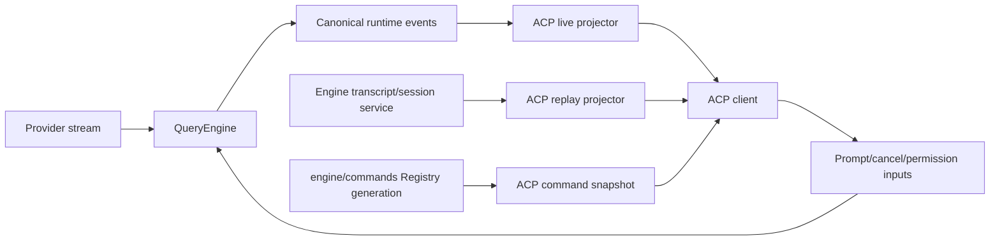

# P23 ACP Adapter Hardening

**Status:** historical
**Execution state:** P23.H0-P23.5 are complete
**Created:** 2026-07-26
**Last verified:** 2026-07-28

> **Ownership:** accepted observable contract and ordered implementation
> slices for ACP safety, conformance, and IDE presentation. Root
> [`migration/PLAN.md`](../PLAN.md) remains the only execution-order owner.

## User Problem

The program began with an ACP entrypoint whose protocol projection was too
stateless to represent complete tool input, command discovery, tool failure, or
durable history correctly. It also advertised load without replay and silently
dropped baseline/resource inputs. P23.H0-P23.3 have closed deletion,
capability-truth, SDK/tool-lifecycle, assistant-identity, and command-discovery
boundaries without widening MCP or ACP v2 scope. P23.4a provided the immutable
replay and restore-staging primitives; P23.4b consumed them for truthful load
and bounded listing. P23.5 completed isolated transactional stdio MCP setup.

The desired outcome is not visual parity with one IDE. It is a truthful ACP v1
contract:

- exact assistant bytes, grouped by stable logical message identity;
- one correlated lifecycle per engine tool invocation;
- complete effective raw input and actual raw output;
- engine-owned commands discoverable with argument hints;
- load/replay, resume, prompt content, MCP inputs, cancellation, and
  capabilities with explicit semantics; and
- deletion contained to the engine-owned session store.

## Admission and Priority

This contract is accepted under `combine`. Root PLAN selected and completed
P23.H0 because it closed an ACP-reachable filesystem containment defect. Root
PLAN then selected and completed P23.4a after current source proved that load
staging could not abort without writing durable state and that ordinary resume
lost the physical identity required for replay validation. Its completion
satisfied P23.4b's prerequisite. P23.4b then completed durable conversation
replay, delivery-before-commit registration, truthful capability
advertisement, and bounded durable-plus-active listing. P23.5 completed
transactional stdio MCP setup on `new`, `load`, and `resume`, atomic dynamic
registry generations, restore-staging manager adoption, and
whole-process-tree cleanup. Official TypeScript SDK v1 and real Zed evidence
closed G17 without adopting an optional transport or making another accepted
program executable.

## Adoption

**Decision: `combine`.**

Use ACP v1 as the wire contract; adapt the stateful live/replay and stable
tool-ID patterns verified in OpenCode and `codex-acp`; use Zed only as client
behavior evidence; and retain Eino-Agent's QueryEngine, event, command,
permission, transcript, and session owners.

Compatibility consequences:

- current clients gain complete command and tool presentation;
- load becomes standards-conformant after replay lands;
- malformed/unsupported prompt or MCP input fails explicitly instead of
  disappearing;
- exact text bytes remain unchanged, so upstream malformed whitespace remains
  visible and diagnosable;
- clients depending on the current unsafe or non-conformant load/delete
  behavior receive no compatibility guarantee.

## Scope

Likely implementation scope:

- `server/acp` protocol negotiation, session binding, live projection, replay,
  and conformance fixtures;
- `engine/execution` or the narrowest existing runtime event boundary needed
  to expose canonical tool lifecycle facts;
- `engine/commands` read-only command snapshot projection;
- `engine/session` validated deletion and durable replay access;
- the narrow `engine` restore-staging lifecycle needed to suppress persistence
  before a restored session is committed;
- provider/stream diagnostics only to establish byte provenance; and
- current architecture, status, gap, and closeout documents.

## Non-Goals

- rewriting QueryEngine as an ACP-native loop;
- copying OpenCode or Codex persistence, actor, command, or permission owners;
- normalizing assistant whitespace;
- adopting ACP v2 before a separate v2 decision, dual-version handler, and v1
  regression matrix are accepted;
- adding image/audio/embedded-resource capabilities;
- exposing model reasoning/thought content;
- inventing an ACP-only command list or dispatch path;
- changing TUI/plain/headless tool presentation; or
- making private `_session/*` extensions part of the portable baseline.

ACP v2 remains a guarded future program. SDK package versions must never select
wire semantics. A future v2 handler must negotiate per connection, remain
feature-flagged, and must not reuse v1 prompt-completion, load, tool-create, or
message-ID assumptions.

## Target Ownership



One session-local projection state owns protocol correlation only:

- the stable ACP message ID for the current logical assistant message;
- tool projections keyed by the engine invocation/call ID;
- whether start and terminal updates have been delivered;
- replacement-safe rendered content state; and
- the last projected full ACP command-snapshot digest.

It does not own execution, durable identity, authorization, or recovery.

## Canonical Event Contract

The adapter must consume typed facts rather than infer execution truth from
display deltas. The narrow runtime boundary should expose, directly or through
an existing event envelope:

| Fact | Required semantics |
|---|---|
| session/thread/turn identity | Existing engine identity; never reconstructed from text |
| logical message identity | Assigned before the first live chunk, stable across the message, and persisted for replay; legacy transcripts use a revision-bound durable fallback |
| tool invocation ID | Created once by the engine and reused for start, progress, permission, result, and failure |
| effective tool input | Complete post-merge, post-normalization input that execution will receive |
| tool state | pending, in-progress, completed, or failed from the execution owner |
| rendered progress/content | Explicit snapshot or delta semantics; adapter cannot guess |
| raw output/error | Actual execution result facts, with redaction policy applied at the owning boundary |
| delivery/sequence metadata | Existing runtime envelope ordering, sufficient to detect duplicates and late events |

If introducing a new public event type would broaden the engine API
unnecessarily, implement the smallest internal normalized lifecycle envelope
shared by ACP and transcript projection. Do not keep both old inference and
new canonical projection as permanent production owners.

## Invariants

1. **Exact bytes:** assistant text is emitted in engine order with no trimming,
   added newline, paragraph folding, or Unicode normalization.
2. **Stable message grouping:** every chunk of one logical assistant message
   reuses one ACP message ID; a final fallback cannot duplicate already
   delivered deltas.
3. **One tool start:** one engine invocation produces exactly one ACP
   `tool_call` start before any update.
4. **Stable tool identity:** all updates reuse the engine invocation ID.
5. **Permission visibility:** a permission request may reference a tool call
   only after the client has received that tool's start.
6. **Visible-tool settlement:** every successfully delivered tool start has
   exactly one v1 completed-or-failed terminal update while transport remains
   writable, including permission rejection, cancellation, and incomplete
   provider events. After a delivery failure, the ledger settles locally and
   the owning operation fails instead of claiming client-visible completion.
   Cancellation uses failed plus the bounded diagnostic defined below.
7. **Canonical raw data:** `rawInput` is the effective complete invocation and
   `rawOutput` is the actual result/error fact, not a presentation summary.
8. **Monotonic terminal state:** pending may become in-progress, then exactly
   one completed or failed v1 terminal update; a cancelled tool is failed with
   a bounded cancellation diagnostic while the prompt returns the v1
   `cancelled` stop reason. Terminal calls cannot reopen.
9. **Replacement-safe content:** ACP content updates carry the complete current
   rendered collection unless the SDK/schema explicitly represents a delta.
10. **Delivery settlement:** a required start, terminal update, replay item, or
   command snapshot delivery error fails or cancels the owning prompt/session
   operation explicitly.
11. **One command owner:** discovery and dispatch read the same
   `engine/commands.Registry`, live `CommandContext`, ACP entrypoint filter,
   and deterministic projected-snapshot digest.
12. **Load/replay:** load projects the complete durable conversation in
    chronological order before returning; resume does not replay.
13. **Replay staging:** replay is validated before delivery; the session is
    registered and hooks start only after replay and setup notifications
    succeed. Failed staging never rewrites the durable transcript.
14. **Capability truth:** unsupported content, additional directories, or MCP
    input is explicitly
    rejected, and no capability is advertised before its path passes
    conformance tests.
15. **Contained deletion:** session IDs are opaque validated identifiers;
    resolved deletion targets and owned sidecars remain under the configured
    session root.
16. **Prompt-scoped cancellation:** cancelling one ACP prompt does not destroy
    the reusable session or unrelated sessions.
17. **Privacy:** byte provenance records sizes, hashes, sequence, and escaped
    test fixtures by default, never private prompt/tool bodies.

## Protocol Projection

### Assistant text

- Allocate one message ID when the first assistant delta for a logical message
  is observed.
- Reuse it for all adjacent and tool-interleaved chunks belonging to that
  logical message according to engine message boundaries.
- Forward content exactly.
- If the provider yields only a final message, emit it once. If deltas were
  already emitted, suppress an equivalent final fallback.

### Tool lifecycle

- On the first canonical invocation event, send `tool_call` with stable ID,
  title, kind, pending/in-progress status, and any already-known canonical raw
  input.
- Deliver that start before any permission request carrying the same
  `toolCallId`. If the permission path wins a race, it must first deliver or
  de-duplicate the start.
- If effective input becomes known after start, send one
  `tool_call_update.rawInput`; late raw input is valid in ACP v1 and current
  Zed.
- Send progress as a full replacement-safe content snapshot.
- Map execution failure or engine error metadata to `failed`. Current v1 has no
  cancelled tool status, so tool cancellation uses failed plus a bounded
  cancellation diagnostic while the prompt returns `cancelled`. Send
  completed only for an actual success.
- Include semantic kind and locations where deterministically derived. Preserve
  raw output independently of rendered text.
- If a start was delivered and the provider omits a later lifecycle fact, the
  prompt settlement path must synthesize one terminal update from engine-owned
  outcome state; it may not leave a visible pending card indefinitely.

### Commands

- Read
  `GetCommandRegistry().ListForContext(ctx, EntrypointACP, Engine.CommandContext())`.
- Canonically serialize the ordered visible rows using name, description, and
  projected input hint, then digest that serialization. This full projection
  digest, not `PromptCommandGeneration` alone, is the snapshot identity.
- Send a full `available_commands_update` after new, load, resume, and fork.
  Recompute after a prompt settles, after a successful mode/config option
  change, and after a prompt-command generation swap observed at an ACP
  boundary. Send again only when the full digest changes.
- Derive name and description directly; derive the unstructured argument hint
  from canonical usage/argument metadata.
- Keep prompts as ordinary command text so the existing dispatcher remains
  authoritative.

## P23.3 Promotion Characterization

The P23.3 promotion gate closed on 2026-07-28. This section records the
pre-implementation facts and exact owner boundaries used to promote the slice.
Current implemented behavior belongs in
[`acp-adapter.md`](../../architecture/platform/acp-adapter.md), and delivery
evidence belongs in
[`p23-3-acp-assistant-commands.md`](../history/runtime/p23-3-acp-assistant-commands.md).

### Persisted logical assistant identity

Current production has two different facts that must not be conflated:

- `execution.ProcessStream` emits provider chunks as `EventAssistant.Message`
  while accumulating one final assistant message for the model round. Neither
  path assigns a logical message ID.
- `QueryEngine.recordTranscriptMessages` persists messages, then
  `attachTranscriptEntryIdentity` may attach the physical
  `record/message-index` identity. That identity exists only after durable
  encoding and cannot identify the first live chunk.

P23.3 assigns the single logical-identity write owner to an engine-internal
assistant projection emitter at the `queryWithKernel` yield boundary. That
boundary already has the injected UUID dependency and precedes both the
QueryEngine transcript callback and every entrypoint:

1. the first assistant event after `EventStreamRequestStart` receives one UUID;
2. adjacent and tool-interleaved assistant content reuses that UUID until the
   next stream-request boundary or terminal settlement;
3. the emitter writes the UUID to the engine message's internal
   `message_id` metadata before either the legacy assistant event or canonical
   assistant delta is yielded;
4. conversation-history merging retains the same metadata, the transcript
   persists it without deriving a second ID, and model-request normalization
   strips it before provider submission; and
5. ACP consumes only the canonical assistant delta and maps the UUID to the
   pinned `coder/acp-go-sdk v0.13.5` optional **UNSTABLE** `messageId`
   extension; it never allocates or repairs IDs.

`TranscriptEntryID` remains the physical durable provenance owner. It is not
renamed, copied into `message_id`, or used for live grouping. Legacy
transcripts without `message_id` remain a P23.4b replay concern.

For final reconciliation, the emitter retains the active logical message's
already-delivered bytes only for the prompt lifetime. A final-only message is
emitted once; an exact already-delivered final is suppressed; a final with the
exact delivered bytes as a prefix emits only the remaining suffix. Any other
delta/final mismatch fails projection rather than duplicating or rewriting
bytes. Diagnostics retain only the bounded ID, byte lengths, SHA-256 digests,
and sequence, never assistant content.

`messageId` is not claimed as portable ACP v1 baseline or ACP v2 behavior.
P23.3 accepts the pinned extension under the existing `combine` decision and
must add an exact raw-JSON golden plus the pinned Go SDK round trip. A client
that ignores the optional field still receives the same ordered
`agent_message_chunk` bytes but does not gain stable grouping. Message IDs and
command notifications have independent rollback flags; disabling message IDs
omits the field without disabling or rewriting assistant content. Any SDK
upgrade, client rejection, field removal, or wire-shape change reopens the
P23.1 compatibility gate before the extension can remain enabled.

### Complete projected command snapshot

`engine/commands.Registry` remains the definition, visibility, ordering, and
dispatch owner. P23.3 adds one immutable, SDK-neutral discovery snapshot from
`ListForContext(ctx, EntrypointACP, Engine.CommandContext())`:

```text
CommandDiscoverySnapshot
  rows[] in registry discovery order
    name
    description
    optional unstructured input hint
  sha256(canonical JSON rows)
```

The canonical ACP row uses the registered canonical name without `/` and the
registered description without adapter-authored replacements. The input hint
is the trimmed portion of `Usage` after an exact leading `/<name>`; if that
portion is empty or the usage prefix is not canonical, ordered `ArgDef`
metadata supplies `<name>` for required arguments and `[name]` or
`[name=default]` for optional arguments. No-argument commands omit the input
object. The canonical JSON distinguishes an omitted input from an empty hint,
preserves row order, and contains exactly the fields sent on the wire.

This full row digest is the only replacement identity. A prompt-command
generation revision or digest is merely a recomputation trigger: it excludes
compiled commands, the ACP filter, active capability resolution, and the final
wire rows, so ACP must never compare or publish it directly. ACP maps the
snapshot to SDK types but does not filter, sort, describe, or invent argument
hints.

### Protocol refresh and delivery settlement

Each ACP `Session` owns only a mutex-protected last-successfully-delivered
command digest. The mutex serializes recompute, compare, notification delivery,
and digest commit; a failed notification never advances the digest.

| Boundary | Required recomputation and delivery |
|---|---|
| successful new session | after the engine and session exist, before the method returns; always send one full snapshot |
| successful load or resume | after locating or restoring the session and before the method returns; always send one full snapshot, without adding replay to resume or re-advertising load |
| successful unstable fork | after child restore and before the method returns; always send one full child snapshot |
| `SetSessionConfigOption` success | after model/effort commit and before the response; send only if the full digest changed |
| `SetSessionMode` success | after mode commit and before the response; send only if the full digest changed |
| prompt settlement | after the engine stream drains and every command action has committed, before the prompt response; recompute on engine success, cancellation, and failure while transport remains writable, and send only if the full digest changed |

Prompt settlement covers successful prompt-command reload, model/effort,
working-directory, fork/resume, Plan/mode, and future context-sensitive
command actions at one committed ACP boundary. A rejected generation or failed
mutation retains the old engine state and therefore produces no replacement
unless another committed context change made the projected rows differ.
Current settings-watch and asynchronous-hook paths do not own command
generations and are not refresh sources.

If an earlier required prompt notification already failed, the adapter drains
the engine stream but performs no later command-snapshot write. The last
delivered digest remains unchanged.

An initial snapshot failure removes the newly registered active session and
joins its hooks through the existing `Session.close`/`QueryEngine.Close`
boundary. A failed new session must remove only its newly owned durable
artifacts through the existing session-deletion owner; a failed fork closes
the child before using the existing owned-fork rollback. A newly restored
load/resume session is closed and unregistered but retains its durable session;
normal close may write its ordinary checkpoint. An already-active load/resume
session remains active. Non-persisting restore staging is deliberately not
introduced by P23.3; P23.4a later delivered that prerequisite without changing
this P23.3 command-settlement behavior.

A notification failure after a config, mode, or prompt commit does not pretend
to roll back durable or provider state: the operation reports delivery
failure, retains the session, leaves the digest uncommitted, and retries the
complete snapshot at the next boundary.

This characterization promotes only P23.3. It does not add replay snapshots,
legacy replay IDs, truthful load, bounded list cursors, stdio MCP, ACP v2,
additional-directory admission, or a second command/session state owner.

### Session setup and prompt content

- `load`: restore, read durable conversation facts, project replay, send the
  command snapshot and restored state, then return.
- `resume`: restore execution state and command snapshot without conversation
  replay.
- Text and ResourceLink blocks preserve client order and both reach the model
  through an engine-owned `PromptInput`/block representation rather than an
  ACP-only concatenation rule. Text block bytes remain unchanged. A
  ResourceLink preserves URI, name, and available metadata; the adapter never
  dereferences it or expands filesystem/network authority. A provider without
  native resource-link parts receives one deterministic, bounded descriptor
  from the engine/provider boundary. ResourceLink is ACP v1 baseline and cannot
  be declared away. Unsupported optional rich content returns a typed protocol
  error.
- Until additional-directory support has one canonicalized workspace and
  permission-root owner, keep the capability unadvertised and reject non-empty
  input. A request must never silently widen or appear to widen filesystem
  authority.
- Until per-session stdio MCP lifecycle is implemented, reject non-empty MCP
  server inputs explicitly as an interim fail-closed behavior. This is safer
  than silent loss but does not satisfy ACP v1, which requires stdio MCP
  support. The closing MCP slice must define isolation, connection failure,
  registry generation, cancellation, shutdown, and credential/logging
  behavior. HTTP/SSE remain unadvertised unless separately implemented.

## Durable Replay Contract

`session.ResumeSession(...).Messages` is sufficient to restore model context
but not sufficient to project ACP history: it has lost the physical durable
identity needed for replay de-duplication. P23.4a added one read-only session
service result:

```text
SessionReplaySnapshot
  revision
  ordered items[]
    durable message identity
    persisted logical message identity, when available
    role/content/tool calls/tool result
    known success/failure/cancellation fact
```

### P23.4 replay and staging boundaries

P23.4 is split into two independently reviewable rollback boundaries:

- **P23.4a** adds only the engine/session primitives and focused proof. It does
  not change ACP handlers, wire output, list behavior, hook registration, or
  capability advertisement.
- **P23.4b** consumes the completed primitives to stage and validate load,
  deliver portable replay/state/commands, register only after delivery, add
  bounded list cursors, and re-enable truthful load.

The P23.4a replay snapshot is one revision-bound value selected with the same
lifecycle-boundary rule as `session.ResumeSession`. Each active item retains
its exact `transcript.MessageEntryIdentity`; a legacy record identity remains
valid only for the snapshot revision. Returned message facts are deep copies
or are exposed through clone-on-read accessors:
mutating the caller's result cannot mutate another item, a subsequent
snapshot, engine state, or persisted bytes. The read path never opens an
append writer, repairs an identity, checkpoints, compacts, or rewrites the
transcript. Any corruption, duplicate durable identity, an orphan tool result,
a duplicate tool-call ID, or an unsettled/unknown tool outcome fails the whole
snapshot before returning any item.

The P23.4a restore-staging lifecycle is selected before engine restore begins.
It suppresses the target-session checkpoint currently written by normal
resume. Before commit, abort releases owned runtime resources without invoking
checkpoint persistence or any transcript write/sync path and is idempotent.
Commit is a one-way transition to the ordinary engine lifecycle; after commit,
normal `QueryEngine.Close` persistence remains unchanged. Aborting a committed
or ordinary engine fails closed rather than silently weakening persistence.
Cancellation before or during snapshot construction returns no partial value.
Abort runs bounded cleanup independently of the failed load request's canceled
context and cannot leave a permission wait or asynchronous hook task.
P23.4a does not decide ACP registration or notification order; P23.4b owns
those wire-facing transitions.

It selects the same final active conversation context as engine resume, while
preserving `transcript.MessageEntryIdentity`. It never writes, checkpoints, or
repairs the transcript.

| Durable fact | ACP v1 replay |
|---|---|
| user message | `user_message_chunk` under one stable message ID |
| assistant text | `agent_message_chunk` under one stable message ID, exact bytes |
| assistant tool call | one `tool_call` with stable tool ID and canonical raw input |
| paired tool result with known success | one completed update with raw output and rendered content |
| paired tool result with known failure or cancellation | one failed v1 update with an explicit diagnostic fact; cancellation also remains visible in session/turn state |
| system/developer/internal lifecycle record | restored internally but not exposed as portable conversation content |
| private status/plan metadata | projected only through an explicitly advertised portable or private surface after baseline replay |
| unknown conversation role, orphan tool result, duplicate ID, or tool outcome that cannot be settled | fail the load before sending any replay item |

Logical message identity is assigned before live delivery and persisted with
the durable message. A legacy record without that field uses the
revision-bound durable message identity as a deterministic fallback. ACP's
optional v1 `messageId` field requires UUID format: reuse a valid persisted
logical UUID; a present non-UUID logical ID fails the whole load. Only an
absent logical ID derives UUIDv5 from a versioned privacy-safe tuple. A modern
row uses `(session ID, persisted entry version/ID, message index)`; a legacy
row uses `(session ID, physical record ordinal, message index)`.
Snapshot revision validates the legacy ordinal but is not UUID input. The
snapshot may expose the read-only ordinal needed by this projection without
changing the durable schema. Namespace and tuple encoding are covered by wire
goldens. No path, timestamp, private message bytes, payload digest, transcript
revision digest, or content hash enters the UUID. Tool calls reuse a non-empty
persisted engine call ID; a legacy missing ID uses
`<privacy-safe-message-uuid>/tool/<index>` only after uniqueness and pairing
validation. Internal revision-scoped transcript keys are never copied onto the
wire.

Before the first notification, the replay projector validates every item,
derives all message/tool IDs, parses canonical tool input, pairs every tool
result, and builds the complete ordered ACP update list. User and assistant
text bytes are projected exactly. Durable non-text/rich conversation facts
that P23.4b cannot represent fail the whole load; they are not stripped or
reordered and remain P30 work. System/developer/private lifecycle rows remain
internal as recorded above.

Load follows one staging state machine:

1. reject an already active session as a typed conflict;
2. read and fully validate one immutable replay snapshot;
3. restore an engine into an unregistered, hook-free staging owner;
4. deliver replay, restored portable state, and the initial command snapshot
   in deterministic order;
5. only after all required delivery succeeds, commit the staging engine;
6. with no remaining fallible setup step, atomically register the session,
   start ACP hook delivery, and return the load response.

Any failure before commit aborts the staging owner without persisting a
checkpoint or rewriting the transcript. If transport failure occurs after
some notifications, the disconnected client may have a partial local view,
but the server must leave no registered session, hook, prompt, or permission
wait behind. After commit, registration and ACP hook startup are non-fallible
in-memory transitions under the same lifecycle lock; no fallible notification
or setup step may be inserted between them. The current ordinary
`QueryEngine.Close` persistence behavior is not a valid staging abort.

Session listing reuses one `engine/session` bounded selector rather than adding
an ACP page cache or cursor registry. ACP captures an immutable active-session
overlay under the existing session-registry lock; the selector merges it with
durable candidates, de-duplicates by stable session identity, applies one
deterministic order and page/scan bound, and encodes `nextCursor`. Cursor
identity includes a versioned canonical query fingerprint plus durable
candidate and active-overlay generation. Malformed, cross-query, replaced, or
stale cursors fail closed. This preserves visibility of a newly active session
whose first transcript record has not been written yet without allowing a
process-local row to bypass page bounds.

## P23.5 Transactional Stdio MCP Contract

ACP v1 requires stdio MCP support as session setup, not as an optional
capability bit. The current Go SDK exposes descriptors on `session/new`,
`session/load`, and `session/resume`; current Zed constructs all three requests
from the same project MCP list. P23.5 therefore supports all three inactive
setup paths. Load keeps replay-before-response, while resume remains
no-replay. An already-active load remains a conflict.

The accepted setup shape is deliberately narrower than the SDK union:

| Input | P23.5 contract |
|---|---|
| stdio descriptor | supported after full request validation |
| HTTP, SSE, or ACP transport | explicit unsupported error before mutation |
| server count | at most 16 per request |
| server name | non-empty, at most 128 bytes, unique before and after MCP normalization |
| command | non-empty absolute path, at most 4096 bytes, executed directly without a shell |
| arguments and environment | at most 128 entries each per server; all strings NUL-free; environment names match `[A-Za-z_][A-Za-z0-9_]*` and are unique |
| aggregate descriptor string bytes | at most 1 MiB per request |
| child working directory | resolved session CWD |
| child environment | inherited environment with one deterministic descriptor overlay; no `$VAR` expansion |
| setup time | earlier of caller deadline and 60 seconds, with at most four concurrent launches |

All descriptor, source-name, normalized server-name, and project-config
server-name collisions are rejected before launch. A client name that collides
with a project-config server is not silently replaced or treated as
equivalent; the request fails without exposing either configuration. Tool
names exist only after initialize plus `tools/list`; the complete discovered
set is then checked against every other candidate and the current registry
before any manager or registry publication. A discovered collision aborts all
prepared clients. Configuration acceptance is not tool-invocation authority.
Every projected tool retains
`ToolOriginMCP`, dynamic/network capability facts, and the existing P28
fail-closed permission path.

One engine-owned prepare/commit/abort transaction replaces the current
incremental `ConnectServer` plus `RegisterToolsInRegistry` setup pattern for
this entrypoint:

1. validate and canonicalize the complete request without launching;
2. start, initialize, and list tools for every candidate into an unpublished
   prepared owner;
3. construct and collision-check the complete manager/registry generation;
4. commit manager and registry visibility together only after every candidate
   is ready; or
5. abort all prepared clients and process trees on any error or cancellation.

The generic project-config loader may continue tolerating an individual
configured-server failure, but the client-supplied ACP set is all-or-nothing.
The transaction composes with the already-loaded project manager and does not
create an ACP-only execution registry. Registry replacement and manager
revision are one linearization boundary; partial rows are never model-visible.

Load prepares the combined MCP generation before its first replay
notification. The prepared owner is carried by restore staging so
`CommitRestoreStaging` adopts it instead of reloading and replacing it. After
replay, restored state, and commands have been delivered, commit, session
registration, hook startup, and response retain the P23.4b order with no new
fallible step between commit and registration. Abort closes the prepared
generation without checkpoint or transcript writes.

Inactive resume uses the same non-persisting staging and prepared-manager
handoff but emits no conversation replay. New prepares setup before session
registration or durable session creation. For an already-active resume, an
empty descriptor list preserves the active setup. A non-empty list is
idempotent only when its canonical process-local fingerprint exactly matches
the active setup; matching disconnected servers are transactionally
reconnected, while any mismatch returns a typed conflict without mutation.
Fingerprints and raw descriptors are process-local and are never durable.

The manager owns registry cleanup for its entire lifetime:

- `tools/list_changed` freezes one global registry generation, removes that
  server's old rows from the comparison view, checks the candidate against
  every built-in and other-server row, and publishes only if the generation
  still matches;
- discovery, collision, or generation-compare failure deliberately removes
  that server's complete old generation and marks/disconnects it unavailable
  instead of retaining possibly stale rows;
- unexpected connection close removes that server's model-visible rows and
  marks it unavailable;
- no refresh can overwrite another server; and
- existing registry execution leases preserve calls already dispatched across
  a generation change.

Session close, Agent close, request cancellation, setup timeout/failure,
restore abort, and unexpected child exit converge on the same bounded shutdown
owner. It first closes stdin and waits, then terminates and finally kills the
direct child plus descendants on supported hosts. Cleanup is idempotent and
cannot leave a child, monitor goroutine, manager client, registry row, session,
hook, prompt, or permission wait alive.

`engine/mcp` owns the stdio transport factory that implements this boundary. It
configures an OS-specific process group or job tree and supplies the SDK
transport/session without exposing process ownership to ACP or `tools`.
Neither ACP nor the manager invokes a shell. Linux and Darwin use a dedicated
process group; Windows uses a job/tree owner with close-time descendant
termination. A host build that cannot provide and test descendant containment
must reject ACP stdio setup before launch; direct-child-only cleanup is not an
accepted fallback.

The adapter may retain secrets only in the in-memory process configuration
needed for the active connection. Descriptor command, arguments, and
environment values never enter ACP errors, inventory/status projection,
transcript/checkpoint/session metadata, or logs. Stable failures identify only
the descriptor index and a bounded reason code.

## Error and Extension Boundary

P23.1 freezes the exact Go SDK numeric/wire mapping before handlers change.
The project-level categories are:

| Failure | Stable category |
|---|---|
| malformed session ID, cursor, content block, additional directory, or MCP descriptor | invalid parameters |
| missing durable session | not found |
| load/delete against an active session or duplicate prompt | conflict |
| unsupported but well-formed optional content or transport | unsupported |
| restore, projection, or required notification delivery failure | request failed |

Messages are bounded and exclude private prompt/tool bodies. Stable
machine-readable codes may live under one advertised `_meta` namespace; an
unadvertised private update is never a substitute for a standard result,
error, or session update.

## Protocol-Version Guard

P23 targets v1 only. The conformance harness must send initialize requests for
versions 1 and 2 and prove that this adapter selects v1 without exposing any
v2-only method or update. Adding v2 requires a separate accepted plan with:

- per-connection v1/v2 handler selection;
- an explicit feature flag and separate generated schema fixtures;
- v2 prompt acknowledgement plus `state_update` completion;
- v2 message/tool upsert and required message-ID semantics;
- resume `replayFrom` instead of v1 load; and
- the complete v1 regression matrix.

An SDK package upgrade that changes generated shapes, dispatcher
cancellation, error encoding, or validation is treated as a compatibility
change even when the negotiated protocol remains v1.

## Ordered Candidate Slices

P23.H0-P23.5 are complete. P23.4 remains split across two historical rollback
boundaries. Root PLAN selects no executable P23 slice.

| Order | Slice | Atomic outcome | Main proof | Rollback |
|---:|---|---|---|---|
| 1 | P23.H0 (complete) | Harden existing `engine/session.DeleteSession` for opaque-ID and resolved-root containment, then delegate ACP delete to it with active-session coordination and owned-sidecar cleanup. | Traversal, absolute-path, separator, symlink, non-owned-file, active-session, sidecar, and normal-delete tests; see the [closeout](../history/runtime/p23-h0-session-deletion-containment.md) | Disable ACP delete advertisement and handler |
| 2 | P23.H1 (complete) | Reduce false claims and silent loss immediately: disable load; reject a non-empty list cursor until bounded pagination lands; add agent identity; implement ordered baseline ResourceLink ingestion; reject unsupported rich content, additional directories, and non-empty MCP input with stable errors. | Capability/error matrix plus ResourceLink-only, mixed-order, rich-block, additional-directory, cursor, and MCP fixtures; see the [closeout](../history/runtime/p23-h1-acp-capability-truth.md); G17 remains open for stdio MCP and bounded listing | Retain verified new/resume/list/close and baseline prompt behavior |
| 3 | P23.1 (complete) | Add v1 SDK/schema characterization, v2 negotiation guards, exact error mapping, and the canonical internal message/tool lifecycle envelope without changing client output. | Version 1/2 initialize, generic/request cancellation, fragmented JSON, interleaving, error, progress, exact-byte, race, and delivery-failure fixtures; see the [closeout](../history/runtime/p23-1-acp-sdk-envelope.md) | Remove unused envelope; current projector remains sole owner |
| 4 | P23.2 (complete) | Replace stateless tool projection with one stateful lifecycle ledger; enforce start-before-permission and exactly-one terminal settlement; delete the old inference path. | One start/terminal, permission ordering, rejection/cancel/disconnect settlement, stable ID, complete raw input/output, failed status, replacement-safe progress; see the [closeout](../history/runtime/p23-2-acp-tool-lifecycle.md) | Revert projector while retaining characterization fixtures |
| 5 | P23.3 (complete) | Add persisted logical assistant identity, delta/final de-duplication, byte-provenance diagnostics, and registry/context-owned command snapshots. | Byte identity, persisted message-ID grouping, full snapshot digest and triggers, argument hint, no-duplicate fixtures, and the [closeout](../history/runtime/p23-3-acp-assistant-commands.md) | Disable message IDs/command updates independently; exact bytes remain |
| 6a | P23.4a (complete) | Add a revision-bound, mutation-isolated session replay snapshot with durable message identity and a preselected restore-staging lifecycle whose abort cannot persist. Preserve ordinary resume/close semantics; add no ACP behavior. | Final-active-context equivalence, persisted/legacy identity, mutation isolation, cancellation, invalid/orphan/unknown rejection, exact durable bytes, deferred-activation and close-race proof, ordinary-close regression tests, and the [closeout](../history/runtime/p23-4a-replay-restore-staging.md) | Remove the unused prerequisite APIs before P23.4b; no ACP wire, capability, or durable schema changed |
| 6b | P23.4b (complete) | Consume the completed primitives to implement durable load replay and bounded list cursors, commit/register only after required delivery, re-enable truthful load, and preserve no-replay resume. | Multi-turn user/assistant/tool mapping, deterministic UUID fallback, unsupported-rich rejection, replay/setup delivery failure, exact response ordering, hook/map cleanup, active-load conflict, active/durable page merge, cursor query/generation rejection, page-bound tests, and the [closeout](../history/runtime/p23-4b-acp-replay-bounded-listing.md) | Disable load and retain bounded first-page listing with explicit cursor rejection; durable store stays unchanged |
| 7 | P23.5 (complete) | Implement transactional per-session stdio MCP setup on new/load/resume, one manager/registry generation, restore-staging adoption, process-tree cleanup, and dynamic registry settlement; remove superseded incremental/dead paths. | Validation/collision, multi-server atomicity, exact process input, cancellation/timeout, new/load/resume ordering, abort/close/descendant cleanup, list-changed/connection-close registry tests, official TypeScript v1 subprocess harness, real Zed smoke, race and repository gates; see the [closeout](../history/runtime/p23-5-transactional-stdio-mcp.md) | Restore explicit non-empty-MCP rejection without claiming G17/full v1 conformance; keep HTTP/SSE/ACP transports unadvertised |

P23.H0 and P23.H1 are intentionally separate rollback boundaries. A security
fix must not be coupled to a protocol capability change.

P23.H0 completed every ID, active-session, ownership, and resolved-root
preflight before filesystem mutation. It removed the ACP map-deletion path:
an active target is rejected without closing or unregistering it, and an
inactive target delegates to the shared session service. It did not add a
multi-file transaction or promise rollback after a valid deletion began; the
existing session-service sidecar error contract remains unchanged.

P23.H1 removed the false load claim while retaining the unadvertised legacy
handler, added stable agent identity, and moved ordered Text/ResourceLink
fallback rendering into engine-owned `PromptInput`. Resource descriptors are
deterministic, bounded, and never dereferenced. Unsupported rich blocks,
additional directories, MCP setup, and non-empty cursors now return bounded
structured errors before model or session mutation. It did not implement
durable replay, bounded pages, stdio MCP, optional rich media, or ACP v2.

P23.1 characterized the real `coder/acp-go-sdk v0.13.5` connection rather
than inactive helpers. Version-1 and version-2 initialize requests both return
the v1 shape; current method, parameter, project-unsupported, handler, and
cancellation errors are pinned by numeric code and data; typed prompt
responses wait for prior notifications; and an SDK-level golden records exact
assistant bytes, fragmented/interleaved repeated starts, progress replacement,
completed-on-error, delivery failure, and session isolation. The additive
`CanonicalProjectionEvent` has a closed versioned assistant/tool union and is
deliberately ignored by the current ACP projector, so P23.1 changed no client
output.

P23.2 delivered these production insertion points and owner assignments:

| Fact | P23.2 source and owner |
|---|---|
| tool start and identity | The committed `schema.ToolCall` at `executeToolCall` entry, before repeated-tool or permission interaction can publish a request |
| complete effective input | The final `currentInput` after hooks, permission rewrite, canonical registry resolution, and Plan/policy revalidation, encoded immediately before `ToolExecutor` |
| progress | The tool-scoped `WithProgressFn` callback, normalized by the engine lifecycle builder into a complete rendered snapshot |
| terminal result and failure | The normalized `execution.ToolResult` returned by `ExecuteCommittedToolCalls`, after synthetic cancellation and context-modifier failure have settled |
| redaction | One engine lifecycle builder applies the project-owned raw diagnostic redaction policy before attaching a canonical event to `QueryEvent`; ACP projects the already-redacted fact and is not a second redaction or logging owner |

`tool_start` may omit input so it can precede permission. Exactly one later
`tool_input` carries the final JSON object when dispatch input is known.
`tool_terminal` carries only normalized completed/failed truth. The embedded
`RuntimeEventEnvelope` remains the session, turn, sequence, and causation
owner. The old tool inference path was deleted when this producer and consumer
became active; the inactive envelope did not become a parallel runtime.

## Acceptance Matrix

| Scenario | Required observation |
|---|---|
| Text chunks `["a", " ", "b"]` | Client receives exact `"a b"` bytes under one logical message ID |
| Valid Markdown containing blank lines | Blank lines remain byte-identical |
| Upstream chunks containing `"\n\n"` between words | ACP preserves them and diagnostics identify the pre-ACP boundary; no normalization |
| Tool JSON split at every byte boundary | One start; later complete canonical raw input; one terminal update |
| Tool returns `is_error=true` | Terminal status is failed and raw output/error is retained per policy |
| Permission request races tool start | Client receives the referenced tool ID before the permission request and never receives a duplicate start |
| Permission rejection, prompt cancellation, or disconnect after start | Every delivered tool start receives exactly one terminal settlement while transport remains writable; server state never remains pending |
| Progress emits `A`, then `B` | Client presentation contains the intended complete state, not an accidental replacement loss |
| Two concurrent sessions use the same model call IDs | Projection state remains session-isolated |
| Prompt command generation or live command context changes | The full projected digest changes only when visible rows change, and one complete replacement snapshot matches dispatch |
| Read a replay snapshot without loading ACP | The returned items equal ordinary resume's final active context, retain exact physical identities, are mutation-isolated, and leave every durable byte unchanged |
| Abort an unregistered staged restore | No checkpoint/transcript byte changes, file creation, asynchronous hook task, or permission wait survives; repeated abort is harmless |
| Load a mixed multi-turn transcript | All durable items replay in order before the load response |
| Replay a user row or legacy assistant row without logical UUID | The same versioned UUIDv5 is derived from session plus persisted entry ID/index or legacy physical ordinal/index across repeated snapshots; revision validates legacy scope but no path, payload digest, content bytes, or content hash participates |
| Replay contains unsupported rich conversation content | Load fails before the first update; no text-only projection silently drops the rich fact |
| Resume the same transcript | No conversation replay occurs |
| Replay contains an orphan tool result or unknown terminal outcome | Load fails before the first update and leaves transcript, registry, hooks, and active-session map unchanged |
| Client disconnects during replay | The staging engine aborts without a checkpoint or transcript rewrite and no session/hook remains registered |
| ResourceLink-only prompt | Resource is preserved or the request fails explicitly; never empty success |
| Non-empty unsupported additional directories | Request fails explicitly and filesystem/permission roots remain unchanged |
| Valid stdio MCP set on new/load/inactive resume | Every server is ready before session visibility or replay; its collision-free tools use the ordinary registry and permission path |
| One server in a multi-server setup fails or setup is cancelled | Every prepared child/process tree is closed; no manager client, registry row, active session, hook, prompt, durable write, or permission wait survives |
| HTTP/SSE/ACP descriptor, malformed union, duplicate/normalized server collision, relative command, invalid environment, or exceeded bound | The complete request fails before launch or mutation with only descriptor index and a bounded reason code |
| Discovered MCP tool collides with another candidate or current registry row | The complete prepared set aborts before publication; every child/process tree closes and no tool row appears |
| Active resume repeats the exact stdio setup | The existing generation is reused or matching disconnected servers are transactionally reconnected; a different setup returns conflict |
| MCP `tools/list_changed` or unexpected server exit | The candidate compares against a frozen global generation excluding only its prior rows; it publishes atomically or all rows for that server are removed |
| Session/Agent close with a descendant-holding stdio server | Direct child and descendants terminate within bounded cleanup and no monitor or registry residue remains |
| Session list traverses durable and active rows | One bounded stable page de-duplicates the lock-frozen active overlay with durable rows and returns an opaque `nextCursor` |
| List query or durable/active generation changes | A malformed, cross-query, replaced, or stale cursor fails closed instead of restarting or duplicating a page |
| Client initializes with protocol version 2 | v1-only adapter answers version 1 and emits no v2 shape |
| Delete ID contains traversal or separators | No path outside the session root is touched |

## Verification

During implementation, use scoped tests for fast iteration, then run:

```bash
make fmt
make lint
make test
make build
make docs-check
git diff --check
```

Each projection slice also requires `go test -race ./server/acp` and a captured
SDK-level notification trace. Replay/deletion slices require engine session
tests; provider byte diagnostics require focused provider fixtures. P23.5
completed both the official TypeScript SDK v1 subprocess harness and a real
Zed smoke record.

## Promotion Gates

- P23.H0 completed while P22.H0 remained closed and root PLAN recorded it as
  the sole `Ready` slice.
- P23.H1 completed after root PLAN selected it and its H0 dependency was
  satisfied.
- P23.1 completed after SDK-level wire fixtures described current behavior
  without asserting inactive helper behavior.
- P23.2 completed the committed-call start, final pre-dispatch input,
  normalized execution result, progress normalization, engine-owned
  redaction, session-local ledger, permission ordering, and old-path deletion
  boundary. Delivery evidence is in
  [`p23-2-acp-tool-lifecycle.md`](../history/runtime/p23-2-acp-tool-lifecycle.md).
- P23.3 completed on 2026-07-28 after implementing the characterized persisted
  logical-message identity owner, full projected command digest,
  protocol-boundary refresh triggers, delivery-failure settlement, exact SDK
  wire, and ACP race proof. Delivery evidence is in
  [`p23-3-acp-assistant-commands.md`](../history/runtime/p23-3-acp-assistant-commands.md).
- P23.4a completed on 2026-07-28 after adding the immutable replay snapshot,
  non-persisting staging lifecycle, deferred runtime activation, exact durable
  byte proof, ordinary resume/close regressions, and commit/abort/close race
  coverage. Delivery evidence is in
  [`p23-4a-replay-restore-staging.md`](../history/runtime/p23-4a-replay-restore-staging.md).
- P23.4b is promoted as the sole `Ready` slice after P23.4a completed and
  current ACP source proved that Load still bypasses both prerequisite owners,
  sends no durable conversation replay, registers before required delivery,
  and List still has no bounded cursor. Promotion additionally freezes UUIDv5
  legacy message identity, full pre-delivery projection validation, exact
  commit/register ordering, and one engine/session-owned durable-plus-active
  page generation.
- P23.4b completed on 2026-07-28 after implementing strict prebuilt replay,
  privacy-safe UUIDv5 wire identity, replay/setup failure abort, exact
  delivery-before-commit/register/hook ordering, truthful capability
  advertisement, and bounded generation-bound durable-plus-active listing.
  Delivery evidence is in
  [`p23-4b-acp-replay-bounded-listing.md`](../history/runtime/p23-4b-acp-replay-bounded-listing.md).
- P23.5 is promoted as the sole `Ready` slice after current source proved
  non-empty MCP is still rejected on all three setup entrypoints; the official
  v1 contract, TypeScript SDK 1.3.0, and current Zed source proved those
  descriptors are real new/load/resume inputs; and the existing incremental
  manager plus restore reload path proved that prepare/commit/abort,
  registry-generation, and process-tree cleanup boundaries must be frozen
  before implementation. Explicit rejection remains the rollback boundary,
  but G17 and the ACP v1 conformance claim cannot close until the slice passes
  schema and real-client proof.
- P23.5 completed on 2026-07-28 after implementing strict descriptor
  admission, bounded all-or-nothing setup, one owner-scoped registry
  generation, restore-staging adoption, dynamic refresh/close settlement, and
  Darwin/Linux plus cross-compiled Windows process-tree ownership. The
  official TypeScript SDK v1 harness and real Zed smoke proved client
  forwarding, discovery, invocation, failure, cleanup, and the remaining G20
  rich-replay boundary. Delivery evidence is in
  [`p23-5-transactional-stdio-mcp.md`](../history/runtime/p23-5-transactional-stdio-mcp.md).

## Documentation Closeout

Every completed slice updates the narrow current owner in
[`architecture/platform/acp-adapter.md`](../../architecture/platform/acp-adapter.md),
the affected ACP gap entries in [`REMAINING.md`](../REMAINING.md), and current
facts in [`STATUS.md`](../STATUS.md). P23.2 closed G18, P23.3 closed G19,
P23.4a narrowed G16, P23.4b closed G16 plus the bounded-listing part of G17,
and P23.5 closed G17. G20 retains provider byte provenance, provider-rich
durable replay, and cross-shape real-client rendering. This contract is now
historical; P23.5 delivery evidence is in
[`p23-5-transactional-stdio-mcp.md`](../history/runtime/p23-5-transactional-stdio-mcp.md).
Reference snapshots stay historical and never become runtime authority.
