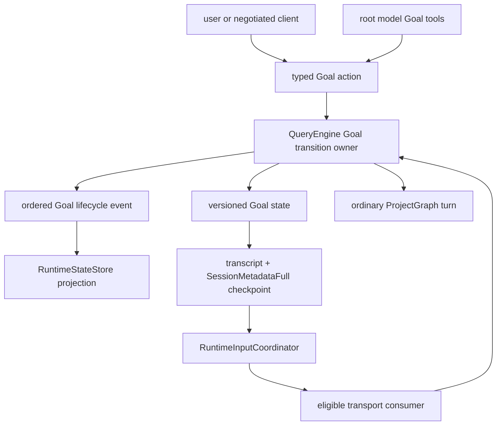
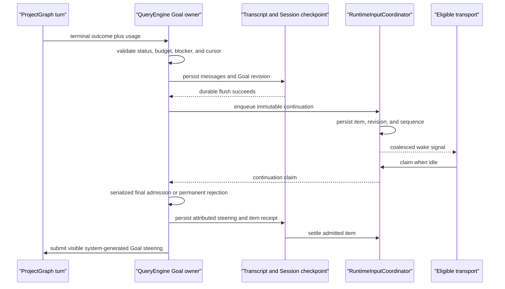

# P24 Durable Goal Lifecycle

**Status:** historical
**Current execution:** P24.1-P24.5c complete; P24.6 default promotion deferred
**Created:** 2026-07-26
**Last updated:** 2026-08-01

> **Ownership:** completed opt-in contract, historical slice decisions,
> entrypoint semantics, verification gates, and rollback boundaries for
> persisted Goal execution. Root [`migration/PLAN.md`](../PLAN.md) alone owns
> executable order and slice state.

Comparative evidence is frozen in
[`durable-goal-lifecycle-audit.md`](../reference/runtime/durable-goal-lifecycle-audit.md)
and the focused
[`headless-goal-execution-audit.md`](../reference/runtime/headless-goal-execution-audit.md).
Current query, session, runtime-input, and budget behavior remains owned by
[`query-engine.md`](../../architecture/runtime/query-engine.md),
[`sessions.md`](../../architecture/state/sessions.md),
[`runtime-events.md`](../../architecture/tui/contracts/runtime-events.md), and
[`budgets-and-limits.md`](../../architecture/runtime/budgets-and-limits.md).
The reproduced gap remains in [`REMAINING.md`](../REMAINING.md).

P24.1 completed the isolated versioned persisted state, engine-owned transition
service, checkpoint sampling, and cold-normalization boundary. P24.2a then
completed ordered Goal lifecycle projection, exact root/descendant identity,
root active time, pending completion intent, and blocker enforcement. P24.2b
completed the transcript-backed exact provider ledger, one root/child
admission gate, usage coverage, recovery, and budget transitions. Their
delivery evidence is
[`p24-1-durable-goal-state.md`](../history/runtime/p24-1-durable-goal-state.md)
and
[`p24-2a-goal-lifecycle-projection.md`](../history/runtime/p24-2a-goal-lifecycle-projection.md),
plus
[`p24-2b-goal-provider-accounting.md`](../history/runtime/p24-2b-goal-provider-accounting.md).
P24.3 has now completed the feature-disabled durable continuation item/cursor
lifecycle. Its evidence is
[`p24-3-durable-goal-continuation.md`](../history/runtime/p24-3-durable-goal-continuation.md).
P24.4 completed the off-by-default saved-root TUI command/tool/progress and
dedicated continuation consumer. Its evidence is
[`p24-4-tui-goal-workflow.md`](../history/runtime/p24-4-tui-goal-workflow.md).
P24.5a completed the matching saved-root Plain command/tool/progress consumer
with one stdin broker and visible dedicated continuation. Its evidence is
[`p24-5a-plain-goal-consumer.md`](../history/runtime/p24-5a-plain-goal-consumer.md).
P24.5b completed the first explicit bounded headless Goal consumer. Its
evidence is
[`p24-5b-bounded-headless-goal.md`](../history/runtime/p24-5b-bounded-headless-goal.md).
P24.5c is complete. P24.6 closed the default-on promotion decision as
`defer`: no shipped numeric budget, default change, measurement store, or
compatibility-seam deletion is accepted. The opt-in contract remains current.

## User Outcome

A user can attach one measurable objective to a saved root thread and let the
agent continue across several turns without repeatedly typing “continue”.
While it runs, the user can inspect progress, steer the conversation, edit or
pause the objective, resume it after supplying missing information, change its
budget, or clear it.

The Goal stops predictably when it is complete, persistently blocked, usage
limited, budget limited, explicitly paused, or cancelled. Process restart does
not lose an eligible Goal or duplicate a continuation. Goal execution never
expands tool visibility, permission, sandbox, worktree, provider, or child
authority.

## Decision

P24 is `adapt`:

- adapt Codex's persisted per-thread Goal, active-only idle continuation, user
  controls, model terminal-status tools, and budget visibility;
- preserve `QueryEngine` as the conversation and transition owner;
- preserve transcript/session checkpoints as durable execution-context truth;
- preserve `RuntimeInputCoordinator` as the only live-input queue and delivery
  ledger;
- preserve ordered runtime events as a bounded read model rather than recovery
  authority; and
- add project-native budget safety, blocker enforcement, Plan exclusion, and
  explicit TUI/plain/headless/ACP capability boundaries.

P24 does not copy Codex's SQLite/App Server structure. It does not accept Grok
Build's planner/strategist/summarizer/classifier harness, actor rewrite, or
automatic child wake-up.

## Scope And Non-Goals

P24 owns:

- one versioned persisted Goal snapshot per saved root thread;
- one engine-owned transition service and read API;
- Goal lifecycle events and runtime read-model projection;
- Goal-bound root/descendant identity, provider usage, active-time, and budget
  accounting;
- one typed durable Goal continuation item and its checkpoint, enqueue, claim,
  settlement, restart, and cancellation ordering;
- `/goal` controls and the model-visible Goal read/terminal-status tools;
- TUI, plain, explicit headless Goal execution, and negotiated ACP behavior;
- feature gating, rollout evidence, rollback draining, and superseded-owner
  cleanup; and
- reference, plan, gap, current-architecture, guide, status, verification, and
  history synchronization at the lifecycle points that own those facts.

P24 does not:

- alter the ordinary one-turn contract when no Goal is active;
- allow Goal and Plan Mode to own the same turn;
- allow a model to create, edit, resume, clear, or expand a Goal budget without
  typed user/system authority;
- treat one `TerminalCompleted` event as proof that the Goal is complete;
- infer token usage from characters, estimates, context-window size, or the
  currently disconnected token/price trackers;
- persist callback channels, model handles, tool registries, permission
  decisions, or execution grants in Goal state;
- let a child or review agent complete, block, pause, or replace its parent
  Goal;
- create another scheduler, queue, database, background daemon, or hidden
  recursive `SubmitMessage` loop;
- make standalone MCP conversational; or
- enable the Grok multi-role Goal harness.

## Ownership Model



`QueryEngine` is the only owner allowed to mutate Goal state or decide whether
a continuation is eligible. Commands, tools, TUI controls, plain input,
headless flags, and ACP requests carry typed intent into that owner. The
runtime reducer and every UI are projections.

The durable Goal snapshot belongs in `SessionMetadataFull` as an independent
versioned nested record. It is presentation-free and contains no live
authority. `RuntimeInputCoordinator` separately owns pending delivery. No Goal
state is reconstructed from prose in the transcript.

## Goal Entity And State Machine

### Durable identity

The implementation may refine Go names, but the persisted record must preserve
these semantic fields:

```go
type PersistedGoalState struct {
    Version              uint16
    GoalID               string
    Objective            string
    ObjectiveRevision    uint64
    Status               string
    StatusReasonCode     string
    StatusReason         string
    Revision             uint64
    TokenBudget          *uint64
    TokensUsed           uint64
    UsageLedgerRevision  uint64
    PendingUsageAdmission *PersistedGoalUsageAdmission
    RootActiveTimeMillis int64
    ContinuationOrdinal  uint64
    LastGoalTurnID       string
    LastTerminalSequence uint64
    PendingCompleteTurnID string
    PendingCompleteObjectiveRevision uint64
    BlockerKey           string
    BlockerTurnIDs       []string
    CreatedAt            time.Time
    UpdatedAt            time.Time
}
```

The persisted shape is additive and versioned. Unknown versions do not
activate, resume, complete, or block a Goal. They retain the transcript and
normalize to a fail-closed unavailable/paused projection with a diagnostic.

A nil `TokenBudget` represents a saved paused draft only; every `active` Goal
has a positive value. `StatusReason` is bounded, non-secret user-facing text.
The pending-completion fields are an intent bound to one turn and objective
revision, never completion proof by themselves. `BlockerTurnIDs` retains at
most the three distinct IDs needed by the guard. `UsageLedgerRevision` is a
cursor over transcript lifecycle usage records, not a second usage store.
`PendingUsageAdmission` contains only stable Goal/objective, Session/thread/
Agent/generation, turn, route, and call-attempt identity plus its admission
time. It contains no provider handle, request body, prompt, callback, or
credential.

One saved root thread owns at most one unfinished Goal. A completed Goal may be
replaced. Replacing any other status requires the user to clear it or explicitly
edit the same Goal. Goal IDs do not derive from objective text.

The objective:

- is non-empty after trimming;
- must be valid UTF-8 and normalizes CRLF to LF before validation;
- is at most 4,000 Unicode scalar values;
- is stored separately from continuation steering text;
- may point to a durable repository file for longer detail; and
- increments `ObjectiveRevision` on every accepted edit.

### Status vocabulary

| Status | Continuation eligible | Owner and meaning | Resume rule |
|---|---|---|---|
| `active` | Yes, after every durable precondition passes | User authorized bounded automatic work. | Remains active across process loss; a consistent durable cursor is still required. |
| `paused` | No | User pause/cancel, feature disable, rollback drain, transport limitation, or fail-closed recovery. | User or negotiated client resumes after resolving the reason. |
| `blocked` | No | The same model-reported blocker survived the enforced threshold, or the engine encountered a non-retryable blocker. | User/external-state change plus explicit resume resets blocker evidence. |
| `usage_limited` | No | Provider/account limit or incomplete accounting prevents safe budget enforcement. | Resume only after current accounting/availability passes again. |
| `budget_limited` | No | Aggregated Goal tokens reached the effective positive cap. | User increases the cap above usage, then explicitly resumes. |
| `complete` | No | The matching objective revision passed the safe terminal completion boundary. | Terminal; a new Goal may replace it. |

Clear deletes the active Goal record after a durable checkpoint. It is not a
hidden status.

### Transition authority

| Action | User/client | Root model | Engine/system |
|---|---:|---:|---:|
| Create Goal | Yes | Deferred until typed request-scoped authorization exists | System-owned embeddings may provide equivalent typed authority |
| View Goal | Yes | Yes | Yes |
| Edit objective | Yes | No | No |
| Pause/resume/clear | Yes | No | Feature disable or recovery may pause, never silently resume |
| Set/increase/decrease budget | Yes | No | Configuration supplies an initial default only |
| Request `complete` | No | Yes | Engine commits only at the safe terminal boundary |
| Request `blocked` | No | Yes, with reason and blocker key | Engine verifies threshold |
| Immediate system block/limit | No | No | Non-retryable engine error, usage limit, or budget limit only |

The first model-visible surface contains `get_goal` and
`update_goal(status, reason, blocker_key)`, where status is only `complete` or
`blocked`. `create_goal` remains deferred until an explicit user/system request
can be represented by a request-scoped typed capability. `/goal` and negotiated
protocol set actions create directly through the engine owner.

### Goal And Plan Exclusion

Goal and Plan are separate orchestration modes:

- `/goal` creation or resume fails while Plan phase is active or awaiting
  approval;
- entering Plan while a Goal is active fails with guidance to pause the Goal
  first;
- neither mode implicitly pauses, resumes, exits, or approves the other;
- Goal tools are absent from model-visible projection during Plan; and
- Plan turns do not consume Goal turns, blocker counts, budget, or
  continuation ordinals.

A user may use Plan first, exit with the accepted plan, and then create a Goal
whose objective references that plan.

## Budget, Usage, And Progress

### Effective budget

First-release automatic continuation requires an effective positive token
budget. It comes from an explicit user value or a validated configuration
default. If neither exists, creation may save a paused draft but cannot
activate it. Unlimited automatic continuation is not a first-release mode.

Only the user or host configuration may change the budget. Lowering the cap to
or below consumed usage durably produces `budget_limited`; the model cannot
increase or reset usage.

P24.4 promotion selected no shipped numeric default. The project has no
measured provider/cost evidence that justifies a safe positive value, so
inventing one would silently authorize user-funded continuation. An explicit
user value or validated host configuration may supply a positive budget;
without one, creation persists a paused draft and cannot wake automatically.

### Attribution

Provider-reported usage is accumulated by Goal ID and objective revision:

- every provider request receives a stable usage identity containing Goal,
  objective revision, Session/thread/Agent/generation, turn, and call-attempt
  identity;
- streaming cumulative snapshots for one call normalize to one final
  non-negative provider-reported record, committed idempotently by that
  identity rather than by subtracting a process-global session total;
- every child created while the Goal is active receives internal Goal identity
  and reports provider usage with exact Session/thread/Agent/generation
  lineage;
- root and Goal-bound descendant tokens aggregate into one Goal budget;
- child content and child control remain untrusted and cannot mutate Goal
  status;
- retries and compaction count once according to the transcript usage ledger;
  and
- missing, corrupt, unsupported, or ambiguous coverage produces
  `usage_limited` before another continuation.

Cached-input treatment follows normalized provider usage only when the adapter
can distinguish it. No estimate fills a coverage gap.

The token budget is a continuation/provider-admission threshold based on
reported usage, not a prepaid billing ceiling: one already admitted provider
call can finish above the threshold because its authoritative usage arrives
after the response. The UI and machine-readable result state this explicitly.
To bound that overshoot, the first release permits at most one unaccounted
Goal-bound provider call across the root and descendants. Once a committed
record reaches the cap, all queued but unadmitted Goal calls stop and no new
provider request begins. A later measured slice may introduce explicit
reservations or bounded parallelism without weakening coverage.

The gate is crash-safe:

1. a root-scoped Goal usage service serializes root and descendant admission;
2. before adapter/provider entry, it durably checkpoints one
   `PendingUsageAdmission` with exact call identity;
3. the final normalized usage record is appended and flushed with the same
   identity;
4. a later Goal checkpoint advances `UsageLedgerRevision`, aggregates usage,
   and clears the matching admission; and
5. recovery may idempotently finish step 4 when the exact usage record exists.

If a pending admission has no exact durable usage record after process loss or
ambiguous dispatch failure, recovery changes the Goal to `usage_limited` and
admits no root or descendant provider call. It never assumes zero usage. Child
engines receive only an in-memory, Goal-bound reporting capability whose scope
and generation are fixed by the root owner; they cannot mutate Goal status or
forge another lineage.

`RootActiveTimeMillis` measures cumulative root Goal execution and excludes
human permission wait, pause, blocked/limited states, and terminal time.
Descendant concurrency does not inflate wall time; descendant compute may be
reported separately but is not added to root wall duration.

### Blocked And Complete Guards

A model `blocked` request includes a bounded reason and stable non-secret
`blocker_key`. The engine records at most one candidate per distinct Goal turn.
It transitions to `blocked` only after the same key appears in three distinct
Goal turn IDs without intervening progress, user steering, objective change,
resume, or relevant external-state change. Those changes reset the streak.

User/model reason text must be valid UTF-8, normalize CRLF to LF, trim outer
Unicode whitespace, contain no NUL, and contain at most 1,024 Unicode scalar
values. Over-limit or invalid input is rejected without a Goal revision or
blocker-count change. Engine reasons use a controlled reason code and bounded
template rather than raw provider/tool errors.

`blocker_key` is an engine-visible semantic token, not prose: after ASCII
lowercasing it must match `[a-z0-9][a-z0-9._:/-]{0,127}`. Invalid keys are
rejected without counting the turn. Equality is exact after this
normalization. “External-state change” resets evidence only when represented
by a typed Goal-bound engine event or explicit resume/steering; filesystem
mtime polling or arbitrary transcript text does not count.

A verified non-retryable engine failure may transition immediately to
`blocked`; a permission request is not such a failure and remains waiting.

A model `complete` request is bound to Goal ID and objective revision. It is a
pending intent until the current turn reaches a successful safe terminal with:

- no unresolved required interaction;
- no Goal-bound foreground or required child work;
- no newer user steering or objective revision;
- complete accounting coverage; and
- a durable checkpoint.

Budget proximity, maximum-turn exhaustion, a normal assistant final message,
or an empty queue never proves Goal completion.

## Durable Continuation Contract

### Immutable claim

`RuntimeItemGoalContinuation` is a new versioned payload in the existing
runtime-input union. Its ID and immutable claim bind:

- exact `SessionID`, `ThreadID`, and root `AgentID` scope;
- Goal ID and Goal schema, objective, status, and state revisions;
- durable runtime revision and transcript/checkpoint identity;
- predecessor Goal turn ID;
- predecessor terminal sequence, reason, and time;
- budget usage/cap decision identity; and
- continuation ordinal.

The item contains only plain serializable data. It contains no context,
callback, model, registry, permission, or tool owner. Reusing an item ID with
different payload fails closed.

### Commit And Wake Ordering



No wake occurs before both the Goal checkpoint and queue write succeed. A
checkpoint failure emits the existing persistence terminal and creates no
item. A queue failure leaves the durable Goal cursor unconsumed so resume can
reconcile or pause it without guessing.

On restart:

1. load and normalize Goal metadata;
2. recover processing runtime items to pending and remove transcript-delivered
   items through existing receipt coverage;
3. require an eligible persisted terminal/cursor matching the active Goal;
4. enqueue the deterministic item only when no matching pending/delivered
   continuation exists; and
5. let the supported entrypoint decide when it may claim.

An `active` status by itself never authorizes restart work.

### Scheduling And Steering

- exact ProjectGraph permission decisions retain their current exclusive
  interrupt priority;
- explicit user input has higher scheduling priority than Goal continuation;
- Goal continuation uses `RuntimePriorityLater`;
- a new user prompt supersedes any pending continuation for the predecessor
  cursor and becomes the next Goal turn;
- Goal status/control commands are processed before a continuation claim;
- a stale Goal/objective/budget/terminal/scope revision rejects the item before
  model or tool execution and durably retires it rather than releasing it; and
- reducers, renderers, status requests, and notifications never enqueue work.

Continuation steering is visibly attributed to the Goal and durably carries
the runtime item receipt. It must not be rendered as text authored by the user.

Claim validation and Goal control use one QueryEngine lifecycle serialization
boundary. Immediately before an admitted continuation becomes a turn, the
owner atomically chooses one order:

- if pause, cancel, edit, clear, budget change, or newer user steering
  linearizes first, the claimed item is durably rejected/settled and no
  provider or tool call starts; or
- if exact continuation admission linearizes first, its attributed steering
  and runtime-item receipt are durably committed and the item is settled before
  provider entry. A later user cancel stops that admitted turn and durably
  pauses the Goal before any further continuation.

There is no release-to-pending path for a permanently stale, corrupt,
terminal, superseded, or unsupported Goal claim. P24.3 adds a typed durable
rejection disposition if the existing settlement API cannot record that
outcome. Failure to persist the disposition pauses the Goal with a repair
diagnostic and cannot signal or admit another turn.

### Cancellation And Failure

| Condition | Goal result | Continuation result |
|---|---|---|
| Explicit user turn cancel | Durable `paused` with `user_cancelled` reason | Pending or claimed-not-admitted current-cursor item is durably retired; an already admitted turn is stopped; no automatic restart |
| Permission/question/Plan approval wait | Status remains `active`, execution is waiting | Nonmatching continuation remains pending and cannot pass the exact decision |
| Process loss after enqueue but before transcript delivery | Persisted status/cursor remains authoritative | Processing item recovers to pending once |
| Process loss after transcript delivery | Persisted receipt proves delivery | Recovered item is removed and not reinjected |
| Unsupported/corrupt Goal state | Fail-closed unavailable/paused projection | No enqueue or claim |
| Persistence uncertainty/error | No new eligible cursor is trusted | No wake; later recovery requires a consistent durable checkpoint |
| Provider/account limit | `usage_limited` | Stop and retain resumable state |
| Budget exhausted | `budget_limited` | Stop before another provider request |
| Non-retryable engine error | System `blocked` with bounded reason | Stop |
| Feature disabled or rollback drain | Durable `paused` | Cancel/settle Goal items before older binary rollback |

## Entrypoint Contract

| Entrypoint | Accepted target | Promotion boundary |
|---|---|---|
| TUI | Full opt-in `/goal` creation, view, edit, pause, resume, clear, budget, progress row, steering, and idle auto-wake. | P24.4; state, accounting, guard, and coordinator slices must already pass. |
| Plain REPL | The same engine actions and visible progress. The REPL selects between stdin and coordinator wake so continuation is automatic but never invisible. | P24.5a; no duplicate prompt, starvation, or hidden stdout owner. |
| Headless | Ordinary `exec`/`-p` remains one-shot. A separate explicit Goal execution mode owns process lifetime until terminal and emits stable machine-readable status/exit semantics. | P24.5b; no daemonization or accidental Goal activation from an ordinary prompt. |
| ACP | Negotiated Goal set/get/clear/status and continuation capability with unique request/event identity. Before negotiation, Goal actions are unavailable and no server-originated prompt is fabricated. | P24.5c; disconnect, cancel, resume, late event, and client ownership must pass. |
| Child/review Agent | No Goal command or mutation tools. Internal Goal identity may attribute usage and required work only. | P24.2a onward. |
| Standalone MCP | Excluded; no conversation/session Goal capability is advertised. | None. |

The feature starts disabled. A surface that cannot honor its target contract
must omit Goal discovery and reject direct dispatch with an actionable
availability reason; it must not save an `active` Goal that nobody can drive.

## Command And Tool Surface

The planned user vocabulary is:

```text
/goal
/goal [--tokens <positive>] <objective>
/goal edit <objective>
/goal pause
/goal resume
/goal clear
/goal budget <positive>
```

Bare `/goal` is read-only. Mutation commands dispatch one typed engine action
and then render the resulting engine snapshot; no entrypoint pre-applies the
state. Replacing an unfinished Goal requires clear or edit, never an implicit
overwrite.

The tool surface is root-only and dynamically projected:

- `get_goal` returns the detached current Goal, remaining budget, coverage,
  progress, and terminal report;
- `update_goal` accepts only `complete` or `blocked` plus bounded evidence;
- neither tool changes budget or user controls; and
- both are absent for ephemeral sessions, Plan, review/child Agents, disabled
  feature state, and unsupported entrypoints.

## P24.2b Promotion Freeze

### Reproduced current gap

The production ProjectGraph model round reaches
`execution.CallModelWithRetry`, then `CallModel` enters the provider stream.
`CallModelOptions` carries model, Session, Agent, query, and task-budget
context, but no durable Goal/objective/turn/generation/call-attempt identity.
The Claude adapter creates an ephemeral `x-client-request-id` inside the call
and `CallModelResult` returns only the stream and model, so that request
identity cannot authorize Goal accounting or recovery.

`ProcessStream` correctly merges cumulative response metadata into one final
assistant message. `conversationHistory` then feeds committed assistant
messages into `UsageSummary`, whose provider-reported counts are process-local
session totals. Lifecycle transcript boundaries persist only cumulative
snapshots. A retry, fallback, compaction call, child generation, or crash
therefore has no append-only identity that proves whether one exact Goal-bound
provider request was admitted, charged, duplicated, or left ambiguous.
`TestUsageSummaryDistinguishesKnownZeroFromMissingMetadata`,
`TestCallModelGeneratesUniqueClientRequestIDs`,
`TestQueryEngineFallbackRetryDropsPartialAssistantHistory`, and
`TestRunLLMCompactSuccess` pin those separate current mechanisms; none carries
one identity across durable Goal admission, provider entry, final usage, and
root aggregation.

Codex's inspected Goal implementation provides useful post-accounting state
and budget transitions, but it derives deltas from thread totals and does not
prove pre-provider admission or root/descendant aggregation. Claude Code Ripe
provides useful per-request identity and cumulative-stream normalization, but
not a durable Goal ledger. P24.2b therefore remains `adapt`: reuse those
mechanisms through Eino-Agent's existing QueryEngine, ProjectGraph, transcript,
Session checkpoint, and child-generation owners.

### Atomic implementation boundary

P24.2b must deliver all of the following in one rollback boundary:

1. One root-scoped Goal usage service serializes root and Goal-bound child
   provider admission. Before each actual provider entry, it checkpoints one
   positive-version pending admission with exact Goal, objective revision,
   root and executing Session/thread/Agent/generation, Goal turn, logical
   model round, and provider-attempt identity.
2. A definitive pre-provider failure may release that admission without
   usage. Once provider dispatch may have occurred, missing, unsupported,
   corrupt, or ambiguous final usage cannot be treated as zero; the Goal
   becomes `usage_limited` before another root or child admission.
3. Streaming cumulative snapshots normalize to one non-negative final usage
   record for that identity. The transcript appends and flushes the record
   before the Goal aggregate checkpoint advances `UsageLedgerRevision`,
   applies the token formula once, performs any budget transition, and clears
   only the matching pending admission.
4. Recovery idempotently completes aggregation when the exact durable record
   exists. A pending admission without that record fails closed. Duplicate or
   replayed records, stale objective revisions, and unrelated or stale child
   generations cannot change Goal usage.
5. Child engines receive only an in-memory reporting capability fixed to the
   exact durable launch/resume binding. They cannot acquire admission for a
   different generation, rewrite lineage, change budget, or mutate Goal
   status.
6. Existing `UsageSummary` remains the session diagnostic/read aggregate; it
   is not relabeled as the Goal ledger. Non-Goal execution and feature-disabled
   behavior remain unchanged.

No automatic continuation, runtime item, Goal model tool, command, transport
capability, UI reader, provider-portfolio routing, reservation scheme, or
default budget is in scope.

### Deterministic acceptance and rollback

Focused tests must prove:

- one root call and one exact bound child call aggregate once, while concurrent
  root/child attempts serialize at the root-Goal-wide one-unaccounted-call
  gate;
- repeated stream usage snapshots, transcript replay, retry, fallback, and
  compaction count exactly once per provider-attempt identity;
- a crash before provider entry releases only a proven non-dispatched
  admission, a crash after durable admission without an exact record restores
  `usage_limited`, and a crash after record flush reconciles exactly once;
- missing metadata, negative/corrupt usage, unknown record versions, stale
  objective revisions, and unrelated or stale child generations fail closed
  without borrowing session totals;
- reaching the effective positive cap transitions to `budget_limited`, allows
  only the disclosed single already-admitted-call overshoot, and admits no
  later root or child request;
- ordinary non-Goal calls, Plan, ephemeral/admin engines, unsupported
  descendants, and current Session usage diagnostics preserve their behavior;
  and
- focused race tests plus `make fmt`, `make lint`, `make lint-new`,
  `make test`, `make build`, `make docs-check`, and `make docs-check-ci` pass.

The schema change must be additive and positive-versioned. Rollback disables
the new admission path and reverts the code/schema together; a prior binary
must treat new Goal metadata as unavailable or cold-paused rather than ignore
an unresolved pending admission. Rollback never subtracts or rewrites already
committed usage records.

## P24.3 Promotion Freeze

> **Completed:** 2026-07-29. This section retains the accepted implementation
> freeze; current behavior belongs in the linked architecture owners.

### Reproduced gap at promotion

At promotion, the production runtime-input union contained `user_prompt`,
`steering`, `agent_message`, `agent_notification`, `async_rewake`,
`permission_decision`, and `stop`. `RuntimeInputCoordinator.EnqueueBounded`
already persists an idempotent item before publishing its generic signal,
recovers processing items to pending, and removes transcript-delivered
identities. `ClaimNextRuntimeItem` is production-wired to TUI, Plain, and ACP
and currently delegates idle selection to the generic coordinator.
`SubmitRuntimeItem` turns every non-permission item into an ordinary prompt
whose initial transcript commit settles delivery.

There was no `RuntimeItemGoalContinuation`, immutable Goal cursor, deterministic
continuation ID, Goal-specific claim/rejection path, or recovery
reconciliation. Version-2 Goal state already persists
`ContinuationOrdinal` plus exact terminal and accounting identity, but the
ordinal is not a recoverable cursor and has no continuation disposition. Cold
restore therefore normalizes `active` to `paused` instead of claiming work.
Existing coordinator recovery and receipt tests prove the reusable delivery
mechanism; they do not authorize Goal continuation.

P24.2b closed the exact provider-accounting prerequisite. P24.3 completed
under the accepted `adapt` decision: it extended the current QueryEngine Goal
owner, Session checkpoint, transcript receipt, and
`RuntimeInputCoordinator`; do not add a second loop, queue, scheduler, store,
or background daemon.

### Atomic implementation boundary

P24.3 must deliver all of the following in one rollback boundary:

1. Extend Goal persistence with one positive-version continuation cursor and
   add one versioned `RuntimeItemGoalContinuation` payload. Reuse the existing
   `ContinuationOrdinal`; do not add a parallel ordinal. Advance it only in the
   same checkpoint that installs the recoverable cursor. Their immutable
   identity binds the exact saved-root scope, Goal/schema/objective/state
   revisions, predecessor Goal turn and terminal sequence/reason,
   budget/accounting cursor, continuation ordinal, runtime revision, and
   transcript/checkpoint identity. The item carries only plain data and uses
   `RuntimePriorityLater`.
2. Eligible terminal aftercare serializes through the existing Goal lifecycle
   owner, persists the exact next cursor in the complete Session checkpoint,
   then idempotently writes the deterministic runtime item. Checkpoint failure
   creates no item; queue failure advances no second cursor and remains
   reconcilable from the first checkpoint.
3. The new item is dormant in production. Generic
   `ClaimNextRuntimeItem`/safe-point selection and current TUI, Plain,
   headless, ACP, child/review, and standalone-MCP paths cannot claim it or
   turn its enqueue into a transport wake. A narrow engine-owned test seam may
   exercise Goal claim and submission; P24.4 owns the first production
   consumer and public feature flag.
4. Immediately before an internal Goal claim becomes a turn, QueryEngine
   revalidates exact scope, Goal/objective/state/runtime/terminal/accounting
   identity, positive remaining budget, cancellation, Plan/permission
   exclusion, and absence of newer user steering. Admission serializes with
   Goal controls and records attributed non-user steering plus the runtime
   item receipt before provider or tool entry.
5. Explicit user input or an earlier pause, edit, clear, budget change,
   cancellation, terminal transition, or newer cursor permanently supersedes
   a pending/claimed-not-admitted item. The owner persists a typed rejection
   disposition before coordinator settlement. Permanent rejection never
   releases the item to pending and cannot be reconstructed into a
   claim/reject loop.
6. Restore first validates Goal state and accounting, then reuses coordinator
   processing/delivery recovery. An exact cursor with neither matching
   pending nor transcript-delivered/rejected identity recreates the same item
   once. Conflicting payloads, unknown versions, corrupt ledgers, stale
   revisions, and unsupported scope fail closed without model or tool entry.

No Goal command, model tool, TUI/plain/headless/ACP consumer, automatic
production wake, provider behavior, public feature flag, default budget,
notification, or progress UI is in scope. Pending completion intent is not
relabelled as continuation eligibility; later required-work/tool integration
must consume it explicitly.

### Deterministic acceptance and rollback

Focused tests must prove:

- one eligible terminal checkpoints before enqueue, produces one deterministic
  item, leaves the existing `SubscribeRuntimeItems` transport subscription
  unsignalled, and cannot be returned by generic
  `ClaimNextRuntimeItem`/safe-point selection;
- repeated aftercare and restart reconciliation are idempotent, while the same
  ID with a changed payload fails closed;
- crash/checkpoint/queue windows produce zero or one recoverable item and
  never advance a second cursor;
- processing recovery redelivers once before receipt and never after an exact
  admitted receipt or durable rejection disposition;
- stale Goal, objective, status, terminal, runtime, accounting, scope, and
  continuation revisions reject before model/tool entry;
- user steering, pause/edit/clear/budget/cancel races choose one serialized
  outcome and permanently retire every losing item;
- ProjectGraph permission wait admits only its exact decision and cannot be
  bypassed by a continuation;
- corrupt/unknown item and Goal versions fail closed, while supported
  version-2 Goal state migrates with no fabricated cursor;
- ordinary runtime items and all current entrypoints preserve their behavior;
  and
- focused race tests plus `make fmt`, `make lint`, `make lint-new`,
  `make test`, `make build`, `make docs-check`, and `make docs-check-ci` pass.

Rollback first keeps the producer/claim path disabled, durably pauses active
Goals, persists rejection or cancellation for every Goal item, settles the
coordinator, and verifies no cursor can recreate one. Only then may one squash
revert remove the item and Goal-schema version. Older readers must reject the
new Goal version or unknown runtime-item kind rather than reinterpret it as
generic steering.

## P24.4 Promotion Freeze

> **Completed:** 2026-07-29. This section retains the accepted implementation
> freeze; current behavior belongs in the linked architecture owners.

### Reproduced gap at promotion

P24.3 now persists one deterministic Goal continuation cursor/item and proves
its internal claim and submission admission, but deliberately publishes no
generic wake. `ClaimNextRuntimeItem` and `SubscribeRuntimeItems` remain shared
by TUI, Plain, and ACP and exclude Goal continuation. The current TUI schedules
only generic pending runtime input, submits it through `SubmitRuntimeItem`, and
has no Goal command, model tool, feature capability, or production
continuation path.

Focused tests at promotion prove that an eligible terminal persists the
dormant item, permission interrupt blocks Goal claim, public runtime-item
submission cannot dispatch it, and the current TUI generic wake path still
starts ordinary queued input. The missing outcome is therefore one explicit
TUI capability, not a missing generic queue registration.

The verified Codex snapshot supplies useful saved-thread TUI controls,
root-only Goal tools, and idle continuation through its existing runtime. Its
Goal feature is already stable and default-enabled there, but that default is
not portable evidence for this project: Eino-Agent users supply provider
credentials, P24.4 has no measured cost/latency denominator, and Plain,
headless, and ACP do not share Codex's App Server contract.

### Atomic implementation boundary

P24.4 must deliver all of the following in one rollback boundary:

1. Add an off-by-default saved-root TUI Goal capability. Configuration must
   distinguish absence from explicit enablement and may carry a validated
   positive default token budget. The shipped numeric default is absent;
   without an explicit user or host value, create or edit may persist a paused
   draft but activation, resume, and automatic continuation fail closed.
2. Register typed `/goal` actions through the existing command
   registry/executor: read, create from an explicit objective, edit, pause,
   resume, clear, and positive budget update. Bare `/goal` is read-only.
   Replacing an unfinished Goal requires edit or clear; the TUI cannot
   pre-apply a mutation.
3. Add model-visible `get_goal` and
   `update_goal(status, reason, blocker_key)`. Projection is dynamic and
   root-only for an enabled saved TUI Goal turn. `update_goal` accepts only
   `complete` or `blocked`; runtime validation remains final. `create_goal`
   stays deferred until explicit request-scoped model authorization exists.
   Goal tools are absent in Plan, child/review, ephemeral, disabled, Plain,
   headless, ACP, and standalone-MCP contexts.
4. Extend the existing coordinator with a typed Goal-only coalesced
   notification and expose a QueryEngine-gated Goal claim/submission path only
   to the enabled TUI composition root. Subscription must surface an already
   pending recovered item without polling. It must not notify generic
   subscribers, relax generic claims, or add another queue, loop, scheduler,
   store, or runtime owner.
5. At idle, the TUI consumes that capability and invokes the existing P24.3
   final admission. The same engine path owns checkpoint, rejection, receipt,
   turn identity, provider accounting, and settlement. Ordinary user input,
   permission decisions, cancellation, Plan, and Goal controls retain priority
   over an unadmitted continuation.
6. Render Goal objective, status, progress, active time, provider usage,
   effective budget, coverage, and reason from engine/reducer snapshots.
   Rendering is informational: it cannot infer eligibility, mutate state, or
   fabricate completion.

No Plain/headless/ACP continuation, negotiated protocol, background daemon,
model-created Goal, default-on promotion, invented numeric budget, provider
change, or second runtime owner is in scope.

### Deterministic acceptance and rollback

Focused tests must prove:

- disabled, ephemeral, child/review, Plan, Plain, headless, ACP, and
  standalone-MCP contexts expose no Goal command/tool/claim capability;
- no effective positive budget produces only a paused draft, while explicit
  positive user or validated host budget can activate and resume;
- every `/goal` action reaches one typed engine mutation, and concurrent
  create/edit/pause/resume/clear/budget operations preserve the state matrix;
- `get_goal` is detached/read-only and `update_goal` cannot create, edit,
  budget, pause, resume, clear, bypass the three-turn blocker guard, or complete
  with pending required work;
- a newly enqueued or recovered exact item wakes one enabled idle TUI, generic
  subscribers remain silent, and duplicate signals or restart admit at most
  one continuation;
- user input, permission, cancel, pause/edit/clear/budget, Plan entry, stale
  Goal/objective/runtime/accounting identity, and kill-switch races retire the
  losing continuation before model/tool entry;
- reducer/replay and PTY evidence show accurate progress/status without making
  the renderer authoritative; and
- focused race tests plus `make fmt`, `make lint`, `make lint-new`,
  `make test`, `make build`, `make docs-check`, and `make docs-check-ci` pass.

Rollback disables new creation and claims, serializes with admission, durably
pauses active Goals, rejects and settles unadmitted Goal items, then hides the
TUI and model surfaces. It preserves readable/clearable state and committed
usage. Feature-disabled or unsupported entrypoints must never reinterpret a
Goal item as generic steering.

## P24.5a Promotion Freeze

### Reproduced gap at promotion

At Eino-Agent `d35e3f367d17`, `runPlainREPL` constructs a saved-session
`QueryEngine`, drives exact ProjectGraph permission resume, and then blocks on
stdin before every user turn. It never subscribes to
`SubscribeGoalContinuations`, claims `RuntimeItemGoalContinuation`, or calls
`SubmitGoalContinuation`. `goalWorkflowEnabled` also admits only
`commands.EntrypointTUI`, so `/goal` and the dynamic Goal tools remain
unavailable in Plain even when the same explicit configuration is enabled.

The current cancellable read helper is not a safe wake multiplexer.
`readLineContext` starts a new goroutine around `bufio.Reader.ReadString` for
each call. Returning on context cancellation does not stop that read. Adding a
Goal wake case around repeated calls could therefore leave multiple readers
competing for later stdin bytes. Current tests cover permission/Plan answers
and cancellable reads, but no production-level Plain loop fixture covers Goal
wake, EOF, signal, or output ownership.

### Comparative decision

The decision remains `adapt`:

| Evidence | Useful mechanism | P24.5a decision |
|---|---|---|
| Codex `ext/goal/src/runtime.rs:335-425` | Restore marks an active Goal idle; continuation takes the normal idle-turn gate under one Goal-state permit. | Preserve active-only idle admission, but keep Eino-Agent's immutable item, exact claim, usage gate, and QueryEngine serialization. |
| Claude Code Ripe `src/hooks/usePasteHandler.ts:200-214` and `src/cli/print.ts:2808-2840,1828-1845` | One stdin parser feeds a queue; user/control input runs concurrently with generation, and proactive work is scheduled later so pending input can win. Multiple stdin listeners previously dropped characters. | Use one Plain input broker and explicit completed-line priority. Do not copy the structured headless protocol or proactive tick loop. |
| OpenCode `packages/core/src/session/run-coordinator.ts:1-96` and focused coordinator tests | Repeated wakes coalesce and one successor runs after the active drain. | Preserve coalescing as a scheduling property only. Do not add a second session runner or process-global Goal scheduler. |

### Atomic implementation boundary

P24.5a is one Plain-transport PR:

1. Extend the existing Goal capability, typed `/goal` command execution, and
   root-turn Goal tool projection from saved-root TUI to saved-root Plain when
   the same explicit feature flag is enabled.
2. Introduce one process-lifetime Plain input broker. It alone performs
   blocking reads and publishes ordered line/EOF results. Idle prompt and
   permission/Plan consumers share it; context cancellation cannot create
   another live reader.
3. Make the Plain idle driver arbitrate completed input, context termination,
   and the dedicated Goal signal. Already available input wins before claim;
   the driver rechecks pending input and exact ProjectGraph interaction
   ownership immediately before the dedicated claim.
4. Keep `ClaimNextRuntimeItem`, `SubscribeRuntimeItems`, and
   `SubmitRuntimeItem` unchanged. Plain may call only
   `ClaimNextGoalContinuation` and `SubmitGoalContinuation` for the exact
   dedicated item.
5. Add one serialized Plain renderer for prompt, permission, command, Goal
   lifecycle, assistant/tool, diagnostic, and terminal output. A continuation
   is visibly Goal-attributed and never rendered as user input.
6. Treat normal EOF and process-context cancellation as a transport stop:
   prevent a new claim, durably pause active Goal state, retire unadmitted
   continuation, and exit. Process one final non-empty partial line exactly
   once before applying EOF shutdown.

No Goal schema, provider-accounting, continuation identity, queue format,
generic claim, TUI, ordinary headless, ACP, child/review, administration,
standalone-MCP, model-created Goal, positive shipped budget, or default-enable
change is in scope.

### Deterministic acceptance and rollback

Focused tests must prove:

- one reader owns stdin for the whole Plain process, including permission and
  Plan prompts;
- cancellation leaves no reader that can consume a later line;
- line/EOF ordering is exact and a non-empty final partial line runs once;
- a completed line already available with a Goal wake wins and durably
  supersedes the stale cursor;
- wake storms coalesce, an eligible cursor is eventually admitted when input
  is absent, and one cursor submits at most once;
- pending ProjectGraph interaction owns the next line and prevents Goal claim;
- Goal command/tool discovery appears only for enabled saved-root Plain and
  remains absent in Plan, disabled, ephemeral, child/review, headless, ACP,
  administration, and standalone MCP;
- visible Goal attribution/progress and assistant/tool output have one stable
  writer and no duplicate prompt/newline;
- EOF, signal, user exit, persistence failure, and feature disable start no
  later provider call and leave durable recoverable state; and
- focused race plus deterministic PTY/process fixtures pass without
  timing-window sleeps.

Rollback first disables Plain Goal admission, pauses active Plain Goal state,
retires any unadmitted continuation, and verifies no Plain Goal item is
processing. The Plain driver, renderer, and entrypoint capability then revert
together. TUI Goal behavior and all versioned state/usage/item readers remain
unchanged.

## P24.5b Promotion Freeze

### Reproduced gap at promotion

At Eino-Agent `ee49540ff719`, `newExecCommand` and root compatibility `-p`
both call `runHeadless`. That function resolves one prompt, optionally resumes
one Session, submits exactly one ordinary message, drains exactly one event
stream, renders the version-1 headless result, and exits. It never subscribes
to, claims, or submits a Goal continuation.

`goalWorkflowEnabled` admits only explicitly enabled saved-root TUI and Plain
Sessions. The dedicated Goal subscription, claim, submission, root-turn
tools, and command availability therefore remain absent from headless.
Resuming an active Goal through ordinary `exec` does not drive it, which is the
correct one-shot compatibility behavior but leaves automation without an
explicit bounded Goal process.

The runtime already exposes enough durable truth to avoid a second lifecycle
owner. `GoalSnapshot` reports exact Goal/objective revisions, status and
reason, budget and usage, coverage, continuation ordinal, and durability
availability. The exact continuation cursor and receipt/rejection/usage
ledgers remain authoritative. A turn terminal, Session idle state, or final
assistant message is not Goal completion.

### Comparative decision

P24.5b uses an entrypoint-local `combine` decision within P24's accepted
`adapt` program:

| Evidence | Useful mechanism | P24.5b decision |
|---|---|---|
| Codex `codex-rs/exec` runtime and exit tests | Wait for the exact primary turn terminal, make failed/interrupted runs nonzero, and shut down the owned client cleanly. | Preserve exact terminal identity and nonzero failure, but decide Goal success only from the durable post-turn Goal state. |
| Claude Code Ripe structured print runtime and result schemas | Explicit turn/budget bounds, SIGINT ownership, and a typed final result distinguish success from execution or limit failure. | Require a positive process continuation bound and emit one typed final result. Keep Eino-Agent's provider-neutral token ledger rather than a vendor USD budget. |
| OpenCode `run` subprocess and JSON tests | Machine stdout is newline-clean, ordered, parseable, and error-only on request rejection. | Keep stdout machine-clean, but reject Session idle and ambiguous stream finish as Goal success. Do not add JSONL in this slice. |
| Crush `runNonInteractive`, `runStream.handle`, and focused tests | Per-run correlation ignores foreign same-Session events; one authoritative terminal reconciles final output despite event reordering. | Bind execution to the exact durable Goal cursor/turn and use its post-turn snapshot. Do not import a second RunID store or client/server loop. |

The focused source report is
[`headless-goal-execution-audit.md`](../reference/runtime/headless-goal-execution-audit.md).

### Atomic implementation boundary

P24.5b is one CLI/runtime PR:

1. Add a distinct `eino-agent goal run` command. It requires
   `--resume <saved-session-id>` and a positive
   `--max-continuations <count>`, accepts `--output-format text|json` plus the
   existing runtime flags, and accepts no prompt or stdin objective.
2. Add the internal `commands.EntrypointHeadlessGoal` composition identity and
   install it only for that command. Ordinary
   `commands.EntrypointHeadless`, `exec`, root `-p`, TUI, Plain, ACP,
   administration, standalone MCP, and child/review capability remain
   unchanged.
3. Resume the exact saved root Session and inspect its durable Goal before any
   claim. A missing, unavailable, paused, blocked, limited, or complete Goal
   returns without a provider request. The runner does not create, edit,
   pause, resume, clear, or change the Goal budget.
4. For an active Goal, claim only `ClaimNextGoalContinuation`, submit only the
   exact item through `SubmitGoalContinuation`, drain the whole canonical
   turn, and then re-read the durable Goal snapshot. The runner never widens
   generic runtime-item subscription, claim, or submission.
5. Continue only while the Goal remains active, another exact cursor is
   eligible, persistence and usage coverage are authoritative, context is
   live, and the explicit continuation count remains below its limit. An
   active Goal with no eligible cursor returns a nonzero waiting/not-runnable
   result; the process does not poll or become a daemon.
6. Preserve the existing headless permission policy: fail closed unless the
   caller explicitly selects bypass. During the exact Goal turn only, the
   existing root `get_goal` and terminal `update_goal` tools may be visible;
   slash-command control and model Goal creation remain unavailable.
7. Emit one final versioned `goal_run` result. JSON stdout contains no progress
   or resume hint; tool/progress diagnostics go to stderr. The closed run
   statuses are `complete`, `paused`, `blocked`, `budget_limited`,
   `usage_limited`, `waiting_input`, `not_runnable`,
   `continuation_limited`, `cancelled`, and `failed`. The result includes run
   status/reason/exit, exact Session identity, a detached Goal projection,
   continuation count and limit, final assistant output, and a bounded
   redacted error.
8. Return `0` only for a durable `complete` Goal, `1` for every valid
   non-complete halt or runtime/persistence failure, `2` for CLI usage, and
   `130` for process cancellation after engine-owned durable stop handling.

No Goal schema, transition state, provider-accounting algorithm, queue format,
ordinary headless behavior, stdin protocol, stream-JSON event protocol, ACP
capability, model-created Goal, background daemon, shipped numeric token
budget, or default-enable change is in scope.

### Deterministic acceptance and rollback

Focused tests must prove:

- CLI help and flag validation require exact Session and positive continuation
  bounds, reject prompts/stdin objectives and invalid combinations, and return
  usage exit `2`;
- ordinary `exec` and root `-p` remain exactly one prompt/turn even when a
  resumed transcript contains active or paused Goal state;
- missing, unavailable, paused, blocked, budget-limited, usage-limited, and
  already-complete Goals start no provider call and emit stable results;
- one and multiple exact continuations re-read durable state after every whole
  turn, and only durable `complete` returns exit `0`;
- process-limit, waiting-input/not-runnable, permission denial, max-turn,
  provider error, persistence uncertainty, and incomplete active states return
  exit `1` without hidden polling or another provider call;
- cancellation stops the admitted turn, prevents later claims, preserves the
  engine-owned durable pause/settlement outcome, emits a cancelled result, and
  returns `130`;
- JSON goldens prove one schema, exact Session/Goal identity, budget/usage
  coverage, continuation counters, error redaction, and stdout purity; text
  goldens cannot label a completed turn as a completed Goal;
- concurrent same-Session/foreign-turn fixtures prove exact cursor/Goal-turn
  isolation and at-most-once submission;
- disabled, ephemeral, Plan, TUI, Plain, ordinary headless, ACP,
  administration, standalone-MCP, and child/review tests prove no capability
  widening; and
- focused race plus deterministic process fixtures pass with `make fmt`,
  `make lint`, `make lint-new`, `make test`, `make build`, `make docs-check`,
  `make docs-check-ci`, manifest validation, and `git diff --check`.

Rollback first disables the explicit headless-Goal execution capability and
verifies that no dedicated process owns an admitted continuation. Then revert
the `goal run` command, loop, and result schema together. Existing Goal state,
usage, cursor, TUI and Plain consumers, ordinary headless commands, and old
readers remain unchanged; an older binary simply has no `goal run` command.

## P24.5c Promotion Freeze

### Reproduced gap at promotion

At Eino-Agent `f37b9d6cb37e`, ACP implements the stable v1 Initialize,
New/Load/Resume, Prompt, Cancel, Session configuration, permission, replay,
command snapshot, and close lifecycles. `Agent.Initialize` ignores the client
capability payload and advertises no implementation-specific Goal capability.
`HandleExtensionMethod` supports only the existing Session export/import/status
extensions. No Goal method, schema, event, request ledger, or ACP engine
capability exists.

`goalWorkflowEnabled` admits explicitly enabled saved-root TUI, Plain, and
bounded headless-Goal engines, but rejects `commands.EntrypointACP`. A restored
active Goal can therefore remain durable in an ACP-loaded Session while ACP
cannot inspect, control, claim, or submit it. This fail-closed behavior is the
correct compatibility baseline.

The current `Agent.Prompt` path cannot be repurposed as an automatic Goal
driver. A prompt is client-authored input, while the pending Goal continuation
already has an immutable engine-owned cursor and exact receipt/rejection
lifecycle. Fabricating a prompt would lose cursor identity, confuse replay,
and let the server invent user input.

The runtime already owns every authoritative fact needed by a transport:

- `goalService` serializes typed transitions and checkpoints before projection;
- `GoalSnapshot` returns detached durable state and grants no authority;
- `ClaimNextGoalContinuation` revalidates the exact durable cursor; and
- `SubmitGoalContinuation` drives the canonical turn, permission, accounting,
  terminal, receipt, and next-cursor boundaries.

P24.5c added only negotiated transport admission and projection around
those owners.

### Comparative decision

P24.5c uses `combine` within P24's accepted `adapt` program:

| Evidence | Useful mechanism | P24.5c decision |
|---|---|---|
| Official ACP v1 and `github.com/coder/acp-go-sdk` v0.13.5 | Protocol version and capabilities are exchanged during Initialize; implementation data lives in `_meta`; private extension methods start with `_`; unsupported optional methods remain unavailable. | Negotiate one connection-scoped versioned private capability before exposing any Goal method or notification. |
| Codex `ThreadGoal` app-server protocol and SDK router at `66bd101fff6f` | Typed get/set/clear operations, thread identity, request correlation, turn identity, and Goal-updated events make late or foreign results distinguishable. | Preserve exact Session, request, Goal revision, objective revision, continuation ordinal, and Goal-turn identity, but do not import the App Server process or SQLite state owner. |
| OpenCode ACP adapter at `411eff73f026` | Base ACP clients use only standard Initialize/Session/Prompt/Cancel surfaces and have no Goal extension. | Treat absent negotiation as the compatibility oracle: no Goal advertisement, method, notification, command, tool, wake, or claim. |
| Claude Code Ripe `4b9d30f79532` and Crush `2af939d8e900` | No negotiated ACP Goal transport was found. | Reject them as transport specifications; their unrelated lifecycle mechanisms do not justify a hidden prompt or second loop. |

The resulting project contract combines official extensibility with exact
Codex-style correlation while preserving Eino-Agent's durable owners. It
rejects unnegotiated existing-extension precedent for this new spending and
continuation capability.

### Negotiation and schema

The stable private capability name is `eino-agent.goal`.

1. A compatible client sends
   `clientCapabilities._meta["eino-agent.goal"]` as
   `{"versions":[1],"notifications":true}`. `versions` must be a non-empty
   bounded array of positive integers and `notifications` must be `true`.
2. The agent selects the highest mutually supported version, currently only
   version 1, and returns
   `agentCapabilities._meta["eino-agent.goal"]` as
   `{"version":1,"notifications":true}`. It omits the key for an absent,
   malformed, or unsupported offer; unknown sibling `_meta` keys are ignored.
3. Negotiation is connection-scoped and immutable after the successful
   Initialize handshake. New, Load, and Resume capture the negotiated bit into
   their QueryEngine configuration. It is never inferred from persisted Goal
   state, client name, a previous process, or method probing.
4. Without compatible negotiation, every Goal extension returns JSON-RPC
   MethodNotFound and emits no Goal notification. Ordinary ACP responses,
   command discovery, prompt behavior, and restored Session state remain
   unchanged.

Version 1 defines:

- `_eino/goal/get`: exact `sessionId`, `schemaVersion:1`, and `requestId`;
- `_eino/goal/control`: the same envelope plus one typed `operation` from
  `create`, `edit`, `pause`, `resume`, `budget`, or `clear`, operation data,
  and optimistic expected Goal identity/revision;
- `_eino/goal/continue`: the same envelope plus exact expected Goal ID,
  Goal revision, objective revision, and continuation ordinal; and
- `_eino/goal/updated`: a server notification emitted only after durable
  transition or turn settlement.

`requestId` is a bounded non-empty client-generated correlation token, not
durable mutation authority. Create requires `expectedRevision:0` and no
existing Goal. Every other mutation requires the exact current Goal ID and
revision. Continuation additionally requires the exact currently published
objective revision and continuation ordinal. A stale or repeated request
returns a typed conflict with current detached truth when available; it never
reapplies a transition or resubmits a received/rejected cursor.

Every success response and notification carries `schemaVersion`, `sessionId`,
`requestId`, an agent-generated `eventId`, lifecycle `phase`, optional exact
Goal turn ID, and one detached Goal snapshot or explicit cleared state.
`eventId` correlates delivery only; durable Goal revision/cursor disposition
remains the replay authority. Clients discard late state whose Goal/objective
revision is older than the latest accepted snapshot.

### Atomic implementation boundary

P24.5c is one engine-adapter/ACP PR:

1. Extend `Agent.Initialize` with bounded parsing and immutable storage of the
   version-1 negotiation result. Pass one explicit
   `ACPGoalNegotiated` capability into every ACP QueryEngine construction,
   including restore staging, without changing other entrypoints.
2. Extend the Goal capability gate so only a negotiated saved-root ACP engine
   shares the existing command/tool/continuation authority. ACP slash-command
   discovery remains unchanged; control uses typed extension input.
3. Export one narrow QueryEngine Goal control adapter that maps typed
   operations to the existing `goalService`. It returns detached snapshots
   and typed unavailable, disabled, stale, conflict, in-flight, or Plan-owned
   errors. It adds no transition or persistence owner.
4. Dispatch the three request methods through the SDK extension handler only
   after negotiation and strict bounded decoding. Validate Session membership
   and optimistic identity before mutation or claim.
5. Give `_eino/goal/continue` the existing Session `beginPrompt`/`endPrompt`
   ownership. Claim only through `ClaimNextGoalContinuation`, submit only
   through `SubmitGoalContinuation`, reuse the canonical ACP event and
   ProjectGraph permission driver, drain the terminal, then read durable Goal
   truth. It never calls `SubmitMessage`.
6. Route ACP Session Cancel, request-context cancellation, disconnect,
   delivery failure, and Session close through the active prompt context and
   engine-owned stop/settlement boundary. Join the event producer before
   freeing prompt ownership; no later request may race the unfinished turn.
7. Publish `_eino/goal/updated` only after durable state is visible. A
   notification or final response delivery failure cannot roll back, retry,
   mark complete, or fabricate another turn.
8. Keep all request/event correlation bounded and process-local. Durable
   idempotence comes from expected revisions plus the existing cursor
   receipt/rejection state, not a second request database.

### Explicit invariants and exclusions

- QueryEngine remains the sole Goal transition, persistence, continuation,
  permission, provider-accounting, terminal, and recovery owner.
- The adapter never mutates reducer projections, session metadata, runtime
  items, transcript receipts, or usage records directly.
- One ACP Session has at most one prompt or Goal continuation active. Control
  mutations that conflict with an active turn fail before state change.
- A user prompt remains client-authored input. The server does not originate
  `session/prompt`, poll for work, or continue after the explicit request
  lifetime ends.
- Permission waiting resumes the same exact Goal turn through the existing
  ACP permission path and cannot claim a successor cursor.
- Missing negotiation, feature disable, ephemeral/child/review/administration
  scope, Plan ownership, incomplete coverage, non-positive budget, stale
  identity, or unavailable persistence fails closed before provider entry.
- P24.5c adds no ACP v2 adoption, stable-core ACP change, generic runtime-item
  widening, Goal/usage/cursor schema change, model-created Goal, numeric budget
  default, background daemon, HTTP/SSE transport, or G20 closure.

### Deterministic acceptance

- exact Initialize request/response wire goldens cover absent, compatible,
  malformed, unsupported, repeated, and unknown sibling `_meta`;
- extension schema tests bound every string/array/object and reject unknown,
  ambiguous, missing, cross-Session, stale, or overflow identity before
  mutation;
- control tests prove exact revisions, one durable transition, projection
  after checkpoint, typed current-state conflict, Plan/in-flight exclusion,
  and duplicate no-op/conflict behavior;
- continuation tests prove explicit-only exact claim, Session prompt
  serialization, no `SubmitMessage`, canonical permission flow, whole-stream
  drain, durable receipt/rejection, and exact post-turn response/event;
- restart tests cover pending, admitting, received, rejected, superseded,
  unavailable, active-without-cursor, and notification-delivered-unknown
  windows without duplicate provider entry;
- cancellation, disconnect, Session close, request cancellation, permission
  timeout, event/final delivery failure, late notification, concurrent
  prompt/control/continue, and foreign request fixtures leave no leaked
  goroutine, prompt ownership, hidden turn, or successor claim;
- unsupported clients and disabled/ephemeral/child/review/administration,
  ordinary headless, TUI, Plain, and standalone-MCP matrices prove no
  cross-entrypoint widening; and
- focused race/wire/process fixtures plus `make fmt`, `make lint`,
  `make lint-new`, `make test`, `make build`, `make docs-check`,
  `make docs-check-ci`, manifest validation, and `git diff --check` pass.

Rollback first disables and removes the `eino-agent.goal` advertisement, then
rejects the three request methods and notification. Verify no negotiated ACP
Session owns an active turn before removing the adapter/capability bit.
Existing Goal state, usage, cursor, TUI/Plain/headless consumers, old readers,
and ordinary ACP remain unchanged. A restored active Goal stays durable and
dormant until another supported consumer explicitly resumes it.

## P24.6 Default-Promotion Decision

P24.6 records `defer`, not a default-enable implementation. The
[readiness evidence](../verification/p24-6-default-promotion-readiness.md)
shows that current project-owned records cannot supply representative Goal
usage, monetary cost, or continuation-latency denominators. Deterministic
tests prove the opt-in runtime's safety boundaries; they are not evidence that
users want an automatic default or that one numeric budget is affordable.

The project does not add a persistent telemetry owner solely to manufacture a
promotion gate. Such an owner would introduce privacy, retention, and
maintenance cost without an independently verified user outcome, and it must
never become Goal recovery, permission, budget, or continuation authority.
Private operator transcripts and missing records are also excluded as
project-level promotion proof.

The decision preserves all P24.1-P24.5c behavior:

- Goal remains disabled by default and has no shipped token budget;
- an explicit user or host opt-in plus a positive budget can use the existing
  saved-root TUI, Plain, bounded headless, or negotiated ACP capability;
- QueryEngine, Session metadata, transcript usage, and the runtime-input
  coordinator keep their existing authority; and
- no configuration, persisted schema, entrypoint, provider call, or rollback
  behavior changes.

A future default-promotion proposal is new intake rather than an automatic
P24.6 retry. It must start from a verified user problem, then provide a
project-owned privacy-reviewed report with representative non-zero usage,
explicit price provenance, defined continuation-latency boundaries, approved
budgets, an independent lifecycle/security review, and a rehearsed kill-switch
rollback. Root `PLAN.md` must accept that proposal before implementation.

## Ordered Slices

Only a slice promoted in root [`PLAN.md`](../PLAN.md) is executable.
P24.1-P24.5c are complete and P24.6 is deferred. This program has no
executable row; future default-promotion work requires new intake.

| Slice | Outcome | Allowed scope | Promotion gate |
|---|---|---|---|
| P24.1 (complete) | Add one engine-owned, versioned persisted Goal state and transition service with cold normalization. No event, tool, command, continuation, or UI behavior. | Goal types/service, `SessionMetadataFull`, checkpoint/resume normalization, focused transition and corrupt/unknown-version tests. | Completed 2026-07-28. State matrix, objective/reason/key constraints, Plan exclusion, checkpoint lock ordering, old-reader behavior, and rollback passed deterministic tests. |
| P24.2a (complete) | Added ordered Goal lifecycle events/read projection, exact root/descendant identity propagation, root active time, pending completion, and enforced blocker streak. Still no provider accounting or automatic continuation. | Runtime event/reducer, child construction/progress identity, Goal inspection APIs, replay/race/guard tests. | Completed 2026-07-29. Replay is deterministic; child generations cannot mutate parent state; permission/foreground-child/paused time is excluded; completion and blocker evidence bind exact Goal-turn/objective revisions; terminal persistence failure advances no Goal cursor. |
| P24.2b (complete) | Added the transcript-backed, idempotent provider-usage ledger, exact root/descendant attribution, durable one-unaccounted-call admission gate, token aggregation, coverage diagnostics, and budget transitions. Still no automatic continuation. | Root-scoped provider-call admission service, versioned pending-admission metadata, call identity/usage normalization, transcript lifecycle usage records, child reporting capability, Goal aggregate/checkpoint, accounting/recovery/race tests. | Completed 2026-07-29. Admission is durable before provider entry; missing/ambiguous usage fails closed; streaming/retries/compaction count once by call identity; unrelated child usage is rejected; crash recovery cannot admit a second unknown-usage call; threshold overshoot is limited to one admitted call and disclosed. |
| P24.3 (complete) | Added feature-disabled durable Goal continuation items, cursor reconciliation, checkpoint-before-enqueue ordering, serialized control/admission, claim revalidation, durable rejection/settlement, and restart recovery. | Existing runtime-item union/coordinator, QueryEngine lifecycle admission, turn terminal aftercare, checkpoint/recovery, no transport UI. | Completed 2026-07-29. Crash-window, duplicate-ID, stale-revision, permission, post-claim steering, cancellation, corrupt-ledger, rejection-checkpoint failure, receipt, and race tests prove at-most-one admitted continuation per cursor, no production wake, and no rejected-item redelivery loop. |
| P24.4 (complete) | Added the opt-in TUI Goal workflow, typed command actions, `get_goal`/`update_goal`, reducer progress, and first user-visible automatic continuation. | Command registry/executor, model-visible tool assembly/context, TUI control/projection, configuration feature flag, Goal-specific coordinator wake/claim capability. | Completed 2026-07-29 with no shipped numeric budget default. Effective positive user/host budget and complete usage coverage are mandatory; PTY, reducer, tool-policy, generic-path exclusion, Plan, permission, cancel, pause/resume/edit/clear, blocked/complete, restart, steering-order, and race scenarios pass. |
| P24.5a (complete) | Added a visible automatic Plain REPL Goal consumer with stdin steering precedence. | Plain event/input loop and renderer plus the existing Goal entrypoint capability and command/tool policy; same state, actions, and coordinator. | Completed 2026-07-29. Concurrent stdin/wake, EOF, signal, permission, output ownership, no starvation, exactly-once, race, and PTY/process tests pass. |
| P24.5b (complete) | Added explicit bounded `goal run` over an existing saved Goal without changing ordinary one-shot `exec` or `-p`. | CLI argument/config contract, explicit headless-Goal capability, exact continuation process loop, text/JSON result, exit mapping. | Completed 2026-07-29. Durable complete/halted/waiting/cancelled/failure outcomes, cold cursor recovery, output schema/redaction, entrypoint isolation, and continuation/process bounds pass deterministic and race tests. |
| P24.5c (complete) | Added negotiated ACP Goal control, status, and continuation semantics. | ACP capability/schema, request/event identity, engine adapter, protocol fixtures. See the [promotion freeze](#p245c-promotion-freeze). | Completed 2026-07-29. Immutable negotiation, strict schema, exact revisions/cursor, fresh/restore construction, cancellation, delivery failure, duplicate no-repeat, unsupported clients, and focused race evidence pass without fabricating a prompt or widening generic claims. |
| P24.6 (deferred) | Keep Goal opt-in because default promotion lacks project-owned representative usage, cost, and latency evidence. | Decision and verification owners only; no runtime, configuration, schema, telemetry-store, or entrypoint change. | Re-entry requires a newly accepted user outcome, privacy-reviewed representative non-zero denominators, explicit price and latency definitions, approved budgets, independent lifecycle/security review, and rollback rehearsal. |

No slice combines a durable schema mutation with its first UI reader. No slice
may promote itself by editing this detailed contract; root `PLAN.md` owns the
decision.

## Verification Matrix

### State And Persistence

- create one saved-root Goal; reject empty, over-4,000, ephemeral, child,
  review, and Plan-owned creation;
- reject unfinished replacement; allow edit with objective-revision advance;
- reject invalid UTF-8/NUL/over-limit objective or reason input without
  revision change; normalize CRLF deterministically;
- reject malformed/over-128-byte blocker tokens without counting the turn;
- serialize concurrent edit/pause/resume/clear/budget actions with one winner;
- unknown/corrupt Goal version preserves the session but cannot activate;
- cold blocked/limited/paused/complete normalization never dispatches;
- clear and complete survive restart without reconstructing state from prose;
- active restore requires an exact eligible durable cursor, not status alone;
- explicit user cancellation is durably paused before any next claim.

### Events, Accounting, And Guards

- live and replayed Goal event sequences produce identical status/revision;
- duplicate/stale/out-of-order Goal events reject without projection mutation;
- root provider usage, retry, and compaction deltas count once;
- concurrent root/child attempts serialize at the one-unaccounted-call gate;
- crash after durable provider admission but before usage record produces
  `usage_limited`, not a second provider admission;
- crash after the exact usage record but before aggregate checkpoint
  reconciles and clears the pending admission once;
- Goal-bound child usage aggregates only under exact lineage/generation;
- unrelated or stale child usage cannot enter the Goal budget;
- missing provider or descendant coverage produces `usage_limited`;
- waiting, paused, blocked, limited, and terminal time is excluded;
- one blocker key on three distinct turns blocks; duplicate same-turn reports
  and key changes do not;
- user steering, objective edit, external-state update, and resume reset the
  blocker streak;
- completion with pending interaction, stale revision, missing accounting, or
  required child work remains uncommitted.

### Coordinator And Recovery

- checkpoint failure creates no item or wake;
- coordinator write failure creates no signal and preserves reconcilable state;
- identical continuation ID/payload is idempotent; conflicting payload fails;
- claim crash before transcript delivery returns exactly one pending item;
- transcript-delivered restart removes the item and never reinjects it;
- stale Goal, objective, budget, terminal, runtime, transcript, or scope
  identity rejects before model/tool calls and is durably retired;
- a permanently rejected claim stays absent after restart and cannot enter a
  claim/reject loop;
- user input outranks and supersedes a stale pending continuation;
- exact Graph permission decisions block all nonmatching continuation;
- cancel races before checkpoint, before enqueue, before claim, after claim but
  before final admission, and after admission produce one linearized outcome,
  one terminal, and no hidden restart;
- budget, usage, blocked, complete, max-turn, persistence, and non-retryable
  terminals create no further provider request;
- reducer replay, status queries, notifications, and renders never enqueue;
- feature-disable and rollback drain leave no unknown pending Goal item.

### Entrypoints

- TUI auto-wakes once and keeps status/control projection reducer-owned;
- Plain prints one attributed continuation and accepts steering without
  starving either input source;
- ordinary headless stays one-shot even when a transcript contains a paused or
  active Goal;
- explicit headless Goal execution stays within process and budget bounds;
- ACP negotiation, disconnect, cancel, late response, and resume preserve one
  request/event/turn identity;
- unsupported surfaces hide discovery and reject direct dispatch without Goal
  mutation; and
- standalone MCP and child/review agents expose no Goal mutation capability.

### Required Gates

Each code slice runs:

```text
make fmt
make lint
make test
make build
make lint-new
make docs-check
go run ./scripts/migration_manifest.go check
git diff --check
```

Persistence, reducer, coordinator, Plain/ACP concurrency, and TUI lifecycle
slices also run focused race tests. TUI and process surfaces add deterministic
PTY/process fixtures rather than timing-window assertions.

## Promotion Rules

P24.1 was promoted by root `PLAN.md` after P22.H0 closed and completed on
2026-07-28. Later promotion remains strictly serial:

1. durable state before projection;
2. projection and guards before accounting;
3. covered accounting before automatic work;
4. durable continuation before a transport consumes it;
5. TUI opt-in before additional entrypoints;
6. each transport before default promotion; and
7. measured evidence and rollback rehearsal before any newly accepted
   feature-default change.

A failed budget-coverage, crash-window, permission, cancellation, or duplicate
continuation test blocks promotion. Product friction or latency may change
presentation and defaults; it cannot weaken identity, permission, persistence,
or budget gates.

## Compatibility And Rollback

- P24.1 nested metadata is additive. Older readers ignore it and continue
  ordinary sessions; newer readers fail closed on unsupported Goal versions.
- P24.2a events are read-model additions and do not replace transcript or
  session authority. P24.2b usage records extend transcript lifecycle
  accounting without creating a second store. Disabling projection cannot
  activate work.
- P24.3 introduces a new durable runtime-item variant. Before reverting to a
  binary that does not understand it, disable Goal, durably pause active Goals,
  cancel or settle every pending Goal item, checkpoint, and verify an empty
  Goal-item ledger. Unknown kinds fail closed; they are never interpreted as
  generic steering.
- P24.4-P24.5 retain a feature kill switch. Disabling it hides creation,
  prevents claims, preserves read/clear recovery where safe, and never selects
  bypass or unlimited budget.
- A transport rollback removes only its discovery/projection. It cannot mutate
  the engine state machine or make another entrypoint claim on its behalf.
- No compatibility seam is deleted by the P24.6 defer decision. Any future
  deletion first requires a newly accepted default-promotion plan whose
  remaining rollback path is the versioned Goal state plus disabled
  continuation, not a restored hidden loop.

Rollback does not erase completed Goal history or lower consumed usage. A
manual repair never marks a Goal complete merely to make old code load.

## Documentation Ownership

| Lifecycle point | Required owner update |
|---|---|
| P24 accepted | This plan, root `PLAN.md`, `REMAINING.md`, reference audit, and their indexes |
| Durable state/event implementation | Current query/session/transcript/runtime-event architecture owners |
| User command or transport delivery | Commands architecture plus the affected guide and entrypoint contract |
| Budget enforcement | Budgets/limits and usage architecture plus verification evidence |
| Slice closeout | Root PLAN state, current owners, one history record, and `STATUS.md` only for verified implementation |
| P24 default-promotion decision | Keep G21 as an unaccepted reproduced gap, move this plan to historical, and retain the verification decision |

`manifest.yaml` changes only if Claude Code Ripe reference inventory changes.
This project-native/Codex-derived program does not need a synthetic Claude
mapping.

## Open Measurement Inputs

The following values were deliberately not invented before P24.6 deferred
default promotion:

- the configuration default token budget;
- acceptable continuation latency and provider-cost distribution;
- the number of users/sessions required before default enablement.

They have no accepted owner. A future intake must define and record them before
promotion; their absence never changes the frozen requirements for a positive
effective budget, complete coverage, active-only continuation, exact identity,
permission ordering, or fail-closed recovery.
