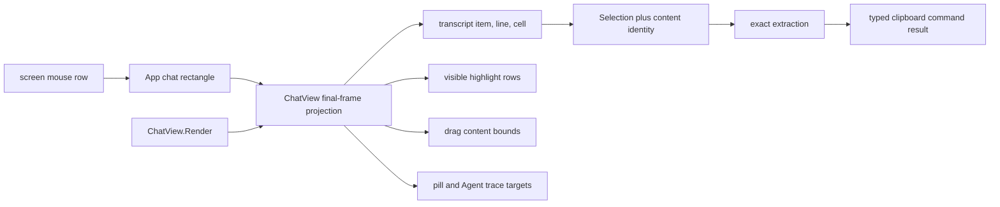

# P27 TUI Selection Viewport Geometry

**Status:** historical
**Created:** 2026-07-26
**Last updated:** 2026-07-28

> **Ownership:** accepted G30 selection-geometry, extraction, and clipboard
> contract; ordered atomic slices; promotion gates; and rollback boundaries.
> Root [`migration/PLAN.md`](../PLAN.md) alone owns executable order and slice
> state.

The source and reference evidence is frozen in
[`selection-viewport-geometry-audit.md`](../reference/tui/selection-viewport-geometry-audit.md).
Current implemented behavior remains owned by
[`architecture/tui/README.md`](../../architecture/tui/README.md), and final
delivery evidence is
[`p27-selection-viewport-geometry.md`](../history/tui/p27-selection-viewport-geometry.md).

P27 is accepted under a `combine` decision. P27.1 completed the immutable
final-frame projection and migrated its geometry/action consumers on
2026-07-28. P27.2 then completed exact extraction and interaction semantics on
2026-07-28. A current-source and reference refresh then froze P27.3's payload,
timeout, routing, cardinality, result, and construction-root contracts. P27.3
completed the typed serialized clipboard owner on 2026-07-28, closed G30, and
returned root [`migration/PLAN.md`](../PLAN.md) to intake with no `Ready`
slice.
This is a post-G11 interaction defect and does not reopen or rewrite the
completed G11 frame-integrity history.

## User Outcome

Selecting visible transcript text copies exactly that text in every supported
sticky-header, padding, scrolling, overlay, ANSI, and Unicode frame. Visual
highlight, pointer hit testing, Agent trace actions, drag auto-scroll, and copy
all resolve through one final-frame geometry owner. Chrome cannot silently
become transcript content, and clipboard feedback does not claim success when
no delivery path completed.

## Reproduced Problem

At the frozen pre-fix snapshot, when the chat was scrolled away from follow
mode, [`ChatView.Render`](https://github.com/abietic/eino-agent/blob/52e7627672bf1961ab28d9fe1393196b570bb5e3/internal/tui/chat.go#L1410)
subtracted one row from the transcript budget and prepended a sticky prompt to
the final frame.
[`viewportPosToItemPoint`](https://github.com/abietic/eino-agent/blob/52e7627672bf1961ab28d9fe1393196b570bb5e3/internal/tui/chat.go#L212),
[`ItemPointToViewportRow`](https://github.com/abietic/eino-agent/blob/52e7627672bf1961ab28d9fe1393196b570bb5e3/internal/tui/chat.go#L273), and
[`visibleContentHeight`](https://github.com/abietic/eino-agent/blob/52e7627672bf1961ab28d9fe1393196b570bb5e3/internal/tui/chat.go#L302)
still calculated against the full `ChatView.height`.

The forward transform therefore stores the following transcript row, while the
inverse transform paints the preceding final-frame row. Extraction correctly
follows the stored item point and copies text different from the visible
highlight. Edge-scroll and Agent trace hit testing reuse the same incomplete
chat-local assumptions.

Current tests cover sticky rendering, selection mapping without sticky chrome,
and grapheme cell slicing separately. They do not combine the reported
sticky-header frame with hit, highlight, and copy assertions.

## Decision

P27 uses `combine`:

- preserve `Selection` item/line/cell endpoints for P27.1, the App-selected
  `DisplayCellProfile`, Shift escape, and `O(viewport)` rendering;
- adapt Claude Code Ripe's actual-layout viewport origin and same-frame
  highlight/copy ownership without adopting its full screen buffer;
- adapt Crush's item-local Bubble Tea selection and shared rendered geometry;
- adapt OpenCode's selection-aware click suppression and asynchronous clipboard
  feedback;
- adapt Pi's grapheme-aware ANSI-safe width rule already represented by
  `DisplayCellProfile`;
- adapt Grok's explicit content rectangle for drag auto-scroll; and
- introduce a project-owned `chatViewportProjection` plus compatible-render
  identity and stricter non-selectable chrome policy.

Codex's terminal-native behavior remains an escape path, not the primary
solution: the requested application-managed highlight and copy experience must
continue to work without Shift.

## Scope And Non-Goals

P27 owns:

- final chat-row classification and bidirectional transcript projection;
- mouse selection start, motion, release, multi-click, and drag auto-scroll;
- selection highlight clipping and copy-source identity;
- selection precedence over Agent trace and other chat release actions;
- soft-wrap versus hard-newline extraction and source-whitespace policy; and
- clipboard transport scheduling, bounded execution, result reporting, and
  terminal-output serialization, including the narrow TUI composition-root
  handoff needed to reuse the production `TerminalOutput`.

P27 does not:

- change engine events, runtime reducers, session schemas, transcript records,
  replay, model/provider input, tools, permissions, or Graph topology;
- make header, pill, status, footer, or layout padding part of transcript copy;
- replace Bubble Tea, the string renderer, item render cache, or
  `DisplayCellProfile`;
- claim OSC 52 acknowledgement where the terminal protocol provides none;
- add rich clipboard formats or image copying; or
- change expand-view selection except where a shared clipboard delivery API
  requires equivalent truthful result handling.

TUI is the only behavior-changing entrypoint. Plain, headless, ACP, and
standalone MCP do not consume chat mouse selection and must remain unchanged.

## State Ownership

`ChatView` owns one immutable projection for the exact frame returned by
`Render`. `Selection` owns transient endpoints and their compatible content
identity. `App.Update` converts screen coordinates only to the chat rectangle,
then delegates all chat-internal classification to the projection. Clipboard
work runs as a Bubble Tea command and returns a typed message to `App.Update`.

The TUI composition root already constructs
[`TerminalOutput`](../../../internal/tui/terminal_output.go#L110) and passes it
to Bubble Tea at
   [`root.go`](../../../cmd/yhc/cmd/root.go#L275). P27.3 may add a narrow
writer or clipboard-service injection from that same construction root into
`App`; production must not construct a second terminal writer or retain a raw
`os.Stdout` fallback. An unavailable or closed writer returns a typed terminal
delivery failure. The existing output-failure kill, drain, restore, and close
lifecycle remains authoritative.

No state crosses into QueryEngine or durable session ownership.



## Target Projection

Names may be refined locally, but the implementation must preserve this
information and ownership:

```go
type chatViewportProjection struct {
    width, height int
    environment   renderEnvironmentIdentity
    frameGen      uint64
    contentGen    uint64
    contentRect   layoutRect
    rows          []chatViewportRow
}

type chatViewportRow struct {
    kind       chatViewportRowKind
    itemIdx    int
    lineInItem int
    softWrap   bool
}
```

`chatViewportRowKind` distinguishes at least `empty`, `sticky`, `padding`,
`transcript`, `itemGap`, and `pill`. A row descriptor represents the final
published row after empty-state composition, sticky insertion, bottom padding,
truncation, gaps, and pill overlay. Only `transcript` rows carry a selectable
item/line mapping.

The projection is built while `Render` already knows each appended row; it is
cached and invalidated with the rendered frame, not reconstructed by later
helpers. Returning a cached render without its matching projection is invalid.
Memory and work remain bounded by the final viewport height.

`frameGen` distinguishes final row layout, including scroll position and
overlays. `contentGen` distinguishes transformations that can change the
meaning of item/line/cell endpoints: render width, `DisplayCellProfile`,
environment, item replacement or mutation, expand/collapse state, and other
reflow inputs. Scroll-only frame changes may reproject an endpoint with the
same `contentGen`; a changed `contentGen` must either produce an exact
documented reprojection or clear/fail the selection.

## Frozen Invariants

- Screen row to transcript point and transcript point to final row consume the
  same immutable projection produced with the visible frame.
- Sticky, padding, gap, pill, status, footer, and out-of-rectangle rows cannot
  start an application transcript selection.
- A drag that starts on transcript content and crosses chrome clamps to the
  nearest visible selectable transcript boundary; it never attributes chrome
  to an arbitrary item.
- The pill owns its visible overlay row. Pointer press on the pill performs only
  its jump action, and highlight never paints through it as visible transcript.
- A non-empty application selection suppresses Agent trace, link, expand, or
  other business actions on the same release. A click with no selection
  preserves existing actions.
- Shift-modified mouse input remains unconsumed by application selection.
- Selection, highlight, and extraction use the same `DisplayCellProfile` and
  never split an extended grapheme cluster, ANSI sequence, or OSC 8 control.
- Scroll-only movement may retain stable item endpoints. Resize, reflow,
  profile drift, item replacement, or collapse copies only after exact
  reprojection; otherwise selection clears and no clipboard write occurs.
- Visual soft wraps do not invent source newlines. Hard source boundaries and
  inter-item boundaries remain explicit.
- Layout padding is never copied. Selected source spaces are preserved by the
  P27.2 policy rather than removed merely because they are trailing.
- Clipboard execution never blocks `App.Update`, has bounded payload and native
  command time, routes OSC 52 through the same production `TerminalOutput` as
  renderer output, and returns a typed outcome.
- Composition-root injection is mandatory before the TUI accepts clipboard
  requests. Missing or closed terminal writers fail that transport without a
  direct `os.Stdout` fallback; existing terminal failure shutdown and restore
  behavior is unchanged.
- OSC 52 write can report only `sequence-written`, not terminal acceptance.
  Native helper success requires a zero exit result; unavailable, timeout, and
  failure remain distinct.
- Render and interaction cost is `O(viewport)` per frame or pointer event; no
  full-history screen map is introduced.

## Current-To-Target Mapping

| Current mechanism | Target owner |
|---|---|
| `Render` knows sticky, padding, transcript, gap, and pill rows but returns only a string. | Build the projection beside the final row slice and cache both atomically. |
| `viewportPosToItemPoint` walks items using full chat height. | Resolve only a `transcript` row from the final projection, then clamp its cell through the row profile. |
| `ItemPointToViewportRow` independently reconstructs rows. | Look up the visible final transcript row in the same projection. |
| App edge-scroll compares against row zero and full chat height. | Compare against `contentRect` and clamp through its first/last selectable row. |
| Agent trace release receives raw chat row. | Resolve a visible transcript row from the projection; selection takes precedence. |
| `RenderItemRange` adds a newline per rendered line and trims trailing space. | Consume renderer-owned soft-wrap/source-boundary metadata and explicit source-padding rules. |
| Clipboard writes synchronously and four callers show unconditional success. | The composition root injects its existing serialized terminal writer; one Bubble Tea command returns typed per-transport outcomes to every caller before App renders feedback. |

## P27.1 Promotion And Delivery Evidence

P27.1 intake was reverified on current master `52e7627` before promotion. A
disposable focused probe named
`TestP271StickyFinalFrameSelectionIdentity` constructed an 80×4 `ChatView`
with:

1. item 0 as the sticky source prompt;
2. item 1 as four finished transcript rows beginning with `resource row` and
   `following row`;
3. `offsetIdx = 1`, `offsetLine = 0`, and away-from-follow state; and
4. a drag over final-frame row 1 from cell 0 through the visible
   `resource row`.

The published frame was `sticky prompt`, `resource row`, `following row`, and
`third row`. The pre-fix probe failed deterministically because the highlight
resolved to final row 1 while extraction returned `following ro`. The
implementation retained this fixture as a passing test and additionally proves:

- final sticky row 0 cannot create a transcript endpoint;
- final row 1 maps to item 1, line 0 and maps back to final row 1;
- highlight and extraction both identify exactly `resource row`; and
- a cached render returns the identical projection, while a dirty render
  cannot reuse the previous projection.

The existing split tests remain supporting evidence:
`sticky_header_geometry_test.go` proves sticky/pill rendering,
`selection_test.go` proves non-sticky forward/inverse mapping, and
`agent_trace_test.go` proves an ordinary Agent-link hit. The combined P27.1
matrix is owned by
[`p27_selection_projection_test.go`](../../../internal/tui/p27_selection_projection_test.go#L30).

### Final-row and interaction owner inventory

| Published or consumed role | Current owner and behavior | P27.1 owner |
|---|---|---|
| Outer screen-to-chat rectangle | `App.Update` subtracts `layout.chatRect.Y` and rejects modal/sidebar surfaces before chat routing. | Preserve this outer translation; it does not classify rows inside the chat. |
| Empty-chat placeholder | `ChatView.Render` returns the centered multi-row placeholder directly when no items exist; selection mapping already returns nil for an empty item set. | Publish an `empty` projection beside that frame; all rows are non-selectable and cache/projection identity remains paired. |
| Sticky row | `ChatView.Render` decrements the transcript budget, then prepends `stickyLine`. | One `sticky` descriptor in the cached final-frame projection; never selectable. |
| Transcript row | `ChatView.Render` appends `renderItem` lines after `offsetIdx`/`offsetLine` clipping. | One `transcript` descriptor with exact item and line identity. |
| Inter-item gap | `ChatView.Render` appends an empty row when budget remains. `viewportPosToItemPoint` currently attributes it to the previous item. | One `itemGap` descriptor; it cannot start selection and clamps only an already-active drag. |
| Bottom-gravity padding | `ChatView.Render` prepends empty rows after transcript collection. Independent mapping recomputes padding from `visibleContentHeight`. | One `padding` descriptor; never selectable. |
| Jump-pill overlay | `pillGeometry` publishes its final row and cells; `Render` replaces that row and `App.pillClickHits` separately routes its action. | One `pill` descriptor carrying the published action/hit range; it replaces any underlying transcript role for hit and highlight. |
| Selection press, motion, multi-click, and edge focus | `Selection` calls `viewportPosToItemPoint`; `App.Update` separately clamps edge rows to `0` and `chatHeight-1`. | Projection queries resolve or clamp to the first/last selectable transcript descriptor in `contentRect`. |
| Selection highlight | `GetViewportHighlightRange` calls `ItemPointToViewportRow`; `applyViewportHighlight` paints that independently reconstructed row in the final string. | The same projection performs the inverse lookup and clips highlight away from non-transcript descriptors. |
| Agent trace release | `AgentTraceTargetAtViewportRow` calls `viewportPosToItemPoint` and tests whether the reconstructed item line is the trace link. | Resolve the final row's transcript descriptor first; a non-empty selection suppresses the release action. |
| Extraction | `ExtractTextFromChat` consumes the stored item point through `RenderItemRange`. | P27.1 preserves current newline/whitespace behavior but proves the stored endpoint came from the visible transcript descriptor. |

### Render and projection identity inventory

| Change class | Current invalidation evidence | P27.1 rule |
|---|---|---|
| Width, height, theme, geometry, or display-cell profile | `SetSize` and `SetRenderEnvironment` mark `viewDirty`; `renderCacheEntry` binds width, item version, and exact render environment. | Rebuild frame and projection together under one identity; neither may be returned alone. |
| Scroll offset or follow state | scroll/follow transitions mutate `offsetIdx`, `offsetLine`, or `followState` and dirty the view. | Advance frame identity and rebuild row descriptors; compatible item endpoints may remain. |
| Item append, replacement, mutation, expansion, truncation, or reset | Chat mutation paths invalidate the viewport and per-item version/cache inputs. | Advance content identity whenever item/line meaning can change; clear or exactly reproject incompatible endpoints. |
| Empty state, sticky presence, bottom padding, or pill model | `Render` currently returns the placeholder directly or decides sticky/padding rows and overlays cached `pillGeometry` only while assembling the final string. | Record the decided role for every published row before returning or caching; overlays replace underlying roles. |
| Exact cache hit | `Render` currently returns `viewCache` when the view is clean and the environment matches. | The hit is valid only when the cached frame and projection share the same frame/content identity and height. |

This inventory is exhaustive for rows published by `ChatView`. Status, footer,
sidebar, modal, and out-of-rectangle cells remain App-owned outer chrome and
never enter the chat projection.

## Ordered Slices

### P27.1 — Final-frame projection and sticky-header correctness (completed 2026-07-28)

The implementation PR:

1. add the immutable projection and row-kind model beside `ChatView.Render`;
2. make render cache identity include the matching projection and generation;
3. replace independent forward/inverse row reconstruction with projection
   queries;
4. route selection, highlight, drag edge bounds, pill ownership, and Agent trace
   row resolution through that projection;
5. enforce non-selectable chrome, drag clamping, Shift escape, and release-action
   precedence; and
6. add the reported highlight/copy regression plus a cross-product geometry
   matrix.

The matrix covers empty chat, sticky on/off, bottom-gravity padding, partial
first item, item gaps, pill overlay, Agent trace rows, ANSI, CJK, emoji,
combining clusters, resize/reflow invalidation, cached render/projection
identity, and forward/inverse round trips.

P27.1 does not change newline/whitespace extraction or clipboard transport.
Its rollback is one squash revert restoring the old geometry helpers and tests;
no durable state requires migration.

### P27.2 Promotion And Completion Evidence

P27.2 intake was reverified on current master `276df8c`. Two disposable focused
probes exercised the production `UserMessage` renderer and current selection
owner.

The first rendered the source
`alpha  beta   gamma  \nhard  \nend` in a 14-column chat. The final plain rows
were:

```text
 ▎ alpha
 beta
 ▎ gamma
 ▎ hard
 ▎ end
```

The whole-item extraction was
` ▎ alpha\n beta\n ▎ gamma\n ▎ hard\n ▎ end`: visual continuation rows became
hard newlines, presentation prefixes entered the result, and selected source
spaces could not be distinguished from layout padding. The second probe
selected one 40-column rendered row containing `alpha beta gamma delta`, then
resized the chat to 14 columns. `Selection.HasSelection()` remained true while
the same stored line/cell endpoints changed extraction from the whole row to
` ▎ alpha`.

The immutable pre-fix source at `4c6f2b4` explains both results:

- [`renderItem`](https://github.com/abietic/eino-agent/blob/4c6f2b4f6cc379be66e849319666f983c1cedd6f/internal/tui/chat.go#L1364)
  cached final styled strings and height but no selectable-text or boundary
  metadata;
- [`UserMessage.RenderWithEnvironment`](https://github.com/abietic/eino-agent/blob/4c6f2b4f6cc379be66e849319666f983c1cedd6f/internal/tui/chat.go#L1644)
  inserted presentation chrome, performed width-dependent wrapping, and
  applied final-width styling before the cache saw the rows;
- [`RenderItemRange`](https://github.com/abietic/eino-agent/blob/4c6f2b4f6cc379be66e849319666f983c1cedd6f/internal/tui/chat.go#L345)
  inserted `\n` before every rendered row and used only `NoSelectPrefix` to
  distinguish content from presentation; and
- [`selectionSliceCells`](https://github.com/abietic/eino-agent/blob/4c6f2b4f6cc379be66e849319666f983c1cedd6f/internal/tui/selection_geometry.go#L53)
  stripped controls but unconditionally trimmed spaces and tabs, while
  [`Selection`](https://github.com/abietic/eino-agent/blob/4c6f2b4f6cc379be66e849319666f983c1cedd6f/internal/tui/selection.go#L31)
  stored no compatible content identity.

Reference evidence does not supply the missing stale-reflow proof. Claude Code
Ripe records renderer-owned `softWrap` and per-cell `noSelect` state and uses
the same screen for highlight and copy, but trims logical-line endings and
owns a full screen buffer. Crush normalizes whitespace before extraction.
Neither Claude, Crush, OpenCode, nor Codex proves exact endpoint reprojection
after resize. P27.2 therefore keeps the P27.1 string renderer and selects the
following project-owned rules.

#### Frozen selectable-text model

Each selectable rendered item must publish immutable metadata in the same
cache entry as its final rows. The metadata carries:

- the control-free semantic text represented by each selectable cell span;
- cell-to-byte boundaries under the exact `DisplayCellProfile`;
- whether the following boundary is a visual soft wrap, a semantic hard
  newline, an inter-item boundary, or no boundary; and
- explicit non-selectable presentation spans for gutters, identity glyphs,
  indentation, and layout padding.

“Semantic text” means the visible copy projection chosen by the existing item
renderer. It is not raw Markdown syntax, transcript storage, ANSI/OSC bytes, or
layout fill. Every currently selectable built-in item must publish this
metadata. An individual row whose exact metadata cannot be produced is
non-selectable for that frame; later code must not infer wrap origin from row
width, regenerate content from `Raw`, or add a second renderer.

| Selected situation | Exact P27.2 result |
|---|---|
| Visual soft-wrap continuation | Concatenate adjacent semantic spans without inserting bytes. |
| Semantic hard newline crossed by the range | Insert exactly one `\n`. |
| Cross-item range | Insert exactly one `\n`; the visual item-gap row does not add a second newline. |
| Source space or tab represented by selected semantic cells | Preserve the exact represented bytes, including at a logical line end. |
| Layout fill, gutter, identity glyph, indentation, sticky, padding, gap, or pill | Exclude it from selectable text and copy. |
| ANSI, OSC 8, or other terminal control | Preserve display styling only; emit no control byte to copy. |
| Endpoint inside an extended grapheme cluster or wide-cell spacer | Clamp outward through the selected `DisplayCellProfile`; never split or duplicate the cluster. |
| Partial first or last visual row | Emit only semantic spans intersecting the half-open normalized endpoint range. |
| Double click | Preserve the current Unicode letter/digit/underscore word rule within one semantic logical line; punctuation selects one complete grapheme. |
| Triple click | Select one complete semantic logical line, including represented trailing whitespace but excluding its terminating newline. |
| Reverse drag | Normalize to the same half-open range and bytes as the forward drag. |
| Scroll/follow/sticky/pill change with identical content identity | Retain item-local endpoints and reproject through the current P27.1 frame. |
| Width/profile/environment/item mutation, replacement, expansion, collapse, truncation, reset, or other content-identity change | Clear the selection before highlight, extraction, or copy; do not guess or copy partial stale text. |

The conservative stale policy is intentional for P27.2. An exact later
reprojection may replace clearing only if it proves byte-identical semantic
endpoints; P27.2 does not accept heuristic line/cell reuse. Selection creation,
double/triple click, keyboard extension, drag update, highlight, and extraction
all validate the same compatible identity. A stale release is consumed without
clipboard work or business-action fallthrough.

#### Accepted implementation data flow

P27.2 extends the existing string-renderer path rather than adding a parallel
semantic renderer. A selectable built-in invokes its current renderer once in
an internal annotated mode. That mode may add zero-cell, renderer-private
sentinels for:

- the start and end of selectable semantic spans;
- a semantic hard boundary;
- entry to and exit from a region whose physical row breaks are semantic
  hard boundaries, such as code or a table; and
- presentation spans that remain visible but cannot contribute copied bytes.

The sentinels are not terminal controls and never enter a published frame.
Before the per-item cache entry is installed, `ChatView` parses and removes
them once, validates balanced state and complete row coverage, and atomically
stores both the unchanged visible rows and immutable selectable-row metadata.
That metadata owns display-cell-to-semantic-byte spans and boundary kinds.
Missing, colliding, malformed, truncated, or incomplete annotation makes the
affected row non-selectable; it never falls back to `Raw`, transcript text,
final-row width inference, or another render pass.

Renderer ownership is explicit:

- plain, user, thinking, error, and tool wrapping helpers emit soft markers
  only for rows they introduce and hard markers only for semantic input
  boundaries;
- the existing Glamour render uses an annotation-bearing style in the same
  invocation: semantic text nodes publish selectable spans, renderer-created
  chrome remains outside those spans, block endings publish hard boundaries,
  and code regions publish hard-row scope;
- the existing semantic table renderer publishes cell-content spans and keeps
  borders and padding in presentation spans; and
- cached stable/full Markdown fragments retain their parsed annotated result,
  so cache hits do not regenerate selection metadata.

The selection identity is the current P27.1 content generation, exact render
environment and render width, plus the cache key/version of each endpoint
item. A frame-only generation change may reproject those endpoints. Any
missing projection, dirty content, endpoint item replacement/version drift, or
identity mismatch clears selection state before a consumer observes it.

`App` owns one transient edge-scroll generation. The qualifying motion applies
the immediate one-row step, advances the generation, and returns a 50 ms
Bubble Tea command. Each tick verifies the generation, chat/modal ownership,
compatible selection identity, active edge direction, and actual viewport
movement before applying and rescheduling one step. Clearing, release,
identity invalidation, ownership change, or no movement advances or stops that
generation; no goroutine or cancellable timer owner is introduced.

#### Frozen interaction policy

- A click sequence retains the existing 400 ms deadline and two-cell
  horizontal/vertical tolerance. Shift continues to bypass application
  selection.
- Double click selects the semantic word or punctuation grapheme under the
  pointer. Triple click selects the complete semantic logical line under any of
  its visual continuation rows.
- Forward and reverse drag normalize to the same half-open semantic range.
  Crossing a non-selectable final row clamps only an already-active drag.
- Scroll-only movement keeps compatible item-local endpoints. Keyboard
  extension advances through semantic rows and explicit item boundaries, not
  presentation rows.
- A qualifying drag motion at or beyond the first/last selectable row scrolls
  one transcript row immediately. While the pointer remains there, a
  generation-fenced 50 ms Bubble Tea tick scrolls one row per tick and updates
  focus from the newly published frame.
- Auto-scroll stops on release, selection clear, stale content identity,
  modal/state ownership change, or a tick that cannot move the viewport. A
  delayed tick with an old generation is inert.
- Focused tests must replace the auto-scroll generation between the immediate
  edge step and the first 50 ms tick, then prove that old tick is inert. They
  must also cover every listed stop condition and prove selection state remains
  internally consistent after each stop.

### P27.2 — Exact extraction and interaction semantics

One implementation PR must:

1. publish the frozen selectable-text metadata beside each exact cached item
   render and carry its boundary facts into the final transcript rows;
2. replace `RenderItemRange` reconstruction and unconditional trim with
   metadata-based half-open extraction;
3. migrate every currently selectable built-in item; any per-frame metadata
   failure makes only the affected row non-selectable, without adding a raw-
   transcript or second-renderer fallback;
4. freeze double-click word, triple-click logical line, cross-item drag,
   direction reversal, scroll-while-selected, keyboard extension, and
   timer-driven auto-scroll behavior;
5. bind `Selection` to compatible content identity and apply the conservative
   stale-clear policy before highlight, extraction, copy, or release actions;
   and
6. add table/property or fuzz tests for the complete truth table, forward/
   inverse cell boundaries, extraction equality, Unicode clusters, partial
   rows, cache identity, and stale interaction.

P27.2 may change copied line breaks and trailing spaces where current behavior
confuses visual wrapping or padding with semantic content. It may not change
Markdown or transcript bytes, add a second render owner, or change clipboard
transport. Rollback reverts extraction metadata and interaction policy without
removing the proven P27.1 geometry owner.

### P27.3 — Asynchronous truthful clipboard delivery (completed 2026-07-28)

P27.3 is one implementation PR. It must:

1. inject a narrow writer or clipboard service from
   [`runTUI`](../../../cmd/yhc/cmd/root.go), backed by the exact
   `TerminalOutput` instance that Bubble Tea uses, after construction and
   before `Program.Run`;
2. introduce a typed request/result API executed as a Bubble Tea command; keep
   the selected text only in the command closure, never in engine or durable
   state;
3. serialize OSC 52 through `TerminalOutput` instead of writing concurrently to
   `os.Stdout`, without changing its kill/drain/restore lifecycle;
4. migrate all four current callers: expand selection and chat selection in
   [`App.Update`](../../../internal/tui/app.go), keyboard selection copy in
   [`key_actions.go`](../../../internal/tui/key_actions.go), and command
   `ActionCopy` in [`app.go`](../../../internal/tui/app.go);
5. reject empty or oversized input before starting a transport, using one
   inclusive limit of 262,144 UTF-8 source bytes (256 KiB) before base64; never
   truncate or silently fall back to only part of the selected text;
6. bound each native helper attempt by one two-second end-to-end
   `context.Context` deadline, including stdin delivery and process exit;
7. define local, SSH, tmux, GNU screen, macOS, Wayland, X11, Windows,
   unavailable, timeout, helper-failure, output-failure, and shutdown routing
   without shell interpolation;
8. report native helper completion, OSC 52 sequence write, degraded delivery,
   busy rejection, payload rejection, and failure truthfully at every caller;
   and
9. remove the old result-free `CopyToClipboard` path and every clipboard write
   to raw `os.Stdout`.

The 256 KiB limit is a resource bound, not an OSC 52 compatibility claim. Its
base64 payload is at most 349,528 bytes before the small protocol/wrapper
overhead. That remains bounded under `TerminalOutput`'s existing 750 ms
physical-write deadline. More restrictive terminals may still ignore the
sequence, which is why a completed write is never described as clipboard
acceptance. The compatibility consequence is explicit: a selection larger
than 256 KiB now fails visibly instead of starting an unbounded helper or
terminal write.

`App` owns the user-interaction cardinality. It records one monotonic request
ID, source caller, and pending bit before returning the command. While that
request is pending, any of the four callers receives a local
“clipboard copy already in progress” warning and starts no second command.
The service also serializes delivery defensively, but no App command may wait
in an unbounded clipboard queue. A result clears state and projects feedback
only when its request ID matches the pending request. Program-context
cancellation stops a native helper and suppresses later feedback; it does not
cancel QueryEngine work or weaken terminal shutdown.

Caller-local selection behavior remains stable: mouse and expand-view copy
retain their visible selection; keyboard copy clears only after the request
passes validation and is admitted; busy or oversized keyboard attempts keep
the selection so the user can retry. `ActionCopy` has no selection state.

The delivery order preserves the current explicit-copy compatibility behavior:

1. validate non-empty UTF-8 source bytes and the 256 KiB limit;
2. encode one OSC 52 clipboard sequence and synchronously write the complete
   packet through `TerminalOutput`;
3. if that write fails or the writer is closed, return the typed output failure
   immediately and let the existing `Failed` monitor own kill, drain, restore,
   and the process error; do not start a native helper after terminal output is
   known broken;
4. otherwise, skip the native helper under `SSH_CONNECTION` or `SSH_TTY`;
   outside SSH, select at most one fixed helper and wait at most two seconds;
   and
5. return one result message with the request ID, caller, source-byte count,
   terminal outcome, native outcome, and redacted failure category.

The unwrapped OSC 52 packet is exactly
`\x1b]52;c;<base64>\x07`. With `TMUX` or `TMUX_PANE`, tmux DCS passthrough is
exactly
`\x1bPtmux;\x1b\x1b]52;c;<base64>\x07\x1b\\`: the wrapper prefixes `tmux;`
and doubles the inner OSC escape byte. With `STY` and no tmux marker, GNU
screen DCS passthrough is exactly
`\x1bP\x1b]52;c;<base64>\x07\x1b\\`: it has no `tmux;` prefix and does not
double the inner OSC escape byte. tmux takes precedence when both marker
classes exist. With neither multiplexer marker, the unwrapped packet is
written through `TerminalOutput`. These wrappers prove only the bytes sent to
the selected transport. tmux `allow-passthrough`, screen configuration,
terminal support, permission, and final clipboard contents remain environment
facts.

Native routing is fixed once in the TUI composition root and is injectable in
tests:

| Environment | Native route after the serialized OSC 52 write |
|---|---|
| SSH, including SSH inside tmux/screen | Skip native access; do not target the remote host clipboard. |
| macOS | `pbcopy`, if resolved; selected bytes on stdin. |
| Linux Wayland | `wl-copy`, when `WAYLAND_DISPLAY` is present and the binary resolves. |
| Linux X11/fallback | First resolved of `xclip -selection clipboard`, then `xsel --clipboard --input`; selected bytes on stdin. |
| Windows | Resolved `powershell.exe` with fixed non-interactive/no-profile argv and a fixed `Set-Clipboard` script; selected bytes on stdin. |
| Other or no helper | Native unavailable; retain the OSC 52 result. |

Helpers use `exec.CommandContext` or an equivalent injected runner with fixed
argv and stdin. No shell, user-derived argv, command string, environment
mutation, stderr content, or selected text may enter a notification, log, or
durable record. Exit zero means the native helper completed; it does not prove
paste/read-back.

The result-to-feedback contract is:

| Observed result | User-visible projection |
|---|---|
| OSC packet written and native helper exits zero | Info: copied to the system clipboard. This is the only ordinary “copied” result. |
| OSC packet written and native skipped by SSH policy | Warning: clipboard request sent to the terminal; acceptance is not confirmed. |
| OSC packet written and native unavailable, timed out, or failed | Warning: terminal request sent without confirmation, plus only the redacted native failure category. |
| Payload exceeds 256 KiB | Warning with the exact limit; no transport starts. |
| Another request is pending | Warning that a clipboard copy is already in progress; no transport starts. |
| Terminal writer unavailable, closed, partial, timed out, or failed | No success toast. Return the typed failure and preserve the existing terminal-failure shutdown/restore path. |
| Program context cancelled before completion | No late toast and no retry. |

Fake writers/commands verify bytes, routing, timeout, cancellation, cardinality,
closed-writer behavior, terminal failure projection, and result-driven feedback
for all four callers. They also prove exact 262,144/262,145-byte boundaries,
base64 length, fixed argv/stdin, SSH suppression, Wayland/X11 priority,
Windows routing, tmux/screen/direct wrappers, one in-flight request, stale
result rejection, caller-local selection clearing, two-second timeout, and
redacted errors. PTY fixtures verify that renderer output and OSC 52 use one
`TerminalOutput`, do not interleave, preserve failure-driven shutdown and
restore, and compare the direct, tmux, and screen packets against the literal
byte strings frozen above, including tmux precedence and the two distinct
inner-escape rules. Because OSC 52 has no portable acknowledgement, the UI
must not claim terminal acceptance from a successful write alone.

Expected production scope includes `internal/tui/selection.go`,
`internal/tui/app.go`, `internal/tui/key_actions.go`,
`internal/tui/terminal_output.go` only if a narrower injected interface cannot
reuse its public `Write` contract, focused tests, and the TUI construction seam
in `cmd/eino-agent/cmd/root.go`. Plain, headless, ACP, and standalone MCP
composition roots remain out of scope.

Rollback reverts the command/result adapter and restores the previous dual
attempt. It does not roll back P27.1 geometry or P27.2 extraction.

## Verification Matrix

Each implementation PR runs its focused tests plus:

```text
make fmt
make lint
make test
make build
make lint-new
make docs-check
go run ./scripts/migration_manifest.go check
git diff --check
```

P27.1 additionally requires deterministic selection/highlight/extraction
equality for the user reproduction and the full row-kind matrix. P27.2 requires
property or fuzz seeds for grapheme-safe round trips and exact soft/hard
boundaries. P27.3 requires fake-transport tests, timeout/cancellation tests, and
the bounded PTY serialization matrix. Any race-enabled clipboard or render
state touched by a slice must pass focused `go test -race`.

Physical-terminal checks may supplement but never replace deterministic
profile and fake-transport proof.

## Promotion And Completion

P27.1 is complete because:

1. P22.H0 has closed and left the live queue;
2. root `PLAN.md` explicitly selected P27.1 against the other queued contracts;
3. the reported frame is frozen above as a deterministic
   failing-before/passing-after fixture and was reproduced against current
   master;
4. every final row kind, interaction consumer, and cache invalidation class is
   inventoried above; and
5. [`ChatView.Render`](../../../internal/tui/chat.go) now publishes every
   final row and its frame/content identity atomically, and every P27.1 consumer
   fails closed on a missing or incompatible projection; and
6. the deterministic sticky reproduction, full row-kind/profile/resize/cache
   matrix, pill and Agent precedence, focused race run, and repository gates
   pass without changing extraction or clipboard transport.

P27.2 is complete because P27.1 was closed, the two current-source probes
became passing retained behavior tests, each selectable built-in publishes
same-render immutable semantic metadata, and the exact soft/hard/inter-item,
whitespace, grapheme, stale-identity, click/drag/keyboard, and
generation-fenced edge-scroll matrix passes with repository gates.

P27.3 is complete because the exact production `TerminalOutput` now owns
renderer and OSC 52 serialization; one App request ID/caller fence accepts
typed outcomes from all four callers; payload, routing, timeout, SSH,
redaction, selection-retention, and feedback contracts are enforced; and an
atomic `TerminalOutput` admission fence prevents a native helper from starting
after output failure/close while later failure cancels an admitted helper.
Exact fake, race, static-wiring, and direct/tmux/screen PTY matrices pass
together with the repository gates.

No numbering or dependency automatically promotes a slice. Root `PLAN.md`
selects exactly one `Ready` slice. G30 is closed because P27.1-P27.3 are
complete, current TUI architecture and `STATUS.md` describe the implemented
contract, focused/full/race/PTY gates pass, and one history record owns
closeout evidence.

## Rollback And Failure Policy

Every slice is a separate squash commit and preserves the earlier closed
invariants. A stale or missing projection fails closed by declining selection,
clearing incompatible endpoints, or suppressing copy; it must not guess an
offset. A clipboard timeout cancels only that delivery attempt and never the
query runtime.

If implementation discovers that a row role cannot be represented without
walking full history, or that another package owns the final geometry, stop the
slice and return it to plan review. Do not add compensating offsets in callers
or move TUI presentation state into the engine.

## Document Owners At Closeout

- [`architecture/tui/README.md`](../../architecture/tui/README.md) owns the
  implemented projection, selection, and clipboard behavior.
- [`STATUS.md`](../STATUS.md) owns verified current capability only after each
  applicable slice lands.
- [`REMAINING.md`](../REMAINING.md) records G30 as closed by the complete
  P27.1-P27.3 user-visible outcome.
- [`history/`](../history/README.md) receives one final P27 closeout record.
- This file is retained as the historical accepted contract; root
  [`PLAN.md`](../PLAN.md) remains the only live-order owner.
