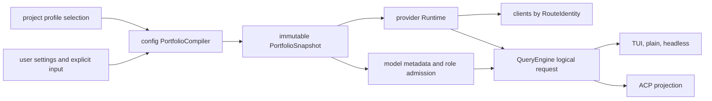

# P29 Model Portfolio, Role Routing, And Failover

**Status:** historical
**Created:** 2026-07-27
**Last updated:** 2026-08-01
**Execution state:** P29.0-P29.4 are complete; P29.5 is deferred; G31 is closed

> **Ownership:** accepted G31 model-portfolio configuration, provider-account
> isolation, model metadata, role routing, failover, recovery, observability,
> ordered atomic slices, promotion gates, and rollback boundaries. Root
> [`migration/PLAN.md`](../PLAN.md) alone owns executable order and slice state.

The source and reference evidence is frozen in
[`model-portfolio-routing-audit.md`](../reference/runtime/model-portfolio-routing-audit.md).
Current implemented behavior remains owned by
[`architecture/platform/model-providers.md`](../../architecture/platform/model-providers.md),
while P29.4's completion record closes the former G31 observable mismatch in
[`p29-4-bounded-overload-failover.md`](../history/runtime/p29-4-bounded-overload-failover.md).

P29 is accepted under a `combine` decision. P29.0 completed its test-only
characterization and contract-fixture slice. At snapshot
`3603bff986f5a5bd57fda33fbb5976d77cf06ca2`, P29.1 passed its separate
promotion and security review. P29.1 then completed its frozen
compiler/runtime boundary; delivery evidence is
[`p29-1-trusted-portfolio-compiler.md`](../history/runtime/p29-1-trusted-portfolio-compiler.md).
At snapshot `14bea1257c377f2e82d98ddc107086d25d058022`,
P29.2 passed its separate inventory, persistence, recovery, security, and
compatibility review and became the sole `Ready` slice for implementation.
P29.2 then completed the frozen boundary; delivery evidence is
[`p29-2-shared-inventory-model-binding.md`](../history/runtime/p29-2-shared-inventory-model-binding.md).
At snapshot `a7d457e06c85f386392dcc932cea4da9024c7e05`, P29.3 passed
its separate role-call, recovery, security, and compatibility promotion
review. P29.3 then completed capability-admitted role routing; delivery
evidence is
[`p29-3-capability-admitted-role-routing.md`](../history/runtime/p29-3-capability-admitted-role-routing.md).
At snapshot `acb3cc99e5ec0c292eb2640174645b581e9a7742`, P29.4 passed
its separate production-owner, taxonomy, budget, entrypoint, Eino-mechanism,
and rollback review. P29.4 then completed that frozen boundary; delivery
evidence is
[`p29-4-bounded-overload-failover.md`](../history/runtime/p29-4-bounded-overload-failover.md).
P29.5 completed its evidence/decision gate with an explicit
[`defer`](#p295-defer-decision). No adaptive-health successor was accepted.
Completed P26.1 supplies the single complete-stream-before-tool and
committed-tool owner that P29.4 preserves; it is no longer an outstanding
dependency.

## User Outcome

A user can define several model/account combinations once and refer to them by
stable profile IDs. The same inventory is available to startup configuration,
TUI/plain/headless, and ACP. Main turns, Explore, Plan, general Agents, and
non-authoritative summaries can use intentionally selected profiles.

When the selected route is overloaded, the runtime can try a bounded ordered
chain without mixing credentials/endpoints, duplicating tool side effects,
persisting partial assistant output, replaying incompatible thinking artifacts,
or silently overflowing a smaller context window. Diagnostics and usage make
the chosen profile, attempt, failure reason, and token consumption visible
without exposing credentials.

This outcome maximizes useful access to user-supplied token pools through
explicit role and failover policy first. It does not claim that a hidden
dynamic scheduler can infer the cheapest or best model without measurements.

## Reproduced Problem

Current configuration exposes one `provider`, one `model`, one
`api_base_url`, one `fallback_model`, and aliases. User/project configuration is
merged before provider resolution, so the source of credential-bearing routing
fields is no longer available.

[`routeRegistry`](../../../engine/provider/runtime.go) caches a chat model by
provider only. A second model on the same provider inherits the main API key
and base URL and reuses the same client. Two OpenAI-compatible accounts or
gateways cannot be represented as independent runtime routes.

The built-in [`ModelRegistry`](../../../engine/model/registry.go) is a catalog,
not the configured inventory. Unknown models receive optimistic execution
defaults, while session state persists only model/provider strings. Agent role
selection has no shared configured owner, and current fallback is one
overload-triggered hop.

Focused evidence is listed in the
[`audit`](../reference/runtime/model-portfolio-routing-audit.md#current-source-evidence).
In particular:

- `TestRuntimeRoutesAliasesAcrossProvidersLazily` proves the current
  provider-keyed construction boundary;
- `TestQueryRetriesWithFallbackModelOnFallbackTriggeredError` proves one
  fallback hop; and
- `TestQueryEngineFallbackRetryDropsPartialAssistantHistory` proves the
  current partial-attempt cleanup.

No current test can configure two same-provider accounts, bind models by agent
role, restore a durable profile, or execute a bounded chain because those
contracts do not exist.

## Decision

P29 uses `combine`:

- preserve the six provider-specific Agentic adapters and their typed request/
  response conversion;
- preserve current explicit/`PROV_*`/configured/provider-specific/credential
  precedence for legacy inputs;
- preserve QueryEngine/ProjectGraph as the logical-request, event, transcript,
  tool, and terminal owner;
- adapt Codex's separation of profile selection from provider definition and
  its restriction on repository-controlled credential destinations;
- adapt OpenCode's public model identity versus provider-local API model ID,
  capabilities, limits, and provider lowering;
- adapt Crush's explicit model-role preference and persistent selection into a
  richer project-owned role vocabulary;
- preserve and generalize Claude Code Ripe's retry-versus-switch distinction,
  partial-attempt cleanup, and visible warning;
- adapt Eino's typed failover context only if compatibility traces prove that
  it remains a leaf under the project-owned lifecycle; and
- reject automatic price/quota scoring and last-success stickiness until
  measured evidence supports a separate policy.

The target is one canonical portfolio snapshot, not parallel legacy and new
routers. Legacy fields are compatibility inputs compiled into that snapshot.

## Scope And Non-Goals

P29 owns:

- source-aware loading for model-portfolio fields;
- trusted provider-account definitions and credential references;
- stable model profiles and provider-local API model IDs;
- built-in plus user-supplied metadata with field provenance;
- complete route identity and client reuse/isolation;
- startup and manual model-profile selection;
- TUI/plain/headless and ACP inventory projection;
- versioned session binding and resume compatibility checks;
- main, Explore, Plan, general-Agent, and non-authoritative-summary roles;
- provider-neutral role and dynamic-input capability admission;
- ordered, bounded, role-specific failover attempts;
- retry/failover/error classification and total attempt budget;
- partial output, tool-call, thinking, context, cancellation, and replay rules;
- safe diagnostics and per-profile/role/attempt usage; and
- optional passive cooldown only after the measurement gate.

P29 does not:

- replace ProjectGraph, `runCanonicalModelRound`, the tool node, transcript,
  permission, hook, cancellation, or terminal owners;
- merge DeepSeek, Qwen, Ark, Gemini, Claude, and OpenAI construction into one
  generic OpenAI adapter;
- let project settings define or override named credentials, endpoints,
  provider accounts, profile metadata, role bindings, or failover policy;
- begin loading `.claude/settings.local.json` as an unrelated configuration
  expansion;
- store raw API keys in JSON settings, session records, diagnostics, events, or
  logs;
- support arbitrary secret-bearing headers or request-body passthrough in the
  first portfolio slice;
- route the P22 authorization reviewer, whose trust boundary remains owned by
  the P22 contract;
- move authoritative compaction onto the non-authoritative `summary` role;
- discover provider quotas or prices through token-spending probes;
- persist route-health/cooldown state across process restarts;
- hot-reload credentials, endpoints, profiles, or metadata; or
- add model runtime behavior to standalone MCP.

## Configuration Contract

### Target user configuration

The following JSON is the frozen target shape. Field names may receive only
mechanical Go naming adjustments; their identity, trust, and merge semantics
are part of the contract. Model IDs, limits, URLs, and capability values below
are illustrative fixtures, not verified live provider facts or registry
updates.

```json
{
  "model_profile": "primary",
  "provider_accounts": {
    "anthropic-main": {
      "provider": "anthropic",
      "base_url": "https://api.anthropic.com",
      "auth": {
        "kind": "env",
        "name": "ANTHROPIC_API_KEY"
      }
    },
    "qwen-backup": {
      "provider": "qwen",
      "base_url": "https://llm-gateway.example.com/v1",
      "auth": {
        "kind": "credential",
        "name": "qwen-personal"
      }
    }
  },
  "model_profiles": {
    "primary": {
      "account": "anthropic-main",
      "api_model": "provider-primary-model-id",
      "display_name": "Primary",
      "project_selectable": true,
      "metadata": {
        "context_window_tokens": 200000,
        "max_output_tokens": 64000,
        "capabilities": {
          "text": true,
          "streaming": true,
          "tools": true,
          "system_prompt": true,
          "images": true,
          "pdfs": true,
          "thinking": true
        },
        "supported_reasoning_efforts": ["low", "medium", "high"],
        "cost_tier": "standard"
      },
      "reasoning": {
        "default_effort": "high"
      }
    },
    "cheap-explore": {
      "account": "anthropic-main",
      "api_model": "provider-fast-model-id",
      "display_name": "Fast Explore",
      "reasoning": {
        "default_effort": "low"
      }
    },
    "qwen-failover": {
      "account": "qwen-backup",
      "api_model": "provider-backup-model-id",
      "display_name": "Backup",
      "metadata": {
        "context_window_tokens": 131072,
        "max_output_tokens": 32768,
        "capabilities": {
          "text": true,
          "streaming": true,
          "tools": true,
          "system_prompt": true,
          "images": false,
          "pdfs": false,
          "thinking": false
        },
        "cost_tier": "budget"
      }
    }
  },
  "model_roles": {
    "explore": "cheap-explore",
    "plan": "primary",
    "general": "primary",
    "summary": "cheap-explore"
  },
  "failover_policies": {
    "main": {
      "alternates": ["qwen-failover"],
      "on": ["overloaded"],
      "max_switches": 1,
      "max_provider_calls": 6,
      "max_elapsed_ms": 45000
    }
  }
}
```

The map key is the stable account/profile ID. `api_model` is the exact
provider-local identifier sent on the wire. `display_name` is presentation
only and never participates in routing.

### Provider account and secret forms

A provider account owns:

- one canonical provider adapter;
- one validated base URL or the provider default;
- exactly one authentication form; and
- typed adapter/client options added by later reviewed provider slices.

Initial authentication kinds are:

| Kind | Meaning |
|---|---|
| `env` | Read one named environment variable during client construction |
| `credential` | Resolve one opaque named record from `engine/auth` |
| `provider_default` | Use the existing provider-specific environment/credential fallback explicitly |

Plaintext `api_key` is rejected in portfolio settings. Raw `--api-key` remains
an explicit process-local legacy input and is never converted into a persisted
account definition.

Base URLs must have `http` or `https` scheme, a host, no userinfo, no query, and
no fragment. Canonicalization lowercases the scheme/host, removes default
ports, resolves dot segments, and gives the root/trailing-slash rule one tested
form. A path such as `/v1` remains part of the internal route identity.
Diagnostics expose only scheme plus host.

### Identifier and collision rules

Account/profile IDs:

- are canonical lowercase;
- match `[a-z][a-z0-9._-]{0,63}`;
- are compared after normalization;
- cannot use the reserved `legacy.` prefix; and
- cannot collide inside their own namespace. Profile IDs also cannot collide
  with a normalized legacy model alias in the model-selection namespace.

Unknown role names, capability names, auth kinds, reasoning levels, and
failover error classes fail configuration validation. Duplicate failover
profiles and a primary repeated in its own alternate list are rejected.
`max_switches` is non-negative, `max_provider_calls` is positive and at least
`max_switches + 1`, and `max_elapsed_ms` is positive. Runtime clamps all three
to project-owned safety ceilings before admitting a request.

### Source authority and merge behavior

Portfolio loading must preserve source layers until authority checks finish.
`LoadEffectiveConfig` may continue to serve unrelated settings, but it cannot
be the only input to portfolio compilation.

| Source | May define |
|---|---|
| User settings | Accounts, profiles, metadata overrides, roles, failover policies, and default profile |
| Project settings | Only `model_profile`, selecting an already user-declared profile whose `project_selectable` flag is true |
| Explicit CLI/runtime | `--model-profile`, or the existing mutually exclusive legacy route fields |
| Environment | `PROV_MODEL_PROFILE`, account-referenced secret values, or existing legacy `PROV_*` inputs |

If project settings contain account/profile definitions, metadata overrides,
roles, or failover policies, the loader ignores those keys and emits a
redacted, stable diagnostic naming the forbidden keys and project settings
path. It never partially consumes them.

An unauthorized project profile selection fails with an actionable diagnostic;
it does not fall back silently. `project_selectable` defaults to false and is
effective only when declared in user settings. Explicit CLI/runtime,
environment, and user-default selection do not require this flag.

When future managed/runtime layers may define the same account or profile ID,
the higher-authority object replaces the whole lower object. Credential,
endpoint, provider, and model fields are never recursively spliced across
layers. `enabled: false` is the explicit tombstone for an object owned by a
layer that is authorized to define it.

Role bindings and failover policies replace as a whole per role. Arrays never
append implicitly. `model_roles.main` is rejected because the effective
`main` binding comes only from the selected `model_profile`. An absent optional
role inherits that effective main profile. An absent failover policy means no
route switch for that role; failover policies never inherit across roles.

### Selection precedence and mixed-mode validation

Profile selection is:

1. explicit `--model-profile`;
2. `PROV_MODEL_PROFILE`;
3. project `model_profile`;
4. user `model_profile`; then
5. the current legacy resolver.

`--model-profile` is mutually exclusive with explicit `--provider`, `--model`,
`--base-url`, `--api-key`, and `--fallback-model`. The equivalent profile and
legacy `PROV_*` environment surfaces are also mutually exclusive. A single
settings layer cannot select both `model_profile` and legacy route fields.
Ambiguity returns an actionable configuration error rather than selecting a
winner silently.

TUI `/model` and ACP model options accept exact configured profile IDs. Legacy
provider-qualified model specs and aliases remain available through a clearly
labelled compatibility path; exact profile ID lookup occurs first.

### Legacy compilation

When no profile selection is active, the compiler preserves current
field-specific resolution and produces:

- one reserved internal `legacy.main` profile;
- one reserved `legacy.fallback` profile only when `fallback_model` resolves;
- all roles bound to `legacy.main`; and
- one overload-only main policy with `legacy.fallback` as its single alternate.

User settings may predeclare accounts and profiles while the legacy route
remains active so P29.2 can expose a manual migration path. In that mixed
inventory state, `model_roles` and `failover_policies` must be absent; either
requires an effective named `model_profile`. A later validated manual switch
makes the selected profile the effective main binding without mutating the
persisted user default.

`model_aliases` remains a legacy selector map. Existing flags, environment
variables, project override behavior, provider-specific environments, and
credential-store fallback retain their current precedence inside this
compatibility compiler. Its derived provider-call and switch bounds preserve
the current finite retry/fallback ceiling rather than introducing a new
unbounded allowance.

Current project settings can override legacy `api_base_url`. P29.1 retains that
behavior only inside the legacy compiler to avoid an unannounced breaking
change, emits one redacted `legacy_project_route_authority` warning per source,
and never imports the value into a named provider account. Named portfolio
isolation guarantees do not apply to that warned legacy route. Removing the
override is a separate compatibility/security migration decision.

New `failover_policies.main` and legacy `fallback_model` cannot both own the
same effective configuration. Mixed input fails with migration guidance.
After P29.4, legacy compilation feeds the canonical portfolio/failover owner;
the old direct fallback field is no longer a second execution path.

## State Ownership

`engine/config` loads source layers, applies authority, validates schema, and
compiles an immutable `PortfolioSnapshot`. It does not retain plaintext
credentials or create clients.

`engine/auth` resolves a provider account's auth reference only at client
construction. It owns any additive named-credential schema.

`engine/model` owns built-in metadata, explicit override validation, capability
requirements, and metadata provenance. It does not choose a failover attempt.

`engine/provider.Runtime` maps profile IDs to resolved non-secret routes and
caches provider clients by complete route identity. It constructs/routes
clients but does not decide when a logical request switches profile.

`QueryEngine`, through the canonical `runCanonicalModelRound` boundary, owns
the session-selected main profile, role resolution, logical-request snapshot,
attempt sequence, failure classification, tombstone/commit ordering, usage
aggregation, and terminal result. `runCanonicalToolRound` remains the sole
committed-call execution owner.

TUI/plain/headless and ACP project the same engine inventory and state.
Standalone MCP remains outside the flow.



No arrow carries a plaintext secret beyond `engine/auth` and provider client
construction.

## Target Runtime Model

Names may be refined locally, but the implementation must preserve these
identities and separations:

```go
type AccountID string
type ProfileID string
type ModelRole string

type PortfolioSnapshot struct {
    Revision string
    Default  ProfileID
    Accounts map[AccountID]ResolvedAccount
    Profiles map[ProfileID]ResolvedProfile
    Roles    RoleBindings
    Failover map[ModelRole]ResolvedFailoverPolicy
}

type ResolvedProfile struct {
    ID                ProfileID
    Account           AccountID
    APIModel          string
    Display           string
    ProjectSelectable bool
    Metadata          EffectiveModelMetadata
    Reasoning         ReasoningDefaults
}

type RouteIdentity struct {
    Provider      provider.Provider
    Endpoint      string
    AuthKind       string
    AuthReference string
    AdapterDigest string
}

type ModelBindingRef struct {
    Kind  string // profile or legacy
    Value string
}
```

`RouteIdentity` contains an auth kind/reference, never the resolved key.
Profile ID is not part of the client-cache key: two profiles with the same
account/route may reuse a client while forwarding different `api_model`
values. Two profiles with different endpoints, auth references, or adapter
options cannot reuse one.

`provider_default` authentication is lowered to the concrete non-secret source
kind/reference selected by the existing resolver before cache lookup. Secret
values are resolved only for client construction and never hashed into route
identity. Because hot reload is out of scope, rotating an environment value or
credential record requires a new runtime.

The portfolio revision is a deterministic digest of canonical non-secret
definitions and policies. It excludes secret values, timestamps, and map
iteration order.

## Metadata And Capability Admission

### Effective metadata

Each metadata field retains its value and provenance:

- built-in exact/alias/provider-pattern match;
- explicit user profile override;
- conservative derived value; or
- unknown.

At minimum the effective metadata carries:

- context-window tokens;
- maximum output tokens;
- streaming, tool, system-prompt, image, PDF, and thinking support;
- supported reasoning efforts and profile default;
- deprecation/successor data; and
- a relative cost tier for display and explicit policy.

Static dollar prices are not routing authority. They become stale and do not
describe subscriptions, cache discounts, or provider quotas. Any future routing
policy must consume measured actual usage and a separately accepted user-owned
pricing policy; the P29.5 defer decision accepts neither.

### Unknown and custom models

An unknown model remains manually selectable through the legacy path, with the
current warning behavior. Automatic role assignment or failover requires
authoritative metadata for every capability relevant to that role and current
input. The user may supply that metadata in a user-owned profile.

An absent capability is unknown, not `true`. A declared `false` is
authoritative. Metadata overrides must use positive limits, known enum values,
and a default reasoning effort contained in the declared supported set.

### Role requirements

Initial roles and their minimum static requirements are:

| Role | Owner/use | Static admission |
|---|---|---|
| `main` | Root user turn | text, streaming, tools, system prompt |
| `explore` | Read-only Explore Agent | text, streaming, tools, system prompt |
| `plan` | Read-only Plan Agent | text, streaming, tools, system prompt |
| `general` | Other Agent types | text, streaming, tools, system prompt |
| `summary` | Non-authoritative progress/tool-use/away summaries when wired | text, streaming, system prompt; no tools required |

Permission and tool-pool policy remains role-owner behavior. A model profile
cannot grant a tool or relax permission merely because it supports tool calls.

Dynamic input adds requirements at turn admission. Images/PDFs, requested
reasoning, provider-bound thinking history, and prompt size are validated
against the selected profile and every failover candidate. Ineligible
alternates are skipped with a safe `model_candidate_skipped` event; input is
never silently dropped. A candidate rejected before route activation consumes
neither `max_switches` nor `max_provider_calls`.

`compact` and P22 `reviewer` are deliberately not aliases of `summary`.
Compaction mutates authoritative conversation state, and reviewer selection is
an authorization boundary. Both retain their current/owning contracts.

### Reasoning defaults

Profile reasoning is provider-neutral policy. `provider_default` omits an
override. An explicit effort is valid only when the effective metadata and
adapter lowering both support it.

Provider-specific lowering remains in the selected adapter. Unsupported
reasoning never degrades into an untyped request field. A manual profile switch
or failover to an incompatible model clears the process/session effort for that
attempt and emits a safe warning; it does not guess a middle effort.

## Manual Selection And Session Recovery

`QueryEngine` stores one `ModelBindingRef` for the active main role. `/model`
and ACP change it only after profile resolution, capability admission, and
active-turn serialization succeed. A rejected change leaves profile,
reasoning, role bindings, and route state unchanged.

Session metadata gains one additive, independently versioned model-binding
record containing:

- logical profile ID or legacy selector;
- provider and provider-local API model snapshot;
- non-secret portfolio, selected-route-identity, and metadata digests;
- relevant context/output limits; and
- selected reasoning effort when persistence is explicitly supported.

It never contains account name, endpoint, credential reference/value, headers,
or route-health state.

On resume:

1. old sessions without a binding retain the legacy model/provider path;
2. a profile binding is re-resolved from the current portfolio;
3. a missing profile blocks model dispatch with an actionable rebind choice;
4. changed provider/API model identity or selected-route-identity digest
   blocks model dispatch and requires explicit rebind rather than a silent
   switch;
5. compatible metadata growth is accepted with a bounded diagnostic;
6. a smaller context checks current estimated usage before sampling;
7. when auto-compact is enabled and the existing compaction contract can
   safely make the history fit, compaction completes before the model turn;
8. otherwise resume remains loaded but model dispatch is blocked until the
   user compacts or selects a compatible profile; and
9. an unsupported persisted reasoning effort is cleared with a visible
   warning.

Changing account endpoint/auth under an otherwise identical user-owned profile
changes the selected-route-identity digest. Resume remains loaded but blocks
model dispatch with a safe route-revision diagnostic until explicit rebind.
Secrets and endpoints are not copied into durable state.

## Failover Contract

### Policy shape

A role policy owns:

- ordered alternate profile IDs;
- eligible failure classes;
- `max_switches`;
- one `max_provider_calls` cap shared by initial calls, same-route retries, and
  route switches;
- a shared maximum elapsed time; and
- later optional passive cooldown behavior.

The session-selected/profile-bound role is always attempt zero. Alternates are
appended in configured order with duplicates removed. A manual main-profile
switch does not rewrite persistent policy. If it selects an alternate, that
profile is removed from the remaining list for that request.

An alternate becomes a route switch only after capability/context admission
and before route construction. Pre-dispatch candidate skips consume neither a
switch nor provider call; the finite alternate list still bounds the scan.

Every logical request snapshots the portfolio revision, role, primary,
alternates, capability requirements, retry policy, cancellation context, and
deadline before the first model call. Config changes cannot alter an admitted
request.

### Retry is not failover

One attempt is one profile/route. Same-route retry keeps the same attempt ID,
profile, provider, model, and input compatibility. A route switch creates a new
attempt ID under the same logical request ID.

The logical request owns the total provider-call, elapsed, and switch budget.
A new route does not receive a fresh copy of the complete retry budget. Every
network dispatch consumes one provider call, including a same-route retry.
Context cancellation, provider-call exhaustion, or deadline exhaustion stops
retry and failover immediately.

P29.4 initially permits only `overloaded`, preserving the current bounded-529
contract. These classes never switch:

| Failure | Required behavior |
|---|---|
| authentication/authorization | terminal actionable error for that account |
| invalid request or unsupported parameter | terminal; fix config/adapter |
| content/policy rejection | terminal; do not route around policy |
| permission or user cancellation | terminal/cancelled |
| context too long | compact/rebind path, never failover truncation |
| tool schema/protocol/input conversion | terminal; do not replay reduced input |
| local invariant or persistence failure | terminal fail-closed |

P29.5 could have accepted a later slice for explicit `rate_limited` and
`transport_unavailable` classes only after classifier, Retry-After,
visibility, and budget evidence passed. Its defer decision adds neither, so
both classes remain terminal.

### Attempt ordering and commitment

For each attempt:

1. resolve the profile against the immutable snapshot;
2. admit static role and dynamic input requirements;
3. verify the current prompt fits the candidate's known limit;
4. resolve the credential only while constructing/obtaining its client;
5. execute same-route retries inside the remaining logical budget;
6. classify the terminal attempt result;
7. commit successful assistant/tool-call output once; or
8. if switch-eligible, discard the attempt before selecting the next profile.

Discarding an attempt:

- emits a typed `model_attempt_discarded` event with logical request ID,
  attempt ID/index, role, profile ID, safe route identity, and failure class;
- tombstones its partial assistant projection where the entrypoint supports
  retraction;
- closes/discards attempt-local stream/tool-call buffers;
- produces required synthetic terminal tool results only for protocol
  consistency, never as successful tool execution;
- rebuilds the next input from immutable pre-attempt history;
- removes attempt-local output and provider-bound thinking/signatures according
  to metadata/adapter compatibility; and
- emits one visible switch warning before the next attempt begins.

Only the successful attempt enters canonical assistant history. Usage from
failed attempts remains accounted separately.

### Replay and side-effect boundary

Failover is explicitly a new submission of the cleaned logical request. It is
allowed only while no tool side effect has started and no non-retractable
external output has been committed.

Completed P26.1 proves the current complete-stream-before-tool owner. P29.4
must retain that boundary. If a future model path can execute a tool before
stream commitment, that path is not failover-eligible.

P29.4 may make TUI attempt-local output retractable only by replacing the
current tombstone no-op with exact attempt-owned visible-output removal.
Plain/headless and ACP may switch after partial output only when their active
projection contract can identify and discard the attempt. Otherwise the first
non-retractable chunk closes the switch window and the current error becomes
terminal. P29 does not invent protocol retraction that ACP v1 cannot express.

### Smaller-context candidates

A failover candidate with insufficient known context is skipped before a
network call. Failover never silently compacts, truncates, drops media, or
changes system/tools merely to make the candidate fit. Compaction is a separate
logical operation with its existing transcript/recovery contract.

If all candidates are ineligible or fail, the terminal result contains the
last causal error plus a bounded redacted attempt summary. It never contains
credential values, authorization headers, endpoint paths/query, or provider
response bodies classified as sensitive.

## Observability And Efficient Token Use

Every attempt records safe structured facts:

- logical request and attempt ID/index;
- role and profile ID;
- provider and provider-local API model;
- route identity digest, not credentials;
- same-route retry count and switch reason;
- prompt, completion, cache, and total tokens when supplied;
- latency and terminal failure class; and
- whether output was committed, discarded, or never started.

Diagnostics show configured profiles, role bindings, failover chains,
capability/limit provenance, credential presence/source kind, endpoint
scheme/host, and current profile. They do not initialize unused clients or
probe the network.

P29.5 evaluated whether retained evidence could establish baselines for:

- success and failure by profile/role;
- fallback frequency and recovered requests;
- retry amplification and discarded tokens;
- p50/p95 latency;
- prompt/cache reuse; and
- role-specific output acceptance through deterministic evaluation.

The evidence was incomplete across those dimensions, so the
[`P29.5 Defer Decision`](#p295-defer-decision) keeps this list as a future
re-entry requirement rather than a claimed baseline.

Only a separately accepted and promoted P29.6 may use those metrics to let
passive cooldown skip a repeatedly failing route. Its frozen contract must key
cooldown by complete route identity, keep it process-local, bounded, visible,
and driven by real eligible failures/Retry-After. Half-open recovery uses the
next real request; no background probe spends tokens.

Eino's last-success-model preference remains disabled. Exact price-based or
remaining-quota routing remains outside P29 unless a later user-owned policy
and reliable data source are accepted.

## Entrypoint Contract

| Entrypoint | Required P29 behavior |
|---|---|
| TUI | Configured profile inventory, active profile, metadata/provenance, validated switch, role/failover warning, and retractable attempt projection |
| Plain/headless | Same startup/profile/role/failover semantics; safe text/structured warning; no claim that printed bytes were retracted |
| ACP | Profile IDs as model option values, safe display labels, same validated switch/state, and only failover behavior expressible by the active ACP projection |
| Library/embedding | Source-compatible legacy config adapters plus explicit portfolio injection; no hidden global mutable inventory |
| Standalone MCP | No model runtime and no P29 behavior |

All applicable composition roots consume one compiler/runtime API. TUI and ACP
cannot rebuild profiles from `model.DefaultRegistry` independently.

## Frozen Invariants

- Provider-specific adapters remain distinct.
- One immutable portfolio snapshot owns every admitted logical request.
- Named portfolio configuration cannot let project settings define credential
  destinations or automatic role/failover policy; project selection requires a
  user-owned `project_selectable` grant.
- Raw credentials never enter the portfolio snapshot, route key, session,
  diagnostic, event, transcript, or error text.
- A client-cache hit requires equal provider, canonical endpoint, auth
  reference, and adapter options; provider equality alone is insufficient.
- A profile ID resolves to one account and one provider-local API model in one
  snapshot.
- Built-in unknown defaults cannot authorize automatic role or fallback use.
- Role selection never changes permission mode or grants tools.
- Retry stays on one profile; failover creates a new bounded attempt.
- Every request has one shared provider-call/deadline/switch budget across all
  routes.
- Cancellation, auth, invalid request, policy rejection, local conversion,
  context overflow, permission, and persistence errors do not fail over.
- A smaller-context profile is rejected before network dispatch when the prompt
  cannot fit.
- Failed attempt output never becomes canonical assistant history.
- No failover occurs after a tool side effect or non-retractable output
  commitment.
- Provider-bound thinking is transformed from immutable pre-attempt history,
  not edited in the durable transcript.
- A new logical request starts from the configured/session-selected primary;
  no hidden last-success stickiness exists in P29.1-P29.4.
- Usage includes failed attempts and never reports discarded tokens as useful
  completion.
- Model/profile changes serialize with the existing active-turn boundary.
- Legacy inputs compile to the canonical owner and do not remain a second
  route/fallback implementation.

## Current-To-Target Mapping

| Current mechanism | Target owner |
|---|---|
| Merged `Config` with one provider/model/base URL | Source-aware compiler producing trusted accounts and profiles |
| `ResolvedConfig` contains API key and safe source labels | Non-secret route descriptor plus construction-time credential resolution |
| `map[Provider]BaseChatModel` | `map[RouteIdentity]BaseChatModel` with separate profile-to-route mapping |
| Model option carries a model string | Logical binding/profile resolves first; adapter receives only `api_model` |
| Static `DefaultRegistry` is shown as available inventory | Configured portfolio is authoritative; built-ins supply metadata/discovery assistance |
| Unknown model gets optimistic defaults | Explicit legacy use allowed; automatic role/failover requires authoritative fields |
| Optional `SubagentModel` plus fixed Haiku helper | One role resolver and configured profile bindings |
| Optional `SummaryModel` seams | `summary` role routed through the same portfolio when a production summary call is enabled |
| One `fallback_model` | Legacy adapter or ordered role policy under one failover owner |
| Consecutive-529 error triggers one retry model | Logical request with bounded attempts, typed failure class, context/capability admission, and shared budget |
| Model/provider strings in session metadata | Versioned logical binding plus non-secret compatibility snapshot |
| TUI/ACP list built-in registry independently | Shared engine portfolio snapshot and validation state |

## P29.0 Promotion Freeze

**Snapshot:** `e2d7eaf94699f3e582d116bba70807c797d4f0ac`
**Status:** completed on 2026-07-30
**Evidence:** [`p29-0-route-characterization.md`](../history/runtime/p29-0-route-characterization.md)

P29.1 cannot be promoted directly from this snapshot. Its existing gate
requires same-provider route-identity and secret-sentinel negative tests plus a
compatibility fixture for all six provider constructors, but none exists.
Treating a written matrix as an implemented fixture would make the Ready state
false. P29.0 closes only that evidence prerequisite.

P29.0 uses `combine` within the accepted P29 program: preserve current legacy
resolution, provider-specific adapters, lazy construction, diagnostics, and
entrypoint composition while adding test-only target identities and
source-backed compatibility fixtures for the accepted route-isolation
contract. It changes no production type, configuration schema, provider
request, route, credential lookup, diagnostic, entrypoint behavior, session
record, or user-visible capability.

One test-only PR must:

1. characterize user/project effective-config merging and the retained legacy
   flag, `PROV_*`, provider-environment, configured, and credential-store
   precedence without changing it;
2. reproduce the current provider-only cache collision with deterministic fake
   clients and prove that a same-provider selection cannot express an
   independent endpoint or credential through the current router;
3. define test-only target fixtures for canonical non-secret `RouteIdentity`
   equality: provider, canonical endpoint, auth kind/reference, and adapter
   digest participate; profile ID, provider-local API model, resolved secret,
   and secret hash do not;
4. add distinct-endpoint, distinct-auth-reference, same-route/different-model,
   unused-route, and concurrent-single-construction cases to that target
   fixture;
5. add one unique secret sentinel and assert its absence from current
   resolution/initialization errors and diagnostic projection plus every
   test-only target serialization;
6. pin the six existing `newAgenticModel` dispatch branches and their
   provider-specific constructors with deterministic, no-network compatibility
   fixtures; and
7. add source gates for the CLI TUI/plain/headless/headless-goal and ACP
   composition roots that P29.1 must continue to route through one runtime
   boundary.

The fixtures may introduce target-only structs and helpers in `_test.go` files.
They must not provide a second production compiler, route cache, credential
resolver, adapter, or entrypoint. A production seam is allowed only when a
fixture cannot observe an existing boundary and the seam is behavior-neutral,
unexported, and independently removable; such a seam requires explicit review
before merge.

Allowed ownership is limited to focused tests beside `engine/config`,
`engine/auth`, `engine/provider`, `cmd/eino-agent/cmd`, and `server/acp`, plus
the P29 verification/history and migration-plan owners. P29.0 excludes named
portfolio loading, production `RouteIdentity`, new credential storage,
provider construction changes, diagnostics changes, session schema, inventory
or manual switching, roles, failover, TUI rendering, and ACP protocol changes.

P29.0 passes when the focused fixtures, provider race target, all repository
gates, docs checks, manifest validation, source scan, and independent review
pass. Its rollback deletes only test/evidence files and any explicitly reviewed
test seam; current runtime behavior and durable data remain unchanged.

## P29.1 Promotion Freeze

**Snapshot:** `3603bff986f5a5bd57fda33fbb5976d77cf06ca2`

**Status:** completed on 2026-07-30

**Decision:** `combine`

P29.1 passed a separate promotion and security review after P29.0 closeout.
All seven promotion gates are satisfied:

1. P29.0 passed focused, race, repository, documentation, manifest,
   source-scan, and independent-review gates.
2. This root-PLAN update selects exactly one `Ready` slice.
3. The account/profile/auth and source schemas plus legacy conflict rules are
   frozen.
4. The project-settings authority table passed security review.
5. P29.0 route-isolation and secret-sentinel fixtures are mapped below.
6. All six provider constructors retain deterministic compatibility coverage.
7. The implementation remains one compiler/runtime rollback boundary.

The authority boundary is frozen as follows:

- user settings are the only authority for named provider accounts, auth
  references, profiles, metadata overrides, and the default profile;
- project settings may select only a user-declared `project_selectable`
  profile and may not define an account, profile, auth destination, metadata
  override, role, failover chain, or automatic routing policy;
- a project object containing any forbidden portfolio key is ignored as a
  whole and emits one stable redacted diagnostic; there is no partial salvage;
- the legacy project `api_base_url` override remains only in the legacy
  compiler, emits one redacted `legacy_project_route_authority` warning per
  source, and never becomes a named account; and
- a raw or hashed secret is never part of `PortfolioSnapshot`,
  `RouteIdentity`, diagnostics, errors, events, transcript/session state, or
  captured logs. Named secrets are resolved only at client construction.

P29.0 evidence becomes production acceptance evidence through this mapping:

| P29.0 fixture | Required P29.1 production acceptance |
|---|---|
| User/project merge and legacy resolution precedence | The source-aware compiler preserves unrelated effective-config behavior and compiles flag, `PROV_*`, provider-environment, configured, and credential-store legacy inputs into an equivalent canonical portfolio |
| Current provider-only cache collision plus target route equality | Same-provider accounts with distinct canonical endpoints, auth kinds/references, or adapter digests receive distinct clients; profiles on the same route but with different provider-local API models reuse the client and forward their own API model |
| Distinct endpoint/auth, unused route, and concurrent target fixtures | Route construction is lazy, unused routes are not initialized, and concurrent lookup performs one construction per complete route identity under focused race testing |
| Six `newAgenticModel` branches and constructor fixtures | Canonical routes lower through all six existing provider-specific adapters without changing their provider request semantics |
| Unique secret sentinel in errors and target serialization | Portfolio compilation, named credential resolution, client-construction failures, diagnostics, events, and serialized non-secret state reject or redact the sentinel and its hash |
| CLI TUI/plain/headless/headless-goal and ACP create/restore source gates | A configured startup profile reaches one shared runtime boundary through the existing composition roots without adding a new entrypoint-specific resolver |
| Current diagnostic redaction fixture | Portfolio validation and compatibility warnings remain stable, source-labelled, and non-secret without initializing unused routes |

One P29.1 implementation PR owns the source-aware compiler, named credential
resolution, canonical legacy compilation, production `RouteIdentity`
(`provider`, canonical endpoint, auth kind/reference, adapter digest), lazy
route-keyed client cache, configured CLI/ACP startup, and redacted diagnostics.
Focused compiler/auth/provider/composition tests, the mapped negative cases,
`go test -race` for the cache owner, unique-sentinel scans, all repository
gates, documentation checks, manifest validation, source scan, and independent
review are required before closeout.

P29.1 excludes durable session binding, manual inventory or switching, role
routing, failover, TUI or ACP protocol changes, adapter rewrites, raw-secret
storage, hot reload, and standalone MCP. Rollback removes the source-aware
portfolio/compiler boundary and route-keyed cache together, then restores the
current legacy resolver and provider-only composition. It requires no durable
data migration.

## P29.2 Promotion Freeze

**Snapshot:** `14bea1257c377f2e82d98ddc107086d25d058022`

**Status:** `Ready` on 2026-07-30

**Decision:** `combine`

P29.2 passed a separate promotion review after P29.1 closeout. The review compared the current
project owners with Codex profile/context recovery and Crush selected-model persistence. It
adopts stable logical identity and context re-admission, preserves the project-owned Session,
active-turn, canonical model-round, compaction, fork, export, and listing owners, and rejects
silent fallback, automatic rebind, and guessed reasoning.

The promotion gates are closed as follows:

1. P29.1 completed its compiler/runtime boundary and all repository,
   documentation, race, secret-sentinel, and independent-review gates.
2. Root `PLAN.md` selected P29.2 as the only `Ready` slice for its
   implementation boundary.
3. The immutable inventory API, selector grammar, and entrypoint projections
   are frozen below.
4. The additive `model_binding` v1 JSON schema, digest inputs, validation, and
   unknown-version preservation rules are frozen below.
5. Resume admission distinguishes legacy, compatible, rebind-required,
   compact-required, and unsupported records before provider dispatch.
6. `/model`, the TUI picker, and ACP use one validate, serialize, persist, and
   commit transaction under the existing active-turn boundary.
7. Fork, branch, export, and listing behavior is explicit for absent, valid,
   invalid, and unknown-version bindings.
8. Secret review permits only profile/model/provider labels and one-way
   digests; account ID, endpoint, auth kind/reference/value, headers, and
   route health remain forbidden.
9. The work remains one shared-inventory/session-binding rollback boundary
   and does not execute roles or failover.

### Shared inventory and selector contract

`engine/provider.Runtime` owns one detached, immutable, non-secret inventory
snapshot. `QueryEngine` overlays only the active `ModelBindingRef`, reasoning
state, and safe dispatch-admission state. Entrypoints consume that engine
projection; they do not recompile configuration or enumerate
`model.DefaultRegistry`.

The provider snapshot contains:

- portfolio revision and configured default;
- entries sorted by canonical profile ID;
- profile ID, display name, provider, provider-local API model, effective
  metadata with provenance, and profile reasoning default; and
- a labelled legacy compatibility descriptor when the active or requested
  selector is legacy.

It does not expose account ID, endpoint, auth kind/reference/value,
`RouteIdentity`, client handles, raw settings, or route health. Every returned
map, slice, and nested reasoning-effort list is detached.

Selection uses this grammar:

- an exact canonical profile ID selects a configured profile;
- `legacy:<selector>` explicitly enters the existing provider-qualified
  model/alias resolver;
- an existing unlabelled legacy selector remains accepted only for a
  legacy-bound Session, preserving source compatibility; and
- when a bare token could name both paths, exact profile lookup wins and the
  legacy route requires the `legacy:` label.

Profile IDs, aliases, and exposed selector keys are compared after trim and
lowercase normalization. A collision is a configuration/inventory error; the
runtime never chooses a winner by map order. The `legacy:` prefix is
presentation and selection syntax, not a stored account or profile ID.

TUI `/model`, the model picker, plain/headless startup diagnostics, and ACP
model options use the same selector values and safe metadata. Named startup
prints one safe selected-profile diagnostic to stderr; structured/headless
stdout remains unchanged. Legacy startup adds no normal-output line. ACP option
values are profile IDs or labelled legacy selectors, while display labels may
include provider/API model and non-secret capability facts.

### Durable binding v1

`SessionMetadataFull` gains one optional `model_binding` member. The target
wire schema is:

```go
type PersistedModelBinding struct {
    Version             uint16 `json:"version"`
    Kind                string `json:"kind"`
    Value               string `json:"value"`
    Provider            string `json:"provider"`
    APIModel            string `json:"api_model"`
    PortfolioRevision   string `json:"portfolio_revision"`
    RouteIdentityDigest string `json:"route_identity_digest"`
    MetadataDigest      string `json:"metadata_digest"`
    ContextWindowTokens *int   `json:"context_window_tokens,omitempty"`
    MaxOutputTokens     *int   `json:"max_output_tokens,omitempty"`
    ReasoningEffort     string `json:"reasoning_effort,omitempty"`
}
```

For v1:

- `version` is exactly `1`;
- `kind` is `profile` or `legacy`;
- profile `value` is the canonical profile ID; legacy `value` is the exact
  trimmed selector without the presentation-only `legacy:` prefix;
- provider and API model are the resolved wire identity snapshot;
- portfolio revision is the compiler's deterministic revision;
- route identity digest is lowercase SHA-256 over canonical JSON of provider,
  canonical endpoint, auth kind/reference, and adapter digest;
- metadata digest is lowercase SHA-256 over canonical JSON of the complete
  effective metadata value and its field provenance;
- a context/output limit is present only when that fact is known and positive;
  absence means unknown, never zero; and
- reasoning effort is present only when the current engine adapter actually
  applied and supports persisting it. P29.2 does not activate future P29.3
  provider-neutral reasoning lowering.

The three revisions/digests are 64 lowercase hexadecimal characters. No raw
or hashed credential value is an input. The route digest is the only durable
derivative of endpoint and auth reference; neither input is serialized
separately.

The nested type preserves its original valid JSON bytes when field decoding
fails or `version` is not `1`. Such a record is inert: readers may report only
`invalid` or `unsupported_version` and must not project its untrusted
`kind`/`value`. Automatic checkpoints and forks preserve that opaque value.
Only an explicit successful rebind may replace it with v1. A missing
`model_binding` retains the pre-P29.2 legacy `model`/`provider` contract.

New durable Sessions write v1 at their first checkpoint. An old Session without
the member resumes through the legacy path and upgrades only when a later
successful checkpoint can resolve the current legacy route. Existing
`model`/`provider` fields remain and store resolved provider-local API model
and provider values for old readers; they are no longer used to reconstruct a
named profile when v1 is present.

### Switch transaction and dispatch block

One engine transaction owns `/model`, TUI, and ACP changes:

1. normalize the selector and resolve one candidate from the immutable
   inventory without constructing an unused client;
2. validate required main-route metadata and the current reasoning choice;
3. acquire the existing `planMu` active-turn boundary and recheck the current
   selection;
4. serialize a candidate v1 checkpoint with resolved compatibility fields;
5. for a durable Session, append and fsync that checkpoint; successful return
   is the commit point;
6. mutate the live binding/model/reasoning projection, increment route
   generation, clear only blocks satisfied by the new binding, and notify
   entrypoints; then
7. release the boundary.

Normalization, resolution, metadata admission, active-turn rejection,
serialization, and definite persistence failure leave the previous live
binding, model, reasoning, role placeholders, route generation, and block
state unchanged. A recorder-less embedded engine performs the same validation
and live commit but reports the selection as process-local rather than
durable.

If transcript persistence reports an uncertain durable outcome, the runtime
does not claim either binding. It installs the process-local
`model_binding_checkpoint_uncertain` dispatch block and requires Session
reload to reconcile the latest durable record. No provider call may pass this
state.

Resume can install one process-local `ModelDispatchBlock`. It contains only a
stable reason code, safe profile/legacy label when validated, and remediation.
It is not persisted and never grants authority. The existing canonical
model-round route guard checks it immediately before every provider attempt;
Session administration, `/model`, ACP model selection, and the allowed
compaction recovery path remain available.

### Resume and re-admission matrix

Resume decodes and re-admits the binding before live model state is activated:

| Persisted/current condition | Required result |
|---|---|
| No binding | Restore the legacy `model`/`provider` path with no new block |
| Valid v1, same selected route and metadata | Restore the logical selector and applied reasoning |
| Invalid encoding or unknown version | Load the Session, preserve opaque JSON, block dispatch, require explicit rebind |
| Missing profile or unresolved legacy selector | Load the Session, block dispatch with an inventory/rebind diagnostic |
| Provider or API model changed | Load the Session, block dispatch; never reinterpret the profile ID |
| Route identity digest changed | Load the Session, block dispatch with a safe route-revision diagnostic; never expose endpoint/auth inputs |
| Only portfolio revision changed | Accept when selected route and metadata checks still pass; emit at most one bounded warning |
| Metadata digest changed | Re-run main-route admission. Accept compatible facts with one bounded warning; block a profile that no longer satisfies required text/streaming/tool/system-prompt admission |
| Output limit decreased | Accept for future turns with a bounded warning; it does not rewrite history |
| Context limit decreased but current history fits | Accept with a bounded warning |
| Context limit requires compaction | Keep a soft compact-required guard. The existing auto/manual compaction owner must commit a fitting transcript before the model turn, then recheck and clear the guard |
| Compaction disabled, fails, or still cannot fit | Keep the Session loaded and block ordinary model dispatch until successful compaction or explicit compatible rebind |
| Persisted reasoning is unsupported | Clear it before activation and emit one visible warning; do not guess a replacement |

Context fit uses the existing token estimate and the same warning,
auto-compact, and blocking buffers as
`compact.CalculateTokenWarningState`. A known effective metadata context limit
is authoritative; an unknown limit falls back to the current model-capability
lookup. Only the existing compaction owner may pass a context-only guard, and
only to produce its normal crash-safe compact boundary. Identity,
missing-profile, invalid, unsupported-version, and uncertain-checkpoint blocks
cannot invoke a model for compaction.

A successful explicit rebind writes a new v1 record and clears compatible
identity/metadata/context blocks. A successful compact clears only a
context-only block after rechecking the same binding. Warnings and block
diagnostics have stable codes and exclude endpoints, account/auth identifiers,
digests, and raw nested JSON.

### Fork, export, listing, and compatibility

Fork and branch retain current configuration semantics: the child receives the
latest binding at fork invocation, not a reconstructed historical binding from
the selected message index. An active fork samples the live binding under the
existing Session/Plan locks; an offline branch copies the latest durable
binding. Valid v1 is deep-copied, and invalid/unknown records retain their
opaque JSON. The child receives its own Session identity and must pass the same
resume re-admission before model dispatch.

Session listing and export keep existing resolved `model`/`provider` fields.
They add only a safe binding projection:

- `state`: `absent`, `valid`, `invalid`, or `unsupported_version`;
- `kind` and `value` only for validated v1; and
- no portfolio/route/metadata digest or raw unknown payload.

JSON and Markdown export follow the same rule. Existing consumers that ignore
the new fields remain valid. An older writer may append a checkpoint without
`model_binding`; a newer reader then follows the explicit safe legacy
downgrade rather than recovering a profile from stale outer fields.

One implementation PR owns the provider/engine inventory API, selector
resolution, durable schema and transaction, resume guard, TUI/command/plain/
headless/ACP projections, and fork/export/listing compatibility. Required
evidence includes focused old/new/unknown checkpoint tests, active-turn and
provider/session race targets, context/compaction failure tests, unique-secret
scans, all repository/documentation gates, and independent security/recovery
review.

P29.2 excludes role execution, failover attempts, adapter rewrites, hidden
last-success selection, automatic rebind, hot reload, account/credential UI,
standalone MCP, and P29.3 reasoning lowering. Rollback stops inventory-backed
entrypoint projection and new binding writes, restores the legacy model
projection, and leaves additive records readable. It preserves unknown raw
records and never reinterprets an unsupported version.

## P29.3 Promotion Freeze

**Snapshot:** `a7d457e06c85f386392dcc932cea4da9024c7e05`

**Status:** reviewed and `Ready` on 2026-07-30

**Decision:** `combine`

The separate
[`production role-call audit`](../reference/runtime/model-portfolio-routing-audit.md#p293-production-role-call-addendum)
found one authoritative main route, one child canonical model loop, one
best-effort tool-summary seam, and several unrelated background/security
calls. P29.3 may now be reviewed as one role-selection and reasoning-lowering
boundary; it is not permission to move those unrelated calls or begin
failover.

### User problem and exact outcome

The compiler already accepts user-owned role bindings, but production ignores
them. Explore/Plan may instead pair an arbitrary injected client with a fixed
Claude Haiku name, other Agents always inherit the parent, and profile
reasoning defaults are not lowered outside the current Claude-specific path.
This makes configured roles observationally false and can make provider/model
metadata disagree with the client that receives a call.

P29.3 completes when every admitted root, Agent, and enabled best-effort
tool-summary call carries one immutable role snapshot to the existing model
call owner:

- `main` is the P29.2 admitted current binding;
- `explore`, `plan`, and `general` use an explicit user-owned role profile or
  dynamically inherit the current main binding;
- `summary` applies only to the enabled best-effort tool-use summary;
- the selected profile's effective metadata admits the call before route
  construction; and
- a supported provider-neutral reasoning effort is lowered by the selected
  provider adapter or rejected before dispatch.

The slice does not add a new query loop, side router, provider adapter,
permission path, transcript owner, or background service.

### Frozen role authority and inheritance

The fixed vocabulary is exactly `main`, `explore`, `plan`, `general`, and
`summary`. Mapping from Agent type is exact and case-insensitive:

| Call | Model role |
|---|---|
| Root user turn | `main` |
| Built-in Explore Agent | `explore` |
| Built-in Plan Agent | `plan` |
| Every other built-in or custom Agent | `general` |
| Enabled best-effort tool-use summary | `summary` |

An optional role is either explicitly bound by user-owned `model_roles` or is
absent. The compiler/runtime must retain that presence bit; it cannot
materialize absence as the startup profile and lose inheritance identity. At
call admission, an absent optional role inherits the current durable P29.2
main selector and reasoning, so a successful main switch affects later
inherited calls but never an already admitted call. The trusted compatibility
seams preserve their narrower current precedence:

| Role | Selection precedence |
|---|---|
| `main` | admitted P29.2 main binding |
| `explore`, `plan` | explicit role, trusted `SubagentModel`, current main |
| `general` | explicit role, current main |
| `summary` | explicit role, trusted `SummaryModel`, current main |

The `summary` row is evaluated only for a root tool-use summary after
`EmitToolUseSummaries` admits that feature. It never enables the feature or a
child summary. Compatibility injection is the only exception to ordinary
absent-role main inheritance.

Only these sources can select a role route:

1. an explicit user-owned named role binding;
2. an explicit trusted composition-root compatibility injection for the
   roles listed in the precedence table; or
3. the current admitted main binding for inheritance.

Project/user Agent definition `model` text, the model-generated Agent tool
`model` argument, prompts, child transcripts, and runtime event payloads are
not route authority. They remain ignored for dispatch as they are today.
Enabling them would let repository or model content choose a credential
destination and would violate P29.1 source authority.

Role resolution is side-effect-free and does not initialize a client. A
resolution returns a detached immutable `RoleCallSnapshot` containing at
least:

- fixed role and source (`configured`, `inherited_main`, or
  `compatibility`);
- selector/profile ID and resolved provider/API model;
- portfolio revision, route-identity digest, and metadata digest;
- known context/output limits and admitted dynamic requirements; and
- the exact applied reasoning effort, or empty for provider default.

The type may remain engine/provider internal. Its observable identities,
ordering, and fail-closed behavior are frozen.

### Admission and current owner preservation

Named-profile role calls require authoritative `true` metadata for:

| Role | Required static capabilities |
|---|---|
| `main`, `explore`, `plan`, `general` | text, streaming, tools, system prompt |
| `summary` | text, streaming, system prompt |

Unknown is not support. Dynamic image, PDF, provider-bound reasoning-history,
prompt-size, and known-context requirements reuse the selected profile's same
effective metadata and the existing P30/P29.2 admission facts. A rejection
occurs before route construction, consumes no provider-usage admission, and
leaves current Session and role state unchanged. Explicit legacy-main and
trusted injected-client compatibility retain their current behavior; they do
not authorize automatic selection of another profile.

`QueryEngine` remains the owner of the root active binding, prompt-route
generation, ProjectGraph model round, retry, stream/tool commitment,
cancellation, transcript, and terminal state. The role snapshot is captured
under the existing prompt/active-turn admission boundary and is checked at the
same canonical pre-dispatch point as P29.2. No role route may bypass a
`ModelDispatchBlock`.

Explore and Plan retain their current scoped tools, Plan filtering,
permissions, approval tracker, file-state clone, ProjectGraph stage, runtime
state, worktree identity, parent cancellation, Goal binding/generation, and
usage reporter. `general` changes only model selection.

### Child admission, durability, and recovery

Agent role resolution finishes after `AgentRunner` assigns exact child
identity/worktree scope and before its existing durable execution admission
commits. A newly admitted child writes, atomically with its initial Session:

- the original Agent type/name needed to reconstruct its prompt and tool
  policy;
- additive `model_role` with one fixed P29.3 role; and
- the actual selected route as the existing P29.2 `model_binding` v1.

`RecordAgentExecutionAdmission` and `ExecuteAgent` consume the same frozen
role result. The child `QueryEngine` receives the shared routing model plus the
role selector; the provider router replaces the selector with the provider API
model only after selecting the correct route/client. A fixed provider model
name is never paired with an unrelated injected client.

Resume re-admits the persisted child `model_binding` exactly and validates the
persisted fixed role. It does not re-run current role policy to reinterpret a
historical child. Missing profile, route/metadata drift, unsupported
reasoning, unknown role, and invalid/unknown binding versions follow the
P29.2 fail-closed recovery contract before any provider call. Old child
Sessions without `model_role` or a binding retain the legacy parent-inheritance
path and upgrade only on a new admitted execution/checkpoint; their transcript
is never silently rewritten.

The current child lifecycle remains authoritative for foreground/background
detach, exact generation, cancellation, completion replay, and owned close.
P29.3 adds no independent child scheduler or recovery loop.

### Compatibility injection

`QueryEngineConfig.SubagentModel` and `SummaryModel` remain source-compatible:

- an explicit named `explore`, `plan`, or `general` role wins over the coarse
  `SubagentModel` seam;
- when no named role route is enabled, `SubagentModel` keeps its current
  Explore/Plan-only behavior, but the caller must provide or derive a truthful
  non-fixed model identity through the compatibility adapter;
- an explicit named `summary` route wins for an enabled root tool summary;
- otherwise an injected `SummaryModel` keeps the current root tool-summary
  behavior, and only its absence falls through to current-main inheritance;
  and
- authoritative compaction continues to receive the original injected
  `SummaryModel` or deterministic fallback. It never consumes the P29.3
  `summary` role.

The fixed `SubagentModelFor` Haiku route owner is deleted after production and
test callers use the role/compatibility resolver. Compatibility injection is
trusted library/composition authority; it cannot be synthesized from an Agent
definition, tool input, repository file, or transcript field.

### Summary scope

P29.3 does not enable a disabled summary feature merely because a role exists.
Only a root call with `EmitToolUseSummaries` enabled may snapshot `summary`
before starting the existing best-effort side-query. Child tool calls never
dispatch a tool-use summary, even when the flag, role, or compatibility model
is present. Summary output stays non-authoritative and non-durable.
Cancellation and engine close retain their current owner, and Goal provider
usage must have an exact logical-round identity or fail before dispatch.

The following are explicitly not `summary`: auto/manual compaction,
long-session memory extraction and auto-dream, `DreamModelFn`, WebFetch,
permission classifier/explainer, callback-only Agent progress/away summaries,
and the P22 reviewer. Source gates and focused tests must prove those owners
did not move.

### Provider-neutral reasoning lowering

The selected profile default is applied when no Session/call override exists.
`/effort default` resets to that profile default; if the profile has no
default, it resets to provider default. The exact applied effort enters the
role snapshot, `CallModelOptions`, provider usage, and P29.2 binding when the
binding is durable.

Admission requires both:

1. effective metadata explicitly listing the requested effort; and
2. an exact lowering supported by the selected adapter.

The first adapter table is:

| Provider adapter | Exact explicit effort values | Request lowering |
|---|---|---|
| Claude | `low`, `medium`, `high`, `xhigh`, `max` | `output_config.effort` |
| OpenAI Responses | `none`, `minimal`, `low`, `medium`, `high`, `xhigh` | typed Responses reasoning effort |
| Ark Responses | `minimal`, `low`, `medium`, `high` | typed Ark reasoning effort |
| Gemini | `low`, `high` | typed Gemini thinking level |
| DeepSeek, Qwen | none in P29.3 | provider default only |

Empty effort emits no provider option. Unsupported or unknown values fail
before provider dispatch; no level is guessed, clamped, converted to a
boolean thinking switch, or sent as an untyped provider field. Existing
Claude metadata, thinking, task-budget, and fast-mode options continue to
merge without changing ownership.

### Usage and observability

`CallModelOptions` and the exact provider-usage descriptor gain the fixed role
and selected logical selector/profile. Root calls report `main`, child calls
report their admitted role, and enabled tool summaries report `summary`.
Cardinality is bounded by the fixed role enum and configured profile IDs.
Failed pre-dispatch admission records no provider call; started calls retain
the existing exactly attributed token accounting and are not double counted.

Child runtime/lifecycle projection may show the safe role, profile selector,
provider/API model, and applied effort. It excludes account, endpoint, auth
kind/reference/value, route digest, raw metadata, and credentials. P29.3 adds
no role-switch UI, per-call model override, health state, or adaptive policy.

### Required implementation and proof

One implementation PR must:

1. retain explicit-role presence and expose one detached role-resolution API
   from the existing portfolio/runtime;
2. capture root, child, and enabled tool-summary role snapshots at their
   current admission owners;
3. persist child `model_role` plus the actual P29.2 binding before executor
   entry and re-admit both on resume;
4. route named roles through the shared routing model while preserving every
   child tool/permission/lifecycle owner;
5. replace static prompt-media capability lookup with the same selected-profile
   metadata for named routes while preserving legacy behavior;
6. add typed provider reasoning lowering and delete the fixed Haiku owner;
7. preserve trusted `SubagentModel`/`SummaryModel` compatibility and all
   explicit exclusions above; and
8. add fixed-cardinality role/profile usage and safe projection.

Required deterministic evidence covers:

- explicit versus inherited roles before/after a main switch;
- actual sink identity for root/Explore/Plan/general/summary across at least
  two providers and same-route/different-profile reuse;
- unknown/false static capability, image/PDF/context, and unsupported
  reasoning rejection with zero provider calls;
- unchanged Explore/Plan tools, permission decisions, ProjectGraph stages,
  file state, worktree, and parent cancellation;
- foreground/background child admission, compatible resume, stale/unknown
  fail-closed recovery, and old-child compatibility;
- injected side-model compatibility with truthful identity and no fixed Haiku;
- root-only tool-summary dispatch, with zero summary provider calls or usage
  admission for child tool calls;
- Claude/OpenAI/Ark/Gemini typed effort goldens plus DeepSeek/Qwen negative
  tests;
- exact Goal usage role/profile attribution and no double count; and
- source scans proving compaction, memory/dream, WebFetch, permission helpers,
  P22 reviewer, failover, and adaptive health remain outside.

Focused provider/session/concurrency tests run under `-race`. The
implementation also runs every repository/documentation/manifest gate and an
independent security, recovery, and compatibility review.

### Compatibility, rollback, and exclusions

Named profiles with unknown required role metadata become ineligible for
automatic role use until the user supplies authoritative metadata. Explicit
legacy main use remains available. Current ignored Agent definition/tool
model strings stay ignored. No Session migration is required; `model_role` is
additive and old children retain their existing path.

Rollback disables role resolution and provider-neutral lowering, restores
main inheritance plus the trusted side-model compatibility seams, and stops
writing `model_role`. It keeps P29.1-P29.2 portfolio, inventory, main binding,
and recovery records readable. It does not reinterpret already written child
bindings or make unknown role values authoritative.

P29.3 excludes failover attempts/budgets/events, retry taxonomy changes,
authoritative compaction, background memory/dream, WebFetch, permission helper
or P22 reviewer routing, Agent-definition/tool model authority, summary
feature enablement, standalone MCP, hot reload, and adaptive health. P29.4
remained queued until P29.3 closed and the separate promotion gates below
passed.

## P29.4 Promotion Freeze

**Snapshot:** `acb3cc99e5ec0c292eb2640174645b581e9a7742`

**Status:** reviewed and `Ready` on 2026-07-30

**Decision:** `combine`

The separate
[`P29.4 production failover addendum`](../reference/runtime/model-portfolio-routing-audit.md#p294-production-failover-addendum)
revalidates the current model-round owner after P29.3, the retained P26.1
complete-stream-before-tool boundary, the legacy retry/fallback path,
provider-usage failure handling, supported entrypoint projections, and Eino
v0.9.12's wrapper. P29.4 may now replace one direct fallback owner. It may not
add adaptive health, another query loop, or another transcript/tool owner.

### User problem and exact outcome

The compiler already validates immutable per-role `overloaded` policies, but
production still executes `fallback_model` through
`CallModelWithRetry` plus the `resolveFallbackRetry` /
`handleFallbackRetry` loop. That path:

- represents only one alternate model string;
- drops the P29.3 profile/provider/effort identity on fallback;
- gives each route an independent legacy retry invocation;
- has no logical-request or attempt identity;
- emits a generic tombstone without knowing whether an entrypoint already
  delivered non-retractable output; and
- cannot emit one bounded safe summary across candidate admission, calls,
  retries, switches, output disposition, and usage.

P29.4 completes when the existing ProjectGraph model boundary executes every
named or legacy fallback policy through one immutable logical-request attempt
coordinator. The coordinator scans configured candidates in order, admits each
candidate before construction or dispatch, shares all budgets, commits exactly
one successful complete attempt, and leaves every failed attempt
non-canonical.

### Frozen owner and adoption decision

`QueryEngine` and `runCanonicalModelRound` retain logical-request, event,
transcript, cancellation, terminal, and tool-commit ownership. The accepted
implementation may extract an engine-internal attempt coordinator from that
function, but ProjectGraph remains its only production caller. P26.1 remains
structural:

1. model streaming is collected and terminally classified before tool
   execution;
2. attempt-local streaming tool state is always deferred and discarded on
   failure;
3. only a successful committed call set reaches `runCanonicalToolRound`; and
4. no failover-eligible path may execute a tool before complete-stream
   classification.

The decision is `combine`:

- preserve P26.1 ownership, the P29.1 route cache and source authority, P29.2
  durable main binding, P29.3 role/capability admission, Goal usage
  fail-closed behavior, and all provider-specific Eino leaves;
- preserve Claude Code Ripe's distinction between same-route retry and a
  cleaned model switch, then adapt it to stable request/attempt identity and
  per-entrypoint commitment;
- use the project-owned portfolio snapshot and retry classifier rather than
  letting a provider router select the next profile; and
- reject Eino v0.9.12's `ModelFailoverConfig` as the owner.

The Eino wrapper is not an equivalent leaf for this slice. It stores a
last-success model in agent execution context, tries that model first on later
calls, consumes/copies a stream inside the wrapper, may let failed-attempt
events reach the client before failover, and owns only a local attempt count.

It cannot enforce the project-owned provider-call/deadline/switch budget,
Goal usage lifecycle, tombstone order, entrypoint watermark, or canonical
transcript/tool trace. P29.4 therefore keeps ordinary Eino provider models as
leaves and runs canonical trace fixtures with no failover wrapper installed.

### Immutable logical request and attempts

Before the first candidate, the coordinator snapshots:

- one opaque logical request ID and the existing logical model-round ID;
- portfolio revision, fixed role, current primary profile, ordered alternates,
  route/metadata identities, and exact reasoning intent;
- static and dynamic capability requirements, prompt-size facts, and the
  immutable normalized pre-attempt messages/system/tools;
- projection policy, cancellation context, absolute deadline,
  `max_provider_calls`, and `max_switches`; and
- the current retry policy, bounded by the same provider-call and deadline
  counters.

The configured/session-selected role profile is candidate zero. Alternates
retain configured order. Repeated profile IDs, the current primary, and
already visited candidates are skipped deterministically. A distinct profile
on the same route remains a valid attempt: it reuses the route client, lowers
its own provider API model/metadata, and consumes one switch. A skipped
candidate receives a bounded safe trace fact but consumes no switch and no
provider-call budget.

One admitted profile creates one monotonic attempt index/ID. Same-route retry
keeps the attempt ID and exact profile/provider/API-model/input. Every actual
model dispatch increments the shared provider-call count exactly once. A
different admitted profile increments the switch count and creates the next
attempt. The counters never reset on a new route. Cancellation, absolute
deadline, call exhaustion, or switch exhaustion prevents waits and new
dispatches immediately.

Config reload, manual selection, reasoning changes, or Session mutation after
snapshot cannot change the active request. Process restart persists no
in-flight attempt or health preference; a later request starts again from its
then-admitted primary.

### Frozen error taxonomy

Classification is typed at the project boundary. Provider adapters may
extract stable provider facts, but string matching is a bounded compatibility
fallback and never turns an unknown failure into a switch.

| Failure class | Same-route retry | Profile switch | Required result |
|---|---:|---:|---|
| `overloaded` | Existing bounded retry inside shared call/deadline budget | yes | only P29.4 switch class |
| `rate_limited` | Existing 429 retry inside shared budget | no | terminal when retry budget ends |
| `timeout`, `transport_unavailable` | no new P29.4 behavior | no | terminal; the P29.5 defer decision accepts no later behavior |
| authentication or authorization | no | no | actionable terminal account error |
| invalid request or unsupported parameter | no | no | terminal adapter/config error |
| content or policy rejection | no | no | terminal; never route around policy |
| context too long | no | no | existing compaction/rebind path |
| capability, modality, PDF, or reasoning incompatibility | no call | candidate skip | terminal if no candidate remains |
| tool schema/protocol or input conversion | no | no | terminal without reduced replay |
| permission or user cancellation | no | no | cancelled/terminal |
| deadline or context cancellation | no | no | immediate stop |
| persistence, local invariant, or route construction | no | no | terminal fail-closed |
| ambiguous or failed provider-usage settlement | no | no | terminal even if cause resembles overload |
| unknown | no | no | bounded safe terminal error |

Candidate capability/context admission uses the P29.3 selected-profile
metadata and P29.2/P30 prompt facts. A candidate with unknown required support
or insufficient known context is skipped before client construction, provider
usage admission, or network dispatch. P29.4 never compacts, truncates, drops
media, lowers reasoning, changes tools/system text, or selects an unconfigured
route to make a candidate fit.

### Shared budgets and legacy compatibility

Named policies use their compiled positive `max_provider_calls`,
`max_switches`, and `max_elapsed_ms` exactly. Retry delay is capped by the
remaining absolute deadline. `CLAUDE_CODE_MAX_RETRIES` and unattended retry
may further reduce or shape same-route retry, but they cannot grant calls or
time beyond the logical policy. Persistent retry never bypasses a named or
compiled fallback policy's deadline.

Legacy `fallback_model` is no longer a second execution path. The legacy
compiler emits one main policy with one alternate, `overloaded`,
`max_switches = 1`, `max_provider_calls = 6`, and
`max_elapsed_ms = 45000`. Six calls preserve the default observable ceiling of
three consecutive overload calls on the primary and three on the alternate.
An explicit lower legacy retry setting remains a lower ceiling. With no
legacy fallback and no named policy, ordinary same-route retry behavior
remains outside the switch coordinator's compatibility adapter.

Provider-call budget reservation and Goal provider-usage admission describe
the same dispatch. A proven pre-dispatch cancellation releases both; an
ambiguous dispatch is counted and provider usage fails closed. Failed started
attempts remain accounted by exact call identity. They are never reported as
useful completion or attributed to the successful profile.

### Output, transcript, and entrypoint commitment

Attempt output begins from an immutable copy of pre-attempt history. A switch
rebuilds from that copy and removes provider-bound reasoning/signature content
according to selected adapter compatibility. It never edits the durable
transcript or chains from failed assistant/tool output.

Only a completely classified successful attempt may enter canonical assistant
history and expose committed tool calls. A failed attempt closes its reader,
discards deferred tool state, records usage, and emits a typed discarded or
terminal attempt fact. Synthetic missing tool results may preserve projection
protocol shape, but are never model input, durable success, or tool execution.

One trusted engine configuration value freezes projection policy:

| Consumer | Frozen partial-output policy |
|---|---|
| TUI | `attempt_retractable`; P29.4 must replace the current tombstone no-op with exact attempt-owned visible-output removal before a switch |
| Plain/headless | `commit_on_first_output`; zero-output switch only |
| ACP v1 | `commit_on_first_output`; zero-output switch only, no invented retraction |
| Library/embedding | `commit_on_first_output` by default; an explicit trusted retractable projector must consume attempt identity and tombstones |
| Standalone MCP | no model runtime and no P29 behavior |

For a non-retractable consumer, the first assistant stream event offered to
the projector closes the switch window even if downstream delivery later
fails. This conservative watermark never claims printed or protocol bytes
were retracted. Delivery failure retains its existing cancellation/terminal
owner. Retry on the same route may continue only before that watermark.

The typed model-attempt projection contains bounded safe fields only:
logical request/round ID, attempt ID/index, role, profile, provider/API model,
route-identity digest, retry/switch counts, failure class, admission/dispatch
state, latency/usage when known, and output disposition
`never_started`/`discarded`/`committed`. It excludes account, endpoint, auth
kind/reference/value, headers, raw response bodies, prompt content, and
credential-derived values. Attempt facts are runtime events and test traces,
not a new Session schema or failed-output transcript.

### Required implementation and proof

One implementation PR must:

1. expose the detached failover policy and candidate snapshot from the
   existing provider/runtime inventory without initializing alternates;
2. add the project-owned logical-request coordinator, typed taxonomy, shared
   counters/deadline, and deterministic candidate scan at the canonical model
   boundary;
3. reuse P29.3 admission for every candidate, then construct the admitted
   route before provider-usage admission;
4. make retry consume coordinator budget and remove
   `FallbackTriggeredError`, `resolveFallbackRetry`, and
   `handleFallbackRetry` as direct execution owners;
5. add immutable-history thinking cleanup, attempt-local stream/tool cleanup,
   safe events, entrypoint commitment policy, exact TUI reducer removal of the
   tombstoned attempt's visible output, and a bounded terminal summary;
6. extend exact Goal usage attribution with logical request, attempt, profile,
   and retry identity without cardinality from error text or secrets;
7. compile legacy fallback into the same policy and retain no second fallback
   loop; and
8. leave provider adapters, ProjectGraph, tool round, transcript, Session,
   P30 recovery, and standalone MCP ownership unchanged.

Required deterministic evidence covers:

- one, two, and many alternates; duplicate/current-profile skips;
  same-route/different-profile attempts; and ordered candidate selection;
- capability, modality, PDF, reasoning, and smaller-context skips with zero
  client construction, usage admission, provider call, or switch consumption;
- same-route 429/529 retry versus `overloaded` switch, including shared
  provider-call/switch/deadline exhaustion and cancelled waits;
- authentication, invalid request, policy, conversion, protocol, persistence,
  route-construction, usage-ambiguity, timeout, transport, unknown, and
  cancellation terminal cases;
- zero-output and partial-output failures for TUI, plain/headless, ACP, and
  default library projection, including exact tombstone/watermark ordering and
  a TUI reducer/app regression proving the failed attempt disappears before
  the next attempt is projected;
- truncated/malformed tool streams, no tool side effects, immutable pre-attempt
  replay, provider-bound thinking cleanup, and exactly one successful history;
- failed-attempt plus successful-attempt usage, bounded redacted
  all-routes-failed summary, and process/Session restart without attempt
  persistence or last-success preference;
- legacy fallback default/lower retry equivalence and rollback; and
- one canonical request/event/transcript/tool/terminal trace suite proving the
  same project trace with the Eino failover wrapper absent.

Focused engine/provider/execution/Goal/entrypoint tests run under `-race`.
Source gates reject a second failover owner, Eino failover wrapper,
last-success/adaptive-health state, retry budget resets, persisted attempt
state, failover in standalone MCP, and tool execution from failed attempts.
The implementation also runs every repository, documentation, manifest, diff,
and independent security/recovery/compatibility review gate.

### Compatibility, rollback, and exclusions

Named failover policy fields move from validated inventory to execution.
Plain/headless and ACP may recover from a zero-output overload but deliberately
stop after partial output. TUI changes its current tombstone no-op to exact
attempt-owned visual removal before switching. Legacy fallback becomes bounded
by the canonical 45-second, six-call, one-switch policy, so unattended retry
can no longer extend a fallback request for hours. No durable Session migration
is required.

Rollback disables named-chain execution and restores one canonically compiled
legacy alternate. It keeps portfolio, roles, route identity, inventory,
bindings, Session records, and safe current-profile projection. Failed attempt
events/output never become successful history during or after rollback.

P29.4 excludes `rate_limited` or transport switching, Retry-After cooldown,
passive/active health, half-open probes, last-success stickiness, price/quota
or quality scoring, P29.5 measurements/decisions, new provider adapters,
session attempt persistence, automatic compaction/truncation, standalone MCP,
and new entrypoint or tool/transcript owners.

## Ordered Slices

### P29.0 — Route-isolation characterization and compatibility fixtures

Completed by the frozen test-only slice above. Its delivery record
distinguishes the reproduced current provider-only collision from the
test-only target identity and does not describe portfolio behavior as
implemented.

### P29.1 — Trusted portfolio compiler and route identity (completed)

Completed on 2026-07-30. Production and verification evidence is
[`p29-1-trusted-portfolio-compiler.md`](../verification/p29-1-trusted-portfolio-compiler.md).

The completed implementation satisfies the frozen requirements to:

1. add source-layer loading for portfolio fields without changing unrelated
   effective-config behavior;
2. add validated user-owned provider accounts, auth references, model profiles,
   metadata overrides, default profile, and deterministic revision;
3. enforce project-key restrictions, whole-object replacement, collision,
   URL, secret, and mixed legacy/profile rules;
4. add named credential resolution in `engine/auth` without persisting raw
   values in the portfolio;
5. compile unchanged legacy fields into the canonical internal portfolio;
6. replace provider-only client caching with complete `RouteIdentity`;
7. route a configured startup profile through the existing provider-specific
   adapters in CLI/plain/headless and ACP composition;
8. expose redacted portfolio diagnostics without initializing unused routes;
   and
9. add same-provider/different-endpoint and different-credential isolation
   tests.

P29.1 does not add role-specific execution or a failover chain. Its rollback
reverts the new configuration surface and returns composition to the legacy
resolver. No session schema from a later slice is required.

### P29.2 — Shared inventory, manual switching, and durable binding (completed)

Completed on 2026-07-30 under the reviewed
[`P29.2 Promotion Freeze`](#p292-promotion-freeze). Production and verification
evidence is
[`p29-2-shared-inventory-model-binding.md`](../verification/p29-2-shared-inventory-model-binding.md).
The implementation:

1. expose one immutable configured-inventory API from QueryEngine/provider
   runtime;
2. make TUI `/model`, the model picker, plain/headless startup diagnostics, and
   ACP model options use profile IDs and shared metadata;
3. retain a labelled legacy selector path and reject normalized collisions;
4. serialize changes against active turns and leave all state unchanged after
   validation failure;
5. add the versioned `ModelBindingRef` session record without secrets;
6. re-resolve profile bindings on resume and implement missing/identity-drift,
   metadata growth, context downshift, and reasoning-incompatibility behavior;
7. test branch/fork/export/listing compatibility with old and new session
   records; and
8. remove static-registry ownership from entrypoint inventory projection.

Rollback preserves additive session fields for old/new reader compatibility,
stops writing them, and restores legacy model projection. It cannot reinterpret
an unknown binding version.

### P29.3 — Capability-admitted agent-role routing (completed)

Completed on 2026-07-30 under the reviewed
[`P29.3 Promotion Freeze`](#p293-promotion-freeze). Production and verification
evidence is
[`p29-3-capability-admitted-role-routing.md`](../verification/p29-3-capability-admitted-role-routing.md).
The implementation:

1. retains explicit optional-role presence and resolves fixed
   `main`/`explore`/`plan`/`general`/`summary` snapshots with dynamic current-main
   inheritance;
2. validates static and dynamic requirements from the selected profile before
   route construction or usage/provider admission;
3. persists each new child Agent name/type, fixed model role, and exact P29.2
   binding before executor entry, then resumes from that binding rather than
   current role policy;
4. routes only enabled root tool-use summaries through `summary`, leaving
   compaction, memory/dream, WebFetch, permission helpers, and the P22 reviewer
   unchanged;
5. preserves truthful trusted `SubagentModel`/`SummaryModel` compatibility and
   removes the fixed Haiku selection owner;
6. lowers exact Claude/OpenAI/Ark/Gemini effort values, rejects unsupported
   values before dispatch, and attributes bounded role/profile/effort usage;
   and
7. retains ProjectGraph, tools, permissions, cancellation, transcript, and
   child lifecycle ownership without adding failover or adaptive health.

Rollback restores current-main inheritance plus trusted compatibility adapters
without rolling back P29.1-P29.2 portfolio or binding identities.

### P29.4 — Bounded overload failover chain (completed)

The implementation PR used completed P26.1 as its retained execution baseline
and:

1. replace the one-hop fallback owner with the role policy and immutable
   logical-request attempt snapshot;
2. retain same-route retry as a distinct inner mechanism with shared
   provider-call, deadline, and switch budgets;
3. support only the `overloaded` switch class initially;
4. add logical request/attempt IDs, safe events, warning, usage, and terminal
   attempt summary;
5. perform capability, modality, reasoning, and context admission before every
   alternate call;
6. rebuild input from immutable pre-attempt history and generalize
   provider-bound thinking cleanup;
7. preserve complete-stream-before-tool and reject switching after side-effect
   or non-retractable output commitment;
8. compile legacy `fallback_model` into the same canonical policy and delete
   the old direct execution owner;
9. prove TUI/plain/headless/ACP projection behavior for zero-output and partial
   attempts; and
10. evaluate Eino's failover wrapper against canonical traces, adopting it only
    if it does not take ownership of project events, transcript, tools, or
    recovery.

The required matrix covers one/two/many alternates, duplicates, same route,
smaller context, missing capability, media, reasoning incompatibility, partial
stream, malformed tool call, cancellation, deadline, auth, invalid request,
policy rejection, conversion failure, retry exhaustion, all-routes-failed,
usage/cardinality, and process/session restart.

Rollback restores the compiled single legacy alternate while keeping portfolio,
roles, route identity, inventory, and session binding. No failed-attempt output
may become durable during rollback.

### P29.5 — Measurement gate and adaptive-health decision (deferred)

P29.5 required one evidence/decision PR to:

1. complete per-profile/role/attempt token, cache, latency, error, and recovery
   metrics with redaction/cardinality limits;
2. baseline current explicit ordering on deterministic multi-provider fixtures
   and an isolated real-repository scenario set;
3. record acceptable retry amplification, discarded-token, recovery,
   latency, and role-quality budgets;
4. decide `adapt` or `defer` for `rate_limited`,
   `transport_unavailable`, Retry-After cooldown, and route half-open behavior;
5. if `adapt`, freeze a separate P29.6 implementation contract for
   process-local passive cooldown with no background probes, visible skips,
   bounded time, primary recovery, and its own rollback; and
6. if `defer`, retain explicit roles/chains and record the failed or
   insufficient evidence threshold.

P29.5 changes evidence and accepted planning only; it does not change runtime
route selection. It is not permission to add a hidden scoring engine. A future
P29.6 exists only if root planning separately accepts and promotes the frozen
adaptive-health slice. If the budgets or data quality fail, record `defer` and
close the core P29 program with deterministic P29.1-P29.4 behavior.

The current
[`observation-readiness audit`](../verification/p29-5-observation-readiness.md)
proves that retained process-local attempt events, cumulative transcript usage,
and Goal-only attempt attribution cannot yet supply the complete
profile/role/attempt denominators. P29.5 therefore remained `Blocked` at the
readiness review; the audit does not authorize a measurement owner, a routing
change, or P29.6. It is the evidence input to the decision below.

## P29.5 Defer Decision

**Decision:** `defer` on 2026-08-01.

P29.5 closes without accepting P29.6. The project does not add a telemetry
owner merely to make adaptive routing executable: the proposed policy cannot
prove that its extra retries, discarded tokens, route skips, or recovery
latency improve real coding outcomes, and invented zero rates or thresholds
would weaken the existing deterministic contract.

| Required decision evidence | Verified result | Consequence |
|---|---|---|
| Complete profile/role/attempt denominators | Process-local attempt events, cumulative transcript usage, and Goal-only attribution cannot be joined after an ordinary turn. | retry, recovery, cost, and latency rates are unavailable rather than zero |
| Deterministic and real-repository baselines | P29.4 fixtures prove bounded routing safety; no retained representative workload supplies quality or recovery distributions. | fixtures remain regression evidence but cannot justify adaptive policy |
| Explicit promotion budgets | No defensible retry-amplification, discarded-token, cost, latency, recovery, or role-quality threshold can be derived. | promotion fails closed |
| Privacy-safe measurement owner | No project-owned bounded report provides the required dimensions without relying on transcript content or incomplete administration projections. | no new persistence, probing, or raw-content scan is authorized |

The user-visible contract remains P29.1-P29.4: explicit role bindings, ordered
chains, overload-only switching, shared budgets, and conservative output
commitment. `rate_limited`, `transport_unavailable`, Retry-After cooldown, and
half-open recovery receive no new switching behavior. Configuration, Session
schemas, provider calls, attempt events, transcript formats, and supported
entrypoints are unchanged by this decision.

Adaptive health may return only as a newly accepted plan after one reviewed,
project-owned evidence set satisfies every promotion rule in the
[`observation-readiness audit`](../verification/p29-5-observation-readiness.md).
That future intake must name the bounded measurement owner, prove non-zero and
representative coverage, set explicit budgets, and retain a no-probe,
process-local rollback boundary. It does not reopen P29.5 or create P29.6
automatically.

## Verification Matrix

| Slice | Required focused evidence |
|---|---|
| P29.0 | Legacy source/precedence characterization, current provider-only collision, target route-identity equality/isolation, unique secret sentinel, six provider constructors, concurrent lazy construction, applicable composition roots |
| P29.1 | Config layer/source tables, forbidden project keys, whole-object replacement, URL/auth validation, secret sentinel, legacy precedence, six adapters, same-provider multi-account cache isolation, concurrent lazy construction |
| P29.2 | Profile inventory/switch parity across TUI/plain/headless/ACP, active-turn race, old/new checkpoint round-trip, missing profile, provider/API-model/route-identity drift, smaller context, compaction failure, branch/fork/export/listing |
| P29.3 | Role inheritance/override, read-only tool policy unchanged, unknown capabilities, media/PDF, reasoning lowering, child cancellation/recovery, summary non-authority, usage attribution |
| P29.4 | Retry-versus-switch, shared provider-call/switch/deadline exhaustion across routes, no-call candidate skips, error taxonomy, partial/tombstone projection, no tool side effects, thinking cleanup, context skip, all-routes failure, legacy fallback equivalence, Eino on/off canonical traces |
| P29.5 | Source-backed `adapt`/`defer` record and no runtime routing diff; `adapt` requires complete bounded metrics and budgets, while `defer` requires the exact missing-evidence threshold, retained deterministic safety fixtures, and a future re-entry gate |

Every implementation PR runs focused tests and all repository gates:

```text
make fmt
make lint
make test
make build
make lint-new
make docs-check
go run ./scripts/migration_manifest.go check
git diff --check
```

Provider/runtime concurrency and session/attempt state touched by a slice must
also pass focused `go test -race`. Secret tests use a unique sentinel and scan
diagnostic JSON, errors, events, transcript/session files, and captured logs.
Network behavior uses deterministic fake adapters; live provider checks may
supplement but never replace them.

## Promotion And Completion

P29.0-P29.4 are complete. P29.1's seven promotion gates were closed by the
reviewed [`P29.1 Promotion Freeze`](#p291-promotion-freeze), and its production
acceptance is recorded in
[`p29-1-trusted-portfolio-compiler.md`](../verification/p29-1-trusted-portfolio-compiler.md).

P29.2's inventory, selector, session-schema, switch-transaction, recovery,
projection, and rollback contracts were closed by the reviewed
[`P29.2 Promotion Freeze`](#p292-promotion-freeze). The production outcome is
recorded in
[`p29-2-shared-inventory-model-binding.md`](../verification/p29-2-shared-inventory-model-binding.md).

P29.3's role authority, admission, recovery, compatibility, reasoning,
usage, and exclusion contracts were closed by the reviewed
[`P29.3 Promotion Freeze`](#p293-promotion-freeze). The production outcome is
recorded in
[`p29-3-capability-admitted-role-routing.md`](../verification/p29-3-capability-admitted-role-routing.md).

P29.4's promotion freeze closed its P29.3, P26.1, error-taxonomy,
non-retractable-entrypoint, canonical-trace, and shared-budget prerequisites.
The production outcome is recorded in
[`p29-4-bounded-overload-failover.md`](../verification/p29-4-bounded-overload-failover.md).
P29.5 is complete as an explicit `defer` under the
[`P29.5 Defer Decision`](#p295-defer-decision). No P29.6 is accepted. Any future
adaptive-health proposal requires a separately promoted
runtime contract, deterministic Retry-After clock/cooldown/half-open tests, no
probe traffic, primary recovery, opt-in, and rollback.

No numbering or dependency automatically promotes a slice. At P29.5 closeout,
root `PLAN.md` had no `Ready` slice; root PLAN alone owns the current queue.

G31 closed when P29.1-P29.4 completed, current architecture and `STATUS.md`
described the implemented portfolio/role/failover contract, applicable
entrypoint/session/race gates passed, and the P29.4 history record took
closeout ownership. P29.5 now records the required explicit `defer`; it no
longer keeps deterministic portfolio behavior falsely marked incomplete.

## Rollback And Failure Policy

Each slice is one squash commit and one rollback boundary.

- P29.1 keeps legacy inputs as the last safe source and does not migrate
  durable state.
- P29.2 adds versioned fields before changing readers. Unknown versions fail
  closed; rollback stops writing new fields without deleting them.
- P29.3 falls back to main-profile inheritance and retains permission/tool
  owners.
- P29.4 can disable chain switching while retaining profile selection; it never
  replays discarded attempt state as successful history.
- P29.5 is evidence/planning only and has no runtime rollback. Any later
  adaptive-health state must be process-local and independently disableable
  without config or session migration.

Configuration errors, missing credentials, route-construction failures, profile
drift, unsupported capabilities, context overflow, and exhausted chains return
actionable safe diagnostics. They do not choose an unconfigured model.

If implementation discovers that account/profile identity requires raw secrets
in a cache key or session, that ACP cannot truthfully project a selected
profile, that a tool can execute before failover commitment, or that Eino
failover changes canonical traces, stop the slice and return it to plan review.
Do not add compensating per-entrypoint routers or retain two fallback owners.

## Document Owners At Closeout

- [`architecture/platform/model-providers.md`](../../architecture/platform/model-providers.md)
  owns implemented portfolio compilation, route identity, metadata, roles,
  failover, diagnostics, and entrypoint behavior.
- [`architecture/state/transcripts.md`](../../architecture/state/transcripts.md)
  owns the implemented versioned model-binding checkpoint and resume behavior.
- [`STATUS.md`](../STATUS.md) owns verified current capability only after each
  applicable slice lands.
- [`REMAINING.md`](../REMAINING.md) no longer lists the closed G31 mismatch.
- [`history/`](../history/README.md) retains the final P29.4 closeout record.
- The reference audit remains time-scoped evidence. This file remains the
  accepted contract until completion; root [`PLAN.md`](../PLAN.md) remains the
  only live-order owner.
