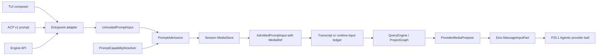
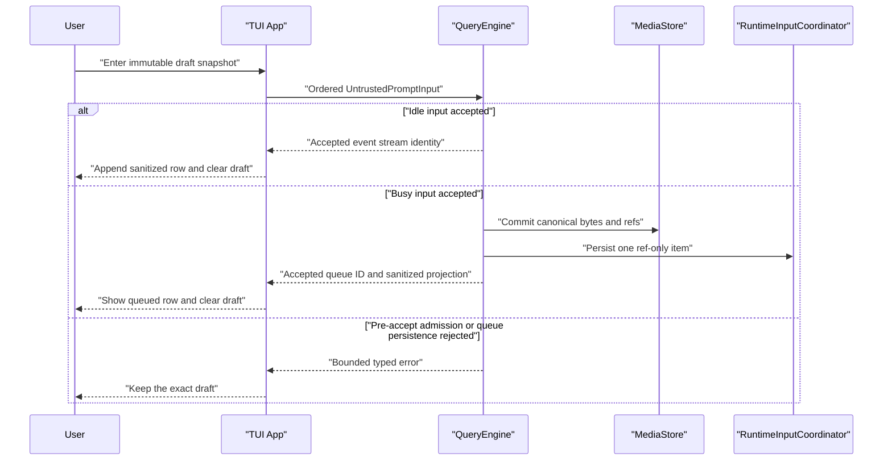

# P30 Cross-Entrypoint Multimodal Input

**Status:** historical
**Created:** 2026-07-27
**Last updated:** 2026-07-30
**Execution state:** P30.0-P30.6 are complete; G32 is closed

> **Ownership:** accepted G32 ordered prompt input, media admission, capability
> truth consumption, private media durability, replay/recovery, TUI and ACP
> projection, ordered atomic slices, promotion gates, and rollback boundaries.
> Root [`migration/PLAN.md`](../PLAN.md) alone owns executable order and slice
> state.

The evidence and reference decision are frozen in
[`multimodal-input-contract-audit.md`](../reference/runtime/multimodal-input-contract-audit.md).
Current implemented behavior remains owned by
[`composer.md`](../../architecture/tui/contracts/composer.md),
[`acp-adapter.md`](../../architecture/platform/acp-adapter.md),
[`model-providers.md`](../../architecture/platform/model-providers.md),
[`transcripts.md`](../../architecture/state/transcripts.md), and
[`recovery.md`](../../architecture/runtime/recovery.md). Completion evidence is
retained in
[`p30-6-multimodal-program-closeout.md`](../history/runtime/p30-6-multimodal-program-closeout.md).

P30 completed its accepted `combine` decision. P30.0-P30.6 are complete.
P30.2 was split at its durable-state and rollback boundaries. P30.2a delivered
the first ref-backed transcript writer and strict reader. P30.2b removed inline
media from the independent runtime-input ledger and transferred the same refs
to transcript settlement. P30.2c completed ref-only lifecycle projections,
independent rich branching, sanitized presentation, private-migration
rejection, and active-owner manual collection. P30.3-P30.5b delivered
recovery, TUI, and ACP projection. P30.6 sealed the writer/reader boundary,
deleted proved transitional paths, completed lifecycle and bounded-cost proof,
and closed G32 after a second independent review.

## Reader Contract

This document freezes the target behavior and the proof required to promote
and close each slice. P30.1c owns immediate `UntrustedPromptInput` and
engine-only `AdmittedPromptInput`; completed P30.2a adds a Session-private
durable `MediaStore` and ref-backed transcript prompt record for that immediate
path. Completed P30.2b extends that ownership to the saved-Session rich queue.
Completed P30.2c extends it to ref-only lifecycle projection, independent
branching, sanitized presentation, and active-owner manual collection.
Completed P30.3 adds exact-turn loss-bounded historical projection,
attempt-local current-image derivatives, and one freshly admitted rich
fallback. Completed P30.4 adds the supported TUI leader's ordered,
clear-after-acceptance, ref-backed, sanitized projection. Completed P30.5a
adds typed live ACP ResourceLink, image, and embedded ingress through the same
engine, store, record, and lifecycle owners.

Completed P30.5b binds exact
prompt records into the immutable Session snapshot and replays their neutral
logical content through P23.4b's single ACP load/staging owner.

Re-open the decision before implementation if any of these signals changes:

- ACP replaces the ordered v1 content or capability contract;
- Eino removes typed user input or Agentic content-block support;
- P23 changes the ResourceLink or ACP capability owner;
- P29 changes the model-capability authority in a way that cannot satisfy the
  three-state resolver below; or
- the first characterization slice disproves the transcript, queue, ordering,
  or recovery gaps recorded by the audit.

## User Outcome

A user can submit one ordered turn such as:

```text
Text("compare "), Image(A), Text(" with "), Image(B), Text(" and explain")
```

through the TUI leader, an ACP session, or the public engine API. The same
logical parts reach:

1. generic input admission;
2. capability admission for the selected route;
3. user-prompt hooks under explicit rich-input rules;
4. the durable queue or transcript;
5. restart, branch, and replay; and
6. kind-specific provider lowering or a stable pre-mutation rejection.

No boundary silently removes, reorders, or refetches a part, and provider
projection follows the frozen kind-specific table below. Unsupported content
fails before the conversation or model-visible state is mutated. If a provider
cannot accept the current turn's media, the turn fails explicitly rather than
producing an answer to a text-only substitute.

## Reproduced Problem

Current code has five independent representations:

- TUI placeholder ranges plus separate image payloads;
- `SubmitMessageWithImages(prompt, []UserImage)`;
- `RuntimeUserPrompt{Prompt, Images}`;
- Eino `schema.Message.UserInputMultiContent`; and
- ACP `[]ContentBlock`, narrowed to a joined text string.

They do not share ordered-part identity, validation, capability truth, or
durability. TUI order is flattened into text then images; ACP preserves
Text/ResourceLink order only through a flattened textual fallback and rejects
image/audio/embedded blocks before mutation; base64 is copied into JSON
persistence; and P30.1a must fail every `media_size` error terminally because
the runtime still cannot distinguish current from historical media safely.

P25.1 proves that the provider leaf can preserve typed ordered parts once they
arrive. P30 therefore repairs the input and lifecycle boundary instead of
replacing the provider loop.

## Decision

P30 uses `combine`:

- preserve QueryEngine/ProjectGraph as the turn and model-loop owners;
- preserve transcript and RuntimeInputCoordinator as their respective durable
  authorities;
- preserve the TUI draft editor, stable element IDs, payload bounds, busy queue,
  and clear-only-after-accept behavior;
- preserve P23 as the ACP baseline/capability/projector owner;
- preserve P25.1 typed Eino-to-Agentic conversion as the provider leaf;
- adapt OpenCode's ordered ACP-to-session parts and shared strict media
  validation;
- adapt Claude Code Ripe's private, mode-`0600`, flushed image store;
- adapt Crush's versioned typed binary persistence, replacing inline bytes with
  refs;
- adapt Codex's typed user input, typed queue, and bounded image preparation;
  and
- add project-native capability provenance, crash ordering, deletion
  containment, legacy migration, and current-turn recovery rules.

The target is one canonical prompt-input path. Legacy text/image APIs are
wrappers, not permanent parallel owners.

## Scope And Non-Goals

P30 owns:

- versioned, ordered, non-interchangeable untrusted and admitted prompt types;
- text, image, ResourceLink, embedded text resource, and embedded blob
  resource parts;
- strict transport decoding and project-wide media safety limits;
- selected-route capability admission and provider preparation;
- one session-private content-addressed media store;
- ref-backed transcript and runtime-input records;
- restart, branch/fork, delete, corruption, and garbage-collection behavior;
- explicit handling for private export/import of media-bearing sessions;
- current-turn versus historical-media compaction/recovery semantics;
- TUI leader and busy-queue ordered rich input;
- ACP image and embedded-resource prompt support after P23.H1, and rich load
  replay only after P23.4b;
- stable error taxonomy and entrypoint projection; and
- compatibility readers for legacy inline-base64 user messages.

P30 does not:

- add audio or video user input;
- make TUI file, skill, or MCP-resource mentions native binary/file parts;
- add image input to the TUI Agent-thread control path;
- fetch HTTP, file, MCP, or other ResourceLink URIs;
- grant filesystem authority from a name, path, URI, or ACP block;
- add image flags to the text-only CLI command line;
- make standalone MCP construct a model runtime;
- replace provider-specific adapters or the P25.1 conversion leaf;
- make arbitrary tool-result or model-generated media durable user input;
- create global or cross-session content deduplication;
- accept SVG or other active document formats in the initial image allowlist;
- infer capability from a provider/model name without provenance;
- define P29 account/profile/failover policy;
- create a portable binary session-archive format; or
- modify existing transcript records during ordinary resume.

Plain/headless CLI remain text-only entrypoints unless a future explicit input
format is accepted. Library callers can use the canonical engine API. TUI leader
and ACP are the first user-facing rich-input surfaces.

## Target Ownership



One component owns each fact:

| Fact | Owner |
|---|---|
| mutable draft ranges, placeholders, clipboard/path read | TUI |
| ACP content decoding and protocol error mapping | `server/acp` |
| untrusted-to-admitted conversion and error category | `PromptAdmission` under engine |
| selected-route capability facts | capability resolver; current registry adapter, later P29 snapshot |
| immutable media bytes and integrity | session `MediaStore` |
| queued input admission/claim | RuntimeInputCoordinator |
| conversation audit and replay order | transcript |
| model-loop ordering, hooks, terminal result | QueryEngine/ProjectGraph |
| route-specific resize/encoding | `ProviderMediaPreparer` |
| provider request block conversion | existing P25.1 provider leaf |

No adapter may keep a second canonical copy of a submitted turn after
admission.

## Canonical Prompt Contract

### Logical schema

The target has two non-interchangeable project-owned shapes:

```go
type UntrustedPromptInput struct {
    Version uint16
    Parts   []UntrustedPromptPart
}

type UntrustedPromptPart struct {
    Kind             PromptPartKind
    Text             *PromptText
    Image            *UntrustedPromptMedia
    ResourceLink     *PromptResourceLink
    EmbeddedResource *UntrustedPromptEmbeddedResource
}

type UntrustedPromptMedia struct {
    SourceKind   PromptMediaSourceKind
    Bytes        []byte
    Base64Data   string
    DeclaredMIME string
    Name         string
    Detail       PromptImageDetail
}

type AdmittedPromptInput struct {
    Version uint16
    Parts   []AdmittedPromptPart
}

type AdmittedPromptPart struct {
    Kind             PromptPartKind
    Text             *PromptText
    Image            *AdmittedPromptImage
    ResourceLink     *PromptResourceLink
    EmbeddedResource *AdmittedPromptEmbeddedResource
}

type AdmittedPromptImage struct {
    Media  MediaRef
    Name   string
    Detail PromptImageDetail
}

type MediaRef struct {
    Version   uint16
    MediaID   string
    MIMEType  string
    SizeBytes int64
    Width     int
    Height    int
}
```

The exact Go layout may use interfaces or validated unions, but neither shape
may depend on an Eino struct. Exactly one payload and, for untrusted media,
exactly one source (`Bytes` or canonical base64) matches each kind. Unknown
versions/kinds fail closed and preserve enough metadata for a bounded corruption
diagnostic.

`UntrustedPromptInput` is the only public submission input. It may contain
transport bytes/base64 but never a caller-supplied `MediaRef`.
`PromptAdmission.Admit` is the only conversion to `AdmittedPromptInput`.
Only the admitted form can enter hooks after generic validation, the durable
queue, transcript, resume/branch, or provider preparation. Internal replay uses
an unexported admitted-turn path and cannot be invoked by an external caller.

Initial kinds are:

| Kind | Untrusted input | Admitted payload and semantics |
|---|---|---|
| `text` | UTF-8 text | Exact admitted bytes; entrypoint-specific trimming happens before construction |
| `image` | Exactly one byte/base64 source plus declared MIME | Immutable `MediaRef`, optional display name, and `auto`/`low`/`high` detail intent |
| `resource_link` | URI and protocol metadata | Opaque metadata; never fetched; version 1 lowers it to P23's bounded deterministic user-text descriptor |
| `embedded_text_resource` | Client-provided UTF-8 content and source metadata | Exact content and sanitized URI/name/MIME metadata |
| `embedded_blob_resource` | Exactly one byte/base64 source and source metadata | `MediaRef` plus sanitized metadata; version 1 accepts only the safe raster-image MIME set |

Audio and video enum values are not accepted in version 1. Reserving a string
does not make a capability real.

### Identity and privacy

- `MediaID` is a cryptographically random, opaque, session-scoped identifier.
- SHA-256 remains private MediaStore manifest data and a within-session
  storage key. It is not part of serialized `MediaRef` and must not appear in
  transcript/ledger refs, normal UI, terminal errors, or ACP messages.
- The original local path is entrypoint provenance only. It is not stored in
  `MediaRef`, provider requests, transcript, or diagnostics.
- A sanitized display name may be retained, but it cannot be used to reopen a
  file.
- ACP ResourceLink URI is stored only because it is the content itself. It
  remains opaque and does not become filesystem/network authority.
- Provider derivatives receive attempt-local IDs. They do not replace the
  canonical bytes or change `MediaID`.

### Ordering and immutability

1. `Parts` order is the user-observable order.
2. Admission does not join text blocks, insert separators, or move media.
3. Text-only TUI retains its current trim behavior before
   `UntrustedPromptInput`.
4. ACP preserves each protocol text block's bytes; all-empty supported content
   is rejected as an empty turn.
5. Adjacent text may be merged only at a provider leaf with an equivalence
   fixture for that provider.
6. Once admitted, a part and its referenced bytes are immutable.
7. Display labels and source paths never substitute for content.
8. A command is admitted only from a text-only prompt. Command-looking text
   accompanied by rich parts fails explicitly.

### Compatibility APIs

`SubmitMessage` builds one untrusted text part.

`SubmitMessageWithImages` maps each legacy `UserImage` to one untrusted base64
part, builds text then image parts in the existing observable order, and calls
`SubmitPromptInput(UntrustedPromptInput)`. `PromptAdmission` performs the only
strict decode. Existing callers remain source-compatible. The public API cannot
submit an admitted ref directly.

`RuntimeUserPrompt{Prompt, Images}` remains readable during migration, but new
durable writes use one versioned prompt envelope. After all writers migrate,
the legacy fields become decode-only and are removed in a separately promoted
cleanup slice.

## Admission And Capability

### Two admission phases

Generic admission is independent of the selected model:

1. validate the untrusted union/version/order/count/source exclusivity;
2. strictly decode transport base64;
3. normalize MIME syntax and sniff bytes;
4. enforce project byte/dimension/pixel/format limits;
5. write immutable media through an admission transaction; and
6. return an immutable `AdmittedPromptInput` containing only text/metadata and
   MediaStore refs.

Route admission occurs immediately before a turn is committed:

1. freeze the selected route/capability snapshot;
2. intersect project limits with route limits;
3. check modality, MIME, count, bytes, detail, and source form;
4. prepare deterministic attempt-local derivatives when allowed;
5. revalidate any hook-updated text envelope; and
6. commit the transcript reference before the first model call.

For a busy queued turn, generic admission and media storage precede ledger
commit. Route admission is repeated when the item is claimed because the model
may have changed. A claim-time rejection records a stable terminal queue result
and does not append a conversation turn or call the model.

### Initial project safety envelope

Version 1 reuses current TUI memory limits as the maximum project envelope:

| Limit | Initial value |
|---|---:|
| total parts | 32 |
| media parts | 20 |
| decoded bytes per media part | 5 MiB |
| decoded media bytes per prompt | 10 MiB |
| pixels per raster image | 25,000,000 |
| text bytes in one embedded resource | 1 MiB |

These are project safety ceilings, not provider promises. Configuration may
lower them but cannot raise them without a reviewed policy-version change.
Provider limits may be stricter.

Initial image MIME types are `image/png`, `image/jpeg`, `image/webp`, and
non-animated `image/gif`. SVG, animated GIF, HEIC/HEIF, TIFF, malformed or
polyglot data, and declared/detected MIME mismatch fail. Supporting another
decoder or rasterizer requires an explicit dependency, resource, and security
review.

Image admission reads metadata with bounded input, verifies dimensions and
pixel count, then performs a complete bounded decode. A header-only check is
insufficient for truncated data or decompression bombs.

### Capability snapshot

P30 consumes:

```text
PromptCapabilitySnapshot {
  version
  route_identity
  generation
  source
  modalities: supported | unsupported | unknown
  mime_types
  max_parts
  max_bytes_per_part
  max_total_bytes
  max_pixels
  image_detail_modes
}
```

The current registry/provider resolver supplies an adapter until P29 provides
the configured profile snapshot. P29 owns capability fact provenance; P30 owns
the admission decision for a concrete prompt.

Rules:

- `supported` admits only the declared subset.
- `unsupported` returns `modality_unsupported`.
- `unknown` returns `capability_unknown`; rich input never fails open.
- A generation/route change between admission and model call invalidates the
  prepared request and restarts route admission.
- Fallback may use only a route that accepts every current-turn part. It cannot
  silently drop a modality to become eligible.
- Diagnostics may expose capability source and reason code, never bytes,
  base64, local path, ResourceLink credentials, or digest.

## Hook And Command Semantics

The existing user-prompt-submit hook receives text. P30 version 1 preserves
that API under bounded rules:

- reject and additional-context results remain valid;
- `UpdatedPrompt` may replace the text only when the turn has exactly one text
  part and all media follow it, matching the legacy text-then-images shape;
- an update returned for interleaved or multi-text rich input fails with
  `hook_rich_rewrite_unsupported`;
- hook attachments remain separate engine-owned context messages;
- hooks do not receive media bytes, base64, local paths, or opaque ResourceLink
  credentials; and
- any updated text is rebuilt into a new `AdmittedPromptInput` retaining the
  same immutable refs and revalidated before durable turn commit.

A future rich-aware hook version must accept and return the complete versioned
part envelope. It cannot overload the legacy string result.

Slash and shell commands remain text-only. A prompt with any rich part never
executes a command after discarding that part.

## Session-Private MediaStore

### Layout

For transcript `<root>/<session>.jsonl`, the owned media sidecar is:

```text
<root>/<session>.jsonl.media/
  manifest.json
  blobs/
    sha256/
      ab/
        abcdef...
```

Directories request mode `0700`; manifest, blobs, and temporary files request
`0600`. Existing overly broad modes fail diagnostics and are repaired only by
an explicit migration action, not silently during an unrelated read.

The store is private to one session. Equal bytes in two sessions are separate
lifetime domains. Within one session, a verified digest may reuse one immutable
blob.

### Write protocol

An admission transaction writes in this order:

1. stream decoded bytes into a random create-exclusive temp file;
2. compute digest and exact size while writing;
3. decode/validate the complete media;
4. `fsync` the temp file;
5. atomically rename it to the digest path, or verify an existing immutable
   blob;
6. `fsync` the blob directory;
7. atomically replace and sync the versioned manifest;
8. append the prompt ref to the runtime ledger or transcript; and
9. only then make the turn model-visible.

This order prefers a harmless orphan blob over a durable reference to missing
bytes. A failure before step 8 removes transaction-owned temporary/manifest
entries when possible. A crash orphan is reclaimed only after a grace period
and a complete reference scan.

For an immediate rich turn, transcript reference persistence failure is
terminal before the model call. Text-only turns retain their existing
persistence policy until a separate contract changes it.

### Manifest and integrity

The versioned manifest maps random `MediaID` values to immutable digest, size,
MIME, dimensions, creation time, and admitted kind. It does not store original
paths or raw URIs.

On open/resume:

- reject symlinks and non-regular blob/manifest targets;
- validate every requested ID against manifest version and shape;
- open with no-follow semantics where the platform supports it;
- verify exact size before use;
- verify digest before the first use after process start and cache only that
  verified result;
- report missing/corrupt refs without substituting a placeholder for the
  current turn; and
- bound corruption reporting.

### Garbage collection

Live references are the union of:

- active and append-only transcript prompt records;
- durable runtime-input items not terminally released; and
- in-flight admission transactions.

Compaction does not delete source media because the append-only audit may still
reference it. Session-local GC removes only unreferenced manifest entries and
blobs older than the configured grace period. It never scans outside the exact
owned media directory and never follows links.

The first implementation may leave GC manual/at-open and conservative. It may
leak an orphan temporarily; it may not delete a referenced blob.

## Transcript, Queue, And Legacy Migration

### New durable record

New rich user turns use a versioned `user-prompt` transcript record containing
`AdmittedPromptInput` with refs. Assistant/tool/system records retain the
current schema.

The transcript remains the conversation-order authority; MediaStore owns bytes.
An Eino `schema.Message` is a runtime/provider projection, not the durable
multimodal schema.

`LoadFull` must expose the prompt record without loading all media bytes.
Session resume resolves refs and materializes the Eino input needed by the
active conversation. Inspection, list, and bounded paging can render sanitized
part descriptors without reading blobs.

The runtime-input envelope stores the same versioned prompt and `MediaRef`
values. It never embeds base64 after migration.

### Legacy records

Existing Eino user messages with inline `UserInputMultiContent` remain
readable:

1. validate their typed shape;
2. strictly validate legacy base64 before use;
3. materialize bytes into a session admission transaction when durable resume
   needs them;
4. use the derived refs in memory for that process; and
5. do not rewrite old JSONL lines automatically.

A legacy record larger than the existing scanner budget cannot be recovered by
guessing. P30.0 must freeze this limitation; a later P30.2 reader may introduce
a bounded streaming record decoder only with memory/resource tests.

New writers never append legacy inline base64. Mixed old/new transcripts are
valid.

### Branch/fork

Branching computes the media refs reachable from the selected transcript
prefix. It stages a child-private media directory containing only those blobs,
verifies each copy, syncs it, and then commits the child transcript with the
existing no-clobber semantics.

If media staging fails, no child transcript is published. If a crash leaves a
staged/committed media directory without a child transcript, session discovery
ignores it and exact-root cleanup may reclaim it. Source session bytes and
manifest are never mutated.

Hard links are not used in version 1 because they couple lifecycle,
permissions, and corruption across otherwise private sessions.

### Delete

`engine/session.DeleteSession` remains the only deletion owner. P30 adds the
exact `<session>.jsonl.media` directory to its owned set.

Preflight validates:

- the existing transcript and file sidecars;
- media directory ancestry and final target;
- only expected directories, manifest, digest shards, blobs, and temporary
  names;
- no symlink at any level; and
- every target remains under the resolved transcript root.

Any unexpected entry fails before mutation. After complete preflight, deletion
retains the session service's documented best-effort multi-target semantics;
P30 does not claim an atomic filesystem transaction that the store cannot
provide. A bounded exact-root orphan cleanup can remove a leftover media
sidecar after transcript deletion, but never an arbitrary directory.

### Export/import

Current Markdown/JSON export is presentation, not a portable binary archive.
It renders sanitized media descriptors and never embeds bytes by default.

The private ACP migration token does not contain conversation bytes today.
Until a separate portable media package is designed, exporting or importing a
media-bearing session through that private extension returns
`media_export_unsupported`; it may not report success while omitting media.

## Provider Preparation

`ProviderMediaPreparer` runs after route admission and before P25.1. It:

- resolves `MediaRef` through the bound store;
- verifies the selected route generation and effective limits;
- deterministically resizes/re-encodes only when that route permits it;
- preserves canonical bytes and records derivative metadata in memory;
- produces typed Eino base64 or URL input accepted by the provider adapter;
- releases derivative buffers after the attempt; and
- returns redacted typed errors.

No provider adapter receives an internal `media://` URI. P25.1 continues to see
ordinary valid Eino media parts and retains its fail-before-inner-call checks.

Retrying the same route may reuse a verified deterministic derivative. Switching
routes repeats preparation under the new capability snapshot. A fallback route
that cannot accept all current parts is ineligible.

Version 1 freezes this lowering table:

| Admitted kind | Selected-route requirement | Eino/provider projection |
|---|---|---|
| `text` | text supported | One exact text part |
| `image` | image supported, MIME/detail/budgets proven, inline source allowed | One prepared base64 image part |
| `resource_link` | text supported; descriptor is within the P23 metadata bound | P23's deterministic `<resource_link>` user-text descriptor; the URI is never opened or forwarded as a URL |
| `embedded_text_resource` | text and embedded-text projection supported | One deterministic JSON text envelope containing sanitized metadata and exact content |
| `embedded_blob_resource` | image and embedded-image projection supported; MIME is in the safe raster set | One deterministic metadata text envelope immediately followed by one prepared image part |

The JSON envelope has a versioned project-owned schema and escapes every
metadata/content string. It is user input, not a system instruction. One
logical embedded part may expand to the adjacent text/image pair shown above,
but the pair remains at that part's exact position.

Provider URL source forms are disabled in version 1 even when an upstream API
can fetch URLs. No ResourceLink or internal MediaStore URI is forwarded to a
provider. Adding a native ResourceLink or URL form requires a separate accepted
egress/authority contract and provider-specific wire fixtures.

## Compaction And Recovery

### Canonical bytes never change

Compaction and recovery operate on a projected model context. They do not
rewrite transcript prompt records or MediaStore bytes.

### Historical media

For a compaction-summary request, historical media may be replaced in that
request by a deterministic text marker:

```text
[historical image omitted during media-size recovery: mime=image/png detail=high]
```

The marker contains no turn/ref/media ID, path, digest, URI, or bytes. The
resulting compact boundary records that historical media was omitted from
summary input. The append-only audit and blob remain available for
inspection/replay.

For a normal provider retry caused by historical media limits, recovery may
replace historical media only when:

- the media belongs to a turn strictly before the current turn ID;
- every omitted part gets a deterministic marker in the same position;
- the current turn is preserved byte-for-byte;
- one bounded retry remains; and
- a visible recovery event records the omission count and reason.

### Current-turn media

Current-turn media is never stripped after the turn is committed. Recovery may:

1. retry the same prepared request under the existing bounded retry policy;
2. build a deterministic route-approved derivative from the canonical bytes;
3. switch to an eligible fallback that accepts every part; or
4. return a terminal input/media error.

It may not call the model with text-only input and return `completed`.

`TestQueryMediaSizeRecoveryStripsMediaAndContinues` must be replaced by tests
that distinguish historical omission from current-turn failure. The original
immutability assertion remains.

## Entrypoint Contract

| Entrypoint | Version 1 input | Capability/error behavior | Durable behavior |
|---|---|---|---|
| TUI idle leader | Ordered text and image parts | Unknown/unsupported model keeps draft and shows stable error | Transcript stores refs |
| TUI busy leader | Ordered immutable snapshot | Generic admission before enqueue; route admission at claim | Ledger and transcript store same refs |
| TUI Agent thread | Text only | Rich input rejected and draft retained | No new behavior |
| slash/shell command | Text only | Any rich part rejects before dispatch | No rich command record |
| public engine API | `SubmitPromptInput`; legacy wrappers | Typed terminal error | Durable when session store is configured; turn-scoped ephemeral store otherwise |
| plain/headless CLI | Text only | No inferred attachment syntax | Existing behavior |
| ACP session | Text, ResourceLink, image, embedded text/blob | P23 baseline plus P30 advertised image/embedded; audio explicit unsupported | Same ref-backed transcript |
| standalone MCP | No model prompt runtime | No capability advertised | No behavior |

For a sessionless library engine, an internal ephemeral MediaStore implements
the same admission/read interface for the lifetime of the turn. It has no
resume, branch, or export claim and is never selected by TUI/ACP production
composition.

## ACP Contract

P30's live ACP prompt slice begins only after P23.H1 establishes:

- exact ordered Text and opaque ResourceLink baseline parsing;
- stable unsupported/malformed protocol errors; and
- truthful capability construction.

P30 then adds:

- `image: true` after image wire, persistence, provider, and restart fixtures;
- `embeddedContext: true` after embedded text/blob fixtures;
- `audio: false`;
- ordered conversion without joining text or dropping unknown blocks;
- generic and selected-route admission before prompt state mutation;
- stable ACP errors mapped from the engine taxonomy; and
- real-client interoperability.

ResourceLink is carried into generic and selected-route admission as opaque
metadata. Neither `server/acp` nor core admission calls `os.Stat`, reads a path,
invokes MCP, performs network I/O, or forwards the URI as a provider URL.
Version 1 preserves P23.H1's bounded deterministic user-text descriptor at the
part's exact position. This is the accepted no-egress representation and does
not invent a filesystem, MCP, network, or provider-URL capability.

Embedded text is client-provided text and uses the deterministic JSON text
projection above. Embedded blob uses the same strict decode and MediaStore path
as an image; version 1 accepts only the safe raster-image MIME set and projects
metadata text followed by the image. Unsupported MIME or selected-model
capability rejects the whole turn; partial admission is not allowed.

Agent-level advertised support means the server can correctly ingest, persist,
and route the content. A selected session model can still reject a concrete
turn through a stable capability error, especially after model switching.

## Error Taxonomy

Errors expose part index, kind, stable reason code, and safe limit/capability
facts. They never include base64, bytes, local path, digest, credential-bearing
URI, or provider raw body.

| Reason code | Meaning |
|---|---|
| `invalid_prompt_version` | Unknown prompt or part version |
| `invalid_prompt_part` | Union mismatch, unknown kind, or empty whole turn |
| `invalid_base64` | Non-canonical or undecodable transport payload |
| `media_type_mismatch` | Declared MIME disagrees with decoded bytes |
| `media_format_unsupported` | Format is outside the project safe allowlist |
| `media_too_large` | Part or aggregate byte budget exceeded |
| `media_dimensions_exceeded` | Dimension/pixel/decode budget exceeded |
| `resource_descriptor_invalid` | ResourceLink metadata cannot produce P23's bounded deterministic no-fetch descriptor |
| `modality_unsupported` | Selected route explicitly lacks the modality |
| `capability_unknown` | Route capability cannot be proven |
| `media_store_unavailable` | Durable store required but not safely available |
| `media_persistence_failed` | Blob/manifest/transcript/ledger commit failed |
| `media_reference_missing` | Ref does not resolve on replay |
| `media_integrity_failed` | Size/digest/decode verification failed |
| `unsupported_rich_command` | Rich content accompanied a command dispatch |
| `hook_rich_rewrite_unsupported` | Legacy hook attempted ambiguous rich rewrite |
| `media_export_unsupported` | Private migration cannot preserve session media |

The engine introduces a general typed input terminal or error envelope. During
migration, existing image-only callers may continue receiving
`TerminalImageError` as a compatibility projection. ACP and TUI map reason
codes; they do not parse error strings.

## Ordered Atomic Slices

Root `PLAN.md` must promote exactly one slice. Later rows are not executable
merely because an earlier row closes.

### P30.0 — Characterization and owner seam

**Completed:** 2026-07-29. Delivery evidence is
[`p30-0-multimodal-characterization.md`](../history/runtime/p30-0-multimodal-characterization.md);
the complete reproducible owner inventory is
[`p30-0-multimodal-characterization.md`](../verification/p30-0-multimodal-characterization.md).

**Purpose:** prove the current defects without changing production behavior.

Deliver:

- a TUI fixture showing placeholder order differs from submitted Eino parts;
- ACP fixtures proving exact Text/ResourceLink fallback order and no fetch, plus
  explicit pre-mutation rejection of image/audio/embedded content and the
  absence of a typed rich-input path;
- a transcript fixture showing a legal current image record can exceed the
  8 MiB scanner budget;
- current model-capability unknown/fail-open fixtures;
- current versus historical media recovery fixtures;
- a complete writer/reader/branch/delete/export owner inventory; and
- typed target interfaces compiled only in tests.

Promotion proof:

- every claimed current boundary is pinned by a passing characterization
  fixture that proves the corresponding target invariant is not yet met;
- no production source behavior changes;
- P23.H1 and P29 ownership overlaps are explicitly mapped; and
- the plan is updated if any premise is false.

Rollback: remove only characterization fixtures and test-only target types.

#### P30.0 Promotion Freeze

**Selected:** 2026-07-29 from Eino-Agent
`4afa0f17507a831b85a2f972aa1a04deadf32a4a`.

**Problem.** Current supported entrypoints disagree before the provider leaf:
TUI placeholder position is not model part order, ACP has only a flattened
Text/ResourceLink fallback and rejects richer blocks, shared public image
admission is structural and capability-unknown fails open in the TUI, inline
base64 can exceed the transcript reader budget, and reactive recovery may
remove current-turn media before a successful answer.

**Scope.** P30.0 may add focused `_test.go` fixtures and test-only target
interfaces under `internal/tui`, `server/acp`, `engine`,
`engine/transcript`, `engine/session`, and the smallest existing recovery
test owner. It updates this contract, the root queue, the G32 gap row, and one
source-backed owner inventory. Production `.go` behavior, public APIs,
persisted schemas, provider requests, capabilities, commands, and UI are
unchanged.

**Non-goals.** P30.0 does not accept new media, advertise an ACP capability,
change validation, move bytes to a media store, alter transcript/runtime-input
records, repair recovery, or make P30.1a ready.

**Adoption.** `combine`: preserve all current production owners and P23.H1's
explicit zero-mutation rejection; characterize the ordered typed-input,
private-store, tagged-persistence, and preparation mechanisms selected from
OpenCode, Claude Code Ripe, Crush, and Codex. Compatibility is unchanged
because only tests and documentation are added.

**Frozen invariants.**

- Characterization calls production entrypoints or their production-wired
  owning functions; duplicate test parsers do not count.
- ACP Text/ResourceLink bytes and order are pinned, ResourceLink causes no
  filesystem/network/MCP access, and unsupported rich content returns before
  QueryEngine submission, session registration, transcript, or model calls.
- The transcript fixture uses a turn legal under the current TUI per-image and
  aggregate bounds, and demonstrates that its complete encoded record exceeds
  the current 8 MiB scanner limit without committing a huge fixture file.
- Capability fixtures distinguish known supported, known unsupported, and
  missing engine/model/registry facts; current missing-fact fail-open behavior
  is characterized, not endorsed.
- Recovery fixtures distinguish historical and current-turn media and pin the
  current semantic downgrade without changing the source message.
- The owner inventory names every production writer, reader, queue,
  branch/fork, delete, export, compaction, and provider-lowering boundary and
  labels entrypoint reachability.
- Test-only target types are non-interchangeable ordered untrusted/admitted
  parts; they cannot be imported by production code or mistaken for a shipped
  API.

**Ownership overlaps.** P23 remains the ACP capability, decoding, error, and
projection owner; P30.0 only characterizes its production path. P29 owns future
profile/capability provenance and route selection; P30 consumes that fact
through the frozen three-state resolver, while P30.0 changes neither current
registry lookup nor future P29 schema.

**Deterministic validation.**

```bash
go test ./engine -run 'TestSubmitMessageWithImages|TestQueryMediaSize|TestP30'
go test ./engine/transcript -run 'Test.*P30|Test.*Image|Test.*Record'
go test ./engine/session -run 'Test.*P30|Test.*Branch|Test.*Delete|Test.*Export'
go test ./internal/tui -run 'Test.*P30|Test.*Composer.*Image|Test.*ModelSupportsImages'
go test ./server/acp -run 'Test.*P30|Test.*Prompt'
go test -race ./engine/... ./internal/tui/... ./server/acp/...
make fmt
make lint
make test
make build
make docs-check
git diff --check
```

Passing P30.0 proved the current mismatch and owner map; it did not prove the
target behavior. P30.1a may be promoted only in a later root-PLAN change after
the merged fixtures and inventory receive a separate selection review.

**Rollback.** Revert the P30.0 test and documentation commit. No production or
durable-state rollback exists.

### P30.1a — Terminal media-size safety

**Completed:** 2026-07-29. Delivery evidence is
[`p30-1a-terminal-media-safety.md`](../history/runtime/p30-1a-terminal-media-safety.md).

#### P30.1a Promotion Freeze

**Selected:** 2026-07-29 from Eino-Agent
`11222dc54ea3591711d24c484cc2329ef0c77a01`.

**Problem.** A `media_size` provider failure currently runs reactive
compaction over the complete model-visible message list. Because that list has
no trusted current-turn identity, the retry can remove media from the question
the user just asked and then publish an answer to a different prompt.

**Scope.** All supported QueryEngine entrypoints already converge on
`runCanonicalAfterModelRound`. P30.1a makes its first `media_size` failure
terminal with `TerminalImageError`: publish the existing withheld provider
error, run stop-failure settlement once, and perform no media compaction or
model retry. The implementation is limited to `engine/round_lifecycle.go`,
`engine/recovery/media.go`, their focused tests, and the current recovery and
migration owner documents.

**Non-goals.** This slice adds no ordered prompt API, prompt types, generic
media validator, capability resolver, provider preparer, durable media format,
TUI/ACP rich path, historical omission, fallback route, or new error payload.
P30.1b owns strict legacy image admission, P30.1c owns immediate-turn ordered
admission, P30.2 owns turn identity and durability, and P30.3 may later restore
bounded historical-only recovery.

**Adoption and compatibility.** `project-native` within P30's accepted
`combine` program: when the runtime cannot prove which media is historical,
it fails closed instead of adapting a lossy reference retry. This intentionally
removes the current strip-and-answer compatibility path. Historical-media
oversize also fails terminally until P30.2 supplies durable turn identity and
P30.3 proves a loss-bounded historical projection.

**Frozen invariants.**

- A `media_size` failure causes exactly one provider attempt for that round and
  no reactive-compaction retry.
- The current message list and caller-owned message values are not mutated.
- No `EventCompactBoundary` or successful assistant answer is emitted after
  the failure.
- The existing withheld error and stop-failure path settle once before
  `TerminalImageError`.
- Prompt-too-long, max-output-token, cancellation, hook, permission, tool, and
  non-media terminal behavior is unchanged.
- Direct SDK, TUI, Plain, headless, ACP, and child execution inherit the same
  QueryEngine-owned rule; adapters add no separate recovery policy.

**Deterministic validation.**

```bash
go test ./engine/recovery -run 'TestTryMediaRecovery'
go test ./engine -run 'TestQueryMediaSize|TestP301a'
go test -race -timeout=20m ./engine/...
make fmt
make lint
make test
make build
make docs-check
go run ./scripts/migration_manifest.go check-ledger
go run ./scripts/migration_manifest.go check
git diff --check
```

**Rollback.** Do not restore strip-current-and-complete behavior. If the
implementation must be backed out, replace it with an equivalent earlier
fail-closed `media_size` terminal at the same canonical round owner. Historical
media retry stays disabled until P30.3 closes its identity and omission gates.

### P30.1b — Strict legacy image admission and provenance containment

**Completed:** 2026-07-29

**Depends on:** completed P30.0 and P30.1a.

Delivery evidence is
[`p30-1b-strict-image-admission.md`](../history/runtime/p30-1b-strict-image-admission.md).

#### P30.1b Promotion Freeze

**Selected:** 2026-07-29 from Eino-Agent
`46b820af93d9da5f375576db0770813bb9b90d62`.

**Problem.** The public engine image API and the durable busy-input path accept
any non-empty base64 string paired with any non-empty MIME string. They do not
bound decoded aggregate size, dimensions, or pixels; prove declared MIME
against complete decoded content; reject animation or trailing payloads; or
stop caller-supplied local `Path`/`Name` metadata from entering model-visible
parts and the transcript. TUI extension checks and its 5 MiB file-size limit
do not protect direct SDK callers or recovered queue items.

**Scope.** P30.1b adds one engine-owned strict image validator used by
`SubmitMessageWithImages`, `RuntimeInputCoordinator` admission/recovery, and
the existing queued rich-input path before any durable or model-visible
mutation. It may add the smallest decoder dependency required for WebP. The
existing `SubmitMessage`, Plain, headless, sub-Agent, and ACP text-only paths
remain byte-for-byte compatible. Accepted legacy turns still lower as one
complete text part followed by images in caller order.

The version-1 envelope is at most 20 images, 5 MiB decoded bytes per image,
10 MiB decoded bytes per prompt, and 25,000,000 pixels per image. Accepted
formats are PNG, JPEG, WebP, and a single-frame GIF.

Admission uses strict base64 decoding, normalized declared MIME, bounded
sniffing, declared/detected MIME equality, a complete bounded decode, and an
exact terminal boundary that rejects trailing payloads. SVG, animated GIF,
HEIC/HEIF, TIFF, malformed, truncated, mismatched, over-limit, or unsupported
input fails with a stable typed reason code that exposes neither bytes, base64,
path, name, nor digest.

`UserImage.Path` and `UserImage.Name` remain source-compatible caller fields,
but admission treats both as untrusted provenance. Neither field is copied
into Eino multipart `Extra`, the transcript, provider input, queue error, or
terminal error. TUI may continue to render its own pre-submission attachment
label.

**Non-goals.** This slice does not add public ordered prompt types,
`MediaRef`, a MediaStore, selected-route capability checks, provider
derivatives, a new interleaved API, hook rewrite rules, rich commands,
durable-format changes, TUI/ACP capability changes, historical-media recovery,
or provider failover. It does not reorder existing text-then-image input.

**Adoption and compatibility.** `project-native` within P30's accepted
`combine` program: reuse the current TUI byte ceiling as a project-wide
maximum, add a smaller aggregate and decoded-resource boundary at the
QueryEngine owner, and fail closed independently of provider identity.
Existing valid PNG/JPEG/WebP/single-frame GIF callers remain source- and
behavior-compatible except that local display metadata no longer reaches the
model or transcript. SVG, animated GIF, malformed, falsely declared, and
over-limit inputs that previously passed structural checks now fail before
mutation.

**Frozen invariants.**

- The same validator and reason-code vocabulary govern direct idle submission,
  busy queue admission, durable queue recovery, and safe-point projection.
- Validation completes before permission-review intent, prompt hooks,
  transcript append, runtime-input ledger mutation, queue append, or model
  invocation.
- Every accepted image is strict-base64 decoded once for validation; all
  decoded byte/count/dimension/pixel budgets use overflow-safe arithmetic.
- MIME detection is derived from content, not extension, path, name, or the
  caller declaration. The declaration must normalize to the exact supported
  detected MIME.
- Complete decode plus an exact end boundary rejects truncated content,
  decompression bombs within the declared envelope, multiple-frame GIF, and
  trailing payloads.
- Validation errors contain only the zero-based image index and a stable
  reason code.
- Accepted model-visible parts preserve the existing complete-text-then-images
  order and exact image bytes/MIME; image `Extra` is empty.
- The first `media_size` provider failure remains terminal under P30.1a. This
  slice adds no recovery or retry.

**Deterministic validation.**

```bash
go test ./engine -run 'TestUserImageAdmission|TestSubmitMessageWithImages|TestQueryEngineQueueRejectsInvalidUserImages|TestRuntimeInputCoordinator.*Image|TestP300FlattenedPrompt|TestP301a'
go test -race -timeout=20m ./engine/...
make fmt
make lint
make test
make build
make lint-new
make docs-check
make docs-check-ci
go run ./scripts/migration_manifest.go check-ledger
go run ./scripts/migration_manifest.go check
git diff --check
```

**Closeout.** P30.1b proves supported-format success, every frozen negative
class, direct and queued zero-mutation failure, provenance redaction, legacy
order equivalence, and retained P30.1a terminal behavior. At P30.1b closeout,
P30.1c remained queued until a separate root-PLAN promotion.

**Rollback.** If the shared implementation must be removed, retain an
equivalent strict validator and provenance redaction at every current image
entrypoint before mutation. Rollback may replace the decoder implementation;
it may not restore arbitrary MIME/base64 admission, path/name projection, or
strip-current-and-complete recovery.

### P30.1c — Canonical ordered prompt types and route admission

**Status:** Complete

**Purpose:** make one immediate engine turn lossless and route-compatible
without yet changing durable media format.

**Depends on:** completed P30.1b.

#### P30.1c Promotion Freeze

**Selected:** 2026-07-29 from Eino-Agent
`905b7a3258940adbc67f1640e57b4b91e4fee33e`.

**Problem.** P30.1b makes each legacy image safe but still accepts one complete
string plus a separate image list. `newUserMessage` therefore places all text
before all images, and the public engine cannot represent
`Text, Image, Text, Image`. Provider routing resolves an exact provider/model,
but media support is still a separate static fact: `GetCapabilities` supplies
defaults for unknown names and the TUI fails open when no exact registry row
exists. Passing generic image validation therefore does not prove that the
route used for a model call supports the ordered rich turn.

P25.1 already preserves ordered Eino multipart input once it reaches the
provider leaf. P30.1c owns the missing immediate engine boundary; it does not
replace provider routing or widen a durable or UI protocol.

Current evidence is
[`QueryEngine.SubmitMessageWithImages`](../../../engine/engine.go),
[`newUserMessage`](../../../engine/user_input.go),
[`provider.Runtime.ResolveModel`](../../../engine/provider/runtime.go),
[`ModelRegistry.Lookup`](../../../engine/model/registry.go),
[`messagesToAgentic`](../../../engine/provider/provider.go), and the
[`P30.0 owner inventory`](../verification/p30-0-multimodal-characterization.md).
The exact ordering, unknown-capability, provider-lowering, and P30.1b
regressions are pinned by
[`TestP300FlattenedPromptPrecedesAllImages`](../../../engine/user_input_test.go),
[`TestP300CurrentModelSupportsImagesCharacterizesMissingFactsAsFailOpen`](../../../internal/tui/composer_elements_test.go),
[`user_input_conversion_test.go`](../../../engine/provider/user_input_conversion_test.go),
and
[`user_image_admission_test.go`](../../../engine/user_image_admission_test.go).

**Public and internal shape.**

- `UntrustedPromptInput` is a version-1 public ordered list of engine-defined
  text and image part implementations. Its part interface has an unexported
  marker so callers cannot add unknown variants.
- The public image part carries base64, declared MIME, and optional
  `auto`/`low`/`high` detail. It has no path, caller-supplied ref, provider
  payload, or arbitrary metadata.
- `AdmittedPromptInput` is engine-constructible only: its fields and ordered
  admitted-part implementations are not caller-settable.
- `MediaRef` names one image in an invocation-local in-memory store. It is
  unpredictable, generation-bound, never accepted from a caller, and becomes
  invalid when the turn ends.
- `SubmitPromptInput(context.Context, UntrustedPromptInput)` is the new public
  entrypoint. `SubmitMessage` and `SubmitMessageWithImages` remain wrappers;
  the image wrapper produces one text part followed by images and reuses the
  P30.1b validator.

Version 1 admits text and image parts only. ResourceLink, embedded resource,
audio, video, and file variants remain plan-only until their owning slice
defines safe admission and projection.

**Generic and selected-route admission.**

1. Clone and validate the complete untrusted ordered input without mutating
   caller memory.
2. Reuse P30.1b strict image admission unchanged, validate detail, move bytes
   into the turn-local store, and construct non-interchangeable admitted
   parts.
3. Resolve the exact model spec selected by the existing first-round
   QueryEngine policy through `ModelResolver.ResolveModel`.
4. Resolve image support only through an exact or canonical-alias
   `ModelRegistry.Lookup` row whose provider agrees with the resolved route.
   Exact support is `supported` or `unsupported`; missing resolver, incomplete
   route, provider mismatch, or missing exact fact is `unknown`.
5. Bind provider, model, engine prompt-route generation, capability source,
   part order, media refs, MIME, and detail into one immutable preparation.
   Re-check the binding immediately before every rich model call.

Text-only input never requires media capability. Rich `unsupported` and
`unknown` results fail closed before prompt hooks, permission-review intent,
transcript/history mutation, runtime events, ledger mutation, or model
invocation.

The normal CLI/TUI/ACP composition root installs this adapter from the existing
provider Runtime and exact model registry. `QueryEngineConfig` accepts an
explicit `PromptCapabilityResolver` for embedded/custom chat models and
deterministic tests; absence remains `unknown`, never inferred support.

Successful model or mode route mutation advances one engine-owned
prompt-route generation. The existing first-round model selector, not
`GetModelName` alone, supplies the prepared model spec. A generation,
provider, model, capability, ref, or part-order mismatch fails before a model
call. P30.1c does not prepare an alternate rich route: an existing fallback
attempt may continue for text-only input, but rich input cannot cross to a
different route without a separately admitted preparation. The separately
configured `SummaryModel` also has no admitted rich route, so proactive
auto-compaction uses its existing deterministic path for the live rich turn
instead of calling that model.

`ProviderMediaPreparer` is a narrow engine/provider-boundary interface. Its
version-1 implementation resolves each valid turn-local ref to the exact
base64/MIME/detail image part consumed by the existing P25.1 projection. It
does not resize, transcode, fetch, upload, persist, cache across turns, or
change provider adapters.

**Hook and command rules.** Generic and selected-route admission complete
before a hook runs. User-prompt hooks receive only the exact concatenation of
text parts; image bytes, refs, MIME, detail, and synthetic placeholders are
absent. Denial remains effective. A hook rewrite may replace the sole text
part in a legacy-shaped turn; a non-identical rewrite of multiple interleaved
text parts fails closed because no unambiguous ordered mapping exists.

`SubmitPromptInput` never parses or dispatches slash commands. Entrypoints
retain their current command owner and must resolve a command before calling
the rich API; direct public input is literal prompt content.

**Scope and compatibility.** This is `project-native` within P30's accepted
`combine` program. Preserve QueryEngine as the turn owner, provider Runtime as
the route owner, the exact-lookup capability table as temporary current fact,
P30.1b as generic image admission, and P25.1 as provider lowering. Add typed
ordered input, an invocation-local ref owner, fail-closed three-state route
admission, and a generation-bound preparer without waiting for P29's future
portfolio schema.

Existing text-only traces remain equivalent. Valid legacy image calls retain
complete-text-then-images order but now also fail closed when the exact
selected route is unsupported or unknown. That compatibility tightening is
intentional; a successful provider decode is not capability evidence.

**Non-goals.** This slice does not:

- persist ordered inputs or media refs, rewrite transcript/runtime-input
  records, or migrate the busy durable queue;
- advertise or accept new TUI, ACP, Plain, headless, sub-Agent, command, or
  Goal rich-input surfaces;
- add ResourceLink, embedded content, audio, video, file, URL, or caller-ref
  input;
- create provider derivatives, uploads, alternate-route preparation, rich
  failover, historical recovery, or a new model profile/capability inventory;
  or
- change P30.1a terminal recovery, P30.1b limits/provenance, P23 ACP rejection,
  or P25.1 provider projection.

**Frozen invariants.**

- Untrusted and admitted types are not assignable or implementation-extensible
  across the admission boundary.
- The exact caller order reaches the inner provider for successful
  interleaved input; no lowering step reconstructs order from a text string and
  image slice.
- Unsupported, unknown, malformed, or stale rich input reaches no hook or
  durable/model mutation. An ambiguous non-identical hook rewrite has run only
  on text bytes and reaches no transcript, event, ledger, or model mutation.
- Errors expose part index, kind, stable reason, and bounded route identity
  only. They never include text content, bytes, base64, ref, path, name,
  digest, credential, or provider body.
- Turn-local bytes and refs are destroyed on every success, rejection,
  cancellation, hook failure, model failure, and engine close path.
- Route preparation is immutable and generation-bound. A fallback or model
  mutation cannot reuse another route's preparation.
- Legacy wrapper validation, ordering, provenance containment, and terminal
  behavior remain covered by P30.1a/P30.1b fixtures.

**Deterministic validation.**

```bash
go test ./engine -run 'TestP301c|TestSubmitPromptInput|TestSubmitMessageWithImages|TestUserImageAdmission|TestP300FlattenedPrompt|TestP301a'
go test ./engine/provider -run 'TestP301c|TestAgenticUserInput'
go test -race -timeout=20m ./engine/...
make fmt
make lint
make test
make build
make lint-new
make docs-check
make docs-check-ci
go run ./scripts/migration_manifest.go check-ledger
go run ./scripts/migration_manifest.go check
git diff --check
```

**Promotion proof.**

- text-only and legacy text-then-image traces remain equivalent;
- interleaved API input reaches the inner model in exact order;
- unsupported or capability-unknown immediate rich input produces no hook,
  transcript, ledger, or inner-model mutation;
- route generation changes invalidate preparation;
- P30.1b validation/provenance and P30.1a terminal behavior remain unchanged;
  and provider-leaf redaction tests remain green;
- direct new-API cancellation, every rejection branch, hook failure, model
  failure, and engine close release the complete turn-local store; and
- an attempted rich fallback performs no call on the alternate route; and
- proactive auto-compaction performs no rich call on the unadmitted summary
  route.

Completion and reproducible gate evidence is retained in
[`p30-1c-ordered-prompt-admission.md`](../history/runtime/p30-1c-ordered-prompt-admission.md).

**Rollback.** Disable `SubmitPromptInput` and remove its ordered type,
turn-store, resolver, route-generation, and preparer owners as one unit. Retain
the legacy APIs with P30.1b strict validation and provenance containment.
Rollback may remove route admission only by disabling the new rich API; it may
not restore malformed admission, metadata leakage, or
strip-current-and-complete behavior.

### P30.2 — Durable MediaStore and ref-backed session state

**Purpose:** make rich input restartable without inline durable base64.

The original P30.2 combined three irreversible state boundaries in one slice:
the first ref-backed transcript writer, the independently committed
runtime-input queue, and every Session lifecycle consumer. Current
`transcript.recordEntry` still stores Eino messages inline;
`RuntimeInputCoordinator` owns a separate JSON envelope; branch and export
reconstruct state through `LoadFull`; and deletion preflights only known file
sidecars. Shipping all of those owners together would make a failure in one
consumer block rollback of the first durable reader.

The accepted outcome and `combine` decision are unchanged. P30.2 is split by
which durable record first refers to private bytes:

| Slice | Durable boundary | Observable result |
|---|---|---|
| P30.2a | transcript `user-prompt` record | an immediate rich API turn survives restart without inline transcript bytes |
| P30.2b | runtime-input prompt envelope | a queued image turn survives process restart without inline ledger bytes |
| P30.2c | Session lifecycle readers and writers | branch, paging, export, and GC preserve exact ref reachability |

The split adapts Claude Code Ripe's private flushed file store, Crush's tagged
ordered parts, and Codex's typed input order. It rejects their exposed paths,
inline binary persistence, and turn-local-only queue ownership. OpenCode
confirms that typed parts and fork cloning are valuable, but its durable data
URLs are not adopted. Opaque durable media identity, manifest integrity,
publish ordering, containment, and lifecycle reachability remain
project-native.

#### P30.2a Promotion Freeze

**State:** completed on 2026-07-29. Delivery evidence:
[`p30-2a-durable-media-store.md`](../history/runtime/p30-2a-durable-media-store.md).

**Depends on:** completed P30.1c ordered admission and selected-route binding.

**Problem.** A successful `SubmitPromptInput` call still lowers its admitted
image into an Eino `schema.Message` whose base64 payload is written inline.
One legal 5 MiB image can exceed the transcript reader's 8 MiB record budget,
and the P30.1c invocation-local store is destroyed after the turn. Restart
therefore cannot recover the project-owned ordered input independently of that
inline representation.

**User outcome.** For a saved Session, one immediate ordered text/image turn is
durably committed as a small versioned prompt record plus private media bytes.
After process restart, the same logical part order can be materialized for the
next model turn. Missing, corrupt, or unsupported media fails before a model
call. Existing text-only and legacy inline transcripts remain readable without
ordinary-resume rewrites.

**Adoption and owners.** This slice is `project-native` within P30's accepted
`combine` program. Preserve QueryEngine as the immediate-turn owner,
transcript as the conversation-order authority, P30.1b as the byte validator,
P30.1c as ordered/capability admission, and P25.1 as provider lowering. Add one
session-private `MediaStore` implementation behind the existing
invocation-local abstraction and one additive transcript record. Do not add a
second Session database, queue, replay loop, capability table, or provider
adapter.

**Store and publish protocol.**

1. A saved Session owns exactly
   `<transcript>.media/{manifest.json,blobs/sha256/<prefix>/<digest>}`.
   The store root and directories are mode `0700`; regular files are mode
   `0600`. No symlink or non-regular component is accepted.
2. The version-1 manifest maps a cryptographically random, opaque `MediaID` to
   digest, decoded size, detected MIME, dimensions, and creation kind. Digest
   and storage path never enter a transcript record, runtime event, normal
   diagnostic, or public error.
3. A write uses create-exclusive staging, bounded streaming digest and size
   verification, temp-file sync, no-clobber blob publication or exact existing
   blob verification, blob-directory sync, atomic manifest replace, and
   manifest-directory sync. Every operation is cancellation-aware and exposed
   through a deterministic file-operation test seam.
4. Only after the blob and manifest are durable may transcript append a
   versioned `user-prompt` record. Transcript flush completes before the
   corresponding user event or model call. A crash may leave an unreachable
   orphan; it may never leave a visible ref whose bytes were not durably
   published.
5. Rejection, cancellation, Hook failure, selected-route drift, and model
   failure attempt to remove any newly unreachable staging state. Failed
   cleanup remains a conservative orphan, not a transcript ref. P30.2a performs
   no automatic age-based or reachability GC.

**Transcript record and read contract.**

- `user-prompt` is a closed versioned ordered union of text and image-ref
  parts. Version 1 stores opaque media ID, detected MIME, decoded size,
  dimensions, and image detail; it stores no bytes, base64, digest, path, URI,
  caller name, or caller metadata.
- The record carries one stable prompt/turn identity and existing transcript
  entry identity. Unknown version, unknown kind, duplicate/invalid media ID,
  mismatched metadata, trailing JSON, over-limit content, missing blob, or
  digest mismatch fails closed with a bounded redacted category.
- `LoadFull` retains legacy message records byte-for-byte and exposes enough
  typed prompt information for current consumers. Resume materializes a
  ref-backed prompt only through its owning store and revalidates size, MIME,
  dimensions, and digest before model-visible use. Ordinary resume never
  rewrites legacy or new records.
- The immediate rich path writes exactly one logical user prompt and does not
  later append a second inline user message. Text-only writers and valid
  legacy inline image records remain behaviorally unchanged.
- Sessionless engines keep an ephemeral, zero-on-close implementation and do
  not claim restart durability. No public caller can submit an existing
  `MediaRef`.

**Lifecycle containment in this slice.**

- `DeleteSession` recognizes the exact media sidecar, preflights the complete
  expected tree without following links, and rejects symlinks, unexpected
  entries, root escapes, or non-regular blobs before deleting anything. It
  removes the transcript before private bytes, so interruption can leave only
  unreachable media, never a surviving transcript with missing media.
- Branch/fork rejects a source prefix containing any `user-prompt` media ref
  before creating or mutating a child. Markdown/JSON export and private
  migration similarly return stable `media_branch_unsupported` or
  `media_export_unsupported` results before output or destination mutation.
  Text-only and legacy-inline behavior remains unchanged.
- P30.2c, not this slice, enables those lifecycle operations for ref-backed
  Sessions. Explicit rejection is the safe compatibility boundary until then.

**Non-goals.** P30.2a does not:

- change `RuntimeInputCoordinator` or write refs into its durable ledger;
- add TUI, ACP, Plain, headless, child-Agent, command, or Goal rich-input
  surfaces;
- enable branch/fork, export/import, paging, or GC for ref-backed Sessions;
- compact, omit, resize, transcode, upload, refetch, or fall back historical
  media;
- change current media capability admission, Hook rewriting, provider
  lowering, or P30.1a terminal recovery; or
- remove the legacy inline transcript reader or migrate existing records.

**Frozen invariants.**

- Caller order, admitted part identity, image detail, and selected-route
  binding remain unchanged from P30.1c.
- Durable byte publication precedes durable ref publication; durable ref
  publication precedes any user event or model call.
- Every visible ref resolves within exactly one Session store. Media IDs are
  random and non-derivable; neither IDs nor digests are accepted from public
  input.
- Reader validation is at least as strict as P30.1b admission. Corruption,
  cancellation, or unknown versions produce no partial history, placeholder
  answer, provider call, or automatic rewrite.
- Errors and diagnostics expose only bounded category, part index, record
  version, and Session-relative operation. They expose no text, bytes, base64,
  ref value, path, digest, URI, name, credential, or provider body.
- Deletion, branch rejection, and export rejection complete their full
  preflight before the first mutation. Link replacement races fail closed.
- Existing text-only traces and legacy inline records remain readable.

**Deterministic validation.**

```bash
go test ./engine -run 'TestP302a|TestSubmitPromptInput|TestP301c|TestUserImageAdmission'
go test ./engine/transcript -run 'TestP302a|TestLoadFull|TestBranch'
go test ./engine/session -run 'TestP302a|TestDelete|TestExport'
go test -race -timeout=20m ./engine/...
make fmt
make lint
make test
make build
make lint-new
make docs-check
make docs-check-ci
go run ./scripts/migration_manifest.go check-ledger
go run ./scripts/migration_manifest.go check
git diff --check
```

Fault tests must cover create, write, sync, close, rename/publication, directory
sync, manifest replace, transcript append/flush, open/read, validation, delete
preflight, and link-replacement boundaries. Happy-path file tests alone do not
prove crash safety.

**Promotion proof.**

- one 5 MiB image creates a bounded `user-prompt` transcript record, contains
  no inline bytes/base64/path/digest, and reaches the same ordered provider
  parts after a fresh engine restart;
- each injected crash boundary yields either no visible prompt or a fully
  resolvable prompt, never a dangling ref or pre-flush provider call;
- missing, corrupt, replaced, over-limit, unknown-version, and metadata-
  mismatched media fails before an event/model call with redacted diagnostics;
- successful rich input is recorded once; text-only and mixed legacy
  transcripts remain readable without rewrite;
- Session deletion safely removes the exact sidecar or rejects before any
  mutation, while branch/export/private migration reject ref-backed Sessions
  without creating partial output; and
- cancellation and every failure path release temps and in-memory bytes;
  deliberately retained orphans are inaccessible and are not auto-collected.

**Rollback.** Stop new `user-prompt` writes and route new immediate rich calls
through P30.1c's legacy inline transcript path or disable that rich API.
Retain the versioned reader, MediaStore, safe deletion, and branch/export
guards for every record already written. The reader and guards cannot be
removed while a P30.2a record exists.

#### P30.2b Promotion Freeze

**State:** completed.

**Depends on:** completed P30.2a store, reader, and deletion contract.

**Purpose:** remove inline media bytes from the independently committed
runtime-input ledger without changing TUI ordering or adding a new rich
surface.

**Problem.** The saved-Session queue has its own atomic JSON ledger and
recovery state machine. `EnqueueUserInput` currently copies `UserImage`
objects into `RuntimeUserPrompt.Images`, so `persistLocked` writes the complete
base64 payload into every replacement ledger. A legal 5 MiB image therefore
duplicates private bytes outside the P30.2a MediaStore, expands every
enqueue/claim/cancel/settle rewrite, and keeps caller-shaped inline media in a
second durable format. P30.2a deliberately did not change this owner.

**User outcome.** A rich input submitted while a saved Session is busy is
durably queued as a small ordered ref envelope. It survives a process restart,
can be claimed once, and transfers the same refs into the transcript before
the queue item settles. A missing, corrupt, unsupported, or route-incompatible
ref fails before model entry and never causes a second claimable copy. Existing
text-only items and valid legacy inline queue files remain readable.

**Adoption and owners.** This slice is `project-native` within P30's accepted
`combine` program. Preserve `RuntimeInputCoordinator` as the only durable queue
and scheduling owner, QueryEngine queue methods as the supported user-input
surface, transcript delivery coverage as the crash-settlement authority,
P30.2a's Session-private MediaStore and `user-prompt` record as the byte/ref
owners, P30.1b as the byte validator, P30.1c as selected-route admission, and
P25.1 as provider lowering. Do not add another queue, claim journal, Session
database, media root, replay loop, capability table, or provider adapter.

**Ref prompt envelope.**

- A new saved-Session rich queue item carries one closed version-1 prompt
  envelope under its existing `RuntimeItemUserPrompt` payload. It contains one
  immutable turn ID and ordered text/image-ref parts using the P30.2a record
  limits and media metadata. Display text remains a detached UI projection.
- The envelope and its containing queue item form a strict union with the
  legacy `Prompt` plus `Images` representation. A new item cannot mix inline
  media and refs, omit its turn/item identity, duplicate a media ID, carry an
  unknown part/version, or add bytes, base64, digest, path, URI, caller name,
  or caller metadata.
- The queue item ID remains the durable scheduling and settlement identity.
  The envelope turn ID becomes the exact QueryEngine event/transcript turn
  identity. The materialized transcript message retains the queue item ID in
  its existing runtime metadata, so transcript delivery coverage settles only
  that item after restart.
- Only the engine-owned rich queue writer may create a ref envelope. Public or
  direct coordinator callers cannot inject a caller-supplied ref. New rich
  writes to a durable coordinator must use the bound writer; an
  invocation-local coordinator may retain its existing ephemeral behavior.

**Publish, claim, and settlement protocol.**

1. `EnqueueUserInput` freezes queue item ID and turn ID, applies P30.1b strict
   validation, copies decoded images into the exact P30.2a Session MediaStore,
   clears transient bytes, then asks `RuntimeInputCoordinator` to publish one
   ref-backed item. Store publication and sync complete before the ledger temp
   file is written, synced, closed, atomically replaced, and its directory
   synced. A failed ledger commit leaves only an unreachable conservative
   orphan.
2. The coordinator commits `pending -> processing` before returning a claim.
   Before that commit, the owning MediaStore resolves every ref and revalidates
   metadata and bytes. The returned claimed copy may carry detached ephemeral
   bytes for admission, but the persisted processing item and every snapshot
   remain ref-only. Failure leaves the original pending item durably unchanged.
3. `SubmitRuntimeItem` rebuilds the literal current queue order: existing TUI
   text followed by its images. It reuses P30.1c selected-route admission and
   Hook rules, uses the envelope turn ID, and records one P30.2a
   `user-prompt` with the same refs. It does not copy blobs or allocate new
   media IDs for a claimed queue item.
4. Transcript ref append and flush complete before
   `RuntimeInputCoordinator.Settle` removes the processing item. The overlap
   transfers reachability from ledger to transcript without a ref-free window.
   If transcript persistence or settlement fails, recovery uses the existing
   runtime item ID coverage: delivered items disappear; undelivered processing
   items return to pending.
5. Cancel and `/queue edit` may remove only a still-pending item through the
   existing coordinator commit. Edit remains cancel-then-restore and creates a
   new queue identity only on a later submit; it is not an in-place ref
   mutation. Cancellation, edit, Hook rejection, and failed enqueue may leave
   conservative orphans. P30.2c, not this slice, owns reachability GC.

**Recovery and compatibility.**

- Construction reads both the new ref envelope and the existing inline
  `RuntimeUserPrompt`. New ref records are closed and bounded; legacy inline
  records continue through P30.1b validation and are never converted merely
  by load. A later ordinary ledger rewrite may preserve them inline unchanged.
- A recovered `processing` item with no transcript delivery returns to
  `pending`; one whose exact runtime item ID is covered by a durable transcript
  record is removed. Stale stop, Goal continuation, permission, Agent, and
  async-rewake behavior remains unchanged.
- Claim and submission both validate the current selected route. If a model
  switch makes image input unsupported or unknown, no model call or transcript
  write occurs. A pre-claim failure leaves the item pending; a post-claim
  failure durably releases the exact item to pending. The item keeps its refs
  and cannot be claimed concurrently.
- Restore staging keeps the existing deferred-recovery rule: reading and
  replay delivery precede the first recovery rewrite. Ref validation is
  read-only during staging, and failed staging cannot publish a recovered
  ledger generation.

**Non-goals.** P30.2b does not:

- change TUI composer ordering, attachment labels, queue commands, idle wake,
  previews, ACP, Plain, headless, child-Agent, command, Goal, or steering
  surfaces;
- add an in-place queue-edit API or expose durable refs to callers;
- enable branch, export, paging, inspection, import, migration, or GC for
  ref-backed Sessions;
- compact, resize, transcode, omit, upload, refetch, or fall back media;
- change P30.1a terminal recovery, P30.1b limits, P30.1c Hook/route semantics,
  P25.1 lowering, or text-only runtime items; or
- remove the legacy inline queue reader or automatically migrate old ledgers.

**Frozen invariants.**

- Durable bytes precede the first durable queue ref. A transcript ref precedes
  removal of the last queue ref. A crash may create an orphan but never a
  visible dangling ref or a claimable duplicate.
- Pending, processing, cancelled, delivered, and settled state remains owned by
  one coordinator revision. File state commits before memory state on every
  queue mutation.
- Queue item ID, turn ID, part order, detail, media metadata, runtime scope,
  priority, sequence, and selected route cannot be substituted across enqueue,
  claim, submission, transcript settlement, or restart.
- Ref resolution is at least as strict as P30.2a/P30.1b. Corruption,
  cancellation, unknown versions, or route drift produces no partial prompt,
  event, provider call, automatic rewrite, or blob deletion.
- New durable queue JSON and bounded errors contain no media bytes, base64,
  digest, path, URI, caller name, caller metadata, ref value, credential, or
  provider body. The private manifest remains the sole ref-to-digest authority.
- In-flight and transcript-reachable refs are never deleted in this slice.
  Cancelled or failed items lose ledger reachability only after their exact
  mutation commits; physical reclamation is deferred to P30.2c.

**Deterministic validation.**

```bash
go test ./engine -run 'TestP302b|TestRuntimeInputCoordinator|TestQueryEngineQueue|TestSubmitRuntimeItem|TestP302a'
go test ./engine/transcript -run 'TestP302a|TestRuntimeItem|TestLoadFull'
go test ./engine/session -run 'TestP302a|TestDelete|TestExport|TestBranch'
go test ./internal/tui -run 'TestQueue|TestP300ComposerImageDraftOrder'
go test -race -timeout=20m ./engine/...
make fmt
make lint
make test
make build
make lint-new
make docs-check
make docs-check-ci
go run ./scripts/migration_manifest.go check-ledger
go run ./scripts/migration_manifest.go check
git diff --check
```

Fault tests must cover every P30.2a store publication step used by queue
enqueue, ledger create/write/sync/close/replace/directory-sync, claim
preflight and processing commit, transcript ref append/flush, settlement,
release, cancellation, restore-staging commit, and process restart. Race tests
must exercise concurrent enqueue/claim/cancel/settle and store access.

**Promotion proof.**

- one queued legal 5 MiB image produces a bounded ref-only ledger, survives a
  fresh-engine restart, and reaches the same text-then-image provider input
  with the same detail while the ledger contains no bytes, base64, path, name,
  URI, or digest;
- every injected store/ledger crash boundary yields either no queue item or one
  fully resolvable item, and every claim/settle boundary yields at most one
  claimable copy under the exact runtime item and turn identities;
- cancel, edit restore, failed claim, Hook rejection, model switch, transcript
  failure, settlement failure, and restart retain or release only the exact
  refs and never delete media reachable by a live queue item or transcript;
- valid legacy inline rich items and text-only/mixed runtime ledgers remain
  readable without load-time conversion, while malformed legacy or new
  records fail closed with bounded diagnostics; and
- all P30.2a immediate-turn, restart, delete, branch/export/paging rejection,
  corruption, and lifecycle-checkpoint fixtures remain green.

**Rollback.** Stop new ref-envelope writes and route new rich queue input
through the previous strict inline envelope or disable rich busy-queue input.
Retain the new reader, legacy reader, MediaStore, transcript ref writer,
delivery-coverage settlement, exact deletion, and branch/export/paging guards
for every record already written. Do not remove or collect bytes that an
existing ledger, processing claim, or transcript can still reach.

**Delivery evidence:** verified implementation, compatibility, crash-order,
large-image restart, exact-ref transfer, safe-point, route-drift, missing
media, conservative-orphan, concurrency, race, and repository-gate evidence
is retained in
[`p30-2b-runtime-media-refs.md`](../history/runtime/p30-2b-runtime-media-refs.md).

#### P30.2c Promotion Freeze

**State:** `Complete`.

**Depends on:** completed P30.2a and P30.2b durable writers.

**Purpose:** enable ref-backed Session lifecycle operations only after both
durable rich writers use the same private ref contract.

**Problem.** P30.2a and P30.2b made immediate and queued rich prompts
restartable, but the surrounding Session lifecycle still has incompatible
readers. `transcript.LoadMessagePage` rejects any `user-prompt` or lifecycle
record carrying refs. `session.BranchSession` and `session.ExportSession`
materialize the complete active transcript through `LoadFull` and reject
before child or output mutation. The ACP migration token carries no private
store, while cancelled, rejected, or failed rich writes can leave conservative
orphans indefinitely. Removing those guards independently would either expose
private identity, copy the wrong prefix, or collect bytes between store
publication and durable ref commit.

**User outcome.** A saved rich Session can be inspected, exported as a
sanitized presentation, and branched at the same active-message boundary as a
text-only Session. A branch owns independent private bytes and can survive
source deletion. Manual collection removes only a ref proven unreachable from
the transcript, the complete runtime-input state, and an in-flight writer.
Corrupt or unsupported records fail before a partial branch, output,
collection, import, resume mutation, event, or provider call.

**Adoption and owners.** This slice is `project-native` within P30's accepted
`combine` program. Preserve `engine/session` as the branch, export, listing,
and deletion orchestrator; transcript as the physical record, active-context,
revision, and bounded-page authority; `RuntimeInputCoordinator` as the only
pending/processing/submitting owner; QueryEngine as the live Session and
manual-collection owner; and the P30.2a MediaStore as the only manifest/blob
owner. Do not add a Session database, second media index, background worker,
portable-media token, provider adapter, or UI state owner.

**Ref-only transcript projection.**

- Transcript adds one closed ordered projection for `user-prompt` and
  lifecycle `prompt_messages`. Trusted engine/session consumers can retain the
  validated typed ref record, while public Session and Agent inspection sees
  only ordered text and sanitized image metadata. Neither path calls
  `MediaStore.Resolve`, creates base64, reads a blob, or mutates the transcript.
- `LoadMessagePage` keeps its existing maximum 128 logical rows and 8 MiB
  physical-read budget, frozen file identity, snapshot prefix, record ordinal,
  opaque cursor, lifecycle continuation, and append-tolerant semantics.
  Ref-backed rows participate in the same source order and identity checks
  instead of returning `ErrTranscriptRichPagingUnsupported`. One oversized,
  malformed, duplicate-ref, unknown-version, replaced, or truncated record
  still fails closed with a bounded diagnostic.
- `AgentTranscriptPage` projects the descriptor into bounded ordered parts.
  Image parts expose only kind, MIME type, size, dimensions, and detail. They
  never expose a MediaStore ref value, media ID, digest, path, URI, bytes,
  base64, caller metadata, or provider body. Existing text/tool rows and
  cursor/generation fencing are unchanged.
- Lightweight Session listing never resolves blobs. It retains a Session with
  valid rich records and reports only a bounded `none`, `refs`,
  `record_corrupt`, or `unknown` durable-media state. A malformed rich record
  cannot be silently presented as text-only. Resume remains the strict
  resolver and fails before live state mutation when a referenced blob or
  manifest authority is missing or corrupt.

**Prefix-exact branch protocol.**

1. `BranchSession` freezes one regular non-symlink source transcript object,
   exact snapshot size/revision, final active context, and the first
   `MessageIndex` non-nil active messages. It selects ref records from that
   same active prefix; superseded snapshots, later messages, pending queue
   items, and unrelated manifest entries are not branch reachability.
2. Before target mutation, the branch validates every selected prompt record,
   resolves and revalidates every selected unique ref against the source
   manifest, validates source identity again, and preflights the target
   transcript plus media sidecar. Missing, corrupt, substituted, oversized, or
   unknown input creates neither child.
3. The branch copies bytes into a same-parent private staging store by ordinary
   read/write; hard links, symlinks, reflink claims, shared mutable manifests,
   source paths, and source media IDs are forbidden. The child MediaStore
   mints new opaque IDs, deduplicates only within that child, and rewrites the
   selected prompt records to those child refs while preserving turn ID,
   runtime-item delivery ID, part order, MIME, size, dimensions, and detail.
4. The staged child sidecar is synced and installed before a same-directory
   child transcript temp is synced and installed no-clobber. The child
   transcript commit is the visibility point. A crash may leave only an
   unreachable child staging/final sidecar; it may never expose a transcript
   whose refs are missing. Parent directories are synced in publication order.
5. Existing `OperationID` retry semantics bind source Session, source
   revision, active-prefix count, child ID, ref mapping, and child transcript
   identity. An exact committed child is reused; a mismatch or uncertain
   partial publication fails closed. Cleanup removes only operation-owned
   staging state through the same no-link containment checks.

The source transcript, manifest, blobs, metadata, and mtimes remain unchanged
on success and across every injected failure. Source deletion after a
successful branch cannot break child resume. Text-only and valid
legacy-inline branches retain their existing result and idempotence semantics.

**Sanitized export and private migration rejection.**

- `session.ExportSession` consumes the ref-only active-context projection.
  Markdown renders an ordered stable placeholder such as
  `[image: image/png, 1024x768, 1234 bytes, detail=high]`. JSON adds an ordered
  closed `parts` union with text or the same image descriptor. Existing
  text-only `content`, tool filtering, metadata options, and message count
  remain source-compatible.
- Presentation export never resolves a blob and emits no private ref value,
  media ID, digest, path, URI, bytes, base64, caller metadata, credential, or
  provider body. Malformed rich records fail before any `ExportResult` is
  returned; no partial Markdown or JSON is observable.
- Presentation export is not a restorable archive. ACP
  `SessionMigrationToken` still carries no transcript or private store.
  Exporting a ref-backed active Session for ACP migration fails explicitly
  before token creation, and importing a token that would rely on private
  media fails before engine creation or Session registration. P30.2c does not
  introduce media import, upload, archive, or cross-host migration.

**Live-owner reachability and manual GC.**

- Manual GC is exposed only by the QueryEngine that owns the exact active,
  saved Session recorder, durable coordinator, and MediaStore. Invocation-
  local engines, inactive/offline helpers, closing engines, unknown store
  roots, and multi-process or cross-host collection are unsupported and fail
  closed. No timer, startup sweep, size threshold, or automatic collection is
  added.
- One QueryEngine media-lifecycle gate spans every P30.2a/P30.2b
  store-publication-to-transcript/ledger-commit window. Rich writers hold a
  shared lease; GC holds the exclusive lease. Failed writers release only
  their in-memory lease and may leave a conservative orphan for a later
  manual run.
- Under that exclusive lease, GC captures the transcript file identity,
  snapshot revision and every valid prompt ref; the coordinator revision and
  refs from all pending, processing, submitting, and deferred-recovery items;
  and the MediaStore manifest. It rejects malformed/unknown records, missing
  authority, uncertain durability, revision drift, closing/cancellation, or a
  root/link replacement. It revalidates transcript identity/revision and
  coordinator revision immediately before manifest mutation.
- The MediaStore atomically publishes a pruned manifest containing every live
  ID before unlinking any blob not reachable from the retained manifest.
  A crash before manifest publication changes nothing; a crash afterwards can
  leave an unreferenced blob but never a live ref to deleted bytes. Blob and
  temp enumeration is root-anchored, bounded, regular-file-only, and never
  follows links. Shared content remains while any retained manifest entry
  reaches its digest.
- Dropped queue items, Hook rejection, failed enqueue, and failed transcript
  or settlement operations become collectible only after their exact durable
  mutation committed and no transcript/coordinator/in-flight ref remains.
  Concurrent claims and same-ref queue-to-transcript transfer may retain extra
  bytes conservatively but cannot cause premature deletion.

**Corruption and delete behavior.**

- List and bounded inspection may report record corruption without resolving
  private bytes. Resume, branch, and provider entry require strict ref/blob
  validation. Branch, export, ACP migration, and GC complete all preflight
  before child, output, token, manifest, or blob mutation.
- Existing exact Session deletion remains independent of reachability:
  containment preflight covers transcript, runtime-input ledger, complete
  MediaStore sidecar, and known siblings; transcript removal remains the
  visibility point before private sidecar deletion. Missing/corrupt media does
  not make the Session undeletable, while any symlink, replacement, or
  unexpected tree entry rejects before mutation.
- Valid text-only, legacy-inline, ref-only, and mixed legacy/ref files retain
  their current restart behavior. New readers never rewrite or convert a
  durable record merely because it was inspected, listed, exported, branched,
  or considered for GC.

**Non-goals.** P30.2c does not:

- change TUI composer ordering or add TUI/ACP/Plain/headless/child-Agent rich
  ingress, previews, attachment controls, or provider lowering;
- compact, resize, transcode, omit, summarize, upload, refetch, or fall back
  media; P30.3 owns loss-bounded historical projection;
- make sanitized export importable or add portable private-media migration;
- add background, automatic, offline, global, cross-Session, cross-project, or
  multi-process GC, global content deduplication, quotas, or retention policy;
- branch pending runtime input, in-flight claims, superseded active-context
  records, arbitrary physical line prefixes, or MediaStore orphans; or
- remove the legacy-inline reader, P30.2a/P30.2b ref readers, safe delete,
  selected-route admission, or temporary compatibility errors needed by
  records outside this slice's proven surface.

**Frozen invariants.**

- A child transcript becomes visible only after every child-private ref is
  durable. It contains exactly the selected active-message prefix and its
  unique reachable bytes, uses newly minted child IDs, and shares no inode,
  manifest authority, or mutable media state with the source.
- Paging and presentation operate on typed durable records, not materialized
  media. Ordered text/image descriptors remain at the original positions and
  cannot leak a private identity or byte representation.
- Store bytes precede the first durable ref; a transcript ref precedes removal
  of the last queue ref; an exclusive GC proof precedes manifest pruning; a
  pruned manifest precedes blob deletion. Faults may create or retain an
  orphan, never a dangling visible ref.
- Transcript file identity/revision, coordinator revision, queue item ID, turn
  ID, runtime-item delivery ID, ref metadata, active-prefix boundary,
  OperationID, and child identity cannot be substituted across branch,
  inspection, export, collection, restart, or retry.
- Every path, link, corruption, version, size, count, cancellation, and
  durability error is bounded and redacted. No failure returns a partial
  child, output, token, prompt, page, manifest mutation, or provider call.
- QueryEngine, session, transcript, runtime-input, MediaStore, delete, and
  provider owners remain singular. P30.2c adds coordination and projections,
  not another durable truth.

**Deterministic validation.**

```bash
go test ./engine/internal/mediastore -run 'Test.*Copy|Test.*Collect|Test.*Fault|Test.*Link'
go test ./engine/transcript -run 'TestP302c|TestLoadMessagePage|TestBranch|TestP302a|TestRuntimeItem'
go test ./engine/session -run 'TestP302c|TestBranch|TestExport|TestDelete|TestList'
go test ./engine -run 'TestP302c|TestAgentTranscriptPage|TestP302a|TestP302b|TestRuntimeInputCoordinator'
go test ./server/acp -run 'TestP302c|TestSessionMigration|Test.*Load|Test.*List'
go test -race -timeout=20m ./engine/...
GOOS=windows GOARCH=amd64 go test -c ./engine/internal/mediastore
GOOS=windows GOARCH=amd64 go test -c ./engine/transcript
GOOS=windows GOARCH=amd64 go test -c ./engine/session
GOOS=windows GOARCH=amd64 go test -c ./engine
make fmt
make lint
make test
make build
make lint-new
make docs-check
make docs-check-ci
go run ./scripts/migration_manifest.go check-ledger
go run ./scripts/migration_manifest.go check
git diff --check
```

Fault tests must cover source snapshot/open/read/revalidation, child store
create/write/sync/close/publish, child manifest and transcript
create/write/sync/close/no-clobber publication, directory sync, idempotent
retry, ref-only page decode, export preflight, lifecycle-lease acquisition,
reachability snapshot/revalidation, manifest prune, blob unlink, and
post-delete directory sync. Race tests must exercise rich enqueue, immediate
prompt persistence, claim/submission/settlement, paging, branch, cancellation,
and manual GC against the same Session.

**Promotion proof.**

- a branch contains exactly prefix-reachable private bytes under newly minted
  child refs, uses no hard link or shared manifest, survives source deletion,
  and leaves source bytes and metadata unchanged across every injected
  boundary;
- paging, Agent inspection, and listing remain bounded, cursor-fenced,
  non-materializing, and preserve ordered sanitized descriptors for direct,
  queued, lifecycle-checkpoint, legacy-inline, and mixed records;
- Markdown/JSON export contains no private bytes or identifiers, while ACP
  private-media migration and any import claim fail explicitly before
  mutation;
- no transcript, pending, processing, submitting, deferred-recovery, or
  writer-leased ref is collected, while a proven orphan and only its
  now-unreferenced blob can be removed without following links;
- branch/export/GC faults expose no dangling ref, partial child/output, or
  premature deletion, and exact retries either reuse the committed result or
  fail closed; and
- P30.2a-P30.2b immediate/queued restart, same-ref settlement, safe delete,
  corruption, route-admission, cancellation, and legacy compatibility
  fixtures remain green.

**Rollback.** First disable manual GC and restore P30.2a's branch/export/paging
and ACP-migration guards for any Session with refs. Then remove child-copy and
sanitized presentation writers. Retain the ref-only readers, MediaStore,
P30.2a/P30.2b record readers and writers, runtime-input compatibility,
media-lifecycle gate while any old writer can still run, exact deletion, and
all records already committed. A successful child remains a normal
independent Session; rollback may not relink it to its source or remove its
private store.

**Delivery evidence.** The completed implementation, compatibility, branch
publication order, ref-only projections, private-migration rejection,
reachability proof, fault/race/cross-platform validation, and rollback boundary
are retained in
[`p30-2c-session-media-lifecycle.md`](../history/runtime/p30-2c-session-media-lifecycle.md).

**Next state.** P30.3-P30.6 remain accepted but queued, G32 remains open, and
no successor became `Ready` automatically. Root `PLAN.md` must promote one
slice in a separate iteration.

### P30.3 Promotion Freeze

**State:** `Complete`.

**Depends on:** completed P30.1c selected-route admission and P30.2a-P30.2c
turn/ref durability and lifecycle ownership.

**Purpose:** recover from one provider `media_size` failure without changing
the current question or rewriting canonical media.

**Problem.** The canonical round currently sends one admitted rich prompt and
makes every `media_size` result terminal. That fail-closed P30.1a behavior is
correct while current and historical media are indistinguishable, but P30.1c
and P30.2 now provide exact turn identity, ordered parts, private canonical
bytes, and route-bound admission. The runtime still lacks a loss-bounded
projection owner: it cannot omit provably historical images, make one
attempt-local derivative of current images, or prove a fallback route before
calling it. Re-enabling the old all-image stripping transform would answer a
different question and is forbidden.

**User outcome.** When old images make an otherwise valid rich turn too large,
the runtime may replace only those historical parts with visible ordered
markers and retry once. Current-turn images remain present as canonical bytes
or deterministic attempt-local derivatives. If neither the selected route nor
one exactly eligible fallback can accept the complete current turn, the turn
ends with a redacted `TerminalImageError`; it never reports a text-only
completion.

**Adoption and owners.** This slice is `project-native` within P30's accepted
`combine` program. Preserve QueryEngine/ProjectGraph as the logical-turn and
canonical-round owner; `promptrecord.Record` and the admitted input binding as
the exact turn/part/route identity; transcript lifecycle boundaries as the
durable active-context transition; MediaStore as canonical byte authority; and
P25.1/provider adapters as ordinary typed-message lowering. Add no second
conversation store, provider adapter, model registry, background compactor, or
durable derivative cache.

Codex supplies evidence that bounded deterministic image preparation is useful,
not a universal provider limit. P30.3 therefore owns one versioned conservative
recovery profile and treats it as a retry transform, not as a claim about any
provider's documented envelope.

#### Exact current-turn identity

- Submission binds one immutable query-local recovery context to the exact
  logical current `TurnID`, ordered admitted part signature, initial selected
  route identity/generation, and original message objects. Immediate, queued,
  resumed, and sessionless rich turns use the same owner. Content equality,
  slice position, pointer recency, or “last user message” is never sufficient
  identity.
- A media part is historical only when a validated prompt record proves a
  non-empty `TurnID` different from and ordered strictly before the current
  turn in the active conversation. A rich legacy-inline message, malformed or
  duplicate record, unknown record version, absent turn identity, current-turn
  mismatch, or reordered lifecycle projection is ineligible for omission and
  fails closed.
- Recovery works on a deep provider-call clone. It never mutates
  `QueryState.Messages`, the submitted message objects, admitted parts,
  prompt-record sidecars, transcript records, MediaStore refs/manifests/blobs,
  or provider input already observed by a prior attempt.

#### One bounded recovery sequence

One logical model round permits at most three provider calls:

1. the original selected-route call;
2. at most one selected-route recovery call; and
3. at most one exactly eligible fallback call.

The first `media_size` result constructs one candidate recovery projection. It
replaces every eligible historical image in place and may prepare a current-
turn derivative under Recovery Profile v1. Historical omission and derivative
preparation share the same selected-route recovery call; neither creates an
additional retry. If the candidate changes neither history nor a current image,
the runtime terminates without a second call.

Any second `media_size`, derivative/preparation failure, stale binding,
unsupported or unknown fallback capability, persistence failure, or exhausted
counter terminates. Existing generic transport/overload fallback cannot bypass
these counters or reuse rich admission from another route. The recovery state
has explicit `projection_attempted` and `fallback_attempted` bits; it does not
reuse `HasAttemptedReactiveCompact` or an error-string heuristic.

#### Historical omission and durable boundary

- Each eligible historical image becomes one ordinary text part at the same
  ordered part index:

  ```text
  [historical image omitted during media-size recovery: mime=image/png detail=high]
  ```

  The marker is generated from validated bounded metadata. It contains no turn
  ID, ref/media ID, digest, path, URI, bytes, base64, caller metadata, provider
  identity, or provider response body. Empty/invalid MIME or detail metadata
  makes the candidate ineligible rather than creating a guessed marker.
- Text, tools, assistant output, non-image parts, and current-turn parts retain
  their order and exact bytes in the historical-omission projection. One image
  produces one marker; adjacent parts are not merged. The original rich prompt
  record and canonical blob remain append-only evidence and GC reachability.
- Before the retry becomes active, a configured transcript records and fsyncs
  one lifecycle boundary containing the projected active messages and one
  system boundary message. Its bounded metadata is:
  `media_recovery_version=1`,
  `recovery_reason=media_size_historical_omission`,
  `omitted_image_count`, `omitted_turn_count`, and
  `current_turn_preserved=true`. It carries counts, never logical/private
  identities or raw errors.
- The durable lifecycle write is the active-context commit point. Only after it
  succeeds may the engine swap the in-memory active messages, yield the compact
  boundary and recovery attachment, or call the provider. A configured
  recorder failure returns `TerminalPersistenceError` without a retry. A
  sessionless engine makes the same transition in memory and has no durability
  claim.
- Cancellation before boundary commit leaves active context unchanged.
  Cancellation after commit retains the truthful boundary, emits no later
  provider call, and cannot restore omitted history implicitly. Resume consumes
  the committed active context once; it does not rehydrate historical images
  from older physical prompt records or duplicate the recovery boundary.

#### Recovery Profile v1

The derivative path is attempt-local and applies only to current-turn raster
images that already passed strict generic admission:

- JPEG, PNG, and static WebP are eligible. GIF and any format whose complete
  frame/alpha semantics cannot be preserved are ineligible.
- Decode uses the existing bounded strict image path. The image is never
  upscaled. When needed, both dimensions are reduced proportionally to a
  maximum long edge of 2048 and a maximum of 4,194,304 pixels.
- Resampling uses pure-Go `x/image/draw.CatmullRom.Scale`. Opaque output is
  encoded as JPEG at quality 85; alpha-bearing output is encoded as PNG with
  `png.BestCompression`. MIME and dimensions are re-inspected through the
  strict validator after encoding.
- A derivative is usable only when it is non-empty, within the existing
  generic blob ceiling, strictly smaller than its canonical source, and the
  aggregate current-turn derivative bytes are strictly smaller than the
  canonical current-turn image bytes. Otherwise that part remains canonical;
  if no part changed and no history was omitted, no retry runs.
- The derivative receives no durable ref or public identifier. It exists only
  in the cloned provider-call message, is cleared after the attempt or
  cancellation, and is never written to MediaStore, transcript,
  runtime-input, Hook input, export, branch, history, diagnostics, or a
  process-global cache. Canonical bytes and refs remain unchanged.

The profile is an observable recovery contract, not provider capability
metadata. A later profile change requires a new version and compatibility
tests; it may not silently reinterpret a committed boundary.

#### Eligible fallback

After the selected-route recovery call, one fallback is allowed only when all
of the following are true:

- the configured candidate resolves to one exact provider/model route through
  the same production route owner used by admission;
- the three-state capability resolver returns `supported` for every unchanged
  current modality with non-empty provenance and a current generation;
- the engine creates a fresh candidate-route binding over the same ordered
  current logical parts and re-runs selected-route admission before any
  fallback event or provider call;
- the historical projection is already durably committed when it exists, and
  current derivatives are re-prepared under the same Recovery Profile v1
  rather than carrying selected-route binding state; and
- the candidate is distinct from the attempted route and the fallback counter
  is still zero.

Unsupported, unknown, missing-provenance, stale-generation, reordered,
part-signature, store-generation, or route-resolution mismatch is terminal
before the fallback event and alternate call. A text-only fallback is never
eligible for a rich current turn. P30.3 does not add fallback for ordinary
model, policy, tool, or provider errors and does not create a general model
portfolio owner.

#### Visible result and redaction

- A committed recovery yields one `EventCompactBoundary` plus one
  `EventAttachment` with `attachment_kind=media_recovery`,
  `media_recovery_version=1`, stage, omitted-image count, derivative-image
  count, and whether an eligible fallback will be attempted. The visible text
  states that historical media was omitted and/or current images were resized;
  it never claims the provider accepted the retry before a successful result.
- Provider error bodies are classification input only. Recovery events,
  transcript metadata, Hook stop messages, terminal errors, diagnostics, and
  logs expose a stable bounded category and stage, never the raw provider
  body, request payload, bytes, base64, path, ref/media ID, digest, model
  credential, or secret URI.
- A successful complete rich response retains the existing normal terminal
  path. Exhaustion yields the existing `TerminalImageError` with one bounded
  image-input failure. No recovery branch may synthesize
  `TerminalCompleted`, an assistant success, or a text-only answer merely
  because media was omitted or derivative preparation ran.

#### Cancellation, resource, and concurrency bounds

- Context cancellation is checked before each decode, resample, encode,
  lifecycle commit, route re-admission, recovery event, and provider call.
  Synchronous image work observes the context between bounded stages; no
  detached worker or timer may outlive the round.
- At most the admitted part count is cloned or decoded. Each source remains
  under the existing 5 MiB/25-megapixel admission ceiling; each derivative and
  all temporary byte slices are cleared on every success, failure, fallback,
  and cancellation path.
- Concurrent Session GC sees canonical transcript/runtime refs only and cannot
  collect them while the query owns its existing media-lifecycle lease.
  Derivatives are not reachability. A branch, export, resume, or list operation
  never observes an attempt-local buffer.
- Recovery counters and route bindings are query-local. Concurrent turns,
  Sessions, engines, child Agents, and retries cannot share or advance them.

#### Non-goals

P30.3 does not:

- change TUI, ACP, Plain, headless, standalone MCP, or child-Agent rich ingress;
- add provider-specific limit discovery, upload/URL sources, ResourceLink
  egress, audio/video, animated-image recovery, OCR, semantic summarization, or
  a model portfolio;
- rewrite, delete, recollect, transcode, or replace canonical prompt records,
  refs, manifests, blobs, runtime-input items, or original message objects;
- add a persistent derivative, thumbnail, global cache, automatic GC, offline
  compactor, background retry, or unbounded fallback chain;
- make presentation export restorable or change private ACP migration; or
- revive `compact.TryReactiveCompact` as a media policy owner. Its legacy
  all-image transform remains non-production evidence and may be removed once
  the focused P30.3 regression fixtures replace its last characterization use.

#### Frozen invariants

- Exact durable turn identity, not position or content, separates current from
  historical media. Unproved media is never omitted.
- Historical replacement is one-for-one and in position. Current-turn logical
  parts are never removed; any derivative is attempt-local, deterministic,
  smaller, and still occupies the same part position.
- Transcript prompt records, private refs/manifests/blobs, runtime-input state,
  and original messages remain byte-for-byte unchanged. Only one new active-
  context lifecycle boundary is append-only.
- The lifecycle boundary commits before active-state mutation, recovery events,
  or a provider retry. A fallback re-admits the exact current modalities before
  its event or call.
- One logical round performs at most one selected-route recovery call and one
  eligible fallback call. A terminal media failure can never become
  `TerminalCompleted`.
- Every error/event/counter is bounded and redacted. Cancellation stops future
  work and leaves either the pre-commit context or one truthful committed
  boundary, never a half-projected active context.

#### Deterministic validation

```bash
go test ./engine/internal/mediaimage -run 'TestP303|TestRecoveryDerivative'
go test ./engine/recovery -run 'TestP303|TestMediaRecovery'
go test ./engine/transcript -run 'TestP303|TestLifecycleBoundary|TestPromptRecord'
go test ./engine -run 'TestP303|TestQueryMedia|TestPromptInput|TestRoute'
go test ./engine/provider -run 'TestP303|TestUserInput'
go test -race -timeout=20m ./engine/...
GOOS=windows GOARCH=amd64 go test -c ./engine/internal/mediaimage
GOOS=windows GOARCH=amd64 go test -c ./engine/recovery
GOOS=windows GOARCH=amd64 go test -c ./engine
make fmt
make lint
make test
make build
make lint-new
make docs-check
make docs-check-ci
go run ./scripts/migration_manifest.go check-ledger
go run ./scripts/migration_manifest.go check
git diff --check
```

Focused fixtures must prove exact current/historical turn separation for
immediate, queued, resumed, lifecycle-checkpoint, sessionless, legacy-inline,
and mixed rich context; marker order and redaction; canonical ref/blob and
source-message immutability; crash/failure ordering around the lifecycle
commit; deterministic derivative bytes and bounds across supported platforms;
zero alternate calls for every unsupported/unknown/stale route; exact attempt
counts; cancellation at every stage; no GC/branch/export visibility; and no
`TerminalCompleted` after any current-media failure.

#### Promotion proof

- only exactly identified historical image parts become deterministic
  in-position markers, while current-turn canonical parts are unchanged in the
  omission projection and original prompt records/refs/blobs never mutate;
- one fsynced active-context boundary carries bounded omission metadata and
  resumes without restoring omitted media or duplicating the boundary;
- Recovery Profile v1 produces deterministic strictly smaller attempt-local
  derivatives, clears every buffer, and never becomes durable state;
- a fallback route is called only after exact capability/provenance/generation
  resolution plus fresh ordered rich admission; every unsupported, unknown,
  stale, or text-only candidate has zero alternate calls;
- initial, selected-route recovery, and fallback attempts never exceed
  `1 + 1 + 1`; cancellation, persistence failure, second `media_size`, and
  preparation failure terminate with bounded truthful state; and
- every current-media failure ends as a rich success or redacted
  `TerminalImageError`, never a stripped prompt, synthesized success, raw
  provider-body leak, or `TerminalCompleted`.

#### Rollback

Disable the P30.3 recovery projection and eligible fallback first, then return
every `media_size` result to P30.1a's terminal `TerminalImageError`. Retain the
new boundary reader, redacted error classification, exact turn identity,
MediaStore, prompt records, lifecycle records, and any boundary already
committed. A committed historical omission remains the active context and may
not be silently rehydrated or deleted. Never restore the legacy current-turn
image stripping path.

#### Delivery evidence

The completed exact-turn binding, ordered historical projection, Recovery
Profile v1, boundary-before-retry ordering, route-fenced rich fallback,
redaction, cancellation, persistence, race, cross-platform, and repository
evidence is retained in
[`p30-3-media-size-recovery.md`](../history/runtime/p30-3-media-size-recovery.md).

P30.4-P30.6 remain queued and G32 remains open. P30.3 closeout did not
automatically promote a successor.

### P30.4 Promotion Freeze

**State:** completed. Delivery evidence is
[`p30-4-tui-media-projection.md`](../history/tui/p30-4-tui-media-projection.md).

**Depends on:** completed P30.1b strict generic image admission, P30.1c
ordered selected-route admission, P30.2a-P30.2c private ref durability and
lifecycle ownership, and P30.3's unchanged canonical-media contract.

**Purpose:** move the supported TUI leader path onto the canonical ordered
prompt and durable queue owners without making presentation state a second
media store.

**Problem.** The composer retains image placeholder ranges, but
`composerSubmissionPrompt` still creates one flattened string while
`composerSubmissionImages` creates a separate image slice.
`SubmitMessageWithImages` therefore sends the complete text before every
image. The TUI also:

- treats missing model facts as image support;
- clears the composer and appends optimistic history before asynchronous
  engine admission returns;
- accepts asynchronous clipboard/path results without binding them to the
  initiating thread and draft revision;
- copies base64 and source paths through undo, thread, queue-preview, user-
  message, and rich-history structures; and
- writes source paths into prompt recall even though clipboard temp paths may
  already have been removed.

P30.2b's saved runtime queue is ref-only, but the TUI immediately reconstructs
a second byte-bearing preview and cannot restore the authoritative queued turn
after restart. The engine is already the correct admission, route, ref, claim,
settlement, and restart owner; P30.4 must remove the TUI duplicates rather than
add another durable format.

**User outcome.** In the leader thread, a user can place one or more local or
clipboard images anywhere in ordinary prompt text. Enter either accepts that
exact ordered turn and then clears the draft, or visibly rejects it while
leaving the same draft editable. A busy accepted turn can restart, be listed,
edited, cancelled, or claimed as one immutable ref-backed item. Unsupported,
unknown, stale, malformed, or replaced input never becomes a text-only or
reordered request.

**Adoption and owners.** This slice is `project-native` within P30's accepted
`combine` program.

- Preserve Bubble Tea `App` and its composer as the only active-draft and
  presentation owner.
- Preserve QueryEngine's P30 admission path as the only untrusted-to-admitted
  conversion, MediaStore as the only durable byte owner, and
  `RuntimeInputCoordinator` as the only saved busy queue.
- Adapt Codex's fail-closed image-capability rejection and exact draft restore,
  and Claude Code Ripe's editable queued-image recovery outcome.
- Reject their grouped image/text ordering and path- or byte-bearing local
  history/queue representations.
- Reject Crush's reset-before-asynchronous-acceptance sequence.

No reference preserves the required placeholder interleaving together with
private ref-backed queue identity. The range projection, admission settlement,
and sanitized history contract are therefore owned by Eino-Agent.

#### Active draft and asynchronous load identity

- One leader-thread draft owns text plus bounded image attachment objects.
  Image elements retain only a draft-local opaque ID, display label, MIME/name
  metadata, and rune range. Captured encoded bytes live once in an App-owned
  draft-media table; elements, undo entries, thread snapshots, and render rows
  carry IDs rather than base64, paths, refs, or copied bytes.
- A local path is opened and read once by the asynchronous loader. The result
  carries bytes and detected metadata, not a reopenable path. A clipboard
  helper likewise returns one bounded byte result. After insertion, neither
  submission, undo, history, queue edit, model switch, nor restart reopens the
  original path or clipboard temp file.
- Every load request binds one request ID, leader thread ID, draft revision,
  and insertion anchor. Only the exact still-pending request may mutate the
  draft. Thread switch, draft edit, undo, external-editor result, cancellation,
  or a newer request makes an old result stale. A stale success, error, or
  path-as-text fallback is discarded with bounded visible feedback; it never
  writes another thread or a newer draft.
- At most one image load may be pending for one draft. A second load request is
  rejected until the first settles. This keeps insertion order deterministic
  without a second rebasing algorithm.
- Draft revision changes and attachment reachability are App-update events.
  Removing or overwriting a placeholder drops the unreachable draft-media
  object. Undo restores the prior ID/range relation while that bounded undo
  entry remains reachable; pruning an undo entry also releases media reachable
  only from that entry.

Unsent drafts remain process-local. P30.4 does not add draft persistence.

#### One ordered composer snapshot

Submission captures one immutable `(thread ID, draft revision)` snapshot and
performs one stable, non-overlapping rune-range walk:

1. emit the exact text before the next element;
2. expand a large-paste element at its range;
3. emit one image part for an image element at its range;
4. retain the existing visible placeholder bytes for file, skill, and MCP
   context elements; and
5. after the walk, append the existing validated `<composer_context>` blocks
   in stable range order to the trailing text projection.

Leading and trailing whitespace may be removed only from the whole logical
text boundary. Whitespace on either side of an image remains exact. Adjacent
text fragments may coalesce only when no image boundary is crossed. An
image-only draft is valid because non-emptiness is defined by ordered parts,
not by a flattened prompt string.

The walker rejects the whole snapshot when a payload-bearing element has an
invalid, overlapping, duplicate, stale, out-of-bounds, or label-mismatched
range; an image ID is missing; an image has already been released; or the
snapshot changes during capture. A visible image-looking string with no owned
element remains ordinary text. No hidden element may be silently skipped.

The resulting `UntrustedPromptInput` contains ordered text/image parts and no
TUI range, label, source path, clipboard identity, draft ID, or render
metadata. Strict engine admission decodes, sniffs, bounds, and intersects the
exact selected-route capability before any conversation or queue mutation.

#### Admission, clearing, and model switching

- Only one TUI submission admission may be in flight. Its result is bound to
  the exact thread, draft revision, request ID, and engine query/queue identity.
  Composer edits, external-editor launch, history recall, rewrite, another
  Enter, and model change are rejected while that settlement is pending.
  Ctrl+C may cancel it; cancellation retains the draft.
- Idle Enter submits the ordered snapshot through `SubmitPromptInput`. The TUI
  does not set the turn running, append a user history row, persist prompt
  recall, or clear draft/media state until the engine has synchronously
  accepted admission and returned the exact query event stream.
- Busy Enter uses one ordered queue API backed by the same generic and
  selected-route admission plus `RuntimeInputCoordinator`. Success means the
  ref-backed item and ledger revision are durably accepted. Only then may the
  TUI add a sanitized preview, persist display recall, and clear the draft.
- Unsupported and unknown image capability fail closed through the engine
  route owner. The TUI may render a tri-state hint, but
  `currentModelSupportsImages` is not an admission authority. A rejected turn
  retains its complete draft and may be retried after a successful model
  switch.
- Model switching never rewrites, drops, revalidates, or silently submits an
  existing draft. A switch requested during admission is rejected. A switch
  before Enter changes only the route used by the later exact admission. A
  switch while an image load is pending does not reinterpret its bytes; the
  load result remains fenced by request/thread/draft identity and the later
  submission uses the newly selected route.

A pre-accept admission or busy-queue persistence error produces one redacted
notification and leaves chat, history, running state, draft revision, and
attachment reachability unchanged. A terminal error after an accepted idle
stream does not retroactively restore or resubmit the draft.



#### Ref-backed busy queue and restart

- A pending leader item is represented in the TUI by queue ID, bounded display
  text, ordered sanitized image descriptors/counts, enqueue time, and state.
  The preview never contains base64, bytes, path, private ref/media ID, digest,
  or a second dispatchable prompt.
- Startup/resume and every queue mutation rebuild the preview from an engine
  snapshot. Failure to validate a durable prompt record or MediaStore
  generation yields a visible unavailable item or a bounded error; the TUI
  never fabricates text-only content.
- Rich busy submission has no inline or process-local queue fallback. If the
  coordinator lacks a durable private MediaStore, its lifecycle lease cannot
  be acquired, or its ref record cannot commit, enqueue fails and the exact
  draft remains. Existing text-only queue behavior is unchanged.
- `/queue cancel` removes the preview only after the engine durably cancels the
  still-pending item. A processing/claimed item is unchanged and visibly
  rejected.
- `/queue edit` is one engine-owned pending-item transaction: validate and
  materialize the exact ordered record under the media lifecycle lease, then
  durably remove that same pending queue item and return one detached ephemeral
  draft snapshot. If validation, materialization, cancellation, or persistence
  fails, the item remains pending and the current composer remains unchanged.
  The returned image bytes come from MediaStore, never a source path, and
  become new draft-local objects.
- Queue edit requires an empty current composer and no pending load or
  admission. Otherwise it rejects before engine mutation instead of replacing
  or merging unrelated draft state.
- Claim wins over edit/cancel through the existing coordinator state
  transition. Once processing begins, no TUI action can restore, mutate, or
  remove the item. Transcript-before-settlement reachability and P30.3
  recovery remain unchanged.

Queue edit never aliases the durable record or its resolved byte slices. A
later draft edit or resubmission cannot mutate the original queued item.

#### History and presentation safety

- Submitted user rows, queue rows, prompt recall, rewrite, search, selection,
  and raw/transcript rendering consume one sanitized display projection.
  Images appear only as bounded labels such as `[Image #1]`; presentation does
  not expose or retain path, base64, bytes, private ref/media ID, digest, or
  clipboard metadata.
- Persistent and in-memory submitted history store display text plus sanitized
  element descriptors only. They do not store draft-media objects. Recalling
  or rewriting a submitted rich row restores its text and labels as
  presentation-only text and visibly states that image content was not
  restored; it never reopens a path or silently resubmits an old image.
- Active-draft undo is not submitted history. It may retain draft-local media
  IDs only within the bounded draft/undo reachability owner described above.
  Base64 is created, if required by the existing public untrusted type, only
  as a short-lived submission conversion and is cleared after admission
  settlement.
- Notifications, errors, queue summaries, logs, and test diagnostics use
  bounded category/stage facts. They never include raw bytes, base64, source
  paths, refs, digests, provider bodies, or command output.

#### Clipboard and platform boundary

- The clipboard service is injected into App and returns a typed asynchronous
  result. Darwin, Linux, and Windows implementations use fixed executable/
  argument forms, a bounded deadline, bounded output, unique private temporary
  files where required, and cleanup on every success, error, timeout, and
  cancellation path.
- Clipboard-reported format and filename are untrusted hints. Load-time byte
  bounds protect draft memory, while the canonical engine validator still
  decodes and sniffs the captured bytes at snapshot admission. SVG, malformed
  data, extension/MIME mismatch, oversized output, and unsupported formats
  cannot pass that boundary; rejection retains the draft and produces no
  runtime-ledger mutation or model call.
- Tests use deterministic fake command/file adapters; they do not require or
  mutate the developer's real clipboard. Cross-platform compilation plus
  Darwin/Linux/Windows fixtures define support. WSL-specific fallback,
  Android, remote clipboard transport, and terminal image rendering remain
  outside this slice.

#### Unchanged restrictions and non-goals

P30.4 preserves the current explicit rejection of attachments in:

- Agent-thread messages, including live attach, replay, and evicted views;
- slash commands and command-palette dispatch;
- shell mode; and
- Plain, headless, ACP, standalone MCP, child/review Agent, and SDK paths not
  already using `SubmitPromptInput`.

It does not add audio/video/file rich parts, remote image URLs, ResourceLink
fetching, portable media export, image previews, OCR, new provider formats,
global media deduplication, automatic MediaStore GC, persistent unsent drafts,
multiple concurrent image loaders, or a second model capability registry.
P30.5a owns ACP rich ingress. P30.5b owns rich ACP load/replay. P30.6 owns
program closure.

#### Frozen invariants

- One rune-range walk determines both visible ordering and ordered prompt
  parts. Every accepted image occupies its placeholder position.
- Generic and selected-route engine admission precede any TUI clear, history
  append, running state, or durable queue acceptance claim.
- A busy input has one immutable engine-owned record and private ref set.
  TUI previews are sanitized non-dispatchable projections.
- Stale asynchronous results and stale admission settlements cannot mutate a
  newer draft or another thread.
- Source paths and clipboard temp files are never reopened after byte capture.
  Submitted history and runtime ledgers contain no inline base64 or paths.
- Queue edit either returns one detached exact draft after durable removal or
  changes nothing. Claim, cancel, and edit cannot all succeed for one item.
- Unsupported or unknown capability never becomes a text-only, reordered, or
  silently dropped request.
- Agent-thread, command, shell, and non-TUI entrypoint restrictions remain
  unchanged.

#### Deterministic validation

```bash
go test ./internal/tui/attachments -run 'TestP304|TestClipboard'
go test ./internal/tui -run 'TestP304|TestComposer|TestQueuedInput|TestExternalEditor'
go test ./engine -run 'TestP304|TestPromptInput|TestQueuedUserInput|TestRuntimeInput'
go test ./engine/transcript -run 'TestP304|TestPromptRecord'
go test -race -timeout=20m ./internal/tui/... ./engine/...
GOOS=windows GOARCH=amd64 go test -c ./internal/tui/attachments
GOOS=windows GOARCH=amd64 go test -c ./internal/tui
make fmt
make lint
make test
make build
make lint-new
make docs-check
make docs-check-ci
go run ./scripts/migration_manifest.go check-ledger
go run ./scripts/migration_manifest.go check
git diff --check
```

Focused fixtures must cover text/image/text, two images with intervening text,
image-only input, leading/trailing whitespace, large paste and context
elements, invalid/overlapping ranges, deleted placeholders, path replacement,
malformed bytes, clipboard bounds, stale load result, undo, external editor,
thread switch, model switch, admission cancellation/failure, queue capacity
and persistence failure, restart, edit/cancel/claim races, sanitized
history/rewrite/search/selection, and exact zero-mutation rejection for every
unsupported entrypoint.

#### Promotion proof

- one leader draft produces the same ordered text/image parts at the engine,
  transcript, restart, and provider boundaries;
- no draft, chat, history, or queue projection clears or mutates before exact
  admission/enqueue acceptance, and every rejection retains the exact draft;
- asynchronous load/editor/admission results are generation-fenced; stale,
  malformed, overlapping, replaced, or unsupported input has zero engine
  mutation and zero model calls;
- busy queue restart, edit, cancel, and claim preserve one immutable ref-backed
  turn, with one winner for every race and no byte/path-bearing TUI preview;
- submitted history, prompt recall, user rendering, raw extraction, and the
  runtime ledger contain no base64, bytes, path, private ref/media ID, or
  digest, and no history action reopens a source path; and
- deterministic Darwin/Linux/Windows clipboard fixtures, race tests,
  cross-platform compilation, and all repository gates pass.

#### Rollback

Disable TUI image capture and rich submission first while preserving ordinary
text, large-paste, context, command, shell, Agent-thread, and queue controls.
Retain `SubmitPromptInput`, MediaStore, prompt/lifecycle readers, ref-backed
runtime records, queue claim/settlement, P30.3 recovery, and all already
committed rich turns. Pending ref-backed rich items remain valid engine work
and may drain through the existing runtime owner; rollback must not rewrite,
inline, or delete them. Sanitized history remains readable and never regains
path- or byte-based recall.

### P30.5a — ACP image and embedded prompt context

**Completed:** 2026-07-30

**Depends on:** P23.H1, current P23.4b capability/load truth, P30.1c,
P30.2a-P30.2c, and P30.3. All prerequisites are complete.

**Purpose:** make ACP v1 prompt capability advertisement and new/resume prompt
ingress truthful without changing P23.4b's text/tool load behavior or claiming
the rich historical replay owned by P30.5b.

Deliver:

- ordered ACP Text/ResourceLink/image/embedded conversion;
- image and embedded-context capability advertisement;
- audio false and unknown-block explicit errors;
- stable engine-to-ACP error mapping;
- selected-model switch behavior;
- current official SDK wire fixtures; and
- one real-client new/resume prompt smoke test, preferably Zed.

#### P30.5a Promotion Freeze

**Selected:** 2026-07-30 from Eino-Agent
`84dacd98fd65bbbca181274ba7548f1e484c5880`.

**Problem.** ACP v1 requires Text and ResourceLink prompt support and gates
image and embedded resources behind advertised capabilities. Production
currently preserves the baseline blocks through one bounded non-dereferencing
string fallback, rejects every optional rich block before Session lookup, and
advertises image and embedded context as false. P30.1c-P30.4 already provide
the ordered, capability-bound, ref-backed engine and Session owners needed for
rich input, but their closed public union and version-1 prompt record retain
only text/image identity. Flattening embedded resources in `server/acp` would
make a live turn work while destroying the durable kind needed by P30.5b.

**Decision.** P30.5a is `project-native` within P30's accepted `combine`
program. It preserves P23's ACP protocol, structural-validation precedence,
capability constructor, ResourceLink descriptor, prompt/session
serialization, and P23.4b text load. It extends the existing project-owned
untrusted/admitted prompt union, Session-private MediaStore, prompt record,
and lifecycle readers. It adapts OpenCode's ordered projection and capability
shape, but rejects its URI opening, remote image URLs, provider-facing file
state, and silent default branch.

P23.4b changed one old prerequisite after the original P30 plan was written:
`loadSession` is already truthfully advertised and must stay true. P30.5a
supports live prompts after new or no-replay resume. A load of a media-bearing
Session continues to reject before its first update until P30.5b; that explicit
method-level failure is not reported as successful rich replay.

#### Frozen content mapping

The ACP adapter validates the complete ordered block array before Session
lookup. Every `ContentBlock` and embedded resource contains exactly one known
union variant. Reserved `_meta` is never made model-visible. Standard
annotations are copied only into their bounded typed fields.

| ACP block | Project-owned input and durable identity | Model projection |
|---|---|---|
| Text | One exact text part | One exact text part |
| ResourceLink | One typed resource-link part retaining URI, name, title, description, MIME, size, and accepted standard annotations | The existing bounded `<resource_link>` descriptor at the same position; no URI is opened, fetched, resolved, or forwarded as a provider URL |
| Image | One typed image part using required base64 `data`, declared MIME, `auto` detail, and accepted standard annotations; optional source `uri` is not authority and is not persisted | One ordinary P30 admitted image part |
| Embedded text resource | One typed part retaining required URI, optional MIME, exact text, and accepted standard annotations | One deterministic `<embedded_resource>` user-text envelope |
| Embedded blob resource | One typed part retaining required URI, required safe-raster MIME, accepted standard annotations, and one Session-private media ref; blob bytes never enter the record | One deterministic metadata envelope immediately followed by one ordinary admitted image at that logical position |
| Audio | No project part | Structured unsupported-input error; capability remains false |
| Unknown, empty, or overlapping union | No project part | Structured invalid-params error |

The deterministic embedded envelopes use canonical Go-struct JSON field order:

```text
<embedded_resource>{"version":1,"kind":"text","uri":"...","mimeType":"...","annotations":{...},"text":"..."}</embedded_resource>
<embedded_resource>{"version":1,"kind":"blob","uri":"...","mimeType":"image/png","annotations":{...}}</embedded_resource>
```

Absent optional fields are omitted. `_meta`, base64, bytes, refs, digests,
provider bodies, and source image URI never enter an envelope. URI is retained
only as client-supplied content metadata and is never treated as authority.
Each metadata envelope is bounded by the existing 16 KiB resource-descriptor
budget; all text contributed to one durable prompt remains within the existing
1 MiB prompt-record text budget. Embedded raster blobs share the existing
20-image, 5 MiB per-image, and 10 MiB aggregate decoded-byte limits. They use
the same canonical base64, MIME sniffing, dimensions, animation, selected-route
capability, MediaStore publication, and provider-preparation owners as ordinary
images. Missing blob MIME and every non-safe-raster MIME fail closed.

#### Ordering, admission, and commands

1. The adapter completes union and required-metadata validation for every
   block before Session lookup, matching P23.H1's malformed-input precedence.
2. An empty baseline prompt retains the current successful `end_turn` with no
   model call. Image-only and embedded-only prompts are non-empty turns.
3. A Text-only request retains the current `PromptInput.Render` plus
   `SubmitMessage` path so ACP text command behavior and inter-block newline
   compatibility do not change.
4. Any request containing ResourceLink, image, or embedded content builds one
   `UntrustedPromptInput` in protocol order and uses `SubmitPromptInput`.
   Command-looking text is therefore literal and cannot dispatch after a rich
   block is removed or flattened.
5. Generic validation, exact selected-route admission, durable blob
   publication, and the synced ref-backed prompt record precede any user event
   or provider call. A synchronous admission terminal is mapped to ACP before
   the event stream is driven.
6. Model/config changes are serialized by the existing Session prompt owner.
   Each rich turn resolves the current selected route and capability
   generation; image-bearing input never reuses an earlier model decision.
7. Pending permission, cancellation, command-snapshot publication, Goal
   settlement, and event-delivery ordering remain owned by the existing ACP
   prompt flow. A rejected new turn adds no prompt record and performs no model
   call.

No adapter may join rich text parts, insert separators, create an ACP-only
message schema, or retain a second canonical copy after admission. One
embedded blob may expand only to its adjacent envelope/image provider pair;
its durable identity remains one logical part.

#### Durable schema and lifecycle

P30.5a adds a strict backward-compatible prompt-record version for
ResourceLink, embedded text, embedded blob, and standard annotations. Version
1 text/image records remain readable and are never rewritten. New media-bearing
parts store only Session-private refs. Materialization reconstructs the same
logical kind and provider projection; unknown versions, kinds, union
overlaps, metadata overflow, missing/corrupt refs, MIME mismatch, or unexpected
inline bytes fail closed.

The existing prompt-record inventory, message paging, branch/fork, lifecycle
boundary, sanitized presentation/export, private migration rejection, delete,
and reachability collection owners must understand the new kinds. A branch
mints child refs for every embedded blob exactly as it does for an image.
Sanitized surfaces may expose bounded kind/MIME/dimension descriptors but no
URI, text content, bytes, base64, private ID/ref, or digest unless that surface
already owns ordinary user-message content. Resume restores model context
without replaying history to the client. ACP load keeps P23.4b's
fail-before-first-update rich rejection until P30.5b.

#### Capability and error truth

After all live, restart, and wire fixtures pass, `Initialize` advertises:

| Capability | Value | Meaning |
|---|---:|---|
| `loadSession` | `true` | P23.4b text/tool replay remains available; rich historical projection is not claimed |
| `promptCapabilities.image` | `true` | Live new/resume prompts accept valid inline safe-raster images through exact selected-route admission |
| `promptCapabilities.embeddedContext` | `true` | Live new/resume prompts accept embedded text and safe-raster blob resources |
| `promptCapabilities.audio` | `false` | Audio remains unsupported |

Wire union and required-field failures use ACP invalid params with the original
protocol block index. Audio and selected-route unsupported/unknown results use
the existing structured unsupported-input category. Engine media/admission
reason codes map back to the originating ACP block even when one embedded blob
expands at the provider boundary. Persistence, closed-session, cancellation,
and delivery failures retain their existing runtime categories. Every error
contains bounded kind/index/reason/capability facts only; it never contains
prompt text, embedded text, URI, image data, bytes, base64, path, media ID/ref,
digest, or raw provider output.

#### Deterministic validation

```bash
go test ./server/acp -run 'TestP305a|TestP23H1|TestP234b'
go test ./engine -run 'TestP305a|TestPromptInput|TestP302|TestP303'
go test ./engine/transcript -run 'TestP305a|TestPromptRecord|TestP302'
go test ./engine/session -run 'TestP305a|Test.*Media|Test.*Branch|Test.*Export'
go test -race -timeout=20m ./server/acp/... ./engine/...
GOOS=windows GOARCH=amd64 go test -c ./server/acp
bash scripts/verify-p23-5-acp-sdk.sh
make fmt
make lint
make test
make build
make lint-new
make docs-check
make docs-check-ci
go run ./scripts/migration_manifest.go check-ledger
go run ./scripts/migration_manifest.go check
git diff --check
```

Focused fixtures cover the current Go SDK and official TypeScript SDK v1 wire,
capability truth, Text/ResourceLink/image/embedded combinations in exact order,
image-only and embedded-only turns, standard annotations and `_meta`
exclusion, malformed unions, audio, invalid base64/MIME/size/dimensions,
metadata/text bounds, ResourceLink and image-URI no-egress, selected-model
switch, admission/persistence cancellation, restart and no-replay resume,
branch/delete/export/private-migration/collection behavior, P23.4b
fail-before-update rich load, error redaction, and one recorded real Zed
new/resume prompt smoke.

Promotion proof:

- no supported or unknown block is silently dropped;
- a ResourceLink is never fetched or opened;
- image-only and embedded-only prompts invoke or reject the engine explicitly;
- malformed/unsupported input produces zero transcript/model mutation;
- advertised capability matches production and restart behavior;
- P23.4b text load remains advertised and unchanged while rich load fails
  before its first update until P30.5b; and
- real-client order and error rendering are recorded.

Rollback: stop advertising image/embedded capability and return explicit
unsupported errors. Preserve ResourceLink baseline, P23.4b text load, and every
new durable reader so already committed records remain resumable and deletable.

Completion evidence is
[`p30-5a-acp-rich-ingress.md`](../history/runtime/p30-5a-acp-rich-ingress.md).
P30.5a closeout did not promote a successor automatically. A separate
source-backed root-PLAN intake now selects only P30.5b; P30.6 remains queued.

### P30.5b — ACP rich load/replay

**Depends on:** P23.4b, P30.2a-P30.2c, and P30.5a.

**Purpose:** extend P23.4b's truthful durable load replay to ref-backed rich
turns without creating a second replay owner.

Deliver:

- projection of ordered rich user turns from P23.4a's immutable replay
  snapshot within P23.4b's load flow;
- bounded media descriptors/content projection through the same ACP content
  mapping used for live turns;
- fail-before-first-update behavior for missing/corrupt media refs;
- response only after complete rich replay delivery;
- no-replay resume semantics unchanged; and
- current SDK plus real-client load fixtures.

Promotion proof:

- P23.4a replay/staging and P23.4b text/tool/message fixtures remain green;
- mixed text/image/embedded turns replay in exact durable order before the load
  response;
- missing, corrupt, unknown-version, or unsupported rich content fails before
  the first update and leaves no active session/hook;
- replay does not rewrite transcript or MediaStore; and
- resume emits no duplicate historical rich content.

Rollback: disable load as P23.4b already permits; retain live rich prompt
support, durable readers, and no-replay resume.

#### P30.5b Promotion Freeze

**Selected:** 2026-07-30 from Eino-Agent
`2ca5a63f51c180e946a08ad5df3bbd1a8d271b3e`.

**Problem.** P30.5a preserves the original logical ACP kind, order,
annotations, and Session-private blob ref in versioned prompt records, but
P23.4a's immutable replay snapshot currently exposes only the materialized
provider-shaped `schema.Message`. ResourceLink and embedded text both lower to
text, while an embedded blob lowers to a metadata envelope plus image. The ACP
load projector therefore cannot reconstruct exact client content from that
message without guessing.

Production correctly rejects any rich historical message before the first
update. A valid P30.5a Session therefore cannot yet be loaded even though live
new/resume ingress and ordinary P23.4b text/tool load are truthful.

**Decision.** P30.5b is `project-native` within P30's accepted `combine`
program. It preserves the
[ACP v1 load contract](https://agentclientprotocol.com/protocol/v1/session-setup)
that replays the complete conversation before the response and preserves
resume without historical replay. It also preserves the
[ACP v1 content union](https://agentclientprotocol.com/protocol/v1/content)
rather than replacing rich blocks with text or source locations. It adapts
the current official Codex ACP and Claude Agent ACP pattern of passing stored
history through one ordered content projector and awaiting every update.

The decision rejects the references' provider/vendor stores, path or URI
degradation, CLI marker logic, and metadata leakage.

The project-owned mechanism extends the existing `engine/session` replay item
with a cloned neutral logical prompt-content projection derived from the exact
versioned prompt-record binding already returned by transcript load. It does
not expose ACP SDK types from engine, import `engine/internal/promptrecord`
from `server/acp`, add a second transcript reader, or infer client identity
from provider-shaped messages. `server/acp` remains the wire projector;
P23.4b remains the only load/delivery/staging owner.

##### Frozen replay identity and mapping

`LoadFullContext` remains the strict record/ref materialization boundary.
`LoadSessionReplaySnapshot` binds a prompt record only to its exact final
active user-message projection and clones neutral parts into the immutable
snapshot. Version-1 text/image and version-2 rich records share this path.
Rich provider content with no exact supported prompt-record binding remains
an explicit `session.load.replay.richContent` failure.

| Durable logical part | ACP replay block | Required fidelity |
|---|---|---|
| Text | Text | Exact text at the same position |
| ResourceLink | ResourceLink | Exact URI, name, optional title/description/MIME/size, and accepted standard annotations; no open, fetch, resolve, or provider URL |
| Image | Image | Canonical base64 data, declared safe-raster MIME, and accepted standard annotations; no URI, path, private ref, ID, or digest |
| Embedded text | Resource with text contents | Exact URI, optional MIME, text, and accepted standard annotations as one logical block |
| Embedded blob | Resource with blob contents | Canonical base64 blob, safe-raster MIME, exact URI, and accepted standard annotations as one logical block; never the provider envelope/image pair |

Every replay block is built from validated Session-owned logical content.
ACP `_meta`, source image URI, paths, media IDs/refs, digests, provider
envelopes, and raw internal records never cross the wire. Standard annotation
fields retain P30.5a's bounds and optionality. No replay path fetches or opens
a URI. Version-1 text/image records remain replayable and are never rewritten.

##### Ordering, settlement, and failure boundary

1. The existing lifecycle lock and active-session conflict check run first.
2. Session loads one immutable snapshot, binds exact prompt records, and
   validates/materializes every rich ref and content field before any client
   update, restore commit, registration, or hook.
3. ACP constructs the complete ordered replay projection with stable logical
   message/tool identity before preparing client-visible replay.
4. The existing non-persisting restore staging and transactional MCP setup
   remain the only pre-delivery runtime owners.
5. Load awaits every replay update in durable order, then configuration, mode,
   and complete command snapshots.
6. Only successful delivery permits staging commit, active registration, hook
   startup, and the load response.

Missing/corrupt refs, MIME or size drift, unknown prompt-record version/kind,
unsupported or unbound rich provider content, projection failure, and
pre-delivery setup failure return before the first update and leave no active
Session or hook.

A transport failure after one or more awaited updates may leave a disconnected
client with a partial local view, as already documented by P23.4b. The server
still aborts staging and must not claim an active loaded Session.

Replay never rewrites transcript, prompt records, or MediaStore. Resume keeps
its current no-replay path and emits zero historical updates.

##### Entry points, compatibility, and non-goals

This slice changes only ACP v1 `session/load` for exact prompt-record-backed
user content. It preserves live new/resume prompt admission, text-only
commands, tool and assistant replay, configuration/mode/command ordering,
session listing, branching, deletion, exports, selected-route admission, and
provider lowering. It does not add audio, ACP v2, URI authority, portable
private-media migration, a new writer or record version, TUI behavior, tool
content changes, or provider-rich assistant replay. The latter remains G20
and continues to fail explicitly before any update.

##### Deterministic validation

```bash
go test ./engine/session -run 'TestP305b|TestReplaySnapshot|TestP302'
go test ./server/acp -run 'TestP305b|TestP234b|TestP305a'
go test -race -timeout=20m ./server/acp/... ./engine/session/... ./engine/transcript/...
GOOS=windows GOARCH=amd64 go test -c ./server/acp
bash scripts/verify-p23-5-acp-sdk.sh
make fmt
make lint
make test
make build
make lint-new
make docs-check
make docs-check-ci
go run ./scripts/migration_manifest.go check-ledger
go run ./scripts/migration_manifest.go check
git diff --check
```

Focused fixtures cover:

- version-1 and version-2 mixed
  Text/ResourceLink/image/embedded-text/embedded-blob turns, exact block and
  message/tool ordering, and standard annotations;
- absence of ref/path/digest, source URI, `_meta`, and provider envelopes;
  missing/corrupt media; unknown version/kind; and unbound provider-rich user
  and assistant content;
- zero update, active registration, and hook on every pre-delivery failure;
  staging cleanup after delivery failure; unchanged P23.4b text/tool replay;
  zero historical resume updates; and byte-for-byte unchanged transcript and
  MediaStore hashes; and
- the current Go SDK, official TypeScript SDK v1 harness, and a real Zed
  `session/load` smoke recording complete rich replay before response.

Promotion proof:

- one exact prompt-record binding, not a provider-message heuristic, owns
  every rich user replay part;
- mixed rich blocks replay in exact durable order and logical ACP kind before
  the load response;
- invalid, missing, corrupt, unknown, unsupported, or unbound content fails
  before the first update with no active Session or hook;
- transport delivery failure aborts restore staging without claiming atomic
  remote rollback;
- transcript and MediaStore bytes are unchanged by replay;
- resume emits no historical update; and
- current SDK and real-client load evidence match the advertised behavior.

Rollback: stop advertising `loadSession` and reject load as P23.4b permits.
Retain P30.5a live rich support, every versioned durable reader, and no-replay
resume so existing Sessions remain resumable, branchable, exportable,
collectable, and deletable.

Completion evidence is
[`p30-5b-acp-rich-load-replay.md`](../history/runtime/p30-5b-acp-rich-load-replay.md).
P30.5b closeout does not promote P30.6 automatically.

### P30.6 — Program closeout

**Purpose:** remove transitional writers and prove the complete lifecycle.

Deliver:

- all production TUI/ACP/API rich writers use `UntrustedPromptInput` and only
  internal/durable paths use `AdmittedPromptInput`;
- all durable rich writers store refs;
- legacy inline fields are decode-only;
- proved transitional writers are deleted, owner gates prevent their return,
  and non-duplicate validators plus terminal display capability remain intact;
- current architecture and `STATUS.md` describe delivered behavior;
- G32 is closed; and
- completed evidence moves under `history/runtime/`.

Promotion proof:

- TUI leader, busy queue, engine API, ACP new/load/resume/fork/delete, restart,
  provider fallback, compaction, and corruption matrices pass;
- memory/storage benchmarks show bounded records and no unbounded derivative
  retention;
- race, cross-platform, docs, lint, test, and build gates pass; and
- an independent security/lifecycle review finds no unresolved high-risk
  issue.

Rollback: P30.6 is deletion/closeout only. Revert it independently while
retaining the working P30.1a-P30.5b owners and readers.

#### P30.6 Promotion Freeze

**Selected:** 2026-07-30 from Eino-Agent
`5a5cef21ac961284ac59198a74fcf2f811eec01d`.

**Problem.** P30.1a-P30.5b deliver the user-visible program, but three
transitional write paths still weaken the one-owner claim:

1. the legacy public `QueryEngine.EnqueueUserInput` rich branch constructs a
   prompt record directly from `[]UserImage` instead of delegating through
   `UntrustedPromptInput` and the selected-route admission owner;
2. generic `RuntimeInputCoordinator` enqueue accepts a newly supplied inline
   `RuntimeUserPrompt.Images`, so a caller can still create a fresh inline
   durable ledger record even though P30.2b intended that shape to be
   decode-only; and
3. the TUI's unreachable `startEngineRequestWithImages` and metadata helper
   retain an alternate `SubmitMessageWithImages` branch outside the delivered
   composer owner.

The first two are live public writer surfaces even though no current
in-repository caller exercises them. The third is statically unreachable
production code. No current source evidence shows a fail-open use of terminal
image-protocol capability, and no evidence justifies deleting the structural
ACP metadata validator or the legacy engine image validator. Existing focused
tests cover most lifecycle cells, but there is no named rich-compaction
closeout test, no owner source gate, and no P30 record/materialization
benchmark.

**Decision.** P30.6 uses `preserve` inside P30's accepted `combine` program.
It preserves every delivered owner and outward capability while deleting only
proved transitional writers and closing missing evidence. It does not select a
new reference mechanism or durable format.

The independent source review returned `ADMISSION: ACCEPT` for this bounded
closeout and found no unresolved high-risk issue. It rejected broader deletion
without proof: `SubmitMessageWithImages`, `validateUserImages`,
`ValidateUntrustedPromptInputMetadata`, terminal image-protocol detection, and
legacy inline decoders remain.

##### Frozen writer and reader ownership

- TUI idle and busy rich input continue to originate only from one immutable
  composer snapshot and call `SubmitPromptInput` or `EnqueuePromptInput`.
  Remove the unreachable alternate image/metadata request helpers; the
  remaining text-only helper calls `SubmitMessage` directly.
- ACP live rich input continues to build `UntrustedPromptInput` after bounded
  structural validation and before Session lookup. ACP load remains a reader
  of Session's exact prompt-record-backed neutral replay projection.
- `SubmitMessageWithImages` remains source-compatible and continues to convert
  non-command rich input to `UntrustedPromptInput`. Its legacy command
  validation remains explicit.
- `EnqueueUserInput` remains source-compatible. Text-only input keeps the
  legacy queue path; any image-bearing input converts in exact text-then-image
  order to `UntrustedPromptInput` and delegates to `EnqueuePromptInput`.
- Generic coordinator enqueue rejects every newly supplied inline image
  payload. Only the sealed `runtimePromptWriter`, invoked after
  `AdmittedPromptInput`, may publish a ref-backed prompt record.
- JSON decoding, restart materialization, queue projection, and queue edit may
  read legacy inline images. They never write that shape back as a new rich
  item. Load may persist the existing provenance sanitization, but performs no
  format migration or conversion to a new ref-backed rich item.
- Delete the direct `buildDurableRuntimePrompt([]UserImage)` writer. Retain
  only `buildDurableRuntimePromptFromAdmitted`, transcript
  `persistAdmittedPromptMedia`, strict prompt-record readers, and the complete
  Session lifecycle.

The closeout adds an AST/source-owner gate so TUI cannot reacquire a direct
legacy rich submission branch and generic coordinator enqueue cannot regain an
inline rich writer unnoticed.

##### Lifecycle and bounded-cost proof

Existing P30 fixtures remain the primary behavior proof for immediate typed
admission, TUI leader/busy queue/edit, durable restart and corruption,
branch/export/delete/collection, ACP new/load/no-replay resume, selected-route
fallback, cancellation, and redacted errors. P30.6 adds only the missing
cross-owner cells:

- legacy rich queue compatibility reaches the same typed admission and
  ref-only durable bytes, including unknown/unsupported route rejection before
  ledger mutation;
- generic coordinator enqueue rejects new inline rich payloads while a seeded
  legacy ledger remains readable and resumable;
- a rich prompt record survives compaction and restart without rewriting its
  refs or retaining an unbounded derived image;
- source gates pin the public/internal writer split and deleted TUI alternate;
  and
- benchmarks report allocations and bytes for the maximum supported ordered
  prompt record and its materialization. The serialized record remains bounded
  by part metadata and fixed-size refs rather than media payload size, while
  materialized media exists only in the scoped read/attempt result.

Benchmarks are evidence, not a latency service-level objective. The completion
record must include the exact command, fixture size, `allocs/op`, `B/op`, and
serialized record bytes; it must not infer production memory from one local
machine.

##### Compatibility, non-goals, and rollback

The slice changes no wire capability, record version, MIME allowlist, provider
route, command parsing, hook semantics, replay order, queue limit, export
format, or recovery attempt budget. Provider-rich assistant replay remains
G20. P29, P31, audio/video, URI authority, portable private-media migration,
and terminal inline-image rendering remain outside P30.6.

Rollback restores the deleted transitional helpers and the direct legacy rich
queue writer while retaining all P30.1a-P30.5b readers and ref-backed records.
Because the slice creates no new durable representation, rollback requires no
data migration.

##### Deterministic validation

```bash
go test ./engine -run 'TestP306|TestP30|TestPromptInput|TestRuntimeInput'
go test ./engine/transcript -run 'TestP306|TestP30|Test.*Prompt|Test.*Media'
go test ./engine/session -run 'TestP306|TestP30|Test.*Media|Test.*Delete|Test.*Branch|Test.*Export'
go test ./internal/tui -run 'TestP306|TestP304|TestBusyQueue'
go test ./server/acp -run 'TestP306|TestP305|TestP234b|TestACP_(Load|Resume|Delete)'
go test -run '^$' -bench 'BenchmarkP306' -benchmem ./engine/... ./engine/session/...
go test -race -timeout=20m ./engine/... ./internal/tui/... ./server/acp/...
GOOS=windows GOARCH=amd64 go test -c ./engine
GOOS=windows GOARCH=amd64 go test -c ./internal/tui
GOOS=windows GOARCH=amd64 go test -c ./server/acp
bash scripts/verify-p23-5-acp-sdk.sh
make fmt
make lint
make test
make build
make lint-new
make docs-check
make docs-check-ci
go run ./scripts/migration_manifest.go check-ledger
go run ./scripts/migration_manifest.go check
git diff --check
```

Completion requires a second independent security/lifecycle review of the
implementation diff. Any newly discovered production writer, inline durable
write, fail-open capability check, unbounded retained derivative, or
high-risk lifecycle finding blocks G32 closure rather than expanding this
slice implicitly.

P30.6 completed on 2026-07-30. The second independent implementation review
returned `ADMISSION: ACCEPT` with no high-risk or correctness finding.
Completion evidence, exact benchmark results, compatibility boundaries, and
rollback are retained in
[`p30-6-multimodal-program-closeout.md`](../history/runtime/p30-6-multimodal-program-closeout.md).
No successor was promoted automatically.

## Acceptance Matrix

| Scenario | Required outcome |
|---|---|
| text-only compatibility | Same text, hooks, transcript order, model trace, and terminal result |
| legacy text plus images | Same observable order as today: text then images |
| external caller supplies a MediaRef | Compile-time/API rejection; only untrusted payload input is public |
| interleaved API/TUI | Exact text/image/text order at admission, replay, and inner provider |
| ACP ResourceLink | Parsed in order, never fetched/opened/forwarded as a URL, and lowered to P23's bounded deterministic descriptor |
| ACP Text/image/embedded | Exact protocol order and all-or-nothing admission |
| malformed base64 | Stable pre-mutation error |
| MIME mismatch/polyglot/SVG/animated GIF | Stable safe-format error |
| unknown model capability | Fail closed; TUI draft retained; ACP typed error |
| queued then model switched | Claim-time revalidation; explicit terminal queue result if incompatible |
| transcript restart | Ref resolves and same logical parts reach model |
| missing/corrupt blob | Resume/claim fails closed; no placeholder answer |
| crash after blob, before manifest | Orphan is safe and later collectible |
| crash after manifest, before transcript | No visible turn; orphan remains safe |
| branch prefix | Child has only reachable private blobs |
| delete with symlink/unexpected file | Complete preflight rejection and zero mutation |
| private export/import with media | Explicit unsupported until portable package exists |
| historical media too large | Ordered marker allowed under one bounded visible retry |
| current media too large | Prepare eligible derivative/fallback or terminal; never completed text-only |
| fallback lacks image | Route ineligible without provider call |
| cancellation during media I/O | Temp cleanup, no model call, bounded join |
| errors/diagnostics | No bytes, base64, path, digest, secret URI, or raw provider body |

## Deterministic Verification

Focused commands will be refined by the promoted slice, but the closeout matrix
must include:

```bash
go test ./engine -run 'TestPromptInput|TestMediaStore|TestQueryMedia|TestRuntimeInput'
go test ./engine/transcript -run 'Test.*Prompt|Test.*Media|Test.*Branch'
go test ./engine/session -run 'Test.*Media|Test.*Delete|Test.*Branch|Test.*Export'
go test ./engine/provider -run 'Test.*Input|Test.*Media'
go test ./internal/tui -run 'Test.*Composer|Test.*Image|Test.*Queue'
go test ./server/acp -run 'Test.*Prompt|Test.*Capability|Test.*Load'
go test -race ./engine/... ./internal/tui/... ./server/acp/...
make fmt
make lint
make test
make build
```

Fault injection must use deterministic file-operation seams. It may not claim
crash safety from happy-path unit tests.

## Promotion Gates And Dependencies

| Slice | Required before selection |
|---|---|
| P30.0 | Root PLAN selects it; no technical dependency |
| P30.1a | P30.0 passing characterization fixtures and owner inventory |
| P30.1b | P30.1a terminal safety |
| P30.1c | P30.1b strict admission and provenance containment |
| P30.2a | P30.1c canonical input/error contract |
| P30.2b | P30.2a store, transcript reader, and deletion contract |
| P30.2c | P30.2a-P30.2b durable writers |
| P30.3 | P30.1c route admission plus P30.2a-P30.2c refs/turn identity |
| P30.4 | P30.1c-P30.3 and TUI owner inventory |
| P30.5a | P23.H1, current P23.4b load truth, and P30.1c-P30.3 |
| P30.5b | P23.4b, P30.2a-P30.2c, and P30.5a |
| P30.6 | P30.1a-P30.5b delivered and independent review complete |

P29 is not an implementation prerequisite. Before P29, P30 uses a
provenance-bearing adapter over current resolved model facts. After P29, the
portfolio snapshot implements the same resolver contract.

P25.1 and P26.1 are completed prerequisites and must remain behaviorally
preserved. P30 does not reopen their model/tool owners.

## Documentation Closeout

Each implementation slice updates current owners only for behavior it actually
delivers. Do not turn this plan into a current-state claim.

At program closeout:

- update `composer.md`, `acp-adapter.md`, `model-providers.md`,
  `transcripts.md`, `sessions.md`, `busy-queue.md`, and `recovery.md`;
- update `STATUS.md`;
- close G32 in `REMAINING.md`;
- remove P30 from the live candidate section of root `PLAN.md`;
- move this contract or add a retained compatibility pointer under
  `history/runtime/`; and
- preserve the audit as the source snapshot for the adoption decision.
