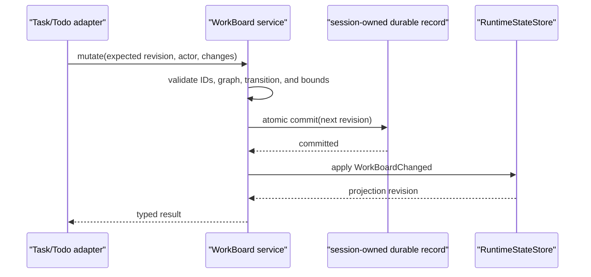
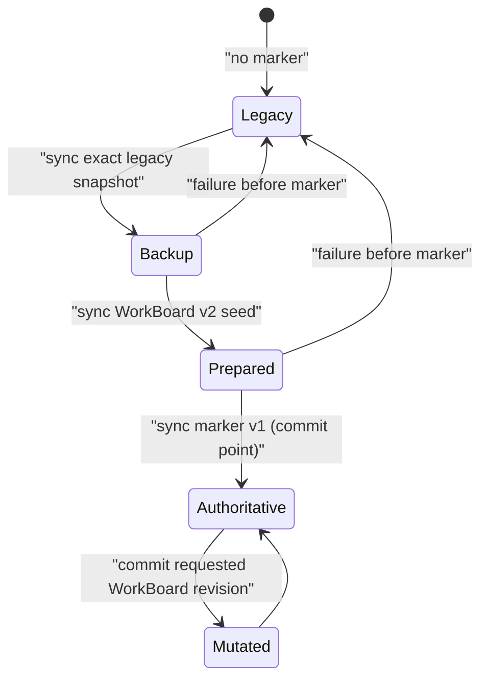

# P31 Task and Todo Explorer

**Status:** historical
**Execution state:** P31.1a-P31.5 complete; G33 closed
**Last verified:** 2026-08-01

> **Ownership:** completed target contract, historical rollback slices, and
> verification gates for G33. Root [`migration/PLAN.md`](../PLAN.md) alone
> decides whether a future slice is executable; current behavior remains owned by
> [`tasks-and-agents.md`](../../architecture/runtime/tasks-and-agents.md) and
> [`architecture/tui/README.md`](../../architecture/tui/README.md).

## Decision

P31 accepts a `combine` design. P31.1a-P31.5 are complete after separate
promotion audits, root decisions, implementation, and closeout. The program
replaced the prior “several Task-like stores plus several partial views” with:

- one durable **WorkBoard** for logical plan items;
- the existing `AgentRunner` as the only local Agent **Execution** owner;
- one bounded engine-owned **TaskExplorerSnapshot** that relates those domains;
  and
- one responsive Task Explorer presentation consumed by every TUI task surface.

The first implementation target is not an interactive kanban board. It is a
truthful answer to four user questions:

1. What work remains, is active, blocked, complete, failed, or cancelled?
2. Which Agent execution is working on which item, and what is it doing now?
3. What needs attention, and what evidence remains after completion or failure?
4. Which actions are safe on this exact live generation?

An implementer should be able to use this document to select one atomic slice,
identify its owner and compatibility boundary, and write deterministic tests
without redoing product research. This document must be refreshed when Task
tool schemas, Agent generation semantics, session durability, TUI layout modes,
or the G33 evidence changes.

## Problem

Current Eino-Agent already has valuable primitives, but their composition makes
the TUI look and behave simpler than the runtime:

- `tools.TaskManager` owns rich Task records and dependencies, but those
  records are process-local and their TUI detail is incomplete.
- `TodoWrite` owns another process-local checklist. It is absent from
  `TaskAgentSnapshot`, session resume, and reducer replay.
- `AgentRunner` owns stable child identity, progress, transcript, and controls,
  but a plan item's `owner` string is not a safe execution relation.
- Ctrl+T is a bounded read-only summary. Ctrl+B adds a different detail/control
  path. `/team`, the wide sidebar, and tool history expose other subsets.
- TUI controls infer capability from local status strings, which already makes
  `in_progress` local-task stopping differ between the tool and Ctrl+B paths.

Adding more fields to Ctrl+T would preserve the split ownership. P31 instead
makes the runtime contract coherent first and treats rendering as a projection.

## User Outcome and Acceptance

P31 is complete only when all of the following are true:

- a resumed session reconstructs the same logical work board without dispatch;
- every plan row and Agent execution row has stable identity and textual state;
- a WorkItem may relate to several execution generations, but no title/owner
  heuristic creates that relation;
- completion, failure, cancellation, blocked state, and waiting-for-input are
  distinguishable without color;
- Ctrl+T, Ctrl+B, `/tasks`, `/team`, and the wide sidebar consume the same
  selector or an explicit filtered view of it;
- output, error, lineage, activity, and transcript remain inspectable through
  bounded detail readers;
- the engine, not the TUI, declares whether send, switch, pause, resume, cancel,
  retry, or inspect is available;
- stale revision or generation actions fail without touching newer work;
- compact views omit detail but report hidden counts and attention; and
- reducer replay, session restore, and view switching execute no historical
  model, tool, Agent, permission, or Git work.

## Scope

### In scope

- QueryEngine-lineage logical plan state now reached through TaskCreate/Get/
  List/Update and TodoWrite;
- Agent executions already owned by `tools.AgentRunner`;
- durable plan state, replay-only restore, fork/delete ownership, and bounded
  inspection;
- one engine selector and typed detail/control APIs;
- Ctrl+T, Ctrl+B, `/tasks`, `/team`, task/Todo tool history, the activity band,
  and the wide sidebar;
- TUI keyboard/focus, responsive layout, accessibility, selection, and PTY
  behavior affected by the explorer; and
- TUI, plain/headless, and ACP sessions that have a QueryEngine owner, with an
  explicit standalone-MCP degradation.

### Non-goals

- automatic takeover of a running child process after process restart;
- replacing `AgentRunner`, QueryEngine, ProjectGraph, transcript storage, or
  Bubble Tea;
- merging `engine/tasks` or background Bash into the new owner without a
  separate reachability and lifecycle decision;
- automatically completing a WorkItem when an Agent succeeds;
- inferring a relation from title, description, owner label, list position,
  tool-use text, or transcript similarity;
- detaching or reassigning an admitted WorkExecutionLink; a mistaken
  association remains historical evidence and a corrected attempt receives a
  new ExecutionKey;
- arbitrary user editing of WorkItems in the first TUI release;
- a full Codex app-server, Claude multi-process team store, Grok resource
  framework, or hosted dashboard; and
- an ACP protocol extension before P23 owns its capability and wire contract.

## Project Vocabulary and Owners

| Entity | Meaning | Canonical owner |
|---|---|---|
| `WorkBoard` | One logical plan scope for a root Session lineage | New QueryEngine-bound work-board service and its versioned durable record |
| `WorkItem` | One intended outcome, independent of how many attempts execute it | WorkBoard |
| `ExecutionKey` | One immutable Agent attempt, identified by Agent ID and generation | `tools.AgentRunner` and existing runtime/transcript facts |
| `WorkExecutionLink` | Explicit immutable optional relation from an ExecutionKey to one WorkItem | Durable WorkBoard edge written by engine launch admission; never TUI inference or reassignment |
| `TaskExplorerSnapshot` | Bounded, deterministic join of WorkItems, Executions, attention, and allowed actions | QueryEngine selector over WorkBoard and `RuntimeStateStore` |
| explorer presentation | Filters, cursor, selected tab, search, scroll, and transient confirmation | Bubble Tea `App`/Task Explorer component |

`Task` remains a compatibility tool name. Documentation and new runtime types
use `WorkItem` for logical work and `Execution` for an Agent attempt so two
different lifecycles are not hidden behind the same noun.

## WorkBoard Contract

### Identity and scope

A WorkItem identity is the composite `(BoardID, WorkItemID)`:

- `BoardID` is stored with the root Session and shared only by child engines in
  that exact QueryEngine lineage.
- `WorkItemID` is opaque, stable, never reused within a board, and independent
  of display order or content.
- a session resume reopens the same board;
- a fork creates a new BoardID from the selected durable snapshot, preserving
  WorkItem IDs inside the new namespace and clearing live execution links; and
- session deletion removes only the exact board sidecar owned by that session
  service after active-session admission.

Independent top-level engines and standalone MCP server instances never share
a package-global board.

### WorkItem fields

| Field group | Required contract |
|---|---|
| Identity | Board ID, WorkItem ID, item revision, source partition |
| Content | Stable title, optional description, optional active-form activity |
| Lifecycle | `pending`, `in_progress`, `completed`, `failed`, or `cancelled`; blocked is derived |
| Coordination | owner identity/label, ordered `blocks` and `blocked_by`, optional priority |
| Evidence | bounded result summary, terminal reason, output reference where available |
| Audit | created, updated, started, and terminal timestamps plus mutation actor |

`blocked` is true when any referenced blocker is unresolved or missing. It is
not a mutable sixth state. Cycles, self-links, missing-board links, duplicate
IDs, invalid transitions, and over-budget mutations fail before durable state
changes.

Terminal states are not silently rewritten. Reopening is an explicit mutation
with a reason and a new item revision; it does not reuse or erase an old
ExecutionKey.

### TodoWrite compatibility

Legacy TodoWrite becomes one adapter into a source partition of the WorkBoard:

- the partition key is the trusted `(SessionID, AgentID)` scope, so one child
  cannot replace another child's checklist;
- existing input without IDs remains a full replacement;
- a future optional ID preserves exact identity; otherwise a unique exact
  `(content, activeForm)` match may retain identity and ambiguous matches
  allocate a new ID;
- omitted nonterminal entries become `cancelled` with replacement provenance;
- all-complete hides the active compact list but retains durable terminal
  evidence;
- explicit merge is accepted only for stable IDs; and
- native Task records outside the Todo compatibility partition are never
  deleted by a Todo replacement.

TaskCreate/Get/List/Update remain the richer native WorkItem adapters. Their
existing result text and accepted legacy status aliases are preserved until a
separate deprecation slice has measured callers.

## Execution Contract

An ExecutionKey is `(AgentID, Generation)`. The key is immutable and may be
linked to zero or one WorkItem; one WorkItem may have many attempts.

The explorer normalizes presentation without discarding raw runtime meaning:

| Presentation phase | Existing facts that may map to it | Terminal? |
|---|---|---|
| `initializing` | admitted identity before executor/model entry | no |
| `running` | foreground, background, or foreground-detached active generation | no |
| `waiting_input` | unresolved owner interaction | no |
| `paused` | safe-boundary steering pause | no |
| `completed` | successful terminal generation | yes |
| `failed` | executor, provider, tool, or recovery terminal failure | yes |
| `cancelled` | aborted or killed generation with reason | yes |

Terminal data includes completion time, result or partial result reference,
error/terminal reason, transcript identity, and exact parent lineage where
available. A resume creates a newer generation; it does not mutate the older
terminal attempt.

Execution completion never changes WorkItem lifecycle automatically:

- success may create a derived attention fact “attempt complete; item still
  open”;
- failure or cancellation leaves the WorkItem open unless an explicit
  WorkBoard mutation changes it; and
- completing a WorkItem while one of its linked executions is still live is
  rejected. The caller may cancel that exact generation through the existing
  execution control and wait for terminal settlement, but it cannot detach or
  reassign the historical relation.

### Link admission and immutability

An Agent launch may carry an optional
`(BoardID, WorkItemID, expected item revision)` reference. QueryEngine owns the
only operation that can create a WorkExecutionLink:

1. validate that the board belongs to the current root Session lineage and the
   referenced WorkItem is open at the expected revision;
2. reserve a new `(AgentID, Generation)` without starting model or tool work;
3. durably append the immutable link with actor `agent_launch_admission`, the
   initiating caller identity, and the exact item and execution identities;
4. publish the linked execution admission; and
5. only then dispatch the Agent.

If durable link admission fails, the reservation is released and no execution
is dispatched. A crash after the link commit but before dispatch restores an
`initializing` attempt as terminal `failed` with a pre-dispatch reason; replay
never starts it. An unlinked launch keeps the existing admission path.

There is deliberately no `detach`, `reassign`, or mutable `owner` operation for
this edge. `AllowedActions` therefore contains only execution controls for the
exact generation and WorkItem lifecycle actions for the exact item revision.
Correcting a bad association means launching a new explicitly linked
generation while retaining the old edge as audit evidence.

## Durable Mutation and Replay

The WorkBoard service uses a versioned, mode-0600, atomic session-owned record.
It serializes mutations for one board and requires an expected revision.



If validation or durable commit fails, no runtime mutation or success result is
published. If non-lossless consumer delivery later stops, the synchronous
reducer and durable board still agree. Startup/resume restores a snapshot into
the reducer without emitting a historical tool result or dispatching work.

Compaction must preserve the current board record and its identity. Runtime
event replay reconstructs the same bounded read projection from the same
ordered events. A corrupt, unsupported, or ownership-mismatched board produces
a visible read-only diagnostic and rejects mutations; it does not silently
start an empty plan or make the conversation unresumable.

## TaskExplorerSnapshot

The selector returns one defensive snapshot:

```text
TaskExplorerSnapshot
  revision and board identity
  summary counts and current activity
  ordered WorkItem rows
  ordered Execution rows
  explicit WorkExecution links
  owner-scoped attention
  per-row AllowedActions
  truncation and durability diagnostics
```

Ordering is deterministic:

1. unresolved attention;
2. live executions and their linked in-progress items;
3. blocked items;
4. other in-progress items;
5. pending items;
6. recently terminal items; and
7. older terminal items available through a bounded page.

The snapshot reports hidden counts by state. It never silently drops failures,
unresolved attention, or the active row. Long output and transcript content
remain behind existing bounded detail/page readers.

`AllowedActions` is produced by the engine for the exact revision and
generation. The initial vocabulary is:

| Action | Availability rule |
|---|---|
| `inspect` | row and bounded evidence still resolve |
| `switch` | exact child thread is live, replay-only, or transcript-backed |
| `send` | exact generation is live and accepts queued input |
| `pause` / `resume` | exact live generation and steering state support it |
| `cancel` | exact generation is cancellable and not terminal |
| `continue` | retained/evicted Agent passes existing continuation admission |

The TUI submits the row identity, snapshot revision, execution generation, and
action. The engine re-resolves all four before side effects. A stale request
returns a typed conflict and refreshes the view; it never falls through to a
name- or status-based action.

## TUI Experience

### One explorer, several bounded projections

- **Activity/status band:** when work exists, show `done/total`, current
  `activeForm` or title, live execution count, and attention count.
- **Wide sidebar:** show the same compact summary and bounded active rows.
- **Ctrl+T:** open the Task Explorer on the last selected logical section.
- **Ctrl+B:** compatibility binding to the same explorer filtered to
  Executions; it is not a second data/control component.
- **`/team`:** retain the team-oriented filter and read-only peek, but source
  its rows and selection identity from the same explorer snapshot.
- **Tool history:** summarize the mutation delta or execution relation; expanded
  and raw history retain complete sanitized input/result.

No surface caches runtime status as its only truth. Presentation may retain a
cursor, filter, scroll offset, open detail tab, or pending confirmation.

### Responsive layouts

| Mode | Explorer layout | Required information |
|---|---|---|
| compact, below 80 columns or 24 rows | One pane; list and detail are separate navigation levels | State text, title/activity, attention, hidden counts, close/back/action help |
| standard, 80–149 columns | Full-screen list with a bounded inline detail preview; Enter opens detail | Work/Execution relation, owner, blockers, elapsed/last activity, terminal reason |
| wide, at least 150x24 | List and detail split; main conversation remains behind the overlay | Same information plus tabs for overview, activity, transcript, output, lineage |

Representative compact frame:

```text
WORK  2/5 done | 1 active | 1 attention

> [run]  Inspecting session restore
  [wait] Add replay fixture (blocked by #2)
  [done] Map current Task owners
  ... 2 more: 1 pending, 1 failed

Enter details  / search  f filter  Esc close
```

Representative wide detail:

```text
WORK ITEMS                         DETAILS
> [active] Add replay fixture      Add replay fixture
  [blocked] Wire Todo adapter      status: in_progress
  [done]    Audit references       owner: agent researcher
                                    run: agent-7 generation 2
EXECUTIONS                          activity: Running reducer tests
  [run]  researcher / gen 2        last tool: Bash
  [fail] explorer / gen 1          controls: pause cancel switch
                                    tabs: overview activity transcript output
```

These are information contracts, not fixed glyph or color specifications.
No-color uses the same words. Reduced-motion may freeze decoration but cannot
stop polling, attention, elapsed-time updates, or action results.

### Navigation and controls

All bindings go through the existing keybinding resolver:

- Up/Down or configured list movement selects a row;
- Enter opens detail or switches when the selected action is `switch`;
- Tab/Shift-Tab moves among list, detail, and detail tabs;
- `/` searches title, description, owner, Agent name, and terminal reason;
- `f` cycles explicit filters without removing unresolved attention;
- `s`, `p`, `r`, and `x` invoke send, pause/resume, continue, and cancel only
  when the engine returned the matching action;
- a cancel confirmation shows exact identity and partial-result consequence;
  and
- Esc returns from detail before closing the explorer.

The first release keeps WorkItem mutation tool/model-owned. A later human edit
workflow requires its own actor, confirmation, revision-conflict, and
model-context contract; it is not smuggled into list key handling.

## Failure and Recovery Semantics

| Failure | Required behavior |
|---|---|
| stale board revision | Reject mutation/action, refresh, preserve selection by stable ID |
| stale Agent generation | Reject control; show the newer generation or terminal evidence |
| board persistence failure | No successful tool result or runtime mutation |
| corrupt/unsupported board | Read-only diagnostic; session remains loadable; no empty replacement |
| missing WorkItem for a link | Show execution as unlinked plus diagnostic; never synthesize an item |
| missing live Agent with transcript | Replay-only inspect/switch; no mutation actions |
| output/transcript page failure | Keep row identity and summary; show retryable detail error |
| WorkItem completion with live linked execution | Reject until every linked live generation settles; optional cancellation targets the exact generation and does not detach the link |
| execution success with open WorkItem | Preserve both facts and raise derived attention; no auto-completion |
| TUI cancellation result arrives after switch | Apply only to matching request, revision, identity, and generation |

Normal exit, error, timeout, cancel, and confirmation dismissal retain the
existing terminal-restoration and dialog-stack guarantees.

## Entrypoint Contract

| Entrypoint | P31 behavior |
|---|---|
| TUI | Full compact/explorer/detail/control projection |
| plain and headless QueryEngine | Stable textual `/tasks` snapshot and existing model tools; no terminal control affordance |
| ACP QueryEngine session | Same engine WorkBoard and Agent facts; expose only through existing protocol-safe status/tool paths until P23 accepts a typed wire projection |
| standalone MCP | Server-instance isolated ephemeral board with explicit non-durable behavior, or fail closed when a required Session owner is absent; never use the package singleton |

No entrypoint may imply durability or control it does not own. P31 does not add
ACP fields, wake idle models, or make standalone MCP a Session service.

## P31.1a Promotion Audit Freeze

**Status:** promotion prerequisites frozen on 2026-07-30

This audit closed the evidence used by the later root-PLAN promotion. It did
not install a WorkBoard, write a sidecar, restore plan state, change tool
output, or itself move P31.1a into the execution queue.

### Compatibility baseline

[`tools/p31_promotion_compatibility_test.go`](../../../tools/p31_promotion_compatibility_test.go)
is the promotion fixture for the logical-work scenarios reachable by the
future shadow observer. It freezes:

- exact TaskCreate, TaskGet, TaskList, and TaskUpdate results for create,
  read, ordered list, mutation, unchanged, missing-record, and required-field
  scenarios;
- combined Task action dispatch, `task_id`/`taskId`/`shell_id`
  compatibility, `cancel`/`monitor` action aliases, `running` normalization,
  and the current pass-through behavior for other status strings;
- local non-blocking TaskOutput and pending/local TaskStop results; background
  AgentRunner output, blocking/polling/timeout behavior, and unrelated
  execution compatibility remain owned by their existing focused fixtures;
- ordered Task IDs, dependency append/dedup behavior, output append behavior,
  metadata merge/delete behavior, and context-injected manager isolation;
- TodoWrite validation, exact success text, full-replacement semantics,
  trusted `(SessionID, AgentID)` partitioning, and all-complete clearing; and
- the absence of a WorkBoard observer or restored WorkBoard state.

The existing broader Task lifecycle, background execution/output,
root/child projection, and trusted-scope tests remain supporting evidence.
P31.1a must run the promotion matrix with its rollout switch disabled and
enabled and keep every frozen scenario byte-for-byte equal. This PR has no
shadow implementation and therefore proves only the disabled baseline. A
deliberate legacy contract change requires a separate compatibility decision
rather than silently updating the fixture inside P31.1a.

The fixture records quirks rather than endorsing them: current Task dependency
updates append and deduplicate without graph validation, and the documented
`deleted` status is not currently a deletion transition. The shadow reports
where those accepted mutations fail the target WorkBoard contract but never
repairs them or changes their legacy result.

### Shadow owner and record budget

P31.1a may add exactly one `WorkBoardShadow` service created by the root
QueryEngine lineage and shared with its child engines. It is passed through
the canonical tool context; it is never package-global and never replaces
`TaskManager`, TodoWrite, `AgentRunner`, `RuntimeStateStore`, or the Session
service.

The shadow record is:

- owned by the exact transcript Session and stored at
  `<transcript-dir>/<session-id>.workboard-shadow-v1.json`;
- version `1`, identity-bound to the exact Session ID and detached opaque
  Board ID, and created under a `0700` directory with a `0600` file;
- limited to 1,024 WorkItems, 4,096 total dependency references, 64 KiB per
  textual or canonical-metadata field, and 4 MiB of encoded JSON; and
- written by one encode plus one same-directory temp-file transaction with no
  retry: create, chmod, write, sync, close, and rename.

An accepted legacy mutation that exceeds those limits still succeeds exactly
as before. The shadow records a bounded typed comparison diagnostic and does
not truncate, reject, or reinterpret the authoritative legacy state. P31.1b
cannot reuse these shadow limits as a new user-visible rejection policy
without separately reviewing the observations collected by P31.1a.

Session deletion owns removal of only the exact validated shadow suffix.
Fork, export, compaction, and baseline binaries do not copy, read, advertise,
or depend on the shadow. Disabling P31.1a removes the observer; deleting the
single sidecar returns the session to the exact pre-P31 compatibility state.

### Observer ordering and failure injection

For TaskCreate/TaskUpdate/TaskStop and TodoWrite, the frozen order is:

1. validate input and complete the existing authoritative mutation;
2. freeze the exact legacy result and detached authoritative snapshot;
3. invoke the QueryEngine-owned shadow observer under its per-board ordering
   lock;
4. compare the normalized snapshot with the candidate WorkBoard record; and
5. return the already-frozen legacy result regardless of shadow outcome.

Invalid legacy input never invokes the observer. Reads do not mutate or repair
the shadow. Shadow construction and resume may validate an existing record for
diagnostics, but must not seed TaskManager, TodoWrite, runtime events, TUI
state, model input, or Session replay.

The implementation must inject deterministic failures at `encode`, `mkdir`,
`create_temp`, `chmod`, `write`, `sync`, `close`, `rename`, `read`, `decode`,
and identity/version validation. Every failure preserves the exact legacy
result, in-memory owner state, runtime events, and TUI projection. A failed
replacement leaves either the previous complete shadow record or no shadow
record, removes its owned temporary file when possible, emits no model/tool/
Agent work, and never promotes the shadow to restored state.

## P31.1a Root Promotion Decision

**Snapshot:** `796f1907d39561c2d2011bcbe1fc91f5bdbaa77d`

**Status:** promoted on 2026-07-30; implementation complete on 2026-07-30

**Decision:** `combine`

A separate root-PLAN review selected P31.1a as the only executable slice after
the promotion audit closed all named prerequisites:

1. the observer-reachable Task/Todo compatibility fixture is executable and
   records exact current results without endorsing legacy quirks;
2. one root QueryEngine lineage owns the optional shadow and shares it only
   with its child engines;
3. the exact session-sidecar identity, permissions, record limits, atomic
   transaction, and deletion suffix are frozen;
4. observation occurs only after a successful authoritative mutation and
   frozen legacy result;
5. every codec, filesystem, identity, and version failure stage is injectable
   and non-authoritative; and
6. disabling the observer and deleting only its validated sidecar returns the
   session to the exact pre-P31 owners and compatibility state.

`Ready` authorizes one implementation PR for the domain/codec, internal
rollout switch, sidecar writer, mutation observer, bounded comparison
diagnostics, and required tests. It does not claim that any WorkBoard,
sidecar, restore path, runtime event, TUI projection, or model-visible behavior
already exists.

## Ordered Implementation Slices

P31.1a-P31.5 are complete. No successor is `Ready`.

### P31.1a — Reversible WorkBoard format and shadow verification

**Status:** complete on 2026-07-30

**Behavior:** add the WorkBoard domain types, stable IDs, versioned codec,
graph/transition validation, and a QueryEngine-bound shadow writer. The
existing TaskManager and TodoWrite stores remain authoritative: successful
legacy mutations are projected to the shadow record only for compatibility
comparison, and a shadow failure cannot change legacy tool output or runtime
behavior. The shadow record is never advertised as restored plan state.

**Files/owners:** a bounded `engine/workboard` domain/codec or equivalent;
QueryEngine-scoped shadow observer behind an internal rollout switch; Task and
Todo characterization adapters; comparison and downgrade fixtures.

**Gate:**

- current Task/Todo accepted inputs, result text, transitions, dependency
  behavior, and trusted scope have characterization fixtures;
- Todo replacement/identity/partition and graph-validation property tests pass;
- shadow on/off produces identical current tool, runtime, and TUI behavior;
- codec round trips, unknown-version rejection, ownership mismatch, atomic
  write failure, and corrupt-record cases are deterministic;
- a pre-P31 baseline can reopen an unchanged session after a shadow write
  because the shadow is non-authoritative and independently removable; and
- deleting or disabling the shadow leaves the exact legacy owners and outputs.

**Rollback:** disable the shadow observer and remove only its sidecar. No
authoritative WorkBoard mutation exists in this slice, so no user-visible plan
state is lost and no session compatibility floor is raised.

**Closeout:** `engine/internal/workboard` now owns the version-1 bounded domain,
strict codec, comparison diagnostics, and same-directory atomic shadow writer.
The trusted `QueryEngineConfig.WorkBoardShadow` switch is off by default. One
root lineage shares the observer with its children; Task/Todo mutations invoke
it only after a real accepted legacy mutation, and observer panic or write
failure cannot change the frozen result. Existing records are validated but
never restored. Resume, fork, and new-session activation clear the old observer
before rebinding identity. A non-private existing transcript directory is
diagnosed and receives no shadow file rather than being chmod-mutated.

The full compatibility fixture runs with the observer disabled and enabled.
Domain, stable-ID, partition, graph, budget, codec, corrupt-record, identity,
version, every writer/load failure stage, previous-or-none replacement,
private-directory, session activation, deletion containment, baseline reopen,
and focused race tests pass. Current behavior and rollback evidence are in
[`p31-1a-reversible-workboard-shadow.md`](../history/runtime/p31-1a-reversible-workboard-shadow.md).

### P31.1b Promotion Audit Freeze

**Status:** promotion prerequisites frozen on 2026-07-31

Snapshot `c258806d8486ac069ad6c949ac4c71bc521f44ea` closes the
implementation-contract gaps found after P31.1a. At this freeze snapshot,
P31.1b was not promoted: root PLAN still had to accept the forward-only reader
floor and select P31.1b as the sole `Ready` slice. The later
[`root promotion decision`](#p311b-root-promotion-decision) closes that
prerequisite without claiming implementation.

Current source establishes the starting boundary:

- one root QueryEngine lineage shares a `TaskManager` and the P31.1a shadow,
  while Todo compatibility remains keyed by exact trusted
  `(SessionID, AgentID)` scope;
- the compatibility fixture preserves exact result/error text, `taskId`,
  `shell_id`, combined `monitor`/`cancel`, Todo full replacement, all-complete
  clearing, arbitrary non-`running` Task status, and unresolved dependency
  strings;
- WorkBoard v1 deliberately rejects non-canonical status, missing dependency
  targets, cycles, corrupt data, unknown fields, and unknown versions; and
- `SessionService` already owns engine-scoped resume/fork orchestration, while
  the session package owns transcript branch, delete, compaction, and export
  storage mechanics.

The P31.1b implementation must not resolve those differences by silently
normalizing the legacy view or by keeping two writable stores.

#### Compatibility Adapter

One root-lineage `LogicalWorkAdapter` is constructed with the QueryEngine. It
takes one locked copy of the injected TaskManager and leader Todo scope before
binding tools, serializes every later QueryEngine-bound Task/Todo read and
mutation, and snapshots each child's exact Todo scope before child dispatch.
Production tool contexts never call the package-global stores after that
binding. The adapter has only two modes: a read-only `legacy` snapshot before
the authority marker commit and `workboard` after it. The first accepted
mutation must complete cutover before it changes either view. Children share
the same pointer; independent roots do not. Direct non-QueryEngine tool
embeddings and standalone MCP retain only an explicitly non-Session,
process-local compatibility scope until P31.5 and never create authoritative
artifacts. Without an adapter, any context that names a durable Session ID
fails before Task/Todo read or mutation. Standalone MCP always binds an opaque
process scope that cannot equal a transcript Session ID, so a marked Session
can never acquire a second fallback writer.

| Legacy shape | Canonical WorkBoard representation | Required legacy projection |
|---|---|---|
| Task `pending`, `in_progress`, `completed`, or `failed` | Same canonical status | Exact status and existing result text |
| Task input alias `running` | Canonical `in_progress` | Existing behavior already reads back `in_progress` |
| Task `killed` | `cancelled` plus typed compatibility status `killed` and terminal reason `legacy_task_stopped` | `TaskGet`, `TaskList`, `TaskOutput`, lifecycle events, and stop no-op retain current `killed` behavior |
| Any other accepted Task status, including `deleted` | `cancelled` plus the exact typed compatibility status and terminal reason `legacy_status` | Return the exact legacy string; TaskStop eligibility is decided from that string, not canonical `cancelled` |
| Dependency whose target exists at the accepted mutation | Canonical `blocks`/`blocked_by` edge after cycle validation | Preserve append/deduplicate field reporting |
| Missing dependency target | Typed unresolved compatibility edge, not a canonical graph edge | Return the exact unresolved ID. Creating the target alone does not rewrite it; only a later explicit dependency mutation may promote it to a canonical edge |
| Task metadata, output, owner, timestamps, and numeric legacy ID | Typed compatibility fields plus canonical content | Preserve metadata merge/delete, output append, ordering, ID, and exact result/error text |
| Todo full replacement for one trusted scope | Stable Todo WorkItems in that exact partition; omitted non-terminal items become retained `cancelled` evidence | Reads expose only the current replacement list, not retained omitted evidence |
| Todo all-complete replacement | Completed evidence remains in WorkBoard | The legacy scoped Todo read is empty and TodoWrite returns its existing success text |
| Duplicate Todo content/activity | P31.1a's ambiguity rule allocates new stable IDs | Preserve input order and duplicate rows exactly |

The compatibility payload is a typed part of the authoritative record, not
user Task metadata. Authoritative schema version 2 adds that payload; it does
not reinterpret or overwrite the validation-only P31.1a shadow record.
Successful mutations durably commit the WorkBoard revision before emitting the
existing `TaskLifecycleEvent` or returning the frozen tool result. A durability
failure returns a `workboard authority:` error and leaves the prior complete
record and legacy view unchanged.

#### Authoritative Artifacts

All owned files are regular mode-0600 files in the exact private transcript
directory. They use same-directory temp/write/sync/close/rename plus parent
directory sync and reject links, non-regular targets, replacement races, and a
non-`0700` existing parent.

| Exact suffix | Version | Owner and meaning |
|---|---:|---|
| `<session-id>.workboard-v2.json` | WorkBoard 2 | The only authoritative logical-work record after marker commit; before that commit it is only a prepared seed |
| `<session-id>.workboard-authority-v1.json` | marker 1 | The commit point. It binds the exact Session ID and minimum reader `workboard/v2`; absence means legacy authority |
| `<session-id>.workboard-legacy-backup-v1.json` | backup 1 | Immutable exact pre-cutover Task records and every Todo scope registered by the root-lineage adapter |
| `<session-id>.workboard-shadow-v1.json` | shadow 1 | P31.1a comparison evidence only; never promoted, loaded, or treated as a backup |

The marker intentionally does not pin a mutable board revision or BoardID.
Presence of a supported, session-matching marker commits authority; the
version-2 record owns its own Session ID, BoardID, revision, and validation.
That separation lets every later WorkBoard mutation and an explicitly accepted
backup recovery replace one record atomically without rewriting the reader
floor.

Version 2 retains P31.1a's reviewed ceilings: 1,024 WorkItems, 4,096 dependency
references, 64 KiB per textual or typed-compatibility field, 4 MiB encoded
record, and 128 retained diagnostics. The immutable backup has the same item,
field, and encoded-byte ceilings. An over-budget legacy snapshot is never
truncated or partially seeded: no marker is written, the requested mutation
fails with the exact breached limit, and the read-only legacy snapshot remains
available. Root promotion must accept that fail-closed compatibility
consequence; this repository has deterministic fixture evidence, not retained
production shadow measurements.

#### Cutover State Machine

The adapter holds one lineage mutation lock. It completes authority admission
before executing the first accepted Task/Todo mutation:



| Durable observation after restart | Sole authority | Required action |
|---|---|---|
| No marker; no prepared files | Legacy adapter | Retry cutover before the next accepted mutation |
| Backup and/or board exists, no marker | Legacy adapter | Validate or replace the prepared artifacts from one fresh locked snapshot; never restore them |
| Supported marker and valid v2 board exist | WorkBoard | Load without dispatch and remove every production legacy write path |
| Marker exists but marker/board is corrupt, unknown, missing, unsafe, or Session-mismatched | None | Fail closed before model/tool dispatch, transcript rewrite, or legacy mutation |
| Marker commit succeeded but the process stopped before the requested mutation | WorkBoard seed | Resume from WorkBoard; the not-yet-run mutation may be retried normally |
| WorkBoard mutation write failed | Prior WorkBoard revision | Return an error; do not update adapters or lifecycle events |

Every stage has a deterministic injection seam: backup encode/create/chmod/
write/sync/close/rename/dir-sync; board seed at the same stages; marker at the
same stages; marker re-read; in-memory authority install; and the first
authoritative mutation. There is no timing-window test and no legacy fallback
after a marker is visible.

#### Session Lifecycle

`SessionService` owns the high-level operation and calls one
`workboard.Store`; the session package remains the filesystem containment
owner. Fork, delete, compaction, activation, and destructive recovery hold one
root-lineage lifecycle gate that excludes logical-work mutation from snapshot
through commit or abort.

| Lifecycle | Frozen WorkBoard behavior |
|---|---|
| New root | Construct one legacy-mode adapter; write nothing until the first accepted logical-work mutation |
| Child engine | Share the root adapter/store and register the exact child Todo scope; never create a child authority file |
| Resume/load | Preflight marker before engine activation. No marker keeps legacy mode. A supported marker requires a valid v2 board and loads it without model, tool, Agent, permission, Git, or TUI dispatch |
| Fork from legacy source | Publish no WorkBoard artifacts. Activation creates a new legacy-mode owner from the source adapter's in-process Task snapshot; the new exact Todo scope starts empty as it does today |
| Fork from authoritative source | Before publishing the child transcript, clone the complete board into a new Session ID and BoardID, derive and sync an immutable child-specific backup from that fork-time board, then publish a child marker. Task compatibility sees the cloned tasks. Original Todo partitions remain archived evidence, so the new root scope starts empty as it does today. Child recovery returns to this fork-time baseline, never the source's original pre-cutover snapshot |
| Delete | Preflight/revalidate marker, board, backup, and shadow without following links. Remove transcript first, every exact WorkBoard file next, and private media last. If later cleanup fails, return a partial result plus typed cleanup-pending error. A retry with the exact Session ID accepts a missing transcript only when validated Session-bound WorkBoard or media artifacts remain, removes only those artifacts, and reports cleanup completion |
| Compaction | Do not rewrite WorkBoard artifacts. Snapshot and revalidate the authoritative BoardID/revision across transcript compaction; the same board must load afterward without dispatch |
| Export | Keep export presentation-only; do not include the board, marker, backup, private IDs, or recovery data |
| Restore staging/administration | May validate and inspect artifacts but cannot cut over, mutate logical work, or advertise a live board before staged activation commits |

#### Reader Floor And Recovery

The marker commit establishes a forward-only `workboard/v2` reader floor.
P31.1b and later binaries reject an unknown marker or unsupported minimum
reader before any Session mutation. Binaries older than P31.1b cannot be made
safe by the new marker and are explicitly unsupported for a marked Session.
The separate root promotion decision must accept that release consequence; a
normal rollback may disable later projections or controls but must retain the
v2 reader, marker handling, adapters, and WorkBoard authority.

Destructive backup recovery is an explicit Session administration operation,
available only through the local CLI/session service. It requires the exact
current Session ID, BoardID, revision, and an acknowledgement that every
post-cutover mutation will be discarded. It atomically replaces the v2 record
with a fresh BoardID derived from the immutable legacy backup; the existing
marker remains the reader-floor commit. Failure before rename retains the old
board, failure after rename retains the recovered board, and recovery never
re-enables a legacy writer. TUI, ACP, model tools, hooks, and standalone MCP
cannot invoke it.

#### Promotion Proof Inventory

Promotion requires one implementation PR to prove:

- the P31.1a on/off compatibility fixture remains exact, plus adapter-enabled
  traces for canonical status, arbitrary legacy status, unresolved dependency,
  Task aliases, lifecycle events, Todo replacement, all-complete clearing, and
  duplicate identity;
- root/child sharing, independent-root isolation, isolated direct-tool and
  standalone-MCP fallback, and rejection of any adapter-free durable Session
  scope;
- every cutover stage in the failure table, retry idempotence, marker commit
  recovery, no empty board, and no two writable owners;
- corrupt/unknown/mismatched marker, board, backup, link, mode, size, revision,
  dependency-cycle, and replacement-race rejection;
- resume, legacy/authoritative fork with child-specific backup recovery,
  partial-delete cleanup retry, compaction, export, administration, and
  restore-staging behavior without dispatch;
- old-reader rejection in P31.1b-capable binaries and the destructive recovery
  acknowledgement/result boundary; and
- `make fmt`, `make lint`, `make lint-new`, `make test`, `make build`,
  documentation/manifest gates, focused `-race`, and source gates proving no
  QueryEngine-bound tool read or write reaches package-global Task/Todo stores
  after adapter binding.

### P31.1b Root Promotion Decision

**Status:** completed on 2026-07-31; promotion decision retained as evidence

At snapshot `cf75cd1fd6573ba48a8b788823a13d0e45f9b6b0`, an independent
re-audit found no unresolved compatibility, Session-lifecycle, cutover,
recovery, or one-Ready conflict in the frozen contract. Root selects
`combine`: preserve exact accepted Task/Todo results and non-Session fallback;
adapt non-canonical legacy shapes through typed compatibility; combine one
root-lineage adapter with the Session lifecycle owner and marker-last durable
cutover; reject shadow promotion, dual writes, truncation, implicit restore,
and downgrade; defer replay, presentation, execution links, controls, and
old-owner deletion.

Root explicitly accepts all release consequences:

- marker commit establishes the forward-only `workboard/v2` reader floor, so
  pre-P31.1b binaries are unsupported for a marked Session;
- an over-budget legacy seed fails before the requested mutation and creates
  no marker rather than truncating authoritative input;
- normal rollback retains the v2 reader, marker, compatibility adapters, and
  WorkBoard authority; and
- destructive backup recovery is exact Session ID, BoardID, and revision
  bound, requires acknowledgement, creates a new BoardID, retains the marker,
  and loses every mutation after the original cutover.

Exactly one implementation PR may now own the adapter, authoritative
artifacts, marker-last cutover, QueryEngine and Session lifecycle binding,
local destructive recovery, compatibility preservation, and the entire proof
inventory above. It must not add P31.2 events/replay, P31.3 presentation,
P31.4 execution links or controls, P31.5 owner deletion, or unrelated work.
Passing this decision records authority to execute, not evidence that any
P31.1b production behavior already exists.

### P31.1b — Authoritative WorkBoard and Compatibility-Adapter Cutover

**Behavior:** implement the frozen adapter, artifacts, cutover state machine,
Session lifecycle, reader floor, and recovery boundary above. After the marker
commit, the QueryEngine-bound WorkBoard is the single logical-work owner and
legacy Task/Todo views are derived adapters, never a second writable copy.
Successful legacy tool results remain byte-for-byte compatible.

**Files/owners:** P31.1a domain/codec; new WorkBoard store and typed
compatibility payload; QueryEngine construction and tool context;
`SessionService`; session resume/fork/delete/compaction containment; local
session-administration recovery; compatibility, failure, lifecycle, and race
tests.

**Gate:** every item in the promotion proof inventory passes in one reviewable
implementation PR, and all P31.1a gates remain green.

**Rollback:** there is no supported in-place downgrade below the P31.1b reader
after marker commit. Roll back only to a release that retains the v2 reader,
marker, adapters, and WorkBoard authority, or explicitly recover the immutable
pre-cutover backup into a new BoardID after accepting loss of every later
mutation.

**Completion evidence:** one implementation PR delivered the frozen authority,
compatibility, Session lifecycle, local recovery, strict resource, failure,
race, and source-owner boundaries without adding replay or presentation.
Delivery and rollback evidence is
[`p31-1b-authoritative-workboard.md`](../history/runtime/p31-1b-authoritative-workboard.md);
reproducible gates are
[`p31-1b-authoritative-workboard.md`](../verification/p31-1b-authoritative-workboard.md).

### P31.2 Promotion Audit Freeze

This section is planning evidence, not production behavior or an executable
slice. At snapshot `fe9625349d9bd215cefb02ad53c676d641b728fe`,
P31.1b is complete and the audit asks one question: how can one deterministic
explorer read model survive cold restore without creating a second durable
event authority or changing any current TUI control?

#### Authority and recovery split

P31.2 uses `combine`:

- the committed WorkBoard v2 record remains the only durable logical-work
  snapshot and revision authority;
- `RuntimeStateStore` remains an in-process reducer for ordered Agent and
  thread observations;
- one engine-owned `TaskExplorerSnapshot` defensively joins those two sources;
  and
- the existing `TaskAgentSnapshot` becomes a compatibility adapter over the
  new selector while Ctrl+T, Ctrl+B, `/team`, and the sidebar remain
  observably unchanged.

P31.2 must not add a durable event-log sidecar. Cold construction, resume,
fork activation, and restore staging create one synthetic in-memory bootstrap
input only from an already validated `AuthorityModeWorkBoard` snapshot.
Bootstrap cannot write the board, emit a tool result, enqueue input, call the
model, or start, resume, or message an Agent. Unmarked legacy Sessions and
standalone MCP remain on the existing compatibility selector and create no
P31.2 bootstrap, durability label, or replay claim. Their first accepted
durable Session mutation may enter the new projection only after P31.1b
commits the marker and authoritative snapshot. Agent observations restored
from existing durable runner/transcript facts are read-only unless the current
process already owns that exact live generation.

The live adapter uses one linearization protocol under its existing mutation
admission lock:

1. build and validate the bounded projection candidate;
2. ask the reducer to reserve the exact current BoardID/revision transition;
3. commit the durable next WorkBoard revision;
4. swap the already prepared projection through the reservation; and
5. only then return the successful compatibility result.

Reservation failure occurs before the durable commit and changes neither
owner. After the commit, the prepared swap has no validation, capacity, I/O,
or ordinary error branch and is not a second writer. If an injected failure or
panic nevertheless prevents that swap, the adapter records a typed
`committed_projection_uncertain` quarantine with `retry_safe=false`, returns
no normal success, and rejects every later mutation in that process. The board
revision remains authoritative; callers and the query loop must not retry the
operation. A fresh-process bootstrap repairs the read model before dispatch.
Consumer notification may be lossy only after the reducer swap; the next
selector read still sees the committed board.

Bootstrap accepts an empty reducer or an identical `(BoardID, revision)`
snapshot idempotently. A live event requires the same BoardID and the next
revision. A newer full bootstrap may reconcile a fresh or stale reducer; board
identity mismatch, revision regression, or same-revision content mismatch
produces a bounded diagnostic and no replacement. Wall-clock time never
determines causality or replay order.

#### Identity, links, and attempt retention

The explorer identifies one execution as `(AgentID, Generation)` inside the
root Session lineage and retains its Session, thread, parent, tool-use, and
transcript identities as evidence. A WorkExecutionLink is valid only when an
explicit typed input names `(BoardID, WorkItemID, AgentID, Generation)`.
Session/thread lineage and `ParentToolUseID` may validate or explain an
explicit link, but owner labels, task text, metadata, timestamps, and
transcript similarity can never create one.

P31.2 defines the link read-model and its missing/stale diagnostics, but no
production producer admits a link in this slice. Production snapshots
therefore contain unlinked execution rows until P31.4 durably admits explicit
links. Replay fixtures may supply typed link inputs to prove that several
immutable generations can relate to one item and that a newer generation
cannot rewrite an older relation. P31.2 adds no WorkBoard field, marker
version, dispatch reference, detach, or reassignment operation.

The primary snapshot retains at most 128 execution generations. Terminal rows
are hidden before live rows, oldest accepted observation ordinal first, with
`(AgentID, Generation)` as the tie-break. A 129th simultaneous live input does
not reject, cancel, or delay the already admitted Agent: it increments
`hidden_live_executions`, emits one bounded `live_execution_overflow`
attention category, and deterministically keeps the highest-ranked 128 rows.
A cold restore cannot invent generations absent from the existing durable
Agent facts and reports the retained and hidden scope honestly.

#### Snapshot budget and deterministic order

The primary snapshot ceilings are:

| Data | Ceiling | Reason |
|---|---:|---|
| WorkItem rows | 128 | Matches the current bounded runtime task projection; the WorkBoard authority may still contain up to 1,024 items |
| Execution rows | 128 | Matches the current runtime Agent ceiling |
| Link rows | 128 | One per retained execution generation in P31.2 |
| Attention rows | 128 | Matches the existing WorkBoard diagnostic ceiling |
| Archive/detail page | 100 | Matches the retained G11 100-row performance method |
| Inline title/activity/owner/reason/summary | 512 runes each | Matches the current runtime event-summary ceiling; full fields stay behind bounded detail readers |

Hidden counts are grouped by WorkItem state, execution phase, and attention
category. They separately report WorkBoard rows outside the primary page,
runtime events already dropped by the existing per-thread ring, and execution
generations evicted by the explorer. None may be presented as durable history
loss, and truncation never silently claims completeness.

WorkItem ordering is:

1. rows with unresolved attention;
2. linked live in-progress rows when explicit links later exist;
3. blocked rows;
4. other `in_progress` rows;
5. `pending` rows;
6. terminal rows by item revision descending; and
7. the bounded terminal archive.

Nonterminal ties use `Order` ascending then WorkItem ID ascending. Terminal
ties use item revision descending, `Order` ascending, then WorkItem ID
ascending. Execution rows use the complete key `(attention rank ascending,
phase rank ascending, ordinal-present descending, observation ordinal
descending, AgentID ascending, Generation ascending)`. Attention rows precede
live phases, which precede replay-only rows and other terminal rows. A restored
row without an observation ordinal therefore follows an otherwise equal row
with an ordinal and remains stable by identity.

P31.2 attention is fact-only:

- `workboard_diagnostic`;
- `blocked_dependency`;
- `legacy_unresolved_dependency`;
- `execution_failed`;
- `execution_cancelled`;
- `live_execution_overflow`;
- `runtime_truncated`;
- `missing_link_target`; and
- `stale_execution_link`.

The new snapshot may declare only `inspect` when a bounded row/detail identity
still resolves. An unavailable reason is data, not an action. `switch`, `send`,
`pause`, `resume`, `cancel`, `continue`, dispatch, recovery, and WorkItem
mutation remain outside the new action provider until P31.4. Existing Ctrl+B
controls continue through the unchanged compatibility path and do not become
evidence that the explorer declared them safe.

#### Frozen proof inventory

Before root promotion, this freeze required an independent review. That review
is now accepted by the root decision below. One P31.2 implementation PR must
prove:

- identical validated board bootstrap plus identical ordered execution/link
  inputs produce deeply equal snapshots, revisions, diagnostics, and hidden
  counts;
- cold new/resume/fork/restore-staging paths dispatch no model, tool, Agent,
  queued input, permission, Git, or recovery work;
- live board commits publish exactly one next-revision replacement before
  success, while duplicate bootstrap is idempotent and mismatch/regression
  fails without changing the read model;
- projection reservation failure changes no durable revision, while injected
  post-commit swap failure returns `retry_safe=false`, quarantines later
  mutations, and is repaired only by a fresh bootstrap;
- first-sequence, gap, immutable lineage, and generation-transition failures
  leave reducer state unchanged;
- several generations of one Agent remain distinct, and typed missing/stale
  links stay visible without inference or repair;
- 129 WorkItem, 1,025 authoritative-input, 129 simultaneous-live-execution,
  diagnostic, dropped-event, evicted-generation, 512-rune, and 100-row page
  boundaries have deterministic hidden counts and tie-breaks without changing
  dispatch;
- returned maps, slices, link identities, diagnostics, and text are defensive
  copies under concurrent board mutation, lifecycle events, replay, and reads;
- the compatibility adapter preserves exact current `TaskAgentSnapshot`,
  Ctrl+T, Ctrl+B, `/team`, sidebar, output, stop, and shortcut behavior;
- TUI, plain/headless, ACP load/staging, administration, and standalone-MCP
  paths add no unsupported durability, wire field, or control; and
- focused race checks plus repository, documentation, source-owner, and
  manifest gates pass.

P31.3 presentation, P31.4 link admission and fenced controls, P31.5 deletion,
ACP protocol additions, AgentRunner dispatch changes, a durable event log, and
any new Session artifact remain explicitly out of scope.

Rollback removes only the new reducer state, selector, bootstrap/publish hook,
and compatibility adapter, then restores the current P31.1b
`TaskAgentSnapshot` composition. It does not rewrite WorkBoard data, resurrect
legacy writers, alter Agent generations, or lower the P31.1b reader floor.

### P31.2 Root Promotion Decision

**Status:** completed on 2026-07-31; promotion decision retained as evidence

At snapshot `378691eca8b82449594d83345e35c8141336d91b`, an independent
review found no unresolved authority, recovery, compatibility, ordering,
resource-bound, rollback, or one-Ready conflict in the frozen contract. Root
selects `combine`: preserve WorkBoard v2 as the sole durable logical-work
authority and the current control behavior; adapt runtime observations into
typed immutable execution generations; combine those owners in one bounded
engine read model; reject another durable event owner, inferred links, and
presentation-owned control; defer production link admission, TUI presentation,
fenced controls, and old-owner deletion.

The implementation PR owned the full-snapshot reducer, revision reservation
and publish hook, authoritative-Session bootstrap, typed execution/link rows,
deterministic selector, `inspect`-only action provider, and old
`TaskAgentSnapshot` compatibility adapter. It proved the frozen proof
inventory above, including the non-retryable post-commit quarantine and
fresh-process repair boundary.

The implementation must not add a durable event log, Session artifact,
WorkBoard field or version, production link producer, Agent launch admission
metadata, dispatch change, P31.3 presentation, P31.4 control, P31.5 deletion,
ACP protocol field, or unrelated work. Rollback removes only the new
process-local projection owners and adapter hook; WorkBoard data, execution
identity, current controls, and the P31.1b reader floor remain intact. This
promotion section remains decision evidence; delivery evidence is recorded
with the completed slice below.

### P31.2 — Canonical explorer snapshot and replay

**Behavior:** add an in-memory full-snapshot WorkBoard reducer, typed
ExecutionKey rows, a read-only WorkExecutionLink shape with fixture-only input,
derived blocked/attention facts, deterministic ordering, hidden counts, and
`inspect`-only engine actions. Introduce a compatibility adapter for old
`TaskAgentSnapshot` consumers. Add no durable event log, production link
producer, link admission, or live explorer control.

**Files/owners:** engine events/runtime store, selectors, Agent launch
observation metadata, the adapter projection hook, bounded detail readers, and
replay fixtures. Agent launch admission remains unchanged.

**Gate:**

- same board/execution event sequence yields an identical snapshot;
- replay and cold restore dispatch nothing;
- one WorkItem may retain several immutable generations;
- missing/stale links remain explicit;
- selector copies are bounded and race-safe; and
- current Ctrl+T/Ctrl+B behavior remains unchanged through the adapter.

**Rollback:** keep the old selector adapter derived from the new owner for one
slice. Reverting consumers does not revert durable board data or Agent
identity and still requires the P31.1b reader floor.

**Completion evidence:** one implementation PR delivered the reducer,
revisioned publish boundary, cold bootstrap, immutable execution generations,
bounded selector, explicit fixture-link diagnostics, and exact compatibility
adapter without adding presentation, production links, control, dispatch, or
durable event ownership. Delivery and rollback evidence is
[`p31-2-canonical-explorer-snapshot.md`](../history/runtime/p31-2-canonical-explorer-snapshot.md);
reproducible gates are
[`p31-2-canonical-explorer-snapshot.md`](../verification/p31-2-canonical-explorer-snapshot.md).

### P31.3 Promotion Audit Freeze

This section is planning evidence, not production behavior or an executable
slice. At snapshot `9460656ee8082465b9c75e2641a781c79f931e2a`, P31.2 is
complete and no slice is `Ready`. The audit asks one question: how can every
TUI task surface consume the canonical read model without moving runtime
authority or prematurely widening control?

#### Current owner and user-visible gap

P31.2 now gives `QueryEngine.TaskExplorerSnapshot` one defensive, bounded join
of WorkBoard items and immutable Agent execution generations. Production
supplies no execution links, and the selector declares only `inspect`.
Presentation has not adopted it:

- Ctrl+T still builds a height-bounded `AppStateTask` list from
  `TaskAgentSnapshot`;
- Ctrl+B independently rebuilds Agent and local-task rows, reads local-task
  output through its existing TaskManager compatibility path, and owns the
  existing send, pause, resume, abort, output, and stop presentation;
- `/team` independently builds a read-only Agent monitor from
  `TaskAgentSnapshot` plus the thread catalog and bounded detail/transcript
  readers;
- the activity tree and wide sidebar independently sort and truncate the same
  compatibility rows; and
- Task/Todo tool history summarizes one recorded tool call rather than the
  current WorkBoard projection.

Consequently, WorkItems, blocked state, fact-only attention, replay-only
executions, immutable generations, missing/stale link diagnostics, and hidden
counts are absent from every TUI task surface even though the engine selector
already owns them. The defect is a split presentation owner, not a missing
durable store or a reason to add another selector.

#### Presentation owner and compatibility fence

P31.3 uses `combine`:

- preserve the engine's WorkBoard, execution-generation, detail, transcript,
  thread-navigation, and existing control owners;
- adapt the current Task Panel into one responsive, read-only explorer
  component whose only list input is
  `func() engine.TaskExplorerSnapshot`;
- route Ctrl+T to the logical-work section, Ctrl+B to the execution section,
  and `/team` to a team-filtered execution section while preserving their
  current external key and command identities;
- combine the same snapshot-derived compact summary with the activity band and
  wide sidebar; and
- reject presentation-owned status inference, direct package-global reads,
  production link construction, new action dispatch, and a second cache of
  runtime truth.

The explorer component owns only filter, search text, cursor, selected section
or detail tab, scroll offsets, and transient focus. It does not own a
TaskManager, AgentRunner, WorkBoard, transcript, output page, control provider,
or durable state. Rendering may filter and clip the already ordered selector
rows to the viewport; it must not re-rank them with wall-clock time or
silently remove attention and hidden-count evidence.

Ctrl+B requires an explicit compatibility fence. Its list and selected
execution identity come from the explorer snapshot, but P31.3 does not map the
old send, pause, resume, abort, output, or stop paths into
`TaskExplorerAction`. Those controls remain exactly where they are, with their
existing providers and eligibility checks. An Agent control is visible only
when the selected execution key exactly equals the current compatibility
row's `(SourceID, Generation)`; matching Agent ID alone is insufficient.
Selecting retained `agent-x/g1` while compatibility state has `agent-x/g2`
therefore exposes no control. Existing local-task output/stop remains a
separately labelled compatibility row and is never inferred from a WorkItem.
Replay-only, retained, overflow-hidden, missing, stale, or otherwise
explorer-only generations never acquire a compatibility control. P31.4 alone
may replace this fence with revision- and generation-bound engine
capabilities.

`/team` remains a read-only peek with existing thread navigation and bounded
detail/transcript readers. Navigation to an already known thread is not
evidence that send, pause, resume, cancel, continue, or WorkItem mutation is
available. Task/Todo tool history may improve its compact mutation-delta
summary, but expanded, raw, and transcript modes retain the complete sanitized
recorded input and result and never substitute current board state for
historical evidence.

The engine `/tasks` text command remains on its current read-only runtime
compatibility snapshot in P31.3. P31.5 owns its cross-entrypoint migration and
old-owner deletion; the interactive presentation slice neither claims it has
converged nor changes its output contract.

#### Responsive and accessibility contract

One component renders the following deterministic modes:

| Grid | Layout | Required behavior |
|---|---|---|
| below 80 columns or below 24 rows | one pane, list and detail as separate navigation levels | textual state, title or activity, attention, hidden counts, close/back/search/filter help |
| 80-149 columns at 24 or more rows | full-screen list with bounded inline detail; Enter opens detail | WorkItem or execution identity, relation state, owner, blockers, activity, replay/terminal reason |
| at least 150x24 | split list/detail explorer over the conversation | the same facts plus bounded overview, activity, transcript, output, and lineage tabs where an existing reader resolves |

The canonical fixture matrix covers empty, plan-only, execution-only, mixed,
blocked, attention, failure, and replay-only snapshots at 40, 80, 120, and 180
columns with representative heights below and at or above 24 rows. Width and
truncation use the App-selected `DisplayCellProfile`; byte slicing is
forbidden. CJK, combining marks, ZWJ emoji, long unbroken text, no-color, and
reduced-motion fixtures must retain textual state, attention, hidden counts,
selection, and focus without overflow or animation-dependent meaning.

Search is presentation-local, bounded to the retained snapshot rows, and
case-insensitive over already bounded title, activity, owner, status, Agent
name, and stable display identity. Refresh preserves selection by exact
`(BoardID, WorkItemID)` or `(AgentID, Generation)` when it still exists,
otherwise it retains the pre-refresh index in the newly ordered filtered list,
clamped to its last row; an empty result clears selection. Closing and reopening
retains the last logical section for Ctrl+T; Ctrl+B and `/team` always apply
their explicit filters and cannot inherit a broader control surface.

#### Frozen proof inventory

Before root promotion, this freeze requires an independent review. One P31.3
implementation PR must then prove:

- empty, plan-only, execution-only, mixed, blocked, attention, failure, and
  replay-only fixtures render deterministically at 40, 80, 120, and 180
  columns and representative heights, with every physical row bounded;
- no-color and reduced-motion preserve textual meaning and refresh, while CJK,
  combining, ZWJ, long-token, truncation, search, selection, and focus tests
  preserve display-cell geometry and exact identity;
- Ctrl+T open, close, refresh, scroll, filter, search, list/detail navigation,
  and reopen behavior use the explorer; Ctrl+B remains reachable at 40x20 and
  retains, but does not widen, its compatibility controls; `/team` remains a
  read-only peek with existing thread navigation;
- refresh preserves an exact surviving identity and otherwise uses the frozen
  pre-refresh-index fallback after deletion or reorder; selecting retained
  `agent-x/g1` while the current compatibility row is `agent-x/g2` exposes no
  Ctrl+B control;
- rendering, filtering, resizing, switching views, replay projection, and
  closing dispatch no model, tool, Agent, permission, Git, WorkBoard mutation,
  link admission, or control action;
- engine-backed TUI construction supplies `TaskExplorerSnapshot` and never
  reaches `tools.DefaultTaskManager`, `tools.RuntimeTaskSnapshotCurrent`, the
  package-global Todo list, or another package-global Task/Agent snapshot;
  explicitly non-Session standalone fallbacks remain isolated and do not
  become a QueryEngine path;
- activity and sidebar summaries derive done/total, current activity, live
  execution count, attention, and hidden counts from the same snapshot, and
  tool-history compact summaries do not rewrite expanded/raw/transcript
  evidence;
- a 100-row steady explorer/sidebar frame meets the retained G11 p95 method and
  render work stays proportional to the visible viewport; rendering does not
  load transcript or output pages and does not format every hidden row on each
  frame;
- an interactive PTY path covers open, resize, search/focus, Ctrl+B, `/team`,
  close, and terminal restoration; and
- `make fmt`, `make lint`, `make lint-new`, `make test`, `make build`,
  documentation/manifest gates, focused race checks, `git diff --check`, and
  source-owner gates pass.

Source-owner gates reject changes to WorkBoard schema or version, Session/ACP
wire or lifecycle, Agent launch/admission/dispatch, production
`WorkExecutionLink` construction, non-`inspect` explorer actions, or
compatibility-owner deletion. P31.4 controls and link admission, P31.5
old-owner deletion, background-shell convergence, and unrelated TUI redesign
remain out of scope.

Rollback routes Ctrl+T, Ctrl+B, `/team`, the activity band, sidebar, and compact
history summaries back through the current `TaskAgentSnapshot` compatibility
presentation. It removes no WorkBoard data, execution generation, existing
control provider, transcript/output reader, or P31.1b reader floor.

### P31.3 Root Promotion Decision

**Status:** promoted on 2026-07-31; implementation completed

At snapshot `ec792d987d739539391821089109d4a0df48f306`, the
current-owner audit and independent second-line review found no remaining
presentation-owner, generation-reuse, deterministic-selection,
accessibility, resource-bound, rollback, or one-Ready conflict in the frozen
contract. Root selects `combine`: preserve the P31.2 selector and existing
runtime, detail, transcript, navigation, and control owners; adapt the current
interactive task surfaces into one responsive explorer; combine their compact
activity and sidebar projections; reject new runtime authority, inferred
capability, production link construction, direct package-global reads, and
presentation-owned ordering; defer fenced controls and link admission to
P31.4 and cross-entrypoint/old-owner closeout to P31.5.

Root explicitly accepts these compatibility consequences:

- Ctrl+T, Ctrl+B, and `/team` retain their external entry identities but open
  explicit logical-work, execution, and team filters over the same selector;
- existing Ctrl+B Agent controls remain on the compatibility path and require
  an exact current `(SourceID, Generation)` match, while local-task
  output/stop remains a separately labelled compatibility row;
- the engine `/tasks` text command does not converge in P31.3 and retains its
  current read-only output until P31.5;
- presentation state is process-local and refresh falls back to the
  pre-refresh filtered index, clamped to the new last row, only after exact
  identity disappears; and
- rollback restores the current `TaskAgentSnapshot` surfaces without changing
  WorkBoard data, execution generations, controls/readers, or the P31.1b
  reader floor.

Exactly one implementation PR may now own the bounded explorer component, App
routing and explorer-local key handling, Task/Background/Team read adapters,
activity and sidebar summaries, compact Task/Todo history summaries, fixtures,
goldens, PTY coverage, and the retained G11 performance proof. It must satisfy
the complete frozen inventory above and must not add a WorkBoard/Session/ACP
field, production `WorkExecutionLink`, non-`inspect` explorer action, Agent
admission or dispatch change, direct engine-backed package-global fallback,
P31.4 control, P31.5 deletion, or unrelated TUI redesign.

Passing this decision recorded authority to execute. The later implementation
and closeout evidence is
[`p31-3-read-only-task-explorer.md`](../history/tui/p31-3-read-only-task-explorer.md).

### P31.3 — Read-only Task Explorer projection

**Status:** complete on 2026-07-31

**Behavior:** Ctrl+T is the responsive explorer; Ctrl+B and `/team` take their
Agent rows from filtered execution views; activity/status and the wide sidebar
use the same selector summary. Task/Todo compact history remains bounded
recorded evidence. No new runtime mutation control was added.

**Files/owners:** a bounded Task Explorer component, App routing/keybindings,
responsive layout/sidebar/activity, existing task/background/team adapters,
history renderers, goldens, and PTY fixtures.

**Gate:**

- 40/80/120/180-column and representative-height goldens for empty, plan-only,
  execution-only, mixed, blocked, attention, failure, and replay-only states;
- no-color, reduced-motion, CJK/combining/ZWJ, truncation, search, and focus
  evidence;
- Ctrl+T/Ctrl+B compatibility and `/team` read-only behavior;
- no direct TUI read of package-global Todo/Task/Agent state; and
- viewport-bounded render cost under the retained G11 performance method.

**Rollback:** the existing keybindings may reopen the old projections through
the compatibility selector, with no WorkBoard or execution mutation. The
session remains on the P31.1b reader floor.

**Delivery:** completion and rollback evidence is
[`p31-3-read-only-task-explorer.md`](../history/tui/p31-3-read-only-task-explorer.md);
reproducible acceptance commands are in
[`p31-3-read-only-task-explorer.md`](../verification/p31-3-read-only-task-explorer.md).
No successor became `Ready`.

## P31.4 Promotion Audit Freeze

**Status:** promotion prerequisites frozen on 2026-07-31

**Evidence snapshot:** Eino-Agent
`2c57115bd8da2bab1f1a895ff8cedc60db0bb86b`; Claude Code Ripe
`4b9d30f7953273e567a18eb819f4eddd45fcc877`; Codex
`66bd101fff6f0e7e05a594ec7bdb78b92f6b66d3`; OpenCode
`411eff73f026d4950c07947c4d983788cb615baa`

This audit freezes the contract that root PLAN may later promote. It does not
upgrade a WorkBoard, change Agent input, admit an execution link, publish a
control capability, change dispatch, or make P31.4 `Ready`.

### Reproduced boundary

The current runtime already has the required pre-executor seam but not the
required relation or control fence:

1. `AgentRunner.launchAgent` assigns initial Agent, Session, thread, and
   generation identity, then `prepareAgentLaunchLocked` completes before the
   executor goroutine can enter `ExecuteAgent`.
2. A terminal `SendOrResumeAgentMessage` increments the same Agent's generation
   and passes through the same preparation method.
3. Preparation currently publishes `RecordAgentLaunch` before the durable
   `RecordAgentExecutionAdmission`; neither input carries a WorkItem reference.
4. `TaskExplorerSnapshot` supplies no production links.
5. engine and runner controls accept Agent ID without generation, while the
   TUI retains one direct `TaskManager` local-stop provider. P31.3 prevents an
   old explorer row from reaching these paths, but does not make the paths
   generation-safe.

The failure is therefore not missing button wiring. A visible launch can
precede its durable relation, and a delayed ID-only action can reach a newer
generation.

### Adoption and owner decision

The frozen decision is `combine`:

- **Preserve** WorkBoard as the only durable logical-work owner, AgentRunner as
  the execution/terminal owner, RuntimeStateStore as the bounded live
  projection, existing transcript/detail readers, and unlinked Agent launch.
- **Adapt** the existing exact-generation reservation and pre-executor
  admission seam so a linked generation commits before runtime publication.
- **Combine** the WorkBoard expected-revision transaction, immutable Codex-like
  lineage, existing terminal evidence, and one project-owned explorer action
  dispatcher.
- **Reject** title/owner/status inference, AgentID-only explorer control,
  TUI-owned `TaskManager` or `AgentRunner` mutation, detach/reassignment,
  automatic WorkItem completion, and another durable runtime event log.
- **Defer** Task/Todo output changes that advertise opaque references, human
  WorkItem editing, ACP wire additions, and P31.5 compatibility-owner deletion.

### Version 3 relation record and reader floor

A WorkExecutionLink is durable WorkBoard authority data, not Agent metadata or
a second sidecar. The first linked admission upgrades the existing authority
record in place:

- authority record version becomes 3 and adds `ExecutionLinks`;
- the existing marker path becomes marker version 2 with minimum reader
  `workboard/v3`;
- the historical authority filename remains unchanged so Session lifecycle
  does not gain a fourth artifact;
- unlinked Sessions and unlinked launches remain valid version 2 behavior; and
- a linked Session never downgrades, even when controls are later disabled.

The first upgrade is marker-last:

1. under the existing lineage mutation lock, load and validate the version 2
   board, caller reference, limits, and expected revisions;
2. reserve the exact ExecutionKey without starting model or tool work;
3. atomically write a version 3 authority record containing the new link and
   next board revision;
4. atomically rewrite and reread the marker as `workboard/v3`;
5. publish the linked runtime launch; and
6. enter the executor.

The reader recognizes only this state matrix:

| Marker schema / minimum reader | Authority record | P31.4 behavior | P31.1b behavior |
|---|---|---|---|
| absent | no committed authority | existing legacy or prepared-cutover rules; linked admission unavailable | existing legacy behavior |
| v1 / `workboard/v2` | v2 | normal unlinked authority | normal v2 authority |
| v1 / `workboard/v2` | v3 | prepared link upgrade; validate exact Session, BoardID, monotonic revision, backup, and links, then rewrite/reread marker v2 / `workboard/v3`; dispatch nothing | reject record version before mutation |
| v2 / `workboard/v3` | v3 | normal linked authority | reject marker version/minimum reader before mutation |
| v2 / `workboard/v3` | v2 | corrupt read-only state; never synthesize a link or downgrade the marker | reject marker before mutation |
| any other known-version pairing or unknown version/reader | any | reject read/write/control; administration may inspect only | reject |

The existing immutable backup remains version 1 and contains the original
cutover board and compatibility data only. A v3 reader validates its Session
and original identity but never expects links in it. Because every v3 record
contains at least one immutable link, destructive backup recovery is
unavailable for v3 authority.

Marker write or reread uncertainty never permits dispatch. After any such
error, an exact reread may find either the prepared
`marker-v1/record-v3` state or committed `marker-v2/record-v3` state. Both keep
the new generation terminal pre-dispatch until normal P31.4 load validates the
pair; a missing, malformed, or mismatched marker remains read-only. Recovery
repairs only the prepared pairing above and never creates a link from absence.

Root promotion must explicitly accept the forward-only `workboard/v3` release
boundary. A failed first linked launch may safely raise the reader floor after
the version 3 record becomes visible, but it must not dispatch or report a
successful relation. Normal rollback retains the version 3 reader, marker,
record, and links.

### Immutable link schema and limits

One persisted link contains:

| Field | Contract |
|---|---|
| board and item | exact BoardID, WorkItemID, and expected item revision |
| execution | exact AgentID and positive generation |
| admission | actor `agent_launch_admission`, parent Session/thread/Agent/tool-use identity, and UTC admitted time |

At most one WorkItem may own an ExecutionKey. The same exact record may be
recognized idempotently after a durability-uncertain write; any different
BoardID, WorkItem, item revision, actor lineage, or timestamp for that key is a
conflict. A later generation appends a new record and never rewrites an older
one.

The authority record retains the existing 4 MiB encoded ceiling and field
limits and adds a hard maximum of 4,096 links. Exceeding either limit rejects
the linked launch before runtime publication or dispatch. The primary explorer
continues to show at most 128 links and reports the hidden count; durability
does not inherit the presentation bound.

The optional Agent input is a typed `work_item` object containing BoardID,
opaque WorkItemID, and expected item revision. Trusted QueryEngine context
must own that BoardID. P31.4 does not change Task/Todo result bytes merely to
advertise the object; callers without a previously obtained opaque reference
continue to launch unlinked work. Raw titles, owners, legacy positions,
descriptions, and transcript text never resolve a reference.

### Launch, continuation, and crash ordering

Linked initial launch and linked continuation use one runner-owned reservation:

1. validate basic Agent input and capacity;
2. reserve AgentID and exact generation;
3. call a narrow engine-owned link admission interface;
4. publish `RecordAgentLaunch` only after the link commit;
5. persist the existing child execution admission and Agent metadata;
6. install the live runner entry; and
7. call `ExecuteAgent` once.

Any failure before step 7 releases the process reservation, cleans an
unlaunched prepared worktree under the existing lifecycle rule, and calls no
model or child tool. A committed link is not rolled back. Failure after step 3
publishes or cold-restores the exact generation as terminal failed; it never
remains a silently live relation. If child admission fails after the launch
publication, the existing `launch_failed` event closes that generation.

Reservation never holds the runner mutex while entering WorkBoard. The runner
first installs an exact `launching` or `continuing` reservation that settlement
queries can observe, releases its lock, and then calls link admission. After
the WorkBoard commit it reacquires the runner lock and proceeds only if the
same reservation, executor generation, and Session binding still match.
Link-admission failure removes that exact reservation. This prevents a
WorkBoard-to-runner completion check from deadlocking against a
runner-to-WorkBoard launch.

`continue` is distinct from `send`. It must address one terminal generation,
reserve generation N+1 under the runner lock, and durably append a new link
before N+1 dispatch. A linked continuation keeps the same WorkItem only when
the request still matches the current open item revision. An unlinked
continuation stays unlinked. No continuation may mutate generation N's link.

Cold restore never dispatches. A link with no durable child admission becomes
`failed/pre_dispatch`; a durable interrupted child uses the existing
retained/replay-only terminal reconstruction. Neither case grants live
mutation.

### Engine-declared action capability

P31.4 expands `TaskExplorerAction` to `inspect`, `switch`, `send`, `pause`,
`resume`, `cancel`, and `continue`. WorkItem mutation remains tool/model-owned.

The TUI submits one `TaskExplorerActionRequest` with:

- a fresh request ID;
- displayed BoardID and board revision;
- exact AgentID and generation;
- action and bounded action payload; and
- displayed runtime revision for response correlation.

The engine re-resolves the row, relation, exact generation, action
availability, and current execution state immediately before any side effect.
Board revision and exact generation are authorization fences. Runtime revision
is a correlation and refresh hint, not an authorization fence: unrelated
progress may advance it, while the runner still revalidates current state under
the exact-generation lock.

Availability is engine-owned:

| Action | Frozen rule |
|---|---|
| `inspect` | exact bounded detail still resolves |
| `switch` | exact live, replay-only, or transcript-backed child thread resolves |
| `send` | exact live generation accepts queued input |
| `pause` | exact live running generation and steering gate accept pause |
| `resume` | exact live paused generation and steering gate accept resume |
| `cancel` | exact generation is live, cancellable, and not durably terminal |
| `continue` | exact terminal retained/evicted generation passes existing recovery and new-link admission |

Stale BoardID/revision, generation, action, selection, request result, or
unsupported capability returns a typed conflict and performs no fallback by
name, Agent ID, or status. Runner control methods used by this dispatcher
therefore accept an exact generation and perform the check and side effect
under one generation lock.

The response repeats request ID, board revision, execution key, action, and
typed outcome. TUI confirmation and optimistic state apply only while all
identities still match. A late cancel result after switch or refresh is visible
as history/notification only; it cannot mutate the current selection.

P31.3 local-task compatibility rows remain readable until P31.5, but P31.4
removes their direct TUI stop affordance. They are not WorkItems or Agent
generations and cannot acquire an explorer action by status inference.

### Settlement and WorkItem completion

Execution status text is presentation only. AgentRunner exposes exact-generation
settlement from its existing terminal durability boundary. Cancel acceptance
does not settle the generation: WorkItem completion remains blocked until
executor return, partial result/error retention, terminal publication, and
durable Agent settlement finish exactly once.

Link admission and every Task/Todo compatibility mutation share the existing
LogicalWorkAdapter authority lock. Under that one serialization domain:

1. link admission verifies the WorkItem is open at the expected item revision,
   appends the exact reserved generation, and commits the next board revision;
2. a mutation that would make the WorkItem terminal revalidates its expected
   item revision, reads all committed links, asks the runner settlement reader
   about each exact generation, and commits only when all are settled; and
3. no link can enter between the completion guard and the terminal WorkBoard
   commit.

The lock order is WorkBoard authority then runner settlement snapshot.
AgentRunner never holds its mutex while invoking link admission, and the
settlement reader performs no WorkBoard callback. Any linked live,
cancellation-pending, reserved, or unresolved generation rejects the terminal
mutation before durable change. Terminal success, failure, cancellation, and
pre-dispatch failure satisfy the guard but never auto-complete the item.
Unlinked executions do not block it.

Cancel-versus-complete races linearize at the runner's existing generation
terminal guard. The resulting terminal fact and any partial output/error are
retained once. A second control returns an already-terminal typed outcome and
does not publish a second settlement.

### Session lifecycle, entrypoints, and rollback

- Resume validates version 2 or version 3 authority before installing tools or
  live capability. Prepared version 3 recovery is metadata-only and dispatches
  nothing.
- Fork copies WorkItems into a new BoardID and clears every source execution
  link. Source links remain unchanged; child Agent facts are not re-owned.
- Delete first acquires exclusive Session deletion admission, blocking new
  link admission, control, and WorkBoard mutation. It rejects while any linked
  generation is live, reserved, cancellation-pending, or not durably settled;
  the caller must cancel the exact generation and wait for settlement. Only an
  explicit whole-Session deletion after that fence intentionally removes the
  transcript and the one exact authority record containing its historical
  links. No runner write may occur after deletion begins, and partial cleanup
  retry remains bound to the same Session artifacts.
- Compaction snapshots and revalidates BoardID, revision, marker floor, and
  link digest without rewriting them.
- Destructive legacy-backup recovery is rejected when any link exists because
  it would erase immutable relation evidence.
- TUI owns live controls. Plain/headless and ACP may consume the same bounded
  read model but gain no new mutation surface. Standalone MCP remains isolated
  and unmarked.

Rollback first stops new linked admission and hides mutation controls, then
waits for admitted generations to settle. It retains the version 3 reader,
marker, WorkBoard authority, immutable links, existing Agent APIs, and durable
execution evidence. It cannot detach, reassign, truncate, restore through the
legacy backup, or downgrade a linked Session. Unlinked version 2 Sessions keep
their existing rollback behavior.

### Frozen proof inventory

Promotion authorizes one implementation PR only after independent review of
this freeze. That PR must prove:

- linked and unlinked foreground/background launch, exact reference validation,
  item-open/revision checks, capacity rejection, and nested root-lineage
  isolation;
- marker-last version 2 to version 3 upgrade, every write/reread failure stage,
  durability-uncertain visibility, unknown-version rejection, every allowed or
  rejected marker/record pairing, backup validation, and the exact
  prepared-upgrade crash matrix;
- no runtime launch publication or executor/model/tool entry before link
  commit, plus terminal pre-dispatch restore with zero dispatch;
- continuation N to N+1, two immutable links, conflicting duplicate rejection,
  and no detach/reassignment path;
- exact-generation send/pause/resume/cancel/continue, stale board and
  generation conflicts, delayed result correlation, and no status/name/ID
  fallback;
- cancel/complete and pause/cancel races under `go test -race`, exactly-once
  terminal settlement, and partial output/error retention;
- WorkItem completion rejection for live, reserved, unresolved, and
  cancellation-pending links; acceptance only after exact settlement; and a
  deterministic completion-commit versus continuation-admission interleaving;
- replay-only, evicted, missing, overflow-hidden, and pre-dispatch-failed rows
  expose no live mutation;
- resume/fork/delete/compaction, linked-live and cancellation-pending delete
  rejection, no runner write after deletion admission, linked destructive-
  recovery rejection, v2 unlinked compatibility, v3 reader floor, and
  standalone-MCP isolation;
- TUI confirmation/result identity, switch/resize/close, Ctrl+T/Ctrl+B/
  `/team`, no-color/reduced-motion, and PTY cancel/exit restoration;
- source gates proving Task Explorer calls only the engine dispatcher and no
  TUI path directly mutates TaskManager or AgentRunner; and
- `make fmt`, `make lint`, `make lint-new`, `make test`, `make build`,
  `make docs-check`, `make docs-check-ci`, manifest, and `git diff --check`.

Independent review must accept the reader-floor migration, admission ordering,
generation-lock linearization, completion guard, Session lifecycle, and
rollback as one coherent boundary. Root PLAN then separately accepts the
release consequence and selects P31.4 as the sole `Ready` slice.

### P31.4 Root Promotion Decision

**Status:** completed on 2026-07-31; promotion decision retained as evidence

**Root promotion snapshot:** `f4f1738adea3868a317ca9681d03d077427c610f`

The current-owner audit and independent second-line review found no remaining
reader-floor, admission-ordering, lock-linearization, completion-settlement,
Session-lifecycle, rollback, resource-bound, or one-Ready conflict in the
frozen contract.

Root selects `combine`: preserve WorkBoard as durable logical-work authority,
`AgentRunner` as execution and terminal-settlement owner, and
`RuntimeStateStore` as bounded projection. Adapt the pre-executor reservation
seam for relation admission; combine immutable WorkBoard lineage with
exact-generation runner facts and one engine action dispatcher. Reject
inferred links, ID-only control, detach/reassignment, automatic WorkItem
completion, and direct TUI mutation. Defer old-owner deletion and
cross-entrypoint convergence to P31.5.

Root explicitly accepts these release consequences:

- the first committed link may raise a Session from `workboard/v2` to the
  forward-only `workboard/v3` reader floor even if marker reread or a later
  pre-dispatch stage fails; normal rollback retains the v3 reader, marker,
  authority record, and immutable links;
- link admission and terminal WorkItem mutation share the WorkBoard authority
  lock, the cross-owner order is WorkBoard then a runner settlement snapshot,
  and `AgentRunner` never holds its mutex while calling WorkBoard;
- board revision and exact execution generation authorize explorer actions,
  while runtime revision is correlation only and no name, status, title,
  owner, or AgentID-only fallback exists;
- cancellation acceptance does not settle a generation, and logical work
  cannot become terminal until every committed linked generation is durably
  settled; execution never auto-completes the WorkItem; and
- deletion first blocks new link admission, control, and WorkBoard mutation,
  rejects any live, reserved, cancellation-pending, or unsettled link, and
  never uses the immutable legacy backup to erase relation history.

Exactly one implementation PR may own the version-3 WorkBoard codec and
marker-last upgrade, immutable link admission, Agent reservation and
continuation ordering, exact-generation settlement and action dispatch,
Session resume/fork/delete/compaction consequences, runtime relation
projection, TUI confirmation/results, and the complete frozen proof inventory.

It must preserve unlinked version-2 behavior, read-only degradation for
plain/headless and ACP, standalone-MCP isolation, and all current Task/Todo
result bytes. It must not add detach/reassignment, human WorkItem editing,
ACP mutation wires, P31.5 owner deletion, or unrelated work.

This decision historically recorded authority to execute. Delivery is now
complete; P31.5, P29.5, and every unrelated gap remain non-executable until
separately promoted.

### P31.4 — Fenced execution relations and controls

**Status:** complete on 2026-07-31

**Behavior:** allow Agent launch to carry an optional explicit WorkItem
reference, reserve an ExecutionKey, durably admit the immutable link before
dispatch, raise linked Sessions to the frozen `workboard/v3` floor, and
project that relation. Route
inspect/switch/send/pause/resume/cancel/continue through engine-declared
capabilities bound to revision and generation. Remove status-string action
inference and direct TaskManager control from the TUI. Do not add detach or
reassignment.

**Files/owners:** WorkBoard record/marker codec, store, adapter, Session
lifecycle, Agent schema/reservation/admission, runtime events, engine control
methods, explorer detail/control, confirmation/result messages, tests.

**Gate:**

- linked and unlinked launch, resume-generation, terminal, stale-revision, and
  stale-generation tests;
- marker-last version 2 to version 3 upgrade, prepared-upgrade recovery,
  durability-uncertain writes, and linked rollback-floor tests;
- pre-dispatch reservation/link failure and crash recovery dispatch nothing;
- a committed link cannot be detached, reassigned, or silently rewritten by a
  later generation;
- cancel/complete races settle exactly once and retain partial result/error;
- replay-only and evicted rows expose no live mutation;
- WorkItem completion is rejected until every linked live generation settles,
  including an explicitly cancelled generation; and
- focused `go test -race` plus PTY cancel/switch/resize/exit restoration.

**Rollback:** hide the new controls and stop admitting new links while
retaining every committed immutable link, existing Agent runner APIs, and
durable execution evidence. Rollback cannot detach or rewrite historical
relations and retains the `workboard/v3` reader floor for every linked Session.

**Delivery evidence:** the accepted implementation owns the version-3
marker-last transition, immutable relation admission, continuation append,
exact-generation engine dispatcher, terminal settlement guard, active Session
deletion fence, and TUI confirmation/result path. Completion and reproducible
verification are recorded in
[`p31-4-fenced-execution-relations.md`](../history/runtime/p31-4-fenced-execution-relations.md)
and
[`p31-4-fenced-execution-relations.md`](../verification/p31-4-fenced-execution-relations.md).
No successor became `Ready`.

## P31.5 Promotion Audit Freeze

**Status:** promotion prerequisites frozen on 2026-07-31

**Evidence snapshot:** Eino-Agent
`47f49b9a37bd70a301c6ff2c92dec1dc68e33cb1`; Claude Code Ripe
`4b9d30f7953273e567a18eb819f4eddd45fcc877`; Codex
`66bd101fff6f0e7e05a594ec7bdb78b92f6b66d3`; OpenCode
`411eff73f026d4950c07947c4d983788cb615baa`

This audit freezes the contract that root PLAN may later promote. It deletes
nothing, changes no tool or command output, changes no standalone exposure,
and does not make P31.5 `Ready`.

### Reproduced old-owner paths

P31.1b-P31.4 established the intended owners, but six production compatibility
paths can still manufacture or merge state outside them:

1. `tools/todo_write.go` keeps a package-global Todo map. QueryEngine
   construction still seeds a new or inherited `LogicalWorkAdapter` from that
   map, and an unbound non-Session `TodoWrite` mutates it.
2. `tools/task.go` keeps `defaultTaskManager`. Context lookup and the
   non-context Task adapters silently fall back to that process-wide manager.
3. `tools/agent_runner.go` keeps `DefaultAgentRunner`. Agent, TaskOutput,
   TaskStop, SendMessage, runtime snapshots, and compatibility helpers can
   silently select it when no engine runner was bound.
4. `AppStateTaskStore` folds lifecycle events into a second task map.
   `TaskAgentSnapshot` merges that map with the runtime reducer, while Ctrl+B,
   `/team`, and their standalone fixtures retain package-global snapshot
   fallbacks.
5. Ctrl+B still receives `TaskManager` plus AgentID/status-based send, abort,
   pause, and resume providers. Thread-detail queued input also bypasses the
   exact-generation explorer dispatcher.
6. `/tasks` still formats `RuntimeTaskSnapshot`, so its rows and labels do not
   identify the durable WorkBoard owner or distinguish read-only command
   inspection from model-tool control.

Standalone MCP creates an opaque per-server non-Session scope, but currently
binds neither a Todo authority nor a TaskManager. Its generic exposure filter
therefore routes Task/Todo through the package defaults and can expose
Agent-facing tools without a QueryEngine. Deleting the globals without a
replacement decision would either break successful Task/Todo compatibility,
share state between servers, or accidentally attach standalone calls to a
durable Session. All three outcomes are rejected.

### Adoption and owner decision

The frozen decision is `combine`:

- **Preserve** the version-2/version-3 WorkBoard reader, marker, authority
  record, immutable execution links, Task/Todo schemas and successful result
  bytes, AgentRunner settlement, runtime reducer, and exact-generation
  explorer dispatcher.
- **Adapt** OpenCode's explicit Session-scoped Todo service boundary and
  Codex's exact retained execution identity to the existing Go context and
  QueryEngine composition root.
- **Combine** one durable WorkBoard owner per root Session, one AgentRunner
  execution owner per QueryEngine lineage, one bounded engine selector, and
  one explicitly injected ephemeral compatibility owner per standalone MCP
  server.
- **Reject** Claude-style AppState as a second task authority, package-global
  Task/Todo/Agent stores, status- or AgentID-only TUI control, implicit
  non-Session fallback, standalone participation in Session durability, and a
  new database, sidecar, or event log.
- **Defer** human WorkItem editing, ACP explorer-mutation wires, durable
  standalone state, Team-domain redesign, and unrelated command or tool
  cleanup.

After this slice, the ownership graph is:

```text
QueryEngine Session
  WorkBoard v2/v3 ── Task/Todo compatibility views
  AgentRunner      ── execution, control, settlement
          \        /
       TaskExplorerSnapshot
               |
      TUI panels and /tasks

standalone MCP server
  ephemeral Todo authority + ephemeral TaskManager
  no Session, marker, WorkBoard link, or AgentRunner
```

`TaskManager` remains a compatibility facade, not a second owner. A
QueryEngine-bound manager delegates every logical-task operation to its
root-lineage `LogicalWorkAdapter`. A standalone manager owns only that
server's process-lifetime compatibility records. No supported path silently
constructs or selects either owner.

### QueryEngine and direct-call boundary

Every QueryEngine construction creates or receives one TaskManager, binds it
to the exact WorkBoard authority before tool availability, and injects that
manager, Todo authority, and AgentRunner into every tool call. Construction no
longer reads package Todo state. Child engines reuse the root authority and
runner under the existing lineage rules.

The package-global Todo map, `defaultTaskManager`, `DefaultAgentRunner`,
`RuntimeTaskSnapshotCurrent`, and their production fallback call sites are
deleted. Context lookup returns only an explicitly bound owner. A durable
Session without its WorkBoard adapter keeps the current fail-closed behavior.
An unbound direct or non-Session call returns one stable missing-owner error
and mutates nothing; callers that need non-Session compatibility must create
and bind an explicit ephemeral owner. Successful calls with an explicit owner
retain the current Task/Todo input schemas and exact result bytes.

Legacy TaskStop, TaskOutput, Agent, and SendMessage tool inputs remain
accepted inside QueryEngine. They may resolve compatibility identity only
inside the engine-scoped AgentRunner. A mutation that starts from AgentID must
resolve and act on the current generation atomically under that runner; it
cannot inspect one generation and later mutate another. These model-tool
adapters do not become TUI or transport explorer controls.

### Standalone MCP isolation

Each `Serve` invocation creates exactly one fresh in-memory Todo authority and
one fresh TaskManager, binds both to every admitted tool call, and discards
them when that server exits. The opaque server scope remains process-local and
never becomes a Session ID.

The standalone exposure contract is explicit:

- TaskCreate/Get/List/Update/Stop/Output, the combined Task adapter, and
  TodoWrite retain their current schemas and successful result bytes against
  the server-local ephemeral owners;
- TaskStop and TaskOutput can address only that server's ephemeral local Task
  records;
- Agent launch, Agent messaging/control, Team lifecycle, Goal, plan-mode
  transition, and every other QueryEngine-required tool are absent;
- no standalone call creates or reads a transcript WorkBoard marker, authority
  record, backup, execution link, AgentRunner entry, or Session lifecycle
  record; and
- two servers in one process cannot observe, update, stop, or enumerate each
  other's compatibility records.

The registry metadata and exposure tests must enumerate this boundary. A
missing owner fails before execution; the server never falls back to a package
singleton.

### Entrypoint durability and control labels

| Entrypoint | Logical-work durability | Execution and human control |
|---|---|---|
| TUI | root Session WorkBoard v2/v3; Task/Todo tools mutate through the bound adapter | one engine-owned exact BoardID/revision and AgentID/generation dispatcher; Ctrl+T, Ctrl+B, `/team`, thread detail, and queued-input cancellation use it |
| Plain | same durable root Session and compatibility tool bytes | `/tasks` is read-only; no interactive explorer control; model tools remain engine-scoped |
| Headless / headless-goal | same durable root Session, including resume and Goal lifecycle | structured output advertises no explorer mutation surface; model tools remain engine-scoped |
| ACP | ACP-owned QueryEngine Session uses the same WorkBoard reader and lifecycle | no new ACP mutation method; negotiated model tools remain engine-scoped |
| Standalone MCP | per-server ephemeral Task/Todo compatibility only | local Task control only; no Agent execution, Session control, or explorer action |

These are product labels, not inferred behavior. TUI is the only human
interactive execution-control entrypoint. Plain/headless and ACP may inspect
the canonical read model, but this slice adds no transport mutation wire.
Standalone MCP is not a conversation command entrypoint.

### Canonical projections and TUI deletion

`TaskExplorerSnapshot` becomes the only production task/execution list input.
`AppStateTaskStore`, `AppStateSnapshot`, `TaskAgentSnapshot`, their event fold,
and the AppState compatibility selector are deleted. `RuntimeStateStore`
continues to own bounded live execution projection; WorkBoard continues to own
logical work.

Ctrl+T remains the canonical explorer. Ctrl+B and `/team` may retain their
distinct layout and presentation-local cursor/detail state, but build rows,
exact detail identity, transcript selection, thread switch, and actions only
from `TaskExplorerSnapshot` and `ApplyTaskExplorerAction`. They receive no
TaskManager, package runtime snapshot, AgentRunner, or AgentID/status control
provider. Local Task records appear as WorkItems through the bound compatibility
adapter rather than as separately merged rows.

Thread-detail send, continue, cancel, pause, resume, and queued-input
cancellation also carry exact displayed generation and current board identity
through the engine dispatcher. The ID-only `SendAgentMessage`,
`CancelAgentQueuedInput`, `AbortAgent`, `PauseAgent`, and `ResumeAgent` TUI
provider boundary is removed. Late results retain the existing request and
selection correlation rules.

Queued-input cancellation extends the dispatcher with one typed
`cancel_input` action rather than overloading execution `cancel`:

- `TaskExplorerActionRequest` adds a bounded `MessageID`; send uses the fresh
  request ID as the queued message's stable command UUID and returns it as
  `MessageID`, while `cancel_input` requires and echoes that identity;
- a live row advertises `cancel_input` only when its exact generation reports
  pending input, but dispatch still revalidates BoardID/revision, AgentID,
  generation, action, and MessageID immediately before mutation;
- AgentRunner checks lifecycle admission and holds the exact generation's
  message lock while either child drain or cancellation removes the message.
  If cancellation wins, the child never receives it. If drain wins, the action
  returns typed outcome `input_not_pending` and cannot recall delivered input;
- a generation change is `stale_generation`, an unknown message on the still
  current generation is `input_not_pending`, and successful removal is
  `input_cancelled`; none falls back to current AgentID or another message; and
- send or cancellation results attach to the visible queued-input chip only
  while request ID, board identity, execution key, MessageID, and thread
  selection still match. A late result becomes notification/history only.

The same request ID cannot enqueue a second pending message for the same exact
generation. A retry recognizes the existing command UUID and returns the same
`MessageID`, so losing the first UI response does not make cancellation
identity unknowable.

`/tasks` switches from `RuntimeTaskSnapshot` to the same bounded
`TaskExplorerSnapshot`. Its first lines explicitly report
`durability=durable-session-workboard` and `control=read-only-command`; it then
renders bounded WorkItems, exact execution generations, links, hidden counts,
and unavailability diagnostics without mutating or draining state. Existing
mutation-like arguments remain rejected. This is an intentional command-output
compatibility change; Task/Todo tool result bytes do not change.

### Lifecycle, migration, and rollback

P31.5 adds no durable schema or reader-floor transition. Resume, fork, delete,
compaction, export/restore, version-3 links, pre-dispatch failures, eviction,
settlement, and active-deletion admission retain the P31.1b-P31.4 contracts.
There is no global state migration: durable Session data is already in
WorkBoard, while explicit non-Session and standalone state is intentionally
ephemeral.

Rollback may restore an earlier presentation over the canonical selector or
disable standalone Task/Todo exposure. It retains the v2/v3 reader, marker,
authority record, links, successful tool adapters, explicit ephemeral owner
constructors, and exact-generation control path. It cannot restore package
globals, AppState task ownership, implicit direct-call fallback, linked
Session downgrade, or ID/status-based TUI control.

### Frozen proof inventory

Promotion authorizes one implementation PR only after independent review of
this freeze. That PR must prove:

- source gates find no production package Todo map, default TaskManager,
  DefaultAgentRunner, AppState task owner, `RuntimeTaskSnapshotCurrent`,
  QueryEngine seed from package Todo state, TUI TaskManager injection, package
  snapshot fallback, or AgentID/status TUI action provider;
- every QueryEngine tool call has the exact root TaskManager, Todo authority,
  and AgentRunner; missing durable or direct-call owners fail before mutation;
- successful Task/Todo characterization bytes remain exact for leader, child,
  resume, plain, headless, headless-goal, ACP, and explicit non-Session owners;
- legacy model-tool Agent control resolves and mutates one generation
  atomically, while all TUI controls reject stale board, generation, selection,
  and late response identities;
- `/tasks`, Ctrl+T, Ctrl+B, `/team`, sidebar/activity summaries, thread detail,
  transcript paging, switching, queued input, and Agent eviction consume only
  canonical engine snapshots and exact actions;
- standalone exposes the frozen allowlist, keeps two simultaneous servers
  isolated, preserves local Task/Todo success bytes, has no Agent execution,
  accepts no durable Session identity, writes no WorkBoard artifacts, and
  loses ephemeral state on restart;
- WorkBoard v2/v3 resume, fork-with-cleared-links, delete admission and retry,
  compaction revalidation, export/restore, prepared upgrade, long-history
  bounds, hidden/evicted/replay-only rows, cancellation settlement, and linked
  recovery remain unchanged;
- focused concurrency tests cover direct-call owner lookup, two standalone
  servers, compatibility stop/output, Agent control resolution, and Session
  close/delete races under `go test -race`;
- send returns a stable MessageID; retry is idempotent; cancel-input versus
  child-drain linearizes on one exact generation; stale board/generation,
  unknown/already-drained input, switch, close, and late results mutate no
  other queued-input chip or execution;
- TUI semantic, responsive, no-color/reduced-motion, Unicode, switch/resize/
  close, and real PTY Ctrl+T/Ctrl+B/`/team`/control/exit restoration pass; and
- `make fmt`, `make lint`, `make lint-new`, `make test`, `make build`,
  `make docs-check`, `make docs-check-ci`, manifest, source-owner gates, and
  `git diff --check` pass.

Independent review must accept the exported Go compatibility consequence,
standalone ephemeral-owner boundary, Agent-tool versus human-control
distinction, projection deletion, entrypoint matrix, and no-global rollback.
Root PLAN must then separately accept those consequences and select P31.5 as
the sole `Ready` slice.

### P31.5 Root Promotion Decision

**Status:** completed on 2026-07-31; promotion decision retained as evidence

**Root promotion snapshot:** `68e218d4195dc9b18da3e3c3fd811324d68e9e6e`

The current-owner audit and independent second-line review found no remaining
ownership, direct-call compatibility, standalone isolation, projection,
entrypoint-label, queued-input linearization, lifecycle, rollback,
resource-bound, or one-Ready conflict in the frozen contract.

Root selects `combine`: preserve WorkBoard v2/v3 durability, immutable links,
Task/Todo schemas and successful bytes, AgentRunner settlement, the bounded
runtime reducer, and exact-generation dispatcher. Adapt explicit Session and
retained execution identity to QueryEngine composition. Combine those durable
owners with one per-standalone-server ephemeral Todo authority and TaskManager.
Reject package-global Task/Todo/Agent state, AppState as a second task owner,
implicit non-Session fallback, ID/status human control, and standalone Agent
execution. Defer human WorkItem editing, ACP mutation wires, durable
standalone state, Team redesign, and unrelated cleanup.

Root explicitly accepts these release consequences:

- unbound direct and non-Session Task/Todo/Agent compatibility calls fail with
  one stable missing-owner error and mutate nothing; explicit callers bind an
  explicit ephemeral owner, while bound successful Task/Todo bytes remain
  exact;
- each QueryEngine root lineage owns one durable WorkBoard compatibility
  facade and one AgentRunner, while each standalone MCP `Serve` owns fresh
  ephemeral Task/Todo state and exposes no Agent, Team, Goal, plan, Session,
  link, or WorkBoard artifact capability;
- AppState task ownership, compatibility snapshot merging, TaskManager
  injection into the TUI, package snapshot fallbacks, and AgentID/status human
  action providers are deleted; every TUI task surface and `/tasks` consumes
  `TaskExplorerSnapshot` plus exact actions;
- `/tasks` intentionally changes to a labelled canonical read-only view, and
  exported TaskExplorer request/result contracts add stable `MessageID` plus
  `cancel_input`; Task/Todo model-tool schemas and successful result bytes do
  not change;
- send retry returns the same queued command MessageID for the same exact
  generation, while cancellation and child drain linearize under that
  generation's message lock; stale, drained, switched, closed, and late
  responses mutate no other queued-input chip; and
- rollback retains explicit owners, the v2/v3 reader floor, immutable links,
  and exact-generation control. It cannot restore package globals, AppState
  authority, implicit fallback, linked Session downgrade, or ID/status TUI
  control.

The implementation PR deleted the old owners and fallbacks, composed explicit
QueryEngine and standalone owners, published the standalone allowlist,
converged canonical projections and `/tasks`, added exact queued-input
cancellation, and updated current-owner documents. Reproducible evidence is
in
[`p31-5-old-owner-closeout.md`](../verification/p31-5-old-owner-closeout.md).

It did not add a durable schema transition, human WorkItem editing, ACP
mutation wires, standalone Agent execution, Team redesign, or unrelated
cleanup. Passing this decision recorded authority to execute, not
implementation or delivery at promotion time. Delivery is now complete;
P29.5 and every unrelated gap remain non-executable.

### P31.5 — Old-owner deletion and cross-entrypoint closeout

**Status:** complete on 2026-07-31

**Behavior:** delete the production package-global Todo list, old AppState task
fallbacks, duplicate Ctrl+B/Task Panel data/control logic, and default
TaskManager fallbacks from supported QueryEngine entrypoints. Finalize
plain/headless/ACP degradation and standalone-MCP isolation.

**Gate:**

- source gates prove one production WorkBoard owner and one Agent execution
  owner;
- all supported entrypoints have explicit durability/control labels;
- resume/fork/delete, compaction, Agent eviction, and long-history fixtures
  pass;
- Task/Todo compatibility traces pass; and
- complete repository gates pass after the last source and document edit.

**Rollback:** retain a versioned WorkBoard reader, authority marker, and old
tool-input adapters for at least the compatibility window. Do not downgrade
below the P31.1b reader floor or reintroduce a global runtime store to make
rollback appear easier.

**Completion evidence:**
[`p31-5-old-owner-closeout.md`](../verification/p31-5-old-owner-closeout.md).
G33 is closed. No successor became `Ready`.

## Promotion Rules

P31.1a may be promoted only after:

- root PLAN explicitly selects P31 under the one-ready-slice rule;
- current Task/Todo compatibility inputs and outputs have characterization
  fixtures; and
- the WorkBoard persistence budget and failure injection are frozen.

Those prerequisites are closed by the reviewed
[`P31.1a Root Promotion Decision`](#p311a-root-promotion-decision).

P31.1b may be promoted only after P31.1a closes, the
[`P31.1b promotion audit freeze`](#p311b-promotion-audit-freeze) is
independently reviewed, root PLAN accepts the exact Session lifecycle and
forward-only reader floor, and root PLAN selects P31.1b as the sole `Ready`
slice.

Each later slice requires all prior slice gates and retains that reader floor.
P31.3 could not precede the engine snapshot; its reviewed
[`root promotion decision`](#p313-root-promotion-decision) and completed
delivery close that gate. The reviewed
[`P31.4 root promotion decision`](#p314-root-promotion-decision) accepted the
forward-only v3 consequence, and completed delivery closes that gate. The
[`P31.5 promotion audit freeze`](#p315-promotion-audit-freeze) fixed the
no-global, explicit-standalone, canonical-projection, and entrypoint contract,
and the reviewed
[`P31.5 root promotion decision`](#p315-root-promotion-decision) accepts the
compatibility consequences. Its one frozen implementation PR deleted the
compatibility owners and completed the program.

## Verification Matrix

| Boundary | Required evidence |
|---|---|
| WorkBoard domain | transition, dependency, stable-ID, partition, revision, corruption, and property tests |
| Reversible shadow | behavior-equivalence comparison, baseline reopen, sidecar removal, codec and ownership checks |
| Authoritative durability | atomic cutover failure injection; reader-floor marker; pre-cutover backup; resume/fork/delete/compaction |
| Runtime reducer | deterministic replay, bounded eviction, hidden-count, stale-link, and race tests |
| Agent relation | launch/resume generation, parent lineage, completion/failure/cancel, partial result |
| TUI | semantic model tests, responsive goldens, no-color/reduced-motion, Unicode, search/filter/focus |
| Terminal | real PTY open/update/detail/control/resize/cancel/exit and restoration |
| Performance | existing G11 viewport/100-row methodology plus a disk-backed terminal-page fixture |
| Entrypoints | TUI, plain/headless, ACP-safe projection, standalone-MCP isolation |

Final implementation closeout runs:

```bash
make fmt
make lint
make lint-new
make test
make build
make docs-check
make docs-check-ci
go run ./scripts/migration_manifest.go check
git diff --check
```

## Documentation Ownership at Closeout

| Change | Owner to update |
|---|---|
| current WorkBoard and Agent relation | `architecture/runtime/tasks-and-agents.md` |
| current selector, explorer, layout, controls, replay | `architecture/tui/` and affected contracts |
| supported user workflow and shortcuts | `docs/guides/` |
| reproduced open gap | `migration/REMAINING.md` until G33 closes |
| selected executable slice | root `migration/PLAN.md` only |
| completed slice | one `migration/history/` record plus `STATUS.md` |
| comparative evidence | [`task-todo-explorer-audit.md`](../reference/tui/task-todo-explorer-audit.md) |

## Source Owners

| Current boundary | Source |
|---|---|
| root-lineage Task records | [`tools.TaskManager`](../../../tools/task_store.go#L64) and [`QueryEngine.toolExecutor`](../../../engine/engine.go) |
| Todo compatibility list | [`TodoWriteTool`](../../../tools/todo_write.go#L192) |
| Agent execution and progress | [`tools.AgentRunner`](../../../tools/agent_runner.go) |
| canonical WorkBoard projection | [`workboard.ProjectionReducer`](../../../engine/internal/workboard/projection.go) and [`LogicalWorkAdapter.ProjectionSnapshot`](../../../engine/internal/workboard/adapter.go) |
| canonical explorer and exact action dispatcher | [`QueryEngine.TaskExplorerSnapshot`](../../../engine/task_explorer.go) and [`QueryEngine.ApplyTaskExplorerAction`](../../../engine/task_explorer.go) |
| task/runtime reducer | [`RuntimeStateStore`](../../../engine/runtime_state.go) |
| Ctrl+T projection | [`buildTaskPanelLines`](../../../internal/tui/app.go#L5806) |
| Ctrl+B projection/control | [`BackgroundTasksPanel`](../../../internal/tui/background_tasks.go#L25) |
| team monitor | [`TeamsPanel`](../../../internal/tui/teams.go) |
| standalone ephemeral Task/Todo owner | [`server/mcp/server.go`](../../../server/mcp/server.go) and [`tools.EphemeralTodoAuthority`](../../../tools/logical_work.go) |
| tool history | [`planTaskTodoToolHistoryRenderer`](../../../internal/tui/tool_history_plan_task.go#L16) |
