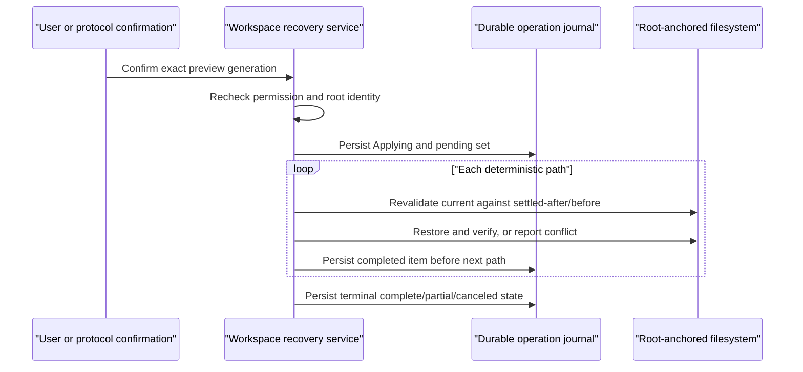

# P39.0 Workspace Recovery Contract

**Status:** historical
**Execution state:** complete; G2 remains open
**Last verified:** 2026-08-02
**Promotion snapshot:** `fea3d98c8139494afb4697b756a6b59dae3b17cf`

> **Ownership:** the completed characterization contract for a future durable,
> conflict-safe workspace recovery service. Promotion evidence is in
> [`p39-0-workspace-recovery-promotion.md`](../verification/p39-0-workspace-recovery-promotion.md),
> and closeout evidence is in
> [`p39-0-workspace-recovery-contract.md`](../history/runtime/p39-0-workspace-recovery-contract.md).
> This document defines no production schema, writer, preview/apply API, or
> `/rewind` handler.

## Decision

P39.0 completed under `project-native`:

- preserve the current Session, transcript, command, permission, and canonical
  workspace-root owners;
- require one separate Session/turn-bound durable workspace recovery service
  before file content can become rollback authority;
- reject revival of the process-local `filehistory.FileTracker`, overloading
  transcript interaction provenance, Git reset as a workspace-state oracle,
  and adoption of another product's history format; and
- defer every writer, retention policy, command, and automatic restoration
  path to a later separately accepted slice.

The compatibility consequence is deliberate: `/rewind` stays a
non-executable tombstone. P39.0 closes the ambiguity around the safety and
durability contract, not the user-visible G2 gap.

## User Problem And Current Boundary

Users cannot return a workspace to the state captured before an agent turn.
The existing `FileStateCache` records only whether a file was read, edited, or
written. The disconnected `filehistory.FileTracker` has no production
composition root and lacks the root, conflict, permission, and crash fences
required for destructive restoration.

Conversation replay and workspace rollback are different authorities:

- transcripts remain the append-only conversation, usage, lifecycle, and
  presentation authority;
- Session identity remains the durable root/turn lineage authority;
- permission remains the action-admission authority; and
- a future workspace recovery service alone may own private file bytes,
  before/after identity, preview, apply, and partial-operation recovery.

No existing transcript, interaction-cache, tracker, or Git record may be
reinterpreted as a recovery snapshot.

## Complete-Capture Admission

A future snapshot is usable only when the service knows the complete set of
paths affected by the accepted mutation boundary.

Typed, root-authorized file operations may provide that set before dispatch.
Arbitrary Bash commands, shell hooks, configured stdio MCP processes, external
editors, child processes, and other ambient-host writers do not. Until a later
enforcing filesystem-observation boundary proves complete attribution, any
turn containing an unobserved writer must be marked `incomplete` and cannot be
applied as a full-turn recovery.

Git status, mtime scans, and post-hoc directory diffs are diagnostics only.
They cannot prove that a path was not replaced twice, that a mode or untracked
file was preserved, or that a concurrent external edit belongs to the agent.
An incomplete snapshot may explain why recovery is unavailable; it may not
silently restore a subset and call the turn recovered.

## Logical Durable Records

P39.0 freezes two logical versioned records for a future writer. These names
describe the contract; no physical file, database, or migration is created by
this slice.

### `workspace-recovery-snapshot/v1`

The snapshot identity covers:

- schema kind/version, immutable snapshot ID, Session ID, turn ID, and capture
  boundary;
- canonical workspace root plus a platform-derived durable root identity;
- completeness state and the exact mutation-source classes admitted;
- deterministic relative path order; and
- for every path, before and settled-after existence, regular-file type,
  exact content digest and private content authority, and permission mode.

Paths are slash-normalized, relative, traversal-free, and unique. Directories,
links, devices, sockets, hard-link ambiguity, alternate streams, and unknown
file types are unsupported until a later contract names their semantics. A
rename is two explicit path states; it is never inferred.

### `workspace-recovery-operation/v1`

The operation identity covers:

- immutable operation and snapshot IDs;
- exact Session, turn, canonical root, preview generation, confirmation
  identity, and permission-policy revision;
- terminal state plus deterministic per-path `pending`, `applied`,
  `already_applied`, `conflict`, `failed`, or `canceled` results; and
- a durable completed set and bounded reason codes sufficient for exact retry.

Raw file bytes, prompts, tool input/output, credentials, and absolute private
paths are excluded from public diagnostics, transcripts, ACP replay, exports,
and model input. Content storage is private local state with restrictive
permissions and explicit size/count budgets supplied by the future writer
slice.

## Preview, Confirmation, And Permission

Preview is a pure read of one complete snapshot against the current root. It
returns the exact ordered affected paths, operation classes, conflicts, and
unsupported reasons without mutating either the workspace or Git index.

Apply requires all of the following after preview:

1. the same snapshot ID, preview generation, Session, turn, and root identity;
2. explicit user confirmation for that exact bounded path set;
3. a fresh exact permission decision for the destructive recovery action; and
4. final root and per-path revalidation immediately before each mutation.

Confirmation is not a persisted allow rule, and a permission allow rule is not
confirmation. `acceptEdits`, Auto, `--yolo`, bypass, resumed interaction state,
child authority, or an ACP client field cannot synthesize either one. Denial,
timeout, disconnect, cancellation, stale policy, or missing interaction support
performs no write.

## Conflict And Containment Rules

Apply holds or reacquires a root-anchored filesystem authority and rejects root
replacement before processing paths. Every component is accessed relative to
that authority and must remain non-link and of the expected type.

For each path:

- current equals settled-after: restore the captured before state;
- current equals before: record `already_applied` without rewriting;
- current equals neither, or root/type/link identity drifts: record a conflict
  and leave the current path untouched; and
- an unsupported or unreadable identity fails closed.

The service never follows a symlink, writes outside the saved root, overwrites
an external edit, calls Git reset/checkout, stages a file, changes the Git
index, or resolves a conflict by choosing the older bytes automatically.

## Ordered Apply And Crash Recovery

The observable order is deterministic lexical relative-path order. A future
writer must use root-relative no-follow operations, private same-root temporary
files where replacement is needed, exact mode restoration, post-write content
verification, and the platform durability primitives named by that writer.

Cancellation is checked before each new path. An admitted per-path mutation
finishes verification or returns a precise failure; cancellation does not
pretend to undo an unknown half-write.

After a crash, retry loads both records, reopens and revalidates the exact root,
recomputes the snapshot identity, and resumes only the recorded pending set. If
a file write completed before its journal bit was persisted, equality with the
before state fences it as `already_applied`. Missing/corrupt/unknown-version
records, replaced roots, mismatched operations, or incomplete snapshots fail
closed and never auto-resume.

## Entrypoint Contract

| Surface | Future contract |
|---|---|
| TUI and Plain root Sessions | May preview and apply through the same Session/turn service after exact interactive confirmation and permission. |
| Ordinary and Goal headless root Sessions | May inspect availability; destructive apply requires a future explicit non-interactive confirmation protocol. Normal one-shot execution cannot auto-apply. |
| ACP root Sessions | May use the same service only through an accepted protocol interaction that binds preview, confirmation, permission, and disconnect semantics before mutation. |
| Child Agent | Unsupported. A child cannot inherit, create, preview, or apply root-Session recovery authority. |
| Standalone MCP | Unsupported. It has no QueryEngine/Session command owner and receives no recovery capability. |
| CLI Session administration | No apply command is accepted by P39.0. A future provider-free administrative surface requires its own exact identity and confirmation contract. |

Fork and branch operations do not copy recovery authority. Export and ACP
replay exclude private recovery content. Resume may inspect a matching durable
operation but never applies it automatically.

## Schema, Migration, Retention, And Deletion Gate

There is no legacy authoritative content schema to migrate. The interaction
cache, `FileTracker`, Git history, and reference-product history records are
explicitly ineligible inputs. Unknown versions are quarantined or ignored with
a bounded diagnostic; they are never guessed into v1.

Before a writer can be accepted, its slice must name:

- the exact private storage root, atomic publication and `fsync` protocol, and
  permissions on Darwin, Linux, and Windows;
- content/file/count budgets plus an explicit bounded retention policy;
- create/settle/restart state transitions and corruption handling;
- the migration owner for every future schema version; and
- the deletion owner that removes exact Session-owned recovery records and
  content on Session deletion without path guessing or following links.

Session deletion is the required lifecycle boundary for Session-owned recovery
state, but P39.0 adds no sidecar and changes no current deletion code. A future
writer must extend the existing exact owned-artifact deletion transaction and
prove partial cleanup/retry. Automatic age pruning, cross-Session sharing, cloud
synchronization, and portable export remain unaccepted product policies.

## Deterministic Proof Matrix

The merged promotion oracle proves:

| Boundary | Evidence |
|---|---|
| Captured state | Clean and dirty tracked bytes/mode, staged worktree state, untracked creation, delete, and rename path states restore exactly without using HEAD. |
| Git isolation | Recovery leaves the staged index byte-identical. |
| Conflict safety | External bytes/mode, symlink replacement, and root replacement produce conflicts without overwriting or escaping. |
| Authorization | Missing confirmation or permission returns before mutation. |
| Retry | Snapshot and operation serialize together; reconstruction reacquires root identity, verifies the digest, fences completed paths, and safely resumes pending work. |
| Failure lifecycle | Injected partial failure, cancellation, and a missing durable root return precise non-success without panic or automatic writes. |
| Entrypoints | Production command/containment identities bind root TUI, Plain, headless/Goal, and ACP disposition; child and standalone MCP are unsupported. |
| Platforms | The matrix runs and races on Darwin/Linux; the Windows handle-derived identity path cross-compiles. Windows runtime filesystem semantics remain unproven. |

This oracle is a sequential test-only reference model. It does not prove a
production writer, crash `fsync`, bind-mount containment, every check/use race,
arbitrary-process change capture, or a physical Windows runtime.

## Non-Goals

P39.0 accepts none of the following:

- a production snapshot/writer/store, preview/apply API, `/rewind` handler, or
  automatic restoration;
- transcript rewriting, conversation undo/redo/branching, or Goal rollback;
- Git reset/checkout/stash as the user's pre-turn workspace authority;
- arbitrary Bash/hook/MCP/process mutation discovery without complete
  observation;
- directory/link/device recovery, merge/conflict resolution, or cross-root
  moves;
- cloud synchronization, portable export, encryption/key management, or an OS
  sandbox; or
- reference-product persistence or compatibility promises.

## Rollback And Next Admission

P39.0 writes no production state and changes no runtime behavior. Rollback
removes this contract and its test-only oracle, returns the slice to queued
research, and leaves `/rewind` unavailable with existing Git/workspace recovery
guidance.

A later writer slice requires a new product intake and root-PLAN promotion. It
must select complete mutation-source coverage, physical schema and retention,
platform durability mechanisms, preview/apply surfaces, exact permission and
confirmation wiring, deletion/rollback, and real crash/platform tests. No
writer or command becomes accepted automatically from P39.0 closeout.

## Evidence And Current Owners

- [workspace-recovery promotion](../verification/p39-0-workspace-recovery-promotion.md)
- [file-state checkpoint recovery audit](../reference/runtime/file-state-checkpoint-recovery-audit.md)
- [transcript architecture](../../architecture/state/transcripts.md)
- [command architecture](../../architecture/capabilities/commands.md)
- [permission architecture](../../architecture/capabilities/permissions.md)
- [Session deletion implementation](../../../engine/session/delete.go)
- [recovery characterization oracle](../../../engine/recovery/p39_workspace_recovery_promotion_test.go)
