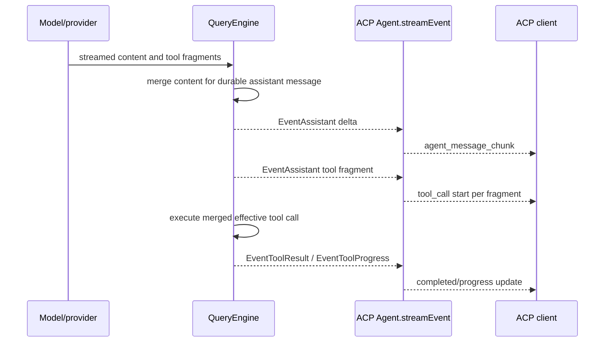

# ACP (Agent Client Protocol) Adapter Conformance and Reference Audit

**Status:** reference-snapshot
**Research date:** 2026-07-26
**Eino-Agent snapshot:** `303a757fb186` (production Go unchanged since
`46547f139b58`)

> **Ownership:** source-backed comparison for the observable ACP adapter
> question. Current implementation facts belong in
> [`architecture/platform/acp-adapter.md`](../../../architecture/platform/acp-adapter.md);
> unresolved gaps belong in [`REMAINING.md`](../../REMAINING.md); accepted
> execution belongs in
> [`p23-acp-adapter-hardening.md`](../../plans/p23-acp-adapter-hardening.md).

## Frozen Question

How should Eino-Agent project its existing engine-owned text, tool lifecycle,
commands, prompt content, and durable sessions into ACP v1 so that supporting
IDE clients receive exact streaming bytes, complete raw tool data, command
discovery, truthful capabilities, and replay-safe session behavior without
creating a second runtime owner? Which v2 Draft and SDK differences must be
guarded so that a future package update cannot silently change the wire
contract?

The audit covers the user-reported stream layout, blank tool `Raw Input`, and
missing slash-command hints, then widens only to protocol surfaces whose
current declarations or silent behavior make the adapter unsafe or
non-conformant.

## Sources and Confidence

| Source | Snapshot | Role |
|---|---|---|
| Eino-Agent production source and tests | `303a757fb186`; `coder/acp-go-sdk v0.13.5` | Current behavior and reachability |
| [ACP v1 Latest](https://agentclientprotocol.com/protocol/v1/initialization) and [v2 Draft](https://agentclientprotocol.com/protocol/v2/migration) specification | verified 2026-07-26 | Normative v1 semantics and an explicit future migration boundary |
| official [`agentclientprotocol/codex-acp`](https://github.com/agentclientprotocol/codex-acp/tree/ba5bef59cfcea4229841fe9438d816696621307b) | `ba5bef59cfce`; SDK 1.3.0 | Primary production evidence for complete setup, raw tool facts, commands, live/replay de-duplication, and lifecycle cleanup |
| official [`agentclientprotocol/claude-agent-acp`](https://github.com/agentclientprotocol/claude-agent-acp/tree/53a0c36ce3b0b76929d11d8b9565e319da745608) | `53a0c36ce3b0`; SDK 1.3.0 | Primary production evidence for permission/tool ordering, terminal settlement, replay identity, and cancellation |
| [Gemini CLI ACP adapter](https://github.com/google-gemini/gemini-cli/tree/3818efbbfbf8ef029ef53a6ab1093db39971ce83/packages/cli/src/acp) | `3818efbbfbf8`; SDK 0.16.1 | Independent production evidence for setup, replay, commands, permission correlation, and prompt-scoped cancellation |
| OpenCode ACP adapter | upstream `7534d23551f6`; local snapshot `411eff73f026`; SDK 0.21.0 | Stateful message/tool projection evidence |
| Zed ACP client | `1764c2fa6776`; ACP Rust package 2.0.0 | Current client ingestion evidence; package version is not a negotiated wire version |
| `zed-industries/codex-acp` | `296069e84163`; Rust ACP 0.14.0 unstable | Secondary historical evidence now superseded for current Codex adapter details |
| Goose ACP server | `192b5db8b947`; Rust ACP unstable | Supplemental extension/capability and delivery-error evidence |
| local Codex, Crush, and Claude Code Ripe references | `66bd101fff6f`, `2af939d8e900`, `4b9d30f79532` | Negative evidence: no directly reusable ACP adapter in these snapshots |

The official protocol is authoritative for wire semantics. Reference
implementations are evidence about viable mechanisms, not specifications.
Client conclusions are source-backed but have not yet been verified by running
a real Zed interoperability fixture.

### P23.5 promotion refresh

The original reference snapshot above remains the evidence for the full P23
program. P23.5 promotion refreshed only the stdio-MCP question on 2026-07-28:

| Source | Refreshed evidence | Consequence |
|---|---|---|
| Eino-Agent at `1b33ba2f5122` | `session/new`, `session/load`, and `session/resume` all reject non-empty `mcpServers`; load now otherwise replays and commits through restore staging | The remaining user gap is stdio MCP, but setup must preserve P23.4b replay/commit/register order |
| [ACP v1 session setup](https://agentclientprotocol.com/protocol/v1/session-setup), verified 2026-07-28 | New and load carry MCP lists; resume carries the reconnect list; every v1 agent supports stdio, while HTTP/SSE are capability-gated | A new-only implementation cannot close P23.5 or G17 |
| official TypeScript SDK `f1c01412e2c3`, npm `1.3.0`, verified 2026-07-28 | `src/schema/types.gen.ts` retains `mcpServers` on `NewSessionRequest`, `LoadSessionRequest`, and `ResumeSessionRequest`; `src/examples/client.ts` provides the subprocess pipe pattern | Pin schema and client-wire proof without adopting experimental v2 |
| Zed `3b79b56201f3`, verified 2026-07-28 | `crates/agent_servers/src/acp.rs` uses `mcp_servers_for_project` and `SessionDirectories::into_{new,load,resume}_session_request` to send the same project list on all three entrypoints | A real Zed smoke can prove the actual client path; unsupported HTTP must fail explicitly |
| official `agentclientprotocol/codex-acp` `ba5bef59cfce`, verified 2026-07-28 | `src/CodexAcpClient.ts::{newSession,loadSession,resumeSession,createSessionConfig}` maps each request's MCP list into session configuration | Use as entrypoint/mapping evidence, not as atomicity or runtime ownership |
| `zed-industries/codex-acp` `296069e84163`, verified 2026-07-28 | `src/codex_agent.rs::{build_session_config,new_session,load_session,resume_session}` maps the same setup surface | Secondary independent mapping evidence only |
| local `.reference/opencode/packages/opencode/src/acp/service.ts` | `registerMcpServers` runs on new/load/resume but ignores individual registration errors | Reject its partial-success behavior |
| local `.reference/crush/internal/agent/tools/mcp/{init.go,process_unix.go}` and `.reference/codex/codex-rs/rmcp-client/src/{stdio_server_launcher.rs,rmcp_client.rs}` | Dedicated stdio process owners use process groups or job/tree termination and explicit close/drop fallback | Adapt bounded descendant cleanup; do not copy their runtime or provider policy |
| `github.com/modelcontextprotocol/go-sdk/mcp` v1.6.1 `mcp/cmd.go` and Eino-Agent `engine/mcp/sdk_client.go::buildTransport` | `CommandTransport.Close` closes stdin, waits, signals, and kills the direct child, but does not own a descendant process group | Keep the SDK protocol session while adding an `engine/mcp` OS-specific process-tree transport boundary |

Current Eino-Agent's `MCPToolManager.ConnectServer` publishes each client and
tool set immediately. A later server failure does not roll back earlier
connections; `RegisterToolsInRegistry` has no batch collision preflight; an
unexpected connection close removes manager tools but not registry rows.
`InitMCPManager` intentionally tolerates individual project-config failures.
Those are valid generic-runtime choices but not a client-request setup
transaction.

Restore staging adds a second constraint: `CommitRestoreStaging` activates
`reloadResumedExecutionContext`, which constructs a project-config manager and
replaces the staging manager. Connecting client descriptors to the current
staging manager would therefore either discard them at commit or require a
fallible post-commit attach, violating P23.4b. P23.5 must carry one prepared
combined manager/registry generation through commit and make abort own its
cleanup.

**P23.5 decision: `combine`.** Combine normative ACP v1 new/load/resume setup,
the existing Eino-Agent manager/registry/permission/staging owners, current Zed
client behavior, and Codex/Crush process-tree cleanup evidence. Preserve the
explicit rejection for HTTP/SSE/ACP transports, ACP v2, and malformed input.
Reject reference-specific runtime/config stores, silent partial registration,
descriptor persistence, shell execution, and stale registry rows.

## SDK and Schema Mapping

The compared projects do not use one identical SDK release. Artifact version
and negotiated protocol version must be tracked independently:

| Project | SDK binding | Consequence for this audit |
|---|---|---|
| Eino-Agent | `github.com/coder/acp-go-sdk v0.13.5`, protocol v1 | This is the implementation target. Its generated types and connection dispatcher define the current Go wire path. |
| official TypeScript SDK | stable package entrypoint 1.3.0 targets v1; v2 requires `experimental/v2` | The official stable API is schema evidence. A v2 import is an explicit experimental adoption, not an automatic upgrade. |
| official Codex and Claude adapters | `@agentclientprotocol/sdk 1.3.0` | Current first-party adapter mechanisms are stronger evidence than the older Rust Codex adapter, but their vendor runtime/storage owners are not copied. |
| Gemini CLI and OpenCode | TypeScript SDK 0.16.1 and 0.21.0 | Independent mechanisms remain useful even though their SDK artifacts are older. |
| current Zed source | Rust `agent-client-protocol 2.0.0` | Client behavior evidence only. The crate version must not be mistaken for the wire version negotiated on a connection. |

The ACP project announced stable official Rust and TypeScript SDKs in
[June 2026](https://agentclientprotocol.com/announcements/sdk-1-0-releases).
That ecosystem milestone does not by itself make a Go rewrite or protocol-v2
upgrade necessary. First prove v1 schema conformance and real-client behavior;
then audit an SDK/protocol upgrade as its own compatibility change.

The current Go SDK already exposes the v1 fields needed for the reported
fixes. Its connection layer also owns generic JSON-RPC `$/cancel_request`
dispatch; the adapter separately owns ACP `session/cancel` semantics.

| Wire shape | Relevant interface detail | Required adapter behavior |
|---|---|---|
| `agent_message_chunk` | text content plus optional `messageId` | Stable IDs are a P23 product contract and client-quality improvement; they are optional in v1, required only in v2. Preserve content bytes exactly. |
| `tool_call` | required `toolCallId` and title; optional kind, status, content, locations, `rawInput`, and `rawOutput` | Send once per engine invocation from canonical lifecycle state. |
| `tool_call_update` | only `toolCallId` is required; all changed fields, including `rawInput`/`rawOutput`, may arrive later | Reuse the same ID. Treat content and locations as replacement collections, not append deltas. |
| `available_commands_update` | complete command collection; each command has name, description, and optional unstructured input hint | Project the complete active registry snapshot, not an incremental or hard-coded list. |
| session setup | new/load/resume accept setup state, including MCP and `additionalDirectories` inputs | Bind behavior to declared capabilities; load replay and no-replay resume remain distinct. |

## Executive Finding

The three screenshot symptoms do not share one root cause:

| Symptom | Finding | Layer |
|---|---|---|
| Assistant words separated by blank lines | The matching durable assistant content already contains `"\n\n"` between word fragments. The engine concatenates those chunks exactly, and ACP forwards them without inserting whitespace. | Upstream provider/chunk construction, not an ACP whitespace bug |
| Blank tool `Raw Input` | Confirmed adapter defect. Tool arguments are streamed fragmentally, while `Agent.streamEvent` parses only the current fragment and does not retain per-call state or consume the engine's effective invocation. | ACP/runtime event projection |
| No `/` command hints | Confirmed adapter defect. The shared command registry includes an ACP entrypoint, but the adapter never emits `available_commands_update`. | ACP command projection |

The correct response is therefore not a text whitespace filter. The adapter
needs a stateful, typed projection boundary, while provider diagnostics need
to preserve exact upstream chunk bytes.

## ACP v1 Contract

The applicable official contracts are:

- [Tool calls](https://agentclientprotocol.com/protocol/v1/tool-calls):
  a logical call starts with `tool_call`; later `tool_call_update` messages
  reuse its ID, carry only changed fields, and can replace the content
  collection. `rawInput` and `rawOutput` are diagnostic facts.
- [Prompt turn](https://agentclientprotocol.com/protocol/v1/prompt-turn):
  assistant chunks can carry a message ID for grouping, and cancellation has
  an explicit terminal outcome.
- [Slash commands](https://agentclientprotocol.com/protocol/v1/slash-commands):
  the agent sends a complete `available_commands_update`; command input is
  still ordinary prompt text.
- [Session setup](https://agentclientprotocol.com/protocol/v1/session-setup):
  `load` replays the complete conversation through session updates before its
  response, while `resume` restores execution without replay. Session MCP
  inputs are part of setup, and every v1 agent must support stdio MCP servers;
  HTTP and SSE are separately negotiated options.
- [Session list](https://agentclientprotocol.com/protocol/v1/session-list):
  list accepts an opaque cursor and may return `nextCursor`; agents should
  reject invalid cursors and enforce reasonable internal page sizes.
- [Initialization](https://agentclientprotocol.com/protocol/v1/initialization):
  advertised capabilities must match implementation. Text and ResourceLink
  are baseline prompt content; optional rich content needs explicit
  capability negotiation.

The current failures do not require an SDK rewrite.

### Complete v1 surface ledger

This ledger separates required conformance from optional product scope:

| v1 surface | Protocol status | Current Eino-Agent status | P23 disposition |
|---|---|---|---|
| initialize/version negotiation | required | Always returns v1 and does not branch into another schema | Preserve v1; add an SDK wire fixture for requests at versions 1 and 2 |
| agent implementation info | recommended | `agentInfo` omitted | Add stable name/title/version |
| authentication/logout | capability/advertisement-gated | No auth methods or logout capability advertised; handlers are local no-ops | Preserve the unadvertised local boundary; do not imply authentication |
| Text and ResourceLink prompt blocks | required baseline | Text only; ResourceLink silently dropped | Implement ordered ResourceLink ingestion; reject unsupported block types |
| image/audio/embedded resource prompt blocks | optional capability-gated | Unadvertised and ignored | Return a stable unsupported-input error rather than empty success |
| additional directories | capability-gated optional | Not advertised but request fields are ignored | Keep unadvertised until one validated workspace/permission-root owner exists; reject non-empty input in the interim |
| stdio MCP server input | required session setup behavior | Ignored | Implement an isolated per-session lifecycle; HTTP/SSE remain unadvertised |
| load versus resume | load optional; resume capability-gated | Both restore; load does not replay | Disable load claim until full replay passes; keep resume no-replay |
| session list pagination | capability-gated; cursor/nextCursor shape | Returns an unbounded full set and ignores cursor | Add a bounded opaque cursor or narrow the advertised list contract before conformance closeout |
| session delete | capability-gated optional | Advertised with an uncontained target | Disable or harden through one session service before keeping the claim |
| tool create/update | v1 says agents should report model-requested tool calls; delivered shapes then obey the schema | Stateless fragment mapping | Adopt a stronger project contract: one lifecycle ledger, stable tool ID, replacement-safe updates, and exactly one terminal state |
| slash commands | optional notification surface | Dispatch exists; discovery update absent | Send complete snapshots from the engine registry |
| message IDs | optional on v1 chunks | Omitted | Add stable IDs as a project-owned grouping/replay contract, not as a claimed v1 MUST |
| prompt message acknowledgement | unstable optional fields | Not implemented | Defer; do not claim `PromptRequest.messageId`/`userMessageId` acknowledgement |
| thought and plan | optional | Not projected | Explicitly defer pending privacy/product decisions |
| client filesystem and terminal | optional client capabilities | Agent does not call them | Preserve the no-client-execution boundary |
| session and request cancellation | required session cancel; optional generic JSON-RPC `$/cancel_request` | Prompt-scoped session cancel is active; the current SDK supports generic request cancellation | Characterize both without presenting the optional SDK path as a v1 requirement or adding engine-wide cancellation |
| modes, config options, usage, and session info | optional session/update surfaces | Modes/config and unstable usage are projected; portable session-info updates are absent | Preserve verified modes/config; characterize every advertised or emitted field |
| elicitation | optional client capability | Agent does not call it | Preserve no-elicitation behavior |
| standard errors and `_meta` extensions | baseline JSON-RPC plus optional extensions | Mixed plain errors; private updates are not advertised | Freeze invalid-params/not-found/conflict/internal mapping and advertise no private extension by implication |
| fork | unstable optional | Implemented as an unstable handler | Keep outside stable v1 conformance and test only as a project extension |

### v2 Draft migration guard

ACP v2 remains a separate future adoption decision. It changes observable
lifecycle semantics:

| v1 | v2 Draft |
|---|---|
| `authenticate`/`logout` with v1 advertisement | `auth/login`/`auth/logout` with reorganized requirements |
| prompt request remains pending until stop reason response | prompt returns an acceptance acknowledgement; completion arrives in `state_update` |
| chunks may omit message IDs | message IDs are required and messages are ID-keyed upserts |
| `tool_call` creates and `tool_call_update` modifies | the first `tool_call_update` creates; all updates have patch/upsert semantics |
| `session/load` replays; resume does not | load is removed; resume accepts `replayFrom` |
| client filesystem, terminal execution, and modes exist | those surfaces are removed; terminal becomes agent-owned display and modes become config |
| role-specific capability/info fields | reorganized object capabilities and required `info` |

Future v2 work must:

1. negotiate v1 or v2 per connection and retain v1 regression fixtures;
2. use separate generated schema/handler fixtures behind an explicit feature
   flag;
3. never route a v2 prompt through the v1 pending-response completion path;
4. gate unstable v2 additions independently from the stable v2 baseline; and
5. preserve project-owned runtime, permission, persistence, and cancellation
authorities.

Neither the SDK 1.x label nor Zed's Rust crate 2.x label satisfies these gates.
The [official TypeScript SDK documentation](https://agentclientprotocol.github.io/typescript-sdk/)
keeps v1 at the stable entrypoint and requires an explicit experimental import
for v2.

## Current Production Trace



This trace exposes the ownership mismatch: complete arguments and actual
execution status exist at the engine execution boundary, but ACP attempts to
reconstruct them from model-facing fragments.

### Text byte reproduction

The corresponding private local transcript was inspected without copying its
path or prompt into repository documentation. Its sanitized assistant value
has this shape:

```text
The\n\n worktree\n\n isolation\n\n failed ...
```

The stored bytes establish that the screenshot's layout was already present
before client rendering. The sub-agent result itself was a normal single-line
tool result. `stream_processor.go` concatenates chunk contents without adding
newlines. An ACP-side whitespace normalizer would hide provenance and corrupt
valid Markdown/code output.

### Raw input reproduction

`Agent.streamEvent` handles each assistant event independently. For every
visible tool fragment it:

1. creates a `tool_call` start;
2. tries to parse only that fragment's `Function.Arguments`;
3. omits `rawInput` for an empty fragment; and
4. discards projection state after the notification.

A complete argument object in one event works, which is the only shape the
existing focused test proves. Normal fragmented JSON cannot be made complete
without correlating the stable tool-call ID with the merged effective
invocation.

### Command reproduction

`engine/commands.Registry.ListForContext` can filter the active immutable
command generation for `EntrypointACP`. No production ACP handler calls it and
no `available_commands_update` is sent after new, load, resume, or fork.

In current Zed source, an available-commands update replaces the session
command set and drives composer completion, placeholder/argument hints, and
send-time validation. Missing notification directly explains the absent
slash-command UI.

## Broader Conformance Findings

| Severity | Finding | Consequence |
|---|---|---|
| P0 | `loadSession` is advertised, but load restores an engine without replaying durable user, assistant, or tool history. | A client can open an existing session as an apparently empty conversation; the declaration violates ACP v1 load semantics. |
| P0 | unstable ACP delete joins an untrusted session ID into the transcript path without resolved-root containment and bypasses `engine/session.DeleteSession`; the engine helper also needs the same ID/path hardening. | A crafted ID can address another `*.jsonl` path available to the process, while bypassing centralized sidecar cleanup. |
| P1 | baseline `ResourceLink` prompt content is silently discarded. | Resource-only context becomes an empty successful prompt. |
| P1 | session MCP server inputs are silently ignored even though ACP v1 requires stdio MCP support. | Client-supplied tools disappear without connection, negotiation, or an error boundary. |
| P1 | non-empty `additionalDirectories` is ignored even though the capability is not advertised. | A client can believe extra workspace roots were admitted while engine context and permission roots remain unchanged. |
| P1 | tool calls have no stateful identity/lifecycle projector. | Repeated starts, partial raw input, false completed status, lost raw output, and replacement-unsafe progress are possible. |
| P1 | command discovery is absent. | Supporting clients cannot discover or validate the commands dispatch already accepts. |
| P2 | session list ignores cursor input and has no `nextCursor`. | Large stores have no bounded page or stable continuation contract despite the advertised list surface. |
| P2 | standard error and extension negotiation is not frozen. | Clients must infer not-found, invalid input, conflict, and private-extension behavior from implementation-specific error strings. |
| P2 | `agentInfo` and portable discovery of private extensions are absent. | Diagnostics and extension discoverability are weaker, but core turns still operate. |
| P2 | inactive `StreamBuffer` and `ToolApprovalManager` have tests but are not production owners. | Their passing tests can be mistaken for production backpressure or approval coverage. |

Core stdio wiring, new/close/resume/list, modes, config options, permission
requests, prompt-scoped cancellation, generic SDK request cancellation,
disconnect settlement, and the shared `QueryEngine` path are active. Optional
image/audio/embedded content and client filesystem/terminal features are
unadvertised, so their absence is not a capability lie. Thought, plan,
acknowledgement, and unstable fork are explicit optional or extension surfaces,
not evidence of full v1 conformance.

## Client and Reference Comparison

| Source | Verified mechanism | Adopt or reject |
|---|---|---|
| official Codex ACP | Handles MCP and additional roots explicitly; projects stable message/tool IDs, raw input/output, commands, replay, live/history fallback de-duplication, and active-session cleanup | **Adapt** its typed lifecycle and replay/delivery fixtures; reject Codex thread-store, fixed commands, actor layout, and provider policy |
| official Claude Agent ACP | Ensures a permission-referenced tool is visible first; reuses replay identities; settles every visible tool; separates load replay from resume; coordinates queued/running cancellation | **Adapt** visibility-before-permission and exactly-one-terminal invariants; reject Claude auth, queueing, subagent metadata, and force-cancel algorithm |
| Gemini CLI | Independently correlates tool descriptors with permission, uses per-prompt abort, and restores history plus commands | **Adapt** as independent lifecycle evidence; do not infer missing raw fields are prohibited |
| OpenCode | Keeps session-local message/part state and a tool-start set; projects pending/running/completed/error separately | **Adapt** the stateful projector pattern; reject its event-bus and persistence ownership |
| Zed client | Groups by message ID, upserts tool cards, accepts late raw input, and replaces command snapshots | **Use as client evidence**; its current ACP crate version is not the negotiated wire version |
| older Rust Codex ACP and Goose | Supply secondary delta/final, extension-gating, and delivery-error patterns | **Supplement only**; they do not override current official adapters or the v1 spec |

Across these independent implementations:

- a permission request referencing a tool call is sent only after that tool ID
  is visible to the client;
- every client-visible tool start is settled exactly once with a terminal
  outcome; on the target v1 schema, cancellation is `failed` plus a bounded
  diagnostic while the prompt stop reason is `cancelled`;
- load replay, live streaming, and resume are distinct paths that share
  identity rules but not delivery timing;
- commands are full replacement snapshots after session setup; and
- delivery failure is observable and cannot be followed by a false successful
  response.

Those are project-owned observable contracts selected from multiple sources,
not proof that any vendor's storage, queue, command list, or permission policy
is an ACP requirement.

## Adoption Decision

**Decision: `combine`.**

Combine:

- the official ACP v1 lifecycle, capability, command, content, and replay
  semantics;
- official Codex/Claude, Gemini, and OpenCode evidence for a stateful
  live/replay projector, permission/tool ordering, stable runtime tool-call
  identity, terminal settlement, and raw-plus-rendered dual projection;
- Zed evidence for client grouping, late raw-input updates, and complete command
  snapshots; and
- Eino-Agent's project-owned QueryEngine, command registry, session service,
  transcript, permission, and cancellation authorities.

Preserve exact assistant bytes and the single QueryEngine execution owner.
Reject reference-specific persistence, command names, permission policy, and
actor architecture. Keep the Go SDK while validating its emitted v1 wire
shape against the official schema; rewriting the adapter in Rust or
TypeScript has no user-value justification.

Reasoning/thought and plan projection are deliberately outside the first
hardening program. They need a separate product decision about privacy,
provider availability, replay, and client presentation; omitting them does not
block the reported outcomes. ACP v2 adoption is also separate: the v2 guard in
this report prevents accidental adoption but does not add a v2 implementation.

## Required Proof Before Slice Promotion

1. Capture golden Go SDK notifications for version negotiation, fragmented
   arguments, text/tool interleaving, replacement-style progress, permission
   ordering, failure, cancellation, command refresh, and load replay.
2. Prove assistant output bytes at provider input, engine event, transcript,
   ACP notification, and client ingestion boundaries without logging private
   content by default.
3. Run a schema-level official TypeScript client harness and a real Zed smoke
   test for text grouping, raw input/output, failed tool state, command hints,
   cancellation, and load/resume.
4. Harden the existing engine deletion helper, delegate ACP to it, and test
   malicious IDs, resolved-root containment, symlink behavior, and owned
   sidecar cleanup through that one service.
5. Treat every delivery error as part of turn settlement; do not silently
   continue after a required tool start/update, command snapshot, or replay
   notification fails.
6. Freeze the durable replay role/tool/error mapping and a non-persisting
   staging cleanup path before re-advertising load.
