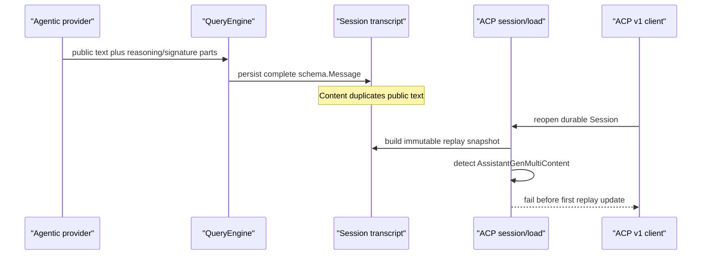

# ACP Provider-Rich Assistant Replay Audit

**Status:** reference-snapshot
**Snapshot:** 2026-08-01; Eino-Agent
`2ce4edf08b6da81e9c2c7631229e763b7071b0d8`, Codex
`66bd101fff6f`, OpenCode `411eff73f026`, Claude Code Ripe
`4b9d30f79532`, Crush `2af939d8e900`, and the pinned ACP v1 Go and
TypeScript SDKs

> **Ownership:** source-backed evidence for G20's provider-rich assistant
> `session/load` boundary. Current behavior belongs in
> [`acp-adapter.md`](../../../architecture/platform/acp-adapter.md), the
> unresolved gap belongs in [`REMAINING.md`](../../REMAINING.md), and the
> accepted implementation contract belongs in
> [`p36-acp-assistant-replay.md`](../../plans/p36-acp-assistant-replay.md).

## Decision

Use `combine`: preserve the current transcript, immutable Session snapshot,
logical assistant identity, complete-before-delivery ACP projection, and
restore-staging order. Add one project-owned separation between ordered public
assistant presentation and provider-continuation material.

P36.1 accepts only the provider-rich shape current production already creates:
public text duplicated in `Message.Content` and ordered text output parts,
optionally interleaved with private reasoning parts. The text parts must
concatenate byte-for-byte to `Message.Content`. ACP replays only those text
parts as ordered `agent_message_chunk` updates under the persisted logical
message ID. Reasoning text, signatures, encrypted continuation material, and
provider metadata remain in the durable message and independently restored
engine history; they never enter an ACP content block, thought chunk, metadata
field, or diagnostic.

Image, audio, video, unknown output-part types, malformed payloads, and public
text disagreement continue to fail before the first replay update. This does
not claim ACP v2, assistant media output, or a general provider event store.

## Observable Question

Can an ACP v1 client reopen a durable conversation produced by the current
Agentic provider path, see the exact public assistant text in the original
order, and continue the Session without exposing or discarding the private
reasoning material needed by the model?

The question covers provider-rich assistant messages already persisted by a
normal QueryEngine Session and the production `session/load` entrypoint. It
excludes live assistant media, ACP v2, cross-provider continuation, public
reasoning summaries, and arbitrary provider-specific output unions.

## Reproduced Current Boundary

The transcript recorder stores the complete persistable `schema.Message`
directly in one identity-bearing JSONL entry. Prompt records remove the provider-shaped user
message from their own entry, but ordinary assistant entries keep
`assistant_output_multi_content`, `ReasoningContent`, and the public
`Content` field unchanged.

The current Agentic streaming adapter appends every public text block to both
`Message.Content` and a typed text output part. It appends reasoning text to
`ReasoningContent` and a reasoning output part whose signature may contain
encrypted provider continuation tokens. Stream accumulation preserves both
representations; Eino's output-part concatenation retains distinct part
indices, metadata, and signatures in the live message. Streaming metadata is
runtime-only and is not serialized into the transcript.

`LoadSessionReplaySnapshot` clones that complete message for immutable
projection and validates durable identity and tool pairing. It is not the
QueryEngine restore input: the unregistered staging engine independently
reloads the transcript through the existing Session restore path.
`buildACPReplayProjection` then rejects any
unbound `AssistantGenMultiContent` before emitting ordinary assistant text or
tool updates. Focused tests reproduce the failure with zero wire bytes, no
active Session, and unchanged durable state. They also prove that reasoning
and signature survive in-memory history.

## Protocol and Capability Boundary

ACP v1 `agent_message_chunk` carries one text, image, audio, resource-link, or
resource content block. There is no video content block. The separate
`agent_thought_chunk` and optional message ID are unstable extensions, and a
thought chunk is not a portable container for encrypted reasoning signatures.

The current agent advertises text, image prompt, embedded-context, and
`loadSession` support; it deliberately does not advertise audio. Its live
assistant stream emits only canonical text deltas. Replaying assistant image
or audio without a matching live producer, output capability contract, and
real-client evidence would make load more capable than the active Session and
would not be a truthful compatibility repair.

P36.1 therefore uses the existing public text contract. Media or other output
parts remain an explicit unsupported-input failure even though the SDK union
can encode some of them.

## Comparative Evidence

| Source | Verified mechanism | Decision consequence |
|---|---|---|
| Eino-Agent transcript and Session snapshot | Assistant entries retain the complete `schema.Message`; replay clones it without rewriting durable bytes | No new durable schema or reverse inference is required |
| Eino-Agent Agentic adapter | Public text is accumulated in both `Content` and ordered text parts; reasoning text/signature is accumulated separately and in reasoning parts | Byte equality can validate the public projection while the original message remains the continuation owner |
| Eino-Agent ACP adapter | The full replay projection is built before transport; any rich assistant part currently fails before the first update | Preserve fail-closed staging and replace only the over-broad rich-content rejection |
| ACP v1 SDK | Agent message updates support typed content blocks, but video has no block and thought/message identity fields are unstable | Use stable text chunks only; do not smuggle private data through thought or metadata fields |
| Codex | Agent messages and reasoning summaries are distinct thread items | Public presentation must not be conflated with provider-private reasoning state |
| OpenCode | Ordered message parts have stable message/part identity, while encrypted reasoning remains provider metadata and is skipped for incompatible providers | Separate presentation facts from provider-bound continuation material |
| Claude Code Ripe | Thinking signatures are model-bound and are stripped or tombstoned across incompatible fallback boundaries | A signature is not portable client-visible content |
| Crush | Its private protocol forwards reasoning text and signature explicitly | That capability is protocol-specific and cannot define ACP v1 semantics |

No reference wins by identity. The accepted boundary takes Eino-Agent's
current public text, identity, and load transaction; Eino's provider-fidelity
message; the references' separation of presentation from continuation; and
ACP v1's actual stable content surface.

## Accepted Projection Contract

The immutable Session replay snapshot remains the transport-neutral projection
owner. For an assistant message with `AssistantGenMultiContent`, it validates
and derives an ordered public-text projection before ACP receives any update:

1. text parts contribute their exact bytes in persisted order;
2. reasoning parts require a valid reasoning payload but contribute no client
   block;
3. concatenated text must equal `Message.Content` byte-for-byte;
4. output-part `Extra`, reasoning text, signature, and message-level provider
   metadata are never copied to the public projection; runtime-only streaming
   metadata has no durable replay semantics;
5. image, audio, video, unknown, nil, or structurally invalid parts fail the
   complete load projection;
6. a reasoning-only assistant message may produce no agent text chunk, because
   it has no public presentation, while its tool calls and later public
   messages retain their normal order; and
7. the snapshot clone remains projection-only; the staging QueryEngine
   independently reloads the complete durable message, including private
   continuation fields, through the existing Session restore path.

ACP maps each accepted text part to one `agent_message_chunk`. Every part of
one logical assistant message uses the exact persisted UUID or the existing
privacy-safe fallback ID. Empty public text produces no empty chunk. Tool-call
updates remain after that message's public text and before their paired result,
as today.

All messages and parts are validated before the first transport write. A
malformed or unsupported later item therefore cannot leave a valid earlier
item visible on an otherwise live connection. Transport failure after delivery
may still leave the disconnected client with a partial local view, but staging
aborts and durable state is unchanged.

## Compatibility and Exclusions

P36.1 preserves:

- transcript bytes and readers;
- provider/model continuation fidelity through independent transcript restore;
- logical assistant and tool identities;
- exact public text bytes and message/part order;
- replay-before-config/mode/commands and commit-after-delivery ordering;
- no-history `session/resume` behavior; and
- explicit failure for unsupported provider output.

It does not add public reasoning summaries, `agent_thought_chunk`, assistant
image/audio/video output, remote media fetching, ACP v2, cross-provider
signature reuse, `_meta` transport, provider metadata diagnostics, transcript
backfill, or live stream behavior. A later assistant-media slice needs its own
capability, lifecycle, resource, client, and privacy audit.

## Evidence Limits

- Current production and fixtures prove text and reasoning/signature output
  from the Agentic path. They do not prove a production provider emits
  assistant image, audio, or video parts.
- The official TypeScript SDK observes the real stdio wire but is not a GUI.
  P36.1 therefore requires a separate isolated Zed restart smoke for the exact
  candidate binary before G20 can close.
- The existing real Zed rich-user proof ended with a plain assistant provider
  error. It cannot stand in for provider-rich assistant reopen evidence.
- No cross-provider continuation claim is made. Restored private reasoning
  remains governed by the current model binding and provider adapter.

## Source Anchors

| Boundary | Direct evidence |
|---|---|
| exact assistant transcript persistence | [`Recorder.RecordMessages`](../../../../engine/transcript/persist.go), [`recordEntry.persistable`](../../../../engine/transcript/persist.go) |
| Agentic public/private output conversion | [`toolCallAccumulator.convertChunk`](../../../../engine/provider/provider.go), [`ConcatAssistantOutputParts`](../../../../engine/messages/normalize.go) |
| final stream accumulation | [`ProcessStream`](../../../../engine/execution/stream_processor.go) |
| immutable durable replay snapshot | [`LoadSessionReplaySnapshot`](../../../../engine/session/replay_snapshot.go) |
| complete ACP replay projection | [`buildACPReplayProjection`](../../../../server/acp/replay.go) |
| load staging and commit order | [`Agent.LoadSession`](../../../../server/acp/agent.go) |
| current fail-closed and reasoning-fidelity tests | [`replay_test.go`](../../../../server/acp/replay_test.go), [`query_engine_history_test.go`](../../../../engine/query_engine_history_test.go) |
| official client harness | [`p23_5_typescript_sdk_harness.mjs`](../../../../server/acp/testdata/p23_5_typescript_sdk_harness.mjs) |
| Codex item separation | `.reference/codex/sdk/typescript/src/items.ts` |
| OpenCode presentation and provider metadata | `.reference/opencode/packages/schema/src/v1/session.ts`, `.reference/opencode/packages/core/src/github-copilot/responses` |
| Claude signature fallback boundary | `.reference/claude-code-ripe/src/query.ts` |
| Crush private output union | `.reference/crush/internal/message/message.go`, `.reference/crush/internal/server/events.go` |
