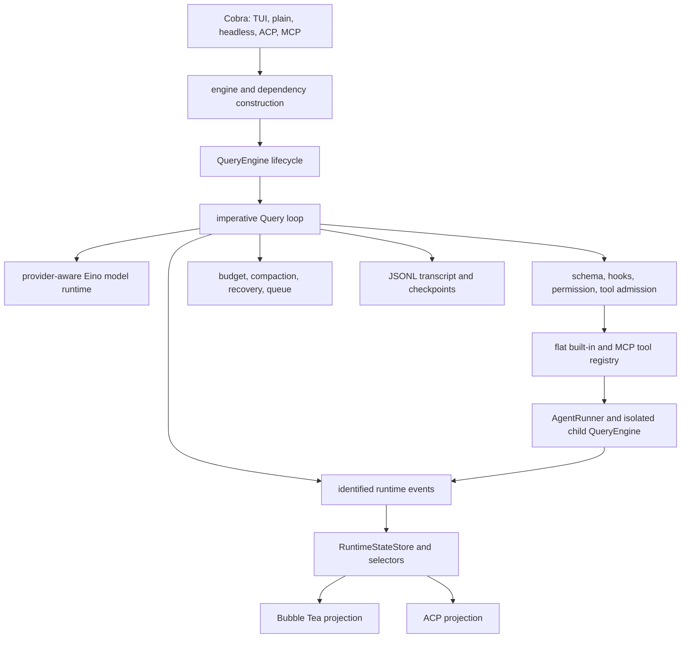

# Coding-Agent Runtime Architecture Comparison

**Status:** reference-snapshot
**Last verified:** 2026-07-14
**Scope:** Claude Code Ripe, Codex, Crush, OpenCode, Pi, and Eino-Agent

> **Ownership:** this report compares whole-agent architecture and derives
> adaptation decisions. Current Eino-Agent status belongs in
> [`migration/STATUS.md`](../../STATUS.md), executable work in [`migration/PLAN.md`](../../PLAN.md),
> and source-slimming decisions in
> [`module-criticality-and-slimming.md`](module-criticality-and-slimming.md).

## Decision

> **Superseded decision:** this 2026-07-14 snapshot recommended retaining the
> imperative loop. P13 later completed a staged transfer to a project-owned
> Eino Compose Graph while preserving project-owned product contracts. See
> current [`query-engine architecture`](../../../architecture/runtime/query-engine.md) and the completed
> [`migration/plans/p13-project-graph-kernel.md`](../../plans/p13-project-graph-kernel.md).

Eino-Agent should stop treating any one reference as a complete future scope.
The 1:1 Claude Code port has already served its purpose: it supplied behavioral
coverage and difficult edge cases. The next architecture should be understood
as a **small embedded agent kernel with optional product capabilities**:

- at this snapshot, retain Eino-Agent's imperative query loop and in-process Go
  runtime;
- retain Codex-like stable thread/event identity for asynchronous Agents;
- retain Crush-like explicit service/TUI boundaries where state is durable;
- retain selected Claude Code workflows where they protect real user work;
- adopt Pi's separation between a small agent loop and a larger coding-agent
  product shell;
- avoid OpenCode/Codex database or app-server architecture until a measured
  multi-process ownership requirement exists.

The target is not the smallest possible binary. It is the smallest architecture
that still preserves safe tool execution, recoverable sessions, controllable
subagents, and a responsive TUI.

## Audited Snapshots

These are local snapshots, not claims about upstream latest releases.

| Project | Snapshot | Primary language | Local source scale | Product center |
|---|---|---|---:|---|
| Claude Code Ripe | `4b9d30f79532` | TypeScript/React | 1,884 TS/TSX files, about 513K lines | Feature-complete local coding-agent CLI |
| Codex | `c888e8e75a9f` | Rust | 2,515 Rust files, about 1.13M lines | Protocol-backed thread runtime and multi-client product |
| Crush | `24a000d1fca4` | Go | 486 Go files, about 117K lines | Local service-oriented coding agent with Bubble Tea |
| OpenCode | `cf7503687a24` | TypeScript/Effect/Solid | 3,044 TS/TSX files, about 588K lines | Database/event/plugin-driven coding workspace |
| Pi | `8479bd84743e` | TypeScript | 821 TS/TSX files, about 215K lines | Library-first agent kernel plus coding-agent shell |
| Eino-Agent | `7e191b5` | Go/Eino/Bubble Tea | Snapshot-era counts; current counts live in `STATUS.md` | Embedded local runtime with optional protocol servers |

Scale is descriptive only. Generated code, tests, vendored assets, and product
scope differ substantially, so line counts are not parity metrics.

The hashes were verified through the local ignored `.reference/` symlinks. On a
machine that stores references elsewhere, set `REFERENCE_DIR` and resolve the
same project snapshots before treating source anchors as reproducible evidence.

## Architecture Spectrum

| Dimension | Claude Code Ripe | Codex | Crush | OpenCode | Pi | Eino-Agent |
|---|---|---|---|---|---|---|
| Runtime center | `QueryEngine` around imperative `query.ts` | `Session`/`ThreadManager` plus typed protocol | `sessionAgent` over session/message services | V1 `SessionPrompt` plus V2 Effect services | small `agentLoop` plus stateful `Agent` | `QueryEngine` around imperative `Query` |
| State authority | React AppState/selectors, task objects, transcript | core thread/turn/items, rollout/state, app-server projection | SQLite services plus typed pubsub | SQLite services, bus/events, V1/V2 projections | in-memory Agent state; session layer outside loop | engine runtime reducer plus transcript/checkpoint |
| Tool boundary | rich Tool objects, hooks, permissions, prompts | router/orchestrator, sandbox and approval policy | Fantasy tools wrapped by agent/service policy | dynamic registry, plugins, wildcard permission | `AgentTool`, validation, before/after hooks, sequential/parallel mode | flat registry, schema coercion, hooks, permissions, execution |
| Subagents | retained `LocalAgentTask` and Agent tool | first-class spawned threads with typed control | deterministic child sessions nested in parent | child sessions; background jobs remain experimental | core is composition-first; orchestrator is separate and experimental | engine-scoped `AgentRunner` with child thread identity |
| Session durability | transcript/session storage with rich restore | rollout/state and protocol reconstruction | SQLite session/message services | SQLite aggregate/event direction | JSONL session tree and forkable repositories | JSONL transcript, metadata checkpoint, view sidecar |
| TUI boundary | React/Ink product shell shares substantial state | TUI consumes app-server/core protocol events | Bubble Tea composes service subscriptions | Solid/OpenTUI consumes local/server contexts | custom differential TUI above coding-agent session | Bubble Tea projects engine snapshots/events |
| Extensibility | tools, hooks, MCP, skills, commands, plugins | skills, MCP, hooks, app-server protocol | tools, hooks, LSP/MCP, service interfaces | plugin/layer architecture is a primary product axis | extensions/event bus around coding-agent session | tools, hooks, MCP, skills, plugin commands |
| Main architectural cost | feature coupling and very large REPL | protocol/crate/app-server complexity | service and persistence breadth | V1/V2 and Effect/database complexity | full product shell still grows around small kernel | duplicated compatibility/scaffold surfaces |

## Reference Architectures

### Claude Code Ripe: Product-Complete Imperative Runtime

Primary anchors: `src/main.tsx`, `src/QueryEngine.ts`, `src/query.ts`,
`src/services/tools/toolExecution.ts`, `src/tasks/LocalAgentTask/`,
`src/screens/REPL.tsx`, and `src/state/selectors.ts`.

The query generator is the behavioral center. `QueryEngine` binds model,
permissions, tools, hooks, compaction, commands, and session state around it.
The TUI and background task system are deeply integrated with product state.

Best lessons:

- complete ordering for tool hooks, permissions, recovery, and stop behavior;
- mature session, composer, permission, and background-Agent workflows;
- retain detailed evidence instead of reducing everything to chat text.

Costs to avoid:

- using every reference feature as mandatory Go scope;
- copying React/AppState coordination into a second Go state system;
- retaining hosted, employee-only, growth, or platform-specific surfaces.

### Codex: Protocol-First Thread Runtime

Primary anchors: `codex-rs/core/src/session/`,
`codex-rs/core/src/thread_manager.rs`, `codex-rs/core/src/codex_delegate.rs`,
`codex-rs/core/src/tools/`, `codex-rs/protocol/`, `codex-rs/app-server/`, and
`codex-rs/tui/`.

Codex treats session/thread/turn/item/request identity as the public runtime
contract. Core execution can be projected by the TUI, app server, exec mode,
IDE, or subagent controls without making any one client the state owner.

Best lessons:

- stable identity and typed events before multi-Agent presentation;
- explicit spawn/send/wait/interrupt semantics;
- replay and protocol tests across multiple entrypoints.

Costs to avoid now:

- a mandatory app-server boundary for one local Go process;
- reproducing the crate/protocol matrix without multiple independent clients;
- making durable rollout infrastructure a prerequisite for ordinary TUI work.

### Crush: Service-Oriented Local Go Application

Primary anchors: `internal/agent/agent.go`, `internal/agent/coordinator.go`,
`internal/agent/loop_detection.go`, `internal/session/session.go`,
`internal/message/`, `internal/pubsub/`, and `internal/ui/`.

Crush keeps the agent in-process but separates session, message, permission,
and UI concerns through services and typed brokers. SQLite owns durable
session/message data; Bubble Tea subscribes to domain changes.

Best lessons:

- directly applicable Go/Bubble Tea ownership boundaries;
- session-scoped queue/cancel semantics and typed completion notifications;
- dedicated tool presentation and compact child-session trace;
- result-aware rolling loop detection: repeated call+result signatures within
  a bounded step window.

Costs to avoid now:

- adding SQLite merely to imitate service architecture;
- treating child tool sessions as the only subagent representation;
- introducing service interfaces where one concrete owner is already clear.

### OpenCode: Database/Event/Plugin Platform

Primary anchors: `packages/opencode/src/session/`,
`packages/opencode/src/session/prompt.ts`, `session/processor.ts`,
`tool/registry.ts`, `permission/`, `packages/core/src/session.ts`, and
`packages/tui/src/`.

OpenCode is broader than a local chat loop. Session, workspace, provider,
permission, question, plugin, and TUI services form a platform. Current V1 and
newer V2/Effect paths coexist, with SQLite and event bridges carrying durable
state.

Best lessons:

- structured message/tool parts and plugin-aware registries;
- exact interaction ownership and child-session navigation;
- input-based repeated-tool confirmation before another side effect;
- bounded reactive projections over durable state.

Costs to avoid now:

- copying Effect layers, GlobalBus/worker bridges, or V1/V2 coexistence;
- a workspace replication/database model without a multi-process requirement;
- broad permission rejection cascading across unrelated Agent threads.

### Pi: Small Agent Kernel, Separate Product Shell

Primary anchors: `packages/agent/src/agent-loop.ts`,
`packages/agent/src/agent.ts`, `packages/agent/src/harness/session/`,
`packages/coding-agent/src/core/agent-session.ts`,
`packages/coding-agent/src/core/extensions/`, `packages/tui/src/tui.ts`, and
`packages/orchestrator/`.

Pi has the cleanest conceptual split for slimming:

1. `agentLoop` owns model turns, tool calls, steering, follow-up, and events.
2. `Agent` owns one in-memory transcript, queues, lifecycle, and listeners.
3. The coding-agent layer adds sessions, extensions, tools, settings, trust,
   compaction, and user workflows.
4. The TUI is a separate differential renderer.
5. Multi-process orchestration is explicitly experimental and outside the
   minimal agent package.

Best lessons:

- keep the kernel API small and composition-friendly;
- make steering/follow-up queues explicit without a second task framework;
- keep persistence, extensions, TUI, and orchestration outside the base loop.

Pi is not proof that a complete coding agent stays tiny: its `AgentSession` and
interactive mode are themselves large. The useful lesson is boundary clarity,
not a promise that product complexity disappears.

## Current Eino-Agent Architecture



### Execution Path And Module Logic

| Phase | Current owner | Current logic | Main coupling risk |
|---:|---|---|---|
| 1. Mode selection | `cmd/eino-agent/cmd` | choose TUI, plain, headless, ACP, or MCP and assemble flags/config | CLI and ACP repeat parts of engine/tool construction |
| 2. Engine construction | `NewQueryEngine`, provider/config builders | create runtime state, transcript, permission, queues, hooks, AgentRunner, MCP, skills, background services | `engine.go` is a large composition root and optional services initialize together |
| 3. Input dispatch | `QueryEngine.ProcessInput`, command registry, TUI composer | route slash commands or immutable prompt payloads into one query generation | 66-command surface and entrypoint-specific action handling |
| 4. Turn preparation | `engine/query.go`, context/prefetch/compact/queue | refresh context/tools, drain queued work, prepare bounded messages, recover context pressure | many policies are ordered inside one imperative loop |
| 5. Model execution | `engine/execution`, provider runtime | bind tools, stream model output, merge assistant/tool-call chunks, retry/fallback | all provider adapters contribute static dependencies |
| 6. Tool admission | `engine/tool_execution.go`, repeated-call guard, hooks, permission coordinator | parse/coerce/validate, plan-mode gate, deterministic repeated-call admission, pre-hooks, project-scoped exactly-once settlement and exact-scope durable-grant coalescing, executor, post-hooks | P9.2 is complete; no further admission implementation is accepted without reproduced evidence |
| 7. Runtime projection | identified events, emitter, `RuntimeStateStore` | serialize/reduce leader and child lifecycle, progress, tools, attention, terminal state | old unused state/bridge packages remain misleading alternatives |
| 8. Persistence | transcript/session/storage/services | append JSONL, checkpoint execution context, restore safe view and Agent metadata | several persistence helpers and legacy task outputs overlap |
| 9. Subagent execution | `AgentRunner`, isolated child `QueryEngine` | allocate identity, inherit scoped dependencies, publish progress, steer/resume/abort | Agent and generic task vocabularies still overlap |
| 10. User projection | root `internal/tui`, ACP adapter, headless/plain printers | consume engine facts and issue explicit controls | TUI root package and `app.go` remain large while mirror subpackages are dead |

### Strong Boundaries

- `engine.Query` remains one observable execution authority.
- `RuntimeStateStore` gives leader and child threads one read model.
- tool execution converges through schema, hooks, permissions, and one executor.
- session/transcript state is durable without requiring a database.
- TUI state is presentation-only after M0-M7.
- top-level engines own AgentRunner, MCP, hooks, and background-service cleanup.

### Structural Liabilities

| Liability | Evidence | Consequence |
|---|---|---|
| Large composition roots | `internal/tui/app.go` about 4.9K lines; `engine/engine.go` about 2.2K; `engine/query.go` about 1.9K | High review cost and accidental cross-domain edits |
| Shadow/unused packages | 29 non-entry packages have zero production importers | About 16.4K Go lines remain maintained and tested without a product path |
| Duplicate task concepts | `engine/tasks`, `tools.TaskManager`, and `AgentRunner` overlap in naming and fallback behavior | Harder lifecycle reasoning and command/TUI branching |
| Broad default surface | 41 built-in tools and 66 registered commands | More prompts, tests, UX paths, and compatibility obligations |
| Static provider/protocol breadth | six provider adapters plus ACP/MCP linked into one command | 50-55MB stripped binaries and a large transitive dependency graph |
| Migration artifacts as architecture | mirror stores/components survive after their accepted owners changed | New contributors can wire the wrong state path |

## Comparative Recommendations

| Priority | Recommendation | Reference rationale | Eino adaptation |
|---:|---|---|---|
| 0 | Preserve build dependency coverage | All mature references rebuild affected product surfaces | H0 now covers all production source roots and has real-Makefile invalidation tests |
| 1 | Keep one small execution kernel | Pi separates loop from product shell; Claude proves imperative ordering works | Define the kernel as model call, turn loop, tool admission/execution, events, and terminal result |
| 1 | Preserve completed P9.1 and keep result-aware detection diagnostic-only | OpenCode guards repeated input before execution; Crush detects repeated call+result outcomes | Query-local pre-execution protection is complete; consider rolling call+result detection only after measured diagnostic value |
| 1 | Delete proven unreachable surfaces | Pi keeps optional layers outside its kernel | P12 removed the zero-import TUI cohort; shadow engine packages require a separate API/behavior decision |
| 2 | Converge task ownership | Codex and Pi expose one runtime object per active agent | Keep `AgentRunner` plus `tools.TaskManager`; retire `engine/tasks` fallback after command compatibility is mapped |
| 2 | Introduce product profiles, not more presets | References separate entrypoints/capabilities | Define core, standard, and full tool/command profiles with the standard TUI profile as default |
| 2 | Preserve one runtime state model | Codex protocol and Crush services both have one authority | `internal/tui/state` was removed in P12; retain `engine/state` and `engine/bridge` until their separate API/behavior audit |
| 3 | Split optional distribution features | Pi keeps orchestrator separate; Codex has explicit crates/binaries | Measure provider/protocol build tags or separate binaries before changing default support |
| 3 | Decompose monoliths only at stable ownership boundaries | Crush modules are useful because services own facts | Extract TUI update domains and engine lifecycle builders; do not create packages solely to reduce file length |
| 4 | Reject database/app-server rewrites without demand | Codex/OpenCode complexity pays for multi-client/process products | Keep JSONL/checkpoints until concurrent writers or remote clients become a real requirement |

## Target Shape

The recommended long-term dependency direction is:

```text
cmd / protocol adapters / TUI
              |
        coding-agent services
  session, compact, skills, MCP, hooks,
  AgentRunner, commands, notifications
              |
          agent kernel
 model runtime -> query loop -> tool admission/execution
              -> typed events -> terminal result
              |
       storage and OS adapters
```

Dependencies should point inward. The kernel must not import Bubble Tea, ACP,
MCP server code, command presentation, plugin UI, or provider-specific setup
screens. Product services may adapt kernel events but may not become a second
runtime truth.

## What Not To Do

- Do not restart a 1:1 migration against newer Codex/OpenCode/Pi snapshots.
- Do not equate fewer files with fewer runtime concepts.
- Do not delete an optional feature solely because it is absent from the core
  loop; first classify its user value and entrypoint ownership.
- Do not combine dead-code removal, task convergence, provider build tags, and
  TUI decomposition in one refactor.
- Do not use LLM-generated summaries as canonical Agent or session state.

The executable slimming sequence and criticality rings are in
[`module-criticality-and-slimming.md`](module-criticality-and-slimming.md).
