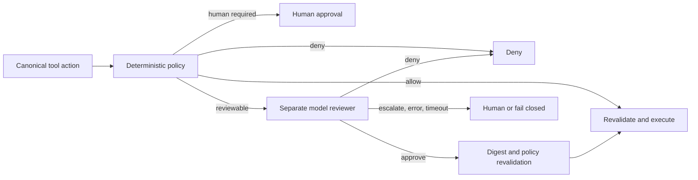

# Auto Permission Review Audit

**Status:** reference-snapshot
**Assessed:** 2026-07-26
**Question:** How do current coding agents reduce permission prompts with model
review, where does deterministic policy remain authoritative, and what should
Eino-Agent adopt?
**Result:** adopt a policy-first reviewer architecture; do not make the model
the permission authority

> **Ownership:** time-scoped source comparison, current-source gap evidence,
> and the `combine` recommendation. Current Eino-Agent behavior belongs in
> [`permissions.md`](../../../architecture/capabilities/permissions.md);
> accepted future behavior and order belong in
> [`p22-auto-permission-review.md`](../../plans/p22-auto-permission-review.md)
> and [`PLAN.md`](../../PLAN.md).

## Executive conclusion

“Auto permission” currently names three different products:

1. **deterministic policy plus human approval**, as in OpenCode and ordinary
   Codex/Copilot operation;
2. **bypass/autopilot**, which auto-approves or auto-denies prompts without a
   risk-review model; and
3. **policy plus a separate model reviewer**, as in Claude Code Auto and Codex
   Auto-review.

Only the third pattern answers the question in this audit, and its safe form is
not “let the model grant permissions.” The host first evaluates immutable
rules, protected resources, sandbox boundaries, and actions that always require
a person. A reviewer model may replace the person only for the remaining
reviewable requests. Its output is evidence consumed by the host; the host
still owns the capability and revalidates the exact action before execution.

Eino-Agent should therefore use `combine`:

- preserve the existing QueryEngine permission coordinator and deterministic
  precedence;
- adapt Claude Code's dedicated classifier, trust-separated context, protected
  operations, denial fallback, and subagent spawn/action/return checkpoints;
- adapt Codex's “reviewer swap, not permission grant” boundary, sandbox
  separation, exact request identity, timeout, and strict denial semantics;
- preserve OpenCode/Copilot-style explicit rule precedence; and
- add a project-native immutable action digest, shared policy-snapshot
  identity, process-local reviewer binding, entrypoint contract, and redacted
  audit event.

Broad bypass, a same-model self-review, raw transcript trust, speculative
approval, and generic approval caching are rejected for the first version.

## Evidence boundary

| Source | Snapshot |
|---|---|
| Eino-Agent | `46547f139b58eb7d8f9f12e3544954a4bb7ba29c` |
| Claude Code Ripe | `4b9d30f7953273e` |
| Codex | `66bd101fff6f` |
| OpenCode | `411eff73f` |
| Crush | `2af939d8e` |
| Official product documentation | retrieved 2026-07-26 |

Official current sources:

- Anthropic:
  [Choose a permission mode](https://code.claude.com/docs/en/permission-modes)
- OpenAI:
  [Auto-review](https://learn.chatgpt.com/docs/sandboxing/auto-review),
  [Running Codex safely at OpenAI](https://openai.com/index/running-codex-safely/),
  and
  [Alignment research on Auto-review](https://alignment.openai.com/auto-review/)
- GitHub:
  [Allowing tools in Copilot CLI](https://docs.github.com/en/copilot/how-tos/copilot-cli/use-copilot-cli/allowing-tools)
  and
  [Copilot CLI autopilot](https://docs.github.com/en/copilot/concepts/agents/copilot-cli/autopilot)
- Visual Studio Code:
  [Manage approvals and permissions](https://code.visualstudio.com/docs/agents/approvals)

Official documentation owns public product behavior. Local snapshots supply
implementation evidence where available; they do not override current product
documentation.

## First-principles model

A permission system answers whether one exact action may cross one exact
boundary under the current policy. The minimum identity is:

```text
decision = f(
  canonical action,
  normalized arguments,
  workspace and sandbox roots,
  caller/session/agent identity,
  entrypoint,
  policy snapshot identity,
  trusted user intent
)
```

An LLM is useful for the fuzzy part: “is this reviewable action expected by the
user and proportionate to the task?” It is unsuitable as the sole authority
because its input is partially attacker-controlled, its output is probabilistic,
and availability or parsing can fail. The non-negotiable split is:



The reviewer reduces human prompts; it does not expand the deterministic
authorization envelope.

## Comparative matrix

| Product / mode | Deterministic owner and review trigger | Reviewer input and output | Failure and escalation | Security boundary |
|---|---|---|---|---|
| Claude Code `auto` | Explicit rules run first. Protected paths are removed from the ordinary workspace-edit fast path and routed through their special classifier policy; organization-required connector approvals and tools marked `requiresUserInteraction` prompt a person directly. Read-only and ordinary workspace-edit cases take deterministic fast paths; other eligible actions reach the classifier. | User messages, tool calls, and project instructions are projected; tool results are stripped. The classifier returns an allow/block decision. Subagents are checked at spawn, action, and return boundaries. | Repeated denials fall back to a person; headless operation aborts when interaction is required. Classifier failure does not auto-allow. | Host policy remains authoritative. A classifier-specific model route is used by default, with documented availability/provider fallbacks, and broad allow rules do not silently erase protected boundaries. |
| Codex Auto-review | Sandbox policy first returns a deterministic skip, approval request, or forbidden result. Auto-review replaces the human only for a request already classified as needing approval, such as sandbox escalation, blocked network, outside-root access, or an approval-annotated MCP/app call. | A compact transcript and the exact action go to a separate reviewer. Hidden main-model reasoning is excluded. Structured approve/deny output includes a strict rationale; the reviewer may rarely make read-only checks. | A reviewer timeout or failure does not run the action. Repeated denials interrupt the loop. A narrow one-shot user override can be re-reviewed; policy-forbidden actions remain non-overridable. | Sandbox and approval policy remain the enforcement boundary. Auto-review is explicitly a reviewer swap, not an unconditional permission grant. |
| OpenCode | Ordered allow/ask/deny rules are evaluated for the action/resource, including per-agent rules. Explicit agent denials precede a saved allow. | No model permission reviewer was found in the current source path. | Pending requests decline on shutdown. | Deterministic rule engine and human interaction; Bash is not made safe by a model or sandbox in the inspected path. |
| GitHub Copilot CLI | Tool visibility is distinct from execution permission. Deterministic deny wins over allow, and the sandbox is a separate layer. | No permission-risk reviewer is documented. Allow-all and autopilot are autonomy choices, not model review. | In limited-permission autopilot, an action that still needs approval is automatically denied rather than reviewed. | Rules and sandbox. `--allow-all`/YOLO broadens authority and must not be described as Auto-review. |
| VS Code agents | Command rules, approval settings, and terminal sandboxing decide whether approval is needed. | Bypass Approvals and Autopilot auto-approve; the advanced autopilot model decides whether the task is complete, not whether a tool is safe. | Behavior follows the selected approval/sandbox mode. | Deterministic approvals and sandbox. Its “autopilot” label is not evidence for a permission classifier. |
| Eino-Agent current `auto` | `QueryEngine.wrapCanUseTool` applies Plan containment, explicit rules, modes, grants, path fast paths, two name-based allowlists, and then the classifier. | The primary `ChatModel` reviews raw tool input plus the last five non-empty message contents. One-stage text tags `<allow/>`/`<block/>` are parsed after thinking blocks are stripped. | Model error or `ask` falls back to prompting; malformed output denies. After 3 consecutive or 20 total denials, Auto falls back to prompting. Headless prompt absence denies. | QueryEngine is the host owner, but current Bash fast paths and classifier trust separation are insufficient for a security claim. |

## Current Eino-Agent execution path

The production owner is
[`QueryEngine.wrapCanUseTool`](../../../../engine/engine.go#L1946), invoked after
pre-tool input processing at
[`executeToolCall`](../../../../engine/tool_execution.go#L32). Its current order
is:

1. tool selection and Plan containment;
2. exact typed `ExitPlanMode` approval;
3. explicit deny, exact Plan-file capability, then explicit allow/ask;
4. bypass, default-permission-safe tools, and `dontAsk`;
5. scoped approvals, memory paths, and workspace reads/writes;
6. `acceptEdits` fast paths;
7. Auto name allowlist and the model classifier; and
8. interactive prompt or fail-closed unavailable-interaction result.

The classifier receives `e.config.ChatModel`, not a reviewer-specific model
route
([`engine.go`](../../../../engine/engine.go#L2958)). It receives no
reviewer-specific deadline. Production populates only `ChatModel`; the
classifier's allow, deny, environment, and project-context configuration fields
are not populated at that call site.

[`extractRecentContext`](../../../../engine/permission/classifier.go#L226)
copies the last five non-empty message `Content` values regardless of role.
The current focused test explicitly expects assistant prose to be included
([`classifier_edge_test.go`](../../../../engine/permission/classifier_edge_test.go#L76)).
This contradicts the earlier snapshot contract that said assistant prose would
not be treated as user intent.

At the audited source snapshot, two different Auto allowlists existed:

- `SafeAutoModeAllowlistedTools` in
  [`accept_edits.go`](../../../../engine/permission/accept_edits.go)
  is used directly by QueryEngine; and
- `SafeToolAllowlist` in
  [`classifier.go`](../../../../engine/permission/classifier.go) is
  checked again inside `ClassifyToolUse` and additionally contains web tools
  and `Agent`.

The wrapper deliberately excludes `Agent` from the `acceptEdits` shortcut, but
the second classifier allowlist can still approve it without a model call.
Network and child-agent authority therefore cannot be inferred from the first
allowlist alone.
P22.1b later removed both production name-only admission owners; this paragraph
is retained as promotion evidence rather than a current-source claim. Current
behavior and delivery evidence are in
[`permissions.md`](../../../architecture/capabilities/permissions.md) and
[`p22-1b-canonical-action-policy.md`](../../history/runtime/p22-1b-canonical-action-policy.md).

## Reproduced gaps

### G13: Bash `acceptEdits` is a prefix check, not containment

At the assessed commit, `AcceptEditsCheck` sent every Bash invocation to
`isBashFilesystemCommand`. That helper extracted only the first
whitespace-delimited token and auto-allowed
`mkdir`, `touch`, `rm`, `rmdir`, `mv`, `cp`, or `sed`. It does not parse command
composition, substitutions, wrappers, flags, paths, protected roots, or
symlink-resolved effects.

The assessed test intentionally expected `rm -rf /tmp/test` to return true.
The same function therefore also returned true for `rm -rf /`, an outside-root
copy, or a compound command beginning with an allowed token. Both
`acceptEdits` and `auto` called this shortcut before prompting or model review.

This is an active authorization failure, not merely missing classifier
quality. P22.H0 must remove the Bash auto-allow path before any reviewer rollout.
Building a partial shell parser inside the permission prompt is not an
acceptable hot fix.

> **Current replacement (2026-07-26):** P22.H0 subsequently removed this
> first-token Bash path. Current behavior is documented in
> [`permissions.md`](../../../architecture/capabilities/permissions.md), and
> delivery evidence is in
> [`p22-h0-bash-containment.md`](../../history/runtime/p22-h0-bash-containment.md).
> The source links and wording above remain the assessed snapshot.

### G14: current classifier is not a separated reviewer boundary

Current behavior has four coupled risks:

1. the actor model and reviewer model are the same configured object;
2. assistant prose and tool-result content can influence the decision as if
   they were trusted intent;
3. raw inputs and free-form verdict tags have no versioned review schema,
   action digest, policy revision, or final revalidation contract; and
4. duplicated name allowlists bypass review for authority-bearing surfaces such
   as `Agent` and network tools.

Malformed tag output is fail-closed and complete/unterminated thinking sections
are stripped; those are useful foundations. They do not establish protection
against instruction injection in the remaining context or bind a decision to a
stable action identity.

The package also contains `ToolRiskClassifier`, `Evaluator`,
`SpeculativeClassifier`, handlers, and cache primitives that are not the
production owner above. They should be characterized and consolidated or
deleted, not promoted as evidence that a second policy layer is already wired.

## Feasibility re-review

The original evidence boundary above is retained for provenance. P22.1a was
rechecked on 2026-07-27 at Eino-Agent
`ddaf0e4d646012b43206258e6bef18b1e87f33fc`; Claude Code Ripe
`4b9d30f79532`, Codex `66bd101fff6f`, and OpenCode `411eff73f026` remain frozen
local reference evidence, not claims about current upstream behavior. Official
product documentation was not rechecked for this promotion. P22.1a promotes
only policy decision and identity characterization, not reviewer enforcement.
Five implementation constraints are explicit:

1. [`executeToolCall`](../../../../engine/tool_execution.go) can apply
   `PermissionResult.UpdatedInput` after permission settlement, but the current
   path then repeats only the Plan check before dispatch. P22 must return any
   updated input to the complete permission cycle; P22.1b owns that decision
   cycle and P22.2a later binds reviewer results to it. This is not a P22.1a
   current-behavior claim.
2. [`RulesEngine.Snapshot`](../../../../engine/permission/rules.go) exposes
   only detached rules. The existing
   [`projectGraphPolicyRevision`](../../../../engine/graph_hitl.go) already
   hashes rules, approvals, mode, Plan state, root session, roots, and tool
   selection. P22.1a must adapt it into one QueryEngine-owned effective-policy
   snapshot builder rather than add another counter or adapter-local hash.
   Capability generation, reviewer-policy version, and child scope remain
   reserved, not current inputs.
3. [`wrapCanUseTool`](../../../../engine/engine.go) currently installs no
   check when both permission callbacks are absent. This is the documented
   library `CallerAuthoritative` / `NoInvocationPolicyInstalled` boundary, not
   one of P22's four authorization decisions. P22.1a must characterize it and
   prove TUI, plain, headless, ACP, and child roots do not use it. A later
   enforcement slice may change the contract only through explicit promotion.
4. A worktree child loads its own rules/root, creates its own QueryEngine, and
   currently forwards parent interaction callbacks
   ([`subagent.go`](../../../../engine/subagent.go)). The child must own its
   canonical action, policy snapshot, and reviewer request; the parent may
   present/transport the interaction but cannot compute a competing identity.
   P22.1a proves only the installed-policy composition-root boundary; child
   reviewer enforcement remains later work.
5. Current classifier status events are transient runtime projection, not a
   durable evaluation ledger. Shadow promotion requires one explicit,
   redacted, bounded audit sink with defined denominators and retention.
   Shadow is off by default because it still sends projected data, consumes
   provider capacity, and incurs cost.

The re-review also rejects sending an internal raw request directly to the
model. Exact normalized arguments, absolute host paths, action digests, and
policy bindings remain process-local. The reviewer receives only an opaque
request/tool-call/binding identity plus a data-minimized projection using
relative/root facts and typed redactions. Pending requests/results are not
checkpointed; restart creates a fresh request after current-policy evaluation.

## Threat model

P22 must cover:

- malicious repository text, tool output, web content, or MCP metadata asking
  the reviewer to ignore policy;
- a main model justifying its own requested side effect;
- shell composition, substitutions, wrappers, aliases, redirections, and path
  escape;
- changed tool input, CWD, roots, policy, session, or Agent identity between
  review and execution;
- destructive Git, credential, production, IAM, deployment, package-manager,
  and database operations;
- network exfiltration and connector/app actions that require a person;
- unavailable reviewer, timeout, cancellation, malformed/ambiguous output, and
  late response;
- child-agent spawn, each child action, and return-context injection; and
- secret leakage through prompts, logs, telemetry, or denial messages.

P22 does not claim that a reviewer detects every unsafe action. OS sandboxing,
tool schemas, explicit rules, protected-resource policy, and human-required
operations remain separate controls.

## Adoption decision

The decision is `combine`.

| Mechanism | Decision | Reason and compatibility consequence |
|---|---|---|
| QueryEngine deterministic ordering and exact Plan capability | `preserve` | It is the current production authority and already protects explicit deny and Plan invariants. |
| Claude dedicated classifier, trust-separated transcript, protected operations, denial fallback, and child checkpoints | `adapt` | Preserve the behavior, not Anthropic-specific prompt/schema or broad compatibility identity. |
| Codex reviewer-swap boundary, structured identity, timeout, strict deny, and sandbox separation | `adapt` | Keep the host as authority and make unavailability non-executing. |
| OpenCode/Copilot explicit deterministic rule precedence | `preserve` | User policy must beat probabilistic review. |
| Immutable canonical action, process-local digest, shared policy-snapshot identity, entrypoint identity, and redacted audit event | `project-native` | These bind review to this Go/Eino runtime and its QueryEngine/ProjectGraph lifecycle without exporting raw action identity. |
| Bypass/autopilot as an Auto implementation | `reject` | It removes review rather than improving it. Existing explicit bypass remains a separate confirmed mode. |
| Same primary model as actor and reviewer | `reject` for enforcement | It enables self-review and couples availability/cost/failure domains. |
| Raw assistant prose or tool results as trusted intent | `reject` | They are untrusted evidence and a prompt-injection path. |
| Speculative approval and general decision cache in v1 | `defer` | Exact identity, cancellation, and false-allow evidence must exist first. |
| Broad Auto without a sandbox | `reject` | Reviewer quality cannot replace containment. V1 keeps high-risk actions human-required or denied. |

## Evidence still required before enforcement

- A canonical action descriptor for each built-in, MCP, and child-agent
  operation; tool names alone are insufficient.
- One shared effective-policy snapshot owner spanning ordinary and ProjectGraph
  permission settlement.
- A provider-owned separate reviewer factory/route, explicit data-boundary
  configuration, and a bounded timeout.
- A versioned structured-output schema exercised across supported providers.
- A trust-projection corpus that proves assistant/tool/repository injection is
  untrusted and cannot create user authority.
- Exact process-local action digest and current policy-snapshot revalidation
  immediately before execution.
- TUI, plain, headless, ACP, and child-agent failure matrices.
- A bounded redacted shadow-audit owner with explicit denominator, retention,
  and deletion semantics.
- Shadow-mode measurements for latency, escalation rate, disagreement with
  human decisions, and every observed false allow. The promotion threshold must
  be recorded from measured evidence rather than invented in this snapshot.

Standalone MCP remains a separate boundary because it does not use QueryEngine.
It must not inherit an Auto claim until it has an explicit policy owner.
