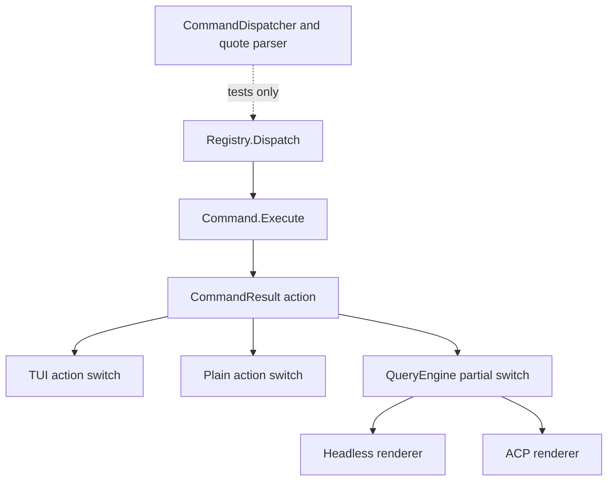

# Command Surface Audit

**Status:** reference-snapshot
**Snapshot:** 2026-07-18; Eino-Agent and six local reference repositories

> **Ownership:** this report owns the source-backed command inventory,
> cross-reference comparison, command-by-command recommendation, and decision
> rationale. Current implementation belongs in
> [`architecture/capabilities/commands.md`](../../../architecture/capabilities/commands.md),
> current execution order belongs in [`migration/PLAN.md`](../../PLAN.md), and
> the completed P16 contract is retained in
> [`migration/plans/p16-command-surface.md`](../../plans/p16-command-surface.md).

## Answer

> **Superseded current-state boundary:** this snapshot records the pre-P16
> Eino-Agent implementation and remains the historical P16 decision basis. The
> post-P16 `master` audit and accepted P21 simplification decision are in
> [`command-surface-simplification-audit.md`](command-surface-simplification-audit.md).

**Adoption decision: `combine`.** Eino-Agent should expose a small, layered
control surface rather than optimize for command count or copy one reference
registry. The selected mechanisms are:

- Codex's typed availability and event dispatch;
- Pi's session lifecycle, compaction-record, and lineage semantics, implemented
  on Eino-Agent-owned persistence rather than Pi's storage mechanism;
- OpenCode's service-owned reversible history marker;
- Crush and Pi's separation of UI actions from dynamic prompt commands;
- Grok Build's fail-closed gates and atomic runtime command snapshot;
- Claude Code's command metadata as a breadth reference, without inheriting its
  vendor/account/experiment complexity.

The immediate problem is correctness, not missing features. Eino-Agent has 66
canonical built-ins, but registration currently conflates four different
claims:

1. the name appears in `/help`;
2. the command can execute on the current entrypoint;
3. its action has one authoritative owner;
4. the advertised user outcome is durable and true.

Those claims are not equivalent. The highest-priority work is therefore to
remove unsafe or false affordances and establish one typed command contract
before adding more commands.

The practical target is ranked explicitly below. In particular, current
`/undo`, `/rewrite`, `/branch`, and `/rewind` are not accepted as near-term core
merely because they are registered. They remain hidden or unavailable until a
durable replay and rollback contract exists.

## Audit Boundary

| Repository | Verified revision | Reviewed command surfaces |
|---|---|---|
| Eino-Agent | working tree on 2026-07-18 | Cobra CLI, built-in slash registry, plugin prompt commands, TUI/plain/headless/ACP projections |
| Claude Code Ripe | `4b9d30f79532` | CLI command tree, external slash registry, dynamic commands and gates |
| Codex | `800715d20165` | Rust CLI subcommands, TUI slash enum and dispatcher |
| Crush | `3446255daa02` | dynamic Markdown/MCP/skill commands and Bubble Tea command palette |
| OpenCode | `4a760b574349` | v2 CLI, global/session/composer TUI commands, dynamic commands |
| Pi | `c6d8371521fc` | built-in slash list, interactive assembly, package-management CLI |
| Grok Build | `b189869b7755` | shell CLI and pager slash registry |

The reference inventory records externally discoverable names from the reviewed
registries. Some Claude and Grok commands remain runtime-gated by platform,
account, experiment, or internal context. Their presence is evidence of a
product surface, not a recommendation or proof that every user can invoke it.

## Evaluation Method

A command must pass three admission gates before its product value is ranked:

1. **owner:** one engine/service owns the state and side effect;
2. **truth:** help, availability, execution, and output agree on every declared
   entrypoint;
3. **recovery:** cancellation, partial failure, restart, and rollback have an
   explicit terminal state.

Candidates that pass are ordered by task leverage, expected frequency, existing
Eino-Agent foundation, cross-entrypoint reuse, implementation cost, and
external coupling. The ranking is deliberately qualitative: a high-value name
still stays hidden if its owner or recovery boundary is missing.

| Outcome family | User value | Current foundation | Main risk/cost | Product rank |
|---|---|---|---|---|
| Session start/resume/compact/fork | High and frequent | Session catalog, transcript, compact and fork paths exist | Split action ownership and incomplete replay atomicity | **A: build first** |
| Model/plan/permission control | High and safety-sensitive | Real engine state exists | Generic `/mode`, duplicate application and capability drift | **A: build first** |
| Status/context/usage/config | High diagnostic leverage | Most source data exists | Estimated or hard-coded claims can look authoritative | **A: build first** |
| Diff/files/workspace scope | Medium-high daily value | Real workspace operations exist | Path policy and terminal capability gates | **B: build after core owner** |
| Skills/agents/MCP/plugin reload | Medium-high extensibility value | Registries and atomic plugin replacement exist | Dynamic collisions and runtime/tool snapshot drift | **B: capability-gated** |
| TUI theme/search/keymap/queue panels | Useful but entrypoint-local | Bubble Tea owners already exist | False cross-entrypoint parity | **B: TUI-only/palette** |
| Prompt recipes | Useful and cheap to evolve | Plugin prompt commands already exist | Compiled-name sprawl and hidden external side effects | **B: bundled dynamic workflows** |
| Undo/redo/rewrite/branch/rewind | High recovery value if correct | Partial live-memory operations only | Durable replay, file restore and rollback are unresolved | **C: hide and defer** |
| Hosted share/update/marketplace/media/account | Low project fit today | No owned backend/policy | Security, auth, distribution and ongoing operations | **Reject/defer** |

## Reference Implementation Findings

The useful comparison unit is a state transition, not a command name.

### Codex: typed catalog and service-owned lifecycle

- `SlashCommand` declares description, inline-argument support, side-conversation
  availability, active-task availability, platform/debug visibility, and an
  intentionally frequency-ordered catalog in
  `.reference/codex/codex-rs/tui/src/slash_command.rs`.
- discovery applies feature and runtime gates before offering commands, while a
  fully typed unavailable invocation can still receive a precise error through
  `.reference/codex/codex-rs/tui/src/bottom_pane/slash_commands.rs`.
- dispatch converts compact, rename, review, approval, session, and destructive
  operations into typed app events rather than mutating TUI-local copies;
  session resume/fork uses the thread store and replay path.
- archive/delete confirmation and active-task tests make the safety boundary
  observable.

**Assessment:** adopt typed metadata, one event/service owner, and common
availability logic. Do not copy experimental/cloud/app-server commands.

### Pi: lifecycle, lineage, and durable compaction semantics

- interactive commands delegate to `AgentSession`, `AgentSessionRuntime`, and
  `SessionManager`; the renderer does not own session persistence.
- compaction emits start/end lifecycle events, supports cancellation and
  extension interception, appends a compaction record, and rebuilds context
  from the durable boundary in
  `.reference/pi/packages/coding-agent/src/core/agent-session.ts`.
- fork/clone validates the selected tree entry, creates a child with parent
  lineage, switches runtime only after creation succeeds, and emits a session
  start reason in
  `.reference/pi/packages/coding-agent/src/core/agent-session-runtime.ts`.
- static commands, prompt templates, extensions, and user-invocable skills are
  assembled into one discoverable list with collision diagnostics.

**Assessment:** best reference for `/compact`, lineage, and a compact dynamic
surface. Adopt lifecycle and log semantics, not Pi's tree-storage mechanism or
large interactive dispatcher.

### OpenCode: reversible history under the session service

- the TUI calls `session.revert`/`session.unrevert`; it does not delete its own
  message slice. A persisted revert marker controls redo availability in
  `.reference/opencode/packages/tui/src/routes/session/index.tsx`.
- compact calls the session summarize service and refuses early when no
  provider/model is available.
- built-in `init` and `review` are injected as data-driven command templates by
  `.reference/opencode/packages/core/src/plugin/command.ts`; command state can
  be transformed and reloaded as a generation.

**Assessment:** adopt the service-owned reversible marker when durable session
events exist, and use data-driven built-in workflows. Do not adopt hosted share,
org, or service-process commands.

### Crush: palette actions separated from prompt commands

- fixed UI operations such as new/switch session live in the Bubble Tea command
  palette, while project/user Markdown commands, MCP prompts, and
  user-invocable skills are loaded as prompt actions.
- `internal/session/session.go` owns create/list/save/rename/delete and publishes
  lifecycle events; the palette is only a projection.
- MCP execution carries session, permission, and working-directory context;
  unavailable tools and denied permissions return explicit terminal results.

**Assessment:** best Go/Bubble Tea fit for separating TUI actions from slash
contracts and for dynamic Markdown/MCP/skill adapters. Its loader's silent
per-file skip must become aggregated diagnostics in Eino-Agent.

### Grok Build: fail-closed runtime registry

- `CommandRegistry` tracks canonical name, aliases, usage, argument requirements,
  source, session scope, tool requirements, and separate completion/dispatch
  visibility in
  `.reference/grok-build/crates/codegen/xai-grok-pager/src/slash/registry.rs`.
- commands return typed `Action` values; runtime state is not mutated in the
  command object.
- dynamic ACP commands and the advertised tool set are replaced in one registry
  rebuild; required-tool commands remain fail-closed before the tool handshake.
- model/effort and fork parsers have focused invalid/unsupported tests.

**Assessment:** adopt atomic generation replacement and fail-closed dependency
gates. Collapse Grok's multiple visibility sets into one typed availability
reason, and do not copy its pager/shell dual ownership.

### Claude Code: mature breadth, excessive coupling

- the registry combines static, bundled, workflow, plugin, and skill commands,
  then recomputes auth/provider/feature availability on each discovery request
  in `.reference/claude-code-ripe/src/commands.ts`.
- command metadata distinguishes local, UI, prompt, source, availability,
  sensitivity, aliases, and invocation behavior.
- compaction runs hooks, cancellation, cleanup, cache-baseline reset, and
  explicit progress; branch copies lineage and supporting transcript metadata.
- remote and bridge entrypoints maintain explicit allowlists because a local
  picker cannot be invoked safely from a remote text client.

**Assessment:** use the schema and edge cases as evidence, not its command count
or provider/account-specific surfaces. Callback-heavy local implementations and
parallel allowlists would recreate the ownership drift P16 is intended to
remove.

## Current Eino-Agent Command Model

### CLI commands

| Surface | Current behavior | Assessment |
|---|---|---|
| `eino-agent [prompt]` | Starts TUI by default; the positional prompt is ignored unless `-p` is also set. | Ambiguous; add explicit `exec` and keep `-p` as a compatibility path. |
| `eino-agent resume <session-id>` | Resumes a project-scoped session into TUI. | Useful; retain under a coherent session CLI group. |
| `eino-agent serve acp` | Runs the ACP stdio server. | Preserve. |
| `eino-agent serve mcp` | Runs the standalone MCP stdio server. | Preserve, but stop inheriting unrelated provider/model/mouse flags. |
| `completion`, `help` | Generated by Cobra. | Preserve. |

### Production dispatch is split

Verified consequences:

- production uses `Registry.Dispatch`, which splits only the first whitespace
  boundary and does not call `ValidateArgs`; the quote-aware
  `CommandDispatcher` exists but has no production construction path;
- TUI and plain mode each apply command actions independently, while
  `QueryEngine` handles only a subset;
- headless and ACP can dispatch slash commands but do not project normal
  terminal command output;
- standalone MCP intentionally exposes tools, not conversation commands;
- `/help` advertises commands without knowing the active entrypoint or whether
  the required runtime dependency exists.

### All 66 canonical built-ins

`Implementation route` names the ordered P16 slices that own the command; a
future dependency gate is explicitly not an accepted slice. `Keep` means the
user outcome is valuable, not that its current implementation is already
correct on every entrypoint.

| Command | Verified current reality | Decision | Implementation route |
|---|---|---|---|
| `/help` | Lists visible registry entries without entrypoint or availability filtering. | `adapt`: capability-aware help and palette | P16.2 |
| `/clear` | Works through the engine/TUI path; plain calls `SetResumedMessages(nil)`, which is a no-op. | `adapt`: append a reset boundary without deleting prior transcript | P16.0 -> P16.3 -> P16.4a |
| `/compact` | Engine/TUI path is real; plain has no compact action handler. | `adapt`: one engine-owned compact result | P16.0 -> P16.3 -> P16.4a |
| `/status` | Useful runtime summary, but overlaps config/context/usage output. | `combine`: keep health summary, link detail commands | P16.5b |
| `/model` | Model override is wired; listing and validation are not fully provider-aware. | `adapt` | P16.2 -> P16.5a |
| `/mode` | A generic string currently means permission mode and is applied by multiple entrypoints. | `combine` into typed `/permissions`; remove the ambiguous top-level name | P16.1 -> P16.5a |
| `/resume` | Real project-scoped session resume; selector is TUI-specific. | `preserve` with typed entrypoint projection | P16.3 -> P16.4a |
| `/export` | TUI exports; plain only prints a resume hint; other entrypoints are inconsistent. | `combine` into `/sessions export`; keep a compatibility shortcut | P16.3 -> P16.4a -> P16.7b |
| `/terminal` | Useful capability diagnostics. | `preserve` as TUI-only | P16.2 -> P16.5c |
| `/suspend` | Useful TUI/terminal lifecycle action. | `preserve` as TUI-only | P16.2 |
| `/quit` | Useful interactive exit. | `preserve` as interactive-only | P16.2 |
| `/version` | Useful build identity. | `preserve` and expose consistently in CLI | P16.7a |
| `/stats` | Treats message count as token usage. | `combine` into truthful `/usage` | P16.5b |
| `/history` | Useful session history, overlaps resume/session. | `combine` into `/sessions`; keep compatibility alias | P16.4a |
| `/context` | Useful context inspection. | `preserve`; detailed usage view | P16.5b |
| `/settings` | Contains stale providers/defaults and overlaps status/cost. | `combine` into redacted `/config`; keep alias temporarily | P16.5b |
| `/bug` | Opens/proposes feedback without a verified delivery owner on all environments. | `defer`: hide unless a delivery owner is configured | P16.1; future dependency gate |
| `/diff` | Useful workspace result. | `preserve` | P16.2 -> P16.5c |
| `/copy` | Useful interactive projection. | `preserve` as capability-gated | P16.2 -> P16.5c |
| `/init` | Creates Claude-shaped configuration and then injects a prompt. | `adapt`: Eino/AGENTS project-native initialization | P16.5c |
| `/permissions` | Valuable safety control; quoted rules can be corrupted by production parsing. | `adapt`: typed arguments and canonical parser | P16.0 -> P16.2 -> P16.5a |
| `/hooks` | Useful inspection/configuration surface. | `preserve`, with explicit mutation ownership | P16.2 -> P16.5d |
| `/doctor` | Useful outcome, but provider/default/config claims are stale. | `adapt`: source-derived diagnostics | P16.5b -> P16.7c |
| `/commit` | Compiled prompt macro rather than runtime control. | `adapt`: bundled dynamic workflow command | P16.6 |
| `/plan` | Valuable permission/runtime mode. | `preserve`, apply once in engine | P16.3 -> P16.5a |
| `/bypass` | Valuable explicit risk mode, but confirmation differs by entrypoint. | `combine` into `/permissions bypass`; remove `/yolo` wording | P16.1 -> P16.5a |
| `/memory` | Useful, but editor launch and arbitrary-path behavior need lifecycle/scope rules. | `adapt` | P16.5c |
| `/add-dir` | Useful workspace-scope expansion. | `preserve` with canonical path/safety checks | P16.3 -> P16.5c |
| `/rename` | Useful session metadata. | `combine` into `/sessions rename`; keep a compatibility shortcut | P16.3 -> P16.4a |
| `/tasks` | Useful task/background visibility. | `preserve` | P16.5d |
| `/effort` | Useful when the active provider/model supports it. | `adapt`: provider capability gate | P16.5a |
| `/skills` | Useful dynamic capability discovery. | `preserve` | P16.5d |
| `/agents` | Useful custom-Agent management. | `combine` with agent/team metadata | P16.5d |
| `/agent` | TUI owns thread selection/create/edit actions. | `adapt`: keep as TUI picker, not universal runtime control | P16.2 -> P16.5d |
| `/mcp` | Listing is useful; add/connect can report success without updating model-visible tools. | `adapt`: inspect first; mutations need atomic registry synchronization | P16.5d -> P16.7c; future dependency gate |
| `/team` | TUI-local orchestration panel/action. | `combine` into `/agents` or palette | P16.1 -> P16.5d |
| `/rewind` | Always unavailable because production constructs no `FileTracker`. | `defer`: hide until snapshot persistence and tracker wiring exist | P16.1; future dependency gate |
| `/rewrite` | TUI-local selector; durability and other entrypoints are incomplete. | `defer`: hide until a durable reversible-history contract exists | P16.1; future dependency gate |
| `/queue` | TUI intercepts it before registry dispatch. | `adapt`: register the real TUI contract or remove registry duplication | P16.2 |
| `/files` | Useful workspace/file context view. | `preserve` | P16.2 -> P16.5c |
| `/cost` | Uses a fixed four-chars/token heuristic and generic prices independent of provider/model. | `combine` into `/usage`; omit money without authoritative pricing | P16.5b |
| `/review` | Compiled prompt macro. | `adapt`: bundled dynamic workflow command | P16.6 |
| `/pr-comments` | Compiled prompt macro. | `adapt`: bundled dynamic workflow command | P16.6 |
| `/vim` | Real TUI composer mode. | `preserve` as TUI-only | P16.2 |
| `/theme` | Real TUI theme switch. | `preserve` as TUI-only | P16.2 |
| `/color` | Emits `color`, while the TUI reads only `theme`; advertised change is not applied. | `reject` current surface | P16.1 |
| `/tag` | Stores only an in-memory TUI field; no persistence or search uses it. | `defer`: hide until a real metadata/search owner exists | P16.1; future dependency gate |
| `/branch` | Partially duplicates fork while its identity/switching contract is less clear. | `defer`: prefer one durable `/fork` first | P16.1; future dependency gate |
| `/fork` | Command returns `new_session_id`; plain reads `session_id` and does not switch. | `adapt` | P16.0 -> P16.3 -> P16.4b |
| `/undo` | Command truncates once, then plain truncates again; transcript durability is incomplete. | `defer`: stop false execution now, restore with service-owned marker | P16.0 -> P16.1; future dependency gate |
| `/login` | Primarily reports environment/config guidance; no unified owned auth session. | `combine` into provider-aware config/auth diagnostics | P16.5b -> P16.7c |
| `/logout` | Deletes files in project and user `.claude` credential directories that Eino-Agent does not own. | `reject` and disable immediately | P16.H0 -> P16.1 |
| `/terminal-setup` | Static key-help text, not terminal setup. | `combine` into `/keybindings` or `/terminal` | P16.1 -> P16.5c |
| `/keybindings` | Useful TUI-local help; TUI intercepts it. | `preserve` as TUI-only | P16.2 -> P16.5c |
| `/fast` | Toggles an in-memory field with no model-routing consumer. | `reject` current surface; future capability is separate | P16.1; future dependency gate |
| `/env` | Hidden legacy environment report. | `reject`: delete after compatibility check | P16.1 |
| `/output-style` | Hidden legacy placeholder. | `reject`: delete after compatibility check | P16.1 |
| `/share` | Constructs a URL without creating or verifying a shared session. | `defer`: hide until a secure backend contract exists | P16.1; future dependency gate |
| `/session` | Hidden legacy remote alias, not a coherent session manager. | `combine` into `/sessions` | P16.4a |
| `/release-notes` | Hard-coded v0.1.0 content rather than build/release data. | `reject` current surface | P16.1; future dependency gate |
| `/plugin` | Prints list/install/uninstall help but performs no operation. | `defer`: hide; add only trusted, real subcommands | P16.1 -> P16.5d -> P16.7c; future dependency gate |
| `/reload-plugins` | Real atomic prompt-command snapshot reload. | `preserve` | P16.5d -> P16.6 |
| `/summary` | Compiled prompt macro. | `adapt`: bundled dynamic workflow command | P16.6 |
| `/issue` | Compiled prompt macro. | `adapt`: bundled dynamic workflow command | P16.6 |
| `/onboarding` | Compiled prompt macro overlapping initialization. | `combine`: workflow plus project-native `/init` | P16.5c -> P16.6 |
| `/commit-push-pr` | Compiled prompt macro with broad external side effects. | `adapt`: opt-in bundled workflow command | P16.6 |

Canonical aliases are: `/reset` and `/new` for `/clear`, `/exit` for `/quit`,
`/ctx` for `/context`, `/config` for `/settings`, `/feedback` for `/bug`,
`/allowed-tools` for `/permissions`, `/yolo` for `/bypass`, `/bashes` for
`/tasks`, `/teams` for `/team`, `/retry` for `/rewrite`, `/remote` for hidden
`/session`, and `/cpr` for `/commit-push-pr`. `/new` is the material semantic
conflict: references consistently treat it as a new session, not destructive
clear, so P16.1 removes that alias before P16.4a introduces a real `/new`.

The TUI also implements `/search` locally without registering it, so it is
absent from help and completion. P16.2 should register it as a TUI-only command
instead of preserving a hidden command vocabulary.

## Reference Command Inventories

### Comparison by product strategy

| Reference | Command strategy | Outcomes worth adopting | Surfaces to reject or defer |
|---|---|---|---|
| Claude Code | Very broad fixed registry plus dynamic plugin/skill/MCP commands and many runtime gates. | Mature session/context/safety/extension workflows; explicit CLI administration. | Hosted, billing, growth, employee-only, media, and vendor-auth surfaces; raw command count as a target. |
| Codex | Typed Rust enums/lists with explicit dispatch and feature gates; CLI and TUI have distinct owners. | Availability-aware registry, explicit `new/archive/delete/fork`, sandbox/approval, diagnostics, plugin/MCP administration. | Experimental/debug/cloud/app-server surfaces without a project problem. |
| Crush | Dynamic Markdown, MCP prompt, and skill commands; fixed UI actions live in a palette rather than pretending to be slash commands. | Make prompt workflows data-driven; separate UI actions from conversational runtime commands. | Treating a palette-only action as cross-entrypoint slash parity. |
| OpenCode | Small global TUI core plus session/composer actions and dynamic commands. | Scope commands by global/session/composer owner; share/undo/redo only when the session service owns them. | Service/org/share features without an equivalent backend and policy. |
| Pi | Small explicit slash list plus dynamic templates/extensions/skills. | Compact discoverable core, session tree operations, provider-scoped model/auth handling. | Pi's storage/renderer mechanism as an automatic architecture target. |
| Grok Build | Large pager registry plus separate shell CLI, with product/account/platform gates. | Session lifecycle, plan/context/usage/task inspection, explicit command registry metadata. | Voice/media/marketplace/dashboard/hosted commands and dual-owner complexity absent a user need. |

### Externally discoverable names

- **Claude CLI:** `mcp` (`serve`, `add`, `remove`, `list`, `get`, `add-json`,
  `add-from-claude-desktop`, `reset-project-choices`), `auth` (`login`, `status`,
  `logout`), `plugin` (`validate`, `list`, `marketplace`, `install`, `uninstall`,
  `enable`, `disable`, `update`), `setup-token`, `agents`, `doctor`,
  `update`/`upgrade`, `install`, and `completion`.
- **Claude slash:** `add-dir`, `advisor`, `agents`, `branch`, `btw`, `chrome`,
  `clear`, `color`, `compact`, `config`, `copy`, `desktop`, `context`, `cost`,
  `diff`, `doctor`, `effort`, `exit`, `fast`, `files`, `heapdump`, `help`, `ide`,
  `init`, `keybindings`, `install-github-app`, `install-slack-app`, `mcp`,
  `memory`, `mobile`, `model`, `output-style`, `remote-env`, `plugin`,
  `pr-comments`, `release-notes`, `reload-plugins`, `rename`, `resume`, `session`,
  `skills`, `stats`, `status`, `statusline`, `stickers`, `tag`, `theme`,
  `feedback`, `review`, `ultrareview`, `rewind`, `security-review`,
  `terminal-setup`, `upgrade`, `extra-usage`, `rate-limit-options`, `usage`,
  `insights`, `vim`, `thinkback`, `thinkback-play`, `permissions`, `plan`,
  `privacy-settings`, `hooks`, `export`, `sandbox-toggle`, `login`, `logout`,
  `passes`, and `tasks`, plus dynamically loaded entries.
- **Codex CLI:** `exec`/`e`, `review`, `login`, `logout`, `mcp`, `plugin`,
  `mcp-server`, `app-server`, `remote-control`, `app`, `completion`, `update`,
  `doctor`, `sandbox`, `debug`, `apply`/`a`, `resume`, `archive`, `delete`,
  `unarchive`, `fork`, `cloud`, `exec-server`, and `features`.
- **Codex slash:** `model`, `ide`, `permissions`, `keymap`, `vim`,
  `setup-default-sandbox`, `sandbox-add-read-dir`, `experimental`, `approve`,
  `memories`, `skills`, `import`, `hooks`, `review`, `rename`, `new`, `archive`,
  `delete`, `resume`, `fork`, `app`, `init`, `compact`, `plan`, `goal`, `agent`,
  `side`, `btw`, `copy`, `raw`, `diff`, `mention`, `status`, `usage`,
  `debug-config`, `title`, `statusline`, `theme`, `pets`, `mcp`, `apps`,
  `plugins`, `logout`, `quit`, `exit`, `feedback`, `rollout`, `ps`, `stop`,
  `clear`, `personality`, `test-approval`, `subagents`, `debug-m-drop`, and
  `debug-m-update`.
- **Crush:** no fixed text-command parity list. It loads `user:` and `project:`
  Markdown commands, MCP prompts, and skills; fixed actions such as new/switch
  session are command-palette actions.
- **OpenCode CLI:** `api`, `debug agents`, `migrate`, `service` (`start`,
  `restart`, `status`, `stop`, `password`), and `serve`.
- **OpenCode TUI:** global `sessions`/`resume`/`continue`, `new`/`clear`,
  `workspaces`, `models`/`mo`, `agents`, `mcps`, `variants`, `connect`,
  `org`/`orgs`/`switch-org`, `status`, `debug`, `themes`, `help`, and
  `exit`/`quit`/`q`; prompt `editor`, `skills`, `warp`, `move`; session `share`,
  `unshare`, `new`, `undo`, `redo`, `compact`, `fork`, `open`, `terminal`, and
  `mcp`; composer `model` and `agent`; plus project/user/plugin/skill/MCP entries.
- **Pi slash:** `settings`, `model`, `scoped-models`, `export`, `import`, `share`,
  `copy`, `name`, `session`, `changelog`, `hotkeys`, `fork`, `clone`, `tree`,
  `trust`, `login`, `logout`, `new`, `compact`, `resume`, `reload`, and `quit`,
  plus templates, extensions, and skills. Its CLI mainly exposes flags and
  package install/remove/update/list/config operations.
- **Grok CLI:** `agent`, `inspect`, `logout`, `login`, `mcp`, `plugin`, `memory`,
  `models`, `sessions`, `setup`, `share`, `wrap`, `export`, `trace`, `update`,
  `version`/`v`, `completions`, `worktree`, `workspace`, and `dashboard`.
- **Grok slash:** `exit`, `help`, `docs`, `home`, `new`, `fork`, `compact`,
  `copy`, `find`, `history`, `export`, `transcript`, `expand`, `context`,
  `minimal`, `fullscreen`, `model`, `effort`, `always-approve`, `auto`,
  `multiline`, `compact-mode`, `vim`, `hooks`, `plugins`, `marketplace`,
  `skills`, `share`, `session-info`, `rename`, `dashboard`, `cd`, `theme`,
  `feedback`, `announcements`, `remember`, `plan`, `view-plan`, `resume`, `mcps`,
  `btw`, `recap`, `terminal-setup`, `voice`, `loop`, `imagine`, `imagine-video`,
  `timestamps`, `toggle-mouse-reporting`, `settings`, `privacy`, `rewind`,
  `login`, `logout`, `import-claude`, `usage`, `queue`, `tasks`, `release-notes`,
  `config-agents`, `personas`, `gboom`, `scroll-debug`, and `debug`.

## Selection And Ordering

### Product selection rules

1. Keep a command only when it owns a user outcome, not merely formatted text.
2. A command advertised on an entrypoint must execute there or fail before
   dispatch with a precise availability reason.
3. Runtime mutation executes exactly once under the engine/service owner; TUI,
   plain, headless, and ACP only project the typed result.
4. Compiled built-ins are reserved for session, context, safety, runtime, and
   administration contracts. Prompt recipes belong in dynamic bundled command
   packs.
5. Auth, share, update, plugin installation, and destructive actions require an
   owned store/service, explicit trust boundary, and rollback story before they
   are visible.
6. Compatibility aliases are hidden, time-bounded, and never preserve the wrong
   semantic contract, as `/new -> /clear` currently does.

### Ranked practical target

The target is layered so a local UI action does not imply ACP/headless parity,
and a prompt recipe does not gain privileged runtime execution.

| Rank | Surface | Selected commands/outcomes | Boundary |
|---|---|---|---|
| A1 | Daily session core | `/help`, `/new`, `/clear`, `/compact`, `/sessions`, `/resume`, `/fork` | Engine/session service owns mutation, persistence, switching, lineage and replay. Slash `/resume` remains the canonical direct shortcut; `/sessions` owns list/search plus `rename` and `export`. Cobra uses `sessions resume`. |
| A2 | Execution and safety | `/model`, `/effort`, `/plan`, `/permissions` | Provider/model capability gates are evaluated before execution. `/permissions` owns typed modes including bypass; generic `/mode`, top-level `/bypass`, and `/yolo` do not remain canonical. |
| A3 | Truthful diagnostics | `/status`, `/context`, `/usage`, `/config`; shared `doctor` and `version` services | Values come from active runtime/session/config sources, include freshness/unknown state, and never infer money or secrets. |
| B1 | Workspace productivity | `/diff`, `/files`, `/copy`, `/add-dir`, `/init`, `/memory` | Path, terminal, workspace and permission capabilities are explicit. `/init` is project-native and prompt workflows do not bypass normal tools. |
| B2 | Extensibility and orchestration inspection | `/tasks`, `/agents`, `/skills`, `/mcp`, `/hooks`, `/reload-plugins` | Read/inspect first. Mutations become visible only after persisted config, atomic reload and runtime generation synchronization succeed together. |
| B3 | TUI-only action/palette | `/theme`, `/vim`, `/keybindings`, `/terminal`, `/search`, `/suspend`, `/quit`; Agent/team/queue pickers | Hidden from plain/headless/ACP discovery. UI actions may call shared services but do not own durable state. `/team` and `/queue` need not remain universal slash names. |
| B4 | Bundled dynamic workflows | `/review`, `/commit`, `/summary`, `/issue`, `/pr-comments`, `/onboarding`, `/commit-push-pr` | Versioned prompt data loaded atomically; source/trust visible; ordinary tool permission remains authoritative. |
| C | Dependency-gated recovery | `/undo`, future `/redo`, `/rewrite`, `/branch`, `/rewind` | Hidden until append-only reversible session events, restart replay, idempotence and, for rewind, workspace snapshot restoration are proved. Prefer undo/redo before rewrite/rewind. |
| D | Reject, defer or consolidate | `/stats`, `/cost`, `/settings`, `/bug`, `/color`, `/fast`, `/tag`, `/share`, `/release-notes`, `/plugin`, `/logout`, `/terminal-setup`, `/env`, `/output-style`, hidden legacy `/session` | Consolidate truthful data into retained owners; hide ownerless delivery, placeholders, stale text, backend-free effects and foreign-store deletion. |

### Administration CLI

The reusable services above should also back:

- `eino-agent exec`;
- `eino-agent sessions {list,resume,rename,export,fork}`;
- `eino-agent serve {acp,mcp}`;
- `eino-agent config show`, `doctor`, `version`, and `completion`;
- initially, `eino-agent mcp {list,get}` and
  `eino-agent plugins {list,validate,reload}`.

MCP add/remove and plugin install/uninstall/enable/disable remain gated until a
persisted change, runtime reload, model-visible registry generation, and
rollback form one success boundary. Marketplace, hosted share, updater, media,
cloud, account, service-daemon, and employee/internal surfaces remain deferred
or rejected. Session archive/delete also remain gated until an owned store,
confirmation policy, atomic failure boundary, and recovery/retention contract
are accepted.

Do not use a target command count. The acceptance metric is that every visible
command is truthful, useful, safe, reachable on its declared entrypoints, and
covered by a deterministic contract test.

## Evidence

| Boundary | Source evidence |
|---|---|
| Current command/action types and registry | [`engine/commands/registry.go`](../../../../engine/commands/registry.go) |
| Retired richer dispatcher and parser evidence | [`P16.2 completion record`](../../history/runtime/post-parity.md#p162-canonical-command-contract) |
| TUI command interception and action application | [`internal/tui/app.go`](../../../../internal/tui/app.go) |
| Plain action application | [`cmd/eino-agent/cmd/root.go`](../../../../cmd/yhc/cmd/root.go) |
| Headless output projection | [`cmd/eino-agent/cmd/headless.go`](../../../../cmd/yhc/cmd/headless.go) |
| ACP output projection | [`server/acp/agent.go`](../../../../server/acp/agent.go) |
| Historical unowned credential deletion | [`executeLogout` before P16.H0](https://github.com/abietic/eino-agent/blob/b6e1a3df2597ec0e1acd4db75c336f5593f8f780/engine/commands/cmd_logout.go#L12) |
| Current architecture replacement | [`architecture/capabilities/commands.md`](../../../architecture/capabilities/commands.md) |

Reference evidence was inspected in `.reference/claude-code-ripe/src/commands.ts`,
`.reference/claude-code-ripe/src/main.tsx`,
`.reference/codex/codex-rs/tui/src/slash_command.rs`,
`.reference/codex/codex-rs/tui/src/chatwidget/slash_dispatch.rs`,
`.reference/codex/codex-rs/tui/src/app_event_sender.rs`,
`.reference/codex/codex-rs/cli/src/main.rs`,
`.reference/crush/internal/commands/commands.go`,
`.reference/crush/internal/ui/dialog/commands.go`,
`.reference/crush/internal/session/session.go`,
`.reference/opencode/packages/tui/src/app.tsx`,
`.reference/opencode/packages/tui/src/routes/session/index.tsx`,
`.reference/opencode/packages/core/src/command.ts`,
`.reference/opencode/packages/core/src/plugin/command.ts`,
`.reference/pi/packages/coding-agent/src/core/slash-commands.ts`,
`.reference/pi/packages/coding-agent/src/core/agent-session.ts`,
`.reference/pi/packages/coding-agent/src/core/agent-session-runtime.ts`,
`.reference/pi/packages/coding-agent/src/modes/interactive/interactive-mode.ts`,
`.reference/grok-build/crates/codegen/xai-grok-pager/src/slash/registry.rs`, and
`.reference/grok-build/crates/codegen/xai-grok-pager/src/slash/commands/` at
the revisions above.

## Compatibility Consequences

- `/new` stops clearing the current conversation and becomes a true new-session
  operation; `/reset` remains a temporary clear alias.
- `/mode`, `/bypass`, and `/yolo` converge on typed `/permissions`; `/rename`
  and `/export` converge on `/sessions` while temporary shortcuts remain
  semantically equivalent.
- `/undo`, `/rewrite`, and `/branch` become unavailable before they are restored
  under durable session events; current registration does not justify keeping
  their incomplete behavior visible.
- commands hidden in P16.1 may still be reachable only through an explicit
  compatibility flag during the deprecation window; unsafe `/logout` receives
  no such execution fallback.
- plain/headless/ACP gain output or explicit unsupported errors for advertised
  commands; they do not gain TUI panels.
- moving prompt macros out of the compiled registry changes implementation and
  discovery, not their prompt outcome; collision and atomic reload rules remain
  project-owned.
- standalone MCP remains a tool server and is explicitly excluded from slash
  parity.
