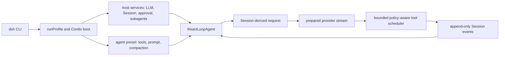
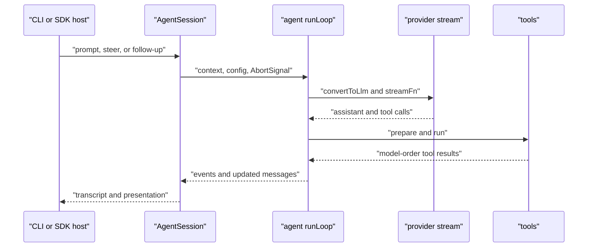

# DeepSeek Harness, Pi, and Platform Architecture Audit

**Status:** reference-snapshot
**Snapshot:** DeepSeek Harness `b150a551b8d4`; Pi `a69bef789bc9`; Codex `2161ec272a7d`; YHC `41c4b5ad2a32`; 2026-08-24
**Adoption:** `adapt`

> **Ownership:** comparative evidence for how DeepSeek Harness and Pi compose
> an agent runtime, interpreted through OpenAI's Codex-as-a-platform boundary.
> Current YHC behavior belongs in [`architecture/`](../../../architecture/README.md);
> executable order belongs in [`PLAN.md`](../../PLAN.md).

The decision is selective: preserve YHC's single `QueryEngine`/ProjectGraph
runtime, adapt a versioned JSONL lifecycle projection for bounded headless
consumers, and leave a platform-neutral Host Session API until a real embedding
consumer freezes its lifecycle. DeepSeek Harness (DSH) provides strong evidence
for event-sourced composition and cancellation settlement; Pi provides a
smaller production Session/runtime. Neither is a replacement specification.

This page must be refreshed when either pinned commit changes, when Pi wires
its generic `AgentHarness` into the coding agent, or when YHC changes its
production composition roots.

## Three systems choose different ownership boundaries

| Boundary | DeepSeek Harness | Pi production coding agent | YHC consequence |
|---|---|---|---|
| Composition | Cordis profile patches assemble host services and an agent preset | CLI/SDK factories assemble one `AgentSession` and runtime host | Preserve explicit Go composition; reject a dynamic patch tree |
| Agent loop | `ReactLoopAgent` derives requests from append-only Session events | `runLoop` owns provider/tool iterations while `AgentSession` owns the product shell | Preserve ProjectGraph as the only production traversal |
| Provider seam | `LlmRuntime.prepareCall` plus adapter waterfall before stream | Injected `streamFn`; conversion occurs at the LLM boundary | Preserve exact-model routing and adapter lowering; adapt immutable pre-call preparation |
| Tool scheduling | Exclusive barrier, bounded parallel pool, model-order commit, synthetic cancelled result | Sequential or `Promise.all` execution, then model-order results | Later `adapt` candidate: prove every announced call settles after cancellation |
| Session authority | Append-only events plus serialized write-behind persistence | Production JSONL `SessionManager`; generic SQLite/harness work is separate | Preserve YHC transcript/replay authority |
| Host protocol | ACP and SDK surfaces consume committed Session events | Interactive, print, RPC, SDK, and server surfaces wrap `AgentSession` | First expose a stable outbound stream; defer a new daemon/API |

## How DeepSeek Harness executes a turn

The production root is `apps/cli/src/bin.ts` →
`profile-boot.ts:runProfile` → `dsh-app-boot.boot`. The profile combines a
bundle, user profile, home configuration, CLI overlay, and telemetry patch
before starting the service tree. That makes host/preset separation explicit,
but also couples runtime composition to a TypeScript dynamic plugin framework.

`packages/core/agent-loop/src/agent.ts:ReactLoopAgent` claims inbox work,
appends a turn boundary, and builds each model request from Session-derived
state. `LlmRuntime.prepareCall` resolves the adapter and request facts before
streaming. `packages/core/agent-loop/src/tool-calls.ts:executeToolCalls` writes
tool-call facts before dispatch, observes exclusive barriers and a bounded
parallel pool, then commits results in model order.

Cancellation is more than stopping goroutines. DSH drains started work and
adds `TOOL_ABORTED_BEFORE_DISPATCH` for announced calls that never started, so
the durable Session still explains every model-issued call. ACP waits for
admission, agent idle, and ordered output settlement before completing a
prompt. The implementation and corresponding cancellation, ACP, and Session
tests support this as a verified behavior, not merely a design goal.

## Which Pi architecture is actually running

The production path is `packages/coding-agent/src/main.ts` →
`createAgentSessionRuntime` → `createAgentSessionFromServices` →
`createAgentSession`. `AgentSessionRuntime.teardownCurrent` aborts the active
Session, runs extension shutdown, and disposes resources before resume, new, or
fork replacement.

Pi's `packages/agent/src/harness/AgentHarness` is not this path. At the pinned
snapshot, `create.restore`, `prompt`, `compact`, `resume`, `abort`, `watch`,
and `runToCompletion` reject with `HarnessNotImplemented`, and scaffold tests
assert that fact. Its interfaces are future design evidence only. Claims about
Pi Session recovery must come from the production coding-agent and
`SessionManager`, not the generic harness name.

## Codex's platform boundary sharpens the decision

OpenAI's official
[Codex as a platform](https://developers.openai.com/blog/codex-as-a-platform)
article assigns conversation state, streamed execution, tools, sandbox and
approval handling to the harness while the host application owns business UI,
business context, records, and consequential controls. It distinguishes three
integration layers:

1. bounded `exec` for scripts and CI with structured output;
2. an SDK for programmatic start, resume, and stream workflows; and
3. app-server for persistent product integration, interruption, tools, and
   approval requests.

YHC already has the underlying runtime facts: `QueryEngine.SubmitMessage`
publishes ordered `QueryEvent` identities; Sessions are durable; ACP owns a
real multi-Session protocol; and permissions remain engine-authoritative.
Before P52.1, however, `exec --output-format json` returned only one final
object, while `engine/transport` compiled outside production closure. That is
a concrete bounded-consumer gap. It is not evidence that YHC needs another
long-running server.

## Adoption decisions

| Decision | Candidate | Consequence |
|---|---|---|
| `preserve` | `QueryEngine`, ProjectGraph, exact provider routing, transcript/replay, and permission authority | No reference loop, Session store, or approval owner replaces current YHC behavior |
| `adapt` | P52.1 versioned `exec --output-format jsonl` lifecycle stream | Reuse committed canonical assistant/tool projections, bounded identity, and exactly one classified result; retain text/JSON compatibility |
| `combine` | DSH cancelled-tool settlement plus Pi model-order result commit | Record as a later runtime candidate; first prove YHC's current cancellation behavior and non-cooperative tool deadline semantics |
| `project-native` | Opaque business-record revision and refresh hints | Host must remain system-of-record owner; only consider after a real consumer defines refresh behavior |
| `reject` | DSH Cordis/profile/HMR composition replacing Go/Eino construction | It introduces a second composition authority without removing a YHC owner |
| `reject` | Pi generic `AgentHarness` as a working recovery implementation | The named runtime is an explicit scaffold at this snapshot |
| `defer` | New Host Session daemon/SDK and DSH experimental Agent Team | Public API, concurrency, persistence, permission, and recovery contracts are not yet frozen by a consumer |

P52.1 deliberately emits explicit assistant text because the caller requested
an output stream and existing text/JSON modes already expose the final answer.
Tool payloads come only from the validated canonical projection, which applies
the engine's credential redaction. Legacy assistant/tool events are skipped to
avoid duplicates; invalid canonical payloads and invalid UTF-8 fail closed.
Headless remains non-interactive and cannot fabricate an approval.

## Evidence and current owners

| Boundary | Evidence |
|---|---|
| DSH CLI composition | DeepSeek Harness `apps/cli/src/bin.ts`, `apps/cli/src/profile-boot.ts:runProfile` at `b150a551b8d4` |
| DSH loop and ordered tools | `packages/core/agent-loop/src/agent.ts:ReactLoopAgent`; `tool-calls.ts:executeToolCalls` |
| DSH Session persistence | `packages/core/session/src/index.ts`; `packages/session/session-persistence/src/coordinator.ts` |
| Pi production root | Pi `packages/coding-agent/src/main.ts`, `core/agent-session-runtime.ts`, `core/sdk.ts` at `a69bef789bc9` |
| Pi running loop | `packages/agent/src/agent-loop.ts:runLoop` and `executeToolCalls` |
| Pi scaffold exclusion | `packages/agent/src/harness/agent-harness.ts:AgentHarness` and `agent-harness-scaffold.test.ts` |
| YHC turn authority | [`QueryEngine.SubmitMessage`](../../../../engine/engine.go) and [`QueryEvent`](../../../../engine/events.go) |
| YHC canonical safe projection | [`CanonicalProjectionEvent`](../../../../engine/projection_lifecycle.go) |
| P52.1 outward projection | [`ProjectLifecycleEvent`](../../../../engine/transport/lifecycle_jsonl.go) |
| P52.1 process adapter | [`runHeadless`](../../../../cmd/yhc/cmd/headless.go) |

## Verification boundary

This audit traced production roots, helpers, and focused tests in both local
references. It did not run either full upstream suite or a live provider. DSH's
event-order and cancellation behavior is source/test verified at the pinned
commit; Pi's generic harness is source/test verified as a scaffold. Any later
commit may invalidate those facts.

## Recommendation

**`adapt`: keep P52.1 as the only accepted implementation from this audit.**
It supplies the smallest useful platform seam without changing the agent loop,
permissions, persistence, ACP, or public daemon lifecycle. A Host Session API
or cancelled-tool settlement slice requires a separate reproduced outcome and
contract.
