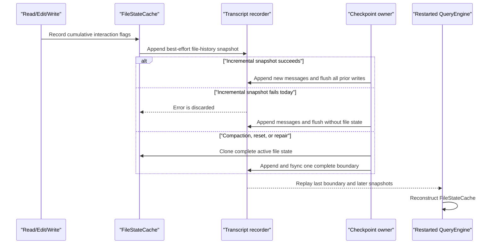

# File-State Checkpoint Recovery Audit

**Status:** reference-snapshot
**Snapshot:** 2026-07-31; Eino-Agent
`902cbd444e5a10ed93854be6d99e6c8a06fe0f07`, Claude Code Ripe
`4b9d30f79532`, and Codex `66bd101fff6f`

> **Ownership:** source-backed evidence for deciding whether normal transcript
> checkpoints lose the file-interaction state needed by restart recovery.
> Current transcript behavior belongs in
> [`transcripts.md`](../../../architecture/state/transcripts.md), unresolved
> workspace rollback belongs in [`REMAINING.md`](../../REMAINING.md), and
> executable work belongs in [`PLAN.md`](../../PLAN.md).

## Decision

Use `preserve`: keep the current append-only transcript, complete lifecycle
boundary, replay reader, and QueryEngine checkpoint owner. Repair only the
missing failure handoff between incremental file-snapshot persistence and the
next checkpoint decision.

The former G1 mechanism is disproved: no supported production checkpoint path
calls `Recorder.ReplaceWithReplacements`. A narrower data-integrity failure is
reproduced instead. `maybeRecordFileState` discards an incremental snapshot
append error, so a later ordinary message append and `Flush` can succeed
without the cumulative file state. P34.1 must force a complete checkpoint
after that failure without turning an already successful file tool into a
failed or repeated action.

## Observable Question

After a successful Read, Edit, or Write followed by a normal turn checkpoint,
manual compaction, reset, or terminal repair, can a restarted QueryEngine
recover which files the model read, edited, or wrote?

This question covers the interaction-provenance map used by
`FileStateCache`. It does not cover original file bytes, workspace rollback,
branching, undo/redo, or `/rewind`.

## Current Production Flow

`maybeRecordFileState` updates the cumulative cache after successful
file-related tool execution and appends a `file-history-snapshot`. That
incremental append is useful audit evidence, but its error is currently
ignored at tool execution and it is not yet a durability commit point. When
the append succeeds, the next successful `recordTranscriptMessages` call adds
new messages and calls `Recorder.Flush`, which syncs the snapshot with them.
When the snapshot append fails first, that same later flush cannot persist a
record that was never written.

When append-only persistence cannot represent the active state, or when
compaction/reset installs a replacement state,
`QueryEngine.recordTranscriptBoundary` and the `/compact` command instead
snapshot the same cache into `RecordLifecycleBoundaryWithUsage`. That recorder
path appends one complete boundary and syncs the open file plus any pending
parent-directory creation before returning.

`LoadFull` replays records in order. A lifecycle boundary replaces the active
message, replacement, and file-state projection; every later incremental file
snapshot then extends it. Initial construction and explicit Session resume
both call `reconstructFileStateCache` with the recovered snapshots.

## Evidence Matrix

| Source | Verified mechanism | Consequence |
|---|---|---|
| Eino-Agent ordinary checkpoint | File tools append a cumulative snapshot; the next message checkpoint calls `Flush`, syncing a successfully appended snapshot and the new messages together | Happy-path restart recovery works without a full checkpoint |
| Eino-Agent snapshot failure | `maybeRecordFileState` discards the append error; later message append and `Flush` can succeed | The narrower G1 failure is real and requires a full-checkpoint repair signal |
| Eino-Agent lifecycle boundary | One replacement-state record carries messages, replacements, file states, and cumulative usage and is fsynced before live publication | Compaction, reset, and repair recover one coherent active generation |
| Eino-Agent compatibility API | `ReplaceWithReplacements` rebuilds only message records plus an optional content-replacement record; repository production code has no caller | The API can discard auxiliary audit records, but this is not a supported-entrypoint checkpoint path |
| Claude Code Ripe | File-history snapshots carry a message ID and backup-version map; append records distinguish new snapshots from updates, and replay rebuilds the chain in conversation order | Useful identity evidence for a future content-level rewind design, not a replacement for the current interaction cache |
| Codex | Compaction request attempts and installation of replacement history are separate events tied to one compaction identity | Supports the rule that a completed request is not a state commit until one explicit checkpoint installs it |

The Claude mechanism persists file-content backup versions and supports
workspace restoration. Eino-Agent's `FileStateCache` persists only boolean
interaction provenance. Treating the two records as equivalent would create a
false rollback claim.

## Compatibility Rewrite Boundary

`Recorder.Replace`, `ReplaceWithReplacements`, and `AtomicReplace` are
exported compatibility APIs and fixtures may use them to replace the JSONL
authority. Their documented contract permits prior audit lines to disappear.
At this snapshot, repository search finds no supported production caller of
`ReplaceWithReplacements`; all direct calls are tests.

Changing that API to infer and retain old auxiliary state would be unsafe:
the caller has not supplied an atomic generation for messages, replacements,
file state, metadata, usage, or media bindings. Deleting or redesigning an
exported helper also needs separate compatibility evidence. Neither action
repairs the reproduced incremental-write failure, so P34.1 does not change it.

## Separation From Workspace Rewind

G2 remains independent. The current `FileStateCache` cannot restore a file:
it contains no content bytes, digest, mode, external-modification identity,
or partial-failure state. The process-local `filehistory.FileTracker` is not
constructed by a production composition root, and `/rewind` remains a
non-executable tombstone.

A future workspace rollback decision must first define snapshot identity,
content authority, confirmation, permissions, external-change detection,
idempotence, partial failure, and recovery. Correct persistence of interaction
flags is necessary provenance but not rollback capability.

## Evidence Limits

- This audit proves current repository reachability and deterministic replay;
  it does not claim that external module consumers never call the exported
  compatibility rewrite APIs.
- No kill-window or physical power-loss experiment was run. The failure is
  deterministic from the discarded error path; P34.1 requires an injected
  writer failure rather than a timing- or disk-pressure-based test.
- Claude's snapshot append is fire-and-forget at its caller. Its source proves
  identity and replay shape, not fsync-level durability.

## Source Anchors

| Boundary | Evidence |
|---|---|
| File interaction update and incremental append | [`maybeRecordFileState`](../../../../engine/tool_execution.go#L801), [`Recorder.RecordFileHistorySnapshot`](../../../../engine/transcript/persist.go#L1253) |
| Ordinary append checkpoint and flush | [`QueryEngine.recordTranscriptMessages`](../../../../engine/engine.go#L2166), [`Recorder.Flush`](../../../../engine/transcript/persist.go#L1190) |
| Complete fsynced boundary | [`QueryEngine.recordTranscriptBoundary`](../../../../engine/engine.go#L2123), [`Recorder.RecordLifecycleBoundaryWithUsage`](../../../../engine/transcript/persist.go#L808) |
| Active replay selection | [`loadTranscriptFileContextMode`](../../../../engine/transcript/persist.go#L397) |
| Construction and Session restore | [`NewQueryEngine`](../../../../engine/engine.go#L278), [`QueryEngine.resumeSessionWithOptionsForTurn`](../../../../engine/engine.go#L4854), [`QueryEngine.reconstructFileStateCache`](../../../../engine/engine.go#L5594) |
| Compatibility rewrite behavior | [`Recorder.ReplaceWithReplacements`](../../../../engine/transcript/persist.go#L1101), [`Recorder.prepareRewriteEntriesLocked`](../../../../engine/transcript/entry_identity.go#L433) |
| Existing lifecycle proof | [`TestQueryEngineNormalCheckpointsAppendMessagesWithoutFullStateDuplication`](../../../../engine/engine_transcript_test.go), [`TestCompactBoundaryRestoresSnapshotAndAuxiliaryState`](../../../../engine/transcript/persist_test.go#L465), [`TestCommandExecutorCompactAppendsExactlyOneDurableBoundary`](../../../../engine/command_executor_test.go#L1030) |
| Current architecture owner | [`transcripts.md`](../../../architecture/state/transcripts.md) |
| Accepted repair contract | [`p34-file-state-checkpoint-repair.md`](../../plans/p34-file-state-checkpoint-repair.md) |
