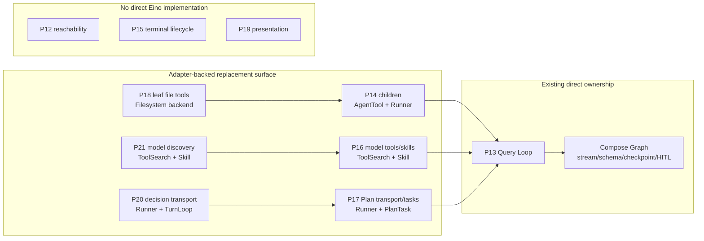

# P12-P21 Eino Adoption Review

**Status:** reference-snapshot
**Snapshot:** 2026-07-26; `origin/master`
`1dbfc13c2e39a370a035bc2be91326d1e2d3085c`; Eino pinned `v0.9.12`;
latest stable Eino `v0.9.13`
(`c5e6aef927cca02bea934541f8dff2ea711b2ca7`)

> **Ownership:** this report reviews Eino adoption coverage across P12-P21. It
> does not define runtime truth or schedule work. Verified facts belong in
> [`migration/STATUS.md`](../../STATUS.md), confirmed unresolved gaps belong in
> [`migration/REMAINING.md`](../../REMAINING.md), and accepted execution order
> belongs only in [`migration/PLAN.md`](../../PLAN.md).

The exact adapter contracts, old-to-Eino mapping, deletion conditions,
equivalence suite, provider update matrix, and staged migration candidates are
in
[`p12-p21-eino-lossless-replacement-design.md`](p12-p21-eino-lossless-replacement-design.md).

## Corrected conclusion

The earlier Query Loop review did not complete a P12-P21-wide assessment, and
the first version of this report made an additional mistake: it treated the
absence of a one-to-one Eino primitive as evidence that adapter-backed
replacement was unsuitable.

The corrected conclusion is:

- P13 already transfers graph traversal, stream/schema and durable HITL
  transport to Eino Compose.
- Stable `Runner`, `TurnLoop`, `ChatModelAgent`, model retry/failover,
  `ToolsNode` extension points, Summarization, Reduction, PatchToolCalls,
  ToolSearch, Skill, PlanTask, Filesystem and AgentTool expose enough hooks to
  migrate most remaining Query Loop **mechanics**.
- Stronger project semantics are not blockers. They become typed adapters,
  middleware, backends, stores and supervisors around the Eino-owned path.
- P12, P15 and P19 have no overlapping Eino implementation. No old
  reachability, terminal or presentation logic could be deleted by adding an
  Eino layer.
- P14, P16, P17, P18, P20 and P21 have partial overlap. Their reusable
  invocation, transport, task, file, skill and model-tool mechanics can
  migrate, while durable child, user command, Plan product, worktree and UI
  semantics remain project-owned.

The target is therefore deeper staged Eino ownership with equivalence proof,
not a permanent duplicate project loop and not an SDK-import percentage.

## Review standard

A capability is replaceable when Eino plus a bounded project adapter can:

1. produce the same terminal, event, transcript and entrypoint behavior;
2. preserve the same side-effect prefix under stream truncation, cancellation,
   retry, denial, interruption and restart;
3. preserve ordering, identity, permission, durability, replay and parallelism;
4. allow deletion of the old mechanical owner after cutover.

A capability is a non-overlap only when Eino provides no implementation at the
same semantic layer and an Eino wrapper would delete no old logic.

## Baseline

| Baseline | Verified state | Review consequence |
|---|---|---|
| `origin/master` at `1dbfc13c2e39` | P12-P19 are historical/completed baselines. P20 delivery exists and G10 is reopened under P20.R1-P20.R3. P21 is accepted and queue-paused after its documentation-only PR #115; its runtime remains unimplemented. | Current production and accepted-ledger authority. |
| P21 baseline | The merged P21 contract changes documentation only; it does not change Go source, the command runtime, or Eino dependencies. | Its accepted target is PLAN truth, not current runtime behavior. |
| Core Eino | Project pins `v0.9.12`; stable `v0.9.13` is current at this snapshot; `v0.10` is alpha. | Qualify the stable patch independently before runtime-owner changes. |
| Eino-ext | Agentic providers are integrated through the project provider bridge. Several pinned modules have newer stable releases. | Provider qualification is part of migration readiness, not an implicit `go.mod` update. |

## Program-wide map



## P12-P21 matrix

| Program | Current owner/outcome | Replaceable through Eino | Required retained adapter or concrete non-overlap | Verdict |
|---|---|---|---|---|
| **P12 disconnected TUI removal** | Historical unreachable-code removal | None | Eino has no source reachability/dead-code lifecycle; adding it removes no old logic. | Historical non-overlap. |
| **P13 ProjectGraph kernel** | Compose is the sole production traversal owner; project canonical functions own the ReAct policy plane | Runner, TurnLoop, ChatModelAgent, retry/failover, ToolsNode mechanics, summarization, reduction, patching and callbacks | Query trace, complete-stream commit, stable batching, permission, recovery and persistence expressed as adapters | Deeper mechanical replacement is feasible. |
| **P14 async children** | `AgentRunner` owns foreground/background child durability, identity, steering, detach and monitoring | AgentTool for foreground invocation; Runner per child; internal event forwarding | `EinoAgentSupervisor` retains background durability, transcript/output/worktree binding and restart behavior | Adapter-backed replacement. |
| **P15 terminal resilience** | Bubble Tea command/write/shutdown/PTTY lifecycle | Eino events can feed the UI only | No Eino terminal-delivery, PTY, wake-up or shutdown API | Integration, not replacement. |
| **P16 commands/services** | User command registry, entrypoint projection and services | ToolSearch for model-visible tools; Skill middleware for model skill/workflow invocation; Eino-ext provider controls | Registry remains user-command authority for TUI/plain/headless/ACP metadata and availability | Partial replacement. |
| **P17 Plan runtime** | Engine Plan phase, approval, exact file scope, persistence and return mode | Runner checkpoint/resume transport, TurnLoop preemption, PlanTask CRUD mechanics | Reviewed digest, typed decisions, permission precedence and live revalidation | Adapter-backed replacement. |
| **P18 worktrees** | Git worktree identity, CWD binding, dirty handoff, cleanup and recovery | Filesystem middleware can replace leaf list/read/write/edit/grep/glob tools | Worktree-rooted backend; Git lifecycle stays in `WorktreeService` | Partial replacement. |
| **P19 TUI identity** | Theme, semantic rendering, width/geometry and interaction | None beyond consuming events | Eino has no theme, layout, viewport, caret, hit-test or display-cell API | Presentation non-overlap. |
| **P20 Plan interaction** | Feedback/bypass/cancel, two-step confirmation, focus/caret/editor and entrypoint projection | Runner/TurnLoop can replace interrupt/resume transport | Typed user intent and UI/product settlement remain adapters | Transport replacement. |
| **P21 command simplification** | User command discovery and layered/phase-aware navigation | ToolSearch/Skill can replace model-side deferred tool/skill disclosure | Slash-command palette/help/aliases/availability remain Registry projections | Partial replacement. |

## Query Loop fit

The current production path is:

```text
Query
  -> productionQueryKernel
  -> projectGraphQueryKernel
  -> compiled compose.Graph
  -> canonical prepare/model/after-model/tool/after-tool functions
```

Compose already owns traversal, but the canonical functions still implement a
second reusable ReAct machinery that can be transferred in stages:

| Current mechanics | Stable Eino destination | Project contract mapped through |
|---|---|---|
| Direct graph invocation and resume | Runner | `projectAgent` over ProjectGraph, then ChatModelAgent; `ProjectCheckPointStore` |
| Runtime input polling/preemption | `TurnLoop[RuntimeItem]` | `GenInput`, `GenResume`, `PrepareAgent`, `OnAgentEvents` and the durable runtime-item store |
| Model input/retry/failover | ChatModelAgent plus model middleware | `GenModelInput`, state rewrite hooks, retry/failover classifiers and event commit wrapper |
| Stable tool rounds | ToolsNode plus tool wrappers | Invocation-local schedule gate preserves model order, safe parallel batches and unsafe barriers |
| Permission/hooks/continuation | Tool-call middleware and `AfterToolCallsHook` | Existing ordered policy pipeline and typed control state/sentinel translation |
| Compaction/reduction/repair | Summarization, Reduction, PatchToolCalls | Custom triggers, backends, handlers and patched-message generator |
| Dynamic tools/skills/tasks/files | ToolSearch, Skill, PlanTask, Filesystem | Project Registry/SkillRegistry/TaskStore/WorktreeService backends |
| Nested agents | AgentTool plus Runner | Durable project supervisor for background identity, output, steering and restart |

The current `AfterToolCallsHook` surface returns only an error, so typed
continue/return/interrupt requires invocation-local control state plus a
dedicated sentinel/outer translation. This is a concrete adapter requirement,
not a reason the replacement cannot work. Acceptance must prove that terminal
or interrupt decisions cause no extra model call.

## What cannot be claimed yet

“Feasible without intentional behavior loss” is a design result. It is not yet
runtime proof. The following must exist before deleting an owner:

- oracle traces for text, parallel/barrier tools, truncation, cancellation,
  permission, Plan, retry/failover, return-direct and structured output;
- runtime-item priority/replay/dedup and cold-resume fixtures;
- foreground/background child, detach, steering and restart fixtures;
- user image/PDF/mixed-content provider conversion fixtures;
- normalized equality of `QueryEvent`, transcript, model/tool counts,
  happens-before relations, side-effect logs and resume identity;
- race and cancellation/interrupt contention tests;
- a rollback that does not require irreversible durable-data migration.

Shadow comparison may use fake models and fake tools. Real side-effecting tools
must never execute twice.

## Current source-backed defects and update candidates

1. `messagesToAgentic` drops user `UserInputMultiContent`, so Agentic providers
   can lose image/file-like input.
2. The project pins Eino `v0.9.12`, while stable `v0.9.13` includes a relevant
   immediate interrupt/cancellation ordering correction. It requires a
   dependency-only canary; similarity alone does not prove the project
   reproduces the upstream race.
3. A production-unreachable non-deferred tool branch remains in the canonical
   model round and should be deleted after reachability and trace proof.
4. Graph callbacks are not yet projected into one correlated internal
   lifecycle span.
5. Several Agentic provider modules have newer stable releases and must be
   qualified against request/stream conversion and fallback fixtures.

These are review candidates. This report does not promote them to PLAN,
REMAINING or STATUS.

## Recommended direction

The detailed design uses independently rollbackable cuts:

1. dependency and provider qualification;
2. Runner facade over the current ProjectGraph;
3. callbacks, retry/failover, patching, summarization and reduction;
4. tool wrappers, ToolSearch and the stable schedule gate;
5. ChatModelAgent shadow comparison and production cutover;
6. TurnLoop runtime-input cutover;
7. AgentTool, Skill, PlanTask and Filesystem leaf migrations;
8. end-to-end Agentic messages.

Every completed cut must delete its old mechanical owner. Plans P12-P21 should
not be relabeled retroactively as migration percentages; accepted future slices
should instead name the exact owner transferred and the exact project contract
retained in an adapter.

## Overall adoption recommendation

**Recommendation: `combine`.**

Move reusable run, turn, ReAct, model, tool, middleware, checkpoint and
composition mechanics into stable Eino APIs. Preserve project-specific
permission, recovery, durable child, Plan, Git worktree, terminal, TUI and
user-command semantics through narrow adapters and stores. P12, P15 and P19
remain non-overlapping product work because Eino has no implementation that
could replace their old owner.
